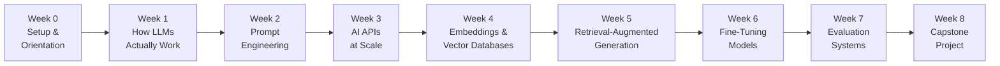

# Course 1: Foundations of AI Engineering

> From zero to production-quality LLM applications. Covers transformers, prompt engineering, APIs at scale, embeddings, RAG, fine-tuning, and evaluation.

## Prerequisites

- Python basics (functions, classes, pip, virtual environments)
- REST APIs (making HTTP requests, understanding JSON responses)
- Command line usage (navigating directories, running scripts)

---

## Learning Progression

---

## Table of Contents

| Week | Title | Theme |
|------|-------|-------|
| [Week 0: Setup & Orientation](week0-setup-orientation.md) | Setup | Get your environment working before you learn a single concept |
| [Week 1: How LLMs Actually Work](week1-llm-foundations.md) | LLM Foundations | Build intuition before writing code |
| [Week 2: Prompt Engineering](week2-prompt-engineering.md) | Prompting | Prompting is programming |
| [Week 3: Working with AI APIs at Scale](week3-ai-apis-scale.md) | APIs at Scale | From single calls to real applications |
| [Week 4: Embeddings and Vector Databases](week4-embeddings-vectors.md) | Embeddings | Give your AI long-term memory |
| [Week 5: Retrieval-Augmented Generation (RAG)](week5-rag.md) | RAG | Teach your AI to use external knowledge |
| [Week 6: Fine-Tuning Models](week6-fine-tuning.md) | Fine-Tuning | When prompting isn't enough |
| [Week 7: Introduction to Evaluation Systems](week7-evaluation.md) | Evaluation | If you can't measure it, you can't improve it |
| [Week 8: Capstone — AI-Powered Study Companion](week8-capstone.md) | Capstone | Bring it all together |

---

## What You'll Build

- **Verified Working Environment** (Week 0) — A configured Python environment, Mistral API key, and a passing one-line "setup ok" API call confirming everything is ready for Week 1.
- **LLM Intuition Demo** (Week 1) — A notebook that visualizes tokenization, attention, and next-token prediction to cement your mental model of how transformers work.
- **Prompt Engineering Toolkit** (Week 2) — A collection of reusable prompt templates covering zero-shot, few-shot, chain-of-thought, and system-prompt patterns, tested against a live model.
- **Resilient API Client** (Week 3) — A production-style wrapper around an LLM API with retry logic, rate-limit handling, streaming support, and cost tracking.
- **Semantic Search Engine** (Week 4) — An embedding pipeline that indexes a document corpus into a vector database and returns ranked results for natural-language queries.
- **RAG Pipeline** (Week 5) — A retrieval-augmented question-answering system that grounds model responses in a private knowledge base and cites its sources.
- **Fine-Tuned Classifier** (Week 6) — A domain-adapted model trained on a custom dataset, with before/after benchmarks demonstrating improvement over the base model.
- **Evaluation Harness** (Week 7) — An automated eval suite that scores model outputs on correctness, relevance, and safety using both rule-based and LLM-as-judge methods.
- **AI-Powered Study Companion** (Week 8) — A full-stack application that combines RAG, fine-tuning, and evaluation into a personalized study assistant capable of answering questions, generating quizzes, and tracking learning progress.

---

## Tools and Technologies

| Category | Tools |
|----------|-------|
| **LLM APIs** | Mistral API (primary), OpenAI API and Anthropic Claude API (comparison examples) |
| **Frameworks** | LangChain, LlamaIndex |
| **Embeddings** | Mistral `mistral-embed`, sentence-transformers, optional OpenAI embeddings |
| **Vector Databases** | Chroma, Pinecone, pgvector |
| **Fine-Tuning** | Hugging Face PEFT / LoRA, OpenAI fine-tuning API as an additional example |
| **Evaluation** | RAGAS, custom Mistral LLM-as-judge harnesses, OpenAI Evals as an additional example |
| **Languages & Runtime** | Python 3.11+, Jupyter notebooks |
| **Dev Tools** | `uv` / `pip`, `python-dotenv`, `httpx`, `tiktoken` |
| **Infrastructure** | Docker (optional), GitHub Actions for eval CI |

---

## Assessment Overview

| Week | Deliverable | Type | Weight |
|------|-------------|------|--------|
| Week 1 | Tokenization & attention visualization notebook | Lab | 5% |
| Week 2 | Prompt engineering portfolio (5 templates + analysis) | Lab | 10% |
| Week 3 | Resilient API client with test suite | Project | 10% |
| Week 4 | Semantic search engine over a domain corpus | Project | 10% |
| Week 5 | RAG pipeline with source citation | Project | 15% |
| Week 6 | Fine-tuned model with benchmark comparison | Project | 15% |
| Week 7 | Evaluation harness with documented methodology | Project | 15% |
| Week 8 | Capstone: AI-Powered Study Companion | Capstone | 20% |

**Grading notes:**

- Labs are graded on completion and written reflection.
- Projects are graded on correctness, code quality, and a short write-up explaining design decisions.
- The capstone is graded on end-to-end functionality, evaluation results, and a recorded demo.
- There are no exams. Assessment is entirely project-based.
