# Week 1: How LLMs Actually Work (Simple Version)

> **Goal of this week:** Before you touch any code, get a feel for what's actually happening inside tools like ChatGPT or Claude. No heavy math — just clear pictures and simple examples.

> [!TIP]
> Want more depth? [Week 1: How LLMs Actually Work — Full Technical Version](week1-llm-foundations-extra.md) covers the same ideas with diagrams, architecture images, model-selection tradeoffs, and a hands-on lab building a streaming CLI chatbot with the Mistral API.

---

## 1.0 Where Do LLMs Fit In?

You've probably heard the words "AI," "machine learning," and "LLM" used like they mean the same thing. They don't. Think of them like nested boxes — each one is a smaller, more specific box inside a bigger one.

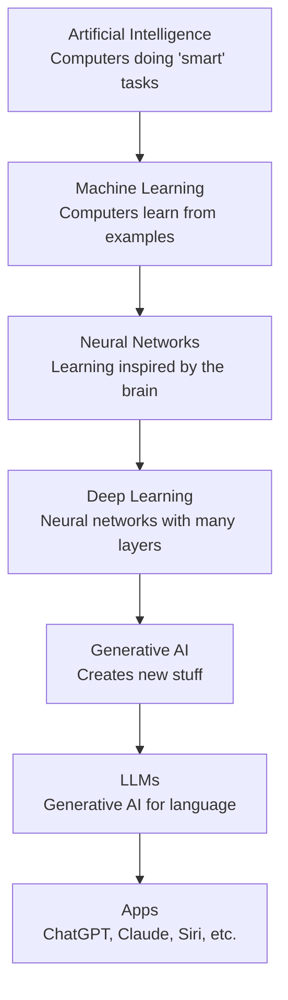

| Term | In one sentence | Everyday example |
|---|---|---|
| **AI** | Any computer system that does something "smart" | A chess app that beats you |
| **Machine Learning** | The computer figures out patterns from examples instead of being told exact rules | Your email app learning what's spam |
| **Neural Network** | A machine learning model loosely inspired by brain cells | An app that recognizes your handwriting |
| **Deep Learning** | A neural network with lots of layers stacked up | Face unlock on your phone |
| **Generative AI** | AI that creates brand new content | An app that makes AI art |
| **LLM** | A generative AI trained on huge amounts of text | ChatGPT, Claude, Gemini |
| **Application** | The actual product you use, built around a model | The ChatGPT website or app |

> **Important distinction:** An LLM is the *engine*. An app like ChatGPT is the *car* — the engine plus a steering wheel, seatbelt, and dashboard (a chat window, safety rules, memory, etc.) built around it.

### Old-School Programming vs. Machine Learning

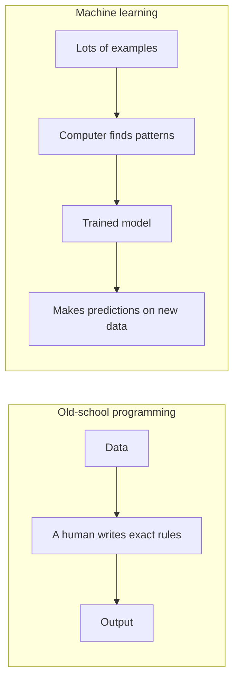

**Example — spotting spam email:**
- **Old-school:** A programmer writes, *"If the email contains the words 'FREE MONEY,' mark it spam."*
- **Machine learning:** You show the computer thousands of emails already labeled "spam" or "not spam," and it figures out the patterns on its own.

### How Do LLMs Actually Learn?

LLMs mostly learn by playing a giant fill-in-the-blank game. Given a sentence like *"The sun rises in the ___,"* the model guesses the next word, checks if it was right, and adjusts itself slightly. Now repeat that process billions of times on almost the entire internet, and you get a model that has absorbed the patterns of language.

> No one "teaches" the model facts directly the way a teacher does. It picks up grammar, facts, and even reasoning patterns just from predicting "what word comes next" over and over again.

### A Quick Timeline

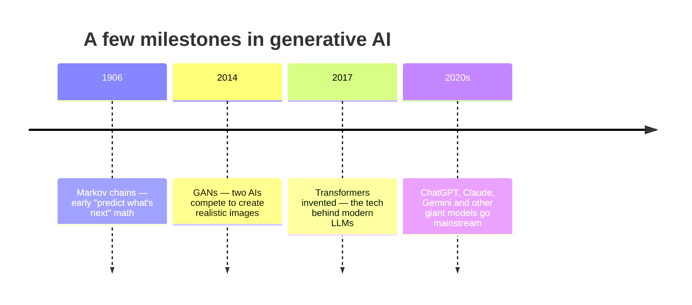

### Quick Check
1. Is every AI system also "machine learning"? Why or why not?
2. What's the difference between an LLM and an app like ChatGPT?
3. Give one example each of: content generation, translation, and summarization.

---

## 1.1 What's Actually Happening Inside a Transformer?

### The Simple Idea

Every modern LLM (ChatGPT, Claude, Gemini) is built on something called a **transformer**. Here's the whole idea in one sentence:

> **A transformer looks at the words so far and guesses the single most likely next word — over and over — until it's written a whole answer.**

That's it. It's an extremely powerful autocomplete. There's no separate "thinking" step and no hidden database of facts — just really, really good next-word guessing, done at a massive scale.

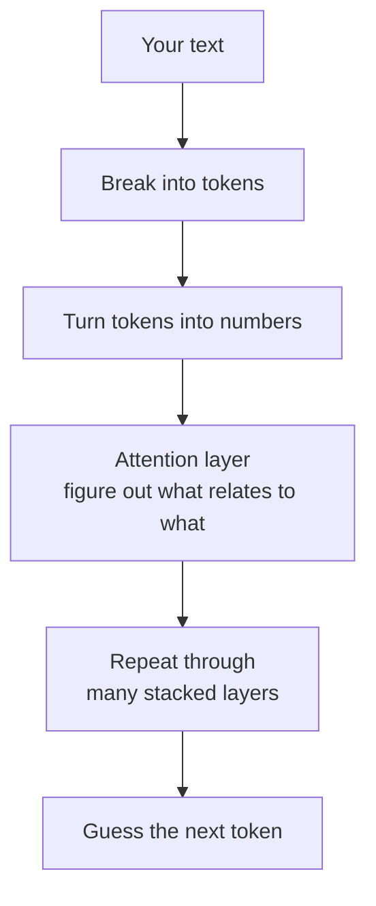
*A simplified view of what happens inside a transformer, step by step.*

### Attention: How the Model Figures Out What Matters

Read this sentence: *"The dog didn't chase the cat because it was too tired."*

Who was tired — the dog or the cat? You instantly know it's "the dog," because that's the sensible reading. **Attention** is the part of the model that does this same kind of connecting-the-dots — for every single word, all at once.

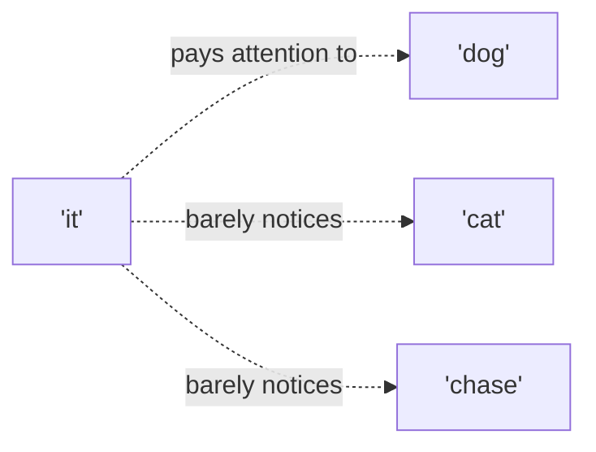

> **Think of it like a group chat:** every word can "read" every other word and decide which ones are most relevant to understanding its own meaning. The model learned to do this just by reading enormous amounts of text — nobody hand-coded the rule "it usually refers to the subject."

### Tokens: The Model Doesn't See Words, It Sees Puzzle Pieces

Before a transformer can process text, the words get chopped into small chunks called **tokens**. Tokens are usually smaller than a whole word.

Examples:
- `"hello"` → 1 token
- `"ChatGPT"` → 3 tokens: `Chat` + `G` + `PT`
- `"unbelievable"` → 3 tokens: `un` + `believ` + `able`

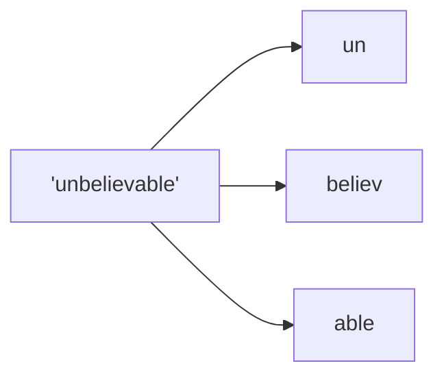

A rough rule of thumb: **1 token ≈ ¾ of a word**, or about 4 letters.

> This is why an LLM can sometimes misspell things or miscount letters in a word — it never actually sees individual letters, just these numbered chunks. If you ask it "how many R's are in strawberry," it's working from puzzle pieces, not letters, so it can slip up.

### Parameters: What the Model "Remembers"

An LLM has billions of internal numbers called **parameters** (or "weights"). These aren't a lookup table of facts — they're more like a giant, squished-down summary of everything the model read during training, spread out across billions of tiny adjustable dials.

> **Analogy:** Imagine reading 10,000 books and, instead of memorizing them word-for-word, you develop a "gut feeling" for how language and ideas usually fit together. That gut feeling — not a photographic memory — is basically what the model's parameters store.

### Context Window: The Model's Short-Term Memory

The **context window** is the maximum amount of text the model can "see" at once — your question plus its answer, combined. It's like a whiteboard that can only hold so many words before old stuff has to be erased to make room for new stuff.

- Small context window = the model forgets things you said earlier in a long conversation
- Big context window = it can "remember" a whole document or a long chat history

### How a Transformer Answers Your Question (Simplified)

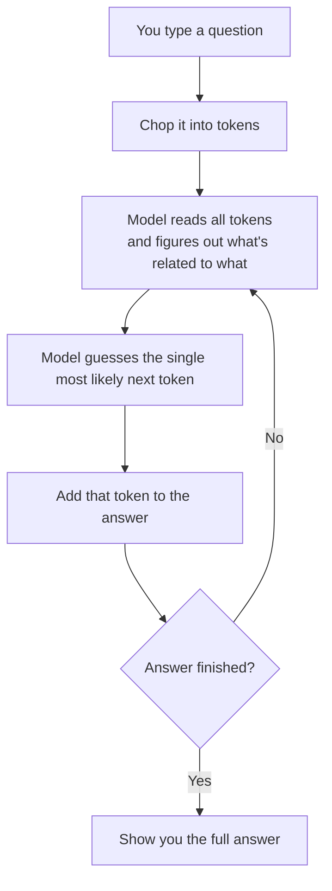

### Checkpoint
1. In *"The trophy didn't fit in the suitcase because it was too big,"* what does "it" refer to? Explain how attention would figure that out.
2. Why might an AI model misspell an unusual name or struggle to count letters in a word?
3. What happens to a long conversation once it goes past the model's context window?

---

## 1.2 Picking the Right Model

### Closed vs. Open Models — In Plain Terms

There are two main "flavors" of AI models:

| | **Closed models** (Claude, ChatGPT, Gemini) | **Open models** (Llama, Mistral) |
|---|---|---|
| How you use it | You call it over the internet | You can download and run it yourself |
| Cost | Pay per use | Pay for your own computer/server |
| Privacy | Your data goes to the company | Can stay fully on your own machine |
| Customizing it | Limited to how you word your prompt | Can retrain or tweak it yourself |
| Best for | Most everyday users and businesses | Situations needing total data control |

### Temperature: The "Randomness Dial"

**Temperature** controls how "safe" vs. "adventurous" the model's word choices are.

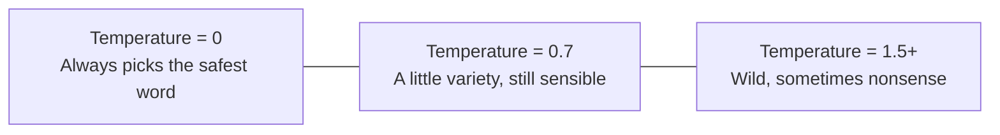

- **Low temperature (0):** Great for facts, math, code — you want the same correct answer every time.
- **Medium temperature (0.7):** Good for everyday conversation.
- **High temperature (1.5+):** Fun for brainstorming or creative writing, but can go off the rails.

> Temperature doesn't make the model smarter or dumber — it just controls how much randomness it allows itself.

### Reading a "Model Card" (the Model's Spec Sheet)

When you look up any AI model, check these:
- **Context length** — how much text it can handle at once
- **Training cutoff** — the last date it "knows about" (it won't know about anything after that)
- **Cost** — how much it costs to use, per chunk of text

### Where LLMs Actually Help

| Use case | What it's good for | Still needs a human to... |
|---|---|---|
| Writing help | Drafting essays, emails, stories | Check tone and originality |
| Translation | Quick translations | Double-check with a fluent speaker for anything important |
| Summarizing | Condensing long readings | Make sure nothing important got left out |
| Answering questions | Explaining concepts, tutoring | Verify facts against a real source |

### When NOT to Use an LLM

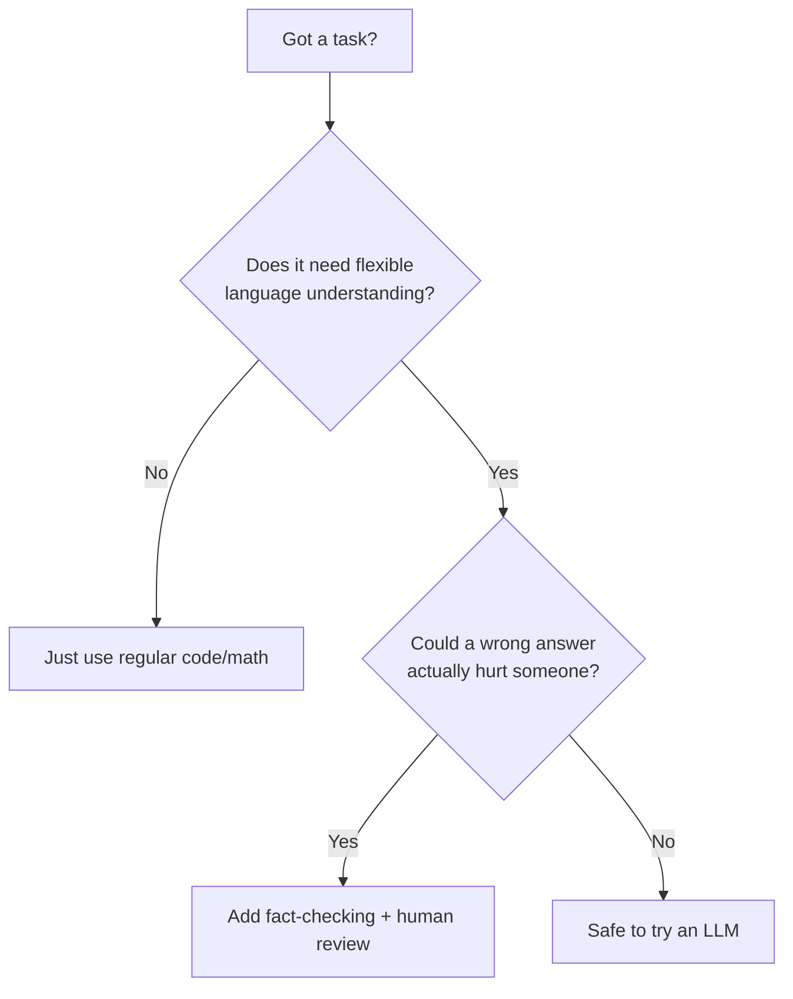

### The Big Limitations (Know These!)

- **Hallucination:** The model can confidently make up facts, quotes, or sources that sound real but aren't. Always double-check anything important.
- **Outdated knowledge:** It doesn't know about things after its training cutoff.
- **Bias:** It can repeat unfair patterns found in its training data.
- **Privacy:** Never type passwords, health info, or other private details into a public AI tool.

> **Never use an LLM as the only decision-maker** for things like grades, medical advice, or anything with serious real-world consequences. It's a helper, not a judge.

### A Smart Way to Use AI for Schoolwork

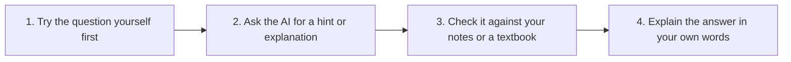

> If you can't explain the answer yourself afterward, the AI did the thinking instead of you — try again.

### Checkpoint
1. Your school wants a tool to summarize student essays, but it must never send data outside the school's own computers. Closed or open model — and why?
2. You want product descriptions that are creative but never invent fake features. What temperature would you pick — low, medium, or high? Why?
3. An AI gives you three "sources" for a fact. What should you do before trusting them?

---

## 1.3 Not All Language Models Are the Same Size (or Do the Same Job)

So far we've been talking about "LLMs" as one big category. But models actually come in different sizes and even different senses — some only read text, others can also "see."

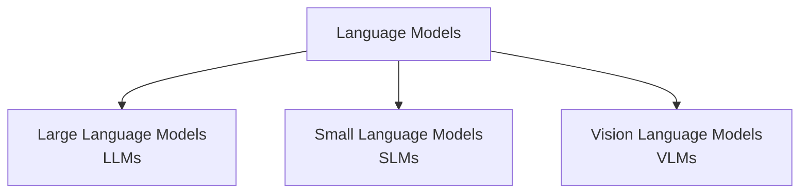

### Large Language Models (LLMs)

These are the giants: models like GPT-4, Claude, and Gemini, trained on huge amounts of text using billions (sometimes trillions) of parameters.

- Run on powerful servers in data centers, not on your phone
- Know a very wide range of topics
- Cost more money and take more time per answer
- Best for: complex reasoning, broad knowledge, difficult writing tasks

### Small Language Models (SLMs)

Same basic idea as an LLM — predict the next token — but built with far fewer parameters, so the whole model is much smaller.

- Small enough to run directly on a laptop or even a phone, with no internet needed
- Faster and cheaper to run
- Know less overall and can struggle with very complex questions
- Best for: simple, focused tasks — like autocomplete, basic chat, or a single narrow job (say, sorting support tickets)

### Vision Language Models (VLMs), also called Visual Language Models

These models can handle images and text together, not just text.

- You can show a VLM a photo and ask, "What's happening in this picture?" or "Read the text on this sign"
- Under the hood, it turns the image into a kind of "token" too, the same way text gets tokenized, so the model can reason about pictures and words side by side
- Best for: describing photos, reading charts and screenshots, answering questions about diagrams, helping visually impaired users understand images

### Comparing Them Side by Side

| | **Large Language Model** | **Small Language Model** | **Vision Language Model** |
|---|---|---|---|
| Size | Huge (billions+ of parameters) | Small (millions to a few billion) | Varies, often large |
| Where it runs | Cloud servers | Can run locally, offline | Usually cloud servers |
| Input types | Text only | Text only | Text and images |
| Speed | Slower, more compute needed | Fast, lightweight | Slower, more compute needed |
| Cost | Higher | Lower | Higher |
| Best for | Broad knowledge, hard reasoning | Simple, narrow, on-device tasks | Understanding pictures + text together |

> Bigger isn't always better. If your task is simple and needs to run instantly on a phone with no internet, a small model can actually be the smarter engineering choice — even though it "knows" less than a giant model.

### Quick Check
1. You're building an app that needs to work on a phone with no internet connection. Which type of model fits best, and why?
2. A teacher wants students to upload a photo of their handwritten math homework and get feedback. Which type of model do they need?
3. Why might a company choose a small model even though a large model would give "smarter" answers?

---

## Week 1 Summary — The Big Ideas

- **AI, machine learning, deep learning, and LLMs are nested categories**, not the same thing.
- **A transformer is basically a supercharged autocomplete** — it predicts the next word, one word at a time.
- **Attention** lets the model figure out which words in a sentence relate to each other (like "it" pointing back to "dog").
- **Tokens, not letters or whole words**, are what the model actually processes — this explains some of its quirks.
- **Temperature controls randomness**, not intelligence — low for facts, higher for creativity.
- **Models come in different sizes and senses.** Large models know the most but cost more; small models run on a phone with no internet; vision language models can understand images alongside text.
- **Always fact-check.** LLMs can sound confident while being completely wrong.

---

## Want to Explore More?
- [Week 1: How LLMs Actually Work — Full Technical Version](week1-llm-foundations-extra.md) — the complete chapter with architecture diagrams, model-selection tradeoffs, error handling, streaming, and a full API lab
- [The Illustrated Transformer](https://jalammar.github.io/illustrated-transformer/) — great pictures explaining attention in more depth
- [TensorFlow Playground](https://playground.tensorflow.org/) — play with a tiny neural network right in your browser
