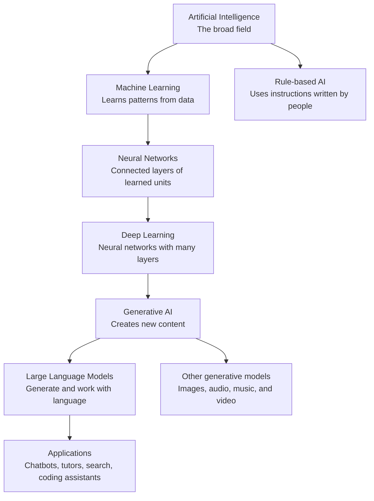
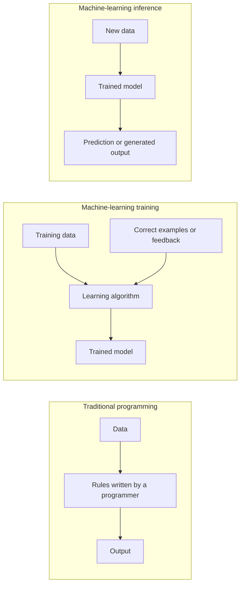
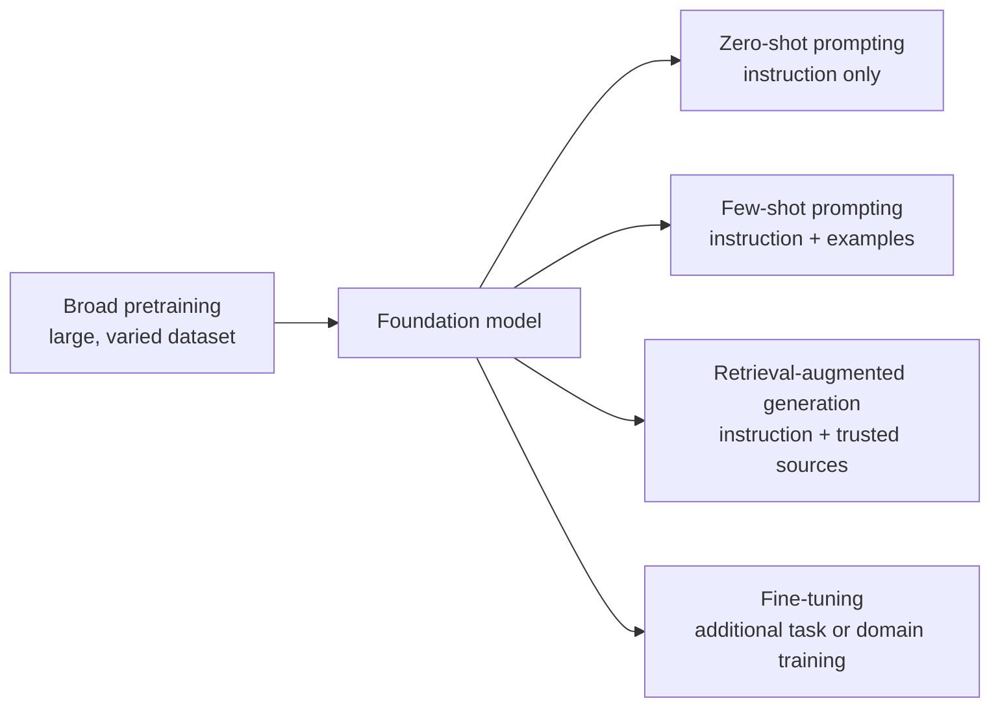
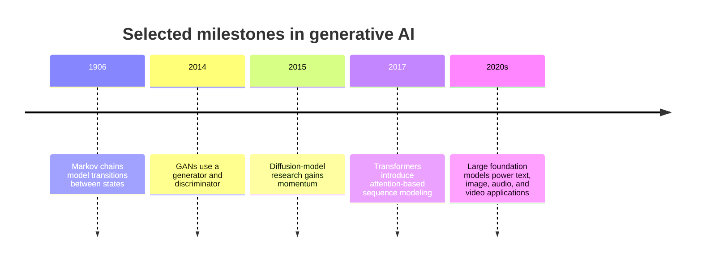
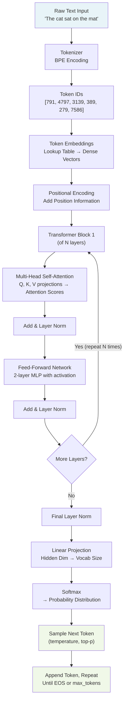
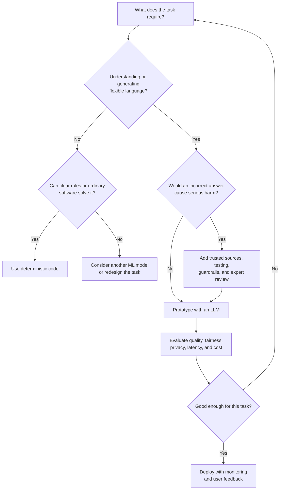
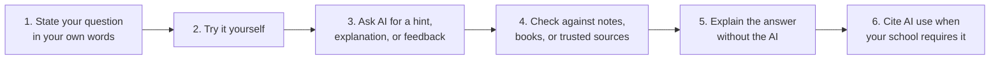
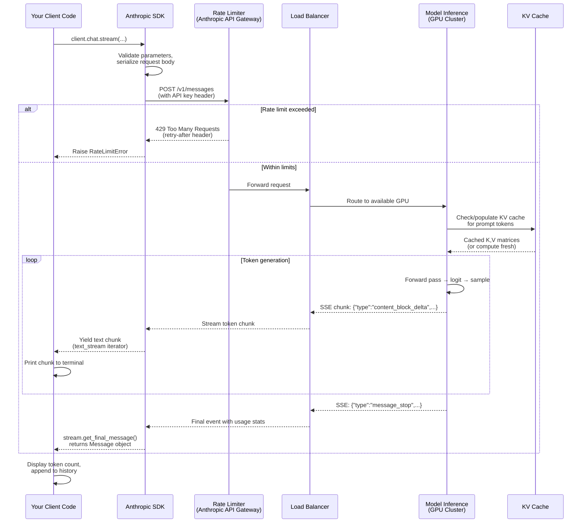

# Week 1: How LLMs Actually Work

> **Theme: Build intuition before writing code.** Before you write a single line of production AI code, you need a mental model of what is actually happening inside the systems you are orchestrating. This week strips away the marketing language and builds genuine intuition for transformers, the model landscape, and your first authenticated API call.

---

## 1.0 From AI to Large Language Models

Before learning how a transformer works, it helps to place LLMs inside the larger world of artificial intelligence. The terms below are related, but they are not interchangeable.

> [!NOTE]
> **Artificial intelligence (AI)** is the broad goal of building computer systems that perform tasks that normally require human intelligence, such as recognizing speech, planning a route, or answering a question.

### The AI Family Tree



This diagram is a useful learning map, not a perfect scientific taxonomy. For example, generative AI can use several architectures, and not every AI system uses machine learning.

| Term | Plain-language meaning | Familiar example |
|---|---|---|
| **Artificial Intelligence (AI)** | The overall field of making computers perform intelligent tasks | A chess program or voice assistant |
| **Machine Learning (ML)** | A way for computers to learn patterns from examples instead of receiving every rule explicitly | An email spam filter |
| **Neural Network (NN)** | A machine-learning model made of connected layers that transform information | Handwritten-digit recognition |
| **Deep Learning (DL)** | Neural networks with many processing layers, useful for complex data | Face recognition or speech-to-text |
| **Generative AI (GenAI)** | AI that creates new content based on patterns learned from existing content | An image or music generator |
| **Large Language Model (LLM)** | A generative model trained on large amounts of language data | Mistral, GPT, Claude, Gemini, or Llama |
| **Application** | Software built around one or more models | ChatGPT or an AI study assistant |

> [!TIP]
> Remember the difference between a **model** and an **application**. An LLM is the trained model. A chatbot is an application that adds a user interface, instructions, safety controls, conversation history, and sometimes search or other tools around that model.

### Traditional Programming vs. Machine Learning

In traditional programming, a person writes the rules. In machine learning, a learning algorithm uses examples to discover useful patterns.



Suppose you want to detect unwanted email:

- In a **rule-based system**, you might write: "If a message contains `FREE MONEY`, mark it as spam."
- In a **machine-learning system**, you provide many examples labeled `spam` or `not spam`, and the model learns combinations of patterns that help separate the two groups.

> [!IMPORTANT]
> Machine learning does not mean that a computer learns exactly as a human does. It means that numerical parameters are adjusted to improve performance on an objective measured from data.

### Three Common Ways Models Learn

| Learning approach | What feedback does the model receive? | Example |
|---|---|---|
| **Supervised learning** | Examples paired with correct answers or labels | Learning to classify images labeled `cat` or `dog` |
| **Unsupervised or self-supervised learning** | Unlabeled data from which the model finds structure or predicts hidden parts | Predicting a missing or next token in a sentence |
| **Reinforcement learning** | Rewards or penalties based on actions and outcomes | Learning to play a game or improving responses from human feedback |

LLM pretraining is usually **self-supervised**: ordinary text supplies its own learning signal. Given `The moon appears at ___`, the model tries to predict a likely next token. Its prediction is compared with the actual token, and its parameters are adjusted slightly. Repeating this process over vast amounts of text teaches statistical patterns of language.

### Foundation Models, Generative AI, and LLMs

A **foundation model** is trained broadly enough to be adapted to many tasks. Instead of training a separate model from scratch for summarization, classification, translation, and question answering, developers can start with one foundation model and guide it using prompts, examples, retrieval, or further training.



- **Zero-shot** means asking the model to do a task without showing an example.
- **Few-shot** means including a few examples in the prompt so the model can imitate the desired pattern.
- **Retrieval-augmented generation (RAG)** supplies relevant information at request time.
- **Fine-tuning** changes model parameters using additional training data.

> [!TIP]
> Beginners should usually try a clear prompt, a few examples, or retrieval before fine-tuning. These approaches are faster to test and do not require changing the model itself.

### A Short History of Generative AI

Generative AI existed long before modern chatbots. A few milestones help explain how the field developed:



Different model families suit different kinds of content. Transformers became especially important for language, while diffusion models are widely used for image generation. Modern systems may combine several model types.

> [!NOTE]
> A larger model is not automatically a better model. Data quality, architecture, training method, evaluation results, speed, cost, and suitability for the task all matter.

### Quick Check: Build the Vocabulary

1. Is every machine-learning system an AI system? Is every AI system a machine-learning system? Explain your answer.
2. What is the difference between an LLM and a chatbot application?
3. For each task, choose the most relevant category: spam detection, generating an illustration, translating a paragraph, and navigating a game world.
4. Explain zero-shot and few-shot prompting using an example from a school subject.

### Visual References

- [AI, Machine Learning, Deep Learning, GenAI and more](https://medium.com/womenintechnology/ai-c3412c5aa0ac) provides a simple visual hierarchy and everyday examples.
- [Applied LLM Foundations and Real World Use Cases](https://github.com/aishwaryanr/awesome-generative-ai-guide/blob/main/free_courses/Applied_LLMs_Mastery_2024/week1_part1_foundations.md) includes diagrams about LLM history, model size, use cases, and challenges. It is archived 2024 material, so verify model-specific facts against current documentation.
- [LLM use-cases mind map](https://github.com/aishwaryanr/awesome-generative-ai-resources/blob/main/free_courses/Applied_LLMs_Mastery_2024/img/Blue_and_Grey_Illustrative_Creative_Mind_Map.png) groups common language-model applications visually.
- [LLM challenges diagram](https://github.com/aishwaryanr/awesome-generative-ai-resources/blob/main/free_courses/Applied_LLMs_Mastery_2024/img/llm_challenges.png) groups data, ethical, technical, and deployment concerns.
- [TensorFlow Playground](https://playground.tensorflow.org/) lets you experiment visually with a small neural network in the browser.
- [The Illustrated Transformer](https://jalammar.github.io/illustrated-transformer/) provides a deeper visual explanation of transformer processing and attention.

---

## 1.1 The Transformer Demystified

### What Is a Transformer, Really?

When engineers say "LLM," they almost always mean a model built on the **transformer architecture**, introduced in the 2017 paper *Attention Is All You Need* by Vaswani et al. Understanding what transformers do — not at the mathematical level, but at the intuitive level — is the single most important foundation for everything else in this curriculum.

A transformer is a function that takes a sequence of tokens and produces a probability distribution over the next token. That sentence is deceptively simple. Everything that feels magical about ChatGPT, Claude, or Gemini is an emergent consequence of applying that same function billions of times across hundreds of billions of examples during training.

> [!NOTE]
> **In plain English:** Imagine the world's most obsessive autocomplete. Instead of just looking at the last word you typed (like your phone keyboard does), it re-reads your *entire* sentence every single time, decides which earlier words matter most for picking the next one, and then guesses. It does this one word-piece at a time, feeding its own guess back in as new input, over and over, until it has written a whole paragraph. There is no separate "thinking" step and no database of facts — the guessing itself, done really well at massive scale, is what produces answers that feel intelligent.


*The full transformer architecture: stacked encoder blocks (left) and decoder blocks (right). Source: [Wikimedia Commons](https://commons.wikimedia.org/wiki/File:Transformer,_full_architecture.png), CC BY-SA 4.0.*

### Attention: The Core Intuition

The transformer's central innovation is the **attention mechanism**. Here is the clearest intuition: attention lets every token in a sequence look at every other token and decide how much to "pay attention" to each one when computing its own meaning.

Consider the sentence: *"The animal didn't cross the street because it was too tired."* What does "it" refer to? As a human, you resolve this by attending to "animal" rather than "street." The attention mechanism learns to do exactly this — and it does so for every word, simultaneously, across every layer of the model.

More precisely, each token is represented as three learned vectors:
- A **Query (Q)**: "What am I looking for?"
- A **Key (K)**: "What do I contain?"
- A **Value (V)**: "What will I contribute if selected?"

The model computes dot products between the Query of one token and the Keys of all other tokens to produce **attention scores** — a measure of relevance. Those scores are normalized (via softmax) into weights, and then the weighted sum of all Value vectors becomes the new representation of that token. This is called **scaled dot-product attention**.

Modern transformers use **multi-head attention**, meaning this process runs in parallel across many independent "heads," each learning to attend to different kinds of relationships (syntactic, semantic, positional, etc.).

> **Key Insight:** Attention is not magic — it is a learned routing mechanism. The model learns *which* tokens are relevant to *which* other tokens for *which* purposes. After training on enough text, it learns that pronouns attend to their antecedents, verbs attend to their subjects, and so on.

> [!NOTE]
> **In plain English:** Picture a room full of people at a party, each holding a name tag (their word). Attention is every person glancing around the room and deciding, "Whose name tag is most relevant to understanding *my* role in this conversation right now?" The word "it" glances around and locks onto "animal" because that connection makes the sentence make sense. Every word does this glancing at the same time, and the model has learned — purely from reading enormous amounts of text — which glances tend to matter.


*Scaled dot-product attention: Query and Key vectors produce attention scores that weight the Value vectors. Source: [Wikimedia Commons](https://commons.wikimedia.org/wiki/File:Transformer,_attention_block_diagram.png), CC BY-SA 4.0.*

### Tokens, Not Words

Before attention can operate, text must be converted to **tokens**. This is done by a **tokenizer**, and understanding it prevents a class of common bugs.

Tokens are not words. They are subword units produced by an algorithm called **Byte Pair Encoding (BPE)**. BPE starts with individual characters and iteratively merges the most frequent adjacent pairs until a target vocabulary size is reached (typically 32,000–100,000 tokens). The result: common words become single tokens, rare words get split, and punctuation is often its own token.

Concrete examples using GPT-4's `cl100k_base` tokenizer:
- `"hello"` → 1 token
- `"ChatGPT"` → 3 tokens: `["Chat", "G", "PT"]`
- `"unbelievable"` → 3 tokens: `["un", "believ", "able"]`
- `"2024-01-15"` → 5 tokens: `["2024", "-", "01", "-", "15"]`

This has real engineering consequences. Token counts determine latency, cost, and whether your prompt fits in the context window. A rule of thumb: 1 token ≈ 0.75 English words, or roughly 4 characters. Code and non-English languages are often less efficient.

> **Key Insight:** When you're surprised by a model's behavior with a specific word or name, check the tokenization first. Models have no concept of letters — they see token IDs. "GPT-4" and "GPT4" are entirely different sequences of tokens to the model.

> [!NOTE]
> **In plain English:** Think of tokens as Lego bricks for language. A model can't read letters or words the way you do — it can only handle numbers. So before anything else happens, a tokenizer chops your sentence into small, well-defined bricks (sometimes a whole word, sometimes just a fragment like "un" or "able") and replaces each brick with a number from a big lookup table. The model then does all of its "thinking" in that Lego-brick world of numbers, and only converts back into readable words at the very end when it needs to show you the answer. This is why a model can misspell, get confused by unusual names, or miscount letters in a word — it never actually saw the individual letters, only the numbered bricks.

### Parameters as Compressed Knowledge

A language model's **parameters** (also called **weights**) are the numbers adjusted during training to minimize prediction error. GPT-4 is estimated at ~1.8 trillion parameters. Llama 3 70B has 70 billion. What are these numbers actually storing?

Think of parameters as a lossy compression of the training corpus. During training, the model is repeatedly shown text and asked to predict the next token. Every time it gets it wrong, the error is back-propagated through the network and the weights are nudged slightly in the direction that would have made the correct prediction more likely. After trillions of such nudges, the weights encode statistical patterns at every scale: spelling, grammar, facts, reasoning strategies, writing styles.

This is why models "know" things they were never explicitly told — the knowledge is distributed across billions of parameters as implicit patterns, not as a lookup table.

### Context Window and KV-Cache

The **context window** is the maximum number of tokens the model can process in a single forward pass — both the input (prompt) and output (completion) combined. Current models range from 8K tokens (older models) to 1M+ tokens (Gemini 1.5 Pro). Context window size matters enormously: it determines how much conversation history, document content, or codebase the model can "see" simultaneously.

The **KV-cache** (Key-Value cache) is an optimization for inference. During generation, the model produces one token at a time. Without caching, it would need to recompute the Keys and Values for every previous token on every new generation step — O(n²) computation. The KV-cache stores those Key and Value matrices after they are computed, so subsequent tokens only need to compute attention against the cached values. This is why the first token takes longer to generate than subsequent ones, and why hosted APIs charge differently for input vs. output tokens.

> **Key Insight:** The context window is not just a technical limit — it defines the model's "working memory." When context fills up, you must make deliberate choices about what to keep, summarize, or drop. This is one of the core engineering challenges in building production AI systems.

### Transformer Forward Pass Diagram



### Chapter 1.1 Checkpoint

1. In the sentence "The trophy didn't fit in the suitcase because it was too big," the word "it" refers to "trophy." Describe in plain English how the attention mechanism would resolve this reference. Which token's Query vector would find a high dot-product with which Key vector?

2. The string `"pre-trained"` tokenizes to `["pre", "-", "train", "ed"]` (4 tokens). Estimate how many tokens a 500-word English essay would contain, and explain why code files often use more tokens per word than prose.

3. Why does the KV-cache make inference faster but require more GPU memory? What engineering tradeoff does this represent?

---

## 1.2 The LLM Landscape

### Closed-Source vs. Open-Source: A Real Engineering Decision

The most immediately practical decision in AI engineering is not which model is "smartest" — it is which model is appropriate for your constraints. The landscape divides cleanly into **closed-source frontier models** (accessed via API) and **open-source models** (downloaded and self-hosted).

| Dimension | Closed-Source (Claude, GPT-4, Gemini) | Open-Source (Llama 3, Mistral, Phi-3) |
|---|---|---|
| **Access** | API call, no model weights | Download weights, run anywhere |
| **Cost** | Per-token pricing (ongoing) | Infrastructure cost (one-time + ops) |
| **Privacy** | Data sent to provider | Data stays on your hardware |
| **Customization** | Prompt engineering only | Fine-tune, quantize, modify |
| **Performance** | State-of-the-art, maintained | Slightly behind frontier (closing gap) |
| **Latency** | Network round-trip + queue | Local inference (variable) |
| **Compliance** | Must trust provider's data handling | Full control of data residency |
| **Reliability** | SLA-backed uptime | Your ops team's problem |
| **Context Window** | Up to 1M tokens | Typically 8K–128K |

For enterprise applications handling sensitive data (healthcare records, legal documents, financial PII), open-source self-hosted models are often mandatory regardless of quality tradeoffs. For consumer products where ease of integration and peak quality matter, closed-source APIs win.

### Temperature: The Creativity Dial

**Temperature** is a scalar applied to the logits (raw scores) before the softmax operation during sampling. Lowering temperature makes the distribution sharper (the most likely token becomes even more dominant). Raising it makes the distribution flatter (less likely tokens get more probability mass).

- `temperature=0`: Greedy decoding. Always picks the single most probable token. Fully deterministic, zero creativity. Use for factual extraction, structured output, code generation where correctness matters.
- `temperature=0.7`: The "sweet spot" for most conversational tasks. Some variation, generally coherent.
- `temperature=1.0`: Sample directly from the model's learned distribution. More creative, more likely to go off-track.
- `temperature=2.0`: Very high variance output. Often incoherent. Used in research for diversity sampling.

The key intuition: temperature does not make the model "smarter" or "dumber" — it controls the *randomness of token selection* given the model's probability estimates. A model that assigns 99% probability to the correct next token will still pick it at temperature=2.0 most of the time. Temperature only matters at the margins.

> **Key Insight:** Temperature is not a "quality" knob — it is a "variance" knob. For tasks with objectively correct answers (math, code, data extraction), lower temperature reduces hallucination risk. For creative writing or brainstorming, higher temperature increases diversity at the cost of coherence.

### Top-P: Nucleus Sampling

**Top-p** (also called **nucleus sampling**) is an alternative to temperature for controlling randomness. Instead of scaling the entire distribution, top-p cuts off the "long tail" of low-probability tokens entirely.

With `top_p=0.9`, the model:
1. Sorts all tokens by probability (descending)
2. Sums probabilities until the cumulative total reaches 0.9
3. Discards all remaining tokens
4. Renormalizes the kept tokens and samples from them

The key advantage over temperature: the nucleus size adapts to the model's confidence. When the model is highly confident (one token has 95% probability), the nucleus contains very few tokens. When the model is uncertain (probabilities spread across many tokens), the nucleus stays wide. This avoids both extreme peakiness and extreme diffuseness.

In practice, most production systems use **both** temperature and top-p together. The Anthropic API defaults to `temperature=1.0, top_p=1.0` (no restriction). A common production setting for factual tasks is `temperature=0.0`; for creative tasks, `temperature=0.7, top_p=0.95`.

### Reading a Model Card

A **model card** is the documentation accompanying a model release. Learning to read one quickly is a core skill. Key fields to always check:

**Context Length**: Maximum token input+output combined. Determines what tasks are feasible. `claude-3-5-sonnet-20241022` supports 200K context; `gpt-4o` supports 128K.

**Training Cutoff**: The date after which the model has no training data. A model with a January 2024 cutoff does not know about events after that date. Always check this before deploying for tasks involving recent events.

**Benchmark Scores**: Common benchmarks include MMLU (general knowledge, multiple choice), HumanEval (Python code generation), MATH (competition mathematics), and GPQA (graduate-level science questions). These give rough comparisons but are heavily gamed — treat them as directional, not definitive.

**Pricing**: Closed-source models charge per token, usually with different rates for input vs. output. Output tokens are typically 3-5x more expensive than input tokens because they require sequential generation. At scale, a 1M-token/day application can cost thousands of dollars per month — model selection has direct P&L impact.

> **Key Insight:** Model cards are marketing documents as much as technical ones. The most important number is often not benchmark rank but cost-per-quality-point for your specific task. Run your own evals on representative examples before committing to a model in production.

> **Key Insight:** "Latest" is not always "best for your use case." A smaller, cheaper model fine-tuned on your domain often outperforms a frontier model at general tasks for your specific workload.

### Where LLMs Can Help

LLMs are general-purpose language tools. They are most useful when a task involves understanding, transforming, finding, or drafting language.

| Use case | What the model can do | Beginner project idea | Human check needed |
|---|---|---|---|
| **Content generation** | Draft stories, emails, lesson plans, or code | Create three endings for a short story | Check originality, tone, and facts |
| **Translation** | Translate while considering surrounding context | Compare translations of a school announcement | Ask a fluent speaker to review important text |
| **Summarization** | Reduce a long passage to its key ideas | Summarize class notes into five bullets | Confirm that no key detail was removed or changed |
| **Question answering** | Answer questions from general knowledge or supplied sources | Build a study-question helper | Verify answers against textbooks or trusted sources |
| **Information retrieval** | Turn a natural-language question into a useful search or document query | Search a collection of school policies | Open and inspect the original source |
| **Classification and moderation** | Sort or flag text according to categories | Group feedback by topic | Review uncertain and high-impact decisions |
| **Educational support** | Explain concepts at different difficulty levels and generate practice | Ask for a simpler explanation plus a quiz | Use it to support learning, not replace thinking |

Use this decision path before adding an LLM to a project:



> [!TIP]
> Prefer ordinary code for exact operations such as calculating totals, checking a password rule, or looking up a known database record. LLM output is probabilistic, so the same prompt may produce different wording or even a different answer.

### Limits and Responsible Use

An LLM predicts plausible language. It does not automatically know whether a statement is true, fair, current, private, or appropriate. Building responsibly means planning for these limitations from the beginning.

| Challenge | What it means | A practical response |
|---|---|---|
| **Hallucination** | The model can confidently produce invented facts, quotations, links, or citations | Require sources and verify claims independently |
| **Knowledge limits** | Training data may be incomplete or outdated | Retrieve current information from trusted sources |
| **Bias** | Patterns in training data can lead to unfair outputs | Test across different groups and include human review |
| **Privacy** | Prompts may expose personal or confidential information | Remove sensitive data and follow provider/data policies |
| **Copyright and ownership** | Generated material may resemble protected work, and usage rights can be unclear | Review licenses, cite sources, and avoid imitation requests |
| **Prompt injection and misuse** | Untrusted text may try to override system instructions or extract data | Treat external content as untrusted and limit tool permissions |
| **Cost and latency** | Large prompts and outputs take time and money | Track token usage, set limits, and compare smaller models |
| **Evaluation difficulty** | Fluent answers can hide subtle errors | Test with representative examples and clear scoring criteria |

> [!WARNING]
> Never enter passwords, private messages, health details, student records, addresses, API keys, or other sensitive information into a public AI tool. Once data is sent to an external service, you may no longer control how it is stored or processed.

> [!CAUTION]
> Do not use an LLM as the only decision-maker for grades, medical advice, legal decisions, hiring, discipline, or personal safety. These are high-impact situations where mistakes can seriously affect people and qualified human oversight is essential.

> [!IMPORTANT]
> Fluent writing is not evidence of truth. A good habit is **ask, inspect, verify**: ask the model, inspect its reasoning and sources, then verify important claims with reliable material.

### A Safe Learning Workflow

For schoolwork, AI is most valuable as a tutor, practice partner, or feedback tool. It should help you do more thinking, not hide the thinking you were expected to do.



> **Student reflection:** If you cannot explain the final answer in your own words, the tool completed the task but you may not have learned the concept yet.

### Chapter 1.2 Checkpoint

1. Your company is building a medical records summarization tool. Data cannot leave EU servers, and you have a 10-person ML ops team. Which model category (closed-source vs. open-source) should you choose, and what are the top three constraints driving that decision?

2. You are generating product descriptions for an e-commerce site. The descriptions should be varied and creative, but must always mention the product name accurately. Propose a temperature and top-p configuration and justify your choices.

3. You find two models with similar benchmark scores. Model A costs $15 per million input tokens; Model B costs $0.50 per million input tokens. Your application processes 2 million input tokens per day. Calculate the monthly cost difference and describe what evaluation you would run to determine if Model A is worth the premium.

4. A student asks an LLM for three sources and receives realistic-looking citations. What should the student do before using them, and which LLM limitation does this illustrate?

5. Choose one use case from the table above. Name one quality test, one safety check, and one operational measurement you would use before deployment.

---

## 1.3 Your First API Call

### Environment Setup

Professional Python development for AI engineering starts with isolated environments. Never install AI packages globally — version conflicts between `anthropic`, `openai`, `langchain`, and their dependencies are common and painful.

```bash
# Create a new project directory
mkdir ai-engineering-week1
cd ai-engineering-week1

# Create and activate a virtual environment
python -m venv .venv

# On Windows (PowerShell)
.venv\Scripts\Activate.ps1

# On macOS/Linux
source .venv/bin/activate

# Upgrade pip first (avoids many obscure install errors)
python -m pip install --upgrade pip

# Install the primary SDK we will use this week
pip install mistralai python-dotenv

# Verify installation
python -c "import mistralai; print(mistralai.__version__)"
```

Store your API keys in a `.env` file, never in source code:

```bash
# .env (add this to .gitignore immediately)
MISTRAL_API_KEY=your-mistral-key-here
```

If you want to compare providers later, you can also add `OPENAI_API_KEY` and `ANTHROPIC_API_KEY`, but all primary examples in this course use Mistral.

### The Mistral Client and Response Object

The Mistral Python SDK uses `client.chat.complete()` and returns a structured response object with `choices` and `usage`. Understanding the response structure prevents parsing bugs and makes cost tracking straightforward.

```python
# 01_first_call.py
# A complete, annotated first API call to Mistral

import os
from dotenv import load_dotenv
from mistralai import Mistral

# Load API key from .env file
load_dotenv()

# Initialize the client - reads MISTRAL_API_KEY from environment
client = Mistral(api_key=os.environ["MISTRAL_API_KEY"])

# Make a basic completion request
response = client.chat.complete(
    model="mistral-small-latest",      # Model identifier (check docs for latest)
    messages=[
        {
            "role": "user",
            "content": "Explain what a transformer neural network is in exactly 3 sentences, suitable for a software engineer with no ML background."
        }
    ]
)

# --- Parsing the response object ---
message = response.choices[0].message
usage = response.usage

# The top-level response has these key fields:
print(f"Model used:      {response.model}")
print(f"Finish reason:   {response.choices[0].finish_reason}")
print(f"Response ID:     {response.id}")

# Mistral returns the assistant text in the first choice
print(f"\nResponse text:\n{message.content}")

# Usage contains token counts - critical for cost tracking
print(f"\n--- Token Usage ---")
print(f"Prompt tokens:   {usage.prompt_tokens}")
print(f"Completion toks: {usage.completion_tokens}")
print(f"Total tokens:    {usage.total_tokens}")

# Estimate cost (Mistral Small pricing example — check current docs)
INPUT_COST_PER_MILLION  = 0.20
OUTPUT_COST_PER_MILLION = 0.60

input_cost  = (usage.prompt_tokens / 1_000_000) * INPUT_COST_PER_MILLION
output_cost = (usage.completion_tokens / 1_000_000) * OUTPUT_COST_PER_MILLION
print(f"Estimated cost:  ${input_cost + output_cost:.6f}")
```

The same pattern maps cleanly to OpenAI and Anthropic SDKs, but those are secondary comparison examples in this curriculum rather than the default implementation path.

### Error Handling

Production code must handle failures gracefully. The Mistral examples in this repository keep the control flow simple: make the call, retry transient failures, and log enough detail to debug auth, quota, or networking issues.

```python
# 02_error_handling.py
# Robust error handling patterns for production use

import os
import time
from mistralai import Mistral

client = Mistral(api_key=os.environ["MISTRAL_API_KEY"])

def call_with_retry(
    prompt: str,
    model: str = "mistral-small-latest",
    max_retries: int = 3,
    base_delay: float = 1.0
) -> str | None:
    """
    Make an API call with exponential backoff retry logic.
    Returns the response text, or None if all retries fail.
    """
    for attempt in range(max_retries):
        try:
            response = client.chat.complete(
                model=model,
                messages=[{"role": "user", "content": prompt}]
            )
            return response.choices[0].message.content

        except Exception as e:
            wait_time = base_delay * (2 ** attempt)  # Exponential backoff: 1s, 2s, 4s
            if attempt == max_retries - 1:
                print(f"Final failure: {type(e).__name__}: {e}")
                return None
            print(f"Attempt {attempt+1}/{max_retries} failed: {e}. Retrying in {wait_time}s...")
            time.sleep(wait_time)

    print(f"All {max_retries} attempts failed.")
    return None


# Test the retry logic
result = call_with_retry("What is 2 + 2?")
if result:
    print(f"Response: {result}")
```

### Streaming: The Right Way to Build Chat UIs

**Streaming** means the model sends tokens to your client as it generates them, rather than waiting until generation is complete. For a response that takes 10 seconds to generate, streaming shows the first words in under 1 second. This is essential for chat interfaces — users tolerate latency much better when they can see progress.

The Mistral SDK exposes streaming via `client.chat.stream()`, which yields delta events as they arrive:

```python
# 03_streaming.py
# Streaming response with real-time output

import os
import time
from mistralai import Mistral

client = Mistral(api_key=os.environ["MISTRAL_API_KEY"])

def stream_response(prompt: str, model: str = "mistral-small-latest") -> dict:
    """
    Stream a response and return the full text plus token usage.
    """
    full_text = ""
    ttft = None
    start = time.time()

    print("Assistant: ", end="", flush=True)
    with client.chat.stream(
        model=model,
        messages=[{"role": "user", "content": prompt}]
    ) as stream:
        for event in stream:
            delta = event.data.choices[0].delta.content
            if delta:
                if ttft is None:
                    ttft = time.time() - start
                print(delta, end="", flush=True)
                full_text += delta

    print()  # Newline after streaming completes

    return {
        "text": full_text,
        "time_to_first_token": round(ttft or 0, 3),
        "total_seconds": round(time.time() - start, 3),
    }

# Example usage
result = stream_response("Write a haiku about distributed systems.")
print(f"\n[TTFT: {result['time_to_first_token']}s | Total: {result['total_seconds']}s]")
```

### API Call Lifecycle Diagram



### The 50-Line Streaming CLI Chatbot

Here is the complete lab deliverable — a production-quality CLI chatbot that maintains conversation history, streams responses, handles errors, and reports token usage.

```python
# chatbot.py — Streaming CLI chatbot (~50 lines of logic)
# Run: python chatbot.py

import os
import sys
import time
from dotenv import load_dotenv
from mistralai import Mistral

load_dotenv()
client = Mistral(api_key=os.environ["MISTRAL_API_KEY"])

SYSTEM_PROMPT = """You are a helpful AI engineering tutor. 
You explain technical concepts clearly with concrete examples. 
When showing code, always include comments."""

def chat(conversation_history: list[dict], user_input: str) -> tuple[str, dict]:
    """Send a message and stream the response. Returns (text, usage)."""
    conversation_history.append({"role": "user", "content": user_input})

    full_response = ""
    start = time.time()
    try:
        with client.chat.stream(
            model="mistral-small-latest",
            messages=[
                {"role": "system", "content": SYSTEM_PROMPT},
                *conversation_history,
            ],
        ) as stream:
            print("\nAssistant: ", end="", flush=True)
            for event in stream:
                delta = event.data.choices[0].delta.content
                if delta:
                    print(delta, end="", flush=True)
                    full_response += delta
            print()

        usage = {"input": 0, "output": 0}

    except Exception as e:
        full_response = f"[API error: {type(e).__name__}: {e}]"
        usage = {"input": 0, "output": 0}
        print(f"\n{full_response}")

    # Only append successful responses to history
    if not full_response.startswith("["):
        conversation_history.append({"role": "assistant", "content": full_response})

    usage["elapsed_seconds"] = round(time.time() - start, 2)
    return full_response, usage


def main():
    history = []
    total_input_tokens = 0
    total_output_tokens = 0

    print("AI Engineering Tutor — type 'quit' or 'exit' to stop, 'reset' to clear history")
    print("-" * 60)

    while True:
        try:
            user_input = input("\nYou: ").strip()
        except (KeyboardInterrupt, EOFError):
            print("\nGoodbye!")
            break

        if not user_input:
            continue
        if user_input.lower() in ("quit", "exit"):
            print("Goodbye!")
            break
        if user_input.lower() == "reset":
            history.clear()
            print("[Conversation history cleared]")
            continue

        _, usage = chat(history, user_input)

        total_input_tokens += usage["input"]
        total_output_tokens += usage["output"]

          print(f"\n[Turn tokens: {usage['input']} in / {usage['output']} out | "
              f"Elapsed: {usage['elapsed_seconds']:.2f}s | "
              f"Session total: {total_input_tokens} in / {total_output_tokens} out]")


if __name__ == "__main__":
    main()
```

### Chapter 1.3 Checkpoint

1. You call `client.chat.complete()` and get back a response object. Write the Python expression to extract the assistant text from the first choice, and describe what `finish_reason="length"` tells you about the response.

2. Your chatbot is deployed and receiving 1,000 requests per hour. At 3 AM, you start seeing `RateLimitError` exceptions. Describe three distinct causes this could have (hint: the rate limiter tracks multiple dimensions) and how you would diagnose which one is occurring.

3. Explain why maintaining `conversation_history` as a list of `{"role": ..., "content": ...}` dicts is necessary for multi-turn conversation, and what happens to token costs as the conversation grows longer. What strategy would you use to keep costs bounded in a long-running chat session?

---

## Lab Walkthrough: Building the Streaming CLI Chatbot

### Prerequisites
- Python 3.11 or later installed
- A Mistral API key (sign up at console.mistral.ai)
- Basic Python familiarity

### Step 1: Project Setup

```bash
mkdir ai-week1-lab
cd ai-week1-lab
python -m venv .venv
# Windows:
.venv\Scripts\Activate.ps1
# macOS/Linux:
source .venv/bin/activate
pip install mistralai python-dotenv
```

Create a `.gitignore` file immediately:

```bash
# .gitignore
.env
.venv/
__pycache__/
*.pyc
```

Create your `.env` file:

```
MISTRAL_API_KEY=your-actual-mistral-key-here
```

### Step 2: Verify Your Setup

Before building the chatbot, run a minimal test to confirm authentication works:

```python
# test_connection.py
import os
from dotenv import load_dotenv
from mistralai import Mistral

load_dotenv()
client = Mistral(api_key=os.environ["MISTRAL_API_KEY"])

try:
    msg = client.chat.complete(
        model="mistral-small-latest",
        messages=[{"role": "user", "content": "Say 'connection successful' and nothing else."}]
    )
    print("Status: OK")
    print("Response:", msg.choices[0].message.content)
    print("Tokens:", msg.usage.prompt_tokens, "in /", msg.usage.completion_tokens, "out")
except Exception as e:
    print(f"Error: {type(e).__name__}: {e}")
```

```bash
python test_connection.py
```

Expected output:
```
Status: OK
Response: Connection successful
Tokens: 21 in / 4 out
```

### Step 3: Build Incrementally

Do not copy-paste the full chatbot at once. Build it in stages, testing each addition:

**Stage 1 — Single non-streaming call:**
Build a function that takes a string and returns a string response. Verify it works.

**Stage 2 — Add streaming:**
Replace `client.chat.complete()` with `client.chat.stream()`. Confirm you see token-by-token output.

**Stage 3 — Add conversation history:**
Create the `history` list and append user/assistant turns. Test by asking a follow-up question: "What did I just ask you?" — the model should remember.

**Stage 4 — Add error handling:**
Wrap the API call in try/except blocks for `RateLimitError`, `APIConnectionError`, and `APIStatusError`. Test by temporarily using an invalid API key to trigger an auth error.

**Stage 5 — Add token tracking:**
Extract `stream.get_final_message().usage` and print it after each turn. Add session totals.

**Stage 6 — Add quality-of-life features:**
- The `reset` command to clear history
- Graceful exit on Ctrl+C (`KeyboardInterrupt`)
- The system prompt that specializes the bot's behavior

### Step 4: Test Your Chatbot

Run the full chatbot:

```bash
python chatbot.py
```

Run through this test script manually to verify all features work:

1. Ask: `"What is a transformer?"` — verify streaming output appears
2. Ask: `"Can you give me a code example?"` — verify it uses conversation context
3. Type `reset` — verify history clears
4. Ask `"What did we discuss?"` — verify it no longer remembers (history cleared)
5. Press Ctrl+C — verify graceful exit message

### Step 5: Extend the Lab (Optional Challenges)

- **Add a token budget warning**: Print a warning when session total exceeds 50,000 tokens.
- **Add conversation export**: On exit, save the full conversation history to a JSON file.
- **Add model switching**: Allow the user to type `/model gpt-4o` to switch providers mid-session (requires adding the `openai` SDK).
- **Add response timing**: Print how many seconds each response took using `time.time()`.

---

## Further Reading

1. **"Attention Is All You Need"** — Vaswani et al. (2017). The original transformer paper. The architecture section (Section 3) is remarkably readable for a research paper. Available free on arXiv: arxiv.org/abs/1706.03762

2. **"The Illustrated Transformer"** — Jay Alammar (2018). The single best visual explanation of attention mechanisms. Available at jalammar.github.io/illustrated-transformer/. Read this alongside Section 1.1 of this course.

3. **"Language Models are Few-Shot Learners"** (GPT-3 paper) — Brown et al. (2020). Introduces the concept of in-context learning and demonstrates emergent capabilities from scale. arxiv.org/abs/2005.14165

4. **"Mistral Model Documentation"** — Mistral. Read the current model docs at docs.mistral.ai and compare context windows, pricing, and intended use cases against the fields discussed in Section 1.2. Use OpenAI and Anthropic model cards as additional comparison examples.

5. **"Byte Pair Encoding is Suboptimal for Language Model Pretraining"** — Bostrom & Durrett (2020). A deeper dive into why tokenization choices matter and their downstream effects on model performance. arxiv.org/abs/2004.03720

6. **"How Tokenizers Work in AI Models: A Beginner-Friendly Guide"** — Nebius (2025). A gentle, example-driven walkthrough of word/character/subword tokenization, complete with a runnable Hugging Face `GPT2Tokenizer` snippet — a good companion to the "Tokens, Not Words" section above. [nebius.com/blog/posts/how-tokenizers-work-in-ai-models](https://nebius.com/blog/posts/how-tokenizers-work-in-ai-models)

---

## Week Summary

**Seven key takeaways from Week 1:**

- **AI, ML, deep learning, generative AI, and LLMs are related but different.** AI is the broad field; machine learning learns from data; deep learning uses multilayer neural networks; generative AI creates content; and LLMs specialize in language.

- **Transformers are learned token routers.** The attention mechanism learns which tokens are relevant to which other tokens, building up representations that encode grammar, facts, and reasoning strategies. There is no hard-coded knowledge — everything is distributed across billions of learned weights.

- **Tokens are not words.** BPE tokenization splits text into subword units, and your cost, latency, and context limits are all denominated in tokens, not words or characters. Develop the habit of checking tokenization for any string that surprises you.

- **Model selection is an engineering decision, not a prestige decision.** The tradeoffs between closed-source and open-source models are real and consequential: privacy, cost, customizability, and compliance requirements often matter more than benchmark rank.

- **Temperature and top-p are variance controls, not quality controls.** Lower temperature for factual/structured tasks; higher temperature for creative tasks. Always evaluate both on representative examples before setting production values.

- **LLM output must be checked.** Hallucination, bias, privacy, copyright, security, cost, and latency are design constraints. Use trusted sources and human oversight whenever an error could affect someone's rights, safety, education, or opportunities.

- **Error handling and token tracking are not optional.** Production AI engineering requires retry logic with exponential backoff, typed exception handling, and per-request cost tracking from day one. The streaming chatbot you built this week is the foundation every subsequent lab will extend.
