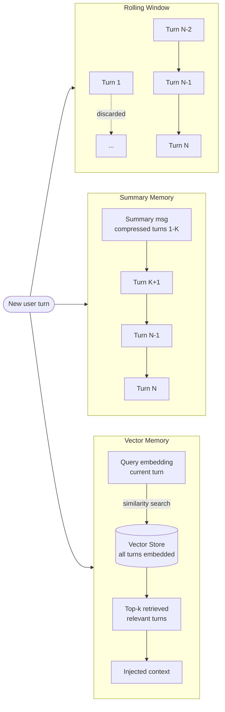
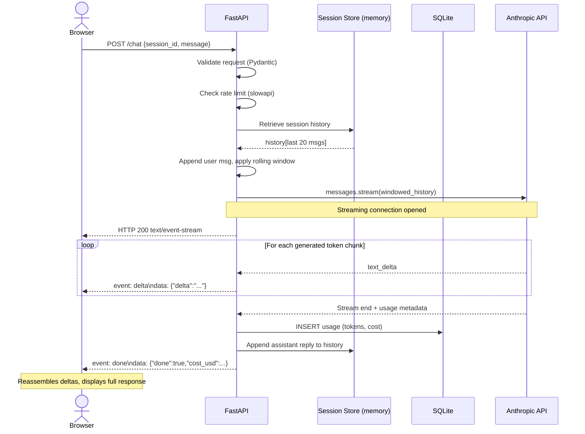

# Week 3: Working with AI APIs at Scale

**Theme:** From single calls to real applications

By the end of Week 2, you could send a single prompt to an AI API and receive a response. That is a useful starting point, but production AI applications demand much more: they must remember context across turns, handle slow network responses gracefully, keep costs under control, and serve many users simultaneously. This week closes that gap. You will build toward a fully functioning FastAPI backend that streams responses, maintains rolling-window memory, and tracks token costs in SQLite — the Lab at the end ties every concept together.

---

## 3.1 Conversation State and Memory

### Why the API Is Stateless

Every call to a language-model API is independent. The server does not remember your previous request; you must supply the entire conversation history on every turn. This is not a design flaw — it makes servers horizontally scalable — but it creates an engineering problem: as conversations grow, the **context window** fills up, latency increases, and cost rises linearly with history length.

The solution is a **memory strategy**: a policy for deciding which turns to keep, compress, or retrieve when constructing the next API request. Three strategies dominate production systems.

### Rolling Window Memory

The simplest strategy is a **rolling window**: keep only the last *N* user/assistant turn pairs. Older turns are discarded. This bounds token usage at `O(N × avg_turn_length)` regardless of conversation length.

Rolling window is appropriate when recent context is sufficient — customer support chats, coding assistants, short Q&A sessions. It fails when the user references something said twenty turns ago.

### Summary Memory

**Summary memory** compresses old turns into a single system-level summary message. When the buffer exceeds a threshold, a secondary LLM call summarises the oldest turns into a paragraph, which replaces them. The active window then contains `[summary_message, recent_N_turns]`.

This preserves semantic content from early in the conversation at the cost of one extra API call per compression event. Compression happens infrequently, so the overhead is acceptable.

### Vector Memory

**Vector memory** (also called retrieval-augmented memory) embeds every turn into a vector store. At query time the current user message is embedded, and the *k* most semantically similar past turns are retrieved and injected into the context. This scales to arbitrarily long histories but requires an embedding model and a vector database (Chroma, Pinecone, Qdrant, or Redis with the vector module).

Vector memory shines for long-running personal assistants and document-heavy workflows where exact retrieval matters more than narrative continuity.



> **Key Insight:** No single memory strategy is best. Rolling window is the default for most applications. Add summary or vector memory only when users consistently hit context limits or reference distant history.

### The ConversationManager Class

A `ConversationManager` encapsulates memory strategy selection, making it easy to swap strategies without rewriting application code.

```python
"""
conversation_manager.py
ConversationManager with pluggable memory strategies.
Requires: pip install anthropic tiktoken
"""
from __future__ import annotations

import tiktoken
from dataclasses import dataclass, field
from enum import Enum
from typing import Literal

import anthropic

MODEL = "claude-sonnet-4-6"
ENCODING = tiktoken.get_encoding("cl100k_base")


def count_tokens(text: str) -> int:
    """Approximate token count using the cl100k_base encoding."""
    return len(ENCODING.encode(text))


class MemoryStrategy(Enum):
    ROLLING = "rolling"
    SUMMARY = "summary"


@dataclass
class ConversationManager:
    """
    Manages multi-turn conversation history with configurable memory strategies.

    Args:
        strategy:    MemoryStrategy.ROLLING or MemoryStrategy.SUMMARY
        max_turns:   For ROLLING — how many turn pairs to keep.
        max_tokens:  For SUMMARY — token budget before compression fires.
        system:      Optional system prompt prepended to every request.
    """

    strategy: MemoryStrategy = MemoryStrategy.ROLLING
    max_turns: int = 10
    max_tokens: int = 4096
    system: str = "You are a helpful assistant."

    _history: list[dict] = field(default_factory=list, repr=False)
    _client: anthropic.Anthropic = field(
        default_factory=anthropic.Anthropic, repr=False
    )

    # --- Public API ---

    def chat(self, user_message: str) -> str:
        """Send a user message and return the assistant reply."""
        self._history.append({"role": "user", "content": user_message})
        context = self._build_context()

        response = self._client.messages.create(
            model=MODEL,
            max_tokens=1024,
            system=self.system,
            messages=context,
        )
        reply = response.content[0].text
        self._history.append({"role": "assistant", "content": reply})
        return reply

    def reset(self) -> None:
        """Clear all conversation history."""
        self._history = []

    # --- Private helpers ---

    def _build_context(self) -> list[dict]:
        """Return the messages list to send, applying the active strategy."""
        if self.strategy == MemoryStrategy.ROLLING:
            return self._rolling_context()
        elif self.strategy == MemoryStrategy.SUMMARY:
            return self._summary_context()
        raise ValueError(f"Unknown strategy: {self.strategy}")

    def _rolling_context(self) -> list[dict]:
        """Keep only the last max_turns * 2 messages (user+assistant pairs)."""
        cutoff = self.max_turns * 2
        return self._history[-cutoff:]

    def _summary_context(self) -> list[dict]:
        """
        If total tokens exceed max_tokens, compress the oldest half of history
        into a summary message, then return [summary] + recent_half.
        """
        total = sum(count_tokens(m["content"]) for m in self._history)
        if total <= self.max_tokens:
            return self._history[:]

        # Split: compress the first half, keep the second half verbatim
        midpoint = len(self._history) // 2
        old_turns = self._history[:midpoint]
        recent_turns = self._history[midpoint:]

        summary_text = self._compress(old_turns)
        summary_msg = {
            "role": "user",
            "content": f"[Conversation summary so far]: {summary_text}",
        }
        # Persist the compressed form so future turns stay bounded
        self._history = [summary_msg] + recent_turns
        return self._history[:]

    def _compress(self, turns: list[dict]) -> str:
        """Ask the model to summarise a list of turns."""
        transcript = "\n".join(
            f"{m['role'].upper()}: {m['content']}" for m in turns
        )
        resp = self._client.messages.create(
            model=MODEL,
            max_tokens=512,
            messages=[
                {
                    "role": "user",
                    "content": (
                        "Summarise the following conversation excerpt in "
                        "3-5 sentences, preserving key facts and decisions:\n\n"
                        + transcript
                    ),
                }
            ],
        )
        return resp.content[0].text


# --- Quick smoke-test ---
if __name__ == "__main__":
    mgr = ConversationManager(strategy=MemoryStrategy.ROLLING, max_turns=5)
    print(mgr.chat("My name is Alex and I am learning AI engineering."))
    print(mgr.chat("What is my name?"))
```

> **Key Insight:** Store raw history separately from the context you send. This lets you implement multiple strategies on the same history without data loss.

> **Key Insight:** For summary memory, the compression call itself costs tokens. Trigger compression rarely (e.g., when total tokens exceed 80% of the model's context limit) to keep the overhead negligible.

### Chapter Checkpoint

1. Why does a stateless API require the client to resend the full conversation history on every turn, and what constraint does this place on conversation length?
2. Describe one scenario where rolling-window memory would fail but vector memory would succeed.
3. In the `ConversationManager` above, where would you add instrumentation to record the token count of each outgoing request?

---

## 3.2 Streaming and Async Patterns

### The Case for Streaming

A 500-token response at typical generation speeds takes two to four seconds to complete. Without streaming, the user sees nothing until the entire response arrives — a blank screen followed by an abrupt wall of text. **Streaming** delivers tokens as they are generated, enabling progressive rendering that feels interactive and responsive.

The Anthropic Python SDK exposes streaming via a context manager. You iterate over **chunks** as they arrive; each chunk carries a delta containing newly generated text.

### Synchronous Streaming

```python
"""
streaming_sync.py
Synchronous streaming with live terminal output.
Requires: pip install anthropic
"""
import anthropic
import sys

client = anthropic.Anthropic()


def stream_to_terminal(prompt: str) -> str:
    """
    Stream a response to stdout character-by-character and return
    the full assembled text when the stream ends.
    """
    full_response = []

    # The streaming context manager handles connection lifecycle
    with client.messages.stream(
        model="claude-sonnet-4-6",
        max_tokens=1024,
        messages=[{"role": "user", "content": prompt}],
    ) as stream:
        for text_delta in stream.text_stream:
            # Print without newline, flush immediately so the terminal
            # renders each chunk as it arrives
            print(text_delta, end="", flush=True)
            full_response.append(text_delta)

    print()  # Final newline after streaming ends
    return "".join(full_response)


if __name__ == "__main__":
    question = sys.argv[1] if len(sys.argv) > 1 else "Explain gradient descent."
    answer = stream_to_terminal(question)
    print(f"\n[Received {len(answer)} characters]")
```

### Async Concurrent Calls with httpx

When you need to send many independent prompts — batch classification, multi-document summarisation — you want them in flight simultaneously. Python's **asyncio** combined with an async HTTP client such as **httpx** enables this. The Anthropic SDK also ships an async client.

```python
"""
async_batch.py
Send multiple independent prompts concurrently using asyncio.
Requires: pip install anthropic
"""
import asyncio
import time
from anthropic import AsyncAnthropic

client = AsyncAnthropic()

PROMPTS = [
    "In one sentence, what is backpropagation?",
    "In one sentence, what is attention in transformers?",
    "In one sentence, what is a vector embedding?",
    "In one sentence, what is a context window?",
]


async def single_call(prompt: str, index: int) -> tuple[int, str]:
    """Execute one API call and return (index, response_text)."""
    response = await client.messages.create(
        model="claude-sonnet-4-6",
        max_tokens=128,
        messages=[{"role": "user", "content": prompt}],
    )
    return index, response.content[0].text


async def batch_calls(prompts: list[str]) -> list[str]:
    """Fire all prompts concurrently; return responses in original order."""
    tasks = [single_call(p, i) for i, p in enumerate(prompts)]
    results = await asyncio.gather(*tasks)
    # asyncio.gather preserves task order, but sort defensively
    results.sort(key=lambda r: r[0])
    return [text for _, text in results]


if __name__ == "__main__":
    start = time.perf_counter()
    answers = asyncio.run(batch_calls(PROMPTS))
    elapsed = time.perf_counter() - start

    for prompt, answer in zip(PROMPTS, answers):
        print(f"Q: {prompt}\nA: {answer}\n")
    print(f"All {len(PROMPTS)} calls completed in {elapsed:.2f}s")
```

> **Key Insight:** `asyncio.gather` fires all coroutines concurrently within a single thread. For four independent 1-second calls, total wall-clock time approaches 1 second rather than 4 seconds.

### Retry Logic with tenacity

Network errors and rate-limit responses (`429 Too Many Requests`) are routine in production. **tenacity** provides decorator-based retry logic with **exponential backoff with jitter** — each retry waits longer than the last, and jitter adds randomness to prevent thundering-herd problems when many clients retry simultaneously.

```python
"""
retry_client.py
Exponential backoff with jitter using tenacity.
Requires: pip install anthropic tenacity
"""
import anthropic
from tenacity import (
    retry,
    stop_after_attempt,
    wait_exponential_jitter,
    retry_if_exception_type,
)

client = anthropic.Anthropic()


@retry(
    retry=retry_if_exception_type(
        (anthropic.RateLimitError, anthropic.APIConnectionError)
    ),
    wait=wait_exponential_jitter(initial=1, max=60, jitter=2),
    stop=stop_after_attempt(6),
    reraise=True,
)
def resilient_call(prompt: str) -> str:
    """Call the API with automatic retry on transient failures."""
    response = client.messages.create(
        model="claude-sonnet-4-6",
        max_tokens=512,
        messages=[{"role": "user", "content": prompt}],
    )
    return response.content[0].text
```

### Circuit Breaker Pattern

A **circuit breaker** wraps a remote call and tracks failure rate over a sliding window. If failures exceed a threshold, the circuit "opens" and subsequent calls fail immediately (without hitting the downstream service) until a cooldown period elapses. This prevents a degraded API from cascading into full application failure.

```python
"""
circuit_breaker.py
Simple circuit breaker wrapping an API call.
Requires: pip install anthropic
"""
import time
import anthropic

client = anthropic.Anthropic()


class CircuitBreaker:
    """
    Three-state circuit breaker: CLOSED (normal), OPEN (failing fast),
    HALF_OPEN (testing recovery).
    """

    CLOSED = "closed"
    OPEN = "open"
    HALF_OPEN = "half_open"

    def __init__(self, failure_threshold: int = 5, recovery_timeout: float = 30.0):
        self.failure_threshold = failure_threshold
        self.recovery_timeout = recovery_timeout
        self._failure_count = 0
        self._last_failure_time: float | None = None
        self._state = self.CLOSED

    @property
    def state(self) -> str:
        if self._state == self.OPEN:
            # Check whether the recovery window has elapsed
            if (
                self._last_failure_time
                and time.monotonic() - self._last_failure_time > self.recovery_timeout
            ):
                self._state = self.HALF_OPEN
        return self._state

    def call(self, prompt: str) -> str:
        """Attempt the API call or raise immediately if circuit is open."""
        if self.state == self.OPEN:
            raise RuntimeError("Circuit is OPEN — downstream service unavailable")

        try:
            response = client.messages.create(
                model="claude-sonnet-4-6",
                max_tokens=256,
                messages=[{"role": "user", "content": prompt}],
            )
            self._on_success()
            return response.content[0].text
        except (anthropic.RateLimitError, anthropic.APIConnectionError) as exc:
            self._on_failure()
            raise exc

    def _on_success(self) -> None:
        self._failure_count = 0
        self._state = self.CLOSED

    def _on_failure(self) -> None:
        self._failure_count += 1
        self._last_failure_time = time.monotonic()
        if self._failure_count >= self.failure_threshold:
            self._state = self.OPEN
```

> **Key Insight:** Combine tenacity (retry) and a circuit breaker for defense in depth. Tenacity handles brief transient errors; the circuit breaker handles sustained outages where retrying would only make congestion worse.

### Chapter Checkpoint

1. What is the difference between `stream.text_stream` and iterating over raw `stream` events in the Anthropic SDK?
2. Why does jitter improve the effectiveness of exponential backoff in a multi-client scenario?
3. Explain the three states of a circuit breaker and what transition triggers each state change.

---

## 3.3 Cost Management

### Why Cost Management Matters

Language model APIs bill per token. A single poorly bounded application can accumulate hundreds of dollars in charges overnight. Systematic cost management is not optional in production — it is a first-class engineering requirement alongside latency and reliability.

### Counting Tokens Before Sending

**tiktoken** is OpenAI's tokeniser library; the `cl100k_base` encoding approximates token counts for Claude models within a few percent. Counting tokens before sending lets you enforce budgets, choose between models, and log cost predictions.

```python
"""
token_counter.py
Count tokens and estimate cost before sending a request.
Requires: pip install tiktoken
"""
import tiktoken

# Approximate pricing as of mid-2025 (USD per million tokens).
# Replace with current values from the provider's pricing page.
MODEL_PRICING: dict[str, dict[str, float]] = {
    "claude-sonnet-4-6": {"input": 3.00, "output": 15.00},
    "claude-haiku-3-5": {"input": 0.80, "output": 4.00},
}

ENCODING = tiktoken.get_encoding("cl100k_base")


def count_tokens(text: str) -> int:
    """Return approximate token count for a text string."""
    return len(ENCODING.encode(text))


def count_messages_tokens(messages: list[dict]) -> int:
    """Sum token counts across a messages list (role + content per turn)."""
    total = 0
    for msg in messages:
        # Each message has a small structural overhead (~4 tokens)
        total += 4
        total += count_tokens(msg.get("content", ""))
    return total


def estimate_cost(
    input_tokens: int,
    output_tokens: int,
    model: str = "claude-sonnet-4-6",
) -> float:
    """
    Return estimated cost in USD for a request.

    Args:
        input_tokens:  Token count of the prompt (messages + system).
        output_tokens: Expected or measured token count of the response.
        model:         Model identifier key in MODEL_PRICING.
    """
    if model not in MODEL_PRICING:
        raise ValueError(f"Unknown model: {model}. Add it to MODEL_PRICING.")
    pricing = MODEL_PRICING[model]
    input_cost = (input_tokens / 1_000_000) * pricing["input"]
    output_cost = (output_tokens / 1_000_000) * pricing["output"]
    return input_cost + output_cost


# --- Demo ---
if __name__ == "__main__":
    messages = [
        {"role": "user", "content": "Summarise the history of machine learning."},
    ]
    in_tokens = count_messages_tokens(messages)
    # Assume ~500 output tokens for planning purposes
    estimated = estimate_cost(in_tokens, 500)
    print(f"Input tokens : {in_tokens}")
    print(f"Estimated cost: ${estimated:.6f}")
```

### Semantic Cache with Redis

A **semantic cache** stores previous responses indexed by the embedding of their prompt. On each new request, you embed the incoming prompt, query the cache for the nearest neighbour, and return the cached response if similarity exceeds a threshold (typically 0.95). This eliminates redundant API calls for semantically identical questions phrased differently.

```python
"""
semantic_cache.py
Redis-backed semantic cache using vector similarity.
Requires: pip install redis anthropic numpy
Assumes Redis Stack (with the Search module) running on localhost:6379.
"""
import hashlib
import json
import numpy as np
import anthropic

# Redis with vector support
try:
    from redis import Redis
    from redis.commands.search.field import VectorField, TextField
    from redis.commands.search.indexDefinition import IndexDefinition, IndexType
    from redis.commands.search.query import Query
    REDIS_AVAILABLE = True
except ImportError:
    REDIS_AVAILABLE = False

client = anthropic.Anthropic()
SIMILARITY_THRESHOLD = 0.95
EMBEDDING_DIM = 1536  # Adjust to match your embedding model output size


def embed_text(text: str) -> list[float]:
    """
    Placeholder: replace with a real embedding call.
    In production use an embedding model (e.g., text-embedding-3-small).
    """
    # Deterministic fake embedding for illustration
    h = hashlib.sha256(text.encode()).digest()
    vec = np.frombuffer(h, dtype=np.float32)
    vec = np.resize(vec, EMBEDDING_DIM)
    norm = np.linalg.norm(vec)
    return (vec / norm).tolist() if norm > 0 else vec.tolist()


def cosine_similarity(a: list[float], b: list[float]) -> float:
    va, vb = np.array(a), np.array(b)
    return float(np.dot(va, vb) / (np.linalg.norm(va) * np.linalg.norm(vb) + 1e-9))


class SemanticCache:
    """Simple in-memory semantic cache (swap for Redis in production)."""

    def __init__(self, threshold: float = SIMILARITY_THRESHOLD):
        self.threshold = threshold
        # Each entry: {"embedding": [...], "response": "..."}
        self._store: list[dict] = []

    def get(self, prompt: str) -> str | None:
        """Return cached response if a similar prompt exists, else None."""
        query_emb = embed_text(prompt)
        for entry in self._store:
            sim = cosine_similarity(query_emb, entry["embedding"])
            if sim >= self.threshold:
                print(f"[Cache HIT] similarity={sim:.4f}")
                return entry["response"]
        return None

    def set(self, prompt: str, response: str) -> None:
        """Store a prompt-response pair in the cache."""
        self._store.append({"embedding": embed_text(prompt), "response": response})

    def cached_chat(self, prompt: str) -> tuple[str, bool]:
        """
        Return (response_text, was_cached).
        Avoids an API call when a semantically equivalent prompt is cached.
        """
        cached = self.get(prompt)
        if cached is not None:
            return cached, True

        # Cache miss: call the API
        resp = client.messages.create(
            model="claude-sonnet-4-6",
            max_tokens=512,
            messages=[{"role": "user", "content": prompt}],
        )
        text = resp.content[0].text
        self.set(prompt, text)
        return text, False


if __name__ == "__main__":
    cache = SemanticCache()
    q1 = "What is gradient descent?"
    q2 = "Can you explain gradient descent to me?"  # semantically near q1

    r1, hit1 = cache.cached_chat(q1)
    print(f"Q1 (hit={hit1}): {r1[:80]}...\n")

    r2, hit2 = cache.cached_chat(q2)
    print(f"Q2 (hit={hit2}): {r2[:80]}...")
```

### Prompt Caching with Anthropic cache_control

Anthropic supports **prompt caching** via the `cache_control` field: you mark a message block as cacheable and the API charges reduced rates for cache hits on identical prefixes. This is distinct from semantic caching — it operates at the provider level on exact byte matches.

```python
"""
prompt_cache.py
Demonstrates Anthropic's cache_control for a long system prompt.
Requires: pip install anthropic
"""
import anthropic

client = anthropic.Anthropic()

LONG_SYSTEM_CONTEXT = """
You are an expert Python instructor with deep knowledge of async programming,
API design, and production engineering practices. [Imagine 2000 more words
of reference material here — a large document that rarely changes.]
""" * 20  # Artificially inflate to trigger caching benefit


def cached_system_call(user_message: str) -> str:
    """
    The system prompt is marked with cache_control so repeated calls
    with the same system prefix are served from the provider's cache.
    """
    response = client.messages.create(
        model="claude-sonnet-4-6",
        max_tokens=512,
        system=[
            {
                "type": "text",
                "text": LONG_SYSTEM_CONTEXT,
                "cache_control": {"type": "ephemeral"},  # Cache this prefix
            }
        ],
        messages=[{"role": "user", "content": user_message}],
    )
    usage = response.usage
    print(
        f"Input tokens: {usage.input_tokens} | "
        f"Cache read: {getattr(usage, 'cache_read_input_tokens', 0)} | "
        f"Cache write: {getattr(usage, 'cache_creation_input_tokens', 0)}"
    )
    return response.content[0].text
```

### Per-Session Cost Dashboard with SQLite

```python
"""
cost_tracker.py
SQLite-backed per-session cost and token tracker.
Requires: pip install anthropic tiktoken (sqlite3 is stdlib)
"""
import sqlite3
import time
import uuid
from pathlib import Path
from token_counter import count_tokens, estimate_cost  # from earlier snippet

DB_PATH = Path("cost_tracker.db")


def init_db(db_path: Path = DB_PATH) -> None:
    """Create the usage table if it does not exist."""
    with sqlite3.connect(db_path) as conn:
        conn.execute(
            """
            CREATE TABLE IF NOT EXISTS usage (
                id          TEXT PRIMARY KEY,
                session_id  TEXT NOT NULL,
                timestamp   REAL NOT NULL,
                model       TEXT NOT NULL,
                input_tok   INTEGER NOT NULL,
                output_tok  INTEGER NOT NULL,
                cost_usd    REAL NOT NULL
            )
            """
        )


def record_usage(
    session_id: str,
    model: str,
    input_tokens: int,
    output_tokens: int,
    db_path: Path = DB_PATH,
) -> float:
    """Persist one API call's usage and return the cost for this call."""
    cost = estimate_cost(input_tokens, output_tokens, model)
    with sqlite3.connect(db_path) as conn:
        conn.execute(
            "INSERT INTO usage VALUES (?,?,?,?,?,?,?)",
            (str(uuid.uuid4()), session_id, time.time(), model,
             input_tokens, output_tokens, cost),
        )
    return cost


def session_stats(session_id: str, db_path: Path = DB_PATH) -> dict:
    """Return aggregated stats for a session."""
    with sqlite3.connect(db_path) as conn:
        row = conn.execute(
            """
            SELECT COUNT(*), SUM(input_tok), SUM(output_tok), SUM(cost_usd)
            FROM usage WHERE session_id = ?
            """,
            (session_id,),
        ).fetchone()
    calls, in_tok, out_tok, total_cost = row
    return {
        "session_id": session_id,
        "calls": calls or 0,
        "total_input_tokens": in_tok or 0,
        "total_output_tokens": out_tok or 0,
        "total_cost_usd": round(total_cost or 0.0, 6),
    }


def global_stats(db_path: Path = DB_PATH) -> dict:
    """Return aggregated stats across all sessions."""
    with sqlite3.connect(db_path) as conn:
        row = conn.execute(
            "SELECT COUNT(*), SUM(input_tok), SUM(output_tok), SUM(cost_usd) FROM usage"
        ).fetchone()
    calls, in_tok, out_tok, total_cost = row
    return {
        "total_calls": calls or 0,
        "total_input_tokens": in_tok or 0,
        "total_output_tokens": out_tok or 0,
        "total_cost_usd": round(total_cost or 0.0, 6),
    }
```

> **Key Insight:** Semantic caching and prompt caching are complementary. Semantic caching avoids API calls entirely for near-duplicate queries; prompt caching reduces the cost of calls that do reach the API by reusing a shared context prefix.

> **Key Insight:** Track cost at request time by recording `response.usage.input_tokens` and `response.usage.output_tokens` from the API response object rather than estimating from tiktoken. Estimates are useful for pre-flight budgeting; actual usage figures are authoritative for billing.

### Chapter Checkpoint

1. What is the difference between a semantic cache and Anthropic's `cache_control` prompt caching? When would you use each?
2. Why might tiktoken-based token estimates differ from the API's reported `input_tokens`?
3. Describe how you would set a per-session spending limit that automatically refuses new requests once a user exceeds $0.10 in a single session.

---

## 3.4 FastAPI AI Endpoint

### Why FastAPI for AI Backends

**FastAPI** is the dominant choice for Python AI backends because it is built on Starlette (async-native) and Pydantic (data validation), ships automatic OpenAPI docs, and integrates cleanly with asyncio-based API clients. For AI workloads — where a single request may take several seconds and the server must handle many concurrent users — async-first design is not optional.

### Project Structure

```
ai_api/
├── main.py          # FastAPI application
├── conversation.py  # ConversationManager (from 3.1)
├── cost_tracker.py  # SQLite cost tracking (from 3.3)
├── token_counter.py # Token counting utilities (from 3.3)
└── requirements.txt
```

### The FastAPI Application

```python
"""
main.py
FastAPI AI endpoint with streaming SSE, rolling-window memory,
rate limiting, and a /stats endpoint.
Requires: pip install fastapi uvicorn[standard] anthropic tiktoken slowapi
"""
from __future__ import annotations

import asyncio
import json
import uuid
from typing import AsyncIterator

import anthropic
from fastapi import FastAPI, HTTPException, Request
from fastapi.responses import StreamingResponse
from pydantic import BaseModel, Field
from slowapi import Limiter, _rate_limit_exceeded_handler
from slowapi.errors import RateLimitExceeded
from slowapi.util import get_remote_address

from cost_tracker import init_db, record_usage, global_stats, session_stats
from token_counter import count_messages_tokens, estimate_cost

# --- Initialisation ---

init_db()
limiter = Limiter(key_func=get_remote_address)
app = FastAPI(title="AI Chat API", version="1.0.0")
app.state.limiter = limiter
app.add_exception_handler(RateLimitExceeded, _rate_limit_exceeded_handler)

client = anthropic.AsyncAnthropic()

# In-memory session store.  Replace with Redis for multi-process deployments.
sessions: dict[str, list[dict]] = {}
MAX_TURNS = 10  # Rolling window size


# --- Request / Response Models ---

class ChatRequest(BaseModel):
    session_id: str = Field(
        default_factory=lambda: str(uuid.uuid4()),
        description="Opaque session identifier.  Create one per conversation.",
    )
    message: str = Field(..., min_length=1, max_length=8192)
    model: str = Field(default="claude-sonnet-4-6")
    max_tokens: int = Field(default=1024, ge=1, le=4096)


class StatsResponse(BaseModel):
    total_calls: int
    total_input_tokens: int
    total_output_tokens: int
    total_cost_usd: float


# --- SSE Helpers ---

def sse_event(data: str | dict, event: str = "message") -> str:
    """Format a Server-Sent Events frame."""
    payload = data if isinstance(data, str) else json.dumps(data)
    return f"event: {event}\ndata: {payload}\n\n"


async def stream_chat_sse(
    session_id: str,
    messages: list[dict],
    model: str,
    max_tokens: int,
) -> AsyncIterator[str]:
    """
    Open a streaming connection to the Anthropic API and yield SSE frames.
    Accumulates the full response text so we can record usage at the end.
    """
    full_text_parts: list[str] = []
    input_tokens = count_messages_tokens(messages)

    try:
        async with client.messages.stream(
            model=model,
            max_tokens=max_tokens,
            messages=messages,
        ) as stream:
            async for text_delta in stream.text_stream:
                full_text_parts.append(text_delta)
                # Send each delta as an SSE "delta" event
                yield sse_event({"delta": text_delta}, event="delta")

        # Retrieve final usage from the completed stream
        final_message = await stream.get_final_message()
        output_tokens = final_message.usage.output_tokens
        input_tokens = final_message.usage.input_tokens

    except anthropic.APIError as exc:
        yield sse_event({"error": str(exc)}, event="error")
        return

    # Persist usage to SQLite
    cost = record_usage(session_id, model, input_tokens, output_tokens)

    # Signal stream completion with metadata
    yield sse_event(
        {
            "done": True,
            "input_tokens": input_tokens,
            "output_tokens": output_tokens,
            "cost_usd": cost,
        },
        event="done",
    )

    # Store assistant reply in session history
    full_text = "".join(full_text_parts)
    sessions[session_id].append({"role": "assistant", "content": full_text})


# --- Endpoints ---

@app.post("/chat")
@limiter.limit("30/minute")
async def chat(request: Request, body: ChatRequest) -> StreamingResponse:
    """
    Accept a user message, apply rolling-window memory, and stream
    the AI response as Server-Sent Events.
    """
    # Retrieve or initialise session history
    history = sessions.setdefault(body.session_id, [])

    # Append the new user message
    history.append({"role": "user", "content": body.message})

    # Apply rolling window: keep last MAX_TURNS * 2 messages
    windowed = history[-(MAX_TURNS * 2):]

    return StreamingResponse(
        stream_chat_sse(body.session_id, windowed, body.model, body.max_tokens),
        media_type="text/event-stream",
        headers={
            "Cache-Control": "no-cache",
            "X-Accel-Buffering": "no",  # Disable nginx buffering if applicable
        },
    )


@app.get("/stats", response_model=StatsResponse)
async def stats() -> StatsResponse:
    """Return aggregated token usage and cost across all sessions."""
    data = global_stats()
    return StatsResponse(**data)


@app.get("/stats/{session_id}", response_model=StatsResponse)
async def session_stats_endpoint(session_id: str) -> StatsResponse:
    """Return token usage and cost for a specific session."""
    data = session_stats(session_id)
    if data["calls"] == 0:
        raise HTTPException(status_code=404, detail="Session not found")
    return StatsResponse(**data)


@app.get("/health")
async def health() -> dict:
    return {"status": "ok"}
```

### Running the Server

```bash
# Install dependencies
pip install fastapi "uvicorn[standard]" anthropic tiktoken slowapi

# Start the server with hot reload (development)
uvicorn main:app --reload --port 8000

# Start the server for production (multiple workers)
uvicorn main:app --host 0.0.0.0 --port 8000 --workers 4
```

### Streaming SSE: FastAPI to Browser

The following sequence diagram shows the full lifecycle of a streaming chat request from a browser client to the FastAPI server and on to the Anthropic API.



### Testing the Endpoint

```python
"""
test_client.py
Simple async test client for the streaming /chat endpoint.
Requires: pip install httpx
"""
import asyncio
import httpx
import json


async def stream_chat(message: str, session_id: str = "test-session") -> None:
    """Connect to the SSE endpoint and print deltas as they arrive."""
    url = "http://localhost:8000/chat"
    payload = {"session_id": session_id, "message": message}

    async with httpx.AsyncClient(timeout=60.0) as client:
        async with client.stream("POST", url, json=payload) as response:
            async for line in response.aiter_lines():
                if line.startswith("data:"):
                    data = json.loads(line[5:].strip())
                    if "delta" in data:
                        print(data["delta"], end="", flush=True)
                    elif data.get("done"):
                        print(
                            f"\n\n[Tokens: {data['input_tokens']}+{data['output_tokens']}"
                            f" | Cost: ${data['cost_usd']:.6f}]"
                        )


async def main():
    await stream_chat("What is the capital of France?")
    await stream_chat("And what is its population?")  # Uses same session


asyncio.run(main())
```

> **Key Insight:** Set `X-Accel-Buffering: no` in the response headers when FastAPI sits behind nginx. Without this header, nginx buffers the entire SSE stream and the browser receives nothing until the response completes — defeating the purpose of streaming.

> **Key Insight:** Pydantic's request validation in FastAPI runs before your handler code. This means malformed inputs — a message that exceeds `max_length`, a negative `max_tokens` — are rejected with a structured 422 error without you writing any validation logic.

### Chapter Checkpoint

1. What HTTP mechanism does `StreamingResponse` with `media_type="text/event-stream"` use, and how does it differ from WebSockets?
2. Why is `slowapi`'s `get_remote_address` key function insufficient for rate-limiting authenticated users, and what alternative key function would you use?
3. In the SSE stream, why is the `done` event sent after the SQLite `INSERT` rather than before? What could go wrong if the order were reversed?

---

## Lab Walkthrough: Multi-Turn AI Assistant with Streaming and Cost Tracking

### Overview

You will build a complete backend service that:
- Accepts multi-turn chat messages via a POST endpoint
- Maintains rolling-window memory per session
- Streams AI responses to clients using Server-Sent Events
- Records every API call's token usage and cost in SQLite
- Exposes a /stats endpoint for the running totals

**Estimated time:** 90-120 minutes

### Step 1: Set Up the Project

```bash
mkdir ai_chat_lab && cd ai_chat_lab
python -m venv .venv

# Windows
.venv\Scripts\activate
# macOS/Linux
source .venv/bin/activate

pip install fastapi "uvicorn[standard]" anthropic tiktoken slowapi httpx
```

Create a `.env` file (never commit this):

```bash
ANTHROPIC_API_KEY=sk-ant-your-key-here
```

Load it at runtime:

```python
# config.py
from dotenv import load_dotenv
import os
load_dotenv()
ANTHROPIC_API_KEY = os.environ["ANTHROPIC_API_KEY"]
```

### Step 2: Implement the Token Counter

Create `token_counter.py` using the full implementation from Section 3.3. Verify it works:

```bash
python token_counter.py
# Expected output:
# Input tokens : 12
# Estimated cost: $0.000036
```

### Step 3: Implement the Cost Tracker

Create `cost_tracker.py` using the full implementation from Section 3.3. Test it:

```python
# Quick test
from cost_tracker import init_db, record_usage, global_stats
init_db()
record_usage("session-1", "claude-sonnet-4-6", 100, 200)
print(global_stats())
# Expected: {'total_calls': 1, 'total_input_tokens': 100, ...}
```

### Step 4: Implement the FastAPI Application

Create `main.py` using the full implementation from Section 3.4. Key decisions to understand:

- **Why `sessions: dict[str, list[dict]] = {}`?** In-memory storage is simple for a single-process server. For multi-worker deployments, swap this for a Redis hash.
- **Why `windowed = history[-(MAX_TURNS * 2):]`?** Each "turn" is a user message plus an assistant reply, so two entries in the list. `MAX_TURNS * 2` gives us the last N complete exchanges.
- **Why yield the SSE frames from an async generator?** `StreamingResponse` accepts any async iterable. The generator pattern lets us cleanly interleave stream consumption, SSE formatting, and post-stream database writes in one function.

### Step 5: Start the Server

```bash
uvicorn main:app --reload --port 8000
```

Visit `http://localhost:8000/docs` in your browser. You will see the auto-generated OpenAPI UI. Try the `/chat` endpoint directly from the browser — note that it returns the raw SSE stream text since the UI does not render SSE.

### Step 6: Test with the Async Client

Create `test_client.py` using the implementation from Section 3.4 and run it:

```bash
python test_client.py
```

You should see tokens streaming to the terminal in real time, followed by a cost summary line.

Send a follow-up message that references the first to verify memory is working:

```python
# In test_client.py main():
await stream_chat("My favourite colour is ultraviolet.", session_id="mem-test")
await stream_chat("What is my favourite colour?", session_id="mem-test")
# The second answer should mention ultraviolet
```

### Step 7: Verify the Stats Endpoint

```bash
# Check global stats
curl http://localhost:8000/stats

# Check a specific session (replace with your session_id)
curl http://localhost:8000/stats/mem-test
```

Expected response shape:

```json
{
  "total_calls": 2,
  "total_input_tokens": 245,
  "total_output_tokens": 189,
  "total_cost_usd": 0.003570
}
```

### Step 8: Stretch Goals

Once the basic lab works, try these extensions:

1. **Add a DELETE /session/{session_id} endpoint** that clears the in-memory history and resets the session cost to zero in SQLite.
2. **Implement a per-session spending cap**: before calling the Anthropic API, query SQLite for the session's total cost and raise HTTP 402 if it exceeds $0.50.
3. **Add the semantic cache** from Section 3.3 as middleware: check the cache before opening the stream, and on cache hits return the full cached response as a single SSE `done` event.
4. **Wire in the circuit breaker** from Section 3.2 around the Anthropic client call inside `stream_chat_sse`.

---

## Further Reading

1. **"Building LLM Applications for Production"** — Chip Huyen (huyenchip.com, 2023). The definitive practitioner's guide to production LLM systems, covering latency, cost, caching, and evaluation. Freely available on the author's blog.

2. **"Designing Distributed Systems"** — Brendan Burns (O'Reilly, 2018). The circuit breaker and retry patterns in Section 3.2 are standard distributed-systems patterns; Burns provides rigorous treatment of both with implementation guidance.

3. **FastAPI Documentation — Advanced: Custom Response Classes** (fastapi.tiangolo.com). The official docs on `StreamingResponse` and SSE are concise and accurate. Read the sections on background tasks and lifespan events for production hardening.

4. **"The Architecture of Open Source Applications: nginx"** — Andrew Alexeev, in *The Architecture of Open Source Applications Vol. II* (aosabook.org, 2012). Understanding nginx's buffering model (and when to disable it) is essential for SSE deployments behind a reverse proxy.

5. **Anthropic Prompt Caching Guide** (docs.anthropic.com/en/docs/build-with-claude/prompt-caching). The authoritative reference for `cache_control`, including which models support caching, minimum cacheable token counts, and TTL behaviour. Required reading before deploying summary-memory or large-system-prompt patterns.

---

## Week Summary

- **Stateless APIs require client-side memory management.** Rolling window is the correct default; add summary or vector memory only when users hit context limits or need long-range recall.

- **Streaming transforms user experience.** Implementing `stream=True` (or `.stream()` context manager) and iterating over deltas is a small code change with an outsized impact on perceived latency.

- **Async concurrency multiplies throughput.** `asyncio.gather` over independent API calls reduces wall-clock time from O(N) to O(1) with no additional infrastructure. Use it whenever prompts do not depend on each other.

- **Cost management is an engineering discipline.** Count tokens before sending, record actual usage after receiving, cache aggressively (semantic and provider-level), and surface per-session dashboards so cost is visible — not invisible until the billing alert fires.

- **FastAPI + StreamingResponse + SSE is the standard stack for streaming AI backends.** Pydantic handles validation, slowapi handles rate limiting, and the async Anthropic client slots into the async event loop without blocking. The pattern in Section 3.4 scales from a single developer laptop to a multi-worker production deployment with minimal changes.
