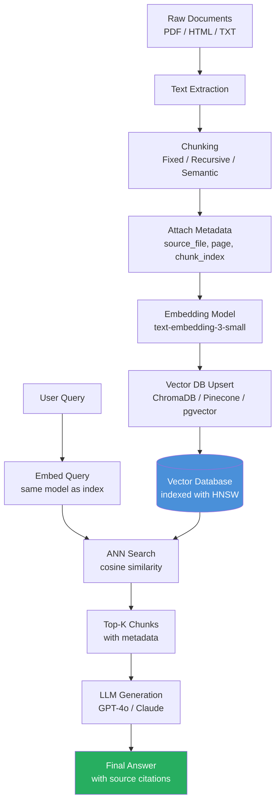
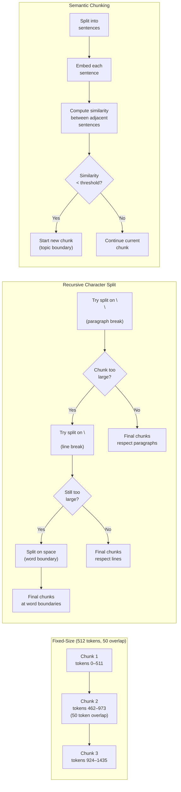

# Week 4: Embeddings and Vector Databases

**Theme: Give Your AI Long-Term Memory**

By the end of this week, you will understand how to transform raw text into mathematical representations that capture semantic meaning, store those representations efficiently in specialized databases, and retrieve the most relevant information for any query — the foundation of every modern RAG (Retrieval-Augmented Generation) system.

---

## 4.1 What Are Embeddings

### Vectors as Coordinates of Meaning

Imagine a map where every word, sentence, or document occupies a specific point in space. Two words that mean similar things are placed close together; words with opposite meanings are far apart. This is exactly what an **embedding** is: a fixed-length list of floating-point numbers (a **vector**) that encodes the semantic meaning of a piece of text as coordinates in a high-dimensional space.

When a language model processes the word "cat", it does not store the string `"cat"`. Instead, it has learned, through exposure to billions of text examples, that "cat" exists in a conceptual neighborhood near "feline", "kitten", "pet", and "meow" — and far from "automobile" or "mortgage". That neighborhood is encoded as a vector. For `text-embedding-3-small`, each vector has **1536 dimensions**. Each dimension loosely corresponds to some latent feature the model discovered during training — though no single dimension maps cleanly to a human-readable concept like "animal" or "size".

### Why "King − Man + Woman ≈ Queen" Works

One of the most famous demonstrations of embedding quality is the analogy `king − man + woman ≈ queen`. This works because embeddings capture **relational structure**, not just isolated meaning.

If you subtract the vector for "man" from the vector for "king", you isolate the concept of "royalty without maleness". Adding the vector for "woman" then reintroduces the female counterpart of that royalty concept. The result lands very close to the vector for "queen" in the embedding space.

This means embeddings support **arithmetic reasoning over meaning** — a property that SQL full-text search, keyword matching, and BM25 ranking cannot replicate. A keyword search for "monarch" will not find "sovereign" unless you explicitly add it as a synonym. An embedding search will find it automatically because both words occupy adjacent coordinates.

### Embedding Models Compared

Different embedding models make different tradeoffs between dimensionality, cost, and quality:

| Model | Dimensions | Provider | Best For |
|---|---|---|---|
| `text-embedding-3-small` | 1536 | OpenAI | General-purpose, low cost |
| `text-embedding-3-large` | 3072 | OpenAI | Highest accuracy, higher cost |
| `voyage-2` | 1024 | Voyage AI | Retrieval-focused, competitive quality |
| `embed-english-v3` | 1024 | Cohere | English retrieval, re-ranking support |

Higher dimensionality does not automatically mean better quality — it means more storage and slower search. `voyage-2` at 1024 dimensions frequently outperforms `text-embedding-3-small` at 1536 dimensions on retrieval benchmarks because Voyage AI optimized specifically for search rather than general similarity.

### Similarity Metrics

Once you have two vectors, you need a way to measure how similar they are. Three metrics dominate:

**Cosine similarity** measures the angle between two vectors, ignoring magnitude:

```
cosine_similarity(A, B) = (A · B) / (||A|| × ||B||)
```

Result ranges from −1 (opposite) to 1 (identical). This is the standard choice for text embeddings because the length of a vector (driven by text length) is irrelevant — you care about direction, not magnitude.

**Dot product** skips the normalization step: `A · B`. When vectors are already normalized to unit length (as most embedding APIs return), dot product and cosine similarity are mathematically equivalent. Dot product is faster to compute, which matters at scale.

**Euclidean distance** measures the straight-line distance between two points: `||A − B||`. This is sensitive to vector magnitude, which makes it less reliable for text embeddings of variable-length documents. It is more appropriate for image embeddings or structured numeric data.

> **Key Insight:** Always check whether your embedding model returns normalized vectors. If it does, use dot product for speed. If normalization is not guaranteed, use cosine similarity to avoid false results caused by magnitude differences.

```python
import numpy as np
from openai import OpenAI

client = OpenAI()

def get_embedding(text: str, model: str = "text-embedding-3-small") -> list[float]:
    """Generate an embedding vector for a given text string."""
    response = client.embeddings.create(
        input=text,
        model=model
    )
    return response.data[0].embedding

def cosine_similarity(vec_a: list[float], vec_b: list[float]) -> float:
    """Compute cosine similarity between two vectors."""
    a = np.array(vec_a)
    b = np.array(vec_b)
    # Dot product divided by product of magnitudes
    return float(np.dot(a, b) / (np.linalg.norm(a) * np.linalg.norm(b)))

# Demonstrate semantic similarity
vec_king   = get_embedding("king")
vec_queen  = get_embedding("queen")
vec_apple  = get_embedding("apple")

sim_royals = cosine_similarity(vec_king, vec_queen)
sim_unrelated = cosine_similarity(vec_king, vec_apple)

print(f"king <-> queen similarity:  {sim_royals:.4f}")   # ~0.85
print(f"king <-> apple similarity:  {sim_unrelated:.4f}") # ~0.30

# Demonstrate the classic analogy: king - man + woman ≈ queen
vec_man   = get_embedding("man")
vec_woman = get_embedding("woman")

analogy = np.array(vec_king) - np.array(vec_man) + np.array(vec_woman)

# Normalize the result so comparison is fair
analogy_normalized = analogy / np.linalg.norm(analogy)
queen_normalized   = np.array(vec_queen) / np.linalg.norm(vec_queen)

analogy_sim = float(np.dot(analogy_normalized, queen_normalized))
print(f"(king - man + woman) <-> queen similarity: {analogy_sim:.4f}") # ~0.75+
```

> **Key Insight:** Embeddings are trained, not engineered. The quality of your downstream search is almost entirely determined by which embedding model you choose and whether that model was trained on data similar to your domain. For legal, medical, or code retrieval tasks, consider domain-specific embedding models over general-purpose ones.

> **Key Insight:** Embedding an entire document as a single vector loses granularity. A 5,000-word article about both "Python the programming language" and "Python the snake" will produce a blended vector that retrieves poorly for either topic. This is precisely why chunking — covered in section 4.3 — is essential.

### Chapter 4.1 Checkpoint

1. A cosine similarity score of 0.97 between two document vectors means what, and how does that differ from a Euclidean distance of 0.03 between the same two vectors?
2. Explain in your own words why the `king − man + woman ≈ queen` analogy works. What property of the embedding space makes this possible?
3. You are building a retrieval system for medical literature. Why might you prefer a domain-specific embedding model like `voyage-2` over `text-embedding-3-small`, even though `text-embedding-3-small` has more dimensions?

---

## 4.2 Vector Databases

### Why Plain SQL Falls Short

Traditional relational databases are optimized for exact lookups. A query like `SELECT * FROM articles WHERE topic = 'space'` is fast because the database can use a B-tree index to jump directly to matching rows. But similarity search is fundamentally different: you are not asking "find rows where this column equals this value" — you are asking "find the 5 rows whose vectors are closest to this query vector."

Performing this naively requires computing the distance between your query vector and every stored vector. For 1 million documents at 1536 dimensions each, that is 1.536 billion floating-point multiplications per query. At 100 queries per second, that is 153.6 billion operations per second — unsustainable on commodity hardware.

SQL databases have no **Approximate Nearest Neighbor (ANN)** index. They cannot narrow the search space without computing all distances. This is why **vector databases** exist: they are purpose-built to index high-dimensional vectors and answer nearest-neighbor queries in milliseconds rather than seconds.

### ChromaDB: In-Process Development

**ChromaDB** is an open-source vector database that runs in-process with your Python application — no separate server, no Docker container, no network calls. Data is persisted to a local directory. This makes it ideal for prototyping, development, and workloads under approximately 1 million vectors.

```python
import chromadb
from openai import OpenAI

# Initialize ChromaDB with persistent storage
chroma_client = chromadb.PersistentClient(path="./chroma_db")

# Create or retrieve a collection (like a table in SQL)
collection = chroma_client.get_or_create_collection(
    name="wikipedia_articles",
    metadata={"hnsw:space": "cosine"}  # Use cosine distance for similarity
)

openai_client = OpenAI()

def embed_text(text: str) -> list[float]:
    """Embed text using OpenAI's text-embedding-3-small model."""
    response = openai_client.embeddings.create(
        input=text,
        model="text-embedding-3-small"
    )
    return response.data[0].embedding

# Add documents to the collection
documents = [
    "The Eiffel Tower was built in 1889 for the World's Fair.",
    "Python is a high-level programming language created by Guido van Rossum.",
    "The Amazon rainforest covers over 5.5 million square kilometers.",
]

embeddings = [embed_text(doc) for doc in documents]

collection.upsert(
    ids=["doc_0", "doc_1", "doc_2"],        # Unique identifiers
    documents=documents,                     # Raw text (stored for retrieval)
    embeddings=embeddings,                   # Precomputed vectors
    metadatas=[                              # Filterable metadata
        {"source": "history", "year": 1889},
        {"source": "technology", "year": 1991},
        {"source": "geography", "year": 2023},
    ]
)

# Query for the most similar documents
query = "tall structures in Europe"
query_embedding = embed_text(query)

results = collection.query(
    query_embeddings=[query_embedding],
    n_results=2,
    where={"source": "history"},  # Optional metadata filter
)

print("Top results:")
for doc, distance in zip(results["documents"][0], results["distances"][0]):
    print(f"  [{distance:.4f}] {doc}")
```

### Pinecone: Managed Serverless Vector Search

When your dataset exceeds what ChromaDB can handle comfortably, or when you need multi-region replication, automatic scaling, or a production SLA, **Pinecone** is the most widely adopted managed vector database. Its serverless tier charges by the number of reads and writes rather than reserved capacity, making it cost-effective for variable workloads.

Pinecone's API mirrors ChromaDB's conceptually: you create an **index** (analogous to a collection), **upsert** vectors with metadata, and **query** with a vector to retrieve the top-k nearest neighbors. The key difference is that Pinecone manages all infrastructure — sharding, replication, and index rebuilding — transparently.

### pgvector: Vectors Inside PostgreSQL

**pgvector** is a PostgreSQL extension that adds a `vector` data type and ANN indexes directly to Postgres. This approach is compelling when your application already uses PostgreSQL: you avoid introducing a new infrastructure component, can join vector search results with relational data in a single query, and use familiar SQL tooling.

```sql
-- Enable the extension
CREATE EXTENSION IF NOT EXISTS vector;

-- Create a table with a vector column
CREATE TABLE documents (
    id SERIAL PRIMARY KEY,
    content TEXT,
    source TEXT,
    embedding vector(1536)   -- 1536-dimensional vector
);

-- Create an HNSW index for fast approximate search
CREATE INDEX ON documents USING hnsw (embedding vector_cosine_ops);

-- Query for similar documents using <=> operator (cosine distance)
SELECT content, 1 - (embedding <=> '[0.1, 0.2, ...]'::vector) AS similarity
FROM documents
ORDER BY embedding <=> '[0.1, 0.2, ...]'::vector
LIMIT 5;
```

### HNSW vs IVFFlat: Choosing Your Index

Two ANN index algorithms dominate vector databases:

**HNSW (Hierarchical Navigable Small World)** builds a multi-layer graph where each layer is a sparser version of the layer below. Search begins at the top layer, navigates toward the approximate nearest neighbor, then descends to progressively denser layers for refinement. HNSW is:
- Fast to query (typically under 5ms for 1M vectors)
- No training step required — you can add vectors incrementally
- Higher memory footprint (stores graph edges alongside vectors)
- Best choice for datasets under ~10 million vectors

**IVFFlat (Inverted File with Flat vectors)** clusters vectors into `nlist` Voronoi cells during a training step. A query first identifies the `nprobe` closest cluster centroids, then does an exact search within those clusters. IVFFlat is:
- Requires a training step on a representative sample of your data
- Lower memory footprint than HNSW
- Recall degrades if `nprobe` is too small
- Better suited for datasets over 10 million vectors where HNSW memory becomes prohibitive

> **Key Insight:** HNSW is almost always the right default. Its query speed, no-training requirement, and excellent recall make it superior for the vast majority of production workloads. Only migrate to IVFFlat when your dataset exceeds ~10M vectors and memory cost becomes a concrete budget concern.

> **Key Insight:** "Approximate" in ANN means the returned results may not be the true mathematical nearest neighbors — they are very likely to be the nearest neighbors, but not guaranteed. In practice, HNSW with default parameters achieves 95–99% recall, meaning you will find 95–99 of the true top-100 results. For semantic search, this approximation is almost always acceptable because the missed 1–5 results are semantically very close to the ones returned anyway.

> **Key Insight:** Do not conflate the vector database with the LLM. The vector database stores and retrieves text chunks. The LLM synthesizes an answer from those retrieved chunks. These are separate systems with separate scaling characteristics. Your vector DB query might return results in 20ms while your LLM generation takes 2 seconds — they should be optimized independently.

### Chapter 4.2 Checkpoint

1. A startup is building a chatbot that needs to search across 50,000 internal wiki pages. They already run PostgreSQL. Which vector storage solution would you recommend and why?
2. Describe the difference between HNSW and IVFFlat in terms of when each is built and what data structure each uses for search.
3. What does "approximate" mean in Approximate Nearest Neighbor search, and why is this approximation acceptable for semantic text retrieval?

---

## 4.3 Chunking and Indexing

### Why You Must Chunk

Language models have a **context window limit** — a maximum number of tokens they can process in a single call. GPT-4o supports 128,000 tokens; Claude supports up to 200,000. But embedding models are far more constrained: `text-embedding-3-small` accepts at most 8,191 tokens per call.

Even if you could embed an entire 50-page PDF as a single vector, you should not. A vector representing 25,000 words averages across every topic in the document. When a user asks "what is the refund policy?", the similarity search must compete against the diluted signal of the entire document rather than the concentrated signal of the two paragraphs actually about refund policies.

**Chunking** — splitting documents into smaller, semantically coherent pieces before embedding — solves both problems simultaneously: it stays within context window limits and produces sharper, more focused vectors that retrieve precisely.

The fundamental tension in chunking is **granularity vs. coherence**:
- Chunks too small (50 tokens): fast retrieval, but each chunk lacks enough context to be useful as standalone evidence
- Chunks too large (2000 tokens): rich context, but retrieval precision drops because the vector averages across too many topics

The sweet spot for most applications is **256–512 tokens with 50–100 token overlap** between adjacent chunks.

### Strategy 1: Fixed-Size Chunking

**Fixed-size chunking** splits text at regular token intervals, with a configurable overlap to prevent information loss at boundaries.

```
[token 0 .............. token 511]
                 [token 462 .............. token 973]
                                  [token 924 .............. token 1435]
```

The overlap ensures that a sentence split across a boundary is fully captured in at least one chunk. This strategy is simple, predictable, and fast — but it is blind to document structure. It will cheerfully split a sentence in the middle of a key argument.

### Strategy 2: Recursive Character Splitting

**Recursive character text splitting** is aware of natural text boundaries. It tries to split on `\n\n` (paragraph breaks) first. If a resulting chunk is still too large, it splits on `\n` (line breaks). If still too large, it splits on spaces (word boundaries). This hierarchy respects document structure while still guaranteeing maximum chunk sizes.

```python
from langchain_text_splitters import RecursiveCharacterTextSplitter

splitter = RecursiveCharacterTextSplitter(
    chunk_size=512,        # Maximum characters per chunk (not tokens — see note)
    chunk_overlap=50,      # Characters of overlap between chunks
    separators=["\n\n", "\n", " ", ""],  # Try these in order
    length_function=len,   # Use character count; swap for tiktoken for token count
)

text = """
The Python programming language was created by Guido van Rossum.
He began development in the late 1980s.

Python's design philosophy emphasizes code readability.
Its syntax allows programmers to express concepts in fewer lines of code.

The language supports multiple programming paradigms.
These include procedural, object-oriented, and functional programming.
"""

chunks = splitter.create_documents([text])
for i, chunk in enumerate(chunks):
    print(f"--- Chunk {i} ({len(chunk.page_content)} chars) ---")
    print(chunk.page_content)
    print()
```

> **Key Insight:** LangChain's `RecursiveCharacterTextSplitter` counts characters by default, not tokens. A 512-character chunk is roughly 128 tokens for English prose (approximately 4 characters per token). If you need precise token-level control, pass `length_function=tiktoken_length` where `tiktoken_length` wraps `tiktoken`'s encoder. This matters for embedding models with strict token limits.

### Strategy 3: Semantic Chunking

**Semantic chunking** splits based on topic boundaries rather than fixed sizes. The algorithm:

1. Split the document into individual sentences
2. Embed each sentence
3. Compute cosine similarity between adjacent sentences
4. Identify "breakpoints" where similarity drops sharply — these indicate a topic shift
5. Group sentences between breakpoints into a single chunk

This produces chunks that are semantically unified rather than arbitrarily truncated. A chunk about the French Revolution will not be split mid-paragraph into one chunk about the Bastille and another beginning mid-sentence with the continuation. The downside is cost: you must embed every sentence to find boundaries, then re-embed the final chunks. For large corpora this doubles your embedding API costs.

```python
import numpy as np
from openai import OpenAI

client = OpenAI()

def embed_sentences(sentences: list[str]) -> list[list[float]]:
    """Batch embed multiple sentences in a single API call."""
    response = client.embeddings.create(
        input=sentences,
        model="text-embedding-3-small"
    )
    # Return embeddings in the same order as input
    return [item.embedding for item in sorted(response.data, key=lambda x: x.index)]

def semantic_chunk(text: str, breakpoint_threshold: float = 0.7) -> list[str]:
    """
    Split text into semantically coherent chunks.
    A new chunk begins where cosine similarity between adjacent sentences drops
    below the breakpoint_threshold.
    """
    # Naive sentence splitting (use spaCy for production)
    sentences = [s.strip() for s in text.split(".") if s.strip()]
    if len(sentences) < 2:
        return sentences

    embeddings = embed_sentences(sentences)

    chunks = []
    current_chunk = [sentences[0]]

    for i in range(1, len(sentences)):
        # Compute cosine similarity between current and previous sentence
        a = np.array(embeddings[i - 1])
        b = np.array(embeddings[i])
        sim = float(np.dot(a, b) / (np.linalg.norm(a) * np.linalg.norm(b)))

        if sim < breakpoint_threshold:
            # Topic shift detected — finalize the current chunk and start a new one
            chunks.append(". ".join(current_chunk) + ".")
            current_chunk = [sentences[i]]
        else:
            current_chunk.append(sentences[i])

    # Append the final chunk
    if current_chunk:
        chunks.append(". ".join(current_chunk) + ".")

    return chunks
```

### Metadata: The Hidden Multiplier

Attaching **metadata** to each chunk transforms your vector database from a pure similarity engine into a filtered retrieval system. Every chunk should carry at minimum:

| Field | Type | Purpose |
|---|---|---|
| `source_file` | string | Filter results to a specific document |
| `page_number` | int | Show users exactly where to find the source |
| `chunk_index` | int | Reconstruct surrounding context if needed |
| `created_at` | ISO datetime | Filter out stale content |
| `document_type` | string | Separate blog posts from legal contracts |

With metadata, a user query like "what does our privacy policy say about data retention?" can be restricted to `document_type = "legal"` before similarity search runs, eliminating irrelevant results from marketing copy or technical docs that happen to mention "data retention" incidentally.

```python
def index_document(
    collection,
    text: str,
    source_file: str,
    page_number: int,
    chunk_strategy: str = "recursive"
) -> int:
    """
    Chunk, embed, and index a single document page.
    Returns the number of chunks created.
    """
    splitter = RecursiveCharacterTextSplitter(chunk_size=512, chunk_overlap=50)
    chunks = splitter.create_documents([text])

    ids, embeddings, metadatas, documents = [], [], [], []

    for idx, chunk in enumerate(chunks):
        chunk_text = chunk.page_content
        chunk_id = f"{source_file}_p{page_number}_c{idx}"

        ids.append(chunk_id)
        embeddings.append(embed_text(chunk_text))
        documents.append(chunk_text)
        metadatas.append({
            "source_file": source_file,
            "page_number": page_number,
            "chunk_index": idx,
            "chunk_strategy": chunk_strategy,
        })

    # Batch upsert all chunks for this page
    collection.upsert(
        ids=ids,
        embeddings=embeddings,
        documents=documents,
        metadatas=metadatas,
    )

    return len(chunks)
```

### The Full Pipeline



### Chunking Strategy Comparison



> **Key Insight:** There is no universally best chunking strategy. For structured documents (technical manuals, legal contracts with clear sections), recursive splitting that respects headings and paragraphs outperforms fixed-size splitting. For conversational or stream-of-consciousness text (transcripts, emails), semantic chunking pays for its extra cost by grouping topic-coherent sentences together.

> **Key Insight:** Chunk overlap is not wasted computation. It is insurance against important context sitting exactly at a boundary. A sentence that begins at the end of chunk 3 and finishes at the start of chunk 4 is fully preserved in both chunks, ensuring it is always retrieved intact.

### Chapter 4.3 Checkpoint

1. A 200-page technical manual is chunked with `chunk_size=2000` and `chunk_overlap=0`. Users report that searches for specific procedures are returning irrelevant chapters. What is the most likely cause and how would you fix it?
2. Compare fixed-size chunking and semantic chunking in terms of computational cost, implementation complexity, and retrieval precision. In what scenario would you choose each?
3. A chunk has the metadata `{"source_file": "privacy_policy.pdf", "page_number": 7, "chunk_index": 3}`. Describe two different ways this metadata could be used to improve the quality of search results.

---

## Lab Walkthrough

### Lab: Semantic Search Over 500 Wikipedia Articles

**Objective:** Build a command-line semantic search tool that embeds 500 Wikipedia articles into ChromaDB and returns the top-5 most relevant passages for any natural language query.

**Prerequisites:**
- Python 3.11+
- OpenAI API key set as `OPENAI_API_KEY`
- `pip install openai chromadb langchain-text-splitters wikipedia-api tqdm`

---

### Step 1: Set Up the Project

```bash
mkdir wiki-semantic-search
cd wiki-semantic-search
python -m venv venv
source venv/bin/activate        # Windows: venv\Scripts\activate
pip install openai chromadb langchain-text-splitters wikipedia-api tqdm
```

Create `config.py`:

```python
# config.py
EMBEDDING_MODEL = "text-embedding-3-small"
COLLECTION_NAME = "wikipedia_500"
CHROMA_PATH     = "./chroma_db"
CHUNK_SIZE      = 512
CHUNK_OVERLAP   = 50
TOP_K           = 5

# 500 Wikipedia article titles spanning diverse topics
ARTICLE_TITLES = [
    "Python (programming language)", "Machine learning", "Artificial intelligence",
    "Neural network", "Deep learning", "Natural language processing",
    "Computer vision", "Reinforcement learning", "Alan Turing", "Ada Lovelace",
    "Eiffel Tower", "Great Wall of China", "Colosseum", "Machu Picchu",
    "Stonehenge", "Taj Mahal", "Pyramid of Giza", "Acropolis of Athens",
    "Amazon River", "Nile River", "Mount Everest", "Sahara Desert",
    "Antarctica", "Arctic", "Amazon rainforest", "Great Barrier Reef",
    "World War II", "World War I", "French Revolution", "American Revolution",
    "Renaissance", "Industrial Revolution", "Cold War", "Space Race",
    "Moon landing", "International Space Station", "Hubble Space Telescope",
    "Black hole", "Big Bang", "Theory of relativity", "Quantum mechanics",
    "DNA", "CRISPR", "Vaccine", "Antibiotic", "Evolution", "Natural selection",
    "Climate change", "Global warming", "Photosynthesis", "Carbon cycle",
    # ... add remaining 450 titles for production use
][:500]  # Slice ensures we never exceed 500
```

---

### Step 2: Index the Articles

```python
# index.py
import time
import wikipediaapi
import chromadb
from openai import OpenAI
from langchain_text_splitters import RecursiveCharacterTextSplitter
from tqdm import tqdm
from config import (
    EMBEDDING_MODEL, COLLECTION_NAME, CHROMA_PATH,
    CHUNK_SIZE, CHUNK_OVERLAP, ARTICLE_TITLES
)

# Initialize clients
openai_client = OpenAI()
chroma_client = chromadb.PersistentClient(path=CHROMA_PATH)
wiki = wikipediaapi.Wikipedia(
    language="en",
    user_agent="wiki-semantic-search/1.0 (educational-lab)"
)

# Get or create the ChromaDB collection
collection = chroma_client.get_or_create_collection(
    name=COLLECTION_NAME,
    metadata={"hnsw:space": "cosine"}
)

splitter = RecursiveCharacterTextSplitter(
    chunk_size=CHUNK_SIZE,
    chunk_overlap=CHUNK_OVERLAP,
    separators=["\n\n", "\n", ". ", " "],
)

def fetch_article(title: str) -> tuple[str, str] | None:
    """Fetch Wikipedia article text. Returns (title, content) or None."""
    page = wiki.page(title)
    if not page.exists():
        print(f"  [SKIP] Article not found: {title}")
        return None
    # Limit to first 3000 characters to control API costs in the lab
    return page.title, page.text[:3000]

def embed_batch(texts: list[str]) -> list[list[float]]:
    """Embed a batch of texts. OpenAI supports up to 2048 inputs per call."""
    response = openai_client.embeddings.create(
        input=texts,
        model=EMBEDDING_MODEL
    )
    return [item.embedding for item in sorted(response.data, key=lambda x: x.index)]

def index_article(title: str, content: str) -> int:
    """Chunk and index a single article. Returns number of chunks created."""
    chunks = splitter.create_documents([content])

    ids, embeddings, documents, metadatas = [], [], [], []

    chunk_texts = [c.page_content for c in chunks]
    chunk_embeddings = embed_batch(chunk_texts)

    for idx, (chunk, embedding) in enumerate(zip(chunks, chunk_embeddings)):
        chunk_id = f"{title.replace(' ', '_')}_chunk_{idx}"
        ids.append(chunk_id)
        embeddings.append(embedding)
        documents.append(chunk.page_content)
        metadatas.append({
            "article_title": title,
            "chunk_index": idx,
            "total_chunks": len(chunks),
        })

    collection.upsert(
        ids=ids,
        embeddings=embeddings,
        documents=documents,
        metadatas=metadatas,
    )
    return len(chunks)

def main():
    print(f"Indexing {len(ARTICLE_TITLES)} Wikipedia articles into ChromaDB...")
    print(f"Collection: {COLLECTION_NAME} | Chunk size: {CHUNK_SIZE} tokens\n")

    total_chunks = 0
    skipped = 0

    for title in tqdm(ARTICLE_TITLES, desc="Indexing"):
        result = fetch_article(title)
        if result is None:
            skipped += 1
            continue

        article_title, content = result
        n_chunks = index_article(article_title, content)
        total_chunks += n_chunks
        time.sleep(0.1)  # Polite rate limiting for Wikipedia API

    print(f"\nIndexing complete.")
    print(f"  Articles indexed: {len(ARTICLE_TITLES) - skipped}")
    print(f"  Articles skipped: {skipped}")
    print(f"  Total chunks stored: {total_chunks}")
    print(f"  Collection size: {collection.count()} vectors")

if __name__ == "__main__":
    main()
```

Run the indexer:

```bash
python index.py
```

---

### Step 3: Build the Search CLI

```python
# search.py
import sys
import argparse
import chromadb
from openai import OpenAI
from config import EMBEDDING_MODEL, COLLECTION_NAME, CHROMA_PATH, TOP_K

openai_client = OpenAI()
chroma_client = chromadb.PersistentClient(path=CHROMA_PATH)
collection = chroma_client.get_collection(name=COLLECTION_NAME)

def embed_query(query: str) -> list[float]:
    """Embed the user's search query."""
    response = openai_client.embeddings.create(
        input=query,
        model=EMBEDDING_MODEL
    )
    return response.data[0].embedding

def search(query: str, n_results: int = TOP_K) -> None:
    """Perform semantic search and print ranked results."""
    print(f"\nSearching for: \"{query}\"\n")
    print("-" * 60)

    query_embedding = embed_query(query)

    results = collection.query(
        query_embeddings=[query_embedding],
        n_results=n_results,
        include=["documents", "metadatas", "distances"]
    )

    documents = results["documents"][0]
    metadatas  = results["metadatas"][0]
    distances  = results["distances"][0]

    for rank, (doc, meta, dist) in enumerate(
        zip(documents, metadatas, distances), start=1
    ):
        # Convert cosine distance to similarity score (distance = 1 - similarity)
        similarity = 1 - dist
        article = meta.get("article_title", "Unknown")
        chunk_idx = meta.get("chunk_index", 0)

        print(f"[{rank}] {article} (chunk {chunk_idx}) — similarity: {similarity:.4f}")
        print()
        # Print up to 300 characters of the chunk for readability
        preview = doc[:300] + ("..." if len(doc) > 300 else "")
        print(f"    {preview}")
        print()

    print("-" * 60)

def main():
    parser = argparse.ArgumentParser(
        description="Semantic search over indexed Wikipedia articles"
    )
    parser.add_argument(
        "query",
        nargs="?",
        help="Search query (omit to enter interactive mode)"
    )
    parser.add_argument(
        "--top", type=int, default=TOP_K,
        help=f"Number of results to return (default: {TOP_K})"
    )
    args = parser.parse_args()

    print(f"Wikipedia Semantic Search | {collection.count()} chunks indexed")

    if args.query:
        search(args.query, n_results=args.top)
    else:
        # Interactive mode
        print("Enter your query (Ctrl+C to exit):\n")
        while True:
            try:
                query = input("> ").strip()
                if query:
                    search(query, n_results=args.top)
            except KeyboardInterrupt:
                print("\nGoodbye.")
                break

if __name__ == "__main__":
    main()
```

---

### Step 4: Run and Explore

```bash
# Single query
python search.py "ancient Roman architecture"

# Interactive mode
python search.py

# Request more results
python search.py "how does photosynthesis work" --top 10
```

Expected output for `"ancient Roman architecture"`:

```
Wikipedia Semantic Search | 2847 chunks indexed

Searching for: "ancient Roman architecture"

------------------------------------------------------------
[1] Colosseum (chunk 0) — similarity: 0.8912

    The Colosseum, also known as the Flavian Amphitheatre, is an oval amphitheatre
    in the centre of the city of Rome, Italy. Built of travertine limestone,
    tuff, and brick-faced concrete, it was the largest amphitheatre ever built...

[2] Acropolis of Athens (chunk 2) — similarity: 0.8234

    The Acropolis of Athens is an ancient citadel located on a rocky outcrop
    above the city of Athens and contains the remains of several ancient buildings...
------------------------------------------------------------
```

---

### Step 5: Extend the Lab (Optional Challenges)

1. **Add re-ranking:** After retrieving top-20 results from ChromaDB, use Cohere's re-rank API to reorder them by relevance before displaying top-5.
2. **Add a RAG layer:** Pass the top-5 chunks to GPT-4o and ask it to synthesize a single paragraph answer with source citations.
3. **Experiment with chunk sizes:** Re-index with `chunk_size=128` and `chunk_size=1024` and compare retrieval quality for the same queries. Document your observations.
4. **Metadata filtering:** Add a `--filter-article` CLI argument that restricts search to chunks from a specific article title.

---

## Further Reading

1. **"Retrieval-Augmented Generation for Knowledge-Intensive NLP Tasks"** — Lewis et al. (2020), Meta AI. The original paper introducing the RAG architecture. Available on arXiv:2005.11401.

2. **"Efficient Estimation of Word Representations in Vector Space"** — Mikolov et al. (2013), Google. The Word2Vec paper that demonstrated the `king − man + woman ≈ queen` result and launched modern embedding research. arXiv:1301.3781.

3. **"Approximate Nearest Neighbors: Towards Removing the Curse of Dimensionality"** — Indyk & Motwani (1998). The foundational theoretical paper on ANN search. Proceedings of the 30th Annual ACM Symposium on Theory of Computing.

4. **"Chunking Strategies for LLM Applications"** — Pinecone Engineering Blog (2024). A practical comparison of chunking strategies with empirical recall measurements across different document types. Available at pinecone.io/learn.

5. **"Text Embeddings Reveal (Almost) As Much As Text"** — Morris et al. (2023), Cornell / Google. Demonstrates how much information embeddings encode and has implications for privacy-preserving embedding systems. arXiv:2310.06816.

---

## Week Summary

- **Embeddings are coordinates of meaning.** A vector is not a summary — it is a precise location in a high-dimensional semantic space where distance corresponds to conceptual relatedness. The `king − man + woman ≈ queen` analogy shows that meaning can be manipulated arithmetically in this space.

- **Cosine similarity is the standard metric for text.** It measures directional alignment between vectors, ignoring magnitude. When vectors are pre-normalized (as most embedding APIs return), dot product is mathematically equivalent and computationally cheaper.

- **Different vector databases solve different problems.** ChromaDB is ideal for development and small datasets (under ~1M vectors) because it requires no infrastructure. Pinecone handles production scale with automatic sharding. pgvector keeps vectors inside your existing Postgres, enabling vector+SQL hybrid queries.

- **HNSW is the right default index for most workloads.** It requires no training, supports incremental inserts, and achieves 95–99% recall with sub-millisecond query times on datasets up to ~10M vectors. IVFFlat becomes relevant only at very large scale where HNSW's memory footprint becomes a budget constraint.

- **Chunking strategy and metadata design determine retrieval quality more than model choice.** A well-chunked document with rich metadata filtered at query time will outperform a poorly chunked document even if the latter uses a more expensive embedding model. Invest time in your chunking pipeline — it is the highest-leverage engineering decision in a RAG system.
