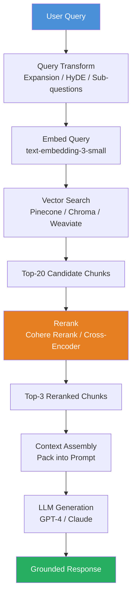
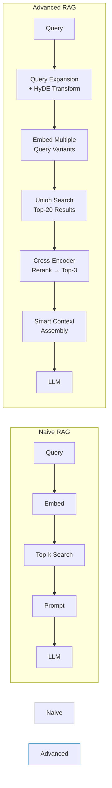

# Week 5: Retrieval-Augmented Generation (RAG)

**Theme: Teach your AI to use external knowledge**

---

## 5.1 RAG Architecture Fundamentals

### What is RAG and Why Does it Matter?

Language models are remarkable artifacts — they compress vast quantities of human knowledge into neural network weights during training. But this compression comes at a cost. Once trained, a model's knowledge is **frozen in time**, unable to incorporate new facts without an expensive retraining cycle. Worse, the very process of compression introduces distortions: the model may confidently state something plausible but incorrect, a phenomenon we call **hallucination**.

**Retrieval-Augmented Generation (RAG)** is the architectural pattern that addresses this limitation head-on. Rather than relying solely on what the model has memorized, RAG retrieves relevant information at query time and injects it directly into the model's context window. The model then generates its answer grounded in that retrieved evidence.

### Parametric Memory vs Contextual Injection

To understand RAG deeply, we must first understand the two fundamentally different ways an LLM can "know" something.

**Parametric memory** refers to knowledge encoded in the model's weights during training. When you ask GPT-4 who wrote *Pride and Prejudice*, it answers from parametric memory — no retrieval needed. This memory is fast, always available, and covers general world knowledge well. Its weaknesses are equally clear: it has a knowledge cutoff date, it cannot be updated without retraining, and it is prone to hallucination on specific facts (exact dates, obscure statistics, proprietary data) because that knowledge was compressed and may have been distorted.

**Contextual injection** is the RAG approach: instead of relying on memorized facts, we retrieve relevant documents at query time and place them directly in the context window. The model is now reading a reference document, not recalling from memory. This makes answers **grounded** — traceable back to specific source passages — and **updatable** by simply changing the document store.

The tradeoff is real: RAG adds latency (retrieval takes time), requires infrastructure (a vector database), and can fail if the retrieval step misses relevant documents. But for knowledge-intensive applications over proprietary or frequently-updated data, it is almost always the right choice.

### The Retrieve-Inject-Generate Loop

The core RAG loop has three steps that execute at inference time for every user query:

1. **Retrieve**: Convert the query to an embedding vector and search the vector database for the most semantically similar document chunks.
2. **Inject**: Assemble the retrieved chunks into a structured prompt alongside the user's question.
3. **Generate**: Send the augmented prompt to the LLM, which synthesizes an answer grounded in the provided context.



### Naive RAG vs Advanced RAG vs Modular RAG

The field has evolved through three generations of RAG design, each addressing limitations of the previous.

**Naive RAG** is the simplest implementation: embed the query, retrieve the top-k chunks by cosine similarity, concatenate them into the prompt, and call the LLM. This works surprisingly well as a baseline and is the right starting point for any new project. Its weaknesses emerge at production scale: the query may be poorly formed for retrieval, embedding similarity does not always correlate with answer quality, and the context assembly is unsophisticated.

**Advanced RAG** adds targeted improvements at each stage. Before retrieval, query transformation techniques like HyDE and query expansion improve recall. After retrieval, reranking with a cross-encoder model improves precision. Context assembly strategies like "lost-in-the-middle" mitigation improve how the LLM uses the retrieved content.

**Modular RAG** is an architectural philosophy rather than a specific technique: design the system as a pipeline of pluggable components, each with a well-defined interface. Want to swap your vector store from Chroma to Pinecone? That's one module. Want to add a knowledge graph lookup alongside vector search? Insert a module. This composability is what frameworks like LangChain and LlamaIndex provide.



### RAG vs Fine-Tuning: Choosing the Right Tool

This is one of the most common questions in applied AI engineering, and the answer depends on what you are actually trying to change about the model's behavior.

**Use RAG when** you need the model to have access to specific facts, documents, or data that changes over time. Product documentation, legal contracts, research papers, customer support histories — anything where the content evolves or is proprietary belongs in a RAG system, not in model weights.

**Use fine-tuning when** you need to change how the model behaves: its tone, its output format, its domain-specific vocabulary, or its reasoning style. Fine-tuning teaches the model to write like your brand, to always respond in JSON, to use medical terminology correctly, or to follow a specific multi-step reasoning process.

The two techniques are not mutually exclusive. A fine-tuned model that also uses RAG is a powerful combination: the fine-tuned base provides behavioral consistency while RAG provides factual grounding.

> **Key Insight:** Hallucination is not a bug that will be patched away — it is a fundamental property of autoregressive generation. RAG does not prevent hallucination entirely, but it dramatically reduces it by giving the model a reference to ground its answers in. Always treat retrieved context as evidence, not as a guarantee.

> **Key Insight:** The "knowledge cutoff" problem is often overstated. Many applications do not need yesterday's news — they need accurate access to a specific corpus of documents. For those use cases, RAG provides not just recency but also precision, traceability, and auditability that parametric memory cannot offer.

> **Key Insight:** Start with naive RAG. Measure it. Only add complexity (reranking, query expansion, hybrid search) when measurements show that the naive approach is falling short in a specific, diagnosable way. Premature optimization in RAG systems wastes engineering time and obscures the source of problems.

### Chapter Checkpoint

1. What is the fundamental difference between parametric memory and contextual injection? Give a concrete example of a scenario where each approach is preferable.
2. A startup is building an internal Q&A tool over their employee handbook (updated quarterly). Should they use RAG, fine-tuning, or both? Justify your answer.
3. In the retrieve-inject-generate loop, which step is most likely to fail silently — meaning the system appears to work but gives wrong answers? Why?

---

## 5.2 Building the Retrieval Pipeline

### From Raw Documents to Searchable Chunks

The retrieval pipeline is the foundation of any RAG system. Its job is to transform unstructured source documents into a form that can be efficiently searched at query time. This pipeline runs **offline** (during ingestion) and must be designed carefully — mistakes here propagate forward and are expensive to fix.

The ingestion pipeline has four stages: **loading** documents, **splitting** them into chunks, **embedding** the chunks, and **storing** the embeddings in a vector database.

### Document Loaders

The first challenge is getting your source content into a uniform format. Real-world knowledge lives in PDFs, web pages, Notion databases, Confluence wikis, Slack exports, and dozens of other formats. **Document loaders** handle this heterogeneity.

LangChain provides a rich ecosystem of loaders:

```python
from langchain_community.document_loaders import (
    PyPDFLoader,
    WebBaseLoader,
    NotionDBLoader,
    DirectoryLoader,
    TextLoader,
)
import os

# Load a single PDF — great for technical manuals, research papers
pdf_loader = PyPDFLoader("docs/python_reference.pdf")
pdf_docs = pdf_loader.load()
# Each page becomes a Document with page_content and metadata
print(f"Loaded {len(pdf_docs)} pages from PDF")
print(f"Metadata: {pdf_docs[0].metadata}")  # {'source': '...', 'page': 0}

# Load from a web page — good for official documentation
web_loader = WebBaseLoader(
    web_paths=["https://docs.python.org/3/library/functions.html"],
    bs_kwargs={"parse_only": None},  # Can pass BeautifulSoup kwargs
)
web_docs = web_loader.load()

# Load all .txt files from a directory
dir_loader = DirectoryLoader(
    "docs/",
    glob="**/*.txt",
    loader_cls=TextLoader,
    show_progress=True,
)
all_docs = dir_loader.load()
print(f"Loaded {len(all_docs)} documents from directory")

# Notion database loader (requires integration token)
notion_loader = NotionDBLoader(
    integration_token=os.environ["NOTION_TOKEN"],
    database_id="your-database-id",
    request_timeout_sec=30,
)
notion_docs = notion_loader.load()
```

Each loaded document is a `Document` object with two fields: `page_content` (the raw text) and `metadata` (a dictionary of provenance information like source URL, page number, creation date). Preserving rich metadata is critical — it lets you filter results and cite sources in your answers.

### Recursive Text Splitting

Raw documents are too long to fit in a single embedding or context window slot. We must split them into chunks — but how we split matters enormously. A chunk that cuts a sentence in half, or separates a code example from its explanation, will produce poor retrieval results.

**Recursive character text splitting** is the standard approach. It tries to split on paragraph boundaries first, then sentence boundaries, then word boundaries, falling back to character-level splitting only as a last resort.

```python
from langchain_text_splitters import RecursiveCharacterTextSplitter
from langchain_community.document_loaders import DirectoryLoader, TextLoader

# Load all Python documentation files
loader = DirectoryLoader("python_docs/", glob="**/*.rst", loader_cls=TextLoader)
raw_docs = loader.load()

# Configure the splitter
splitter = RecursiveCharacterTextSplitter(
    chunk_size=1000,        # Target chunk size in characters
    chunk_overlap=200,      # Overlap between consecutive chunks
    length_function=len,    # How to measure chunk size
    separators=[
        "\n\n",             # Paragraph breaks (try first)
        "\n",               # Line breaks (try second)
        ". ",               # Sentence boundaries (try third)
        " ",                # Word boundaries (last resort)
        "",                 # Character-level (absolute fallback)
    ],
    add_start_index=True,   # Track position in original document
)

# Split all documents
chunks = splitter.split_documents(raw_docs)
print(f"Split {len(raw_docs)} documents into {len(chunks)} chunks")
print(f"Average chunk size: {sum(len(c.page_content) for c in chunks) / len(chunks):.0f} chars")

# Inspect a chunk
sample = chunks[42]
print(f"\nChunk content preview:\n{sample.page_content[:200]}...")
print(f"Metadata: {sample.metadata}")
```

The `chunk_overlap` parameter is important: it ensures that information spanning a chunk boundary is represented in both neighboring chunks, preventing retrieval failures on questions that straddle a split point.

### HyDE: Hypothetical Document Embeddings

A fundamental mismatch exists in naive RAG: we embed the **question** (short, often vague) and compare it to embeddings of **answer-like content** (longer, detailed, uses different vocabulary). A question like "how do Python generators work?" is semantically quite different from a documentation passage that explains generators in detail.

**HyDE (Hypothetical Document Embeddings)** addresses this by asking the LLM to first generate a hypothetical answer to the question — even if that answer might be inaccurate — and then embedding that hypothetical answer instead of the original question. This hypothetical answer uses the same vocabulary and structure as real documentation, making the embedding comparison much more effective.

```python
from langchain_openai import ChatOpenAI, OpenAIEmbeddings
from langchain_core.prompts import ChatPromptTemplate
from langchain_core.output_parsers import StrOutputParser

# Set up components
llm = ChatOpenAI(model="gpt-4o-mini", temperature=0)
embeddings = OpenAIEmbeddings(model="text-embedding-3-small")

# HyDE prompt — ask for a hypothetical document passage, not an answer
hyde_prompt = ChatPromptTemplate.from_template("""
Write a short technical documentation passage (2-3 sentences) that would 
directly answer the following question. Write it as if it were from official 
Python documentation. Do not say "I" or "the answer is" — write it as a 
documentation excerpt.

Question: {question}

Documentation passage:
""")

hyde_chain = hyde_prompt | llm | StrOutputParser()

def get_hyde_embedding(question: str) -> list[float]:
    """Generate a HyDE embedding for a question."""
    # Step 1: Generate hypothetical document
    hypothetical_doc = hyde_chain.invoke({"question": question})
    print(f"Hypothetical document: {hypothetical_doc[:100]}...")
    
    # Step 2: Embed the hypothetical document (not the question)
    return embeddings.embed_query(hypothetical_doc)

# Usage
question = "How do Python generators differ from regular functions?"
hyde_vector = get_hyde_embedding(question)
# Now use this vector to search your vector store instead of embedding the question
```

### Query Expansion

A single query formulation may miss relevant documents that use different terminology. **Query expansion** generates multiple variations of the original question and takes the union of their retrieval results.

```python
from langchain_core.prompts import ChatPromptTemplate
from langchain_core.output_parsers import StrOutputParser
import json

expansion_prompt = ChatPromptTemplate.from_template("""
Generate 5 different ways to ask the following question. Each variation should 
use different vocabulary or phrasing that might match technical documentation 
differently. Return ONLY a JSON array of strings, no other text.

Original question: {question}

JSON array of 5 variations:
""")

expansion_chain = expansion_prompt | llm | StrOutputParser()

def expand_query(question: str) -> list[str]:
    """Generate query variations for expanded retrieval."""
    result = expansion_chain.invoke({"question": question})
    variations = json.loads(result)
    return [question] + variations  # Always include the original

def retrieve_with_expansion(question: str, vectorstore, k: int = 5) -> list:
    """Retrieve using query expansion, deduplicate results."""
    queries = expand_query(question)
    
    all_docs = {}  # Use dict to deduplicate by content hash
    for q in queries:
        results = vectorstore.similarity_search(q, k=k)
        for doc in results:
            doc_id = hash(doc.page_content)
            if doc_id not in all_docs:
                all_docs[doc_id] = doc
    
    print(f"Expanded {1} query into {len(queries)} queries")
    print(f"Retrieved {len(all_docs)} unique chunks after deduplication")
    return list(all_docs.values())
```

### Sub-Question Decomposition

Complex questions often span multiple topics that are stored in different documents. **Sub-question decomposition** breaks a complex question into simpler sub-questions, retrieves context for each independently, and synthesizes a final answer.

```python
decomposition_prompt = ChatPromptTemplate.from_template("""
Break the following complex question into 3 simpler sub-questions that can 
each be answered independently. Return ONLY a JSON array of 3 strings.

Complex question: {question}

JSON array of 3 sub-questions:
""")

decomp_chain = decomposition_prompt | llm | StrOutputParser()

def retrieve_with_decomposition(question: str, vectorstore, k: int = 3) -> dict:
    """Decompose question and retrieve context for each sub-question."""
    sub_questions = json.loads(decomp_chain.invoke({"question": question}))
    
    sub_contexts = {}
    for sq in sub_questions:
        results = vectorstore.similarity_search(sq, k=k)
        sub_contexts[sq] = results
        print(f"Sub-question: {sq[:60]}... → {len(results)} chunks")
    
    return sub_contexts
```

> **Key Insight:** Chunk size is one of the most consequential hyperparameters in a RAG system. Smaller chunks (256-512 chars) improve retrieval precision but may lack sufficient context for the LLM to answer well. Larger chunks (1000-2000 chars) provide richer context but reduce precision. The "parent document retriever" pattern — retrieve small chunks, then return their larger parent chunks — is often the best of both worlds.

> **Key Insight:** HyDE works best when the vocabulary gap between questions and documents is large. For informal questions against formal documentation, it provides significant gains. For already-technical questions against technical documentation, the gains may be marginal. Always measure before adopting it in production.

> **Key Insight:** Document metadata is often the most underutilized component in RAG pipelines. Storing the document date, author, section hierarchy, and document type enables **metadata filtering** at retrieval time, dramatically improving precision without any added complexity in the embedding or retrieval layers.

### Chapter Checkpoint

1. Explain the "vocabulary mismatch" problem in RAG retrieval. How does HyDE address it, and what is the potential downside of using an LLM-generated hypothetical document for embedding?
2. You are ingesting a 500-page technical manual. What chunk size and overlap would you choose, and why? What metadata fields would you preserve?
3. Compare query expansion and sub-question decomposition. For what types of user questions is each technique most beneficial? Can you use both together?

---

## 5.3 Reranking and Context Assembly

### Why Retrieval Alone Is Not Enough

Vector similarity search is a powerful first-pass retrieval mechanism, but it has a fundamental limitation: **embedding models are trained to capture general semantic similarity**, not to predict whether a specific chunk will help answer a specific question. Two chunks may be semantically similar to a query but one may be far more directly useful than the other — a distinction that a bi-encoder embedding model cannot easily capture.

This is where **reranking** enters the pipeline. After vector search retrieves a broad candidate set (say, top-20 chunks), a reranker rescores each candidate specifically for its relevance to the query, allowing us to select a much smaller, higher-quality set (say, top-3 chunks) for inclusion in the LLM prompt.

### The Lost-in-the-Middle Problem

Before diving into reranking mechanics, we need to understand *why* we are so concerned with getting the right chunks into the right positions. In 2023, research by Liu et al. ("Lost in the Middle: How Language Models Use Long Contexts") demonstrated a striking finding: LLM performance on multi-document question answering degrades significantly when the relevant information is positioned in the middle of a long context window.

Models perform best when relevant information is at the **beginning** or **end** of the context. When relevant content is buried in the middle of many irrelevant chunks, models effectively ignore it. This has direct implications for context assembly: it is not enough to retrieve the right chunks — we must also place them strategically.

### Cross-Encoder Rerankers

**Bi-encoders** (the standard embedding model) process the query and each document independently, producing vectors that can be compared by cosine similarity. This is efficient — you can precompute document embeddings — but it limits the model's ability to reason about query-document interaction.

**Cross-encoders** process the query and a candidate document together, allowing full attention across both texts. This is much slower (you cannot precompute anything — the query is part of the input) but produces dramatically better relevance scores.

```python
import cohere
import os
from langchain_openai import OpenAIEmbeddings
import pinecone
from pinecone import Pinecone, ServerlessSpec

# Initialize clients
co = cohere.Client(os.environ["COHERE_API_KEY"])
embeddings_model = OpenAIEmbeddings(model="text-embedding-3-small")

def retrieve_and_rerank(
    query: str,
    index,  # Pinecone index
    initial_k: int = 20,
    final_k: int = 3,
    score_threshold: float = 0.4,
) -> list[dict]:
    """
    Two-stage retrieval: vector search + cross-encoder reranking.
    
    Args:
        query: User's question
        index: Pinecone vector index
        initial_k: Number of candidates from vector search
        final_k: Number of results after reranking
        score_threshold: Minimum relevance score to include
    
    Returns:
        List of reranked document dicts with content and metadata
    """
    # Stage 1: Embed query and do vector search
    query_vector = embeddings_model.embed_query(query)
    
    search_results = index.query(
        vector=query_vector,
        top_k=initial_k,
        include_metadata=True,
    )
    
    candidates = search_results["matches"]
    print(f"Stage 1: Retrieved {len(candidates)} candidates via vector search")
    
    if not candidates:
        return []
    
    # Extract text for reranking
    candidate_texts = [c["metadata"]["text"] for c in candidates]
    
    # Stage 2: Rerank with Cohere cross-encoder
    rerank_response = co.rerank(
        query=query,
        documents=candidate_texts,
        top_n=final_k,
        model="rerank-english-v3.0",
    )
    
    # Filter by score threshold and collect results
    reranked = []
    for result in rerank_response.results:
        if result.relevance_score >= score_threshold:
            original = candidates[result.index]
            reranked.append({
                "text": candidate_texts[result.index],
                "metadata": original["metadata"],
                "vector_score": original["score"],
                "rerank_score": result.relevance_score,
            })
    
    print(f"Stage 2: {len(reranked)} chunks passed reranking (score >= {score_threshold})")
    return reranked
```

### Using sentence-transformers for Local Reranking

For applications where sending data to an external API is not acceptable, `sentence-transformers` provides high-quality cross-encoder models that run locally:

```python
from sentence_transformers import CrossEncoder

# Load a cross-encoder model (downloads once, cached locally)
cross_encoder = CrossEncoder("cross-encoder/ms-marco-MiniLM-L-6-v2")

def local_rerank(query: str, candidates: list[str], top_k: int = 3) -> list[tuple]:
    """
    Rerank candidates using a local cross-encoder model.
    
    Returns list of (score, text) tuples sorted by relevance.
    """
    # Cross-encoder takes list of [query, document] pairs
    pairs = [[query, doc] for doc in candidates]
    scores = cross_encoder.predict(pairs)
    
    # Sort by score descending
    scored_docs = sorted(
        zip(scores, candidates),
        key=lambda x: x[0],
        reverse=True,
    )
    
    return scored_docs[:top_k]
```

### Context Window Packing

After reranking, we must assemble the selected chunks into a prompt. Given what we know about the lost-in-the-middle problem, we should place the most relevant chunks at the beginning and end of the context block, with less relevant chunks in the middle.

```python
def assemble_context(
    reranked_chunks: list[dict],
    max_context_tokens: int = 4000,
) -> str:
    """
    Assemble retrieved chunks into a context string, placing the most
    relevant chunks at the beginning and end (lost-in-the-middle mitigation).
    
    Args:
        reranked_chunks: List of chunks sorted by rerank score (descending)
        max_context_tokens: Approximate token budget for context
    
    Returns:
        Formatted context string ready for prompt injection
    """
    if not reranked_chunks:
        return "No relevant context found."
    
    # Interleave: best chunk first, second-best last, rest in middle
    # This is the "bookending" strategy for lost-in-the-middle mitigation
    if len(reranked_chunks) == 1:
        ordered = reranked_chunks
    elif len(reranked_chunks) == 2:
        ordered = reranked_chunks  # Already best-first
    else:
        # Place best chunk first, second-best chunk last, rest in middle
        best = reranked_chunks[0]
        second_best = reranked_chunks[1]
        middle = reranked_chunks[2:]
        ordered = [best] + middle + [second_best]
    
    # Build context with source citations
    context_parts = []
    total_chars = 0
    char_budget = max_context_tokens * 4  # Rough chars-to-tokens ratio
    
    for i, chunk in enumerate(ordered, 1):
        source = chunk["metadata"].get("source", "Unknown")
        page = chunk["metadata"].get("page", "")
        score = chunk.get("rerank_score", 0)
        
        chunk_text = (
            f"[Source {i}: {source}"
            + (f", page {page}" if page else "")
            + f" (relevance: {score:.2f})]\n"
            + chunk["text"]
        )
        
        if total_chars + len(chunk_text) > char_budget:
            break
        
        context_parts.append(chunk_text)
        total_chars += len(chunk_text)
    
    return "\n\n---\n\n".join(context_parts)


def build_rag_prompt(query: str, context: str) -> str:
    """Build the final prompt for the LLM with injected context."""
    return f"""Answer the following question using ONLY the information provided 
in the context below. If the context does not contain enough information to 
answer the question, say so explicitly — do not make up information.

CONTEXT:
{context}

QUESTION: {query}

ANSWER:"""
```

### Metadata Filtering

Reranking improves quality after retrieval, but sometimes we can eliminate irrelevant candidates before retrieval using **metadata filters**. If a user asks about Python 3.11 features, filtering to only chunks from Python 3.11 documentation is more efficient than retrieving everything and reranking.

```python
def retrieve_with_metadata_filter(
    query: str,
    index,
    embeddings_model,
    filter_dict: dict = None,
    k: int = 20,
) -> list:
    """
    Retrieve with optional metadata filtering.
    
    Example filter_dict: {"version": "3.11", "doc_type": "reference"}
    """
    query_vector = embeddings_model.embed_query(query)
    
    query_kwargs = {
        "vector": query_vector,
        "top_k": k,
        "include_metadata": True,
    }
    
    if filter_dict:
        # Pinecone filter syntax
        query_kwargs["filter"] = filter_dict
    
    return index.query(**query_kwargs)["matches"]
```

> **Key Insight:** The retrieval funnel strategy — retrieve many, rerank aggressively — is more effective than trying to retrieve a small perfect set in one shot. Cast a wide net with vector search (top-20 or top-50), then let the cross-encoder do the precise filtering. The cross-encoder is much better at nuanced relevance judgment but too slow to use on your entire corpus.

> **Key Insight:** Relevance score thresholding (rejecting chunks below score 0.4) is a critical safety mechanism. Without it, your RAG system will confidently generate answers based on irrelevant context, which is often worse than admitting it does not know the answer. A graceful "I don't have information on that" is far better than a confidently wrong answer.

> **Key Insight:** The lost-in-the-middle effect gets stronger as context length increases. With 3-5 chunks, the effect is mild. With 20+ chunks filling a 100k token context, the effect can be severe. If you are using very long contexts, the bookending strategy and reranking become even more important.

### Chapter Checkpoint

1. Explain the difference between a bi-encoder and a cross-encoder. Why can't we use cross-encoders for the initial vector search step?
2. Describe the "lost-in-the-middle" problem and explain two specific strategies from this chapter that mitigate it.
3. Your reranker is rejecting too many chunks (most score below 0.4) for valid questions. What are three possible root causes, and how would you diagnose each?

---

## 5.4 Evaluating RAG Quality

### Why RAG Evaluation is Hard

A RAG system has two distinct subsystems — the retrieval pipeline and the generation pipeline — and both can fail independently. A system might retrieve excellent context but generate a poor answer, or generate fluent text that contradicts the retrieved context. Evaluating end-to-end quality requires metrics that probe each component separately.

Furthermore, **ground truth is expensive**. Traditional NLP evaluation relies on human-annotated datasets with correct answers. Building such a dataset for your specific RAG application requires domain experts reading hundreds of documents and crafting question-answer pairs. This is feasible for a research project but challenging for a production team moving quickly.

The solution is a combination of automated metrics — some requiring a reference ground truth, some not — and automated LLM-based evaluation that approximates human judgment at scale.

### Retrieval Metrics

**Hit Rate** (also called Recall@k) is the simplest retrieval metric: for a given question, was the "gold chunk" (the chunk that contains the correct answer) among the top-k retrieved results? It is a binary metric per question, averaged over a test set.

```
Hit Rate@k = (number of questions where gold chunk is in top-k) / (total questions)
```

**Mean Reciprocal Rank (MRR)** is more nuanced: it rewards systems that place the gold chunk higher in the ranked list. If the gold chunk is at rank 1, it contributes 1.0 to MRR. At rank 2, it contributes 0.5. At rank 10, it contributes 0.1.

```
MRR = (1/|Q|) × Σ (1/rank_i)
```

**NDCG@k (Normalized Discounted Cumulative Gain)** handles cases where there are multiple relevant chunks. It penalizes relevant-but-buried results logarithmically: a relevant chunk at rank 5 contributes less than one at rank 1. NDCG is normalized to [0,1] by dividing by the ideal ranking.

```python
import numpy as np
from typing import Optional

def hit_rate_at_k(retrieved_ids: list[str], gold_id: str, k: int) -> float:
    """Calculate Hit Rate@k for a single query."""
    return 1.0 if gold_id in retrieved_ids[:k] else 0.0

def reciprocal_rank(retrieved_ids: list[str], gold_id: str) -> float:
    """Calculate reciprocal rank for a single query."""
    try:
        rank = retrieved_ids.index(gold_id) + 1  # 1-indexed
        return 1.0 / rank
    except ValueError:
        return 0.0  # Gold chunk not found

def ndcg_at_k(retrieved_ids: list[str], relevant_ids: set[str], k: int) -> float:
    """
    Calculate NDCG@k for a single query.
    
    Args:
        retrieved_ids: Ordered list of retrieved chunk IDs
        relevant_ids: Set of all relevant chunk IDs for this query
        k: Cutoff position
    """
    def dcg(ranked_ids: list[str], rel_ids: set[str], k: int) -> float:
        return sum(
            1.0 / np.log2(i + 2)  # log2(rank + 1), rank is 1-indexed
            for i, doc_id in enumerate(ranked_ids[:k])
            if doc_id in rel_ids
        )
    
    actual_dcg = dcg(retrieved_ids, relevant_ids, k)
    
    # Ideal DCG: all relevant docs at top positions
    ideal_ranking = list(relevant_ids) + [None] * max(0, k - len(relevant_ids))
    ideal_dcg = dcg(ideal_ranking, relevant_ids, k)
    
    return actual_dcg / ideal_dcg if ideal_dcg > 0 else 0.0


def evaluate_retrieval(test_cases: list[dict], retriever_fn, k: int = 5) -> dict:
    """
    Evaluate retrieval quality over a test set.
    
    Args:
        test_cases: List of dicts with 'question' and 'gold_chunk_id' keys
        retriever_fn: Function that takes a question and returns list of chunk IDs
        k: Cutoff for Hit Rate and NDCG
    
    Returns:
        Dict with mean Hit Rate, MRR, and NDCG scores
    """
    hit_rates, rrs, ndcgs = [], [], []
    
    for case in test_cases:
        question = case["question"]
        gold_id = case["gold_chunk_id"]
        relevant_ids = case.get("all_relevant_ids", {gold_id})
        
        retrieved = retriever_fn(question)
        
        hit_rates.append(hit_rate_at_k(retrieved, gold_id, k))
        rrs.append(reciprocal_rank(retrieved, gold_id))
        ndcgs.append(ndcg_at_k(retrieved, relevant_ids, k))
    
    return {
        f"hit_rate@{k}": np.mean(hit_rates),
        "mrr": np.mean(rrs),
        f"ndcg@{k}": np.mean(ndcgs),
        "n_queries": len(test_cases),
    }
```

### Generation Metrics with RAGAS

**RAGAS** (Retrieval Augmented Generation Assessment) is an open-source framework that provides automated, LLM-based evaluation of RAG pipelines. It measures three key generation metrics:

**Faithfulness** measures whether the generated answer contains only information that can be supported by the retrieved context. A faithfulness score of 1.0 means every claim in the answer is grounded in the context; a score of 0.5 means roughly half the claims are hallucinated or cannot be verified.

**Answer Relevance** measures whether the generated answer actually addresses the user's question. An answer can be perfectly faithful (only says things in the context) but still be irrelevant (talks about the wrong topic). This metric catches tangential or evasive answers.

**Context Recall** measures whether the retrieved context contains all the information needed to answer the question. Unlike hit rate (which is binary), context recall captures partial coverage — the context might have 3 of the 5 facts needed to answer completely.

```python
from ragas import evaluate
from ragas.metrics import (
    faithfulness,
    answer_relevancy,
    context_recall,
    context_precision,
)
from datasets import Dataset
import pandas as pd

# Your RAG system must produce these four fields for each test question
def run_rag_pipeline(question: str, vectorstore, llm) -> dict:
    """Run the full RAG pipeline and return RAGAS-compatible output."""
    # Retrieve context
    docs = vectorstore.similarity_search(question, k=5)
    contexts = [doc.page_content for doc in docs]
    
    # Generate answer
    context_str = "\n\n".join(contexts)
    prompt = f"Answer based on context:\n{context_str}\n\nQuestion: {question}"
    answer = llm.invoke(prompt).content
    
    return {
        "question": question,
        "answer": answer,
        "contexts": contexts,  # List of retrieved passages
    }

# Prepare test dataset
test_questions = [
    {
        "question": "What is a Python generator?",
        "ground_truth": "A generator is a function that returns an iterator using yield statements.",
    },
    {
        "question": "How does Python's GIL affect multithreading?",
        "ground_truth": "The GIL prevents multiple threads from executing Python bytecode simultaneously.",
    },
    # Add more test cases...
]

# Run pipeline on all test questions
results = []
for case in test_questions:
    output = run_rag_pipeline(case["question"], vectorstore, llm)
    results.append({
        **output,
        "ground_truth": case["ground_truth"],
    })

# Convert to RAGAS dataset format
dataset = Dataset.from_list(results)

# Run RAGAS evaluation
scores = evaluate(
    dataset=dataset,
    metrics=[
        faithfulness,
        answer_relevancy,
        context_recall,
        context_precision,
    ],
)

print("\n=== RAGAS Evaluation Results ===")
print(f"Faithfulness:       {scores['faithfulness']:.3f}")
print(f"Answer Relevancy:   {scores['answer_relevancy']:.3f}")
print(f"Context Recall:     {scores['context_recall']:.3f}")
print(f"Context Precision:  {scores['context_precision']:.3f}")

# Convert to DataFrame for detailed analysis
scores_df = scores.to_pandas()
print("\nPer-question breakdown:")
print(scores_df[["question", "faithfulness", "answer_relevancy"]].to_string())
```

### Interpreting RAGAS Scores

Understanding what to do with RAGAS scores is as important as computing them. Each metric failure points to a different root cause:

| Low Score | Root Cause | Fix |
|-----------|------------|-----|
| Faithfulness < 0.7 | LLM hallucinating beyond context | Stronger system prompt, lower temperature |
| Answer Relevancy < 0.7 | Retrieved wrong documents | Improve retrieval (HyDE, reranking) |
| Context Recall < 0.7 | Missing relevant chunks | Increase k, improve chunking, add query expansion |
| Context Precision < 0.7 | Too much irrelevant context | Add reranking, score thresholding |

```python
def diagnose_rag_failures(scores_df: pd.DataFrame, threshold: float = 0.5) -> None:
    """Print diagnostic report for low-scoring queries."""
    print("=== RAG Failure Diagnosis ===\n")
    
    # Faithfulness failures (hallucination)
    hallucinations = scores_df[scores_df["faithfulness"] < threshold]
    if not hallucinations.empty:
        print(f"HALLUCINATION RISK ({len(hallucinations)} queries):")
        for _, row in hallucinations.iterrows():
            print(f"  Q: {row['question'][:60]}...")
            print(f"     Faithfulness: {row['faithfulness']:.2f}")
        print()
    
    # Retrieval failures (missed context)
    retrieval_failures = scores_df[scores_df["context_recall"] < threshold]
    if not retrieval_failures.empty:
        print(f"RETRIEVAL FAILURES ({len(retrieval_failures)} queries):")
        for _, row in retrieval_failures.iterrows():
            print(f"  Q: {row['question'][:60]}...")
            print(f"     Context Recall: {row['context_recall']:.2f}")
```

> **Key Insight:** RAGAS uses an LLM to evaluate LLM output — which means evaluation results depend on your evaluator LLM's quality. Always use a capable model (GPT-4 class or better) for RAGAS evaluation, even if your production RAG system uses a smaller model. The evaluator LLM is not in your critical path and its cost is amortized over many inference calls.

> **Key Insight:** Faithfulness is the metric most directly tied to trust and safety. A system with low faithfulness is actively making things up, which in high-stakes domains (legal, medical, financial) can cause real harm. Set a minimum faithfulness threshold and alert when it drops below that threshold in production.

> **Key Insight:** Evaluation datasets compound in value over time. Every time your RAG system fails on a real user query, that query — and the expected answer — should be added to your evaluation dataset. After three months of this practice, you will have a comprehensive, domain-specific benchmark that no external dataset can match.

### Chapter Checkpoint

1. A RAG system achieves 0.95 faithfulness but 0.45 context recall. What does this tell you about the system's behavior, and what is the most likely user experience?
2. Explain the difference between Hit Rate@5 and MRR. For a customer support chatbot, which metric would you prioritize? Why?
3. Your RAGAS evaluation pipeline takes 45 minutes to run on 200 test questions. How would you make it feasible to run after every code change in a CI/CD pipeline?

---

## Lab Walkthrough: Building a RAG System over Python Documentation

This lab guides you through building a complete, production-grade RAG system that can answer questions about Python's standard library. By the end, you will have a system with semantic search, reranking, and automated quality evaluation.

### Prerequisites

```bash
pip install langchain langchain-openai langchain-community langchain-text-splitters
pip install pinecone-client cohere ragas datasets
pip install sentence-transformers beautifulsoup4 requests pypdf
```

Set environment variables:

```bash
export OPENAI_API_KEY="your-openai-key"
export PINECONE_API_KEY="your-pinecone-key"
export COHERE_API_KEY="your-cohere-key"
```

### Step 1: Download Python Documentation

```python
# lab/step1_download_docs.py
import requests
from pathlib import Path

PYTHON_DOCS_URLS = [
    "https://docs.python.org/3/library/functions.html",
    "https://docs.python.org/3/library/itertools.html",
    "https://docs.python.org/3/library/functools.html",
    "https://docs.python.org/3/library/collections.html",
    "https://docs.python.org/3/reference/expressions.html",
    "https://docs.python.org/3/glossary.html",
]

output_dir = Path("python_docs")
output_dir.mkdir(exist_ok=True)

for url in PYTHON_DOCS_URLS:
    filename = url.split("/")[-1]
    response = requests.get(url)
    (output_dir / filename).write_text(response.text, encoding="utf-8")
    print(f"Downloaded: {filename}")
```

### Step 2: Ingest and Index Documents

```python
# lab/step2_ingest.py
from langchain_community.document_loaders import WebBaseLoader
from langchain_text_splitters import RecursiveCharacterTextSplitter
from langchain_openai import OpenAIEmbeddings
from pinecone import Pinecone, ServerlessSpec
import os
import time

# --- Document Loading ---
urls = [
    "https://docs.python.org/3/library/functions.html",
    "https://docs.python.org/3/library/itertools.html",
    "https://docs.python.org/3/library/functools.html",
    "https://docs.python.org/3/library/collections.html",
]

loader = WebBaseLoader(web_paths=urls)
raw_docs = loader.load()
print(f"Loaded {len(raw_docs)} pages")

# --- Text Splitting ---
splitter = RecursiveCharacterTextSplitter(
    chunk_size=1000,
    chunk_overlap=200,
    separators=["\n\n", "\n", ". ", " ", ""],
    add_start_index=True,
)
chunks = splitter.split_documents(raw_docs)
print(f"Created {len(chunks)} chunks")

# Add chunk IDs to metadata
for i, chunk in enumerate(chunks):
    chunk.metadata["chunk_id"] = f"chunk_{i:04d}"

# --- Embedding ---
embeddings_model = OpenAIEmbeddings(model="text-embedding-3-small")

# --- Pinecone Setup ---
pc = Pinecone(api_key=os.environ["PINECONE_API_KEY"])
index_name = "python-docs-rag"

if index_name not in pc.list_indexes().names():
    pc.create_index(
        name=index_name,
        dimension=1536,  # text-embedding-3-small dimension
        metric="cosine",
        spec=ServerlessSpec(cloud="aws", region="us-east-1"),
    )
    time.sleep(10)  # Wait for index to be ready

index = pc.Index(index_name)

# --- Upsert in Batches ---
batch_size = 100
for i in range(0, len(chunks), batch_size):
    batch = chunks[i:i + batch_size]
    texts = [c.page_content for c in batch]
    metadatas = [c.metadata for c in batch]
    
    # Embed batch
    vectors = embeddings_model.embed_documents(texts)
    
    # Build upsert payload
    upsert_data = [
        (
            f"chunk_{i + j:04d}",
            vectors[j],
            {**metadatas[j], "text": texts[j]},
        )
        for j in range(len(batch))
    ]
    
    index.upsert(vectors=upsert_data)
    print(f"Upserted batch {i // batch_size + 1}/{len(chunks) // batch_size + 1}")

print("Ingestion complete!")
stats = index.describe_index_stats()
print(f"Index contains {stats['total_vector_count']} vectors")
```

### Step 3: Build the RAG Query Engine

```python
# lab/step3_rag_engine.py
import os
import cohere
from pinecone import Pinecone
from langchain_openai import OpenAIEmbeddings, ChatOpenAI
from langchain_core.prompts import ChatPromptTemplate

# Initialize clients
pc = Pinecone(api_key=os.environ["PINECONE_API_KEY"])
index = pc.Index("python-docs-rag")
embeddings_model = OpenAIEmbeddings(model="text-embedding-3-small")
co = cohere.Client(os.environ["COHERE_API_KEY"])
llm = ChatOpenAI(model="gpt-4o-mini", temperature=0)

RAG_PROMPT = ChatPromptTemplate.from_template("""
You are a Python documentation assistant. Answer questions based ONLY on the 
provided documentation excerpts. If the documentation does not contain enough 
information, say so clearly.

DOCUMENTATION:
{context}

QUESTION: {question}

ANSWER:
""")

def rag_query(question: str, verbose: bool = False) -> dict:
    """
    Full RAG pipeline: vector search + rerank + generate.
    Returns answer and retrieved contexts for evaluation.
    """
    # Stage 1: Vector search
    query_vector = embeddings_model.embed_query(question)
    search_results = index.query(
        vector=query_vector,
        top_k=20,
        include_metadata=True,
    )
    candidates = search_results["matches"]
    
    if verbose:
        print(f"Retrieved {len(candidates)} candidates")
    
    if not candidates:
        return {"answer": "No relevant documentation found.", "contexts": []}
    
    # Stage 2: Rerank with Cohere
    candidate_texts = [c["metadata"]["text"] for c in candidates]
    rerank_response = co.rerank(
        query=question,
        documents=candidate_texts,
        top_n=5,
        model="rerank-english-v3.0",
    )
    
    # Filter by score and collect top results
    contexts = []
    for result in rerank_response.results:
        if result.relevance_score >= 0.4:
            contexts.append(candidate_texts[result.index])
    
    if verbose:
        print(f"After reranking: {len(contexts)} contexts (score >= 0.4)")
    
    if not contexts:
        return {"answer": "I could not find relevant documentation for this question.", "contexts": []}
    
    # Stage 3: Generate answer
    context_str = "\n\n---\n\n".join(contexts)
    answer = (RAG_PROMPT | llm).invoke({
        "context": context_str,
        "question": question,
    }).content
    
    return {"answer": answer, "contexts": contexts}


# Test the system
if __name__ == "__main__":
    test_questions = [
        "What does the map() function do in Python?",
        "How does itertools.groupby work?",
        "What is the difference between a deque and a list?",
    ]
    
    for q in test_questions:
        print(f"\nQ: {q}")
        result = rag_query(q, verbose=True)
        print(f"A: {result['answer'][:200]}...")
```

### Step 4: Evaluate with RAGAS

```python
# lab/step4_evaluate.py
from ragas import evaluate
from ragas.metrics import faithfulness, answer_relevancy, context_recall
from datasets import Dataset
from step3_rag_engine import rag_query

# Ground truth test set
test_cases = [
    {
        "question": "What does the map() function return in Python 3?",
        "ground_truth": "In Python 3, map() returns a map object (an iterator), not a list.",
    },
    {
        "question": "How do you use itertools.chain to combine multiple iterables?",
        "ground_truth": "itertools.chain(*iterables) makes an iterator that returns elements from the first iterable until exhausted, then moves to the next.",
    },
    {
        "question": "What is a collections.Counter and how do you find the most common elements?",
        "ground_truth": "Counter is a dict subclass for counting hashable objects. Use most_common(n) to get the n most common elements.",
    },
    {
        "question": "What does functools.lru_cache do?",
        "ground_truth": "lru_cache is a decorator that wraps a function with memoization, caching results of recent calls to avoid redundant computation.",
    },
    {
        "question": "How does Python's sorted() function handle custom sort keys?",
        "ground_truth": "sorted() accepts a key parameter — a function applied to each element before comparison. The original elements are returned, not the keys.",
    },
]

# Run RAG pipeline on all test cases
print("Running RAG pipeline on test cases...")
results = []
for case in test_cases:
    output = rag_query(case["question"])
    results.append({
        "question": case["question"],
        "answer": output["answer"],
        "contexts": output["contexts"],
        "ground_truth": case["ground_truth"],
    })
    print(f"  Processed: {case['question'][:50]}...")

# Convert to RAGAS dataset
dataset = Dataset.from_list(results)

# Evaluate
print("\nRunning RAGAS evaluation (this calls the OpenAI API)...")
scores = evaluate(
    dataset=dataset,
    metrics=[faithfulness, answer_relevancy, context_recall],
)

print("\n" + "="*50)
print("RAGAS EVALUATION RESULTS")
print("="*50)
print(f"Faithfulness:     {scores['faithfulness']:.3f}  (target: > 0.85)")
print(f"Answer Relevancy: {scores['answer_relevancy']:.3f}  (target: > 0.80)")
print(f"Context Recall:   {scores['context_recall']:.3f}  (target: > 0.75)")

# Pass/fail assessment
all_pass = (
    scores["faithfulness"] > 0.85
    and scores["answer_relevancy"] > 0.80
    and scores["context_recall"] > 0.75
)
print(f"\nOverall: {'PASS' if all_pass else 'NEEDS IMPROVEMENT'}")

# Detailed per-question results
print("\nPer-question breakdown:")
df = scores.to_pandas()
print(df[["question", "faithfulness", "answer_relevancy"]].to_string(index=False))
```

### Step 5: Experiment and Improve

Try these experiments to observe their impact on RAGAS scores:

1. **Remove reranking**: Change `top_n=5` to use raw vector search results. Observe faithfulness and context_recall changes.
2. **Reduce chunk size**: Change `chunk_size` from 1000 to 400. Re-ingest and re-evaluate.
3. **Add HyDE**: Wrap the query embedding with the HyDE transform from Chapter 5.2.
4. **Lower the score threshold**: Change `0.4` to `0.2` and observe whether including lower-quality context hurts faithfulness.

```bash
# Run the full lab pipeline
python lab/step1_download_docs.py
python lab/step2_ingest.py
python lab/step3_rag_engine.py
python lab/step4_evaluate.py
```

---

## Further Reading

1. **"Retrieval-Augmented Generation for Knowledge-Intensive NLP Tasks"** — Lewis, Patrick et al. (2020). The original RAG paper from Facebook AI. Establishes the theoretical foundation for the retrieve-inject-generate paradigm and demonstrates its effectiveness over parametric-only models on open-domain QA benchmarks.

2. **"Lost in the Middle: How Language Models Use Long Contexts"** — Liu, Nelson F. et al. (2023). The empirical study demonstrating the U-shaped performance curve in long-context LLMs. Essential reading for understanding why context assembly strategy matters and motivating the bookending approach to context packing.

3. **"RAGAS: Automated Evaluation of Retrieval Augmented Generation"** — Es, Shahul et al. (2023). The paper introducing the RAGAS evaluation framework. Explains the design of the faithfulness, answer relevancy, and context recall metrics and validates them against human judgments.

4. **"Building LLM Powered Applications"** — Valentina Alto (2023, Packt Publishing). A practical book covering the full stack of LLM application development including RAG, agents, and fine-tuning. Chapter 5 provides an excellent complementary treatment of vector databases and embedding strategies.

5. **"Advanced RAG Techniques: An Illustrated Overview"** — Ilin, Ivan (2023). A widely-shared blog post that systematically catalogs naive, advanced, and modular RAG patterns with clear diagrams. An excellent reference for understanding the full taxonomy of RAG techniques beyond what is covered in this chapter.

---

## Week Summary

- **RAG solves the parametric memory problem** by retrieving relevant documents at query time and injecting them into the LLM's context, enabling grounded, verifiable, and updatable answers that resist hallucination on specific factual claims.

- **The ingestion pipeline is foundational**: document loading, recursive chunking with appropriate overlap, and rich metadata preservation during indexing determine the ceiling of what your RAG system can achieve — retrieval and reranking cannot recover information that was lost during chunking.

- **Advanced query techniques — HyDE, query expansion, and sub-question decomposition** — address the vocabulary mismatch between conversational queries and formal documentation, improving recall significantly for knowledge-intensive questions with domain-specific terminology.

- **Two-stage retrieval with reranking** (vector search for recall, cross-encoder for precision) outperforms either approach alone: vector search casts a wide net cheaply, while cross-encoder reranking applies nuanced relevance judgment to the candidate set, and score thresholding prevents irrelevant context from corrupting the LLM's answer.

- **Evaluation must be continuous and multi-faceted**: retrieval quality (Hit Rate, MRR, NDCG) and generation quality (faithfulness, answer relevancy, context recall via RAGAS) measure different failure modes, and a RAG system that scores well on retrieval metrics can still produce poor answers if the generation step is not grounded in the retrieved context.
