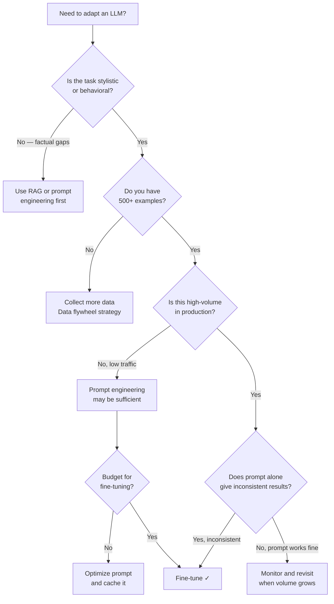
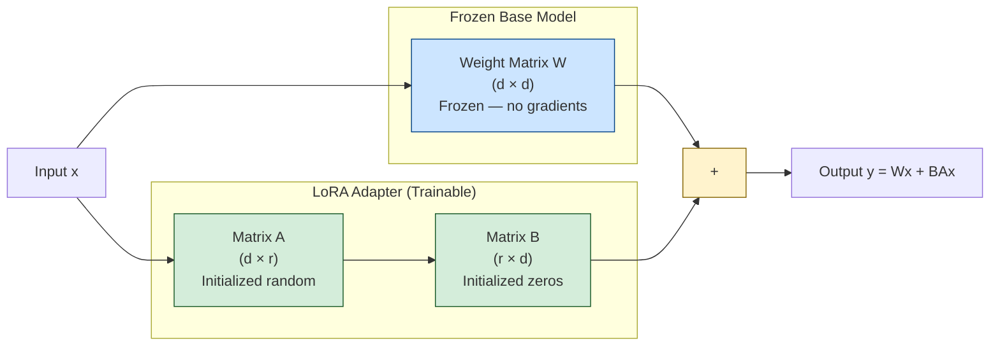

# Week 6: Fine-Tuning Models
**Theme: When Prompting Isn't Enough**

---

## 6.1 Fine-Tuning Concepts

### Parametric vs. Contextual Knowledge

Every large language model stores knowledge in two distinct ways. **Contextual knowledge** is anything you provide at inference time — the system prompt, few-shot examples, retrieved documents, and user input. The model reads this context, attends to it, and uses it to generate a response. **Parametric knowledge** is what the model has baked into its billions of weights through pre-training and fine-tuning. It does not need to be re-supplied; it is simply part of what the model *is*.

This distinction matters enormously for system design. When you write a 500-token system prompt describing your desired output format, tone, and domain vocabulary, you are paying for those 500 tokens on every single API call. At high volume — say, one million requests per day — that prompt overhead compounds into a significant cost. Fine-tuning moves that behavioral knowledge from context into weights, eliminating the need to re-state it each time.

The practical implication: fine-tuning is not primarily about accuracy improvements. It is about consistency, efficiency, and brand alignment. A fine-tuned model reliably produces outputs in a specific format without being reminded. It uses your company's internal terminology naturally. It adheres to a particular tone without a paragraph of instructions.

### The Fine-Tuning Spectrum

There are three main approaches, each representing a different point on the cost-capability tradeoff curve.

**Full fine-tuning** updates every parameter in the model. For a 7B-parameter model, that means storing gradients and optimizer states for 7 billion values, which requires tens of gigabytes of GPU memory per training step. The results are excellent — the model is deeply adapted — but the compute cost is prohibitive for most teams outside large research labs. It is also the approach most prone to **catastrophic forgetting**, where the model loses general capabilities while gaining task-specific ones.

**LoRA (Low-Rank Adaptation)** takes a cleverly different approach. Rather than updating the original weight matrices, it freezes them entirely and inserts small, trainable **adapter matrices** alongside the frozen layers. These adapters are low-rank decompositions: instead of learning a full delta matrix ΔW of shape (d × d), LoRA learns two thin matrices A (d × r) and B (r × d) where r is a small rank value like 8 or 16. The actual weight update is ΔW = BA, but only A and B are trained. For a typical attention layer, this reduces trainable parameters from millions to thousands — roughly 1% of full fine-tuning costs — while achieving surprisingly close performance.

**QLoRA (Quantized LoRA)** pushes this further by also quantizing the frozen base model weights to 4-bit precision. This dramatically reduces GPU memory requirements: a 7B-parameter model that would normally require 28 GB of VRAM can fit on a single consumer GPU with 16 GB when quantized. The LoRA adapters themselves remain in higher precision (bfloat16). QLoRA makes fine-tuning accessible to anyone with a mid-range GPU or a free Colab instance.



### When to Fine-Tune

Three situations reliably justify fine-tuning:

1. **Consistent output format**: JSON extraction, code generation in a specific style, structured reports. Prompts can guide the format, but fine-tuning bakes it in reliably.
2. **Proprietary domain vocabulary**: Medical billing codes, internal product names, legal clause labels. The base model has never seen these terms used correctly at scale.
3. **High-volume production tasks**: When you are making millions of calls, shaving 200 tokens off the system prompt can save thousands of dollars monthly.

Regarding **dataset size**, the community-accepted minimum is 100 examples, but meaningful, reliable gains typically require 1,000 or more. Below 100, the model is memorizing rather than generalizing. Above 10,000, you are in the territory of serious domain adaptation.

> **Key Insight:** Fine-tuning is not a replacement for good prompting — it is a production optimization. Before fine-tuning, you must already have a working solution via prompting. Fine-tuning then takes that working solution and makes it faster, cheaper, and more consistent at scale.

> **Key Insight:** LoRA does not modify the original weights. This means you can share one base model on disk and hot-swap multiple LoRA adapters for different tasks, making multi-tenant fine-tuning extremely storage-efficient.

> **Key Insight:** The rank hyperparameter `r` in LoRA controls the expressiveness of the adapter. Higher rank = more parameters = more expressive but slower to train. Start with r=8 for most tasks; use r=16 or r=32 for complex stylistic adaptation.

### Chapter Checkpoint

1. Explain the difference between parametric and contextual knowledge in an LLM, and give one example of when you would prefer to store knowledge parametrically via fine-tuning rather than in a system prompt.
2. A colleague says "QLoRA trains on 4-bit weights, so the quality must be much worse than full fine-tuning." How would you respond?
3. You have a customer support chatbot making 50,000 API calls per day with a 300-token system prompt. Describe the business case for fine-tuning, including a rough cost estimation framework.

---

## 6.2 Preparing Your Dataset

### The JSONL Format

Fine-tuning datasets for instruction-following models use the **JSONL (JSON Lines)** format — one JSON object per line, no surrounding array. Each object represents a single training example in the chat messages format:

```json
{"messages": [{"role": "user", "content": "What is the return policy for digital downloads?"}, {"role": "assistant", "content": "Digital downloads are non-refundable once the download link has been accessed. If you experienced a technical issue preventing download, please contact support within 7 days of purchase with your order number and we will provide a replacement link or store credit."}]}
```

This mirrors the structure you send to the chat completions API, making the mental model straightforward: each training example is exactly what you would want to happen if a user sent that message. You can include a system message as the first element if you want to bake a persona or context into the model:

```json
{"messages": [{"role": "system", "content": "You are a helpful customer support agent for Acme Software."}, {"role": "user", "content": "How do I reset my password?"}, {"role": "assistant", "content": "To reset your password, visit acme.com/reset and enter your registered email address. You will receive a reset link within 5 minutes. If you don't see it, check your spam folder."}]}
```

Multi-turn conversations are fully supported — just add more alternating user/assistant turns to the `messages` array.

### Cleaning Your Dataset

Raw data is almost never training-ready. The three most important cleaning steps are:

**Deduplication** prevents the model from overfitting to repeated examples. Use **MinHash** (a locality-sensitive hashing technique) to find near-duplicates efficiently at scale. Exact deduplication misses paraphrased versions of the same example, so MinHash's approximate matching is more robust.

**PII removal** is both a legal requirement (GDPR, CCPA) and a quality concern. Models that train on real customer conversations containing names, email addresses, or account numbers will memorize and potentially reproduce that information. Use a combination of regex patterns (for structured PII like emails and phone numbers) and an NER model (for names and locations) to scrub your data.

**Response length balance** ensures the model learns from diverse output lengths. If 80% of your training examples have two-sentence responses, the model will develop a strong prior toward short answers even when longer ones are appropriate. Check the distribution and either downsample over-represented lengths or augment under-represented ones.

```python
import json
import re
from collections import Counter
from hashlib import md5

def load_jsonl(path: str) -> list[dict]:
    """Load all examples from a JSONL file."""
    examples = []
    with open(path, "r", encoding="utf-8") as f:
        for line in f:
            line = line.strip()
            if line:
                examples.append(json.loads(line))
    return examples

def extract_assistant_text(example: dict) -> str:
    """Pull out just the assistant's response for analysis."""
    for msg in example["messages"]:
        if msg["role"] == "assistant":
            return msg["content"]
    return ""

def remove_pii(text: str) -> str:
    """Basic PII removal using regex patterns."""
    # Remove email addresses
    text = re.sub(r'\b[A-Za-z0-9._%+-]+@[A-Za-z0-9.-]+\.[A-Z|a-z]{2,}\b', '[EMAIL]', text)
    # Remove phone numbers (US formats)
    text = re.sub(r'\b(\+1[-.\s]?)?\(?\d{3}\)?[-.\s]?\d{3}[-.\s]?\d{4}\b', '[PHONE]', text)
    # Remove credit card patterns
    text = re.sub(r'\b\d{4}[-\s]?\d{4}[-\s]?\d{4}[-\s]?\d{4}\b', '[CARD]', text)
    return text

def deduplicate_by_user_message(examples: list[dict]) -> list[dict]:
    """Remove exact duplicate user queries (keep first occurrence)."""
    seen = set()
    unique = []
    for ex in examples:
        user_content = ""
        for msg in ex["messages"]:
            if msg["role"] == "user":
                user_content = msg["content"].strip().lower()
                break
        fingerprint = md5(user_content.encode()).hexdigest()
        if fingerprint not in seen:
            seen.add(fingerprint)
            unique.append(ex)
    return unique

def analyze_response_lengths(examples: list[dict]) -> dict:
    """Report distribution of response lengths in word count buckets."""
    lengths = [len(extract_assistant_text(ex).split()) for ex in examples]
    buckets = Counter()
    for l in lengths:
        if l < 20:
            buckets["short (<20 words)"] += 1
        elif l < 100:
            buckets["medium (20-100 words)"] += 1
        else:
            buckets["long (100+ words)"] += 1
    return dict(buckets)

def clean_and_save(input_path: str, output_path: str):
    """Full cleaning pipeline: load, deduplicate, remove PII, save."""
    examples = load_jsonl(input_path)
    print(f"Loaded {len(examples)} examples")

    # Deduplicate
    examples = deduplicate_by_user_message(examples)
    print(f"After deduplication: {len(examples)} examples")

    # Remove PII from all message content
    cleaned = []
    for ex in examples:
        clean_ex = {"messages": []}
        for msg in ex["messages"]:
            clean_msg = {
                "role": msg["role"],
                "content": remove_pii(msg["content"])
            }
            clean_ex["messages"].append(clean_msg)
        cleaned.append(clean_ex)

    # Report length distribution
    distribution = analyze_response_lengths(cleaned)
    print("Response length distribution:", distribution)

    # Save
    with open(output_path, "w", encoding="utf-8") as f:
        for ex in cleaned:
            f.write(json.dumps(ex) + "\n")
    print(f"Saved {len(cleaned)} cleaned examples to {output_path}")

if __name__ == "__main__":
    clean_and_save("raw_dataset.jsonl", "cleaned_dataset.jsonl")
```

### Generating Synthetic Data

When you do not have thousands of real user queries, **synthetic data generation** using a capable LLM (like Claude or GPT-4o) is a practical alternative. The process:

1. Gather raw source documents (FAQs, documentation, product manuals, past tickets).
2. Prompt the LLM to generate diverse question-answer pairs from those documents.
3. Optionally, have human reviewers verify a sample (10-20%) for quality.

```python
import anthropic
import json

client = anthropic.Anthropic()

def generate_qa_pairs(source_text: str, num_pairs: int = 5) -> list[dict]:
    """
    Use Claude to generate instruction-response pairs from a source document.
    Returns a list of JSONL-ready training examples.
    """
    prompt = f"""You are a dataset curator. Given the following source text, generate {num_pairs} diverse question-answer pairs that a customer support agent should know.

Format your response as a JSON array of objects, each with "question" and "answer" keys.
Make questions varied — some simple lookups, some multi-step reasoning, some edge cases.

SOURCE TEXT:
{source_text}

Respond with only the JSON array, no other text."""

    message = client.messages.create(
        model="claude-sonnet-4-6",
        max_tokens=2000,
        messages=[{"role": "user", "content": prompt}]
    )

    raw = message.content[0].text.strip()
    pairs = json.loads(raw)

    # Convert to fine-tuning JSONL format
    training_examples = []
    for pair in pairs:
        example = {
            "messages": [
                {"role": "user", "content": pair["question"]},
                {"role": "assistant", "content": pair["answer"]}
            ]
        }
        training_examples.append(example)

    return training_examples

# Example usage
source = """
Acme Software offers three subscription tiers: Basic ($9/mo), Pro ($29/mo), and Enterprise (custom pricing).
Basic includes 5 projects and 10GB storage. Pro includes unlimited projects and 100GB storage.
Cancellations take effect at the end of the current billing period. No refunds for partial months.
Enterprise contracts require 30-day written notice for cancellation.
"""

pairs = generate_qa_pairs(source, num_pairs=5)
for ex in pairs:
    print(json.dumps(ex))
```

### The Data Flywheel

The most valuable long-term strategy is the **data flywheel**: deploy an initial model (even prompt-engineered), capture real user queries and the model's responses, have human annotators correct the bad responses, and feed those corrected pairs back into the next fine-tuning run. Each cycle produces better training data because it reflects real-world query distribution. This is how production AI systems compound quality over time.

> **Key Insight:** Synthetic data quality depends entirely on the quality of your source documents. Garbage in, garbage out applies even when the garbage is AI-generated. Always ground synthetic generation in factual source material you have manually reviewed.

> **Key Insight:** The data flywheel is more valuable than any single dataset. Instrument your production system to log queries and responses from day one, even before you have enough data to fine-tune. You are building a data asset.

> **Key Insight:** JSONL is unforgiving with malformed lines. A single bad JSON object silently fails validation in many tools. Always run a validation pass (json.loads on each line) before uploading to any fine-tuning API.

### Chapter Checkpoint

1. You have a dataset of 2,000 customer support tickets in raw text format. Describe, step by step, how you would transform this into a fine-tuning JSONL dataset ready for upload.
2. What is MinHash, and why is it preferable to exact string matching for deduplication of conversational data?
3. Describe the data flywheel concept and explain why the data it produces is often higher quality than purely synthetic data.

---

## 6.3 Fine-Tuning in Practice

### OpenAI Fine-Tuning Pipeline

OpenAI provides a fully managed fine-tuning service that handles the distributed training infrastructure for you. The workflow has three steps: upload your dataset, create a fine-tuning job, and monitor until completion.

```python
import os
import time
from openai import OpenAI

client = OpenAI(api_key=os.environ["OPENAI_API_KEY"])

# Step 1: Upload the training file
def upload_dataset(file_path: str) -> str:
    """Upload a JSONL file and return the file ID."""
    with open(file_path, "rb") as f:
        response = client.files.create(
            file=f,
            purpose="fine-tune"
        )
    print(f"Uploaded file ID: {response.id}")
    return response.id

# Step 2: Create the fine-tuning job
def create_fine_tune_job(
    training_file_id: str,
    validation_file_id: str = None,
    model: str = "gpt-4o-mini-2024-07-18",
    n_epochs: int = 3,
    suffix: str = "customer-support-v1"
) -> str:
    """Create a fine-tuning job and return the job ID."""
    params = {
        "training_file": training_file_id,
        "model": model,
        "hyperparameters": {
            "n_epochs": n_epochs,
        },
        "suffix": suffix
    }
    if validation_file_id:
        params["validation_file"] = validation_file_id

    job = client.fine_tuning.jobs.create(**params)
    print(f"Created fine-tuning job: {job.id}")
    print(f"Status: {job.status}")
    return job.id

# Step 3: Monitor the job
def monitor_job(job_id: str, poll_interval: int = 60) -> str:
    """
    Poll the fine-tuning job until completion.
    Returns the fine-tuned model name when done.
    """
    print(f"Monitoring job {job_id}...")
    while True:
        job = client.fine_tuning.jobs.retrieve(job_id)
        status = job.status

        # Fetch recent events for training loss updates
        events = client.fine_tuning.jobs.list_events(
            fine_tuning_job_id=job_id,
            limit=5
        )
        for event in reversed(events.data):
            print(f"  [{event.created_at}] {event.message}")

        if status == "succeeded":
            print(f"\nFine-tuning complete!")
            print(f"Model name: {job.fine_tuned_model}")
            return job.fine_tuned_model
        elif status in ("failed", "cancelled"):
            print(f"Job ended with status: {status}")
            if job.error:
                print(f"Error: {job.error}")
            return None

        print(f"Status: {status}. Waiting {poll_interval}s...")
        time.sleep(poll_interval)

# Full pipeline
if __name__ == "__main__":
    # Upload train and validation splits
    train_id = upload_dataset("train.jsonl")
    val_id = upload_dataset("validation.jsonl")

    # Create job with 3 epochs (OpenAI default, good starting point)
    job_id = create_fine_tune_job(
        training_file_id=train_id,
        validation_file_id=val_id,
        n_epochs=3,
        suffix="support-v1"
    )

    # Monitor until done
    model_name = monitor_job(job_id)
    if model_name:
        print(f"\nUse this model: {model_name}")
        # Example: ft:gpt-4o-mini-2024-07-18:acme:support-v1:AbCdEfGh
```

**Cost estimation for GPT-4o-mini**: at $3.00 per million training tokens, a dataset of 200 examples averaging 500 tokens each gives 100,000 tokens. Over 3 epochs, the model sees 300,000 tokens total — a training cost of approximately $0.90. This is negligible compared to the prompt savings at production scale.

### Understanding Loss Curves

The validation file is critical. Without it, you are flying blind on overfitting. OpenAI plots both training and validation loss in the fine-tuning dashboard. What you want to see:

- Both curves declining together in the first epoch
- Validation loss stabilizing or continuing to decline by epoch 3
- Training loss slightly below validation loss (normal gap)

What signals a problem: validation loss stops declining or starts rising while training loss continues down. This is **overfitting** — the model is memorizing your training examples rather than learning generalizable patterns. Remedies: reduce epochs, add more diverse examples, or increase the weight decay.

### Llama 3 with QLoRA on a Single GPU

For teams who want full control or cannot send data to a third-party API, running QLoRA on an open-source model is the alternative. The `unsloth` library dramatically simplifies this workflow and provides 2x training speed improvements over naive PEFT setups.

```python
# Install: pip install unsloth transformers trl datasets accelerate bitsandbytes
from unsloth import FastLanguageModel
from trl import SFTTrainer
from transformers import TrainingArguments
from datasets import load_dataset

# Load base model in 4-bit (QLoRA)
model, tokenizer = FastLanguageModel.from_pretrained(
    model_name="unsloth/Meta-Llama-3.1-8B-Instruct",
    max_seq_length=2048,
    dtype=None,          # Auto-detect: bfloat16 on Ampere, float16 on older
    load_in_4bit=True,   # QLoRA: quantize base weights to 4-bit
)

# Inject LoRA adapters into the attention layers
model = FastLanguageModel.get_peft_model(
    model,
    r=16,                # LoRA rank
    target_modules=[
        "q_proj", "k_proj", "v_proj", "o_proj",  # Attention projections
        "gate_proj", "up_proj", "down_proj"        # MLP layers
    ],
    lora_alpha=16,       # Scaling factor; keep equal to r as a starting point
    lora_dropout=0.05,   # Light dropout for regularization
    bias="none",
    use_gradient_checkpointing="unsloth",  # Reduces VRAM by ~30%
    random_state=42,
)

# Load and format dataset
dataset = load_dataset("json", data_files="train.jsonl", split="train")

def format_example(example):
    """Convert messages format to a single training string."""
    messages = example["messages"]
    text = tokenizer.apply_chat_template(
        messages,
        tokenize=False,
        add_generation_prompt=False
    )
    return {"text": text}

dataset = dataset.map(format_example)

# Configure training
trainer = SFTTrainer(
    model=model,
    tokenizer=tokenizer,
    train_dataset=dataset,
    dataset_text_field="text",
    max_seq_length=2048,
    args=TrainingArguments(
        per_device_train_batch_size=4,
        gradient_accumulation_steps=4,   # Effective batch size = 16
        warmup_steps=10,
        num_train_epochs=3,
        learning_rate=2e-4,              # Standard LoRA learning rate
        fp16=False,
        bf16=True,                       # Better on modern GPUs
        logging_steps=10,
        output_dir="./outputs",
        save_strategy="epoch",
        optim="adamw_8bit",              # 8-bit Adam saves memory
    ),
)

trainer.train()

# Save LoRA adapter weights only (~50MB, not the full 16GB model)
model.save_pretrained("customer_support_adapter")
tokenizer.save_pretrained("customer_support_adapter")
print("Adapter saved. Load with: FastLanguageModel.from_pretrained('customer_support_adapter')")
```



### Key Hyperparameters

Three hyperparameters dominate fine-tuning outcomes:

- **Epochs (n_epochs = 3)**: The number of complete passes through the training data. Three is the standard starting point. More epochs risk overfitting on small datasets.
- **Learning rate (lr = 2e-4)**: Higher than typical pre-training LRs because LoRA adapters start from random initialization. For full fine-tuning, use 1e-5 to 5e-5.
- **Batch size with gradient accumulation**: A per-device batch size of 4 with gradient accumulation of 4 gives an effective batch size of 16, which provides stable gradient estimates without requiring more VRAM.

> **Key Insight:** The effective batch size (per_device_batch_size × gradient_accumulation_steps × num_GPUs) matters more than any individual component. Larger effective batch sizes produce more stable training at the cost of more memory or more steps before a weight update.

> **Key Insight:** LoRA adapters are tiny — typically 10-100MB even for large models. This makes them easy to version, share, and swap at inference time. You can maintain a library of task-specific adapters loaded on demand over a single base model in memory.

> **Key Insight:** GPT-4o-mini fine-tuning is remarkable value for production use. The training cost is almost always under $10 for typical datasets, while the inference cost savings at volume can reach hundreds of dollars per day.

### Chapter Checkpoint

1. Walk through the three OpenAI fine-tuning API calls required to train a model: what does each call do and what does it return?
2. What is the difference between per-device batch size and effective batch size? Why does effective batch size matter?
3. Explain what the LoRA matrices A and B represent and why B is initialized to zeros.

---

## 6.4 Evaluating Fine-Tuned Models

### The A/B Testing Framework

After fine-tuning, you have two models: the base model (possibly with a detailed system prompt) and the fine-tuned model (possibly with a minimal prompt). To compare them rigorously, you need a structured **A/B test** — not intuition and spot-checking.

The standard approach: take a held-out test set of 50-100 examples that the model never saw during training. Run both models on every example with identical inputs. Then evaluate the outputs through one of three methods: human raters, an LLM judge, or automatic metrics.

**LLM-as-judge** is the most practical approach for production teams. You ask a capable model (GPT-4o or Claude) to compare two responses side by side and pick the better one, given a rubric. This is faster than human evaluation, more consistent than BLEU/ROUGE, and scalable to hundreds of comparisons.

```python
import os
import json
from openai import OpenAI

client = OpenAI(api_key=os.environ["OPENAI_API_KEY"])

JUDGE_PROMPT = """You are an expert evaluator of customer support responses.

Given a customer question and two different responses (A and B), determine which response is better.

Evaluate based on:
1. Accuracy: Is the information correct and complete?
2. Clarity: Is the response easy to understand?
3. Tone: Is it professional and empathetic?
4. Conciseness: Does it answer without unnecessary padding?

Customer Question: {question}

Response A:
{response_a}

Response B:
{response_b}

Reply with a JSON object: {{"winner": "A" or "B" or "tie", "reasoning": "one sentence explanation"}}
Respond with only the JSON, no other text."""

def llm_judge(question: str, response_a: str, response_b: str) -> dict:
    """Use GPT-4o as a judge to compare two responses."""
    prompt = JUDGE_PROMPT.format(
        question=question,
        response_a=response_a,
        response_b=response_b
    )
    result = client.chat.completions.create(
        model="gpt-4o",
        messages=[{"role": "user", "content": prompt}],
        temperature=0,  # Deterministic judging
    )
    return json.loads(result.choices[0].message.content.strip())

def run_ab_test(
    test_cases: list[dict],
    base_model: str,
    finetuned_model: str,
    base_system_prompt: str = "",
    finetuned_system_prompt: str = ""
) -> dict:
    """
    Run a complete A/B test between two models on a list of test cases.
    test_cases: list of {"question": str, "expected": str} dicts
    Returns win/loss/tie counts and per-example details.
    """
    results = {"base_wins": 0, "finetuned_wins": 0, "ties": 0, "details": []}

    for i, case in enumerate(test_cases):
        question = case["question"]

        # Get base model response
        base_messages = []
        if base_system_prompt:
            base_messages.append({"role": "system", "content": base_system_prompt})
        base_messages.append({"role": "user", "content": question})

        base_response = client.chat.completions.create(
            model=base_model,
            messages=base_messages,
            temperature=0,
        ).choices[0].message.content

        # Get fine-tuned model response
        ft_messages = []
        if finetuned_system_prompt:
            ft_messages.append({"role": "system", "content": finetuned_system_prompt})
        ft_messages.append({"role": "user", "content": question})

        ft_response = client.chat.completions.create(
            model=finetuned_model,
            messages=ft_messages,
            temperature=0,
        ).choices[0].message.content

        # Judge: randomly assign A/B to avoid position bias
        # Alternate which model is "A" to reduce ordering bias
        if i % 2 == 0:
            verdict = llm_judge(question, base_response, ft_response)
            if verdict["winner"] == "A":
                results["base_wins"] += 1
            elif verdict["winner"] == "B":
                results["finetuned_wins"] += 1
            else:
                results["ties"] += 1
        else:
            verdict = llm_judge(question, ft_response, base_response)
            if verdict["winner"] == "A":
                results["finetuned_wins"] += 1
            elif verdict["winner"] == "B":
                results["base_wins"] += 1
            else:
                results["ties"] += 1

        results["details"].append({
            "question": question,
            "base_response": base_response,
            "ft_response": ft_response,
            "verdict": verdict
        })
        print(f"Case {i+1}/{len(test_cases)}: {verdict['winner']} wins — {verdict['reasoning']}")

    total = len(test_cases)
    print(f"\nResults over {total} test cases:")
    print(f"  Base model wins:       {results['base_wins']} ({100*results['base_wins']//total}%)")
    print(f"  Fine-tuned model wins: {results['finetuned_wins']} ({100*results['finetuned_wins']//total}%)")
    print(f"  Ties:                  {results['ties']} ({100*results['ties']//total}%)")
    return results
```

### Automatic Metrics and Their Limits

**BLEU (Bilingual Evaluation Understudy)** and **ROUGE (Recall-Oriented Understudy for Gisting Evaluation)** measure n-gram overlap between a model's output and a reference answer. BLEU focuses on precision; ROUGE focuses on recall. They are fast, cheap, and reproducible — but they are only meaningful for tasks with a definitive correct output, such as extracting a specific field from a document or translating a phrase with little ambiguity.

For open-ended customer support, BLEU scores are nearly useless. A perfectly helpful response phrased differently from the reference answer will score low, while a response that copies the reference verbatim scores perfectly regardless of whether it actually addresses the question.

**F1 score for classification heads** is genuinely useful when your task is categorical: sentiment classification, intent detection, routing to support tier. F1 = 2 × (Precision × Recall) / (Precision + Recall), and it handles class imbalance better than accuracy.

### Cost-Performance Pareto Analysis

The most important business evaluation is the **cost-performance Pareto curve**: plotting model quality against inference cost and finding the efficient frontier.

A typical result from fine-tuning GPT-4o-mini on a customer support task:
- Base GPT-4o with detailed system prompt: high quality, ~$15 per million tokens (input+output)
- Fine-tuned GPT-4o-mini with minimal prompt: comparable quality, ~$1.50 per million tokens (input+output)
- Base GPT-4o-mini with detailed system prompt: lower quality, ~$1.50 per million tokens

The fine-tuned GPT-4o-mini often dominates base GPT-4o-mini on quality while matching it on cost, and approaches GPT-4o quality at 10% of the cost. This is the typical value proposition of fine-tuning.

### Detecting Overfitting

Return to your loss curves. The clearest overfitting signal: training loss continues decreasing through all epochs, but validation loss stops decreasing around epoch 1-2 and either plateaus or trends upward. In the output space, overfitting manifests as:

- The model reproducing verbatim phrases from training examples
- Excellent performance on queries that resemble training examples, poor performance on slightly different phrasings
- Very high confidence (low perplexity) on training-like inputs, high perplexity on novel inputs

If you observe these patterns, reduce epochs to 1-2 and add more diverse training examples before retraining.

> **Key Insight:** LLM-as-judge evaluation has a known bias toward longer, more confident-sounding responses. Mitigate this by explicitly asking the judge to penalize unnecessary verbosity, and by using a rubric that rewards conciseness.

> **Key Insight:** Always randomize which model is "A" and which is "B" in your judge prompt. LLM judges exhibit position bias — they prefer the response labeled A slightly more often, and the first response they read more often. Alternating assignments and averaging the results corrects for this.

> **Key Insight:** Validation loss is not just a training diagnostic — it is a quality proxy. If you cannot afford human evaluation, a low and stable validation loss combined with sample inspection of 10-15 outputs is a reasonable quality gate before deployment.

### Chapter Checkpoint

1. Why is BLEU score an unreliable evaluation metric for an open-ended customer support chatbot? What would you use instead, and why?
2. Describe the cost-performance Pareto analysis. For a customer support application handling one million queries per month, construct a simplified cost comparison between base GPT-4o and fine-tuned GPT-4o-mini.
3. You notice that after fine-tuning, training loss reaches 0.3 but validation loss has risen to 0.8 by epoch 3. What does this indicate, and what two actions would you take?

---

## Lab Walkthrough

### Lab: Fine-Tune GPT-4o-mini on Customer Support Q&A

**Objective:** Fine-tune GPT-4o-mini on 200 customer support question-answer pairs and demonstrate that the fine-tuned model matches or exceeds a well-prompted base GPT-4o-mini on 50 test cases, as judged by an LLM judge.

**Prerequisites:** OpenAI API key with fine-tuning access, Python 3.10+, ~$5 of API budget.

---

#### Step 1: Generate or Collect the Dataset

If you do not have real customer support data, generate synthetic data from documentation using the `generate_qa_pairs` function from Section 6.2. Target: 250 total examples (200 for training, 50 for testing).

Aim for diversity across these categories:
- Account and billing questions (50 examples)
- Technical troubleshooting (50 examples)
- Feature usage questions (50 examples)
- Cancellation and refund policies (50 examples)
- Edge cases and escalation scenarios (50 examples)

```bash
# Install dependencies
pip install openai anthropic datasets
```

```python
# generate_dataset.py
# Run this script to produce train.jsonl and test.jsonl

import json
import random
import anthropic

client = anthropic.Anthropic()

CATEGORY_PROMPTS = {
    "billing": "Questions about subscription pricing, invoices, payment methods, and billing errors.",
    "technical": "Questions about login issues, installation errors, integration bugs, and performance problems.",
    "features": "Questions about how to use specific product features, workflows, and best practices.",
    "cancellation": "Questions about cancelling subscriptions, data export, refund eligibility.",
    "escalation": "Complex multi-part questions, frustrated customer scenarios, and exceptions to policy."
}

PRODUCT_CONTEXT = """
Acme Project Management Software:
- Tiers: Basic ($9/mo, 5 projects, 10GB), Pro ($29/mo, unlimited projects, 100GB), Enterprise (custom)
- Free trial: 14 days, no credit card required
- Integrations: Slack, GitHub, Google Drive, Jira
- Cancellation: end of billing period, no partial refunds; Enterprise requires 30-day notice
- Data export: CSV and JSON formats, available from Settings > Export
- Support: email (all tiers), live chat (Pro+), dedicated CSM (Enterprise)
"""

all_examples = []

for category, description in CATEGORY_PROMPTS.items():
    prompt = f"""Generate 50 realistic customer support Q&A pairs for {category} questions.
Context about the product:
{PRODUCT_CONTEXT}

Category focus: {description}

Format as a JSON array of objects with "question" and "answer" keys.
Make questions realistic — use natural customer language, not formal documentation language.
Answers should be concise, accurate, and helpful (2-4 sentences typically).
Include some edge cases and multi-part questions.
Reply with only the JSON array."""

    response = client.messages.create(
        model="claude-sonnet-4-6",
        max_tokens=8000,
        messages=[{"role": "user", "content": prompt}]
    )
    pairs = json.loads(response.content[0].text.strip())

    for pair in pairs:
        all_examples.append({
            "category": category,
            "messages": [
                {"role": "user", "content": pair["question"]},
                {"role": "assistant", "content": pair["answer"]}
            ]
        })

# Shuffle and split
random.shuffle(all_examples)
train_examples = all_examples[:200]
test_examples = all_examples[200:250]

# Save without category field (fine-tuning format)
with open("train.jsonl", "w") as f:
    for ex in train_examples:
        f.write(json.dumps({"messages": ex["messages"]}) + "\n")

with open("test.jsonl", "w") as f:
    for ex in test_examples:
        f.write(json.dumps({"messages": ex["messages"]}) + "\n")

print(f"Saved {len(train_examples)} training examples and {len(test_examples)} test examples")
```

---

#### Step 2: Validate and Clean the Dataset

Before uploading, validate every line and check basic statistics.

```python
# validate_dataset.py
import json

def validate_jsonl(path: str) -> bool:
    """Validate that every line is valid JSONL in the correct format."""
    errors = []
    with open(path, "r") as f:
        for i, line in enumerate(f, 1):
            line = line.strip()
            if not line:
                continue
            try:
                obj = json.loads(line)
                assert "messages" in obj, "Missing 'messages' key"
                for msg in obj["messages"]:
                    assert "role" in msg and "content" in msg, "Message missing role or content"
                    assert msg["role"] in ("system", "user", "assistant"), f"Invalid role: {msg['role']}"
            except Exception as e:
                errors.append(f"Line {i}: {e}")

    if errors:
        for err in errors:
            print(f"ERROR: {err}")
        return False
    print(f"{path}: All lines valid.")
    return True

validate_jsonl("train.jsonl")
validate_jsonl("test.jsonl")
```

---

#### Step 3: Upload and Start Fine-Tuning

Use the pipeline from Section 6.3 to upload and start the job:

```python
# finetune.py
from openai import OpenAI
import os

client = OpenAI(api_key=os.environ["OPENAI_API_KEY"])

# Upload files
with open("train.jsonl", "rb") as f:
    train_file = client.files.create(file=f, purpose="fine-tune")

# For a 200-example dataset, a validation split is small but still useful
# Take the last 20 lines of train.jsonl as validation in a real scenario
# For simplicity here, we skip validation file

job = client.fine_tuning.jobs.create(
    training_file=train_file.id,
    model="gpt-4o-mini-2024-07-18",
    hyperparameters={"n_epochs": 3},
    suffix="acme-support-v1"
)

print(f"Job ID: {job.id}")
print("Monitor at: https://platform.openai.com/finetune")
print(f"Or run: python monitor_job.py {job.id}")
```

```bash
# Save your job ID — fine-tuning takes 10-60 minutes
# Check status
python -c "
from openai import OpenAI
import os, sys
client = OpenAI(api_key=os.environ['OPENAI_API_KEY'])
job = client.fine_tuning.jobs.retrieve(sys.argv[1])
print(f'Status: {job.status}')
print(f'Model: {job.fine_tuned_model}')
" YOUR_JOB_ID_HERE
```

---

#### Step 4: Run the A/B Evaluation

Once training completes and you have your fine-tuned model name (format: `ft:gpt-4o-mini-2024-07-18:...:acme-support-v1:...`), run the comparison:

```python
# evaluate.py
import json
import os
from openai import OpenAI

client = OpenAI(api_key=os.environ["OPENAI_API_KEY"])

FINETUNED_MODEL = "ft:gpt-4o-mini-2024-07-18:YOUR_ORG:acme-support-v1:XXXXXXXX"  # Replace

BASE_SYSTEM_PROMPT = """You are a helpful customer support agent for Acme Project Management Software.
Acme offers three tiers: Basic ($9/mo, 5 projects, 10GB), Pro ($29/mo, unlimited projects, 100GB), and Enterprise (custom).
Free trial is 14 days. Cancellations take effect at end of billing period. No partial refunds.
Data export is available under Settings > Export in CSV or JSON format.
Support channels: email (all tiers), live chat (Pro+), dedicated CSM (Enterprise only)."""

def get_response(model: str, question: str, system_prompt: str = "") -> str:
    messages = []
    if system_prompt:
        messages.append({"role": "system", "content": system_prompt})
    messages.append({"role": "user", "content": question})
    return client.chat.completions.create(
        model=model,
        messages=messages,
        temperature=0,
        max_tokens=300
    ).choices[0].message.content

JUDGE_PROMPT = """Compare two customer support responses and choose the better one.

Customer Question: {question}

Response A:
{a}

Response B:
{b}

Criteria: accuracy, clarity, tone, and conciseness.
Reply with JSON: {{"winner": "A", "B", or "tie", "reasoning": "brief reason"}}"""

def judge(question, a, b):
    prompt = JUDGE_PROMPT.format(question=question, a=a, b=b)
    result = client.chat.completions.create(
        model="gpt-4o",
        messages=[{"role": "user", "content": prompt}],
        temperature=0
    )
    return json.loads(result.choices[0].message.content.strip())

# Load test cases
test_cases = []
with open("test.jsonl") as f:
    for line in f:
        obj = json.loads(line.strip())
        question = next(m["content"] for m in obj["messages"] if m["role"] == "user")
        test_cases.append(question)

base_wins = ft_wins = ties = 0

for i, question in enumerate(test_cases):
    base_resp = get_response("gpt-4o-mini-2024-07-18", question, BASE_SYSTEM_PROMPT)
    ft_resp = get_response(FINETUNED_MODEL, question)  # No system prompt needed

    # Alternate A/B assignment to reduce position bias
    if i % 2 == 0:
        verdict = judge(question, base_resp, ft_resp)
        if verdict["winner"] == "A": base_wins += 1
        elif verdict["winner"] == "B": ft_wins += 1
        else: ties += 1
    else:
        verdict = judge(question, ft_resp, base_resp)
        if verdict["winner"] == "A": ft_wins += 1
        elif verdict["winner"] == "B": base_wins += 1
        else: ties += 1

    print(f"Q{i+1}: winner={verdict['winner']} | {verdict['reasoning'][:80]}")

total = len(test_cases)
print(f"\nFinal Results ({total} test cases):")
print(f"  Base GPT-4o-mini wins: {base_wins} ({100*base_wins//total}%)")
print(f"  Fine-tuned wins:       {ft_wins} ({100*ft_wins//total}%)")
print(f"  Ties:                  {ties} ({100*ties//total}%)")
```

---

#### Step 5: Analyze and Document Results

Examine the cases where the base model won. Are they questions outside the training distribution? Does the fine-tuned model over-confidently apply patterns from training? These insights guide your next data collection cycle.

Expected outcome for a well-curated 200-example dataset: the fine-tuned model wins 50-70% of comparisons on in-distribution questions, with the base model winning on novel edge cases. Both models should be similar in overall helpfulness, but the fine-tuned model should produce more consistently formatted, on-brand responses without the lengthy system prompt.

---

## Further Reading

1. **"LoRA: Low-Rank Adaptation of Large Language Models"** — Hu et al., 2021 (arXiv:2106.09685). The original LoRA paper. Concise and highly readable; explains the mathematical motivation for low-rank decomposition and the empirical results across GPT-3 tasks.

2. **"QLoRA: Efficient Finetuning of Quantized LLMs"** — Dettmers et al., 2023 (arXiv:2305.14314). Introduces 4-bit NormalFloat quantization and the memory efficiency analysis that makes single-GPU fine-tuning of 65B-parameter models possible.

3. **"Scaling Instruction-Finetuned Language Models" (FLAN)** — Chung et al., Google Research, 2022 (arXiv:2210.11416). Demonstrates how instruction fine-tuning generalizes across tasks and why dataset diversity matters more than raw size for instruction following.

4. **OpenAI Fine-Tuning Guide** — platform.openai.com/docs/guides/fine-tuning. The authoritative reference for the OpenAI fine-tuning API, including dataset preparation requirements, supported models, hyperparameter options, and cost calculations. Updated frequently.

5. **"A Survey of Large Language Models"** — Zhao et al., 2023 (arXiv:2303.18223). Chapter 5 covers fine-tuning methodologies in depth, including RLHF, instruction tuning, and parameter-efficient methods, with an excellent taxonomy of when each approach is appropriate.

---

## Week Summary

- **Fine-tuning moves knowledge from context into weights**, reducing per-call prompt costs and improving consistency for high-volume production tasks. It is a production optimization, not a substitute for good prompt engineering.

- **LoRA and QLoRA make fine-tuning accessible**: LoRA trains only ~1% of parameters via low-rank adapter matrices injected into frozen attention layers; QLoRA additionally quantizes the base model to 4-bit, enabling single-GPU fine-tuning of models with billions of parameters.

- **Dataset quality dominates quantity**: a minimum of 100 diverse, PII-free, deduplicated examples is required, with 1,000+ needed for reliable generalization. Synthetic data generation from source documents is a practical bootstrap strategy, while the data flywheel compounds quality over time using real production queries.

- **The OpenAI fine-tuning pipeline is three API calls** — upload file, create job, monitor status — with GPT-4o-mini training costing approximately $3 per million tokens seen across all epochs, typically under $10 for a standard 200-example dataset at 3 epochs.

- **Evaluation requires a structured A/B test with an LLM judge**, not spot-checking. Monitor training and validation loss curves for overfitting (validation loss rising while training loss falls), compare cost-performance Pareto curves against base models, and always randomize A/B assignment to remove position bias from the judge.
