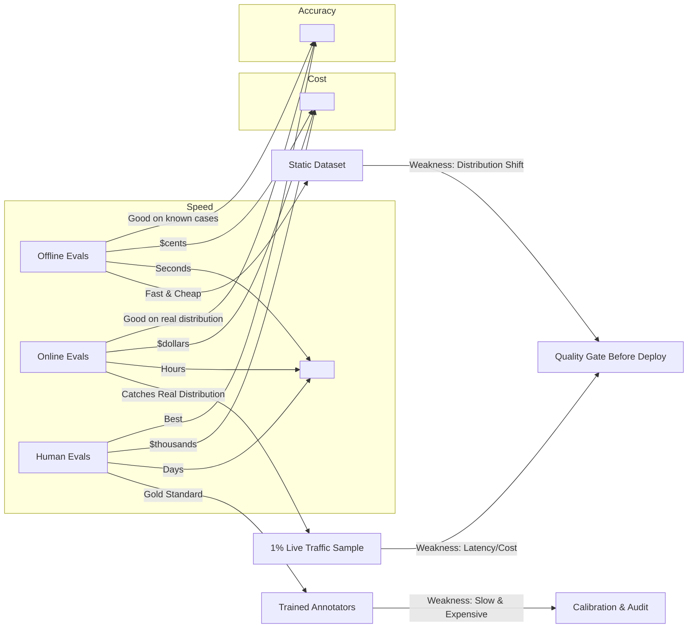
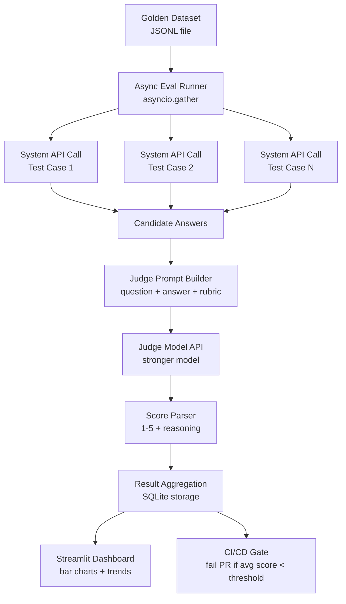

# Week 7: Introduction to Evaluation Systems

> **Theme:** "If you can't measure it, you can't improve it"

Building AI systems is easy. Building AI systems that reliably improve over time is hard. The difference between the two is evaluation. This week we move from intuition-based development to systematic, measurable quality assurance for language model applications.

---

## 7.1 Why Evals Matter

### The Vibe-Checking Problem

Every developer who has shipped an LLM-based feature has done it: open a notebook, fire off ten or twenty prompts, read the outputs, nod approvingly, and ship. This practice — informally called **vibe-checking** — is not entirely without value. For the first few hours of a project it is the fastest way to build intuition. But it does not scale, and it is not repeatable.

The moment your system has more than 20 test cases, manual review becomes a liability. A human reviewer takes roughly 30–60 seconds per output for a careful assessment. At 100 test cases that is already close to an hour. At 1,000 cases it is a full work day. At 10,000 cases — the scale needed to catch subtle regressions in a production system — it is simply impossible to do before a deployment. And even if you had the time, human reviewers are inconsistent: the same output evaluated on a Monday morning and a Friday afternoon will often receive different scores from the same person.

More critically, vibe-checking has no memory. You read twenty outputs, feel good, make a prompt change, read twenty more outputs, feel good again. But did the second prompt actually improve on the first? Did it fix the three edge cases you cared about while silently breaking two others you forgot about? Without a structured dataset and recorded scores, there is no way to know.

### The Evaluation Spectrum

Modern LLM applications are evaluated across three complementary modalities, each with distinct tradeoffs in speed, cost, and accuracy.

**Offline evals** run against a static, curated dataset. They are fast (seconds to minutes), cheap (a few API calls), and fully reproducible. Every time you change your prompt or your retrieval logic, you run the offline suite and compare the aggregate score to the previous run. The weakness of offline evals is distribution shift: your static dataset may not reflect what real users are actually asking. A system can score 95% on your hand-crafted test cases and still frustrate users with the kinds of questions you never thought to include.

**Online evals** address the distribution problem by sampling a percentage of live production traffic — typically 1% — and running automated scoring on those real requests. Online evals catch issues that offline evals miss because they reflect the actual distribution of user intent. A user asking "whats the refund policy" (no apostrophe, lowercase) may behave differently than your carefully typed test case "What is the refund policy?" in ways that reveal tokenization or casing bugs. The cost of online evals is latency and expense: you are making extra API calls on live traffic, and the results arrive hours or days after deployment rather than before it.

**Human evals** are the gold standard. A trained human annotator reads the output and scores it according to a rubric. Human judgments capture nuance, cultural context, and commonsense reasoning that automated metrics frequently miss. The cost is severe: a professional annotation run for 500 outputs can cost thousands of dollars and take days to complete. Human evals are therefore used sparingly — typically to calibrate automated judges, to evaluate new model versions, or to investigate specific quality concerns.



### Building a Golden Dataset

A **golden dataset** is the foundation of your evaluation system. It is a curated collection of test cases that your system must pass before any change ships. A useful golden dataset has at minimum 30 entries, though 100–200 is more robust for production systems.

Diversity is the key design principle. A golden dataset should cover:

- **Happy paths**: The straightforward, in-scope questions your system was designed to answer. These verify that the core functionality works.
- **Edge cases**: Ambiguous, unusual, or boundary-condition inputs. What happens when the user asks a question that is almost but not quite in scope? What happens with a very short query? A very long one?
- **Known failure modes**: Every time a user reports a bug or you discover an issue in production, you add a test case for that exact scenario. This transforms incidents into regression tests.

The process of building the golden dataset is itself educational. Writing 30 diverse test cases forces you to articulate precisely what your system should and should not do — a form of specification that most teams skip and later regret.

### Regression Testing as a Development Discipline

**Regression testing** is the practice of re-running the full evaluation suite every time you make a change. The discipline is simple: before you change anything — the prompt, the retrieval parameters, the model version, the chunking strategy — run the suite and record the scores. After the change, run the suite again. If the scores dropped, the change was harmful regardless of how good it felt when you vibe-checked it.

The most important habit in regression testing is adding a new test case every single time you encounter a failure in production. This practice transforms your golden dataset from a static artifact into a living record of everything your system has ever gotten wrong.

```python
# regression_runner.py
# Simple regression test runner that compares two eval runs

import json
import sqlite3
from datetime import datetime

def load_test_cases(jsonl_path: str) -> list[dict]:
    """Load test cases from a JSONL file."""
    cases = []
    with open(jsonl_path, "r", encoding="utf-8") as f:
        for line in f:
            line = line.strip()
            if line:
                cases.append(json.loads(line))
    return cases

def record_run_result(db_path: str, run_id: str, case_id: str, score: float, latency_ms: int, cost_usd: float):
    """Persist a single eval result to SQLite."""
    conn = sqlite3.connect(db_path)
    conn.execute("""
        CREATE TABLE IF NOT EXISTS eval_results (
            run_id TEXT,
            case_id TEXT,
            score REAL,
            latency_ms INTEGER,
            cost_usd REAL,
            created_at TEXT
        )
    """)
    conn.execute(
        "INSERT INTO eval_results VALUES (?, ?, ?, ?, ?, ?)",
        (run_id, case_id, score, latency_ms, cost_usd, datetime.utcnow().isoformat())
    )
    conn.commit()
    conn.close()

def compare_runs(db_path: str, run_id_before: str, run_id_after: str) -> dict:
    """Compare average scores between two eval runs."""
    conn = sqlite3.connect(db_path)
    def avg_score(run_id):
        row = conn.execute(
            "SELECT AVG(score) FROM eval_results WHERE run_id = ?", (run_id,)
        ).fetchone()
        return row[0] if row[0] is not None else 0.0
    before = avg_score(run_id_before)
    after = avg_score(run_id_after)
    conn.close()
    return {
        "before": round(before, 3),
        "after": round(after, 3),
        "delta": round(after - before, 3),
        "regression": after < before,
    }

if __name__ == "__main__":
    # Example usage: compare two hypothetical runs
    result = compare_runs("evals.db", "run_2024_01_15", "run_2024_01_16")
    if result["regression"]:
        print(f"REGRESSION DETECTED: score dropped by {abs(result['delta']):.3f}")
    else:
        print(f"OK: score improved by {result['delta']:.3f}")
```

> **Key Insight:** The discipline of adding a test case for every production failure is the single most effective way to prevent the same bug from recurring. After six months of this practice, your golden dataset becomes a comprehensive specification of your system's known failure modes.

> **Key Insight:** Offline and online evals are not competing approaches — they are complementary. Use offline evals as a gate before deployment (fast, cheap, reproducible) and online evals as a monitoring signal after deployment (reflects real distribution).

> **Key Insight:** A golden dataset with 30 well-chosen diverse cases is more valuable than a dataset with 300 variations of the same happy path. Diversity, not volume, is what makes a dataset useful.

### Chapter Checkpoint

1. Why does vibe-checking break down as an evaluation strategy when a system has more than 20 test cases? What specific properties does it lack?
2. A colleague argues that online evals are strictly better than offline evals because they use real user data. Construct a counter-argument explaining why offline evals remain essential even when online evals are in place.
3. You discover that your RAG system consistently fails on queries that contain numerical ranges (e.g., "products between $50 and $100"). What specific action should you take in your evaluation infrastructure, and why?

---

## 7.2 Automated Evaluation Techniques

### The LLM-as-Judge Paradigm

Manual evaluation does not scale. Reference-based metrics like ROUGE are brittle. The breakthrough insight that has transformed LLM evaluation is that a stronger language model can serve as an automated evaluator — a technique called **LLM-as-judge**.

The mechanism is straightforward: given a question, a candidate answer, and a scoring rubric, you send all three to a capable judge model (typically a model one tier stronger than your production model) and instruct it to return a numeric score along with reasoning. The judge model's response is parsed, and the score is recorded.



The power of LLM-as-judge lies in its generalization. Unlike ROUGE, which measures n-gram overlap, a judge model can evaluate whether an answer is factually accurate, whether it addresses the user's underlying intent, whether its tone is appropriate, and whether it avoids harmful content — all from a single prompt.

### Rubric Design

The quality of LLM-as-judge scoring depends almost entirely on rubric quality. A poor rubric produces inconsistent scores. A good rubric produces scores that correlate strongly with human judgment.

The critical design principle is **explicit criteria per score level**. Rather than "1 = bad, 5 = good," a well-designed rubric specifies exactly what distinguishes a 3 from a 4:

```
Score 5: The answer is fully correct, directly addresses the question, cites the relevant source passage, and contains no extraneous information.
Score 4: The answer is correct but either omits minor relevant details or includes a small amount of extraneous information.
Score 3: The answer is mostly correct but contains one factual imprecision or one significant omission.
Score 2: The answer contains the general topic area but makes multiple factual errors or fails to address the core question.
Score 1: The answer is wrong, irrelevant, or refuses to engage with the question.
```

This level of specificity anchors the judge's scoring and dramatically reduces variance. When you can give the same rubric to five different judge model calls and get the same score on 90%+ of cases, your rubric is well-calibrated.

```python
# llm_judge.py
# LLM-as-judge implementation with structured output parsing

import re
import anthropic

JUDGE_RUBRIC_CORRECTNESS = """
You are an expert evaluator for a question-answering system.

Score the following answer on CORRECTNESS using this rubric:
- Score 5: Fully correct, directly answers the question, no factual errors.
- Score 4: Mostly correct with minor omission or imprecision.
- Score 3: Partially correct; contains one factual error or significant gap.
- Score 2: Addresses the topic but contains multiple errors or misses the core question.
- Score 1: Wrong, irrelevant, or refuses to answer.

Respond in this exact format:
SCORE: <number 1-5>
REASONING: <one sentence explaining the score>

Question: {question}
Answer: {answer}
"""

def judge_correctness(question: str, answer: str, client: anthropic.Anthropic) -> dict:
    """
    Send a (question, answer) pair to the judge model and return a parsed score.
    Returns a dict with 'score' (int 1-5) and 'reasoning' (str).
    """
    prompt = JUDGE_RUBRIC_CORRECTNESS.format(question=question, answer=answer)

    response = client.messages.create(
        model="claude-opus-4-5",  # Use a stronger model as judge
        max_tokens=256,
        messages=[{"role": "user", "content": prompt}]
    )

    text = response.content[0].text.strip()

    # Parse the structured response
    score_match = re.search(r"SCORE:\s*([1-5])", text)
    reasoning_match = re.search(r"REASONING:\s*(.+)", text)

    score = int(score_match.group(1)) if score_match else None
    reasoning = reasoning_match.group(1).strip() if reasoning_match else text

    return {
        "score": score,
        "reasoning": reasoning,
        "raw_response": text,
    }


if __name__ == "__main__":
    client = anthropic.Anthropic()

    # Example evaluation
    result = judge_correctness(
        question="What is the capital of France?",
        answer="The capital of France is Paris, which has been the country's capital since the 10th century.",
        client=client,
    )
    print(f"Score: {result['score']}/5")
    print(f"Reasoning: {result['reasoning']}")
```

### Reference-Based Evaluation

When you have a gold-standard expected answer, **reference-based evaluation** compares the candidate answer to it using automated similarity metrics.

**ROUGE** (Recall-Oriented Understudy for Gisting Evaluation) measures n-gram overlap between the candidate and reference. ROUGE-1 measures unigram overlap; ROUGE-L measures the longest common subsequence. It is fast and requires no API calls, but it penalizes valid paraphrases and rewards superficial lexical similarity.

**BERTScore** uses contextual embeddings from a pretrained language model to compute semantic similarity. A candidate that says "the store closes at 9pm" will score highly against a reference that says "the shop shuts at nine in the evening" — something ROUGE would miss entirely.

**Exact match** is the strictest form: either the answer matches the expected string exactly or it does not. Useful for structured outputs (JSON, code, specific factual answers) but too rigid for natural language.

### Reference-Free Evaluation

**Reference-free evaluation** judges answer quality without a gold standard. This is essential for open-ended generation tasks where there is no single correct answer. Two prominent frameworks are:

**G-Eval** decomposes quality into independent dimensions (coherence, fluency, relevance, consistency) and scores each with a chain-of-thought judge prompt. The scores are then weighted and combined.

**PromptFoo** is an open-source evaluation framework that provides a library of pre-built judge prompts and scoring functions, runnable from the command line against any LLM provider.

### Judge Bias and Mitigation

LLM judges exhibit systematic biases that can corrupt your evaluation results if not addressed.

**Position bias**: When comparing two answers (A vs B), judges tend to favor whichever answer appears first. Mitigation: always run two judge calls with the order swapped. If the judge prefers A when A is first and B when B is first, record a tie.

**Verbosity bias**: Judges tend to favor longer answers. Mitigation: include an explicit instruction in your rubric that longer answers are not inherently better, and that conciseness is valued.

**Self-preference bias**: A model used as both the production system and the judge will tend to prefer its own outputs. Mitigation: always use a different, preferably stronger, model as the judge.

```python
# debiased_comparison.py
# Compare two answers by running the judge both ways and checking consistency

def compare_answers_debiased(
    question: str,
    answer_a: str,
    answer_b: str,
    client: anthropic.Anthropic
) -> str:
    """
    Returns 'A', 'B', or 'TIE' based on debiased comparison.
    Runs judge with A-first and B-first to cancel position bias.
    """

    COMPARE_PROMPT = """
    Which answer better addresses the question? Respond with only 'FIRST' or 'SECOND'.
    
    Question: {question}
    First Answer: {first}
    Second Answer: {second}
    """

    def judge_order(first, second):
        prompt = COMPARE_PROMPT.format(question=question, first=first, second=second)
        response = client.messages.create(
            model="claude-opus-4-5",
            max_tokens=16,
            messages=[{"role": "user", "content": prompt}]
        )
        return response.content[0].text.strip().upper()

    # Run A-first
    result_ab = judge_order(answer_a, answer_b)
    # Run B-first (swapped)
    result_ba = judge_order(answer_b, answer_a)

    # Interpret results
    a_wins_ab = result_ab == "FIRST"
    b_wins_ba = result_ba == "FIRST"

    if a_wins_ab and not b_wins_ba:
        return "A"
    elif b_wins_ba and not a_wins_ab:
        return "B"
    else:
        return "TIE"
```

> **Key Insight:** A rubric with explicit, distinct criteria for each score level (1 through 5) is not optional — it is the single most important factor in getting consistent, reliable scores from an LLM judge. Vague rubrics produce noisy scores that mislead rather than inform.

> **Key Insight:** Position bias in LLM judges is real and measurable. Studies have shown that some models prefer the first answer up to 70% of the time regardless of quality. Always swap order when doing comparative evaluation.

> **Key Insight:** BERTScore and LLM-as-judge are complementary, not competing. BERTScore is fast, cheap, and works offline. LLM-as-judge is slower and costs API calls but captures semantic quality dimensions that embedding similarity cannot.

### Chapter Checkpoint

1. You are designing a rubric for evaluating the "faithfulness" of a RAG system's answers — whether the answer stays true to the retrieved context. Write out explicit criteria for scores 1, 3, and 5 on this dimension.
2. Your LLM-as-judge pipeline gives one answer a score of 4 and another a score of 3, but when you read them, the "3" answer seems better. What sources of judge bias might explain this, and how would you investigate?
3. When is exact match an appropriate evaluation metric, and when does it fail? Give one example of each case.

---

## 7.3 Building an Evaluation Pipeline

### Data Format: JSONL Datasets

The foundation of a reproducible evaluation pipeline is a well-structured dataset. The standard format is **JSONL** (JSON Lines): one test case per line, each line a complete JSON object. This format is streamable, diff-friendly (each line is independently parseable), and trivially appendable — adding a new test case is a one-line operation.

A minimal test case contains the input and an expected output. A production test case also includes metadata that enables filtering and aggregation:

```json
{"input": "What is the return policy for electronics?", "expected_output": "Electronics can be returned within 30 days with receipt.", "metadata": {"category": "policy", "difficulty": "easy", "source": "user_report_2024_01_12"}}
{"input": "Can I return a opened laptop?", "expected_output": "Opened laptops cannot be returned unless they are defective.", "metadata": {"category": "policy", "difficulty": "medium", "source": "edge_case"}}
{"input": "whats ur return policy", "expected_output": "You can return most items within 30 days with a receipt.", "metadata": {"category": "policy", "difficulty": "hard", "source": "informal_language"}}
```

The `metadata` field is particularly valuable. You can use it to slice your evaluation results by category (are policy questions scoring lower than product questions?), by difficulty (are hard cases dragging down the average?), or by source (are user-reported bugs still failing?).

### Async Eval Runner

The most impactful engineering decision in eval pipeline design is **async execution**. A naive sequential runner evaluates one test case at a time: generate the system answer, wait, generate the judge score, wait, move to the next case. For 30 test cases this takes 3–5 minutes. For 300 cases it takes 30–50 minutes — long enough that developers stop running it.

Python's `asyncio.gather` allows you to fire all API calls concurrently (subject to rate limits), reducing end-to-end eval time by 10x or more.

```python
# eval_runner.py
# Async evaluation runner with SQLite persistence and rate limiting

import asyncio
import json
import sqlite3
import time
import uuid
from datetime import datetime
import anthropic

# ─── Database setup ────────────────────────────────────────────────────────────

def init_db(db_path: str):
    """Create the eval_results table if it does not exist."""
    conn = sqlite3.connect(db_path)
    conn.execute("""
        CREATE TABLE IF NOT EXISTS eval_results (
            eval_run_id TEXT NOT NULL,
            test_case_id TEXT NOT NULL,
            input TEXT,
            expected_output TEXT,
            actual_output TEXT,
            score_correctness REAL,
            score_faithfulness REAL,
            score_conciseness REAL,
            latency_ms INTEGER,
            cost_usd REAL,
            judge_reasoning TEXT,
            created_at TEXT,
            PRIMARY KEY (eval_run_id, test_case_id)
        )
    """)
    conn.commit()
    conn.close()

def save_result(db_path: str, result: dict):
    """Persist a single eval result row."""
    conn = sqlite3.connect(db_path)
    conn.execute("""
        INSERT OR REPLACE INTO eval_results
        (eval_run_id, test_case_id, input, expected_output, actual_output,
         score_correctness, score_faithfulness, score_conciseness,
         latency_ms, cost_usd, judge_reasoning, created_at)
        VALUES (?, ?, ?, ?, ?, ?, ?, ?, ?, ?, ?, ?)
    """, (
        result["eval_run_id"], result["test_case_id"], result["input"],
        result.get("expected_output"), result["actual_output"],
        result.get("score_correctness"), result.get("score_faithfulness"),
        result.get("score_conciseness"), result["latency_ms"],
        result.get("cost_usd", 0.0), result.get("judge_reasoning"),
        datetime.utcnow().isoformat()
    ))
    conn.commit()
    conn.close()

# ─── System under test (stub — replace with your RAG pipeline) ─────────────────

async def call_system(client: anthropic.AsyncAnthropic, question: str) -> tuple[str, int, float]:
    """
    Call the production system and return (answer, latency_ms, cost_usd).
    Replace this stub with your actual RAG pipeline call.
    """
    start = time.monotonic()
    response = await client.messages.create(
        model="claude-sonnet-4-5",
        max_tokens=512,
        messages=[{"role": "user", "content": question}]
    )
    latency_ms = int((time.monotonic() - start) * 1000)
    answer = response.content[0].text.strip()
    # Rough cost estimate: input tokens * $3/M + output tokens * $15/M
    input_tokens = response.usage.input_tokens
    output_tokens = response.usage.output_tokens
    cost = (input_tokens * 3 + output_tokens * 15) / 1_000_000
    return answer, latency_ms, cost

# ─── LLM-as-judge ──────────────────────────────────────────────────────────────

JUDGE_PROMPT = """
You are evaluating a question-answering system. Score the answer on the given dimension.

Dimension: {dimension}
Rubric:
{rubric}

Question: {question}
Answer: {answer}

Respond in this exact format:
SCORE: <integer 1-5>
REASONING: <one sentence>
"""

RUBRICS = {
    "correctness": """\
5: Fully correct, no errors, directly answers the question.
4: Mostly correct, minor omission or imprecision.
3: Partially correct, one factual error or significant gap.
2: Wrong in major ways but addresses the topic.
1: Completely wrong or irrelevant.""",

    "faithfulness": """\
5: Every claim is supported by the provided context, nothing fabricated.
4: Almost all claims supported; one minor inference not explicit in context.
3: Most claims supported but one unsupported assertion present.
2: Multiple claims not in context or contradicting it.
1: Answer is largely fabricated or contradicts context.""",

    "conciseness": """\
5: Answer is exactly as long as needed; no padding or redundancy.
4: Mostly concise with one small redundant phrase.
3: Somewhat verbose; could be 20-30% shorter without losing information.
2: Significantly padded; key information buried in filler.
1: Extremely verbose or almost entirely padding.""",
}

async def judge_dimension(
    client: anthropic.AsyncAnthropic,
    dimension: str,
    question: str,
    answer: str,
) -> tuple[int | None, str]:
    """Score one answer on one dimension. Returns (score, reasoning)."""
    import re
    prompt = JUDGE_PROMPT.format(
        dimension=dimension,
        rubric=RUBRICS[dimension],
        question=question,
        answer=answer,
    )
    response = await client.messages.create(
        model="claude-opus-4-5",   # Stronger model as judge
        max_tokens=128,
        messages=[{"role": "user", "content": prompt}]
    )
    text = response.content[0].text.strip()
    score_match = re.search(r"SCORE:\s*([1-5])", text)
    reasoning_match = re.search(r"REASONING:\s*(.+)", text)
    score = int(score_match.group(1)) if score_match else None
    reasoning = reasoning_match.group(1).strip() if reasoning_match else ""
    return score, reasoning

# ─── Per-case eval orchestration ───────────────────────────────────────────────

async def evaluate_case(
    client: anthropic.AsyncAnthropic,
    eval_run_id: str,
    case: dict,
    db_path: str,
    semaphore: asyncio.Semaphore,
) -> dict:
    """Evaluate a single test case end-to-end."""
    async with semaphore:   # Limit concurrent API calls to respect rate limits
        case_id = case.get("id", str(uuid.uuid4()))
        question = case["input"]

        # Step 1: Get the system answer
        actual_output, latency_ms, cost_usd = await call_system(client, question)

        # Step 2: Judge all three dimensions concurrently
        scores = await asyncio.gather(
            judge_dimension(client, "correctness", question, actual_output),
            judge_dimension(client, "faithfulness", question, actual_output),
            judge_dimension(client, "conciseness", question, actual_output),
        )

        (score_c, reasoning_c), (score_f, _), (score_n, _) = scores

        result = {
            "eval_run_id": eval_run_id,
            "test_case_id": case_id,
            "input": question,
            "expected_output": case.get("expected_output"),
            "actual_output": actual_output,
            "score_correctness": score_c,
            "score_faithfulness": score_f,
            "score_conciseness": score_n,
            "latency_ms": latency_ms,
            "cost_usd": cost_usd,
            "judge_reasoning": reasoning_c,
        }

        # Step 3: Persist immediately so partial results are not lost
        save_result(db_path, result)
        print(f"  [{case_id}] C={score_c} F={score_f} N={score_n} ({latency_ms}ms)")
        return result

# ─── Main runner ───────────────────────────────────────────────────────────────

async def run_eval_suite(dataset_path: str, db_path: str, max_concurrent: int = 5):
    """Load dataset and evaluate all cases asynchronously."""
    # Load test cases
    with open(dataset_path, "r", encoding="utf-8") as f:
        cases = [json.loads(line) for line in f if line.strip()]

    eval_run_id = f"run_{datetime.utcnow().strftime('%Y%m%d_%H%M%S')}"
    print(f"Starting eval run: {eval_run_id} ({len(cases)} cases)")

    init_db(db_path)
    client = anthropic.AsyncAnthropic()
    semaphore = asyncio.Semaphore(max_concurrent)

    results = await asyncio.gather(*[
        evaluate_case(client, eval_run_id, case, db_path, semaphore)
        for case in cases
    ])

    # Summarize
    valid = [r for r in results if r["score_correctness"] is not None]
    if valid:
        avg_c = sum(r["score_correctness"] for r in valid) / len(valid)
        avg_f = sum(r["score_faithfulness"] for r in valid) / len(valid)
        avg_n = sum(r["score_conciseness"] for r in valid) / len(valid)
        total_cost = sum(r["cost_usd"] for r in results)
        print(f"\nResults for {eval_run_id}:")
        print(f"  Correctness:  {avg_c:.2f}/5")
        print(f"  Faithfulness: {avg_f:.2f}/5")
        print(f"  Conciseness:  {avg_n:.2f}/5")
        print(f"  Total cost:   ${total_cost:.4f}")

    return eval_run_id

if __name__ == "__main__":
    asyncio.run(run_eval_suite("test_cases.jsonl", "evals.db"))
```

### Storing and Querying Results

Storing results in **SQLite** provides a lightweight, zero-infrastructure persistence layer that is sufficient for most teams through hundreds of thousands of eval runs. The schema captures everything needed for trend analysis: which run, which case, what scores, what latency, what cost.

Trend queries are simple SQL:

```python
# trend_query.py
# Query historical eval results to detect regressions

import sqlite3

def get_trend(db_path: str, last_n_runs: int = 10) -> list[dict]:
    """Return average scores for the last N eval runs, ordered by time."""
    conn = sqlite3.connect(db_path)
    rows = conn.execute("""
        SELECT
            eval_run_id,
            MIN(created_at) AS run_time,
            AVG(score_correctness) AS avg_correctness,
            AVG(score_faithfulness) AS avg_faithfulness,
            AVG(score_conciseness) AS avg_conciseness,
            COUNT(*) AS case_count,
            SUM(cost_usd) AS total_cost
        FROM eval_results
        GROUP BY eval_run_id
        ORDER BY run_time DESC
        LIMIT ?
    """, (last_n_runs,)).fetchall()
    conn.close()
    return [
        {
            "run_id": r[0], "run_time": r[1],
            "correctness": round(r[2], 3) if r[2] else None,
            "faithfulness": round(r[3], 3) if r[3] else None,
            "conciseness": round(r[4], 3) if r[4] else None,
            "case_count": r[5], "cost_usd": round(r[6], 4) if r[6] else 0.0,
        }
        for r in rows
    ]

def check_regression(db_path: str, threshold: float = 3.5) -> bool:
    """Return True if the latest run's average correctness is below threshold."""
    trend = get_trend(db_path, last_n_runs=1)
    if not trend:
        return False
    return (trend[0]["correctness"] or 0.0) < threshold
```

### CI/CD Integration with GitHub Actions

The final piece of the pipeline is a **GitHub Actions** workflow that runs the eval suite on every pull request and fails the PR if the average score drops below a defined threshold. This prevents regressions from being merged.

```yaml
# .github/workflows/eval.yml
name: Eval Suite

on:
  pull_request:
    branches: [main]

jobs:
  evaluate:
    runs-on: ubuntu-latest
    steps:
      - uses: actions/checkout@v4

      - name: Set up Python
        uses: actions/setup-python@v5
        with:
          python-version: "3.11"

      - name: Install dependencies
        run: pip install anthropic

      - name: Run eval suite
        env:
          ANTHROPIC_API_KEY: ${{ secrets.ANTHROPIC_API_KEY }}
        run: python eval_runner.py

      - name: Check regression threshold
        run: |
          python -c "
          from trend_query import check_regression
          import sys
          if check_regression('evals.db', threshold=3.5):
              print('FAIL: Average correctness score below 3.5/5')
              sys.exit(1)
          print('PASS: Eval suite meets quality threshold')
          "
```

### Streamlit Dashboard

A Streamlit dashboard turns raw SQLite data into actionable visibility. The key views are: a bar chart of average scores by dimension for the current run, a pass/fail breakdown by test case category, and a trend line showing score history over the last 20 runs.

```bash
pip install streamlit plotly pandas
streamlit run dashboard.py
```

```python
# dashboard.py
# Streamlit eval dashboard

import sqlite3
import pandas as pd
import streamlit as st
import plotly.express as px

DB_PATH = "evals.db"

st.title("Eval Dashboard")

# ── Load data ──────────────────────────────────────────────────────────────────
conn = sqlite3.connect(DB_PATH)

df_trend = pd.read_sql("""
    SELECT eval_run_id, MIN(created_at) AS run_time,
           AVG(score_correctness) AS correctness,
           AVG(score_faithfulness) AS faithfulness,
           AVG(score_conciseness) AS conciseness
    FROM eval_results
    GROUP BY eval_run_id
    ORDER BY run_time
""", conn)

latest_run = df_trend["eval_run_id"].iloc[-1] if len(df_trend) > 0 else None
df_latest = pd.read_sql(
    "SELECT * FROM eval_results WHERE eval_run_id = ?",
    conn, params=(latest_run,)
) if latest_run else pd.DataFrame()

conn.close()

# ── Trend chart ────────────────────────────────────────────────────────────────
st.subheader("Score Trends")
df_melted = df_trend.melt(
    id_vars=["eval_run_id", "run_time"],
    value_vars=["correctness", "faithfulness", "conciseness"],
    var_name="dimension", value_name="score"
)
fig = px.line(df_melted, x="run_time", y="score", color="dimension",
              title="Average Score by Dimension Over Time", range_y=[1, 5])
st.plotly_chart(fig, use_container_width=True)

# ── Latest run breakdown ───────────────────────────────────────────────────────
if not df_latest.empty:
    st.subheader(f"Latest Run: {latest_run}")
    col1, col2, col3 = st.columns(3)
    col1.metric("Correctness", f"{df_latest['score_correctness'].mean():.2f}/5")
    col2.metric("Faithfulness", f"{df_latest['score_faithfulness'].mean():.2f}/5")
    col3.metric("Conciseness", f"{df_latest['score_conciseness'].mean():.2f}/5")

    # Pass/fail breakdown (pass = all dimensions >= 3)
    df_latest["pass"] = (
        (df_latest["score_correctness"] >= 3) &
        (df_latest["score_faithfulness"] >= 3) &
        (df_latest["score_conciseness"] >= 3)
    )
    pass_count = df_latest["pass"].sum()
    fail_count = len(df_latest) - pass_count
    fig2 = px.bar(
        x=["Pass", "Fail"], y=[pass_count, fail_count],
        color=["Pass", "Fail"], color_discrete_map={"Pass": "green", "Fail": "red"},
        title="Pass/Fail Breakdown"
    )
    st.plotly_chart(fig2, use_container_width=True)
    st.dataframe(df_latest[["test_case_id", "input", "score_correctness",
                              "score_faithfulness", "score_conciseness", "latency_ms"]])
```

> **Key Insight:** The `asyncio.Semaphore` in the eval runner is not optional — it is a rate-limit guard. Without it, launching 30 concurrent API calls will likely trigger 429 errors, and your eval run will produce incomplete results.

> **Key Insight:** Saving results to SQLite immediately after each case (rather than at the end of the run) means that if the runner crashes or is interrupted, you do not lose partial results. Idempotent writes with `INSERT OR REPLACE` make reruns safe.

> **Key Insight:** A CI/CD gate with a hard score threshold is the mechanism that transforms your evaluation pipeline from an informational tool into an enforcement tool. Without the gate, developers will skip running evals under time pressure. With the gate, they cannot.

### Chapter Checkpoint

1. Explain why async evaluation with `asyncio.gather` is approximately 10x faster than sequential evaluation. What is the bottleneck in sequential eval, and how does async address it?
2. Your eval suite runs in CI and the PR fails because the average correctness score dropped from 3.8 to 3.4. The developer says their prompt change is an improvement and the eval is wrong. What process would you use to investigate and resolve this disagreement?
3. Design a SQLite query that identifies the five test cases with the lowest average correctness score across all eval runs. What would you do with this information?

---

## Lab Walkthrough

### Lab 7: Eval Harness for the Week 5 RAG System

In this lab you will build a complete evaluation harness for the RAG system you built in Week 5. The harness will run 30 test cases through your RAG pipeline, score each answer across three dimensions using LLM-as-judge, persist the results to SQLite, and display a Streamlit dashboard.

**Prerequisites**

- Week 5 RAG system running and accessible
- Python 3.11+
- `anthropic`, `streamlit`, `plotly`, `pandas` installed

**Step 1: Create the test dataset**

Create a file called `rag_test_cases.jsonl`. Each line should be a JSON object with `id`, `input`, `expected_output`, and `metadata`. Write 30 test cases across three categories:

- 10 happy path cases: clear, in-scope questions with unambiguous answers in the source documents
- 10 edge cases: ambiguous questions, questions with multiple valid answers, questions at the boundary of scope
- 10 regression cases: questions where you previously observed failures, or questions testing specific known-weak behaviors

```bash
# Validate your JSONL file
python -c "
import json
with open('rag_test_cases.jsonl') as f:
    cases = [json.loads(line) for line in f if line.strip()]
print(f'Loaded {len(cases)} test cases')
required_fields = {'id', 'input'}
for c in cases:
    missing = required_fields - set(c.keys())
    if missing:
        print(f'WARNING: case {c.get(\"id\", \"?\")} missing fields: {missing}')
"
```

**Step 2: Adapt `call_system` to your RAG pipeline**

Open `eval_runner.py` and replace the `call_system` stub with a call to your actual RAG pipeline. Your RAG system likely has a function signature like `async def rag_query(question: str) -> str`. Replace the stub body with a call to that function.

```python
# In eval_runner.py, replace the stub:
async def call_system(client, question: str) -> tuple[str, int, float]:
    start = time.monotonic()
    # Replace this line with your RAG pipeline call:
    answer = await your_rag_module.query(question)
    latency_ms = int((time.monotonic() - start) * 1000)
    return answer, latency_ms, 0.0   # cost tracking optional
```

**Step 3: Run the eval suite**

```bash
python eval_runner.py
```

Watch the output as each test case is evaluated. The semaphore limits concurrent calls to 5, so you should see results appear in batches. A full 30-case run with 3 judge calls per case (90 total API calls) typically completes in 45–90 seconds with async execution.

**Step 4: Inspect results in SQLite**

```bash
python -c "
import sqlite3, json

conn = sqlite3.connect('evals.db')

# Get latest run summary
summary = conn.execute('''
    SELECT eval_run_id,
           AVG(score_correctness) as c,
           AVG(score_faithfulness) as f,
           AVG(score_conciseness) as n,
           COUNT(*) as total
    FROM eval_results
    GROUP BY eval_run_id
    ORDER BY MIN(created_at) DESC
    LIMIT 1
''').fetchone()

print(f'Run: {summary[0]}')
print(f'Correctness:  {summary[1]:.2f}/5')
print(f'Faithfulness: {summary[2]:.2f}/5')
print(f'Conciseness:  {summary[3]:.2f}/5')
print(f'Cases:        {summary[4]}')

# Show the 5 lowest-scoring cases
worst = conn.execute('''
    SELECT test_case_id, input,
           score_correctness, score_faithfulness, score_conciseness
    FROM eval_results
    WHERE eval_run_id = ?
    ORDER BY (score_correctness + score_faithfulness + score_conciseness) ASC
    LIMIT 5
''', (summary[0],)).fetchall()

print('\nLowest-scoring cases:')
for row in worst:
    print(f'  [{row[0]}] C={row[2]} F={row[3]} N={row[4]}: {row[1][:60]}')

conn.close()
"
```

**Step 5: Launch the Streamlit dashboard**

```bash
streamlit run dashboard.py
```

Open the URL shown in your terminal (typically `http://localhost:8501`). You should see the score breakdown for your eval run, the pass/fail bar chart, and a table of all test cases with their scores.

**Step 6: Make a change and detect a regression**

Modify your RAG pipeline — change the prompt, adjust the chunking, or reduce the number of retrieved documents. Then run the eval suite again:

```bash
python eval_runner.py
```

Reload the Streamlit dashboard. You should now see two runs on the trend chart. If the change degraded quality, the trend line will show a drop.

**Step 7: Add a GitHub Actions workflow**

Create `.github/workflows/eval.yml` using the template from Section 7.3. Add your `ANTHROPIC_API_KEY` as a repository secret. Push a branch and open a pull request. The eval suite will run automatically on the PR.

**Expected outcomes:**
- All 30 test cases evaluated in under 2 minutes
- Results persisted to `evals.db` with scores across all three dimensions
- Streamlit dashboard showing score breakdown and trend
- CI/CD workflow running on PR and enforcing a minimum score threshold

---

## Further Reading

1. **"Judging the Judges: Evaluating Alignment and Vulnerabilities in LLMs-as-Judges"** — Bavaresco et al. (2024). A rigorous empirical study of the biases and failure modes of LLM-as-judge evaluation, including position bias quantification and mitigation strategies.

2. **"G-Eval: NLG Evaluation using GPT-4 with Better Human Alignment"** — Liu et al., Microsoft Research (2023). The foundational paper on using chain-of-thought LLM judges to evaluate natural language generation quality across multiple dimensions.

3. **"Beyond the Imitation Game: Quantifying and Extrapolating the Capabilities of Language Models"** — Srivastava et al. (BIG-bench, 2022). An important reference for how evaluation datasets should be constructed for breadth and diversity.

4. **"Holistic Evaluation of Language Models"** — Liang et al., Stanford CRFM (2022). The HELM framework paper, which defines a systematic approach to multi-dimensional evaluation of language models and is required reading for anyone building serious eval infrastructure.

5. **PromptFoo documentation** — `promptfoo.dev`. Practical, open-source evaluation tooling with a library of pre-built judge prompts, provider integrations, and a CLI for running eval suites. The docs include worked examples for RAG evaluation specifically.

---

## Week Summary

- **Vibe-checking does not scale.** Manual review of LLM outputs breaks down past 20 test cases. Systematic evaluation with a golden dataset and automated scoring is the only approach that scales to production systems and catches regressions reliably.

- **Offline, online, and human evals are complementary, not competing.** Use offline evals as a fast gate before deployment, online evals to monitor distribution shift in production, and human evals to calibrate your automated judges and investigate specific quality concerns.

- **LLM-as-judge is the practical gold standard for automated evaluation.** By sending (question, answer, rubric) to a stronger model, you get nuanced quality scores that correlate well with human judgment — at a fraction of the cost of human annotation. Rubric design and position-bias mitigation are the keys to reliable judge scores.

- **Async execution makes eval pipelines practical.** Using `asyncio.gather` with a concurrency semaphore reduces a 45-minute sequential eval run to under 5 minutes, which is the difference between a suite developers actually run and one they skip under time pressure.

- **Evaluation infrastructure is a force multiplier.** A golden dataset, an async eval runner, SQLite result storage, a trend dashboard, and a CI/CD gate transform your development workflow from intuition-driven to evidence-driven. Every prompt change, every model upgrade, and every retrieval tweak produces a measurable result that either proves the change was an improvement or prevents a regression from shipping.
