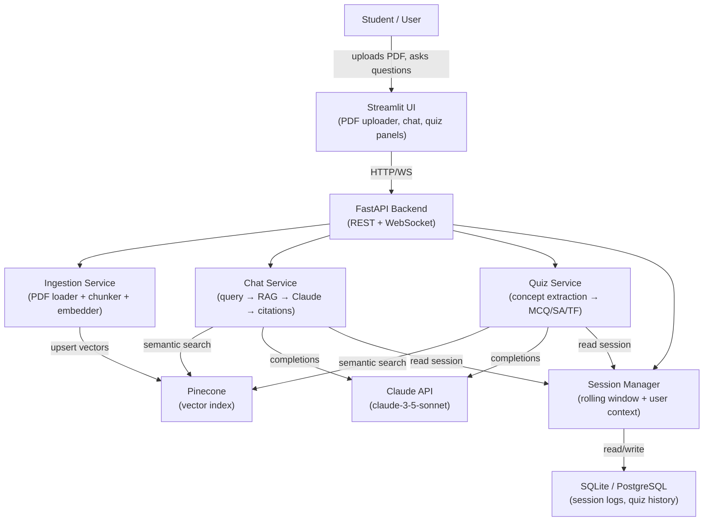
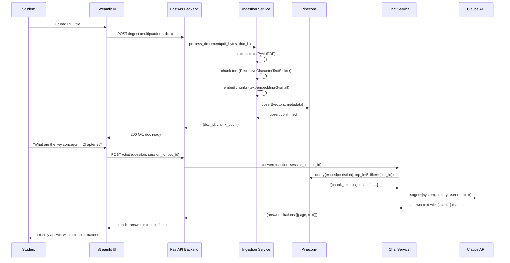

# Week 8: Capstone — AI-Powered Study Companion

> **Theme: Bring It All Together**
> This week synthesizes everything you have learned across the course into a single production-grade application. You will build an AI-powered study companion that ingests course PDFs, answers questions with citations, and generates adaptive quizzes.

---

## Chapter 1: Project Overview and Architecture

### What We Are Building

The **AI-Powered Study Companion** is a full-stack AI application that transforms static course materials into an interactive learning experience. A student uploads a PDF textbook or lecture notes; from that point forward, they can ask questions in natural language, receive cited answers drawn directly from the document, and request quizzes that test their understanding of any section.

This is not a chatbot that hallucinates facts from pre-training. Every answer is grounded in the uploaded document, and every claim is traceable to a specific page and paragraph. That traceability is the core design principle of the entire system.

### System Components

The application is composed of four loosely coupled services, each with a single responsibility:

**Ingestion Service** handles everything that happens before a user types their first question. It accepts a PDF file, splits it into semantically coherent chunks, converts each chunk into a vector embedding, and stores those embeddings in Pinecone alongside the original text and metadata (page number, section heading, document title). This service runs once per document upload and is entirely offline from the user's perspective.

**Chat Service** handles real-time question answering. When a user submits a question, the service embeds the query, retrieves the top-k most relevant chunks from Pinecone, assembles a structured prompt that includes those chunks as context, calls the Claude API, and returns the answer together with inline citations pointing back to the source chunks. The chat service also reads from the session manager to maintain conversational context across multiple turns.

**Quiz Service** operates on demand. The student can ask the system to generate a quiz on any topic covered in the uploaded material. The service retrieves relevant chunks for the requested topic, passes them through a structured prompt chain that extracts key concepts, and then generates five question types: multiple-choice, fill-in-the-blank, short-answer, true/false, and explain-in-your-own-words. Each question is tagged with the chunk it was derived from so the student can review the source material after answering.

**Session Manager** maintains conversational state. It stores a rolling window of recent message turns (typically the last six exchanges) and attaches a user context object that tracks which documents have been uploaded, what topics have been discussed, and the student's self-reported expertise level. This context is injected into every prompt sent to Claude, enabling the system to adjust its explanatory depth over time.

### Full System Architecture



> **Key Insight:** Separating the ingestion service from the chat and quiz services is a deliberate architectural choice. Ingestion is a write-heavy batch operation; chat and quiz are read-heavy real-time operations. Keeping them separate lets you scale, replace, or debug each independently without touching the others.

### Data Flow: PDF Upload to Answer with Citations



### Component Breakdown Summary

| Component | Primary Responsibility | Key Technologies |
|---|---|---|
| Ingestion Service | PDF → vectors in Pinecone | PyMuPDF, LangChain splitters, OpenAI embeddings |
| Chat Service | Question → cited answer | Pinecone retrieval, Claude API |
| Quiz Service | Topic → question bank | Claude structured output |
| Session Manager | Conversation memory | SQLite, rolling buffer |

### Chapter 1 Checkpoint

1. Why is the ingestion service separated from the chat service, and what operational benefit does that separation provide?
2. What four pieces of metadata should each Pinecone vector store, and why is page number important for a study companion specifically?
3. Describe in plain language what the session manager stores and how it changes the behavior of the chat service over multiple turns.

---

## Chapter 2: Implementation Guide

### Step 1 — Document Ingestion Pipeline

The ingestion pipeline is the foundation of the entire system. If the chunks are too large, the retrieved context overwhelms the model and dilutes relevance. If they are too small, individual chunks lack enough context to generate a coherent answer. The sweet spot for educational text is chunks of 400–600 tokens with a 50-token overlap, which preserves sentence boundaries while fitting comfortably within a retrieval prompt.

**Chunking strategy** matters more than most beginners expect. A naive split on newlines will break mid-sentence at every page header or figure caption. Use a recursive character splitter that tries paragraph boundaries first, then sentence boundaries, then word boundaries. This preserves semantic coherence at the cost of slightly variable chunk sizes.

**Metadata enrichment** transforms a plain vector index into a traceable knowledge base. For every chunk, store: the document ID, the page number, the section heading (extracted from the PDF outline if available), and the chunk index within the document. This metadata is what makes citations possible — without it, you can retrieve relevant text but cannot tell the student where it came from.

```python
# ingestion/pipeline.py
"""
End-to-end document ingestion pipeline.
Accepts a PDF file path, produces chunked and indexed vectors in Pinecone.
"""

import hashlib
import fitz  # PyMuPDF
from typing import List, Dict, Any
from dataclasses import dataclass

import openai
from pinecone import Pinecone, ServerlessSpec
from langchain.text_splitter import RecursiveCharacterTextSplitter


@dataclass
class DocumentChunk:
    chunk_id: str
    doc_id: str
    text: str
    page_number: int
    section_heading: str
    chunk_index: int
    token_count: int


def extract_text_with_metadata(pdf_path: str, doc_id: str) -> List[Dict[str, Any]]:
    """
    Extract raw text from every page of a PDF, preserving page numbers
    and attempting to detect section headings from font size changes.
    """
    doc = fitz.open(pdf_path)
    pages = []
    current_heading = "Introduction"

    for page_num, page in enumerate(doc, start=1):
        blocks = page.get_text("dict")["blocks"]
        page_text_parts = []

        for block in blocks:
            if block.get("type") != 0:  # skip non-text blocks (images, etc.)
                continue
            for line in block.get("lines", []):
                for span in line.get("spans", []):
                    # Heuristic: large bold text is likely a section heading
                    if span["size"] > 14 and span["flags"] & 2**4:
                        current_heading = span["text"].strip()
                    else:
                        page_text_parts.append(span["text"])

        pages.append({
            "page_number": page_num,
            "text": " ".join(page_text_parts).strip(),
            "section_heading": current_heading,
            "doc_id": doc_id,
        })

    doc.close()
    return [p for p in pages if p["text"]]  # filter blank pages


def chunk_pages(pages: List[Dict[str, Any]], chunk_size: int = 500, overlap: int = 50) -> List[DocumentChunk]:
    """
    Split page-level text into overlapping chunks while preserving metadata.
    The splitter tries paragraph → sentence → word boundaries in order.
    """
    splitter = RecursiveCharacterTextSplitter(
        chunk_size=chunk_size,
        chunk_overlap=overlap,
        separators=["\n\n", "\n", ". ", " ", ""],
        length_function=len,
    )

    chunks: List[DocumentChunk] = []
    chunk_index = 0

    for page in pages:
        raw_chunks = splitter.split_text(page["text"])
        for raw_chunk in raw_chunks:
            # Stable chunk ID: hash of doc_id + chunk text
            chunk_id = hashlib.sha256(
                f"{page['doc_id']}::{raw_chunk}".encode()
            ).hexdigest()[:16]

            chunks.append(DocumentChunk(
                chunk_id=chunk_id,
                doc_id=page["doc_id"],
                text=raw_chunk,
                page_number=page["page_number"],
                section_heading=page["section_heading"],
                chunk_index=chunk_index,
                token_count=len(raw_chunk.split()),  # rough token estimate
            ))
            chunk_index += 1

    return chunks


def embed_chunks(chunks: List[DocumentChunk], openai_client: openai.OpenAI) -> List[Dict[str, Any]]:
    """
    Embed each chunk using OpenAI's text-embedding-3-small model.
    Batches requests to stay within API rate limits.
    Returns a list of Pinecone upsert-ready records.
    """
    BATCH_SIZE = 100
    records = []

    for i in range(0, len(chunks), BATCH_SIZE):
        batch = chunks[i : i + BATCH_SIZE]
        texts = [c.text for c in batch]

        response = openai_client.embeddings.create(
            model="text-embedding-3-small",
            input=texts,
        )

        for chunk, embedding_obj in zip(batch, response.data):
            records.append({
                "id": chunk.chunk_id,
                "values": embedding_obj.embedding,
                "metadata": {
                    "doc_id": chunk.doc_id,
                    "text": chunk.text,
                    "page_number": chunk.page_number,
                    "section_heading": chunk.section_heading,
                    "chunk_index": chunk.chunk_index,
                },
            })

    return records


def ingest_document(pdf_path: str, doc_id: str, openai_api_key: str, pinecone_api_key: str) -> int:
    """
    Full ingestion pipeline: PDF file → Pinecone index.
    Returns the number of chunks upserted.
    """
    openai_client = openai.OpenAI(api_key=openai_api_key)

    # Step 1: Extract text
    print(f"[ingest] Extracting text from {pdf_path}")
    pages = extract_text_with_metadata(pdf_path, doc_id)
    print(f"[ingest] Extracted {len(pages)} pages")

    # Step 2: Chunk
    chunks = chunk_pages(pages)
    print(f"[ingest] Created {len(chunks)} chunks")

    # Step 3: Embed
    records = embed_chunks(chunks, openai_client)
    print(f"[ingest] Generated {len(records)} embeddings")

    # Step 4: Upsert to Pinecone
    pc = Pinecone(api_key=pinecone_api_key)
    index_name = "study-companion"

    if index_name not in [idx.name for idx in pc.list_indexes()]:
        pc.create_index(
            name=index_name,
            dimension=1536,  # text-embedding-3-small dimension
            metric="cosine",
            spec=ServerlessSpec(cloud="aws", region="us-east-1"),
        )

    index = pc.Index(index_name)
    UPSERT_BATCH = 200
    for i in range(0, len(records), UPSERT_BATCH):
        index.upsert(vectors=records[i : i + UPSERT_BATCH])

    print(f"[ingest] Upserted {len(records)} vectors for doc_id={doc_id}")
    return len(records)
```

> **Key Insight:** Use a deterministic chunk ID based on a hash of the document ID and chunk text. This makes upserts idempotent — if the same PDF is uploaded twice, Pinecone simply overwrites the existing vectors rather than creating duplicates. This is essential for production reliability.

### Step 2 — RAG Chat with Citation Sources

The chat service performs three operations in sequence: embed the query, retrieve relevant chunks, and construct a prompt that instructs Claude to answer the question using only the retrieved context and to cite its sources inline.

**Citation mechanics** require a deliberate prompting strategy. You must instruct the model to use a specific citation format — for example, `[Page 12, Section 3.2]` — and then parse that format out of the response programmatically. If you leave the citation format unspecified, the model will sometimes cite and sometimes not, and the format will be inconsistent.

**Adaptive explanation depth** is the feature that makes this system genuinely educational rather than merely informational. Before constructing the system prompt, the chat service scores the incoming question for complexity using a simple heuristic: questions containing words like "why", "compare", "analyze", or multi-clause structures score as complex; single-concept lookup questions score as simple. The system prompt is then adjusted accordingly.

```python
# chat/service.py
"""
RAG chat service with citation extraction and adaptive explanation depth.
"""

import re
import anthropic
from typing import List, Tuple, Dict, Any
from dataclasses import dataclass

import openai
from pinecone import Pinecone


@dataclass
class Citation:
    chunk_id: str
    page_number: int
    section_heading: str
    excerpt: str  # first 120 chars of the source chunk


@dataclass
class ChatResponse:
    answer: str
    citations: List[Citation]
    explanation_level: str  # "simple" or "technical"


# ── Complexity detection ──────────────────────────────────────────────────────

COMPLEX_INDICATORS = {
    "why", "compare", "contrast", "analyze", "analyse", "explain",
    "difference between", "relationship", "implication", "evaluate",
    "critique", "pros and cons", "trade-off", "mechanism",
}

def detect_complexity(question: str) -> str:
    """
    Classify a question as 'simple' (factual lookup) or 'complex' (analytical).
    Uses keyword heuristics; could be replaced with a classifier for production.
    """
    lower = question.lower()
    if any(indicator in lower for indicator in COMPLEX_INDICATORS):
        return "complex"
    # Multi-clause questions are also complex
    if lower.count(",") >= 2 or " and " in lower and " or " in lower:
        return "complex"
    return "simple"


SYSTEM_SIMPLE = """You are a helpful study assistant. Answer the student's question \
using only the provided context excerpts. Write clearly and simply, as if explaining \
to someone encountering this concept for the first time. After each claim, add an \
inline citation in the format [Page N, Section: <heading>]. If the context does not \
contain enough information to answer, say so explicitly."""

SYSTEM_COMPLEX = """You are an expert academic tutor. Answer the student's question \
with technical precision using only the provided context excerpts. Use domain \
terminology, explain mechanisms, and draw connections between concepts where the \
context supports it. After each claim, add an inline citation in the format \
[Page N, Section: <heading>]. Structure your answer with clear paragraphs. \
If the context is insufficient, state the limitation explicitly."""


# ── Citation parsing ──────────────────────────────────────────────────────────

CITATION_PATTERN = re.compile(r"\[Page (\d+),\s*Section:\s*([^\]]+)\]")

def parse_citations(answer_text: str, retrieved_chunks: List[Dict[str, Any]]) -> List[Citation]:
    """
    Extract citation markers from the model's answer and match them back
    to the retrieved chunks to return full citation objects.
    """
    citations = []
    seen = set()

    for match in CITATION_PATTERN.finditer(answer_text):
        page_num = int(match.group(1))
        section = match.group(2).strip()
        key = (page_num, section)
        if key in seen:
            continue
        seen.add(key)

        # Find the matching chunk in retrieved results
        matching_chunk = next(
            (c for c in retrieved_chunks
             if c["metadata"]["page_number"] == page_num),
            None
        )
        if matching_chunk:
            citations.append(Citation(
                chunk_id=matching_chunk["id"],
                page_number=page_num,
                section_heading=section,
                excerpt=matching_chunk["metadata"]["text"][:120],
            ))

    return citations


# ── Main chat function ────────────────────────────────────────────────────────

def answer_question(
    question: str,
    doc_id: str,
    conversation_history: List[Dict[str, str]],
    openai_api_key: str,
    pinecone_api_key: str,
    anthropic_api_key: str,
    top_k: int = 5,
) -> ChatResponse:
    """
    Full RAG chat pipeline:
      1. Detect question complexity
      2. Embed question
      3. Retrieve top-k chunks from Pinecone
      4. Build prompt with adaptive system message
      5. Call Claude
      6. Parse citations
    """
    complexity = detect_complexity(question)
    system_prompt = SYSTEM_SIMPLE if complexity == "simple" else SYSTEM_COMPLEX

    # Step 1: Embed the question
    oai = openai.OpenAI(api_key=openai_api_key)
    embed_response = oai.embeddings.create(
        model="text-embedding-3-small",
        input=question,
    )
    query_vector = embed_response.data[0].embedding

    # Step 2: Retrieve relevant chunks
    pc = Pinecone(api_key=pinecone_api_key)
    index = pc.Index("study-companion")
    results = index.query(
        vector=query_vector,
        top_k=top_k,
        filter={"doc_id": {"$eq": doc_id}},
        include_metadata=True,
    )
    retrieved_chunks = results["matches"]

    # Step 3: Build context block
    context_lines = []
    for chunk in retrieved_chunks:
        meta = chunk["metadata"]
        context_lines.append(
            f"[Page {meta['page_number']}, Section: {meta['section_heading']}]\n"
            f"{meta['text']}\n"
        )
    context_block = "\n---\n".join(context_lines)

    user_message = (
        f"Context excerpts from the uploaded document:\n\n"
        f"{context_block}\n\n"
        f"Student question: {question}"
    )

    # Step 4: Build message list with rolling conversation history
    messages = conversation_history[-6:]  # keep last 3 exchanges (6 messages)
    messages.append({"role": "user", "content": user_message})

    # Step 5: Call Claude
    client = anthropic.Anthropic(api_key=anthropic_api_key)
    response = client.messages.create(
        model="claude-sonnet-4-5",
        max_tokens=1024,
        system=system_prompt,
        messages=messages,
    )
    answer_text = response.content[0].text

    # Step 6: Parse citations
    citations = parse_citations(answer_text, retrieved_chunks)

    return ChatResponse(
        answer=answer_text,
        citations=citations,
        explanation_level=complexity,
    )
```

> **Key Insight:** The rolling conversation window passed to Claude should be trimmed to the last 6–8 messages (3–4 exchanges), not the entire session. Passing the full history inflates token costs quadratically over a long session and often degrades answer quality because older, off-topic turns pollute the context. For sessions longer than 10 exchanges, consider summarizing older turns instead of discarding them.

### Step 3 — Adaptive Explanation Depth

The adaptive depth system works on a simple but effective principle: the same factual question asked by a first-year student and a PhD candidate deserves different answers. The system infers the appropriate level from a combination of question complexity heuristics and an explicit user profile stored in the session manager.

When the session manager records that a user has asked several complex analytical questions and received technical answers without requesting simplification, it updates their profile to `expertise: advanced`. Subsequent prompts prepend this signal: "This student has demonstrated familiarity with technical terminology; do not over-explain basic concepts."

### Step 4 — Quiz Generation

The quiz service chains two Claude calls. The first call extracts the key concepts from the retrieved chunks and returns them as a structured list. The second call generates questions of each type for those concepts.

```python
# quiz/service.py
"""
Quiz generation service: topic → five question types from retrieved context.
"""

import json
import anthropic
import openai
from pinecone import Pinecone
from typing import List, Dict, Any


CONCEPT_EXTRACTION_PROMPT = """You are an educational content analyst. \
Given the following text excerpts from a course document, identify the 5 most \
important concepts a student must understand. Return a JSON array of objects with \
keys: "concept" (string), "definition" (one sentence), "source_page" (integer).\
\n\nExcerpts:\n{context}"""

QUIZ_GENERATION_PROMPT = """You are an expert educator creating a quiz. \
For the concept below, generate exactly one question of EACH of the following types:
1. MCQ — multiple choice with 4 options (A–D), mark the correct answer
2. fill-blank — a sentence with one key term replaced by ___
3. short-answer — a question requiring a 2–3 sentence response
4. true-false — a statement that is either true or false, with justification
5. explain-in-own-words — ask the student to explain the concept without using \
   the term itself

Concept: {concept}
Definition: {definition}

Return a JSON object with keys: mcq, fill_blank, short_answer, true_false, \
explain_own_words. Each value should be a dict with "question" and "answer" keys. \
MCQ should also have "options" (list of 4 strings) and "correct" (letter A–D)."""


def generate_quiz(
    topic: str,
    doc_id: str,
    openai_api_key: str,
    pinecone_api_key: str,
    anthropic_api_key: str,
) -> Dict[str, Any]:
    """
    Generate a five-type quiz on a given topic from the uploaded document.
    Returns a dict with 'concepts' and 'questions' keys.
    """
    # Step 1: Retrieve relevant chunks for the topic
    oai = openai.OpenAI(api_key=openai_api_key)
    embed_response = oai.embeddings.create(
        model="text-embedding-3-small",
        input=topic,
    )
    query_vector = embed_response.data[0].embedding

    pc = Pinecone(api_key=pinecone_api_key)
    index = pc.Index("study-companion")
    results = index.query(
        vector=query_vector,
        top_k=8,
        filter={"doc_id": {"$eq": doc_id}},
        include_metadata=True,
    )

    context_block = "\n\n".join(
        f"[Page {m['metadata']['page_number']}] {m['metadata']['text']}"
        for m in results["matches"]
    )

    client = anthropic.Anthropic(api_key=anthropic_api_key)

    # Step 2: Extract key concepts
    concept_response = client.messages.create(
        model="claude-sonnet-4-5",
        max_tokens=512,
        messages=[{
            "role": "user",
            "content": CONCEPT_EXTRACTION_PROMPT.format(context=context_block),
        }],
    )
    concepts_raw = concept_response.content[0].text
    # Strip markdown code fences if present
    concepts_raw = concepts_raw.strip().removeprefix("```json").removesuffix("```").strip()
    concepts = json.loads(concepts_raw)

    # Step 3: Generate questions for each concept
    all_questions = []
    for concept_obj in concepts[:3]:  # limit to 3 concepts for demo
        quiz_response = client.messages.create(
            model="claude-sonnet-4-5",
            max_tokens=800,
            messages=[{
                "role": "user",
                "content": QUIZ_GENERATION_PROMPT.format(
                    concept=concept_obj["concept"],
                    definition=concept_obj["definition"],
                ),
            }],
        )
        quiz_raw = quiz_response.content[0].text
        quiz_raw = quiz_raw.strip().removeprefix("```json").removesuffix("```").strip()
        question_set = json.loads(quiz_raw)
        question_set["concept"] = concept_obj["concept"]
        question_set["source_page"] = concept_obj.get("source_page")
        all_questions.append(question_set)

    return {
        "topic": topic,
        "doc_id": doc_id,
        "concepts": concepts,
        "questions": all_questions,
    }
```

> **Key Insight:** Chaining two LLM calls — one to extract concepts, one to generate questions — produces dramatically better quizzes than a single call asking for both simultaneously. The first call forces the model to think about what is actually important in the material before it starts writing questions. This mirrors how a skilled human teacher would approach quiz design.

### Chapter 2 Checkpoint

1. What happens to answer quality if you use chunks that are too large (1500+ tokens)? What about too small (under 100 tokens)?
2. Describe the two-step quiz generation chain. Why does separating concept extraction from question generation improve quiz quality?
3. The chat service uses a "rolling window" of 6 messages from conversation history. What problem does this solve, and what information might be lost by trimming older turns?

---

## Chapter 3: Evaluation and Stretch Goals

### Why Evaluation Is Non-Negotiable

You cannot improve what you cannot measure. The most common failure mode of AI application projects is deploying a system that "seems to work" in manual testing and discovering weeks later that it fails systematically on certain document types, question styles, or topic areas. A formal evaluation harness is not optional for a production-grade study companion — it is part of the definition of "done."

The **eval harness** for the Study Companion measures three dimensions: answer faithfulness, citation accuracy, and quiz question quality. Each dimension requires a different measurement strategy.

### Answer Faithfulness

**Answer faithfulness** measures whether the model's answer is actually supported by the retrieved context. An answer can be factually correct (based on the model's pre-training knowledge) but unfaithful to the document — and for a study companion, the document is the ground truth, not the model's training data.

The standard faithfulness metric uses an LLM judge: for each Q&A pair, you ask a separate Claude call to evaluate whether every claim in the answer is supported by the provided context chunks, returning a score from 0 to 1. The golden Q&A set is created by having a subject-matter expert write questions and verified answers for a specific uploaded document before running the eval.

```python
# eval/harness.py
"""
Evaluation harness for the Study Companion.
Measures answer faithfulness, citation accuracy, and quiz question quality.
"""

import json
import statistics
from typing import List, Dict, Any
from dataclasses import dataclass, asdict

import anthropic

from chat.service import answer_question, ChatResponse
from quiz.service import generate_quiz


@dataclass
class EvalResult:
    question: str
    expected_answer: str
    actual_answer: str
    faithfulness_score: float   # 0.0–1.0
    citation_present: bool      # did the response include at least one citation?
    citation_page_correct: bool # did at least one citation point to the right page?
    notes: str


FAITHFULNESS_JUDGE_PROMPT = """You are an impartial evaluator assessing whether an AI \
answer is faithful to its source context. Score the answer on a scale from 0.0 to 1.0:
- 1.0: Every claim in the answer is directly supported by the context.
- 0.5: Most claims are supported, but one or two introduce information not in the context.
- 0.0: The answer contradicts or substantially departs from the context.

Context:
{context}

Answer to evaluate:
{answer}

Return ONLY a JSON object: {{"score": <float>, "reason": "<one sentence>"}}"""


def judge_faithfulness(
    answer: str,
    context_chunks: List[str],
    client: anthropic.Anthropic,
) -> Dict[str, Any]:
    context_text = "\n\n".join(context_chunks)
    response = client.messages.create(
        model="claude-haiku-4-5",  # cheap model for judging
        max_tokens=128,
        messages=[{
            "role": "user",
            "content": FAITHFULNESS_JUDGE_PROMPT.format(
                context=context_text,
                answer=answer,
            ),
        }],
    )
    raw = response.content[0].text.strip()
    return json.loads(raw)


def run_eval(
    golden_set: List[Dict[str, Any]],  # [{question, answer, expected_page}, ...]
    doc_id: str,
    openai_api_key: str,
    pinecone_api_key: str,
    anthropic_api_key: str,
) -> Dict[str, Any]:
    """
    Run the full evaluation harness over a golden Q&A set.
    Returns aggregate metrics and per-question results.
    """
    client = anthropic.Anthropic(api_key=anthropic_api_key)
    results: List[EvalResult] = []

    for item in golden_set:
        response: ChatResponse = answer_question(
            question=item["question"],
            doc_id=doc_id,
            conversation_history=[],
            openai_api_key=openai_api_key,
            pinecone_api_key=pinecone_api_key,
            anthropic_api_key=anthropic_api_key,
        )

        # Faithfulness: judge against retrieved context
        context_chunks = [c.excerpt for c in response.citations]
        if context_chunks:
            judgment = judge_faithfulness(response.answer, context_chunks, client)
            faithfulness = judgment.get("score", 0.0)
            notes = judgment.get("reason", "")
        else:
            faithfulness = 0.0
            notes = "No citations returned; cannot assess faithfulness."

        # Citation presence and page accuracy
        citation_present = len(response.citations) > 0
        expected_page = item.get("expected_page")
        citation_page_correct = any(
            c.page_number == expected_page for c in response.citations
        ) if expected_page else False

        results.append(EvalResult(
            question=item["question"],
            expected_answer=item["answer"],
            actual_answer=response.answer,
            faithfulness_score=faithfulness,
            citation_present=citation_present,
            citation_page_correct=citation_page_correct,
            notes=notes,
        ))

    # Aggregate metrics
    avg_faithfulness = statistics.mean(r.faithfulness_score for r in results)
    citation_rate = sum(1 for r in results if r.citation_present) / len(results)
    citation_accuracy = sum(1 for r in results if r.citation_page_correct) / len(results)

    return {
        "summary": {
            "avg_faithfulness": round(avg_faithfulness, 3),
            "citation_rate": round(citation_rate, 3),
            "citation_page_accuracy": round(citation_accuracy, 3),
            "n_questions": len(results),
        },
        "results": [asdict(r) for r in results],
    }


# ── Quiz quality evaluation ───────────────────────────────────────────────────

QUIZ_QUALITY_PROMPT = """Rate the following quiz question on three criteria, each 1–5:
- Clarity: Is the question unambiguous?
- Pedagogical value: Does answering it require genuine understanding of the concept?
- Answer validity: Is the provided answer correct and complete?

Concept: {concept}
Question type: {qtype}
Question: {question}
Answer: {answer}

Return ONLY JSON: {{"clarity": N, "pedagogical_value": N, "answer_validity": N}}"""


def evaluate_quiz_quality(
    quiz_output: Dict[str, Any],
    client: anthropic.Anthropic,
) -> Dict[str, Any]:
    """
    Evaluate the quality of generated quiz questions using an LLM judge.
    """
    scores = []
    for question_set in quiz_output["questions"]:
        concept = question_set["concept"]
        for qtype in ["mcq", "fill_blank", "short_answer", "true_false", "explain_own_words"]:
            q_data = question_set.get(qtype, {})
            if not q_data:
                continue
            response = client.messages.create(
                model="claude-haiku-4-5",
                max_tokens=100,
                messages=[{
                    "role": "user",
                    "content": QUIZ_QUALITY_PROMPT.format(
                        concept=concept,
                        qtype=qtype,
                        question=q_data.get("question", ""),
                        answer=q_data.get("answer", ""),
                    ),
                }],
            )
            raw = response.content[0].text.strip()
            score_dict = json.loads(raw)
            score_dict["concept"] = concept
            score_dict["qtype"] = qtype
            scores.append(score_dict)

    avg_clarity = statistics.mean(s["clarity"] for s in scores)
    avg_pedagogy = statistics.mean(s["pedagogical_value"] for s in scores)
    avg_validity = statistics.mean(s["answer_validity"] for s in scores)

    return {
        "avg_clarity": round(avg_clarity, 2),
        "avg_pedagogical_value": round(avg_pedagogy, 2),
        "avg_answer_validity": round(avg_validity, 2),
        "per_question_scores": scores,
    }
```

> **Key Insight:** Use your cheapest, fastest model (claude-haiku) for LLM-as-judge evaluations, not your best model. Judgment calls require understanding, not generation quality, and running claude-haiku at 1/20th the cost of claude-sonnet lets you evaluate 10,000 Q&A pairs affordably. Reserve the expensive model for the actual user-facing responses.

### Stretch Goal 1 — Streamlit UI

The Streamlit UI requires three panels: a sidebar for PDF upload and document management, a main chat area with message history and citation footnotes, and a quiz panel that displays generated questions and accepts student answers.

```bash
pip install streamlit anthropic openai pinecone-client pymupdf langchain
streamlit run app/main.py
```

The PDF uploader calls the `/ingest` FastAPI endpoint on upload and displays a progress bar during chunking and embedding. The chat panel renders citations as clickable expanders that show the source excerpt when expanded.

### Stretch Goal 2 — Fine-tuning for Pedagogical Tone

Fine-tuning a small model (such as a distilled 3B-parameter model) on educational Q&A pairs drawn from your own application logs can substantially improve the pedagogical tone of explanations — making them clearer, better structured, and more appropriately scaffolded for students at different levels. The key is constructing a training set from high-quality historical interactions where the student explicitly confirmed the answer was helpful.

### Stretch Goal 3 — PostgreSQL Session Persistence

Replace the in-memory session manager with a PostgreSQL-backed store. Each session stores: session ID, user ID, document IDs in scope, full message history (JSONB column), user expertise level, and timestamps. This enables the study companion to resume sessions across browser restarts and build a long-term model of each student's learning progress.

```bash
# Create the sessions table
psql -U postgres -c "
CREATE TABLE sessions (
    session_id UUID PRIMARY KEY DEFAULT gen_random_uuid(),
    user_id TEXT NOT NULL,
    doc_ids TEXT[] NOT NULL DEFAULT '{}',
    messages JSONB NOT NULL DEFAULT '[]',
    expertise_level TEXT NOT NULL DEFAULT 'beginner',
    created_at TIMESTAMPTZ DEFAULT NOW(),
    updated_at TIMESTAMPTZ DEFAULT NOW()
);"
```

> **Key Insight:** When evaluating citation accuracy, distinguish between "citation present" (did the model cite anything?) and "citation page-accurate" (did the cited page actually contain the claim?). Systems can achieve 100% citation presence while citing the wrong pages — a failure mode that looks good in shallow metrics but actively misleads students.

### Chapter 3 Checkpoint

1. What is "answer faithfulness" and why is it a better metric for a study companion than general factual accuracy?
2. Explain the LLM-as-judge pattern. What model should you use for the judge, and why?
3. Why is PostgreSQL session persistence listed as a stretch goal rather than a core requirement? Under what circumstances would it become a core requirement?

---

## Lab Walkthrough

### Capstone Build Sprint: Complete Study Companion

This lab takes approximately 4–5 hours to complete end-to-end. You will build the full system, run the eval harness, and produce an architecture diagram documenting your implementation.

#### Prerequisites

```bash
pip install anthropic openai pinecone-client pymupdf langchain \
            fastapi uvicorn streamlit psycopg2-binary python-multipart
```

You will need API keys for Anthropic, OpenAI, and Pinecone. Store them in a `.env` file:

```bash
ANTHROPIC_API_KEY=sk-ant-...
OPENAI_API_KEY=sk-...
PINECONE_API_KEY=...
```

#### Step 1 — Set Up the Project Structure

```bash
mkdir study-companion && cd study-companion
mkdir -p ingestion chat quiz session eval app
touch ingestion/__init__.py ingestion/pipeline.py
touch chat/__init__.py chat/service.py
touch quiz/__init__.py quiz/service.py
touch session/__init__.py session/manager.py
touch eval/__init__.py eval/harness.py
touch app/main.py app/api.py
```

#### Step 2 — Implement the Ingestion Pipeline

Copy the `ingestion/pipeline.py` code from Chapter 2, Step 1. Test it with a sample PDF:

```bash
python -c "
from ingestion.pipeline import ingest_document
import os, dotenv
dotenv.load_dotenv()
count = ingest_document(
    'sample_lecture.pdf',
    'lecture_001',
    os.environ['OPENAI_API_KEY'],
    os.environ['PINECONE_API_KEY'],
)
print(f'Ingested {count} chunks')
"
```

Verify in the Pinecone console that your index now contains vectors with the expected metadata fields.

#### Step 3 — Implement the Chat Service

Copy `chat/service.py` from Chapter 2, Step 2. Test with a direct call:

```python
# test_chat.py
import os, dotenv
dotenv.load_dotenv()

from chat.service import answer_question

response = answer_question(
    question="What are the main topics covered in this document?",
    doc_id="lecture_001",
    conversation_history=[],
    openai_api_key=os.environ["OPENAI_API_KEY"],
    pinecone_api_key=os.environ["PINECONE_API_KEY"],
    anthropic_api_key=os.environ["ANTHROPIC_API_KEY"],
)

print(f"Explanation level: {response.explanation_level}")
print(f"\nAnswer:\n{response.answer}")
print(f"\nCitations ({len(response.citations)}):")
for c in response.citations:
    print(f"  - Page {c.page_number}, {c.section_heading}: {c.excerpt[:80]}...")
```

#### Step 4 — Implement the Quiz Service

Copy `quiz/service.py` from Chapter 2, Step 4. Test quiz generation on a specific topic from your uploaded document:

```python
# test_quiz.py
import os, json, dotenv
dotenv.load_dotenv()

from quiz.service import generate_quiz

quiz = generate_quiz(
    topic="neural network backpropagation",
    doc_id="lecture_001",
    openai_api_key=os.environ["OPENAI_API_KEY"],
    pinecone_api_key=os.environ["PINECONE_API_KEY"],
    anthropic_api_key=os.environ["ANTHROPIC_API_KEY"],
)

print(json.dumps(quiz, indent=2))
```

Verify that the output contains all five question types for each concept.

#### Step 5 — Build the Session Manager

```python
# session/manager.py
"""
In-memory session manager with SQLite persistence.
Stores rolling conversation history and user expertise level.
"""

import json
import sqlite3
from typing import List, Dict, Optional
from dataclasses import dataclass, asdict


@dataclass
class UserSession:
    session_id: str
    user_id: str
    doc_ids: List[str]
    messages: List[Dict[str, str]]
    expertise_level: str  # "beginner", "intermediate", "advanced"


class SessionManager:
    def __init__(self, db_path: str = "sessions.db"):
        self.db_path = db_path
        self._init_db()

    def _init_db(self):
        conn = sqlite3.connect(self.db_path)
        conn.execute("""
            CREATE TABLE IF NOT EXISTS sessions (
                session_id TEXT PRIMARY KEY,
                user_id TEXT NOT NULL,
                doc_ids TEXT NOT NULL DEFAULT '[]',
                messages TEXT NOT NULL DEFAULT '[]',
                expertise_level TEXT NOT NULL DEFAULT 'beginner'
            )
        """)
        conn.commit()
        conn.close()

    def get_or_create(self, session_id: str, user_id: str) -> UserSession:
        conn = sqlite3.connect(self.db_path)
        row = conn.execute(
            "SELECT * FROM sessions WHERE session_id = ?", (session_id,)
        ).fetchone()

        if row:
            session = UserSession(
                session_id=row[0],
                user_id=row[1],
                doc_ids=json.loads(row[2]),
                messages=json.loads(row[3]),
                expertise_level=row[4],
            )
        else:
            session = UserSession(
                session_id=session_id,
                user_id=user_id,
                doc_ids=[],
                messages=[],
                expertise_level="beginner",
            )
            conn.execute(
                "INSERT INTO sessions VALUES (?, ?, ?, ?, ?)",
                (session_id, user_id, "[]", "[]", "beginner"),
            )
            conn.commit()

        conn.close()
        return session

    def append_message(self, session_id: str, role: str, content: str):
        conn = sqlite3.connect(self.db_path)
        row = conn.execute(
            "SELECT messages FROM sessions WHERE session_id = ?",
            (session_id,)
        ).fetchone()
        messages = json.loads(row[0]) if row else []
        messages.append({"role": role, "content": content})
        # Keep only last 20 messages in storage
        messages = messages[-20:]
        conn.execute(
            "UPDATE sessions SET messages = ? WHERE session_id = ?",
            (json.dumps(messages), session_id),
        )
        conn.commit()
        conn.close()

    def get_recent_messages(self, session_id: str, n: int = 6) -> List[Dict[str, str]]:
        conn = sqlite3.connect(self.db_path)
        row = conn.execute(
            "SELECT messages FROM sessions WHERE session_id = ?",
            (session_id,)
        ).fetchone()
        conn.close()
        messages = json.loads(row[0]) if row else []
        return messages[-n:]
```

#### Step 6 — Wire Up the FastAPI Backend

```python
# app/api.py
"""
FastAPI backend: exposes /ingest, /chat, and /quiz endpoints.
"""

import os
import uuid
import tempfile
from fastapi import FastAPI, UploadFile, File, HTTPException
from pydantic import BaseModel
from typing import Optional

from ingestion.pipeline import ingest_document
from chat.service import answer_question
from quiz.service import generate_quiz
from session.manager import SessionManager

app = FastAPI(title="Study Companion API")
session_mgr = SessionManager()


class ChatRequest(BaseModel):
    question: str
    doc_id: str
    session_id: Optional[str] = None
    user_id: str = "default_user"


class QuizRequest(BaseModel):
    topic: str
    doc_id: str


@app.post("/ingest")
async def ingest(file: UploadFile = File(...)):
    doc_id = str(uuid.uuid4())[:8]
    with tempfile.NamedTemporaryFile(suffix=".pdf", delete=False) as tmp:
        tmp.write(await file.read())
        tmp_path = tmp.name
    chunk_count = ingest_document(
        tmp_path, doc_id,
        os.environ["OPENAI_API_KEY"],
        os.environ["PINECONE_API_KEY"],
    )
    return {"doc_id": doc_id, "chunk_count": chunk_count, "filename": file.filename}


@app.post("/chat")
async def chat(req: ChatRequest):
    session_id = req.session_id or str(uuid.uuid4())
    session = session_mgr.get_or_create(session_id, req.user_id)
    history = session_mgr.get_recent_messages(session_id)

    response = answer_question(
        question=req.question,
        doc_id=req.doc_id,
        conversation_history=history,
        openai_api_key=os.environ["OPENAI_API_KEY"],
        pinecone_api_key=os.environ["PINECONE_API_KEY"],
        anthropic_api_key=os.environ["ANTHROPIC_API_KEY"],
    )

    session_mgr.append_message(session_id, "user", req.question)
    session_mgr.append_message(session_id, "assistant", response.answer)

    return {
        "session_id": session_id,
        "answer": response.answer,
        "citations": [
            {"page": c.page_number, "section": c.section_heading, "excerpt": c.excerpt}
            for c in response.citations
        ],
        "explanation_level": response.explanation_level,
    }


@app.post("/quiz")
async def quiz(req: QuizRequest):
    result = generate_quiz(
        topic=req.topic,
        doc_id=req.doc_id,
        openai_api_key=os.environ["OPENAI_API_KEY"],
        pinecone_api_key=os.environ["PINECONE_API_KEY"],
        anthropic_api_key=os.environ["ANTHROPIC_API_KEY"],
    )
    return result
```

```bash
uvicorn app.api:app --reload --port 8000
```

#### Step 7 — Build the Golden Q&A Set and Run the Eval Harness

Create a file `eval/golden_set.json` with at least 10 question-answer pairs based on your uploaded document. Each entry should include the expected page number.

```json
[
  {
    "question": "What is the definition of backpropagation as given in the document?",
    "answer": "Backpropagation is the algorithm used to compute gradients of the loss function with respect to the weights by applying the chain rule of calculus layer by layer in reverse order.",
    "expected_page": 14
  }
]
```

Then run the harness:

```python
# run_eval.py
import os, json, dotenv
dotenv.load_dotenv()
from eval.harness import run_eval

with open("eval/golden_set.json") as f:
    golden_set = json.load(f)

results = run_eval(
    golden_set=golden_set,
    doc_id="lecture_001",
    openai_api_key=os.environ["OPENAI_API_KEY"],
    pinecone_api_key=os.environ["PINECONE_API_KEY"],
    anthropic_api_key=os.environ["ANTHROPIC_API_KEY"],
)

print("=== Evaluation Summary ===")
print(json.dumps(results["summary"], indent=2))
```

Target scores for a well-functioning system: faithfulness >= 0.80, citation rate >= 0.90, citation page accuracy >= 0.70.

#### Step 8 — (Stretch) Add the Streamlit UI

```bash
streamlit run app/main.py
```

The Streamlit app should call your FastAPI backend via `httpx`. Upload a PDF, ask a question in the chat panel, and verify that citations appear as expandable footnotes below the answer.

---

## Further Reading

1. **"Retrieval-Augmented Generation for Knowledge-Intensive NLP Tasks"** — Lewis et al., 2020 (NeurIPS). The original RAG paper; foundational reading for understanding why retrieval-augmented approaches outperform pure generative models on knowledge-grounded tasks.

2. **"Building LLM-Powered Applications"** — Valentina Alto, 2023 (Packt Publishing). Practical guide covering LangChain, vector databases, and production patterns for LLM applications, with educational use cases in several chapters.

3. **"Evaluating Large Language Models: A Comprehensive Survey"** — Chang et al., 2023 (arXiv:2307.03109). Comprehensive survey of LLM evaluation methodologies, including faithfulness metrics and LLM-as-judge patterns used in this week's eval harness.

4. **"Chunking Strategies for LLM Applications"** — Greg Kamradt, 2023 (available on GitHub: FullStackRetrieval-Com/RetrievalTutorials). Empirical study of how chunk size and overlap affect retrieval quality across document types; directly applicable to the ingestion pipeline.

5. **"The Art of Prompt Engineering for Educational AI"** — White et al., 2023 (AAAI Workshop on AI in Education). Covers prompt strategies for adaptive explanation depth, scaffolded questioning, and pedagogically grounded AI interactions — the theoretical foundation for this week's adaptive system prompt design.

---

## Week Summary

- **End-to-end system integration** is the primary engineering challenge of capstone week. The individual components — ingestion, retrieval, generation, and quiz — are each straightforward; making them work reliably together as a coherent system requires careful interface design, error handling, and shared configuration management.

- **Metadata is the backbone of citations.** Every design decision in the ingestion pipeline should be evaluated against the question: "Does this choice make citations more accurate?" Page numbers, section headings, and stable chunk IDs are not nice-to-haves — they are what distinguishes a trustworthy study tool from a hallucination machine.

- **Adaptive prompting improves educational outcomes** more than model size. Adjusting the system prompt based on detected question complexity — using simple, accessible language for factual lookups and technical precision for analytical questions — produces answers that are more appropriate for the learner's current cognitive state, regardless of which underlying model you use.

- **LLM-as-judge is the practical evaluation standard** for RAG applications. Human evaluation does not scale; static metrics (BLEU, ROUGE) are inappropriate for open-ended answers. An LLM judge using a fast, cheap model (Haiku) provides scalable, consistent quality measurement with reasonable alignment to human judgment when the judging prompt is carefully designed.

- **The eval harness should be written before the system is complete,** not after. Defining what "good" looks like (the golden Q&A set and the three metrics) forces you to be precise about the system's goals early in development, when architectural decisions are still cheap to change. This is the AI engineering equivalent of test-driven development.
