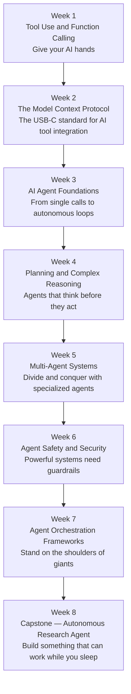

# Course 2: Building AI Systems

## Description

From single-model apps to multi-agent systems. This course covers the full stack of modern AI engineering: giving models tools to act in the world, connecting them via the Model Context Protocol, building autonomous agent loops, implementing planning and complex reasoning, composing specialized agents into multi-agent systems, enforcing safety and security guardrails, and leveraging production-grade orchestration frameworks. The course culminates in an end-to-end autonomous research agent you build from scratch.

## Prerequisites

Course 1 (Foundations of AI Engineering) or equivalent experience with:

- LLM APIs (prompt construction, completions, streaming)
- Retrieval-Augmented Generation (RAG)
- Embeddings and vector search

---

## Learning Progression

---

## Table of Contents

| Week | Topic |
|------|-------|
| [Week 1: Tool Use and Function Calling](week1-tool-use.md) | Give your AI hands |
| [Week 2: The Model Context Protocol (MCP)](week2-mcp.md) | The USB-C standard for AI tool integration |
| [Week 3: AI Agent Foundations](week3-agent-foundations.md) | From single calls to autonomous loops |
| [Week 4: Planning and Complex Reasoning](week4-planning.md) | Agents that think before they act |
| [Week 5: Multi-Agent Systems](week5-multi-agent.md) | Divide and conquer with specialized agents |
| [Week 6: Agent Safety and Security](week6-agent-safety.md) | Powerful systems need guardrails |
| [Week 7: Agent Orchestration Frameworks](week7-frameworks.md) | Stand on the shoulders of giants |
| [Week 8: Capstone — Autonomous Research Agent](week8-capstone.md) | Build something that can work while you sleep |

---

## What You'll Build

- **Tool-Enabled Assistant** (Week 1): An LLM-powered assistant that calls real APIs — weather, search, calculators — via function calling.
- **MCP Server** (Week 2): A custom MCP server exposing your own tools, consumable by any MCP-compatible client.
- **ReAct Agent** (Week 3): A Reason-and-Act agent that autonomously loops over observation, thought, and action until a goal is reached.
- **Planning Agent** (Week 4): An agent that decomposes complex goals into sub-tasks, reasons about dependencies, and recovers from failures.
- **Multi-Agent Pipeline** (Week 5): A system of specialized sub-agents (researcher, writer, critic) coordinated by an orchestrator agent.
- **Hardened Agent** (Week 6): A safety-wrapped agent with input validation, output filtering, sandboxed tool execution, and rate limiting.
- **Framework-Based Agent** (Week 7): A production-ready agent rebuilt using an orchestration framework (LangGraph, AutoGen, or CrewAI).
- **Autonomous Research Agent** (Week 8, Capstone): A full end-to-end autonomous agent that accepts a research brief, searches the web, synthesizes findings, and delivers a structured report — without human intervention.

---

## Tools and Technologies

| Category | Technologies |
|----------|-------------|
| LLM APIs | Mistral API (primary), OpenAI GPT and Anthropic Claude (comparison examples) |
| Function Calling | Mistral function calling (primary), OpenAI tools spec and Anthropic tool use |
| Agent Protocol | Model Context Protocol (MCP) |
| Agent Patterns | ReAct, Plan-and-Execute, Reflection |
| Orchestration Frameworks | LangGraph, AutoGen, CrewAI |
| Tool Sandboxing | Docker, subprocess isolation |
| Safety and Guardrails | Input/output validation, policy enforcement |
| Languages and Runtimes | Python 3.11+, Node.js (MCP servers) |
| Observability | LangSmith, Weights and Biases Weave |

---

## Assessment Overview

| Week | Assessment | Weight |
|------|-----------|--------|
| Week 1 | Tool-enabled assistant with 3+ real API integrations | 8% |
| Week 2 | Working MCP server with client integration test | 10% |
| Week 3 | ReAct agent solving a multi-step benchmark task | 10% |
| Week 4 | Planning agent with task decomposition and recovery | 12% |
| Week 5 | Multi-agent pipeline producing a collaborative output | 12% |
| Week 6 | Security audit + hardened agent passing a red-team checklist | 10% |
| Week 7 | Framework-based agent with observability and logging | 8% |
| Week 8 | Capstone: Autonomous Research Agent (demo + write-up) | 30% |

Assessments are graded on correctness, code quality, safety considerations, and a short written reflection on design decisions.
