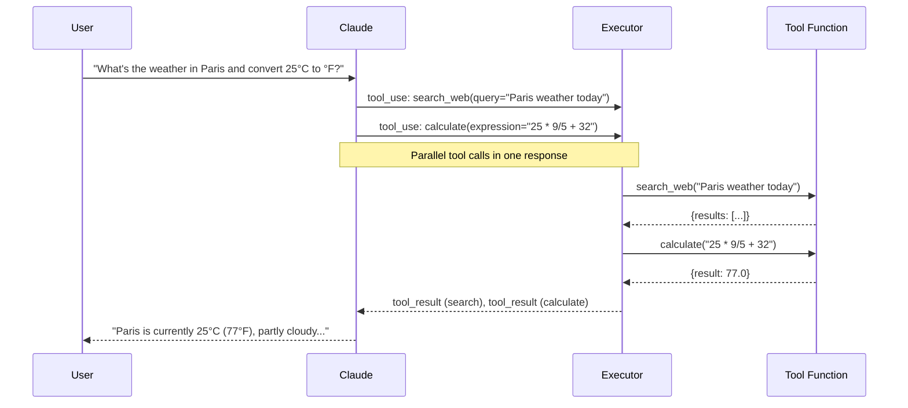
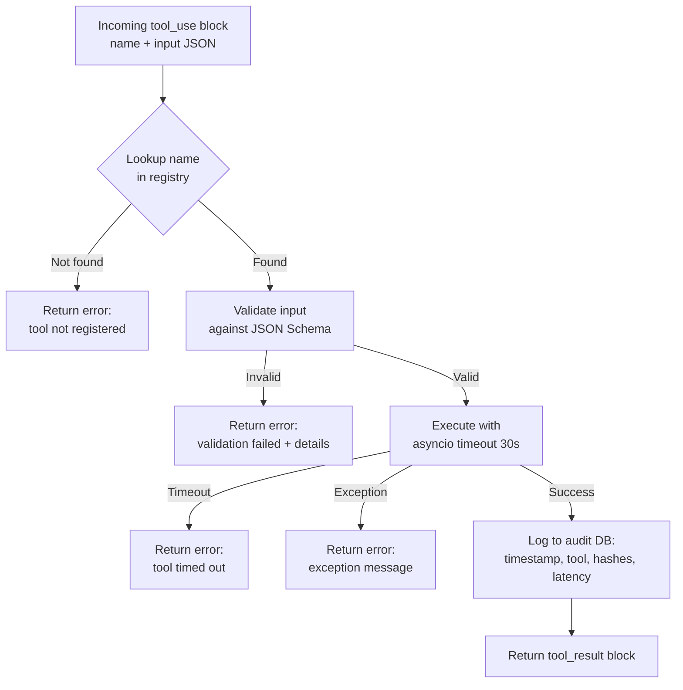

# Week 1: Tool Use and Function Calling

**Theme: "Give your AI hands"**

Before this week, your AI model was a brain in a jar — brilliant at reasoning and language, but completely cut off from the world. It could not look up today's weather, read a file, run code, or call an API. It only processed the text you handed it, and returned text in reply.

Tool use changes everything. By the end of this week you will understand how function calling works at the protocol level, how to design schemas that guide the model reliably, how to build a production-grade tool executor, and how to wire up real tools — web search, file I/O, and sandboxed code execution — into a working personal assistant.

---

## 1.1 How Function Calling Works

### From Text Output to Structured Action

Early language models had exactly one output modality: text. You asked a question, the model wrote an answer. If you needed the model to "use a tool," you had to parse its prose output yourself — fragile, unpredictable, and impossible to scale.

**Function calling** (also called **tool use**) formalizes this interaction. Instead of asking the model to describe what it would do, you give it a catalog of tools and let it issue structured requests to use them. The execution happens in your code, not inside the model. The model never runs arbitrary code — it only declares intent.

The Anthropic API expresses this through two new content block types:

- `tool_use` — the model's request to invoke a tool, containing a name and a JSON payload of arguments.
- `tool_result` — your code's response, containing the return value (or an error message).

### The Anthropic Tool Schema

Every tool you register with the API must have a schema that tells the model what the tool is and how to call it:

```python
{
    "name": "search_web",          # snake_case verb_noun
    "description": "Search the web for current information. Returns the top 5 results "
                   "as a list of {title, url, snippet} objects. Does NOT browse URLs "
                   "or retrieve full page content.",
    "input_schema": {              # standard JSON Schema
        "type": "object",
        "properties": {
            "query": {
                "type": "string",
                "description": "The search query. Be specific. Example: 'Python asyncio timeout 2024'"
            }
        },
        "required": ["query"]
    }
}
```

Three fields are mandatory: `name`, `description`, and `input_schema`. The `input_schema` is a standard **JSON Schema** object that validates the model's arguments before your code ever sees them.

### The Tool Call Loop

Understanding the full round-trip is essential. A single user turn can involve multiple API calls:



Notice the critical detail: Claude issued **two tool calls in a single response**. This is **parallel tool use** — when the model determines that two or more tools are independent (neither depends on the other's output), it batches them into one turn. Your executor runs them concurrently, saving a full round-trip.

The loop terminates when Claude returns a response with `stop_reason: "end_turn"` rather than `stop_reason: "tool_use"`. Your orchestration code must check this condition after every API call.

### Minimal Orchestration Loop in Python

```python
import anthropic

client = anthropic.Anthropic()

def run_agent(user_message: str, tools: list, executor) -> str:
    """
    Run the tool-use loop until Claude stops requesting tools.
    Returns the final text response.
    """
    messages = [{"role": "user", "content": user_message}]

    while True:
        response = client.messages.create(
            model="claude-sonnet-4-5",
            max_tokens=4096,
            tools=tools,
            messages=messages,
        )

        # Append Claude's response to the conversation history
        messages.append({"role": "assistant", "content": response.content})

        # If Claude is done, return the final text
        if response.stop_reason == "end_turn":
            # Extract text from the final response
            for block in response.content:
                if hasattr(block, "text"):
                    return block.text
            return ""

        # Otherwise, Claude wants to use tools — execute them all
        tool_results = []
        for block in response.content:
            if block.type == "tool_use":
                result = executor.execute(block.name, block.input)
                tool_results.append({
                    "type": "tool_result",
                    "tool_use_id": block.id,  # must match the request id
                    "content": str(result),
                })

        # Feed results back as a user turn
        messages.append({"role": "user", "content": tool_results})
```

> **Key Insight: The model never executes anything.** Claude emits a `tool_use` block as a declaration of intent. Your Python code decides whether, how, and with what permissions to actually execute that request. This separation is what makes tool use safe and auditable.

> **Key Insight: Tool results are injected as a `user` message.** The conversation alternates user/assistant. After executing tools, you append a `user` message containing all `tool_result` blocks. This is why `tool_use_id` must match — it threads each result back to the exact request that generated it.

> **Key Insight: Parallel tool calls reduce latency.** If a user asks three independent questions that each require a tool, Claude can batch all three into one response. Your executor should run them concurrently with `asyncio.gather` to avoid multiplying latency.

### Chapter Checkpoint

1. What is the `stop_reason` value that signals Claude wants to use a tool, and what value signals it is done?
2. A `tool_result` block must include which field to link it back to the correct `tool_use` request?
3. Under what conditions will Claude issue parallel tool calls, and how should your executor handle them?

---

## 1.2 Designing Good Tool Schemas

### The Description is the Model's Only Guide

When Claude decides whether to use a tool and how to fill its parameters, it reads exactly one source of truth: the `description` field you provided. There is no runtime introspection, no docstring parsing, no type inference. If your description is vague, the model will guess — and guesses compound into failures.

A good description answers four questions:

1. **What does this tool do?** (the happy path)
2. **What does it NOT do?** (common confusions)
3. **When should the model prefer this tool over alternatives?**
4. **What format does the input need to be in?**

Compare these two descriptions for a file-reading tool:

```
# Bad — too vague
"description": "Read a file."

# Good — guides the model precisely
"description": "Read the text content of a file on the local filesystem. "
               "Returns the file content as a string. "
               "Does NOT execute code in the file — use run_code for that. "
               "Fails if the file does not exist or is outside the allowed directory. "
               "For binary files (images, PDFs) use read_binary_file instead. "
               "Max file size: 50,000 bytes."
```

### Parameter Design Principles

**Use enums for constrained values.** If a parameter can only take a fixed set of values, declare them explicitly. This prevents the model from hallucinating invalid values like `"JSON"` when you only support `"json"` (lowercase).

```python
"output_format": {
    "type": "string",
    "enum": ["json", "csv", "markdown", "plain"],
    "description": "The format for the output. Default is 'plain'."
}
```

**Mark required vs optional clearly.** The `required` array in JSON Schema is your contract. Everything in `required` the model must supply; everything else it may omit. Do not put optional parameters in `required` — the model will always try to fill them and may hallucinate values.

**Avoid deeply nested objects.** The model handles flat schemas reliably. Once you nest objects three or four levels deep, parameter accuracy degrades noticeably. If your tool genuinely needs complex input, flatten it or accept a JSON string and parse it yourself.

**Add examples in descriptions.** A single concrete example eliminates ambiguity that a paragraph of prose cannot.

```python
"query": {
    "type": "string",
    "description": "The search query string. Be specific and include relevant keywords. "
                   "Example: 'Python asyncio TimeoutError handling 2024' not just 'Python error'."
}
```

### Naming Conventions

Use the **verb_noun** convention for tool names: `search_web`, `read_file`, `run_code`, `get_current_time`. Avoid noun-only names (`web`, `file`) or reversed forms (`web_search` is acceptable but `webSearch` is not — underscores only, no camelCase). The name appears in the model's reasoning and a clear verb makes intent unambiguous.

### A Well-Designed Tool Schema

```python
CALCULATOR_TOOL = {
    "name": "calculate",
    "description": (
        "Evaluate a mathematical expression and return the numeric result. "
        "Supports standard arithmetic: +, -, *, /, ** (exponentiation), % (modulo), "
        "and parentheses for grouping. "
        "Does NOT support: trigonometry, statistics, symbolic math, or string operations. "
        "Use this for any arithmetic where precision matters — do not attempt mental math. "
        "Example: '(15 * 8) / (3 + 2)' returns 24.0"
    ),
    "input_schema": {
        "type": "object",
        "properties": {
            "expression": {
                "type": "string",
                "description": (
                    "A valid Python arithmetic expression using only numbers and operators "
                    "(+, -, *, /, **, %). No function calls, no variables. "
                    "Example: '2 ** 10' or '(100 - 32) * 5 / 9'"
                )
            }
        },
        "required": ["expression"]
    }
}
```

### Error Returns: Structured, Not Thrown

This is the single most important implementation detail for tool reliability: **never raise an exception from a tool function**. If you raise, the exception propagates up through your executor and Claude never learns what went wrong. Instead, always return a structured error object:

```python
# Bad — raises, Claude sees nothing
def read_file(path: str) -> str:
    with open(path) as f:  # raises FileNotFoundError if missing
        return f.read()

# Good — returns structured error, Claude can react
def read_file(path: str, max_bytes: int = 50000) -> dict:
    try:
        with open(path, "r", encoding="utf-8") as f:
            content = f.read(max_bytes)
        return {"success": True, "content": content, "bytes_read": len(content)}
    except FileNotFoundError:
        return {"success": False, "error": f"File not found: {path}"}
    except PermissionError:
        return {"success": False, "error": f"Permission denied: {path}"}
    except Exception as e:
        return {"success": False, "error": f"Unexpected error: {type(e).__name__}: {e}"}
```

When Claude receives `{"success": false, "error": "File not found: /data/report.csv"}`, it can reason about the failure — try a different path, ask the user for clarification, or explain the problem. When it receives a Python traceback embedded in an exception, it receives nothing useful.

> **Key Insight: Descriptions are prompt engineering.** The `description` field is not documentation for humans — it is a prompt that the model reads during inference. Write it with the same care you would give a system prompt instruction. Ambiguous descriptions cause silent misbehavior that is hard to debug.

> **Key Insight: Enums are a forcing function.** Declaring an enum in your schema does two things: it constrains the model's output, and it documents the valid values for your own code. A tool that accepts `"high"`, `"medium"`, or `"low"` as a priority is safer and clearer than one that accepts any string.

> **Key Insight: Return structured errors, not exceptions.** Claude cannot catch Python exceptions — it only sees what you return. A well-formatted error response lets Claude reason about failure and potentially recover. A stack trace buried in a server log helps no one.

### Chapter Checkpoint

1. Write a `description` for a `send_email` tool that covers what it does, what it does not do, and includes an example.
2. Why are enums preferable to free-form strings for constrained parameters?
3. What is the difference between putting a parameter in `required` versus leaving it out of `required`?

---

## 1.3 Tool Implementation Patterns

### The ToolExecutor Class

Ad-hoc tool dispatch — a long `if/elif` chain checking `tool_name` — breaks down quickly. By week four you will have dozens of tools. The right abstraction is a **ToolExecutor**: a class with a registry mapping names to functions, and a single `execute` method that handles lookup, validation, timeout, and logging.



### Complete ToolExecutor Implementation

```python
import asyncio
import hashlib
import json
import logging
import sqlite3
import time
from typing import Any, Callable

logger = logging.getLogger(__name__)


class ToolExecutor:
    """
    Central dispatcher for tool calls from Claude.
    Provides registry management, timeout enforcement, and audit logging.
    """

    def __init__(self, db_path: str = "tool_audit.db", timeout_seconds: float = 30.0):
        self.registry: dict[str, Callable] = {}
        self.timeout = timeout_seconds
        self.db_path = db_path
        self._init_db()

    def _init_db(self):
        """Create the audit log table if it does not exist."""
        with sqlite3.connect(self.db_path) as conn:
            conn.execute("""
                CREATE TABLE IF NOT EXISTS tool_calls (
                    id          INTEGER PRIMARY KEY AUTOINCREMENT,
                    timestamp   TEXT    NOT NULL,
                    tool_name   TEXT    NOT NULL,
                    input_hash  TEXT    NOT NULL,
                    output_hash TEXT,
                    latency_ms  REAL,
                    success     INTEGER NOT NULL,
                    error       TEXT
                )
            """)

    def register(self, name: str, fn: Callable):
        """Register a tool function under a given name."""
        self.registry[name] = fn
        logger.info(f"Registered tool: {name}")

    def _hash(self, obj: Any) -> str:
        """SHA-256 hash of a JSON-serializable object. Used for audit logs."""
        return hashlib.sha256(
            json.dumps(obj, sort_keys=True, default=str).encode()
        ).hexdigest()[:16]

    def _log(self, tool_name: str, input_hash: str, output_hash: str | None,
             latency_ms: float, success: bool, error: str | None = None):
        """Persist a tool call record to SQLite."""
        with sqlite3.connect(self.db_path) as conn:
            conn.execute(
                """INSERT INTO tool_calls
                   (timestamp, tool_name, input_hash, output_hash, latency_ms, success, error)
                   VALUES (datetime('now'), ?, ?, ?, ?, ?, ?)""",
                (tool_name, input_hash, output_hash, latency_ms, int(success), error)
            )

    def execute(self, tool_name: str, tool_input: dict) -> dict:
        """
        Synchronous entry point. Dispatches to the registered function,
        enforces timeout, and logs the result.
        Returns a dict that will be JSON-serialized into a tool_result block.
        """
        start = time.monotonic()
        input_hash = self._hash(tool_input)

        # Security: only call functions we explicitly registered
        if tool_name not in self.registry:
            error = f"Tool '{tool_name}' is not registered."
            self._log(tool_name, input_hash, None, 0, False, error)
            return {"success": False, "error": error}

        fn = self.registry[tool_name]

        try:
            # Run the (potentially async) tool with a timeout
            result = asyncio.run(
                asyncio.wait_for(
                    self._call(fn, tool_input),
                    timeout=self.timeout
                )
            )
            latency_ms = (time.monotonic() - start) * 1000
            output_hash = self._hash(result)
            self._log(tool_name, input_hash, output_hash, latency_ms, True)
            logger.info(f"Tool {tool_name} succeeded in {latency_ms:.1f}ms")
            return result

        except asyncio.TimeoutError:
            latency_ms = (time.monotonic() - start) * 1000
            error = f"Tool '{tool_name}' timed out after {self.timeout}s."
            self._log(tool_name, input_hash, None, latency_ms, False, error)
            logger.warning(error)
            return {"success": False, "error": error}

        except Exception as e:
            latency_ms = (time.monotonic() - start) * 1000
            error = f"{type(e).__name__}: {e}"
            self._log(tool_name, input_hash, None, latency_ms, False, error)
            logger.error(f"Tool {tool_name} raised: {error}")
            return {"success": False, "error": error}

    async def _call(self, fn: Callable, tool_input: dict) -> dict:
        """Await async functions; run sync functions in thread pool."""
        if asyncio.iscoroutinefunction(fn):
            return await fn(**tool_input)
        else:
            loop = asyncio.get_event_loop()
            return await loop.run_in_executor(None, lambda: fn(**tool_input))
```

### Security: The Injection Risk

Never construct a tool dispatcher that calls arbitrary function names supplied by the model. Consider this dangerous pattern:

```python
# DANGEROUS — do not do this
import importlib
module = importlib.import_module(tool_name.split(".")[0])
fn = getattr(module, tool_name.split(".")[1])
fn(**tool_input)
```

If a prompt injection attack tricks Claude into emitting `tool_use` with `name: "os.system"` and `input: {"cmd": "rm -rf /"}`, this code would execute it. The registry pattern in `ToolExecutor` prevents this: only functions you explicitly registered can ever be called.

### Retry for Network Tools

Wrap any tool that calls an external API with **tenacity** to handle transient failures gracefully:

```python
from tenacity import retry, stop_after_attempt, wait_exponential

@retry(stop=stop_after_attempt(3), wait=wait_exponential(multiplier=1, min=1, max=10))
def search_web(query: str) -> dict:
    response = requests.get(
        "https://api.search.brave.com/res/v1/web/search",
        headers={"Accept": "application/json", "X-Subscription-Token": BRAVE_API_KEY},
        params={"q": query, "count": 5},
        timeout=10,
    )
    response.raise_for_status()
    data = response.json()
    results = [
        {"title": r["title"], "url": r["url"], "snippet": r["description"]}
        for r in data.get("web", {}).get("results", [])
    ]
    return {"success": True, "results": results}
```

> **Key Insight: The registry is a security boundary.** By only allowing pre-registered functions, you ensure that even if the model is manipulated into requesting a dangerous tool, your executor simply returns an error. Treat the registry as an allowlist, not a namespace router.

> **Key Insight: Log input and output hashes, not raw values.** Tool inputs may contain sensitive data (API keys in URLs, personal information in queries). Hashing before storage lets you correlate calls for debugging without exposing secrets in your audit log.

> **Key Insight: Support both sync and async tool functions.** Some tools (file I/O) are naturally synchronous; others (HTTP calls) are naturally async. A well-designed executor handles both transparently, running sync functions in a thread pool to avoid blocking the event loop.

### Chapter Checkpoint

1. Why is a registry-based executor more secure than a dynamic function lookup approach?
2. What does `asyncio.wait_for` do, and why is a timeout important for network tools?
3. What information should every entry in the audit log contain, and why?

---

## 1.4 Real Tools: Web, Files, Code, and Calculator

### Web Search with the Brave Search API

The **Brave Search API** offers a free tier (2,000 queries/month) with structured JSON responses — no HTML parsing required. Each result includes a title, URL, and snippet. Register at `api.search.brave.com`.

```python
import os
import requests
from tenacity import retry, stop_after_attempt, wait_exponential

BRAVE_API_KEY = os.environ["BRAVE_API_KEY"]

@retry(stop=stop_after_attempt(3), wait=wait_exponential(min=1, max=8))
def search_web(query: str, num_results: int = 5) -> dict:
    """
    Search the web using Brave Search API.
    Returns up to num_results structured results.
    """
    try:
        response = requests.get(
            "https://api.search.brave.com/res/v1/web/search",
            headers={
                "Accept": "application/json",
                "Accept-Encoding": "gzip",
                "X-Subscription-Token": BRAVE_API_KEY,
            },
            params={"q": query, "count": min(num_results, 10)},
            timeout=10,
        )
        response.raise_for_status()
        data = response.json()
        results = [
            {
                "title": r.get("title", ""),
                "url": r.get("url", ""),
                "snippet": r.get("description", ""),
            }
            for r in data.get("web", {}).get("results", [])
        ]
        return {"success": True, "results": results, "total_found": len(results)}
    except requests.HTTPError as e:
        return {"success": False, "error": f"HTTP {e.response.status_code}: {e}"}
    except requests.Timeout:
        return {"success": False, "error": "Search API timed out after 10s"}
```

### File System Tools with Path Sandboxing

File tools without access controls are a security disaster. **Path sandboxing** resolves the requested path to its canonical form and verifies it sits inside an allowed directory before doing anything:

```python
import os
from pathlib import Path

ALLOWED_DIRS = [Path("/workspace/data").resolve(), Path("/tmp/assistant").resolve()]

def _safe_path(path: str) -> Path | None:
    """
    Resolve path and verify it is inside an allowed directory.
    Returns resolved Path if safe, None if outside sandbox.
    """
    resolved = Path(path).resolve()
    for allowed in ALLOWED_DIRS:
        try:
            resolved.relative_to(allowed)
            return resolved
        except ValueError:
            continue
    return None

def read_file(path: str, max_bytes: int = 50_000) -> dict:
    """Read a text file from the sandboxed filesystem."""
    safe = _safe_path(path)
    if safe is None:
        return {"success": False, "error": f"Path '{path}' is outside the allowed directories."}
    if not safe.exists():
        return {"success": False, "error": f"File not found: {path}"}
    if not safe.is_file():
        return {"success": False, "error": f"Path is not a file: {path}"}

    size = safe.stat().st_size
    try:
        content = safe.read_text(encoding="utf-8")[:max_bytes]
        return {
            "success": True,
            "content": content,
            "bytes_read": min(size, max_bytes),
            "truncated": size > max_bytes,
        }
    except UnicodeDecodeError:
        return {"success": False, "error": "File is not valid UTF-8 text. Use read_binary_file."}

def write_file(path: str, content: str) -> dict:
    """Write text content to a sandboxed path, creating parent dirs if needed."""
    safe = _safe_path(path)
    if safe is None:
        return {"success": False, "error": f"Path '{path}' is outside the allowed directories."}
    try:
        safe.parent.mkdir(parents=True, exist_ok=True)
        safe.write_text(content, encoding="utf-8")
        return {"success": True, "bytes_written": len(content.encode("utf-8")), "path": str(safe)}
    except OSError as e:
        return {"success": False, "error": f"Write failed: {e}"}
```

### Safe Calculator with Restricted eval

Python's `eval()` is dangerous by default — `eval("__import__('os').system('rm -rf /')")` would execute a shell command. The fix is to pass an empty `globals` dict with `__builtins__` set to an empty dict, which strips all built-in functions and modules:

```python
def calculate(expression: str) -> dict:
    """
    Safely evaluate a mathematical expression.
    Restricted globals prevent access to builtins, imports, or any callable
    other than arithmetic operators.
    """
    # Allowlist of safe characters — reject anything suspicious before eval
    import re
    if not re.match(r'^[\d\s\+\-\*\/\%\(\)\.\,\*\*]+$', expression):
        return {
            "success": False,
            "error": "Expression contains invalid characters. Only digits and +,-,*,/,%,**,() allowed."
        }
    try:
        # Empty __builtins__ disables all Python built-ins
        result = eval(expression, {"__builtins__": {}}, {})
        if not isinstance(result, (int, float, complex)):
            return {"success": False, "error": "Expression did not evaluate to a number."}
        return {"success": True, "result": result, "expression": expression}
    except ZeroDivisionError:
        return {"success": False, "error": "Division by zero."}
    except SyntaxError as e:
        return {"success": False, "error": f"Invalid expression syntax: {e}"}
    except Exception as e:
        return {"success": False, "error": f"Evaluation error: {e}"}
```

### Sandboxed Code Execution with E2B

For tools that need to run arbitrary Python code (a data analysis assistant, for example), `eval` is not enough. **E2B** (e2b.dev) provides cloud-hosted Python sandbox VMs that spin up in under 500ms. Code runs in an isolated container with no access to your server:

```python
import os
from e2b_code_interpreter import Sandbox

E2B_API_KEY = os.environ["E2B_API_KEY"]

def run_code(code: str, timeout_seconds: int = 30) -> dict:
    """
    Execute Python code in an E2B cloud sandbox.
    Returns stdout, stderr, and exit code.
    The sandbox is destroyed after execution — no state persists between calls.
    """
    try:
        with Sandbox(api_key=E2B_API_KEY, timeout=timeout_seconds) as sbx:
            execution = sbx.run_code(code)
            return {
                "success": True,
                "stdout": execution.text or "",
                "stderr": "\n".join(str(e) for e in execution.error) if execution.error else "",
                "exit_code": 0 if not execution.error else 1,
            }
    except Exception as e:
        return {"success": False, "error": f"Sandbox error: {type(e).__name__}: {e}"}
```

### Current Time Tool

Simple but essential — Claude's training data has a cutoff date and it cannot know the current time without a tool:

```python
from datetime import datetime, timezone

def get_current_time(timezone_name: str = "UTC") -> dict:
    """Return the current date and time in the requested timezone."""
    try:
        import zoneinfo
        tz = zoneinfo.ZoneInfo(timezone_name)
        now = datetime.now(tz)
        return {
            "success": True,
            "datetime": now.isoformat(),
            "timezone": timezone_name,
            "unix_timestamp": int(now.timestamp()),
        }
    except Exception as e:
        return {"success": False, "error": f"Invalid timezone '{timezone_name}': {e}"}
```

> **Key Insight: Path sandboxing must use resolved paths.** A naive check like `path.startswith("/workspace")` can be bypassed with `../` traversal: `/workspace/../etc/passwd` starts with `/workspace` but resolves outside it. Always call `Path.resolve()` before comparing.

> **Key Insight: E2B for untrusted code, eval() for arithmetic only.** The restricted `eval` trick is appropriate for simple arithmetic from a structured schema. The moment users can supply free-form code, you need a real sandbox. E2B provides network isolation, filesystem isolation, and process isolation.

> **Key Insight: Give Claude a clock.** Without a `get_current_time` tool, Claude may reason about dates relative to its training cutoff. A one-line time tool eliminates an entire class of subtle reasoning errors in any time-sensitive assistant.

### Chapter Checkpoint

1. How does `_safe_path` prevent directory traversal attacks, and why is `str.startswith()` insufficient?
2. What does passing `{"__builtins__": {}}` as the globals argument to `eval()` accomplish?
3. What is the key difference between using E2B and using restricted `eval()` for code execution?

---

## Lab Walkthrough

### Personal Assistant with 5 Tools

In this lab you will build a complete personal assistant that uses all five tools covered in this week — web search, calculator, file read, file write, and current time — with full audit logging to SQLite.

**Prerequisites**

```bash
pip install anthropic requests tenacity e2b-code-interpreter
```

**Step 1: Set up environment variables**

```bash
export ANTHROPIC_API_KEY="your-key-here"
export BRAVE_API_KEY="your-key-here"
export E2B_API_KEY="your-key-here"       # optional for this lab
```

**Step 2: Create the project structure**

```
personal_assistant/
    tools/
        __init__.py
        web.py          # search_web
        calculator.py   # calculate
        files.py        # read_file, write_file
        clock.py        # get_current_time
    executor.py         # ToolExecutor class
    schemas.py          # Anthropic tool schema definitions
    assistant.py        # main loop
    tool_audit.db       # created at runtime
```

**Step 3: Define all tool schemas in `schemas.py`**

```python
TOOLS = [
    {
        "name": "search_web",
        "description": (
            "Search the web for current information and return the top results. "
            "Use this when you need facts, news, documentation, or any information "
            "that may have changed after your training cutoff. "
            "Does NOT browse URLs — returns titles, URLs, and snippets only."
        ),
        "input_schema": {
            "type": "object",
            "properties": {
                "query": {
                    "type": "string",
                    "description": "A specific search query. Example: 'Python 3.13 release notes'"
                }
            },
            "required": ["query"]
        }
    },
    {
        "name": "calculate",
        "description": (
            "Evaluate a mathematical arithmetic expression. "
            "Supports +, -, *, /, **, %, and parentheses. "
            "Do not attempt mental arithmetic — always use this tool for numerical computation."
        ),
        "input_schema": {
            "type": "object",
            "properties": {
                "expression": {
                    "type": "string",
                    "description": "An arithmetic expression. Example: '(15 * 8) / (3 + 2)'"
                }
            },
            "required": ["expression"]
        }
    },
    {
        "name": "read_file",
        "description": (
            "Read the text content of a file on the local filesystem. "
            "Returns the content as a string. "
            "Fails if the file does not exist or is outside the allowed workspace directory."
        ),
        "input_schema": {
            "type": "object",
            "properties": {
                "path": {
                    "type": "string",
                    "description": "Absolute path to the file. Example: '/workspace/data/report.txt'"
                },
                "max_bytes": {
                    "type": "integer",
                    "description": "Maximum bytes to read. Default 50000.",
                    "default": 50000
                }
            },
            "required": ["path"]
        }
    },
    {
        "name": "write_file",
        "description": (
            "Write text content to a file on the local filesystem. "
            "Creates the file and any missing parent directories. "
            "Overwrites existing content. "
            "Restricted to the /workspace/data directory."
        ),
        "input_schema": {
            "type": "object",
            "properties": {
                "path": {
                    "type": "string",
                    "description": "Absolute path where the file should be written."
                },
                "content": {
                    "type": "string",
                    "description": "The text content to write to the file."
                }
            },
            "required": ["path", "content"]
        }
    },
    {
        "name": "get_current_time",
        "description": (
            "Return the current date and time. "
            "Always use this tool when the user asks about the current time, date, or day of the week. "
            "Do not guess the current time from your training data."
        ),
        "input_schema": {
            "type": "object",
            "properties": {
                "timezone_name": {
                    "type": "string",
                    "description": "IANA timezone name. Example: 'America/New_York', 'Europe/London'. Default: 'UTC'",
                    "default": "UTC"
                }
            },
            "required": []
        }
    }
]
```

**Step 4: Wire it all together in `assistant.py`**

```python
import anthropic
from executor import ToolExecutor
from schemas import TOOLS
from tools.web import search_web
from tools.calculator import calculate
from tools.files import read_file, write_file
from tools.clock import get_current_time

def build_assistant() -> tuple[anthropic.Anthropic, ToolExecutor]:
    client = anthropic.Anthropic()

    executor = ToolExecutor(db_path="tool_audit.db", timeout_seconds=30.0)
    executor.register("search_web", search_web)
    executor.register("calculate", calculate)
    executor.register("read_file", read_file)
    executor.register("write_file", write_file)
    executor.register("get_current_time", get_current_time)

    return client, executor


def chat(user_input: str) -> str:
    client, executor = build_assistant()
    messages = [{"role": "user", "content": user_input}]

    while True:
        response = client.messages.create(
            model="claude-sonnet-4-5",
            max_tokens=4096,
            system=(
                "You are a helpful personal assistant with access to tools. "
                "Always use the calculate tool for arithmetic. "
                "Always use get_current_time when the user asks about the current time or date."
            ),
            tools=TOOLS,
            messages=messages,
        )

        messages.append({"role": "assistant", "content": response.content})

        if response.stop_reason == "end_turn":
            for block in response.content:
                if hasattr(block, "text"):
                    return block.text
            return "(No text response)"

        tool_results = []
        for block in response.content:
            if block.type == "tool_use":
                print(f"  [Tool call: {block.name}({block.input})]")
                result = executor.execute(block.name, block.input)
                print(f"  [Result: {str(result)[:120]}...]")
                tool_results.append({
                    "type": "tool_result",
                    "tool_use_id": block.id,
                    "content": str(result),
                })

        messages.append({"role": "user", "content": tool_results})


if __name__ == "__main__":
    print("Personal Assistant (type 'quit' to exit)\n")
    while True:
        user_input = input("You: ").strip()
        if user_input.lower() in ("quit", "exit"):
            break
        if not user_input:
            continue
        response = chat(user_input)
        print(f"\nAssistant: {response}\n")
```

**Step 5: Test with representative prompts**

```bash
python assistant.py
```

Try these test cases:
- `"What time is it in Tokyo right now?"` — exercises `get_current_time`
- `"What is 847 * 293 + 12847?"` — exercises `calculate`
- `"Search for the latest Python release notes"` — exercises `search_web`
- `"Write a haiku about programming to /workspace/data/haiku.txt"` — exercises `write_file`
- `"Read the file at /workspace/data/haiku.txt"` — exercises `read_file`
- `"Search for the current Bitcoin price, then calculate how many I could buy with $1000"` — exercises parallel tool calls

**Step 6: Inspect the audit log**

```bash
sqlite3 tool_audit.db "SELECT timestamp, tool_name, latency_ms, success FROM tool_calls ORDER BY id DESC LIMIT 20;"
```

You should see a row for every tool call, with timestamps, latency measurements, and success flags.

**Extension challenges:**

1. Add a `list_files(directory: str)` tool and verify path sandboxing prevents listing `/etc`
2. Modify the executor to run parallel tool calls concurrently using `asyncio.gather`
3. Add a retry decorator to `search_web` and simulate a failure by temporarily setting an invalid API key

---

## Further Reading

1. **"Building LLM-Powered Applications"** — Valentina Alto (Packt, 2024). Chapter 5 covers tool use patterns in production systems with case studies from enterprise deployments.

2. **Anthropic Tool Use Documentation** — `docs.anthropic.com/en/docs/tool-use`. The official reference for tool schemas, parallel tool calls, and the `tool_choice` parameter for forcing specific tools.

3. **"Prompt Engineering Guide"** — DAIR.AI (promptingguide.ai). The function calling section covers schema design with empirical examples of how description quality affects model accuracy.

4. **"Designing Machine Learning Systems"** — Chip Huyen (O'Reilly, 2022). Chapter 10 on data systems is essential context for understanding why audit logging and observability matter when models call external services.

5. **E2B Documentation** — `e2b.dev/docs`. The code interpreter SDK guide covers streaming output, file uploads, and sandbox persistence for stateful code execution sessions.

---

## Week Summary

- **Function calling is a structured protocol, not magic.** The model outputs a `tool_use` block containing a name and JSON arguments. Your code executes the tool and returns a `tool_result`. The model never directly runs code.

- **The description field is prompt engineering.** It is the model's only source of information about what a tool does, when to use it, and how to format its inputs. Write descriptions with the same rigor you would apply to a system prompt.

- **A ToolExecutor class provides security, reliability, and observability.** The registry pattern prevents injection attacks. `asyncio.wait_for` prevents runaway tools. SQLite audit logging gives you a complete record of every tool call for debugging and compliance.

- **Error returns beat exceptions.** Tools should never raise exceptions that propagate to the model. Always return `{"success": false, "error": "specific message"}` so Claude can reason about failures and potentially recover without human intervention.

- **Path sandboxing and restricted eval are non-negotiable for file and calculator tools.** Directory traversal attacks and code injection are not theoretical — they are the first things adversarial prompts attempt. `Path.resolve()` before comparing, and `{"__builtins__": {}}` for eval, eliminate the most common attack vectors with minimal code.
