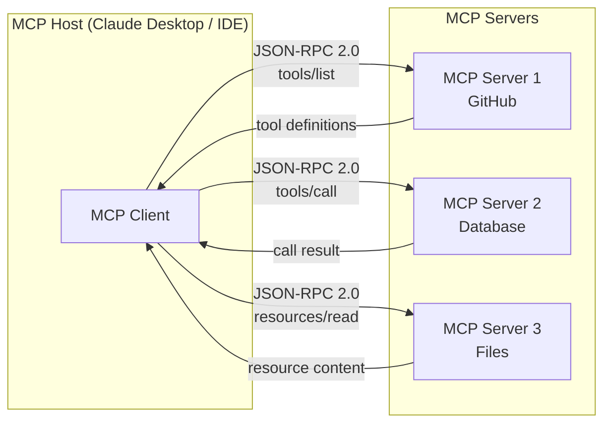
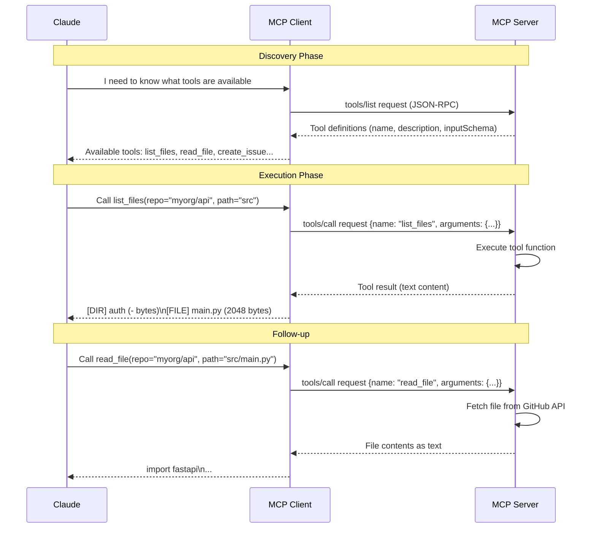

# Week 2: The Model Context Protocol (MCP)

**Theme: "The USB-C Standard for AI Tool Integration"**

Just as USB-C unified a fragmented landscape of charging cables and data connectors into a single universal interface, the **Model Context Protocol (MCP)** aims to unify how AI systems connect to the tools, data sources, and services they need. This week, you will learn what MCP is, why it was created, and how to build your own MCP servers that any compliant AI client can use.

---

## 2.1 What Is MCP and Why It Matters

### The Problem Before MCP

Before MCP, every team building an AI-powered application faced the same painful reality: if you wanted your AI assistant to interact with GitHub, you wrote a GitHub integration. If you then wanted it to work in a different application, you rewrote the integration from scratch. Meanwhile, another team at another company was writing their third GitHub integration that month.

Consider the scope of the duplication. A company building an internal AI coding assistant integrates GitHub to fetch issues, Slack to pull conversation context, and a PostgreSQL database to read schema information. Six months later, they adopt a new IDE with AI capabilities. The IDE vendor has no idea this company's integrations exist. The company's developers must either maintain two completely separate codebases for identical functionality, or give up on integration in the new tool entirely.

This is the classic **N x M integration problem**: N AI applications each needing to integrate with M external tools means N x M separate implementations. Each one has its own authentication approach, its own error handling, its own rate limiting logic, its own test suite. The cognitive overhead compounds with every new combination.

**Model Context Protocol (MCP)** solves this by defining a standard protocol — a contract — between AI applications and external tools. Build one GitHub MCP server, and it works in Claude Desktop, VS Code Copilot, Cursor, and any other MCP-compliant client without modification. The N x M problem collapses to N + M: N clients and M servers, each built once.

> **Key Insight:** MCP does not invent new technology. It standardizes an interface that already needed to exist. The protocol's power comes not from technical novelty but from the network effect of shared adoption — the more clients and servers that speak MCP, the more valuable each individual implementation becomes.

### The Protocol Architecture

MCP is built on **JSON-RPC 2.0**, a lightweight remote procedure call protocol that encodes requests and responses as JSON. Three roles define the MCP ecosystem:

- **MCP Servers** expose capabilities to AI systems. A server might expose tools (functions the AI can call), resources (documents or data the AI can read), and prompts (reusable prompt templates).
- **MCP Clients** are the components within an AI application that speak the MCP protocol, sending requests to servers and receiving responses.
- **MCP Hosts** are the end-user applications — Claude Desktop, an IDE, a custom agent — that embed MCP clients and manage connections to multiple servers simultaneously.



### Transport Mechanisms

MCP supports two primary **transport** mechanisms. **stdio transport** runs the server as a subprocess of the host application; the host writes JSON-RPC messages to the server's standard input and reads responses from standard output. This is the simplest option for local tools and is how most development setups work. **HTTP + SSE (Server-Sent Events) transport** allows a server to run as a persistent remote service, enabling multiple clients and remote deployment. The client sends requests via HTTP POST, and the server streams responses back via SSE.

> **Key Insight:** Start with stdio transport during development — it requires no networking setup and makes debugging straightforward. Graduate to HTTP+SSE transport when you need a server that multiple users or applications can share simultaneously.

> **Key Insight:** The JSON-RPC 2.0 foundation means MCP is language-agnostic at the protocol level. An MCP server written in Python can serve an MCP client written in TypeScript, Go, or Rust. The protocol is the contract, not the implementation language.

### Chapter Checkpoint

1. Describe the N x M integration problem in your own words. How does MCP reduce it to N + M?
2. What are the three roles in the MCP ecosystem, and what is the distinction between a client and a host?
3. When would you choose stdio transport over HTTP+SSE transport for an MCP server?

---

## 2.2 Building Your First MCP Server

### Setting Up the Python SDK

The official Python SDK for MCP is available as the `mcp` package with an optional CLI extension. Install it with:

```bash
pip install "mcp[cli]"
```

The `[cli]` extra installs the `mcp` command-line tool, which includes the **MCP Inspector** — a browser-based interface for testing your server interactively before connecting it to any AI host.

### Server Anatomy

An MCP server built with the Python SDK has a clear structure. The entry point is a **FastMCP** instance, which handles the protocol machinery for you. You register capabilities by decorating Python functions with `@mcp.tool()` or `@mcp.resource()`. The SDK inspects your function signatures and docstrings to generate the **JSON Schema** that MCP clients use to understand what your tools accept and return.

```python
# server.py — a minimal MCP server demonstrating core concepts
from mcp.server.fastmcp import FastMCP

# Create the server instance with a human-readable name
mcp = FastMCP("My First MCP Server")

@mcp.tool()
def add_numbers(a: int, b: int) -> int:
    """Add two integers and return their sum.

    Args:
        a: The first integer.
        b: The second integer.
    """
    return a + b

@mcp.tool()
def greet_user(name: str, formal: bool = False) -> str:
    """Generate a greeting for a user.

    Args:
        name: The user's name.
        formal: If True, use a formal greeting style.
    """
    if formal:
        return f"Good day, {name}. How may I assist you?"
    return f"Hey {name}! What's up?"

# The server runs via stdio transport by default when executed directly
if __name__ == "__main__":
    mcp.run()
```

Notice that no JSON Schema is written by hand. The SDK derives the schema from Python type hints: `a: int` becomes `{"type": "integer"}`, `formal: bool = False` becomes `{"type": "boolean", "default": false}`. The docstring becomes the tool's description, which the AI uses to decide when and how to call the tool.

### Running and Inspecting Your Server

Test your server before connecting it to any AI host:

```bash
mcp dev server.py
```

This launches the MCP Inspector in your browser. You can call your tools directly, inspect the JSON-RPC messages being exchanged, and verify your server behaves correctly. This is your primary debugging environment during development.

> **Key Insight:** Always test with the MCP Inspector before registering a server with Claude Desktop or any other host. Debugging inside a full AI host is much harder than debugging in the Inspector, where you can see every message and call every tool directly.

### Registering with Claude Desktop

Once your server works in the Inspector, register it with Claude Desktop by editing `claude_desktop_config.json`. On macOS this file is at `~/Library/Application Support/Claude/claude_desktop_config.json`; on Windows it is at `%APPDATA%\Claude\claude_desktop_config.json`.

```json
{
  "mcpServers": {
    "my-first-server": {
      "command": "python",
      "args": ["/absolute/path/to/server.py"],
      "env": {
        "PYTHONPATH": "/absolute/path/to/your/project"
      }
    }
  }
}
```

After saving and restarting Claude Desktop, your tools appear in Claude's tool list automatically. Claude can now call `add_numbers` or `greet_user` when they are relevant to a conversation.

### The TypeScript Alternative

The same concepts apply in TypeScript using `@modelcontextprotocol/sdk`:

```bash
npm install @modelcontextprotocol/sdk
```

The TypeScript SDK uses a `Server` class and `setRequestHandler` methods rather than decorators, but the protocol-level behavior is identical. A Python MCP client can call a TypeScript MCP server and vice versa — the protocol is the contract.

> **Key Insight:** Python type hints drive automatic JSON Schema generation in the Python SDK. Write precise, specific type hints — using `Literal["open", "closed"]` instead of `str` for a status field, for example — and the AI will receive better guidance about what values are valid.

### Chapter Checkpoint

1. What does the `[cli]` extra in `pip install "mcp[cli]"` provide, and why is it useful during development?
2. How does the FastMCP Python SDK generate JSON Schema for your tools? What information does it use?
3. Describe the steps to register a locally running MCP server with Claude Desktop. What file must you edit?

---

## 2.3 Resources and Dynamic Context

### Tools vs. Resources: A Conceptual Distinction

MCP exposes two primary types of capabilities to AI systems, and the distinction matters. **Tools** are actions: the model calls a tool, computation happens, and a result is returned. Think of tools as function calls — they are invoked on demand, they may have side effects, and they return structured data.

**Resources** are documents: the model requests a piece of content identified by a **URI**, and the server returns that content. Resources are more analogous to files or web pages than to functions. They are meant to be read, not executed, and they may be large enough that the AI only needs to read certain parts.

This distinction shapes how an AI system builds its context window. When an AI needs to perform an action (create a GitHub issue, execute a database query), it uses a tool. When it needs to read background information (review a design document, examine a file's current contents), it uses a resource.

### URI Patterns

Every resource is identified by a **URI**. The URI scheme communicates the nature of the resource to both the AI and the developer reading the server code:

- `file:///home/user/project/README.md` — a local file
- `github://owner/repo/src/main.py` — a file in a GitHub repository
- `db://schema/users` — a database table's schema
- `config://app/settings` — application configuration

The URI serves as a stable address. The AI can request the same resource multiple times if it needs to re-read it, and it can pass resource URIs to tools that need them.

```python
# resources_demo.py — demonstrating static and dynamic resources
import json
from mcp.server.fastmcp import FastMCP

mcp = FastMCP("Resource Demo Server")

# Static resource: content is fixed at definition time
@mcp.resource("config://app/settings")
def get_app_settings() -> str:
    """Return the application's current configuration as JSON."""
    settings = {
        "version": "2.1.0",
        "environment": "production",
        "max_retries": 3,
        "timeout_seconds": 30,
    }
    return json.dumps(settings, indent=2)


# Dynamic resource: content is computed at request time
@mcp.resource("db://users/{user_id}")
def get_user_record(user_id: str) -> str:
    """Fetch a user record from the database by ID.

    This is a resource template — the {user_id} in the URI
    is extracted and passed as a parameter.
    """
    # In a real implementation, this would query an actual database
    # Here we simulate it with a lookup
    mock_db = {
        "u001": {"name": "Alice Chen", "role": "engineer", "team": "platform"},
        "u002": {"name": "Bob Martinez", "role": "manager", "team": "product"},
    }
    record = mock_db.get(user_id, {"error": f"User {user_id} not found"})
    return json.dumps(record, indent=2)


# Tool that uses a resource URI as context
@mcp.tool()
def summarize_user(user_id: str) -> str:
    """Generate a brief summary of a user given their ID.

    Args:
        user_id: The user's ID (e.g., 'u001').
    """
    # In a real server, the AI would fetch the resource separately.
    # This tool demonstrates the pattern of URI-based identification.
    return f"To get full details, access resource: db://users/{user_id}"
```

### Resource Templates

**Resource templates** allow a single resource definition to handle parameterized URIs. The `{variable}` syntax in a URI pattern tells the SDK to extract that segment and pass it to your function. This is how you expose an entire database table as individually addressable resources without registering each row separately.

The template `db://users/{user_id}` matches any URI of the form `db://users/anything` and extracts `anything` as the `user_id` parameter. The AI can discover available resource templates through the `resources/list` protocol method and then construct valid URIs to request specific items.

> **Key Insight:** Resources are preferable to tools for read-only data access because they make the AI's intent explicit. When an AI calls a tool, the tool might have side effects — the AI and the user cannot be certain it is read-only. When an AI requests a resource, both the AI and the user know it is a read operation.

### Streaming Large Resources

For large documents — a full codebase, a lengthy report, a large database result set — returning everything at once is impractical. MCP supports streaming via **async generators**:

```python
import asyncio
from mcp.server.fastmcp import FastMCP

mcp = FastMCP("Streaming Demo")

@mcp.resource("file:///large-dataset/{filename}")
async def stream_large_file(filename: str):
    """Stream a large file in chunks to avoid memory issues.

    Args:
        filename: The name of the file to stream.
    """
    # Simulate reading a large file in chunks
    chunk_size = 1024  # 1KB chunks
    simulated_content = "x" * (chunk_size * 10)  # 10KB of simulated data

    for i in range(0, len(simulated_content), chunk_size):
        chunk = simulated_content[i:i + chunk_size]
        yield chunk
        # In a real implementation, you would read from disk here
        await asyncio.sleep(0)  # Yield control to the event loop
```

> **Key Insight:** Think of resources as the AI's library — a collection of documents it can check out on demand. Well-designed resource URIs are self-documenting: a developer reading `github://myorg/api-service/src/auth.py@main` immediately understands what content will be returned.

### Chapter Checkpoint

1. What is the conceptual difference between a tool and a resource in MCP? Give an example of when you would use each.
2. What is a resource template, and how does it differ from a static resource? Provide an example URI pattern.
3. Why might you prefer streaming a resource rather than returning its entire contents at once? What mechanism does the Python SDK use for streaming?

---

## 2.4 Real-World MCP Server Patterns

### The GitHub MCP Server Pattern

A GitHub MCP server is perhaps the most universally useful MCP server to build. It gives any AI client the ability to read and interact with repositories without requiring the AI vendor to maintain a GitHub integration. Here is a complete, production-quality GitHub MCP server demonstrating the key patterns:

```python
# github_mcp_server.py — a production-quality GitHub MCP server
import os
import httpx
from mcp.server.fastmcp import FastMCP

mcp = FastMCP("GitHub MCP Server")

# Load credentials from environment — never hardcode tokens
GITHUB_TOKEN = os.environ.get("GITHUB_TOKEN", "")
BASE_URL = "https://api.github.com"

def github_headers() -> dict:
    """Return standard GitHub API headers."""
    return {
        "Authorization": f"Bearer {GITHUB_TOKEN}",
        "Accept": "application/vnd.github+json",
        "X-GitHub-Api-Version": "2022-11-28",
    }


@mcp.tool()
async def list_files(repo: str, path: str = "", ref: str = "main") -> str:
    """List files and directories in a GitHub repository path.

    Args:
        repo: Repository in 'owner/name' format, e.g. 'myorg/api-service'.
        path: Directory path within the repo. Empty string for root.
        ref: Branch, tag, or commit SHA. Defaults to 'main'.
    """
    url = f"{BASE_URL}/repos/{repo}/contents/{path}"
    params = {"ref": ref}

    async with httpx.AsyncClient() as client:
        response = await client.get(url, headers=github_headers(), params=params)
        response.raise_for_status()

    items = response.json()
    # Format as a readable directory listing
    lines = []
    for item in items:
        icon = "[DIR]" if item["type"] == "dir" else "[FILE]"
        lines.append(f"{icon} {item['name']} ({item.get('size', '-')} bytes)")

    return "\n".join(lines) if lines else "Directory is empty."


@mcp.tool()
async def read_file(repo: str, path: str, ref: str = "main") -> str:
    """Read the contents of a file from a GitHub repository.

    Args:
        repo: Repository in 'owner/name' format.
        path: Full path to the file, e.g. 'src/auth/login.py'.
        ref: Branch, tag, or commit SHA. Defaults to 'main'.
    """
    import base64
    url = f"{BASE_URL}/repos/{repo}/contents/{path}"
    params = {"ref": ref}

    async with httpx.AsyncClient() as client:
        response = await client.get(url, headers=github_headers(), params=params)
        response.raise_for_status()

    data = response.json()
    if data.get("encoding") == "base64":
        content = base64.b64decode(data["content"]).decode("utf-8")
    else:
        content = data.get("content", "")

    return content


@mcp.tool()
async def list_open_issues(repo: str, label: str = "") -> str:
    """List open issues in a GitHub repository.

    Args:
        repo: Repository in 'owner/name' format.
        label: Optional label to filter by, e.g. 'bug' or 'enhancement'.
    """
    url = f"{BASE_URL}/repos/{repo}/issues"
    params = {"state": "open", "per_page": 20}
    if label:
        params["labels"] = label

    async with httpx.AsyncClient() as client:
        response = await client.get(url, headers=github_headers(), params=params)
        response.raise_for_status()

    issues = response.json()
    if not issues:
        return "No open issues found."

    lines = []
    for issue in issues:
        labels = ", ".join(l["name"] for l in issue.get("labels", []))
        label_str = f" [{labels}]" if labels else ""
        lines.append(f"#{issue['number']}: {issue['title']}{label_str}")

    return "\n".join(lines)


@mcp.tool()
async def get_pr_summary(repo: str, pr_number: int) -> str:
    """Retrieve a summary of a pull request including its description and review status.

    Args:
        repo: Repository in 'owner/name' format.
        pr_number: The pull request number.
    """
    url = f"{BASE_URL}/repos/{repo}/pulls/{pr_number}"

    async with httpx.AsyncClient() as client:
        response = await client.get(url, headers=github_headers())
        response.raise_for_status()

    pr = response.json()
    summary = (
        f"PR #{pr['number']}: {pr['title']}\n"
        f"State: {pr['state']}\n"
        f"Author: {pr['user']['login']}\n"
        f"Base: {pr['base']['ref']} ← Head: {pr['head']['ref']}\n"
        f"Files changed: {pr.get('changed_files', 'N/A')}\n"
        f"Additions: +{pr.get('additions', 0)}, Deletions: -{pr.get('deletions', 0)}\n"
        f"\nDescription:\n{pr.get('body', 'No description provided.')}"
    )
    return summary


@mcp.tool()
async def create_issue(
    repo: str,
    title: str,
    body: str,
    labels: list[str] | None = None
) -> str:
    """Create a new issue in a GitHub repository.

    Args:
        repo: Repository in 'owner/name' format.
        title: Issue title. Must be between 5 and 256 characters.
        body: Issue description in Markdown format.
        labels: Optional list of label names to apply.
    """
    # Input validation — guard against misuse before calling the API
    if len(title) < 5:
        return "Error: Issue title must be at least 5 characters long."
    if len(title) > 256:
        return "Error: Issue title must not exceed 256 characters."
    if not body.strip():
        return "Error: Issue body cannot be empty."

    url = f"{BASE_URL}/repos/{repo}/issues"
    payload: dict = {"title": title, "body": body}
    if labels:
        payload["labels"] = labels

    async with httpx.AsyncClient() as client:
        response = await client.post(url, headers=github_headers(), json=payload)
        response.raise_for_status()

    issue = response.json()
    return f"Issue created: #{issue['number']} — {issue['html_url']}"


if __name__ == "__main__":
    mcp.run()
```

### The Database MCP Server Pattern

A **Database MCP server** is the most sensitive type of MCP server you will build, because mistakes can corrupt or expose data. The pattern below demonstrates the critical safeguards required:

```python
# database_mcp_server.py — safe read-only database access via MCP
import sqlite3
import os
from typing import Literal
from mcp.server.fastmcp import FastMCP

mcp = FastMCP("Database MCP Server")

# Use a read-only connection — SQLite supports this natively
DB_PATH = os.environ.get("DB_PATH", "/path/to/database.db")

# Whitelist of allowed SQL statement types
ALLOWED_STATEMENT_TYPES = {"SELECT", "WITH", "EXPLAIN"}

def get_readonly_connection():
    """Return a read-only SQLite connection."""
    # The 'ro' mode flag enforces read-only access at the OS level
    uri = f"file:{DB_PATH}?mode=ro"
    return sqlite3.connect(uri, uri=True)


def validate_sql(sql: str) -> str | None:
    """Validate a SQL statement is read-only. Returns error message or None."""
    normalized = sql.strip().upper()
    first_word = normalized.split()[0] if normalized.split() else ""

    if first_word not in ALLOWED_STATEMENT_TYPES:
        return (
            f"Only read operations are allowed. "
            f"Statement type '{first_word}' is not permitted. "
            f"Allowed types: {', '.join(sorted(ALLOWED_STATEMENT_TYPES))}"
        )
    return None  # No error


@mcp.tool()
def list_tables() -> str:
    """List all tables available in the database."""
    conn = get_readonly_connection()
    try:
        cursor = conn.execute(
            "SELECT name, type FROM sqlite_master "
            "WHERE type IN ('table', 'view') ORDER BY name"
        )
        rows = cursor.fetchall()
        if not rows:
            return "No tables found in database."
        return "\n".join(f"{row[1].upper()}: {row[0]}" for row in rows)
    finally:
        conn.close()


@mcp.tool()
def describe_table(name: str) -> str:
    """Describe the schema of a specific database table.

    Args:
        name: The name of the table to describe.
    """
    # Sanitize: table names must be alphanumeric + underscores only
    if not name.replace("_", "").isalnum():
        return f"Error: Invalid table name '{name}'. Use only letters, numbers, and underscores."

    conn = get_readonly_connection()
    try:
        cursor = conn.execute(f"PRAGMA table_info({name})")
        columns = cursor.fetchall()
        if not columns:
            return f"Table '{name}' not found or has no columns."

        lines = [f"Table: {name}", "Columns:"]
        for col in columns:
            # col: (cid, name, type, notnull, dflt_value, pk)
            pk_marker = " [PRIMARY KEY]" if col[5] else ""
            null_marker = " NOT NULL" if col[3] else ""
            lines.append(f"  {col[1]}: {col[2]}{null_marker}{pk_marker}")
        return "\n".join(lines)
    finally:
        conn.close()


@mcp.tool()
def execute_query(sql: str) -> str:
    """Execute a read-only SQL SELECT query and return results.

    Only SELECT, WITH (CTEs), and EXPLAIN statements are permitted.

    Args:
        sql: A valid SQL SELECT statement.
    """
    # Validate before executing
    error = validate_sql(sql)
    if error:
        return f"Error: {error}"

    conn = get_readonly_connection()
    try:
        cursor = conn.execute(sql)
        rows = cursor.fetchmany(100)  # Limit to 100 rows

        if not rows:
            return "Query returned no results."

        # Format as a readable table
        col_names = [description[0] for description in cursor.description]
        header = " | ".join(col_names)
        separator = "-" * len(header)
        data_rows = [" | ".join(str(cell) for cell in row) for row in rows]

        lines = [header, separator] + data_rows
        if len(rows) == 100:
            lines.append("(Results limited to 100 rows)")
        return "\n".join(lines)

    except sqlite3.Error as e:
        return f"Database error: {e}"
    finally:
        conn.close()


if __name__ == "__main__":
    mcp.run()
```

### The MCP Tool Call Sequence

Understanding how MCP tool calls flow through the system helps you debug issues and design better servers:



> **Key Insight:** Safeguards in write-capable MCP servers are non-negotiable. An AI calling `create_issue` with a missing title or calling `execute_query` with a DROP TABLE statement should receive a clear, informative error — not a crash or unintended data modification. Validate inputs at the entry point of every write operation.

> **Key Insight:** Test every MCP server with the MCP Inspector before connecting it to any AI host. The Inspector lets you call tools directly, inspect the exact JSON being exchanged, and verify error handling works correctly. An untested server connected to a powerful AI creates unpredictable behavior.

### Chapter Checkpoint

1. In the GitHub MCP server, why is `read_file` implemented as a tool rather than a resource? Under what circumstances might you prefer to implement it as a resource instead?
2. What are two distinct layers of protection used in the Database MCP server to prevent destructive SQL operations?
3. Looking at the MCP tool call sequence diagram, explain what happens during the "Discovery Phase." When does this phase occur in a typical conversation?

---

## Lab Walkthrough: Building a GitHub Repository MCP Server

### Overview

In this lab, you will build a complete MCP server that gives any AI client rich access to a GitHub repository. You will expose file browsing, file reading, issue management, and PR inspection. You will then test the server using the MCP Inspector before registering it with Claude Desktop.

### Prerequisites

- Python 3.11 or later
- A GitHub account and a personal access token with `repo` scope
- Claude Desktop installed (for the final registration step)

### Step 1: Initialize Your Project

```bash
mkdir github-mcp-lab
cd github-mcp-lab
python -m venv .venv

# Activate the virtual environment
# On Windows:
.venv\Scripts\activate
# On macOS/Linux:
source .venv/bin/activate

pip install "mcp[cli]" httpx
```

Create a `.env` file for your credentials:

```bash
# .env — never commit this file to version control
GITHUB_TOKEN=ghp_your_personal_access_token_here
```

### Step 2: Create the Server File

Create `server.py` in your project directory. Start with the imports and server initialization:

```python
# server.py
import os
import base64
import httpx
from mcp.server.fastmcp import FastMCP

# Load token from environment
GITHUB_TOKEN = os.environ.get("GITHUB_TOKEN", "")
if not GITHUB_TOKEN:
    raise RuntimeError("GITHUB_TOKEN environment variable is required")

BASE_URL = "https://api.github.com"
mcp = FastMCP("GitHub Repository Explorer")

def _headers() -> dict:
    return {
        "Authorization": f"Bearer {GITHUB_TOKEN}",
        "Accept": "application/vnd.github+json",
        "X-GitHub-Api-Version": "2022-11-28",
    }
```

### Step 3: Implement list_files

Add the first tool to `server.py`:

```python
@mcp.tool()
async def list_files(repo: str, path: str = "", ref: str = "main") -> str:
    """List files and directories at a path in a GitHub repository.

    Args:
        repo: Repository in 'owner/name' format.
        path: Directory path (empty for root).
        ref: Branch or commit SHA.
    """
    url = f"{BASE_URL}/repos/{repo}/contents/{path}"
    async with httpx.AsyncClient() as client:
        r = await client.get(url, headers=_headers(), params={"ref": ref})
        r.raise_for_status()

    items = r.json()
    return "\n".join(
        f"{'[DIR]' if i['type']=='dir' else '[FILE]'} {i['name']}"
        for i in items
    )
```

### Step 4: Implement read_file, list_open_issues, get_pr_summary

Add these tools following the same pattern shown in section 2.4. Each tool should handle HTTP errors gracefully and return informative error messages rather than raising raw exceptions to the AI.

Wrap each `raise_for_status()` call in a try/except:

```python
try:
    r.raise_for_status()
except httpx.HTTPStatusError as e:
    return f"GitHub API error {e.response.status_code}: {e.response.text}"
```

### Step 5: Implement create_issue with Validation

Add the write operation with full validation:

```python
@mcp.tool()
async def create_issue(repo: str, title: str, body: str) -> str:
    """Create a new GitHub issue. Title must be 5-256 chars; body must be non-empty.

    Args:
        repo: Repository in 'owner/name' format.
        title: Issue title (5-256 characters).
        body: Issue description in Markdown.
    """
    # Validate all inputs before making any API call
    errors = []
    if len(title) < 5:
        errors.append("Title must be at least 5 characters.")
    if len(title) > 256:
        errors.append("Title must not exceed 256 characters.")
    if not body.strip():
        errors.append("Body must not be empty.")
    if errors:
        return "Validation failed:\n" + "\n".join(f"- {e}" for e in errors)

    url = f"{BASE_URL}/repos/{repo}/issues"
    async with httpx.AsyncClient() as client:
        r = await client.post(
            url, headers=_headers(), json={"title": title, "body": body}
        )
        r.raise_for_status()

    issue = r.json()
    return f"Created issue #{issue['number']}: {issue['html_url']}"
```

### Step 6: Test with MCP Inspector

Launch the Inspector:

```bash
GITHUB_TOKEN=your_token_here mcp dev server.py
```

The Inspector opens in your browser. Test each tool:

1. Call `list_files` with `repo="torvalds/linux"` and `path=""`. Verify you see a directory listing.
2. Call `read_file` with a known small file path. Verify the content appears.
3. Call `list_open_issues` on a public repo you have access to.
4. Call `create_issue` with a title of `"ab"` (too short). Verify you get the validation error.
5. Call `create_issue` with valid inputs. Verify the issue appears in GitHub.

### Step 7: Register with Claude Desktop

Edit `claude_desktop_config.json`:

```json
{
  "mcpServers": {
    "github-explorer": {
      "command": "python",
      "args": ["C:\\absolute\\path\\to\\github-mcp-lab\\server.py"],
      "env": {
        "GITHUB_TOKEN": "ghp_your_token_here"
      }
    }
  }
}
```

Restart Claude Desktop. In a new conversation, ask: "Use the GitHub tool to list the files in the root of torvalds/linux." Claude should call `list_files` and return the directory listing.

### Step 8: Add Error Handling and Logging

Enhance your server with logging for observability:

```python
import logging

logging.basicConfig(level=logging.INFO)
logger = logging.getLogger(__name__)

# In each tool, add:
logger.info("list_files called: repo=%s path=%s ref=%s", repo, path, ref)
```

When running via stdio, log output goes to stderr, which Claude Desktop captures in its log files. This is essential for diagnosing issues in production.

---

## Further Reading

1. **"Model Context Protocol Specification"** — Anthropic (2024). The authoritative technical specification for the MCP protocol, covering JSON-RPC message formats, capability negotiation, and transport requirements. Available at modelcontextprotocol.io.

2. **"Building AI-Powered Developer Tools"** — Simon Willison (2024). A practical exploration of how AI assistants integrate with developer workflows, with extensive discussion of the tradeoffs between tool-based and retrieval-based context injection.

3. **"Designing Data-Intensive Applications"** — Martin Kleppmann (O'Reilly, 2017). While not MCP-specific, this book's treatment of API design, schema evolution, and distributed systems provides essential background for designing robust MCP server interfaces that remain stable as capabilities evolve.

4. **"The Architecture of Open Source Applications: nginx"** — Andrew Alexeev, in *AOSA Volume 2* (2012). A classic examination of how a protocol-based architecture enables extraordinary flexibility. The lessons about client-server protocol design apply directly to MCP server architecture.

5. **"REST vs. gRPC vs. GraphQL"** — Nikos Vaggalis, InfoQ (2023). Situates MCP's JSON-RPC 2.0 foundation within the broader landscape of API design patterns, helping you understand what MCP inherits from each paradigm and where it makes different tradeoffs.

---

## Week Summary

- **MCP solves the N x M integration problem** by defining a standard protocol between AI clients and external tools. Build one server, use it everywhere — in Claude Desktop, VS Code Copilot, Cursor, and any future MCP-compliant host.

- **Three roles define the ecosystem:** servers expose capabilities, clients consume them, and hosts manage connections to multiple servers. The host is the end-user application; the client is a component within it.

- **FastMCP automates JSON Schema generation** from Python type hints and docstrings, letting you focus on business logic rather than protocol details. Precise type hints produce better AI guidance about valid inputs.

- **Resources complement tools** by providing URI-addressable documents for read access, while tools handle actions and computations. Distinguishing between them in your server design makes AI behavior more predictable and auditable.

- **Safeguards are mandatory in write-capable servers.** Validate all inputs before executing write operations, use read-only database connections for query servers, whitelist allowed SQL statement types, and always test with the MCP Inspector before connecting to any AI host.
