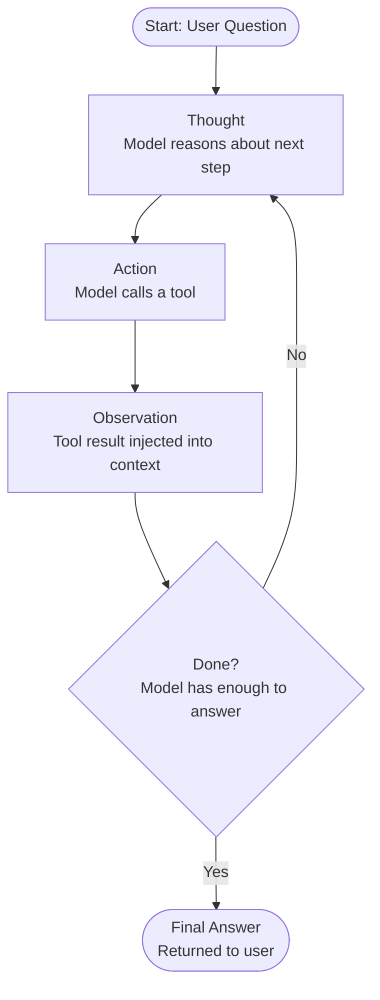
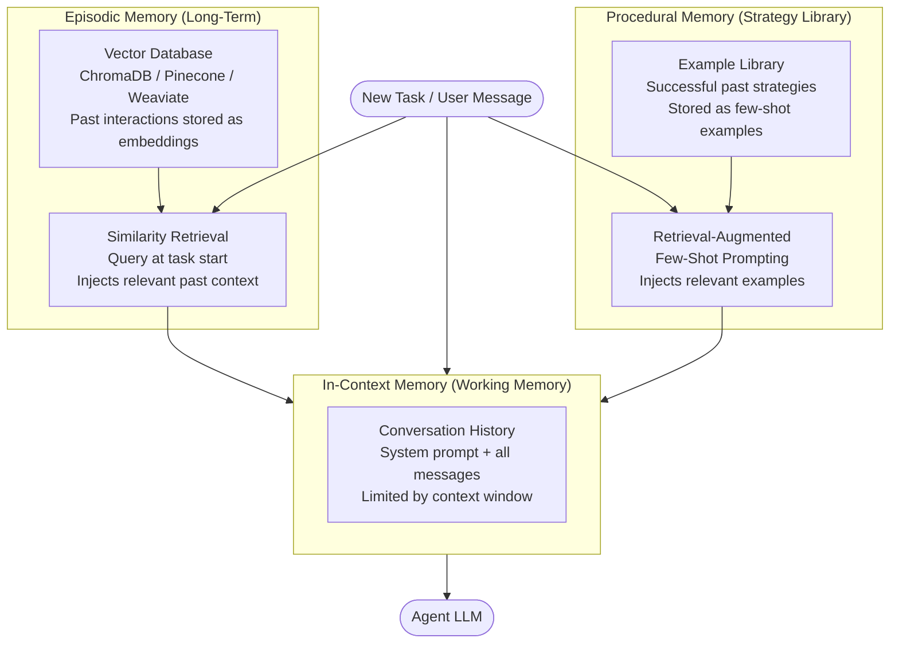

# Week 3: AI Agent Foundations

**Theme: From Single Calls to Autonomous Loops**

---

## 3.1 What Is an Agent?

### The Autonomy Spectrum

When developers first encounter large language models, they typically interact with them through a single API call: send a prompt, receive a completion. This is the simplest form of LLM usage, and it is perfectly appropriate for a wide range of tasks — summarization, classification, drafting text, answering factual questions. But single calls have a fundamental limitation: the model can only work with what you give it and cannot take any action in the world.

As applications grow more complex, developers naturally begin chaining calls together. A **chain** (sometimes called a pipeline) is a fixed sequence of LLM calls where the output of one step becomes the input of the next. You might first call the model to classify a user's intent, then route to a specialized prompt based on that classification, then call the model again to generate the final response. Chains are powerful and predictable, but they are brittle: the sequence of steps is decided at design time by the developer, not at runtime by the model.

An **agent** is the next step on this spectrum. In an agent architecture, the LLM itself decides what to do next. Rather than following a fixed path, the model is given a set of tools — functions it can invoke — and it reasons about which tool to call, with what inputs, in order to make progress toward a goal. The path through the task is determined dynamically, at runtime, by the model's own judgment.

Beyond single agents, **multi-agent systems** introduce multiple LLMs that collaborate, delegate, or compete to accomplish a task. One model might act as an orchestrator that breaks down a high-level goal into sub-tasks, while specialized sub-agents handle each sub-task independently. Multi-agent systems can tackle problems of a complexity that would overwhelm any single context window.

### Core Properties of an Agent

Every agent, regardless of the framework used to build it, exhibits four core properties:

**Perception** is the agent's ability to receive input from its environment. This includes the user's initial request, but also the results returned by tools, messages from other agents, and any other information injected into the context.

**Planning** is the agent's ability to decide what to do next. This is the LLM's job. Given the current state of the conversation and the tools available, the model reasons about the best next action. Planning may be implicit (the model simply outputs a tool call) or explicit (the model writes out its reasoning step by step before acting).

**Action** is the execution of a tool call — a web search, a database query, a file write, a calculator invocation. Actions are how the agent affects the world beyond its own context window. The result of an action (the tool's output) is then fed back into the context as an observation.

**Memory** is the agent's ability to maintain state across steps. Within a single run, the conversation history serves as working memory. Across runs, agents may store and retrieve information from external databases. Memory is explored in depth in Section 3.3.

### The Agency Paradox

> **Key Insight:** More autonomy enables more complex tasks, but also creates more opportunities for failure. An agent that can browse the web and write files can accomplish remarkable things — and can also loop indefinitely, delete the wrong file, or hallucinate a tool call that corrupts data. Increased capability and increased risk are inseparable.

This is not a reason to avoid agents. It is a reason to design them carefully, with explicit reliability patterns (covered in Section 3.4) and human oversight for high-stakes actions.

### When to Use Agents

The decision to use an agent rather than a chain should be based on one question: **is the path through the task knowable at design time?**

If you can enumerate the steps — "first classify, then retrieve, then generate" — a chain is simpler, faster, and more predictable. If the steps depend on what you discover along the way — "find information about X, but the sources you need will depend on what X turns out to be" — an agent is appropriate. Tasks that require iterative refinement, tasks that require branching based on discovered information, and tasks that may require an unknown number of tool calls are all good candidates for agent architectures.

> **Key Insight:** The most common mistake in agent design is using an agent when a chain would suffice. Agents introduce non-determinism. Use them only when dynamic decision-making is genuinely required.

> **Key Insight:** Think of an agent less like a program and more like an employee you have briefed on a task. You give them a goal and the tools they need; they figure out the steps. This framing helps set realistic expectations — and highlights why clear instructions and guardrails matter so much.

### Chapter Checkpoint

1. Explain the difference between a chain and an agent. In what scenario would you choose a chain over an agent, and why?
2. List the four core properties of an agent and give a concrete example of each in the context of a customer support agent.
3. What is the agency paradox, and what design-level strategies can mitigate the risks it introduces?

---

## 3.2 The ReAct Pattern

### Reasoning and Acting Together

The **ReAct pattern** (Reason + Act) is the dominant paradigm for implementing single-agent systems. Introduced by Yao et al. (2022), it structures the agent's behavior as an alternating sequence of three types of outputs: **Thought**, **Action**, and **Observation**. This structure, repeated in a loop, allows the model to build up a chain of reasoning that is grounded in real tool results rather than pure hallucination.

The loop proceeds as follows:

1. **Thought**: The model writes out its internal reasoning. "The user wants to know the percentage of the world population that lives in Tokyo. I need to find Tokyo's population and the world population, then divide."
2. **Action**: The model emits a structured tool call. `search("Tokyo population 2024")`
3. **Observation**: The tool executes and its result is injected back into the context. `"Tokyo's population is approximately 13.96 million in the city proper."`
4. The model reads the observation and produces another Thought, potentially another Action, until it determines it has sufficient information to answer.

This loop is depicted in the diagram below.



### Implementing ReAct: The System Prompt

The ReAct pattern is implemented primarily through the system prompt. You must teach the model to output responses in the Thought/Action/Observation format. A minimal system prompt looks like this:

```python
REACT_SYSTEM_PROMPT = """
You are a research assistant. You answer questions by reasoning step by step
and using the tools available to you.

For each step, output exactly one of:

Thought: <your reasoning about what to do next>
Action: <tool_name>(<arguments as JSON>)

After each Action, you will receive an Observation with the tool result.
Continue until you have enough information, then output:

Final Answer: <your complete answer to the user's question>

Available tools:
- search(query: str) -> str: Search the web for current information
- wikipedia(topic: str) -> str: Retrieve a Wikipedia article summary
- calculator(expression: str) -> float: Evaluate a mathematical expression

Rules:
1. Always write a Thought before every Action.
2. Never fabricate Observations — wait for the real tool result.
3. If you cannot make progress after three consecutive attempts, admit it.
"""
```

### Parsing Thought/Action/Observation

The agent runtime must parse the model's output to detect when it has emitted an Action, extract the tool name and arguments, call the tool, and inject the result as an Observation. Here is a minimal implementation:

```python
import re
import json
from typing import Callable


def parse_action(text: str) -> tuple[str, dict] | None:
    """
    Extract tool name and arguments from an Action line.
    Returns (tool_name, args_dict) or None if no action found.
    """
    match = re.search(r"Action:\s*(\w+)\((.+)\)", text, re.DOTALL)
    if not match:
        return None
    tool_name = match.group(1)
    raw_args = match.group(2).strip()
    try:
        # Arguments may be a JSON object or a single quoted string
        if raw_args.startswith("{"):
            args = json.loads(raw_args)
        else:
            # Single positional argument — treat as {"query": value}
            args = {"query": raw_args.strip('"').strip("'")}
    except json.JSONDecodeError:
        args = {"query": raw_args}
    return tool_name, args


def run_react_step(
    model_output: str,
    tools: dict[str, Callable],
    messages: list[dict],
) -> str | None:
    """
    Parse a model output for an Action; execute it; append the Observation.
    Returns the observation string, or None if no action was found (implying
    the model has produced a Final Answer).
    """
    parsed = parse_action(model_output)
    if parsed is None:
        return None  # No action — check for Final Answer

    tool_name, args = parsed
    if tool_name not in tools:
        observation = f"Error: tool '{tool_name}' is not available."
    else:
        try:
            observation = str(tools[tool_name](**args))
        except Exception as e:
            observation = f"Error executing {tool_name}: {e}"

    # Inject observation into the conversation
    messages.append({
        "role": "user",
        "content": f"Observation: {observation}"
    })
    return observation
```

### Thought Traces and Debugging

One of the most valuable properties of the ReAct pattern is the **thought trace** — the sequence of Thought lines produced during a run. Unlike opaque tool calls, thought traces let you see the model's reasoning at each step. When an agent produces a wrong answer, the thought trace almost always reveals exactly where it went astray: a mistaken assumption, a misread tool result, or a faulty calculation.

> **Key Insight:** Never discard thought traces in production. Log them alongside the final answer. When something goes wrong — and it will — the thought trace is your primary debugging tool.

> **Key Insight:** The ReAct loop is not magic; it is just structured prompting. The model is still a next-token predictor. Its "reasoning" in the Thought step is only as good as its training. Grounding each step in real tool results (Observations) is what gives the loop its power — without it, you are just asking the model to hallucinate a chain of reasoning.

> **Key Insight:** Short-circuit the loop early when possible. Before calling any tool, ask whether the model's Thought shows sufficient confidence to answer from existing context. Unnecessary tool calls add latency and cost.

### Chapter Checkpoint

1. Trace through a complete ReAct loop for the question "What is the GDP of France divided by its population?" Write out the Thought, Action, and Observation for each step.
2. Why is it important to inject tool results as Observations rather than simply continuing the model's generation? What failure mode does this prevent?
3. Describe one scenario where the ReAct loop might fail to terminate, and how you would detect and handle it.

---

## 3.3 Agent Memory Architecture

### Why Memory Matters

A stateless LLM call has no memory of anything that happened before the current prompt. This is fine for isolated tasks, but agents frequently need to remember what they have learned across steps within a run, and what they have learned across runs over time. Without memory, an agent that researches the same user's preferences every single session is wasting compute and delivering a degraded experience.

Agent memory is best understood as three distinct systems, each with different characteristics and appropriate uses.



### In-Context Memory

**In-context memory** is the simplest form of agent memory: the conversation history that accumulates within a single run. Every message sent to and received from the model is appended to a list and sent with every subsequent call. This list constitutes the agent's working memory — it can "remember" anything it has seen during the current session simply by reading back through the history.

In-context memory has a hard limit: the **context window**. For current frontier models this is measured in hundreds of thousands of tokens, but long histories still incur cost and latency. When histories grow too long, you must either truncate (losing old context) or summarize (compressing it). A common strategy is to keep the most recent N turns verbatim and replace older turns with a summary generated by the model itself.

```python
def maybe_summarize_history(
    messages: list[dict],
    max_tokens: int,
    model_client,
    token_counter: callable,
) -> list[dict]:
    """
    If the conversation history exceeds max_tokens, summarize the oldest
    half of messages and replace them with a single summary message.
    """
    total = sum(token_counter(m["content"]) for m in messages)
    if total <= max_tokens:
        return messages

    # Split: summarize the old half, keep the recent half verbatim
    midpoint = len(messages) // 2
    to_summarize = messages[:midpoint]
    to_keep = messages[midpoint:]

    summary_prompt = (
        "Summarize the following conversation history concisely, "
        "preserving all factual details and decisions made:\n\n"
        + "\n".join(f"{m['role']}: {m['content']}" for m in to_summarize)
    )
    summary = model_client.complete(summary_prompt)

    summary_message = {
        "role": "system",
        "content": f"[Earlier conversation summary]: {summary}"
    }
    return [summary_message] + to_keep
```

### Episodic Memory

**Episodic memory** stores information across agent runs. After completing a task, the agent writes a summary of what it learned — key facts discovered, decisions made, outcomes observed — to a **vector database**. When a new task begins, the agent queries the vector database for records similar to the current task, retrieves the most relevant ones, and injects them into the context before the first LLM call.

The retrieval mechanism relies on **semantic similarity**: the task description is embedded into a vector, and the database returns stored records whose embeddings are nearest (by cosine distance) to the query embedding. This means the retrieval is topic-based, not keyword-based — records about "annual revenue of European tech companies" will be retrieved when the current task is "compare the financial performance of SAP and ASML," even if no keywords overlap.

```python
import chromadb
from chromadb.utils import embedding_functions

# Initialize ChromaDB with a local persistent store
client = chromadb.PersistentClient(path="./agent_memory")
embed_fn = embedding_functions.DefaultEmbeddingFunction()

collection = client.get_or_create_collection(
    name="episodic_memory",
    embedding_function=embed_fn,
)


def write_episodic_memory(task: str, summary: str, metadata: dict = None):
    """Store a task summary in episodic memory after completing a task."""
    import uuid
    collection.add(
        documents=[summary],
        metadatas=[{**(metadata or {}), "task": task}],
        ids=[str(uuid.uuid4())],
    )


def retrieve_episodic_memory(task: str, n_results: int = 3) -> list[str]:
    """Retrieve the most relevant past summaries for a new task."""
    results = collection.query(
        query_texts=[task],
        n_results=n_results,
    )
    # results["documents"] is a list of lists
    return results["documents"][0] if results["documents"] else []
```

### Procedural Memory

**Procedural memory** stores successful *strategies* rather than facts. Where episodic memory answers "what did I learn about this topic?", procedural memory answers "how have I successfully approached this type of problem before?". Concretely, it stores few-shot examples — pairs of (task description, successful ReAct trace) — that can be retrieved and injected into the system prompt to guide the model's approach.

> **Key Insight:** Procedural memory is the most underused form of agent memory. When an agent develops a particularly effective strategy for a class of tasks, storing that trace and retrieving it for similar future tasks is one of the highest-leverage improvements you can make.

> **Key Insight:** Memory retrieval at the start of a task is not free. Each retrieval query costs an embedding call and a database round-trip. Design your memory architecture so that retrieval happens once per task, not once per step.

> **Key Insight:** Be conservative about what you write to episodic memory. Writing every interaction creates noise that degrades retrieval quality. Only write summaries after successful task completions, and include a confidence or quality score in the metadata so low-quality runs can be filtered out at retrieval time.

### Chapter Checkpoint

1. A user asks the same agent to research competitor pricing every Monday. Which type of memory would you use to ensure the agent improves its research strategy over time? Describe concretely how you would implement the write and retrieval steps.
2. What happens when in-context memory exceeds the model's context window? Describe two strategies for handling this and the trade-offs of each.
3. Explain why vector-based retrieval for episodic memory is more appropriate than keyword search for agent use cases.

---

## 3.4 Agent Reliability Patterns

### The Reliability Problem

An agent that runs correctly on a demo is not the same as an agent that runs reliably in production. The open-ended nature of agent execution — the model deciding what to do at each step — creates failure modes that simply do not exist in deterministic pipelines. The four most important reliability patterns are: loop detection, progress signaling, maximum iteration caps, and human-in-the-loop checkpoints.

### Loop Detection

The most common failure mode for ReAct agents is the **infinite loop**: the agent calls the same tool with the same inputs repeatedly, making no progress. This typically happens because the tool returns an unhelpful result, the model does not know how to interpret it, and so it retries identically.

Loop detection works by tracking a fingerprint of each (action, inputs) pair. If the same fingerprint appears twice in a single run, the agent is stuck. The correct response is to either force a different approach (inject a message telling the model its last action was a repeat and it must try something different) or escalate to a human.

```python
import hashlib
import json
from dataclasses import dataclass, field


@dataclass
class AgentRunState:
    messages: list[dict] = field(default_factory=list)
    action_hashes: set[str] = field(default_factory=set)
    step_count: int = 0
    MAX_ITERATIONS: int = 15

    def hash_action(self, tool_name: str, args: dict) -> str:
        """Create a deterministic fingerprint for a (tool, args) pair."""
        canonical = json.dumps({"tool": tool_name, "args": args}, sort_keys=True)
        return hashlib.sha256(canonical.encode()).hexdigest()

    def check_and_register_action(self, tool_name: str, args: dict) -> bool:
        """
        Returns True if this action is a repeat (loop detected).
        Registers the action if it is new.
        """
        h = self.hash_action(tool_name, args)
        if h in self.action_hashes:
            return True  # Loop detected
        self.action_hashes.add(h)
        return False

    def is_max_iterations_reached(self) -> bool:
        return self.step_count >= self.MAX_ITERATIONS
```

### Progress Signals

Beyond loop detection, it is useful to require that each step makes **observable progress**: new information was retrieved, a document was written, a calculation was completed. If a step produces an observation that is identical or nearly identical to a previous observation, that is a signal that the agent is not making progress.

A simple heuristic: after each Observation, compute its similarity to all previous Observations. If the similarity exceeds a threshold (e.g., 0.95), treat it as a loop indicator.

### Maximum Iterations and Fallback

Every agent must have a hard cap on the number of steps it will take. Without this, a misbehaving agent can run indefinitely, accruing cost and potentially causing harm. The **max_iterations** parameter (typically 10–15 for research tasks, adjustable based on task complexity) serves as a circuit breaker.

When max_iterations is reached, the agent should not simply crash. It should return whatever partial results it has accumulated, along with an explanation of where it stopped and why.

```python
class AgentMaxIterationsError(Exception):
    """Raised when the agent reaches the maximum number of iterations."""
    def __init__(self, partial_results: str, steps_taken: int):
        self.partial_results = partial_results
        self.steps_taken = steps_taken
        super().__init__(
            f"Agent reached max iterations ({steps_taken} steps). "
            f"Partial results: {partial_results[:200]}..."
        )


def run_agent(
    question: str,
    tools: dict,
    model_client,
    state: AgentRunState,
) -> str:
    """
    Run a ReAct agent loop with loop detection and max iteration enforcement.
    """
    state.messages.append({"role": "user", "content": question})

    while not state.is_max_iterations_reached():
        state.step_count += 1

        # Call the model
        response = model_client.complete(state.messages)
        state.messages.append({"role": "assistant", "content": response})

        # Check for Final Answer
        if "Final Answer:" in response:
            return response.split("Final Answer:")[-1].strip()

        # Parse and execute action
        parsed = parse_action(response)
        if parsed is None:
            # Model produced neither an Action nor a Final Answer — prompt it
            state.messages.append({
                "role": "user",
                "content": "Please continue. Output either an Action or a Final Answer."
            })
            continue

        tool_name, args = parsed

        # Loop detection
        if state.check_and_register_action(tool_name, args):
            state.messages.append({
                "role": "user",
                "content": (
                    f"You have already called {tool_name} with these exact arguments. "
                    "This action is a repeat — you are stuck in a loop. "
                    "Try a different approach: use a different tool, rephrase your query, "
                    "or conclude with the information you have already gathered."
                )
            })
            continue

        # Execute the tool
        observation = run_react_step(response, tools, state.messages)

    # Max iterations reached — build partial results from message history
    partial = "\n".join(
        m["content"] for m in state.messages
        if m["role"] == "assistant"
    )
    raise AgentMaxIterationsError(partial, state.step_count)
```

### Human-in-the-Loop

For **irreversible actions** — sending an email, deleting a file, making a purchase, posting publicly — the agent must pause and request explicit human confirmation before proceeding. This is non-negotiable. The cost of a false positive (asking unnecessarily) is a moment of friction. The cost of a false negative (taking an irreversible wrong action) can be catastrophic.

Implement this by tagging tools as `requires_confirmation=True` and intercepting calls to those tools before execution:

```python
IRREVERSIBLE_TOOLS = {"send_email", "delete_file", "make_purchase", "post_to_social"}

def execute_with_confirmation(
    tool_name: str,
    args: dict,
    tools: dict,
    confirm_fn: callable,
) -> str:
    """
    Execute a tool, pausing for human confirmation if the tool is irreversible.
    confirm_fn(tool_name, args) -> bool: returns True if the human approves.
    """
    if tool_name in IRREVERSIBLE_TOOLS:
        approved = confirm_fn(tool_name, args)
        if not approved:
            return f"Action cancelled by user: {tool_name}({args})"
    return str(tools[tool_name](**args))
```

> **Key Insight:** Human-in-the-loop is not a sign of a weak agent; it is a sign of a well-designed one. For any action that cannot be undone, the cost of asking is always lower than the cost of acting wrongly.

> **Key Insight:** The max_iterations cap is your last line of defense. It should never be raised without careful consideration. If your agent routinely hits the cap, that is a signal to decompose the task, not to raise the limit.

> **Key Insight:** Treat loop detection and progress signaling as complementary. Loop detection catches exact repetition. Progress signaling catches semantic repetition — where the agent is trying different phrasings of the same unhelpful query. Both are necessary in production systems.

### Chapter Checkpoint

1. Implement a `check_progress` function that takes the list of Observations from the current run and returns `True` if the most recent observation is semantically redundant with any previous observation (define your similarity metric and threshold).
2. A colleague argues that setting `max_iterations=50` is safer because it gives the agent more chances to succeed. Construct a counter-argument.
3. Describe a real-world agent task where human-in-the-loop confirmation is essential, and one where it would be unnecessarily disruptive. What criteria distinguish the two?

---

## Lab Walkthrough: ReAct Research Agent

### Overview

In this lab you will build a ReAct agent that answers multi-step research questions. The agent will have access to three tools: a web search stub, a Wikipedia retriever, and a calculator. You will implement loop detection, a max_iterations cap of 15, and a confidence score in the final answer. The agent's episodic memory will be backed by ChromaDB.

### Prerequisites

```bash
pip install chromadb anthropic wikipedia-api duckduckgo-search
```

### Step 1: Define the Tools

```python
# tools.py
import math
import wikipediaapi
from duckduckgo_search import DDGS


def search(query: str) -> str:
    """Search the web using DuckDuckGo. Returns top 3 result snippets."""
    with DDGS() as ddgs:
        results = list(ddgs.text(query, max_results=3))
    if not results:
        return "No results found."
    return "\n".join(
        f"[{r['title']}] {r['body']}" for r in results
    )


def wikipedia(topic: str) -> str:
    """Retrieve a Wikipedia article summary (first 500 chars)."""
    wiki = wikipediaapi.Wikipedia("ResearchAgent/1.0", "en")
    page = wiki.page(topic)
    if not page.exists():
        return f"No Wikipedia article found for '{topic}'."
    return page.summary[:500]


def calculator(expression: str) -> str:
    """
    Evaluate a safe mathematical expression.
    Supports: +, -, *, /, **, sqrt, log, round, abs.
    """
    allowed_names = {
        "sqrt": math.sqrt,
        "log": math.log,
        "log10": math.log10,
        "round": round,
        "abs": abs,
        "pi": math.pi,
        "e": math.e,
    }
    try:
        result = eval(expression, {"__builtins__": {}}, allowed_names)
        return str(result)
    except Exception as ex:
        return f"Calculator error: {ex}"


TOOLS = {
    "search": search,
    "wikipedia": wikipedia,
    "calculator": calculator,
}
```

### Step 2: Build the Agent Class

```python
# agent.py
import re
import json
import hashlib
import anthropic
import chromadb
from chromadb.utils import embedding_functions
from tools import TOOLS

SYSTEM_PROMPT = """
You are a research assistant. Answer questions by reasoning step-by-step
and using the available tools.

Format each step as:
Thought: <your reasoning>
Action: <tool_name>("<argument>")

After receiving an Observation, continue reasoning. When done, output:
Final Answer: <answer> | Confidence: <0-100>%

Available tools: search(query), wikipedia(topic), calculator(expression)

Rules:
- Always write a Thought before every Action.
- Never repeat an Action with identical arguments — try a different approach.
- Assign a Confidence score (0-100) in your Final Answer based on source quality.
"""


class ResearchAgent:
    def __init__(self, max_iterations: int = 15):
        self.max_iterations = max_iterations
        self.client = anthropic.Anthropic()

        # Episodic memory
        db = chromadb.PersistentClient(path="./agent_memory")
        self.memory = db.get_or_create_collection(
            name="research_episodes",
            embedding_function=embedding_functions.DefaultEmbeddingFunction(),
        )

    # ------------------------------------------------------------------ #
    #  Memory helpers                                                       #
    # ------------------------------------------------------------------ #

    def retrieve_context(self, question: str) -> str:
        results = self.memory.query(query_texts=[question], n_results=2)
        docs = results["documents"][0] if results["documents"] else []
        if not docs:
            return ""
        joined = "\n---\n".join(docs)
        return f"\n[Relevant past research]:\n{joined}\n"

    def store_episode(self, question: str, answer: str):
        import uuid
        summary = f"Q: {question}\nA: {answer}"
        self.memory.add(
            documents=[summary],
            metadatas=[{"question": question}],
            ids=[str(uuid.uuid4())],
        )

    # ------------------------------------------------------------------ #
    #  Loop detection                                                       #
    # ------------------------------------------------------------------ #

    @staticmethod
    def _action_hash(tool: str, arg: str) -> str:
        key = json.dumps({"tool": tool, "arg": arg}, sort_keys=True)
        return hashlib.sha256(key.encode()).hexdigest()

    # ------------------------------------------------------------------ #
    #  Parsing                                                              #
    # ------------------------------------------------------------------ #

    @staticmethod
    def _parse_action(text: str):
        m = re.search(r'Action:\s*(\w+)\("([^"]+)"\)', text)
        if m:
            return m.group(1), m.group(2)
        return None, None

    @staticmethod
    def _parse_final_answer(text: str):
        m = re.search(r"Final Answer:\s*(.+?)(?:\||\n|$)", text, re.DOTALL)
        conf = re.search(r"Confidence:\s*(\d+)%", text)
        if m:
            return m.group(1).strip(), int(conf.group(1)) if conf else None
        return None, None

    # ------------------------------------------------------------------ #
    #  Main run loop                                                        #
    # ------------------------------------------------------------------ #

    def run(self, question: str) -> dict:
        past_context = self.retrieve_context(question)
        system = SYSTEM_PROMPT + (past_context or "")

        messages = [{"role": "user", "content": question}]
        seen_hashes = set()
        thought_trace = []

        for step in range(1, self.max_iterations + 1):
            response = self.client.messages.create(
                model="claude-sonnet-4-6",
                max_tokens=1024,
                system=system,
                messages=messages,
            )
            text = response.content[0].text
            messages.append({"role": "assistant", "content": text})

            # Collect thought trace
            for line in text.splitlines():
                if line.startswith("Thought:"):
                    thought_trace.append(f"[Step {step}] {line}")

            # Check for final answer
            answer, confidence = self._parse_final_answer(text)
            if answer:
                self.store_episode(question, answer)
                return {
                    "answer": answer,
                    "confidence": confidence,
                    "steps": step,
                    "thought_trace": thought_trace,
                }

            # Parse and execute action
            tool_name, arg = self._parse_action(text)
            if not tool_name:
                messages.append({
                    "role": "user",
                    "content": "Please output an Action or a Final Answer."
                })
                continue

            # Loop detection
            h = self._action_hash(tool_name, arg)
            if h in seen_hashes:
                messages.append({
                    "role": "user",
                    "content": (
                        f"You already called {tool_name}(\"{arg}\"). "
                        "This is a repeated action. Change your approach."
                    )
                })
                continue
            seen_hashes.add(h)

            # Execute tool
            if tool_name not in TOOLS:
                obs = f"Error: unknown tool '{tool_name}'."
            else:
                try:
                    obs = TOOLS[tool_name](arg)
                except Exception as e:
                    obs = f"Tool error: {e}"

            messages.append({"role": "user", "content": f"Observation: {obs}"})

        # Max iterations reached
        return {
            "answer": "Could not complete — max iterations reached.",
            "confidence": 0,
            "steps": self.max_iterations,
            "thought_trace": thought_trace,
            "partial": True,
        }
```

### Step 3: Run the Agent

```python
# main.py
from agent import ResearchAgent

agent = ResearchAgent(max_iterations=15)

questions = [
    "What is the population of Tokyo divided by the population of Paris, rounded to two decimal places?",
    "Who invented the World Wide Web, and in what year? What is their nationality?",
    "What is the square root of the number of countries in the European Union?",
]

for q in questions:
    print(f"\nQuestion: {q}")
    result = agent.run(q)
    print(f"Answer:     {result['answer']}")
    print(f"Confidence: {result.get('confidence', 'N/A')}%")
    print(f"Steps:      {result['steps']}")
    print("Thought trace:")
    for thought in result["thought_trace"]:
        print(f"  {thought}")
    print("-" * 60)
```

### Step 4: Expected Output Structure

When you run the agent against the first question, you should see a trace resembling:

```
Question: What is the population of Tokyo divided by the population of Paris...
  [Step 1] Thought: I need Tokyo's population and Paris's population separately.
  [Step 2] Thought: I have Tokyo's population. Now I need Paris.
  [Step 3] Thought: I have both values. Now I'll calculate the ratio.
Answer:     13.96 million / 2.16 million ≈ 6.46
Confidence: 82%
Steps:      4
```

### Step 5: Extending the Lab (Optional)

- Add a `progress_check` function that computes cosine similarity between consecutive Observations and warns if similarity exceeds 0.95.
- Implement the `maybe_summarize_history` function from Section 3.3 and integrate it into the agent loop at step 8.
- Add a `requires_confirmation` guard for a hypothetical `send_email` tool.

---

## Further Reading

1. **"ReAct: Synergizing Reasoning and Acting in Language Models"** — Shunyu Yao, Jeffrey Zhao, Dian Yu, et al. (2022). The original paper introducing the ReAct pattern. Available on arXiv (2210.03629). Essential reading for understanding the theoretical grounding of the loop.

2. **"Cognitive Architectures for Language Agents"** — Theodore Sumers, Shunyu Yao, Karthik Narasimhan, Thomas Griffiths (2023). A systematic framework for classifying agent memory and action spaces, drawing on cognitive science. arXiv 2309.02427.

3. **"LangChain: Building Applications with LLMs through Composability"** — Harrison Chase et al. The LangChain documentation and conceptual guides provide practical implementations of chains, agents, and memory. https://docs.langchain.com

4. **"Building LLM Applications for Production"** — Chip Huyen (2023). An influential blog post and accompanying materials covering reliability, evaluation, and production concerns for LLM-powered systems. https://huyenchip.com/2023/04/11/llm-engineering.html

5. **"Agents"** — Andrew Ng, DeepLearning.AI short course. A practical, code-first introduction to building agents with tool use, covering ReAct and multi-agent patterns. https://www.deeplearning.ai/short-courses/ai-agents-in-langgraph/

---

## Week Summary

- **Agents differ from chains in who decides the next step.** In a chain, the developer decides the sequence at design time. In an agent, the LLM decides at runtime — enabling dynamic, multi-path problem solving at the cost of predictability.

- **The ReAct loop (Thought → Action → Observation → repeat) is the foundational pattern for single-agent systems.** Thought traces are not overhead; they are your primary debugging tool and should be logged in production.

- **Agent memory has three layers with distinct roles:** in-context memory provides working state within a run; episodic memory (vector DB) enables learning across runs; procedural memory (few-shot strategy retrieval) guides how the agent approaches new tasks based on past successes.

- **Reliability in agents is designed, not hoped for.** Loop detection (action hash tracking), progress signals, max_iterations caps, and graceful fallback to partial results are all required components of a production-grade agent — not optional enhancements.

- **Human-in-the-loop checkpoints are non-negotiable for irreversible actions.** The agency paradox — more autonomy means more capability and more risk — is managed by identifying which actions cannot be undone and requiring explicit human confirmation before executing them.
