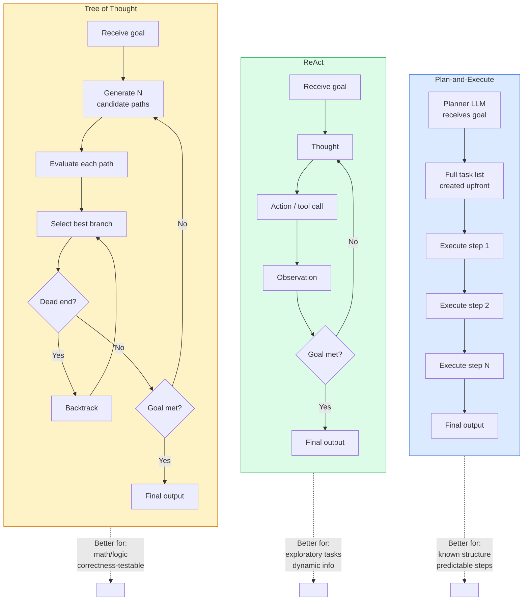
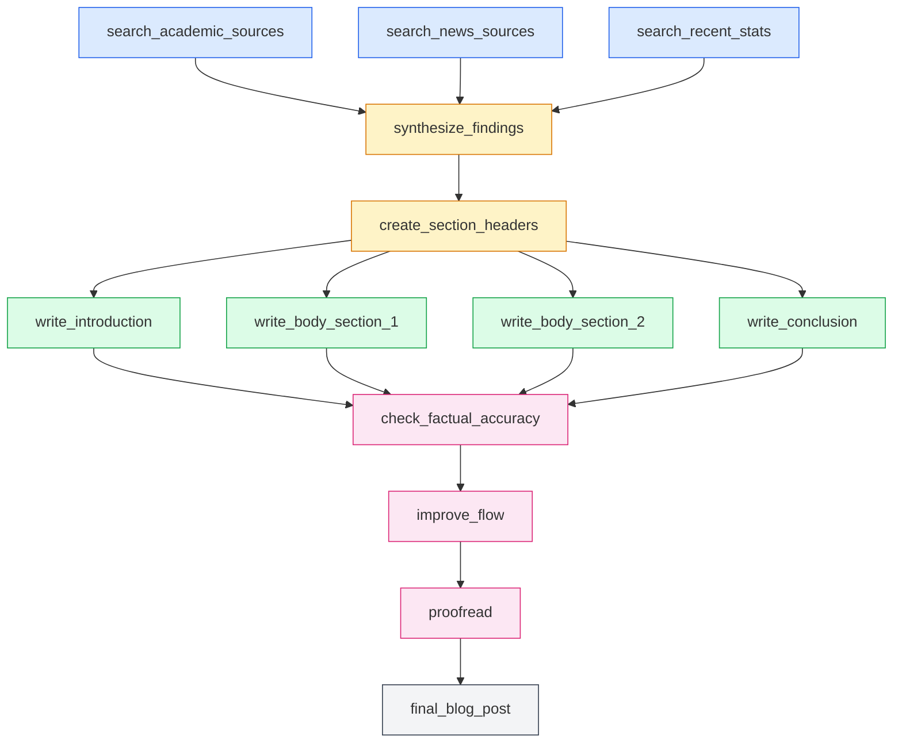

# Week 4: Planning and Complex Reasoning

> **Theme: Agents that think before they act**

By the end of this week, you will understand how to build AI agents that construct explicit plans before executing them, decompose complex tasks into manageable subtasks with dependency tracking, and critique their own outputs to improve quality iteratively.

---

## 4.1 Planning Architectures

### Overview

When a human tackles a complex project — say, organizing a conference — they do not simply start typing emails at random. They first enumerate what needs to happen, identify which tasks depend on others, and then work through the list systematically. Modern AI agents benefit from the same discipline. **Planning architectures** are structural patterns that govern how an agent decides what to do next.

Three dominant architectures have emerged from research and practice: **Plan-and-Execute**, **ReAct**, and **Tree of Thought**. Each makes different tradeoffs between upfront planning cost and adaptability to new information.

### Plan-and-Execute

In the **Plan-and-Execute** architecture, a dedicated *planner LLM* reads the user's goal and emits a complete, ordered task list before any execution begins. A separate *executor LLM* (or the same model in a different role) then works through the steps one by one, treating the plan as a contract.

**Why separate planner from executor?** Because the cognitive demands are different. Planning requires wide context: understanding the full goal, anticipating dependencies, and structuring work. Execution requires narrow context: just the current step and any tool results. Keeping them separate lets each do its job better and avoids the planner's reasoning being contaminated by low-level execution details.

**Best for:** Tasks with known structure where the required steps are predictable upfront. Examples include: generating a research report (the sections are known), refactoring a codebase (the transformation steps are enumerable), or producing a multi-section legal document.

**Weakness:** If step 3 uncovers information that invalidates the plan, the executor either plows forward incorrectly or must trigger a full replan — an expensive operation.

### ReAct

**ReAct** (Reasoning + Acting) interleaves thinking and action in a tight loop. At each turn, the agent produces a *Thought* (reasoning about what to do), an *Action* (a tool call or decision), and then observes the *Observation* (the tool's result). The next thought incorporates the latest observation, so the plan emerges incrementally rather than being fixed upfront.

The pattern looks like:

```
Thought: I need to find the population of Tokyo.
Action: search("Tokyo population 2024")
Observation: "Tokyo's population is approximately 13.96 million in the city proper..."
Thought: Now I have the population. I should also find the GDP.
Action: search("Tokyo GDP 2024")
...
```

**Best for:** Exploratory tasks where the right next step depends on what you discover. Web research, debugging unknown codebases, and open-ended data analysis all fit this pattern well.

**Weakness:** Because there is no global plan, ReAct agents can lose track of the big picture, revisit the same ground, or fail to recognize when they have gathered enough information to stop.

### Tree of Thought

**Tree of Thought (ToT)** treats reasoning as a search problem. The agent generates *N* candidate reasoning paths from the current state, evaluates each one (using the model itself as an evaluator or using a reward signal), selects the most promising branch, and continues expanding from there. If a branch reaches a dead end, the agent **backtracks** to the last good state and tries a different branch.

This is directly analogous to how a chess engine explores move trees, or how a programmer mentally explores multiple approaches before committing to one.

**Best for:** Tasks with a well-defined correctness criterion and where wrong early decisions are hard to recover from. Mathematical proofs, logic puzzles, code synthesis with correctness tests, and multi-step planning in constrained domains all benefit from ToT.

**Weakness:** Computationally expensive. Generating and evaluating N branches per step multiplies token usage quickly. For N=3 branches and 5 steps, you may need 15x the tokens of a linear approach.

### Graph of Thought

**Graph of Thought (GoT)** extends Tree of Thought by allowing reasoning nodes to *merge* and *split* in non-linear ways. Two separate reasoning threads can combine their conclusions into a single node, or a single node can fork into parallel sub-investigations. This mirrors how human brainstorming actually works: you might pursue two ideas independently, then synthesize them into a third idea that neither alone could have reached.

GoT is more expressive than ToT but also harder to implement and debug. It is an active area of research as of 2024-2025.

### When Is Planning Overhead Worth It?

Planning adds latency and token cost. It pays for itself when:

1. **The task has 5 or more distinct steps** — the coordination benefit exceeds the planning cost.
2. **Early decisions constrain later steps** — if choosing the wrong data source in step 1 makes steps 4-7 meaningless, you need a plan that catches this.
3. **The task is parallelizable** — a plan makes parallel execution possible; without one, you execute sequentially by default.
4. **Failure is costly** — a plan lets you validate the approach before committing expensive tool calls.

For simple 1-3 step tasks, skip planning and use direct prompting. Overthinking simple tasks reliably degrades output quality.

### Architecture Comparison Diagram



### Code Example: Simple Plan-and-Execute Skeleton

```python
"""
plan_and_execute.py
Minimal Plan-and-Execute agent using the Anthropic SDK.
The planner returns a structured JSON plan; the executor runs each step.
"""

import anthropic
import json

client = anthropic.Anthropic()


def plan(goal: str) -> list[dict]:
    """Ask the planner LLM to produce a structured task list."""
    response = client.messages.create(
        model="claude-sonnet-4-5",
        max_tokens=1024,
        messages=[
            {
                "role": "user",
                "content": (
                    f"You are a planning assistant. Break the following goal into "
                    f"a JSON array of steps. Each step has: id (int), description (str), "
                    f"depends_on (list of ids). Output ONLY valid JSON.\n\nGoal: {goal}"
                ),
            }
        ],
    )
    raw = response.content[0].text.strip()
    # Strip markdown code fences if present
    if raw.startswith("```"):
        raw = raw.split("```")[1]
        if raw.startswith("json"):
            raw = raw[4:]
    return json.loads(raw)


def execute_step(step: dict, prior_results: dict) -> str:
    """Execute a single step, given results from prior steps."""
    context = "\n".join(
        f"Step {sid} result: {result}" for sid, result in prior_results.items()
    )
    response = client.messages.create(
        model="claude-sonnet-4-5",
        max_tokens=512,
        messages=[
            {
                "role": "user",
                "content": (
                    f"You are executing step {step['id']} of a plan.\n"
                    f"Step: {step['description']}\n"
                    f"Context from prior steps:\n{context}\n\n"
                    f"Complete this step and return a concise result."
                ),
            }
        ],
    )
    return response.content[0].text.strip()


def run_plan_and_execute(goal: str) -> dict:
    """Full plan-and-execute loop."""
    print(f"Planning for goal: {goal}\n")
    steps = plan(goal)
    print(f"Plan created with {len(steps)} steps:")
    for s in steps:
        print(f"  Step {s['id']}: {s['description']} (depends on: {s['depends_on']})")

    results = {}
    # Naive sequential execution (topological sort covered in 4.2)
    for step in steps:
        print(f"\nExecuting step {step['id']}...")
        results[step["id"]] = execute_step(step, {
            sid: results[sid] for sid in step["depends_on"] if sid in results
        })
        print(f"  Result: {results[step['id']][:100]}...")

    return results


if __name__ == "__main__":
    final = run_plan_and_execute("Write a short blog post about the history of jazz music")
    print("\n=== Final Results ===")
    for step_id, result in final.items():
        print(f"Step {step_id}: {result[:200]}")
```

> **Key Insight:** The planner and executor are logically separate even when the same model handles both roles. Prompt engineering creates this separation: the planner prompt emphasizes breadth and structure, while executor prompts emphasize completing a specific step given a narrow context window.

> **Key Insight:** ReAct is not strictly inferior to Plan-and-Execute — it is better calibrated for tasks where the environment is unknown. A web research agent cannot know upfront what it will find; the plan must emerge from discoveries. Reserve Plan-and-Execute for tasks where the domain is well-understood.

> **Key Insight:** Tree of Thought's evaluation step is the key innovation. Without evaluation, generating N paths just gives you N random guesses. The evaluation function — which can be as simple as asking the model "which of these approaches is most likely to succeed and why?" — transforms the search from random to directed.

### Chapter Checkpoint

1. A user asks an agent to "book the cheapest flight from Seattle to Tokyo for next month." Would you use Plan-and-Execute or ReAct? Justify your choice based on what information the agent needs to discover during execution.

2. Explain why Tree of Thought uses significantly more tokens than ReAct for a 5-step problem with N=3 candidate branches per step. Calculate the approximate token multiplier.

3. In the Plan-and-Execute skeleton above, the executor receives only results from steps listed in `depends_on`. What bug could this cause, and how would you fix it?

---

## 4.2 Task Decomposition

### Overview

Planning architectures describe the *control flow* of an agent. Task decomposition describes how a complex goal is *broken into pieces*. These are complementary concerns: you need both a good plan structure and a good decomposition of the work within that structure.

**Task decomposition** is the process of converting a high-level goal into a set of concrete, executable subtasks with explicit relationships between them. Done well, it enables parallelism, clarifies dependencies, makes progress measurable, and allows partial failure recovery.

### Hierarchical Decomposition

**Hierarchical decomposition** starts with the top-level goal and recursively breaks it into sub-goals until each leaf node is a single, concrete action that a tool or LLM call can directly execute.

Consider "write a blog post about climate change":

```
write_blog_post
├── research_topic
│   ├── search_academic_sources
│   ├── search_news_sources
│   └── synthesize_findings
├── outline
│   └── create_section_headers
├── write_content
│   ├── write_introduction
│   ├── write_body_section_1
│   ├── write_body_section_2
│   └── write_conclusion
└── edit
    ├── check_factual_accuracy
    ├── improve_flow
    └── proofread
```

Each leaf node is small enough to complete in a single LLM call with a focused prompt. The parent nodes are checkpoints: when all children complete, the parent is "done."

### Dependency Graphs

Not all subtasks are equal in their relationships to each other. Some subtasks **block** others: you cannot write the body before you have finished the outline, and you cannot write the outline before you have finished the research. Other subtasks are **parallel**: once you have an outline, you can write the introduction and the first body section simultaneously.

This structure is best represented as a **Directed Acyclic Graph (DAG)**. Nodes are tasks; directed edges point from prerequisite to dependent. "Acyclic" means no circular dependencies — you cannot have task A require B which requires A.

The DAG representation uses a simple data format:

```json
{
  "task_id": "write_introduction",
  "description": "Write the blog post introduction (~150 words)",
  "depends_on": ["create_section_headers"]
}
```

### DAG Diagram: Research and Write a Blog Post



In this diagram, A, B, and C can all run in parallel (they have no dependencies on each other). F, G, H, and I can all run in parallel once E completes. The editing phase (J, K, L) is strictly sequential because each step depends on the previous.

### Topological Sort for Execution Order

To execute a DAG, you need to determine a valid **topological order**: an ordering where every task appears after all of its dependencies. In practice, you want to find all tasks whose dependencies are already complete at each moment, run them in parallel, then repeat.

```python
"""
dag_executor.py
DAG-based task executor with topological sort and parallel-ready scheduling.
"""

from collections import defaultdict, deque
from dataclasses import dataclass, field
from typing import Callable


@dataclass
class Task:
    task_id: str
    description: str
    depends_on: list[str] = field(default_factory=list)
    result: str | None = None
    status: str = "pending"  # pending | ready | running | done | failed


def build_dag(task_list: list[dict]) -> dict[str, Task]:
    """Convert a list of task dicts into a Task graph."""
    return {t["task_id"]: Task(**t) for t in task_list}


def get_ready_tasks(dag: dict[str, Task]) -> list[Task]:
    """Return all tasks whose dependencies are complete."""
    ready = []
    for task in dag.values():
        if task.status != "pending":
            continue
        deps_done = all(
            dag[dep].status == "done" for dep in task.depends_on
        )
        if deps_done:
            ready.append(task)
    return ready


def topological_sort(dag: dict[str, Task]) -> list[str]:
    """
    Kahn's algorithm for topological sort.
    Returns an ordered list of task IDs.
    Raises ValueError if the graph has a cycle.
    """
    in_degree = {tid: 0 for tid in dag}
    children = defaultdict(list)

    for task in dag.values():
        for dep in task.depends_on:
            children[dep].append(task.task_id)
            in_degree[task.task_id] += 1

    queue = deque([tid for tid, deg in in_degree.items() if deg == 0])
    order = []

    while queue:
        tid = queue.popleft()
        order.append(tid)
        for child in children[tid]:
            in_degree[child] -= 1
            if in_degree[child] == 0:
                queue.append(child)

    if len(order) != len(dag):
        raise ValueError("DAG contains a cycle — invalid task graph")

    return order


def execute_dag(
    dag: dict[str, Task],
    executor_fn: Callable[[Task, dict[str, str]], str],
) -> dict[str, str]:
    """
    Execute tasks in topological order.
    executor_fn receives the current task and a dict of prior results.
    Returns a dict mapping task_id -> result string.
    """
    order = topological_sort(dag)
    results: dict[str, str] = {}

    for tid in order:
        task = dag[tid]
        task.status = "running"
        prior = {dep: results[dep] for dep in task.depends_on}
        try:
            result = executor_fn(task, prior)
            task.result = result
            task.status = "done"
            results[tid] = result
            print(f"[DONE] {tid}")
        except Exception as e:
            task.status = "failed"
            print(f"[FAIL] {tid}: {e}")
            # Dynamic replanning hook — covered in next section
            raise

    return results


# Example usage
if __name__ == "__main__":
    blog_post_tasks = [
        {"task_id": "search_sources", "description": "Search for sources on jazz history", "depends_on": []},
        {"task_id": "synthesize", "description": "Synthesize research findings", "depends_on": ["search_sources"]},
        {"task_id": "outline", "description": "Create section headers", "depends_on": ["synthesize"]},
        {"task_id": "write_intro", "description": "Write introduction", "depends_on": ["outline"]},
        {"task_id": "write_body", "description": "Write body sections", "depends_on": ["outline"]},
        {"task_id": "write_conclusion", "description": "Write conclusion", "depends_on": ["outline"]},
        {"task_id": "edit", "description": "Edit and proofread full draft", "depends_on": ["write_intro", "write_body", "write_conclusion"]},
    ]

    dag = build_dag(blog_post_tasks)
    sort_order = topological_sort(dag)
    print("Execution order:", sort_order)
```

### Dynamic Replanning

A static plan assumes the world behaves as expected. In practice, step 3 might return no useful results, a tool might fail, or new information might make the remaining plan irrelevant.

**Dynamic replanning** is the process of revising the remaining plan mid-execution in response to unexpected outcomes. The mechanism is straightforward:

1. A step fails or produces unexpected output.
2. The agent calls the planner LLM again with: (a) the original goal, (b) completed steps and their results, (c) a description of what went wrong.
3. The planner revises only the remaining steps, preserving completed work.
4. Execution resumes with the revised plan.

```python
"""
dynamic_replan.py
Shows how to trigger replanning when a step fails.
"""
import anthropic
import json

client = anthropic.Anthropic()


def replan(
    original_goal: str,
    completed_steps: list[dict],
    failed_step: dict,
    failure_reason: str,
) -> list[dict]:
    """Call the planner to revise the plan after a failure."""
    completed_summary = "\n".join(
        f"- Step {s['id']} ({s['description']}): DONE" for s in completed_steps
    )
    prompt = (
        f"Original goal: {original_goal}\n\n"
        f"Completed steps:\n{completed_summary}\n\n"
        f"Failed step: {failed_step['description']}\n"
        f"Failure reason: {failure_reason}\n\n"
        f"Please provide a revised plan for the REMAINING steps only. "
        f"Return a JSON array of steps with id, description, depends_on fields."
    )
    response = client.messages.create(
        model="claude-sonnet-4-5",
        max_tokens=1024,
        messages=[{"role": "user", "content": prompt}],
    )
    raw = response.content[0].text.strip()
    if raw.startswith("```"):
        raw = raw.split("```")[1]
        if raw.startswith("json"):
            raw = raw[4:]
    return json.loads(raw)
```

### Meta-Planner Pattern

In more sophisticated systems, a **meta-planner** — a planning LLM that writes plans *for another LLM to execute* — sits at the top of the hierarchy. The meta-planner understands the capabilities and limitations of the executor and crafts plans that play to its strengths.

This separation is powerful because the meta-planner can be a larger, more capable model (used once) while the executor is a smaller, faster model (used many times), keeping cost and latency manageable.

> **Key Insight:** The DAG representation makes parallelism explicit. In a sequential list of steps, parallelism opportunities are invisible. In a DAG, any two nodes with no dependency path between them can run simultaneously. This is why structured decomposition produces faster agents, not just more organized ones.

> **Key Insight:** Dynamic replanning should be triggered selectively. Replanning after every minor deviation is expensive and can cause the agent to thrash. A good heuristic: replan only when the current results make 2 or more remaining steps invalid, or when the estimated quality of the final output drops below an acceptable threshold.

> **Key Insight:** Topological sort is not just an academic exercise — it is the engine that makes DAG execution correct. Without it, an executor might attempt a step before its dependencies complete, producing garbage input and garbage output. Always validate your DAG for cycles before execution begins.

### Chapter Checkpoint

1. A task graph has these dependencies: A→C, B→C, C→D, C→E, D→F, E→F. Draw this DAG and identify which tasks can run in parallel. What is the minimum number of sequential "rounds" needed to complete all tasks?

2. In the `topological_sort` function above, what does it mean if `len(order) != len(dag)` after Kahn's algorithm completes? Give a concrete example of a task graph that would trigger this condition.

3. Why is dynamic replanning more valuable for a web research agent than for a code generation agent? What property of each domain drives this difference?

---

## 4.3 Reflection and Self-Critique

### Overview

Even excellent planners and executors make mistakes. An agent that finishes a task and immediately returns the output has no mechanism for catching its own errors. **Reflection and self-critique** patterns give agents the ability to evaluate their own outputs, identify weaknesses, and revise — without requiring human intervention.

This is not just a quality improvement technique. It is a fundamental shift in agent architecture: from *generate-and-return* to *generate-evaluate-revise*.

### The Reflexion Pattern

**Reflexion** (introduced by Shinn et al., 2023) is a three-stage loop:

1. **Attempt:** The agent tries to complete the task.
2. **Reflect:** After the attempt (successful or not), a reflection prompt asks the agent: "What went wrong? What would you do differently on the next attempt?"
3. **Store and prepend:** The reflection is stored in a memory buffer. On the next attempt, the reflection is prepended to the context as an "episodic memory" that guides improved behavior.

The key insight is that verbal self-reflection produces better next attempts than silent retry. By articulating what went wrong, the agent externalizes its error into the context window where it can influence future reasoning.

```python
"""
reflexion.py
Implementation of the Reflexion self-improvement loop.
"""
import anthropic

client = anthropic.Anthropic()


def attempt_task(task: str, reflections: list[str]) -> str:
    """Attempt the task, optionally informed by prior reflections."""
    reflection_context = ""
    if reflections:
        reflection_context = (
            "Before attempting this task, review your reflections from prior attempts:\n"
            + "\n".join(f"Reflection {i+1}: {r}" for i, r in enumerate(reflections))
            + "\n\nNow attempt the task with these lessons in mind.\n\n"
        )

    response = client.messages.create(
        model="claude-sonnet-4-5",
        max_tokens=1024,
        messages=[
            {
                "role": "user",
                "content": f"{reflection_context}Task: {task}",
            }
        ],
    )
    return response.content[0].text.strip()


def reflect(task: str, attempt_result: str, success_criteria: str) -> str:
    """
    Ask the model to reflect on what went wrong and what it would do differently.
    Returns a verbal reflection to store for the next attempt.
    """
    response = client.messages.create(
        model="claude-sonnet-4-5",
        max_tokens=512,
        messages=[
            {
                "role": "user",
                "content": (
                    f"Task: {task}\n\n"
                    f"Your attempt:\n{attempt_result}\n\n"
                    f"Success criteria: {success_criteria}\n\n"
                    f"Reflect honestly: What did you do well? What went wrong? "
                    f"What specific changes would improve the next attempt? "
                    f"Be concrete and actionable."
                ),
            }
        ],
    )
    return response.content[0].text.strip()


def reflexion_loop(
    task: str,
    success_criteria: str,
    max_attempts: int = 3,
) -> tuple[str, list[str]]:
    """
    Run the Reflexion loop for up to max_attempts iterations.
    Returns the final attempt result and the list of reflections.
    """
    reflections = []
    best_result = ""

    for attempt_num in range(1, max_attempts + 1):
        print(f"\n=== Attempt {attempt_num} ===")
        result = attempt_task(task, reflections)
        best_result = result
        print(f"Result preview: {result[:200]}...")

        if attempt_num < max_attempts:
            # Reflect before the next attempt
            reflection = reflect(task, result, success_criteria)
            reflections.append(reflection)
            print(f"Reflection: {reflection[:200]}...")

    return best_result, reflections


if __name__ == "__main__":
    final_result, all_reflections = reflexion_loop(
        task="Explain quantum entanglement to a 12-year-old in exactly 3 paragraphs",
        success_criteria=(
            "Uses no jargon. Each paragraph is 2-4 sentences. "
            "Includes a concrete analogy. Ends with why it matters."
        ),
        max_attempts=3,
    )
    print("\n=== Final Output ===")
    print(final_result)
```

### Self-Critique Loop

The **self-critique loop** is a targeted variant of Reflexion where the critique is structured around finding specific types of flaws rather than open-ended reflection. The classic formulation asks the model to "find 3 flaws in this answer" before revising.

The structured critique is more reliable than open-ended reflection because it forces the model to produce a minimum number of critiques, preventing it from taking the easy path of claiming the output is already perfect.

```python
"""
self_critique.py
Structured self-critique: generate → find flaws → revise.
"""
import anthropic

client = anthropic.Anthropic()


def generate(prompt: str) -> str:
    """Generate an initial answer."""
    response = client.messages.create(
        model="claude-sonnet-4-5",
        max_tokens=1024,
        messages=[{"role": "user", "content": prompt}],
    )
    return response.content[0].text.strip()


def critique(answer: str, num_flaws: int = 3) -> str:
    """Ask the model to identify specific flaws in its answer."""
    response = client.messages.create(
        model="claude-sonnet-4-5",
        max_tokens=512,
        messages=[
            {
                "role": "user",
                "content": (
                    f"Here is an answer:\n\n{answer}\n\n"
                    f"Identify exactly {num_flaws} concrete flaws, weaknesses, or "
                    f"inaccuracies in this answer. Number them. Be specific and critical."
                ),
            }
        ],
    )
    return response.content[0].text.strip()


def revise(original_prompt: str, answer: str, critique_text: str) -> str:
    """Revise the answer addressing the identified flaws."""
    response = client.messages.create(
        model="claude-sonnet-4-5",
        max_tokens=1024,
        messages=[
            {
                "role": "user",
                "content": (
                    f"Original question: {original_prompt}\n\n"
                    f"Your initial answer:\n{answer}\n\n"
                    f"Critique of your answer:\n{critique_text}\n\n"
                    f"Now write an improved answer that addresses all the critiques."
                ),
            }
        ],
    )
    return response.content[0].text.strip()


def self_critique_loop(prompt: str, rounds: int = 2) -> str:
    """Run the full generate → critique → revise loop."""
    answer = generate(prompt)
    print(f"Initial answer:\n{answer[:300]}...\n")

    for round_num in range(1, rounds + 1):
        print(f"--- Critique round {round_num} ---")
        critique_text = critique(answer)
        print(f"Critique:\n{critique_text}\n")
        answer = revise(prompt, answer, critique_text)
        print(f"Revised answer:\n{answer[:300]}...\n")

    return answer
```

### Constitutional Self-Correction

**Constitutional self-correction** goes further by checking outputs against a structured rubric — a "constitution" of requirements. Rather than asking for open-ended flaws, the model checks each criterion explicitly:

| Criterion | Check |
|---|---|
| Factual accuracy | "Are all claims in this answer verifiable and accurate?" |
| Completeness | "Does this answer address all parts of the question?" |
| Safety | "Does this answer contain harmful, biased, or inappropriate content?" |
| Clarity | "Is this answer understandable to the target audience?" |

```python
"""
constitutional_correction.py
Constitutional self-correction against a rubric.
"""
import anthropic
import json

client = anthropic.Anthropic()

CONSTITUTION = [
    "ACCURATE: All factual claims are correct and verifiable.",
    "COMPLETE: All parts of the question are addressed.",
    "CLEAR: The answer is understandable to the intended audience.",
    "CONCISE: No unnecessary repetition or padding.",
    "SAFE: No harmful, biased, or inappropriate content.",
]


def check_constitution(answer: str, constitution: list[str]) -> dict:
    """
    Check the answer against each constitutional criterion.
    Returns a dict with pass/fail and explanation for each.
    """
    criteria_text = "\n".join(f"{i+1}. {c}" for i, c in enumerate(constitution))
    response = client.messages.create(
        model="claude-sonnet-4-5",
        max_tokens=1024,
        messages=[
            {
                "role": "user",
                "content": (
                    f"Evaluate this answer against each criterion. "
                    f"For each, output JSON: {{\"criterion\": ..., \"pass\": true/false, \"issue\": ...}}\n\n"
                    f"Answer to evaluate:\n{answer}\n\n"
                    f"Criteria:\n{criteria_text}\n\n"
                    f"Output a JSON array of evaluation objects."
                ),
            }
        ],
    )
    raw = response.content[0].text.strip()
    if raw.startswith("```"):
        raw = raw.split("```")[1]
        if raw.startswith("json"):
            raw = raw[4:]
    return json.loads(raw)


def constitutional_correct(prompt: str, answer: str) -> str:
    """Apply constitutional correction to an answer."""
    evaluations = check_constitution(answer, CONSTITUTION)
    failures = [e for e in evaluations if not e.get("pass", True)]

    if not failures:
        print("All criteria passed. No corrections needed.")
        return answer

    issues = "\n".join(f"- {f['criterion']}: {f['issue']}" for f in failures)
    print(f"Found {len(failures)} issues:\n{issues}")

    response = client.messages.create(
        model="claude-sonnet-4-5",
        max_tokens=1024,
        messages=[
            {
                "role": "user",
                "content": (
                    f"Original question: {prompt}\n\n"
                    f"Current answer:\n{answer}\n\n"
                    f"Issues to fix:\n{issues}\n\n"
                    f"Rewrite the answer fixing all listed issues."
                ),
            }
        ],
    )
    return response.content[0].text.strip()
```

### When Reflection Helps — and When It Hurts

The research on self-critique has a crucial nuance: **reflection helps on complex tasks but hurts on simple ones**.

For a simple factual question like "What is the capital of France?", asking the model to find 3 flaws in "Paris" will produce hallucinated flaws and a worse answer. The model feels compelled to find flaws where none exist, and ends up introducing doubt or errors.

The guideline is:

- **Use reflection when:** the task has multiple steps, the quality criterion is complex or multi-dimensional, initial answers are consistently below acceptable quality, or failure is costly.
- **Skip reflection when:** the task is a single-hop lookup, the domain has well-established right answers that a capable model already knows, or latency is the primary constraint.

A practical heuristic: if a competent human could complete the task correctly in under 10 seconds without deliberation, skip reflection.

> **Key Insight:** Reflexion's power comes from turning implicit knowledge ("I made a mistake") into explicit context ("I made a mistake because X, and next time I should do Y"). LLMs are context-driven: what is written in the prompt shapes the response. By writing the lesson down, Reflexion makes it available to influence the next generation.

> **Key Insight:** The self-critique loop requires the model to critique its own work, which creates a conflict of interest. Models tend to be less critical of their own output than of others'. You can mitigate this by framing the critique as if evaluating someone else's work: "A student submitted this answer. Find 3 flaws a strict professor would penalize."

> **Key Insight:** Constitutional self-correction is most valuable when the constitution is application-specific. A generic "is this good?" check is weak. A constitution tailored to your use case — "does this medical advice include a disclaimer?" or "does this code include error handling?" — produces much more actionable critique.

### Chapter Checkpoint

1. Implement a two-round Reflexion loop for the task of "write a haiku about machine learning." After the first attempt and reflection, what types of issues is the reflection most likely to identify?

2. The self-critique prompt asks for "exactly 3 flaws." Why is the fixed number important? What happens to critique quality when the number is left open-ended?

3. For constitutional self-correction, why is it better to check each criterion independently (as in the rubric approach) rather than asking the model "is this answer good?" in a single holistic check?

---

## Lab Walkthrough: Plan-and-Execute Agent with Self-Critique

This lab builds a complete planning agent that: (1) takes a topic as input, (2) creates a structured JSON plan with steps and dependencies, (3) executes each step using appropriate prompts, and (4) runs a self-critique pass on the final output.

### Prerequisites

```bash
pip install anthropic
```

### Step 1: Set Up the Project Structure

```bash
mkdir week4-lab
cd week4-lab
touch planner.py executor.py critique.py main.py
```

### Step 2: Implement the Planner

Create `planner.py` with a prompt that elicits structured JSON output:

```python
"""
planner.py
Planner LLM that returns a structured JSON task plan.
"""
import anthropic
import json
from typing import TypedDict

client = anthropic.Anthropic()


class TaskSpec(TypedDict):
    task_id: str
    description: str
    depends_on: list[str]
    tool: str  # "search" | "write" | "summarize" | "critique"


PLANNER_SYSTEM = """You are a task planning expert. When given a goal, you produce a 
structured execution plan as a JSON array. Each task has:
- task_id: unique snake_case identifier
- description: what to do (1 sentence, specific and actionable)
- depends_on: list of task_ids that must complete first ([] if none)
- tool: one of "search", "write", "summarize", "critique"

Rules:
1. Decompose the goal into 5-10 tasks
2. Identify all dependencies correctly
3. Make parallel tasks explicit by having them share the same dependency set
4. The final task must have tool "critique"
5. Output ONLY valid JSON, no explanation"""


def create_plan(goal: str) -> list[TaskSpec]:
    """Ask the planner LLM to create a structured task plan."""
    response = client.messages.create(
        model="claude-sonnet-4-5",
        max_tokens=2048,
        system=PLANNER_SYSTEM,
        messages=[{"role": "user", "content": f"Goal: {goal}"}],
    )
    raw = response.content[0].text.strip()
    # Remove markdown fences if present
    if "```" in raw:
        parts = raw.split("```")
        for part in parts:
            part = part.strip()
            if part.startswith("json"):
                part = part[4:].strip()
            if part.startswith("["):
                raw = part
                break
    return json.loads(raw)


def display_plan(plan: list[TaskSpec]) -> None:
    """Pretty-print the plan to the console."""
    print("\n=== EXECUTION PLAN ===")
    for task in plan:
        deps = ", ".join(task["depends_on"]) if task["depends_on"] else "none"
        print(f"  [{task['task_id']}] ({task['tool']})")
        print(f"    {task['description']}")
        print(f"    depends on: {deps}")
    print("=" * 40)
```

### Step 3: Implement the DAG Executor

Create `executor.py` with topological sort and per-tool execution logic:

```python
"""
executor.py
DAG executor with topological sort and per-tool LLM dispatch.
"""
import anthropic
from collections import defaultdict, deque

client = anthropic.Anthropic()


def topological_sort(tasks: list[dict]) -> list[dict]:
    """Sort tasks so each appears after all its dependencies."""
    task_map = {t["task_id"]: t for t in tasks}
    in_degree = {t["task_id"]: 0 for t in tasks}
    children = defaultdict(list)

    for task in tasks:
        for dep in task["depends_on"]:
            children[dep].append(task["task_id"])
            in_degree[task["task_id"]] += 1

    queue = deque([tid for tid, deg in in_degree.items() if deg == 0])
    order = []

    while queue:
        tid = queue.popleft()
        order.append(task_map[tid])
        for child in children[tid]:
            in_degree[child] -= 1
            if in_degree[child] == 0:
                queue.append(child)

    if len(order) != len(tasks):
        raise ValueError("Cycle detected in task graph")

    return order


def execute_task(task: dict, results: dict[str, str]) -> str:
    """Execute a single task given its tool type and prior results."""
    tool = task["tool"]
    description = task["description"]

    # Build context from dependencies
    dep_context = ""
    if task["depends_on"]:
        dep_context = "\n\nContext from prerequisite steps:\n"
        for dep_id in task["depends_on"]:
            if dep_id in results:
                dep_context += f"\n[{dep_id}]: {results[dep_id]}\n"

    tool_prompts = {
        "search": (
            f"You are a research assistant. Simulate finding relevant information for: "
            f"{description}{dep_context}\n\nProvide detailed, factual information."
        ),
        "write": (
            f"You are a skilled writer. Complete this writing task: "
            f"{description}{dep_context}\n\nWrite the content now."
        ),
        "summarize": (
            f"You are an expert at synthesis. Summarize and integrate: "
            f"{description}{dep_context}\n\nProvide a clear synthesis."
        ),
        "critique": (
            f"You are a quality reviewer. {description}{dep_context}\n\n"
            f"Identify 3 specific improvements, then provide the revised final output."
        ),
    }

    prompt = tool_prompts.get(tool, f"Complete this task: {description}{dep_context}")

    response = client.messages.create(
        model="claude-sonnet-4-5",
        max_tokens=1024,
        messages=[{"role": "user", "content": prompt}],
    )
    return response.content[0].text.strip()


def run_dag(tasks: list[dict]) -> dict[str, str]:
    """Execute all tasks in topological order."""
    ordered = topological_sort(tasks)
    results = {}

    for task in ordered:
        tid = task["task_id"]
        tool = task["tool"]
        print(f"\n[EXECUTING] {tid} (tool: {tool})")
        result = execute_task(task, results)
        results[tid] = result
        print(f"[DONE] {tid}: {result[:100]}...")

    return results
```

### Step 4: Implement the Reflexion Self-Critique Pass

Create `critique.py`:

```python
"""
critique.py
Reflexion-style self-critique pass on the final output.
"""
import anthropic

client = anthropic.Anthropic()


def reflexion_critique(
    original_goal: str,
    final_output: str,
    execution_log: dict[str, str],
) -> tuple[str, str]:
    """
    Run a Reflexion-style critique on the final output.
    Returns (critique_text, improved_output).
    """
    # Step 1: Generate critique
    critique_response = client.messages.create(
        model="claude-sonnet-4-5",
        max_tokens=768,
        messages=[
            {
                "role": "user",
                "content": (
                    f"Original goal: {original_goal}\n\n"
                    f"Final output:\n{final_output}\n\n"
                    f"Critically evaluate the final output against the original goal. "
                    f"List exactly 3 specific weaknesses. For each, explain what is wrong "
                    f"and what a better version would include."
                ),
            }
        ],
    )
    critique_text = critique_response.content[0].text.strip()

    # Step 2: Generate improved output
    improved_response = client.messages.create(
        model="claude-sonnet-4-5",
        max_tokens=1024,
        messages=[
            {
                "role": "user",
                "content": (
                    f"Original goal: {original_goal}\n\n"
                    f"Current output:\n{final_output}\n\n"
                    f"Weaknesses identified:\n{critique_text}\n\n"
                    f"Rewrite the output to address all three weaknesses. "
                    f"Preserve what was already good."
                ),
            }
        ],
    )
    improved_output = improved_response.content[0].text.strip()

    return critique_text, improved_output
```

### Step 5: Wire It All Together

Create `main.py`:

```python
"""
main.py
Full plan-and-execute agent with Reflexion self-critique.
"""
import sys
from planner import create_plan, display_plan
from executor import run_dag
from critique import reflexion_critique


def run_agent(goal: str) -> str:
    """Run the full plan-and-execute-critique pipeline."""
    print(f"\nGoal: {goal}")

    # Phase 1: Plan
    print("\n--- PHASE 1: PLANNING ---")
    plan = create_plan(goal)
    display_plan(plan)

    # Phase 2: Execute
    print("\n--- PHASE 2: EXECUTION ---")
    results = run_dag(plan)

    # Find the last task's result as the "final output"
    last_task_id = list(results.keys())[-1]
    final_output = results[last_task_id]

    # Phase 3: Self-Critique
    print("\n--- PHASE 3: SELF-CRITIQUE ---")
    critique, improved = reflexion_critique(goal, final_output, results)
    print(f"\nCritique:\n{critique}\n")
    print(f"\nImproved Output:\n{improved}")

    return improved


if __name__ == "__main__":
    topic = sys.argv[1] if len(sys.argv) > 1 else "the environmental impact of electric vehicles"
    result = run_agent(f"Research and write a 400-word blog post about: {topic}")
    print("\n=== FINAL RESULT ===")
    print(result)
```

### Step 6: Run the Agent

```bash
python main.py "the history of the internet"
```

You should see the agent:
1. Generate a 6-8 step JSON plan with dependencies
2. Execute tasks in topological order
3. Produce an initial output
4. Critique it for 3 specific weaknesses
5. Return an improved final output

### Step 7: Experiment and Extend

- Try changing `max_attempts` in the Reflexion loop to see how quality evolves over 3 rounds
- Add actual web search via the Brave Search API or Tavily to replace the simulated search tool
- Implement parallel execution using `asyncio.gather` for tasks with the same dependency set
- Add a `--verbose` flag that prints the full result of each task step

---

## Further Reading

1. **"Reflexion: Language Agents with Verbal Reinforcement Learning"** — Noah Shinn, Federico Cassano, Edward Berman, et al. (2023). The original Reflexion paper. Available on arXiv (2303.11366). Introduces the verbal reinforcement loop that underlies the reflection patterns in this chapter.

2. **"Tree of Thoughts: Deliberate Problem Solving with Large Language Models"** — Shunyu Yao, Dian Yu, Jeffrey Zhao, Izhak Shpitser, et al. (2023). arXiv 2305.10601. Defines the ToT framework and benchmarks it on math and creative writing tasks.

3. **"Plan-and-Solve Prompting: Improving Zero-Shot Chain-of-Thought Reasoning by Large Language Models"** — Zhenru Wang, et al. (2023). arXiv 2305.04091. Empirical analysis of when planning before execution improves LLM reasoning.

4. **"Building LLM Applications for Production"** — Chip Huyen (2023). Blog series at huyenchip.com. Practical engineering perspective on planning architectures, with focus on failure modes and production reliability. Chapter on agents is especially relevant.

5. **"Constitutional AI: Harmlessness from AI Feedback"** — Yuntao Bai, Saurav Kadavath, Sandipan Kundu, et al. Anthropic (2022). arXiv 2212.08073. Foundational paper for constitutional self-correction; explains how rule-based self-critique can improve both safety and quality of AI outputs.

---

## Week Summary

- **Planning architectures differ in when the plan is created.** Plan-and-Execute creates the full plan upfront (best for structured tasks), ReAct interleaves planning and acting (best for exploratory tasks), and Tree of Thought explores multiple candidate paths with backtracking (best for correctness-testable tasks).

- **Task decomposition should produce a DAG, not a list.** A DAG makes parallelism explicit, enables partial execution, supports dynamic replanning, and provides a clear structure for monitoring progress. Always validate for cycles before execution begins.

- **Topological sort is the correct algorithm for DAG execution.** It guarantees each task runs only after all its dependencies complete, and it identifies parallelizable tasks as those sharing the same dependency depth level.

- **Reflection and self-critique improve complex task quality but harm simple task quality.** The pattern works because externalizing lessons into the context window makes them available to influence future generation. Reserve reflection for tasks with 5+ steps or high quality requirements.

- **Constitutional self-correction is more reliable than open-ended critique.** Checking outputs against a specific rubric forces the model to evaluate each dimension independently, reducing the tendency to claim the output is already good when it is not. Tailor the constitution to your specific application domain for best results.
