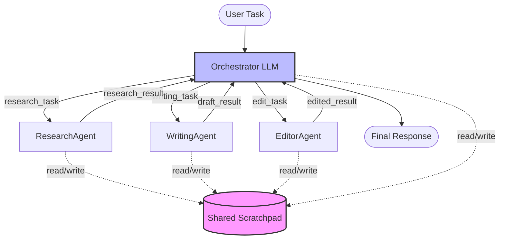
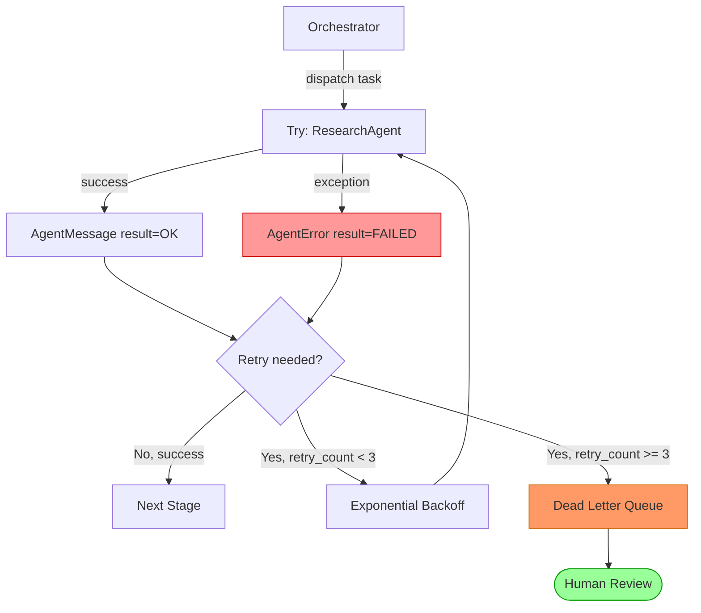

# Week 5: Multi-Agent Systems

> **Theme: Divide and Conquer with Specialized Agents**
>
> This week we move from single-agent workflows to coordinated multi-agent systems — architectures where multiple AI agents collaborate, each contributing specialized capabilities to solve problems no single agent could handle as effectively alone.

---

## 5.1 Multi-Agent Architecture Patterns

### Overview

When a single LLM agent grows too complex — too many tools, too broad a context, too many responsibilities — the natural solution is decomposition. Multi-agent systems apply the same "divide and conquer" principle that software engineers have used for decades: break a large problem into smaller, well-defined sub-problems, assign each to a specialized unit, and coordinate the results.

The choice of architecture pattern is not arbitrary. Each pattern has distinct trade-offs in terms of flexibility, parallelism, fault tolerance, and complexity. Understanding when to use each is as important as knowing how to implement them.

### Supervisor-Worker Pattern

The **supervisor-worker pattern** (also called orchestrator-agent) places a coordinating LLM — the **orchestrator** — at the center. The orchestrator receives the original task, reasons about how to decompose it, delegates sub-tasks to specialist agents, collects their outputs, and synthesizes a final result.

For example, imagine a user asks: "Write a blog post about the latest advances in quantum computing." The orchestrator might reason:
1. I need current information — delegate to `ResearchAgent`.
2. I need a well-written draft — delegate to `WritingAgent`.
3. I need the draft reviewed for accuracy and style — delegate to `EditorAgent`.

Each agent completes its work and returns a result. The orchestrator stitches these results together into the final output.

This pattern works best when the **task structure is known ahead of time** and the decomposition is predictable. The orchestrator can be a fixed routing script or an LLM that dynamically decides which agents to call and in what order.



### Sequential Pipeline Pattern

In a **sequential pipeline**, agents are chained: the output of one becomes the input of the next. A `ResearchAgent` gathers facts, passes them to a `WritingAgent` that drafts a document, which then passes to an `EditorAgent` for polish.

This pattern shines when each stage genuinely depends on the full output of the previous stage. It is simple to reason about, easy to debug (check each stage's output in isolation), and naturally enforces ordering. The downside is latency: stages cannot overlap, so the total time is the sum of all stage durations.

### Parallel Fan-Out Pattern

**Parallel fan-out** sends the same task to multiple agents simultaneously and merges their results. For a research task, you might spin up three `ResearchAgent` instances, each using a different search strategy (e.g., one uses web search, one queries academic databases, one searches recent news). Their independent findings are then merged or synthesized.

This pattern dramatically reduces latency for tasks with independent sub-components and can improve result quality through diversity (different agents may find different relevant information). The orchestrator must implement a **merge strategy** — union, consensus, or LLM-based synthesis.

### Swarm Pattern

The **swarm pattern** is the most decentralized. Agents share a **scratchpad** (a shared memory or message board) and self-assign tasks based on what work remains. There is no central orchestrator; each agent reads the scratchpad, decides if there is work it can do, does it, and writes results back.

Swarms are highly fault-tolerant (no single point of failure) and flexible (agents emerge organically to handle whatever is needed), but they are harder to debug and can suffer from coordination overhead or redundant work if not carefully designed.

### Choosing a Pattern

| Pattern | Use When | Downside |
|---|---|---|
| Supervisor-Worker | Task structure is known, need synthesis | Orchestrator is a bottleneck |
| Sequential Pipeline | Strong stage dependencies | High latency, no parallelism |
| Parallel Fan-Out | Independent sub-tasks, need speed | Merge complexity |
| Swarm | Unknown task structure, need resilience | Hard to debug, coordinate |

> **Key Insight:** The supervisor-worker pattern is the most common starting point for production multi-agent systems because it provides a clear coordination point for monitoring, retry logic, and result synthesis. Start here and evolve toward swarms only when you have proven the need.

> **Key Insight:** Parallelism in multi-agent systems is most valuable when sub-tasks are truly independent. If `WritingAgent` needs `ResearchAgent`'s output, you cannot run them in parallel — but you can run multiple `ResearchAgent` instances in parallel to gather more comprehensive research before writing begins.

> **Key Insight:** The orchestrator in a supervisor-worker system does not have to be an LLM. A deterministic routing script is often faster, cheaper, and more predictable. Use an LLM orchestrator when the task decomposition itself requires reasoning.

### Chapter Checkpoint

1. What is the key difference between a sequential pipeline and a parallel fan-out pattern? When would you choose one over the other?
2. In a supervisor-worker pattern, what responsibilities does the orchestrator have beyond simply calling agents?
3. Describe a real-world task where the swarm pattern would be more appropriate than the supervisor-worker pattern. Justify your choice.

---

## 5.2 Agent Communication

### Overview

How agents share information is as important as what they compute. Poor communication design leads to lost context, race conditions, and agents working at cross-purposes. This section covers the four primary communication mechanisms in multi-agent systems: structured messages, shared scratchpads, event-driven communication, and conversation handoffs.

### Structured Messages with Pydantic

The foundation of reliable agent communication is a well-defined **message schema**. When agents pass raw strings or unstructured dicts, subtle bugs creep in: missing fields, wrong types, ambiguous semantics. Using **Pydantic** models enforces a contract between agents at runtime.

An `AgentMessage` model captures everything an agent needs to know: who sent the message, who should receive it, what task is being requested, what context is available, and what result was produced.

```python
from pydantic import BaseModel, Field
from typing import Optional, Any, Dict, List
from datetime import datetime
from enum import Enum
import uuid


class TaskStatus(str, Enum):
    PENDING = "pending"
    IN_PROGRESS = "in_progress"
    COMPLETED = "completed"
    FAILED = "failed"


class AgentMessage(BaseModel):
    """
    Structured message passed between agents.
    All inter-agent communication uses this schema.
    """
    message_id: str = Field(default_factory=lambda: str(uuid.uuid4()))
    sender: str                          # Agent name or "user"
    recipient: str                       # Target agent name or "orchestrator"
    task: str                            # Human-readable task description
    task_type: str                       # Machine-readable type: "research", "write", "edit"
    context: Dict[str, Any] = {}         # Relevant context from prior agents
    result: Optional[Any] = None         # Populated by the receiving agent on completion
    status: TaskStatus = TaskStatus.PENDING
    error: Optional[str] = None          # Error message if status == FAILED
    timestamp: datetime = Field(default_factory=datetime.utcnow)
    retry_count: int = 0                 # Number of retries attempted

    def to_agent_prompt(self) -> str:
        """Convert message to a prompt suitable for passing to an LLM agent."""
        lines = [
            f"Task: {self.task}",
            f"Task Type: {self.task_type}",
        ]
        if self.context:
            lines.append("Context from prior agents:")
            for key, value in self.context.items():
                lines.append(f"  [{key}]: {value}")
        return "\n".join(lines)


# Example usage
msg = AgentMessage(
    sender="orchestrator",
    recipient="ResearchAgent",
    task="Find recent advances in quantum error correction",
    task_type="research",
    context={"depth": "technical", "max_sources": 5},
)

print(msg.to_agent_prompt())
print(f"Message ID: {msg.message_id}")
print(f"Status: {msg.status}")
```

### Shared Scratchpad with Optimistic Locking

A **shared scratchpad** is a data structure (dict, database, or key-value store) that all agents can read from and write to. It acts as the system's working memory: `ResearchAgent` writes its findings, `WritingAgent` reads them, `EditorAgent` reads the draft.

The danger is **write contention**: if two agents try to update the same key simultaneously, one will overwrite the other's work. **Optimistic locking** solves this by attaching a version number to each value. Before writing, an agent reads the current version. When writing, it includes the version it read — if the version has changed since the read, the write is rejected and the agent retries.

```python
import threading
from typing import Any, Optional, Tuple
from dataclasses import dataclass, field


@dataclass
class VersionedValue:
    """A value with an optimistic lock version counter."""
    data: Any
    version: int = 0


class SharedScratchpad:
    """
    Thread-safe shared scratchpad with optimistic locking.
    Multiple agents can read/write without risking silent overwrites.
    """

    def __init__(self):
        self._store: dict[str, VersionedValue] = {}
        self._lock = threading.Lock()

    def read(self, key: str) -> Tuple[Optional[Any], int]:
        """
        Read a value and its current version.
        Returns (value, version). Returns (None, -1) if key not found.
        """
        with self._lock:
            if key not in self._store:
                return None, -1
            entry = self._store[key]
            return entry.data, entry.version

    def write(self, key: str, value: Any, expected_version: int) -> bool:
        """
        Write a value only if the current version matches expected_version.
        Returns True on success, False if version conflict (retry needed).
        
        For new keys, use expected_version = -1.
        """
        with self._lock:
            current = self._store.get(key)
            current_version = current.version if current else -1

            if current_version != expected_version:
                # Version conflict — another agent wrote between our read and write
                return False

            new_version = expected_version + 1
            self._store[key] = VersionedValue(data=value, version=new_version)
            return True

    def write_with_retry(self, key: str, value: Any, max_retries: int = 5) -> bool:
        """
        Read current version, then attempt to write with optimistic lock.
        Retries on conflict up to max_retries times.
        """
        for attempt in range(max_retries):
            _, version = self.read(key)
            success = self.write(key, value, version)
            if success:
                return True
            # Brief yield before retry to reduce contention
            import time
            time.sleep(0.01 * (2 ** attempt))  # Exponential backoff
        return False


# Example: Two agents writing to scratchpad
scratchpad = SharedScratchpad()

# ResearchAgent writes findings
scratchpad.write("research_findings", {"topic": "quantum computing", "facts": []}, -1)

# WritingAgent reads findings to use as context
findings, version = scratchpad.read("research_findings")
print(f"Found at version {version}: {findings}")

# WritingAgent writes a draft
scratchpad.write("draft", "Quantum computing has seen remarkable advances...", -1)

# EditorAgent reads the draft
draft, version = scratchpad.read("draft")
print(f"Draft at version {version}: {draft[:50]}...")
```

### Event-Driven Communication

In an **event-driven** architecture, agents don't call each other directly — they emit **events** to a shared event bus, and other agents subscribe to the events they care about. This creates loose coupling: `ResearchAgent` doesn't know about `WritingAgent`; it simply emits a `research_complete` event when it finishes.

This pattern scales well and makes it easy to add new agents without modifying existing ones. It does require careful event schema design and monitoring to track what events are in-flight.

### Conversation Handoff

When routing a task from one agent to another, always include the **full conversation history**, not just the latest message. An agent receiving only "please continue this draft" has no idea what was discussed, what constraints were set, or what has already been tried.

Conversation handoff typically means packaging the entire `messages` list (in OpenAI/Anthropic format) into the `context` field of the `AgentMessage`. This ensures the receiving agent has complete situational awareness.

> **Key Insight:** Always validate inter-agent messages at the boundary. A Pydantic model that raises a `ValidationError` immediately is far better than a downstream agent that silently ignores a missing field and produces incorrect output ten steps later.

> **Key Insight:** The shared scratchpad is a form of external memory. It persists state across agent calls, which is critical when agents are stateless (as LLM-based agents typically are). Think of it as the whiteboard in a team meeting room.

> **Key Insight:** Event-driven communication is the most scalable inter-agent pattern, but also the hardest to debug. Always log every event emission and subscription with timestamps and agent identities. A good event log makes it possible to reconstruct exactly what happened in any execution.

### Chapter Checkpoint

1. Why is using a Pydantic `AgentMessage` model preferable to passing plain dicts between agents? Give two specific advantages.
2. Explain what optimistic locking prevents. What happens without it when two agents write to the same scratchpad key simultaneously?
3. Why should conversation handoffs include the full message history rather than just the latest message? What can go wrong if only the latest message is passed?

---

## 5.3 Specialization and Routing

### Overview

A core claim of multi-agent systems is that specialized agents outperform generalists on their specific domain. This section examines why specialization works, how to build a **router agent** that classifies and directs incoming tasks, how to define a **capability registry**, and how to handle failures with graceful fallback.

### Why Specialization Works

Each specialist agent is configured with tools and prompts optimized for its domain:

- **ResearchAgent**: equipped with `web_search`, `wikipedia_lookup`, and `academic_search` tools; system prompt emphasizes factual accuracy, source citation, and neutrality.
- **WritingAgent**: no search tools (it works from provided context); system prompt emphasizes clarity, structure, audience-appropriate tone, and engaging prose.
- **CodeAgent**: equipped with a `code_execution_sandbox` tool; system prompt emphasizes correctness, efficiency, security, and clear documentation.

A generalist agent trying to do all three would have a cluttered tool set, a compromised system prompt, and degraded performance on each individual task. Specialization lets each agent be excellent at one thing.

```python
from anthropic import Anthropic
from typing import Callable

client = Anthropic()


def make_research_agent() -> Callable:
    """
    Creates a ResearchAgent with web search focus.
    System prompt and tools optimized for information gathering.
    """
    system_prompt = """You are a ResearchAgent. Your role is to gather accurate, 
    well-sourced information on the given topic. Always:
    - Search multiple sources before drawing conclusions
    - Note the reliability and recency of each source  
    - Present findings as structured facts, not opinions
    - Cite sources for every major claim
    - Flag any conflicting information you encounter"""

    def research_agent(task: str, context: dict) -> str:
        # In a real implementation, this would include actual tool definitions
        # for web_search, wikipedia_lookup, etc.
        response = client.messages.create(
            model="claude-sonnet-4-5",
            max_tokens=2048,
            system=system_prompt,
            messages=[{
                "role": "user",
                "content": f"Research task: {task}\nContext: {context}"
            }]
        )
        return response.content[0].text

    return research_agent


def make_writing_agent() -> Callable:
    """
    Creates a WritingAgent optimized for clear, engaging prose.
    No search tools — works from provided research context.
    """
    system_prompt = """You are a WritingAgent. Your role is to transform research 
    findings into well-structured, engaging written content. Always:
    - Use the provided research; do not invent facts
    - Match the requested tone and audience level
    - Use clear paragraph structure with smooth transitions
    - Lead with the most important information
    - Write in active voice where possible"""

    def writing_agent(task: str, context: dict) -> str:
        response = client.messages.create(
            model="claude-sonnet-4-5",
            max_tokens=2048,
            system=system_prompt,
            messages=[{
                "role": "user",
                "content": f"Writing task: {task}\nResearch context: {context}"
            }]
        )
        return response.content[0].text

    return writing_agent
```

### The Router Agent

The **router agent** classifies an incoming task and directs it to the appropriate specialist. A simple router uses an LLM to analyze the task and return a structured classification.

```python
import json
from anthropic import Anthropic

client = Anthropic()

ROUTER_SYSTEM_PROMPT = """You are a task routing agent. Classify the given task into 
exactly one of these categories:
- research: gathering information, finding facts, summarizing sources
- writing: drafting documents, creating content, storytelling
- coding: writing code, debugging, architecture decisions
- analysis: interpreting data, drawing conclusions, comparing options

Respond with valid JSON only: {"task_type": "<category>", "confidence": <0.0-1.0>, "reasoning": "<brief explanation>"}"""


def route_task(task: str) -> dict:
    """
    Use an LLM to classify the task type and return routing decision.
    Falls back to 'research' if classification fails.
    """
    try:
        response = client.messages.create(
            model="claude-sonnet-4-5",
            max_tokens=256,
            system=ROUTER_SYSTEM_PROMPT,
            messages=[{"role": "user", "content": f"Classify this task: {task}"}]
        )
        result = json.loads(response.content[0].text)
        print(f"Router decision: {result['task_type']} (confidence: {result['confidence']:.2f})")
        print(f"Reasoning: {result['reasoning']}")
        return result
    except (json.JSONDecodeError, KeyError) as e:
        print(f"Router parsing failed: {e}. Defaulting to 'research'.")
        return {"task_type": "research", "confidence": 0.5, "reasoning": "fallback"}


# Example routing decisions
tasks = [
    "Find recent papers on transformer architecture improvements",
    "Write a blog post about machine learning for beginners",
    "Debug this Python function that throws a KeyError",
    "Compare GPT-4 and Claude 3 on coding benchmarks",
]

for task in tasks:
    decision = route_task(task)
    print(f"Task: '{task[:50]}...' → {decision['task_type']}\n")
```

### Capability Registry

A **capability registry** is a catalog of all available agents and what they can do. Each agent registers its identity, skills, and supported task types. The router consults the registry to find the best match.

```python
from dataclasses import dataclass, field
from typing import List, Optional


@dataclass
class AgentCapability:
    """Describes what an agent can do. Registered at system startup."""
    name: str                           # Unique agent identifier
    description: str                    # Human-readable description
    skills: List[str]                   # Fine-grained capabilities
    supported_task_types: List[str]     # Task type strings the router can use
    tools: List[str]                    # Tool names this agent has access to
    priority: int = 0                   # Higher = preferred when multiple agents match


class CapabilityRegistry:
    """Central registry of all available agents and their capabilities."""

    def __init__(self):
        self._agents: dict[str, AgentCapability] = {}

    def register(self, capability: AgentCapability):
        self._agents[capability.name] = capability
        print(f"Registered agent: {capability.name}")

    def find_agent_for_task(self, task_type: str) -> Optional[AgentCapability]:
        """Return the highest-priority agent that supports this task type."""
        candidates = [
            agent for agent in self._agents.values()
            if task_type in agent.supported_task_types
        ]
        if not candidates:
            return None
        return max(candidates, key=lambda a: a.priority)

    def get_all(self) -> List[AgentCapability]:
        return list(self._agents.values())


# Build the registry
registry = CapabilityRegistry()

registry.register(AgentCapability(
    name="ResearchAgent",
    description="Gathers and synthesizes information from multiple sources",
    skills=["web_search", "source_evaluation", "fact_checking", "summarization"],
    supported_task_types=["research"],
    tools=["web_search", "wikipedia_lookup", "academic_search"],
    priority=10,
))

registry.register(AgentCapability(
    name="WritingAgent",
    description="Creates well-structured written content from provided context",
    skills=["prose_writing", "structure", "tone_matching", "editing"],
    supported_task_types=["writing"],
    tools=[],  # No external tools — works from context
    priority=10,
))

registry.register(AgentCapability(
    name="GeneralistAgent",
    description="Handles any task type; lower quality but always available",
    skills=["general_reasoning"],
    supported_task_types=["research", "writing", "coding", "analysis"],
    tools=["web_search"],
    priority=1,  # Lower priority — used as fallback
))

# Test routing
agent = registry.find_agent_for_task("writing")
print(f"Best agent for 'writing': {agent.name}")

agent = registry.find_agent_for_task("video_editing")  # Unknown type
print(f"Best agent for 'video_editing': {agent}")  # Returns None
```

### Fallback Strategy

If a specialist agent fails twice, the system should **escalate to a generalist agent** rather than retrying indefinitely. This ensures the user gets a response (possibly lower quality) rather than an error.

> **Key Insight:** The router agent is itself a potential single point of failure. If classification is wrong, the task goes to the wrong specialist. Mitigate this with confidence thresholds: if the router's confidence is below 0.7, route to the generalist or ask for clarification.

> **Key Insight:** Capability registries pay for themselves during on-call incidents. When a specialized agent goes down, you can query the registry to find which task types are now unserviceable and alert the right team within seconds.

> **Key Insight:** Over-specialization is a real risk. If agents are too narrowly scoped, many tasks will fall into the cracks and route to the generalist by default. Aim for 3-6 well-defined specialist types before adding more granularity.

### Chapter Checkpoint

1. A user submits the task: "Analyze the performance implications of different database indexing strategies and then write a technical blog post about your findings." Which agents should handle this task, and in what order? Justify your answer.
2. What is the purpose of the `priority` field in the `AgentCapability` dataclass? How does it enable graceful fallback?
3. Why might a deterministic router (rule-based) be preferable to an LLM-based router for some systems, even though the LLM router is more flexible?

---

## 5.4 Resilience in Multi-Agent Systems

### Overview

A multi-agent system has more failure surfaces than a single agent: each agent can fail, the communication layer can fail, the shared scratchpad can become inconsistent, and the orchestrator itself can crash. **Resilience engineering** means designing the system so that partial failures are isolated, handled gracefully, and recovered from automatically — without losing work that has already been done.

### Fault Isolation

The first principle of resilience is that **one agent's failure must not crash the whole system**. This is achieved by wrapping each agent call in a `try/except` block and representing failures as structured `AgentError` results that the orchestrator can reason about.



```python
import time
import logging
from typing import Optional, Callable, Any
from dataclasses import dataclass, field
from datetime import datetime

logging.basicConfig(level=logging.INFO, format='%(asctime)s %(levelname)s %(message)s')
logger = logging.getLogger(__name__)


@dataclass
class AgentError:
    """Structured error result from a failed agent call."""
    agent_name: str
    error_type: str
    error_message: str
    task: str
    retry_count: int
    timestamp: datetime = field(default_factory=datetime.utcnow)

    def __str__(self):
        return f"AgentError({self.agent_name}): {self.error_type} - {self.error_message}"


@dataclass
class AgentMetrics:
    """Per-agent performance metrics for monitoring."""
    agent_name: str
    tasks_attempted: int = 0
    tasks_completed: int = 0
    tasks_failed: int = 0
    total_latency_ms: float = 0.0
    last_error: Optional[str] = None

    @property
    def success_rate(self) -> float:
        if self.tasks_attempted == 0:
            return 0.0
        return self.tasks_completed / self.tasks_attempted

    @property
    def avg_latency_ms(self) -> float:
        if self.tasks_completed == 0:
            return 0.0
        return self.total_latency_ms / self.tasks_completed

    def __str__(self):
        return (
            f"{self.agent_name}: "
            f"{self.tasks_completed}/{self.tasks_attempted} tasks "
            f"({self.success_rate:.0%} success), "
            f"avg {self.avg_latency_ms:.0f}ms latency"
        )


class ResilientOrchestrator:
    """
    Orchestrator with per-agent fault isolation, retry with exponential backoff,
    compensation logic, and a dead letter queue.
    """

    MAX_RETRIES = 3
    BASE_BACKOFF_SECONDS = 1.0

    def __init__(self):
        self.metrics: dict[str, AgentMetrics] = {}
        self.dead_letter_queue: list[AgentError] = []
        self.completed_tasks: dict[str, Any] = {}  # Compensation: track what's done

    def _get_metrics(self, agent_name: str) -> AgentMetrics:
        if agent_name not in self.metrics:
            self.metrics[agent_name] = AgentMetrics(agent_name=agent_name)
        return self.metrics[agent_name]

    def call_agent_with_retry(
        self,
        agent_name: str,
        agent_fn: Callable,
        task: str,
        context: dict,
    ) -> tuple[Optional[Any], Optional[AgentError]]:
        """
        Call an agent function with automatic retry and exponential backoff.
        Returns (result, None) on success or (None, AgentError) on exhausted retries.
        """
        metrics = self._get_metrics(agent_name)

        for attempt in range(self.MAX_RETRIES + 1):
            metrics.tasks_attempted += 1
            start_time = time.time()

            try:
                logger.info(f"Calling {agent_name} (attempt {attempt + 1}/{self.MAX_RETRIES + 1})")
                result = agent_fn(task=task, context=context)
                
                elapsed_ms = (time.time() - start_time) * 1000
                metrics.tasks_completed += 1
                metrics.total_latency_ms += elapsed_ms
                logger.info(f"{agent_name} succeeded in {elapsed_ms:.0f}ms")
                
                # Record completion for compensation logic
                self.completed_tasks[agent_name] = result
                return result, None

            except Exception as e:
                elapsed_ms = (time.time() - start_time) * 1000
                error_msg = f"{type(e).__name__}: {str(e)}"
                metrics.last_error = error_msg
                logger.warning(f"{agent_name} failed (attempt {attempt + 1}): {error_msg}")

                if attempt < self.MAX_RETRIES:
                    # Exponential backoff: 1s, 2s, 4s
                    backoff = self.BASE_BACKOFF_SECONDS * (2 ** attempt)
                    logger.info(f"Retrying {agent_name} in {backoff:.1f}s...")
                    time.sleep(backoff)
                else:
                    # All retries exhausted
                    metrics.tasks_failed += 1
                    error = AgentError(
                        agent_name=agent_name,
                        error_type=type(e).__name__,
                        error_message=str(e),
                        task=task,
                        retry_count=attempt,
                    )
                    self.dead_letter_queue.append(error)
                    logger.error(f"{agent_name} exhausted all retries. Added to DLQ.")
                    return None, error

    def run_pipeline(self, user_task: str) -> dict:
        """
        Run a research → writing pipeline with fault isolation.
        Demonstrates compensation: if writing fails, we don't re-run research.
        """
        results = {}
        errors = []

        # Stage 1: Research (check compensation cache first)
        if "ResearchAgent" not in self.completed_tasks:
            research_result, research_error = self.call_agent_with_retry(
                agent_name="ResearchAgent",
                agent_fn=mock_research_agent,  # Replace with real agent
                task=user_task,
                context={},
            )
        else:
            logger.info("ResearchAgent: using cached result (compensation)")
            research_result = self.completed_tasks["ResearchAgent"]
            research_error = None

        if research_error:
            errors.append(research_error)
            return {"status": "failed", "stage": "research", "errors": errors}

        results["research"] = research_result

        # Stage 2: Writing (uses research output as context)
        writing_result, writing_error = self.call_agent_with_retry(
            agent_name="WritingAgent",
            agent_fn=mock_writing_agent,  # Replace with real agent
            task=f"Write a document about: {user_task}",
            context={"research": research_result},
        )

        if writing_error:
            errors.append(writing_error)
            # Research succeeded — compensation means we preserve it
            return {
                "status": "partial",
                "research": research_result,
                "errors": errors,
                "note": "Writing failed; research results preserved"
            }

        results["writing"] = writing_result
        return {"status": "success", "results": results}

    def print_monitoring_dashboard(self):
        """Print a simple monitoring dashboard showing per-agent metrics."""
        print("\n" + "=" * 60)
        print("AGENT MONITORING DASHBOARD")
        print("=" * 60)
        for metrics in self.metrics.values():
            print(f"  {metrics}")
            if metrics.last_error:
                print(f"    Last error: {metrics.last_error}")
        print(f"\nDead Letter Queue: {len(self.dead_letter_queue)} items")
        for item in self.dead_letter_queue:
            print(f"  - {item}")
        print("=" * 60 + "\n")


# Mock agents for demonstration (replace with real LLM-backed agents)
def mock_research_agent(task: str, context: dict) -> str:
    """Simulates a research agent call."""
    return f"Research findings for '{task}': [simulated facts and sources]"


def mock_writing_agent(task: str, context: dict) -> str:
    """Simulates a writing agent call."""
    return f"Written content based on: {context.get('research', 'no research')[:50]}..."


# Demo
orchestrator = ResilientOrchestrator()
result = orchestrator.run_pipeline("advances in renewable energy storage")
print(f"Pipeline result: {result['status']}")
orchestrator.print_monitoring_dashboard()
```

### Compensation Patterns

**Compensation** means not repeating work that has already succeeded. If `ResearchAgent` completes successfully but `WritingAgent` fails all three retries, you should not re-run `ResearchAgent` on the next attempt — its output is already valid. Store completed agent outputs in a cache (the `completed_tasks` dict above) and check it before each agent call.

This is analogous to **saga patterns** in distributed systems: each step in a long-running transaction can be individually compensated or skipped if already complete.

### Dead Letter Queue

Tasks that fail all retries go to the **dead letter queue (DLQ)**. The DLQ is not a failure state — it is a deliberate escalation path. A human operator (or a separate monitoring agent) reviews items in the DLQ, investigates why they failed, and either resubmits them or marks them as permanently failed.

Always include in the DLQ entry: the agent name, the task, the error type and message, the number of retries attempted, and the timestamp. This information is essential for post-mortem analysis.

### Per-Agent Monitoring

Tracking `tasks_attempted`, `tasks_completed`, `avg_latency`, and `last_error` per agent gives you visibility into system health without adding expensive tracing infrastructure. A simple dashboard printed to stdout (as above) is sufficient for development; in production, these metrics should be pushed to a time-series database (e.g., Prometheus, Datadog).

> **Key Insight:** Exponential backoff is not just about being polite to external APIs — it gives transient failures (network blips, rate limits, temporary overload) time to resolve before the next attempt. Without it, three rapid-fire retries often all fail for the same reason.

> **Key Insight:** The compensation pattern is one of the most important resilience techniques in multi-agent systems. Without it, a failure in stage 3 of a 5-stage pipeline means re-running all 5 stages, which is expensive, slow, and may produce different (inconsistent) results.

> **Key Insight:** Monitor the DLQ length as a key health metric. A growing DLQ indicates a systemic problem — not just random failures — and should trigger an alert before the queue grows too large for human review.

### Chapter Checkpoint

1. Explain the difference between fault isolation and fault tolerance. How does the `try/except` wrapper in `call_agent_with_retry` provide fault isolation but not fault tolerance?
2. Why is exponential backoff preferred over a fixed wait time between retries? What problem does it solve that a fixed delay does not?
3. A user submits a task, it goes through `ResearchAgent` successfully, then `WritingAgent` fails three times and is added to the DLQ. The user resubmits the same task an hour later. Describe what should happen in a system that implements compensation correctly.

---

## Lab Walkthrough: 3-Agent Research Pipeline with Monitoring

### Learning Objectives

By completing this lab, you will:
- Build a working 3-agent pipeline (Router → ResearchAgent + WritingAgent → EditorAgent)
- Implement parallel execution using Python's `concurrent.futures`
- Add a live monitoring dashboard showing per-agent metrics
- Handle failures with retry logic and a dead letter queue

### Prerequisites

```bash
pip install anthropic pydantic wikipedia-api requests
```

### Step 1: Project Structure

Create the following files:

```
research_pipeline/
├── agents/
│   ├── __init__.py
│   ├── router.py
│   ├── research_agent.py
│   ├── writing_agent.py
│   └── editor_agent.py
├── core/
│   ├── __init__.py
│   ├── messages.py
│   ├── scratchpad.py
│   ├── orchestrator.py
│   └── monitoring.py
└── main.py
```

### Step 2: Core Message and Scratchpad Models

Create `core/messages.py` with the `AgentMessage` and `AgentError` classes from Section 5.2, and `core/scratchpad.py` with the `SharedScratchpad` class.

### Step 3: Build the Router Agent

```python
# agents/router.py
import json
from anthropic import Anthropic

client = Anthropic()

ROUTER_SYSTEM = """Classify the user task into exactly one category:
- research_and_write: needs both information gathering AND document creation
- research_only: only needs information gathering
- write_only: has all needed information, only needs writing
- code: involves writing or debugging code

Return JSON: {"task_type": "<category>", "confidence": <0.0-1.0>}"""


def classify_task(task: str) -> dict:
    """Classify a task to determine which agents to invoke."""
    response = client.messages.create(
        model="claude-sonnet-4-5",
        max_tokens=128,
        system=ROUTER_SYSTEM,
        messages=[{"role": "user", "content": task}],
    )
    try:
        return json.loads(response.content[0].text)
    except json.JSONDecodeError:
        return {"task_type": "research_and_write", "confidence": 0.5}
```

### Step 4: Build the Research Agent with Wikipedia

```python
# agents/research_agent.py
import wikipediaapi
from anthropic import Anthropic

client = Anthropic()
wiki = wikipediaapi.Wikipedia("ResearchPipeline/1.0", "en")

RESEARCH_SYSTEM = """You are a ResearchAgent. Synthesize the provided Wikipedia 
excerpts into a structured research brief. Include key facts, context, and 
identify any gaps that need further investigation."""


def research_topic(topic: str, context: dict) -> str:
    """
    Fetch Wikipedia content and synthesize a research brief.
    In production, augment with web search (e.g., Tavily, Serper API).
    """
    # Fetch Wikipedia article
    page = wiki.page(topic)
    if page.exists():
        # Take first 3000 characters to stay within context limits
        wiki_content = page.text[:3000]
        source_note = f"Source: Wikipedia - {page.fullurl}"
    else:
        wiki_content = f"No Wikipedia article found for '{topic}'."
        source_note = "No sources found."

    # Use LLM to synthesize findings
    response = client.messages.create(
        model="claude-sonnet-4-5",
        max_tokens=1024,
        system=RESEARCH_SYSTEM,
        messages=[{
            "role": "user",
            "content": f"Topic: {topic}\n\nWikipedia content:\n{wiki_content}\n\n{source_note}"
        }],
    )
    return response.content[0].text
```

### Step 5: Build the Writing and Editor Agents

```python
# agents/writing_agent.py
from anthropic import Anthropic

client = Anthropic()

WRITING_SYSTEM = """You are a WritingAgent. Transform research briefs into 
well-structured, engaging articles. Use clear headings, active voice, and 
concrete examples. Aim for 400-600 words."""


def write_article(task: str, context: dict) -> str:
    research = context.get("research", "No research provided.")
    response = client.messages.create(
        model="claude-sonnet-4-5",
        max_tokens=1500,
        system=WRITING_SYSTEM,
        messages=[{
            "role": "user",
            "content": f"Write an article about: {task}\n\nResearch:\n{research}"
        }],
    )
    return response.content[0].text


# agents/editor_agent.py
EDITOR_SYSTEM = """You are an EditorAgent. Review and improve the provided draft.
Fix grammar, improve clarity, ensure logical flow, and strengthen the conclusion.
Return the full polished article."""


def edit_article(draft: str, context: dict) -> str:
    response = client.messages.create(
        model="claude-sonnet-4-5",
        max_tokens=1500,
        system=EDITOR_SYSTEM,
        messages=[{
            "role": "user",
            "content": f"Please edit and improve this article:\n\n{draft}"
        }],
    )
    return response.content[0].text
```

### Step 6: Parallel Orchestrator with Monitoring

```python
# core/orchestrator.py
import time
import concurrent.futures
from core.monitoring import MonitoringDashboard
from core.scratchpad import SharedScratchpad
from agents.router import classify_task
from agents.research_agent import research_topic
from agents.writing_agent import write_article
from agents.editor_agent import edit_article


def run_pipeline(user_task: str) -> dict:
    """
    Full pipeline: Router → (ResearchAgent ∥ WritingAgent setup) → EditorAgent
    
    Note: In this pipeline, WritingAgent depends on ResearchAgent output,
    so true parallelism applies when running multiple research strategies.
    """
    dashboard = MonitoringDashboard()
    scratchpad = SharedScratchpad()

    print(f"\nStarting pipeline for: '{user_task}'\n")

    # Stage 1: Route the task
    dashboard.record_start("RouterAgent")
    routing = classify_task(user_task)
    dashboard.record_success("RouterAgent")
    print(f"Router decision: {routing['task_type']} (confidence: {routing['confidence']:.0%})")

    # Stage 2: Research (with retry)
    dashboard.record_start("ResearchAgent")
    try:
        research = research_topic(user_task, {})
        scratchpad.write_with_retry("research", research)
        dashboard.record_success("ResearchAgent")
        print("ResearchAgent: Complete")
    except Exception as e:
        dashboard.record_failure("ResearchAgent", str(e))
        print(f"ResearchAgent failed: {e}")
        dashboard.print_dashboard()
        return {"status": "failed", "stage": "research"}

    # Stage 3: Write (uses research from scratchpad)
    research_text, _ = scratchpad.read("research")
    dashboard.record_start("WritingAgent")
    try:
        draft = write_article(user_task, {"research": research_text})
        scratchpad.write_with_retry("draft", draft)
        dashboard.record_success("WritingAgent")
        print("WritingAgent: Complete")
    except Exception as e:
        dashboard.record_failure("WritingAgent", str(e))
        print(f"WritingAgent failed: {e}")
        dashboard.print_dashboard()
        return {"status": "partial", "research": research_text}

    # Stage 4: Edit
    draft_text, _ = scratchpad.read("draft")
    dashboard.record_start("EditorAgent")
    try:
        final = edit_article(draft_text, {})
        scratchpad.write_with_retry("final", final)
        dashboard.record_success("EditorAgent")
        print("EditorAgent: Complete")
    except Exception as e:
        dashboard.record_failure("EditorAgent", str(e))
        print(f"EditorAgent failed: {e}. Returning unedited draft.")
        final = draft_text

    dashboard.print_dashboard()
    return {"status": "success", "final_article": final}
```

### Step 7: Monitoring Dashboard

```python
# core/monitoring.py
import time
from dataclasses import dataclass, field
from typing import Optional


@dataclass
class AgentStats:
    name: str
    attempts: int = 0
    successes: int = 0
    failures: int = 0
    total_ms: float = 0.0
    last_error: Optional[str] = None
    _start_time: Optional[float] = field(default=None, repr=False)


class MonitoringDashboard:
    def __init__(self):
        self._stats: dict[str, AgentStats] = {}

    def _get(self, name: str) -> AgentStats:
        if name not in self._stats:
            self._stats[name] = AgentStats(name=name)
        return self._stats[name]

    def record_start(self, agent: str):
        s = self._get(agent)
        s.attempts += 1
        s._start_time = time.time()

    def record_success(self, agent: str):
        s = self._get(agent)
        if s._start_time:
            s.total_ms += (time.time() - s._start_time) * 1000
        s.successes += 1

    def record_failure(self, agent: str, error: str):
        s = self._get(agent)
        s.failures += 1
        s.last_error = error

    def print_dashboard(self):
        print("\n" + "=" * 55)
        print(f"{'AGENT':<20} {'ATTEMPTS':>8} {'SUCCESS':>8} {'RATE':>7} {'AVG MS':>8}")
        print("-" * 55)
        for s in self._stats.values():
            rate = f"{s.successes/s.attempts:.0%}" if s.attempts > 0 else "N/A"
            avg_ms = f"{s.total_ms/s.successes:.0f}" if s.successes > 0 else "N/A"
            print(f"{s.name:<20} {s.attempts:>8} {s.successes:>8} {rate:>7} {avg_ms:>8}")
        print("=" * 55 + "\n")
```

### Step 8: Run the Pipeline

```python
# main.py
from core.orchestrator import run_pipeline

if __name__ == "__main__":
    result = run_pipeline("the history and future of quantum computing")
    
    if result["status"] == "success":
        print("\n--- FINAL ARTICLE ---")
        print(result["final_article"])
    else:
        print(f"\nPipeline ended with status: {result['status']}")
```

```bash
python main.py
```

### Expected Output

```
Starting pipeline for: 'the history and future of quantum computing'

Router decision: research_and_write (confidence: 95%)
ResearchAgent: Complete
WritingAgent: Complete
EditorAgent: Complete

=======================================================
AGENT             ATTEMPTS  SUCCESS     RATE   AVG MS
-------------------------------------------------------
RouterAgent              1        1     100%      312
ResearchAgent            1        1     100%     1847
WritingAgent             1        1     100%     2103
EditorAgent              1        1     100%     1654
=======================================================

--- FINAL ARTICLE ---
[polished article text appears here]
```

### Lab Extension Challenges

1. **True Parallelism**: Modify the pipeline to run three `ResearchAgent` instances in parallel using `concurrent.futures.ThreadPoolExecutor`, each searching a different aspect of the topic, then merge results before passing to `WritingAgent`.

2. **Fault Injection**: Add a `--fail-agent` CLI flag that forces a specific agent to raise an exception, and verify that retry logic and DLQ work correctly.

3. **Persistent Scratchpad**: Replace the in-memory `SharedScratchpad` with a Redis-backed version so the pipeline can survive process restarts.

---

## Further Reading

1. **"Building Agentic AI Systems" — Anthropic Engineering Blog** (2024). Anthropic's engineering team describes the design decisions behind Claude's tool use and multi-agent capabilities. Available at anthropic.com/research.

2. **"Patterns of Multi-Agent Systems" — Michael Wooldridge, "An Introduction to MultiAgent Systems" (2nd ed., Wiley, 2009)**. The definitive academic textbook on multi-agent systems theory, covering coordination, communication, and negotiation at depth. Chapters 7-9 are most relevant.

3. **"LangGraph: Building Stateful Multi-Actor Applications" — LangChain Documentation** (2024). Practical guide to building graph-based multi-agent workflows with state management, branching, and cycles. Available at langchain-ai.github.io/langgraph.

4. **"Reliable Multi-Agent Systems with the Saga Pattern" — Chris Richardson, "Microservices Patterns" (Manning, 2018)**. Chapter 4 covers saga and compensation patterns in distributed systems — directly applicable to multi-agent pipelines where partial failures must be handled gracefully.

5. **"AutoGen: Enabling Next-Gen LLM Applications via Multi-Agent Conversation" — Wu et al., arXiv:2308.08155** (2023). Microsoft Research paper introducing the AutoGen framework, with empirical results on multi-agent collaboration across coding, reasoning, and decision-making tasks.

---

## Week Summary

- **Multi-agent architectures solve the single-agent scaling problem** by decomposing complex tasks across specialized, coordinated agents. The four core patterns — supervisor-worker, sequential pipeline, parallel fan-out, and swarm — each suit different task structures and reliability requirements.

- **Structured communication is non-negotiable**. Pydantic `AgentMessage` models enforce contracts between agents, shared scratchpads with optimistic locking prevent silent data corruption, and full conversation handoffs ensure every agent has the context it needs to succeed.

- **Specialization delivers measurable quality gains** because each agent can have purpose-built tools, system prompts, and model configurations for its domain. The capability registry and router agent together create a dynamic dispatch system that directs each task to its most capable handler.

- **Resilience must be designed in from the start**, not added later. Fault isolation via `try/except`, exponential backoff retry, compensation patterns (don't re-run what already succeeded), and dead letter queues for exhausted retries form a complete reliability stack that keeps systems running under partial failure conditions.

- **Observability is what separates prototype multi-agent systems from production ones**. Per-agent metrics (attempt count, success rate, average latency, last error) and DLQ monitoring give you the visibility to detect emerging problems, root-cause incidents quickly, and make informed architectural decisions about which agents need improvement.
