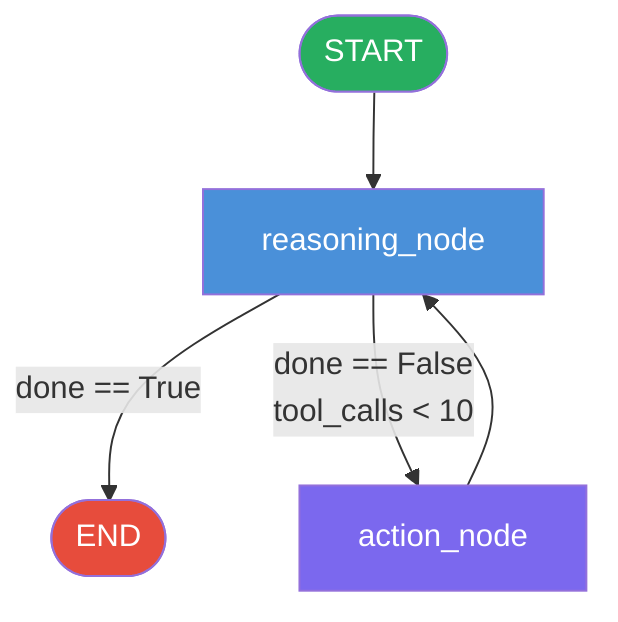
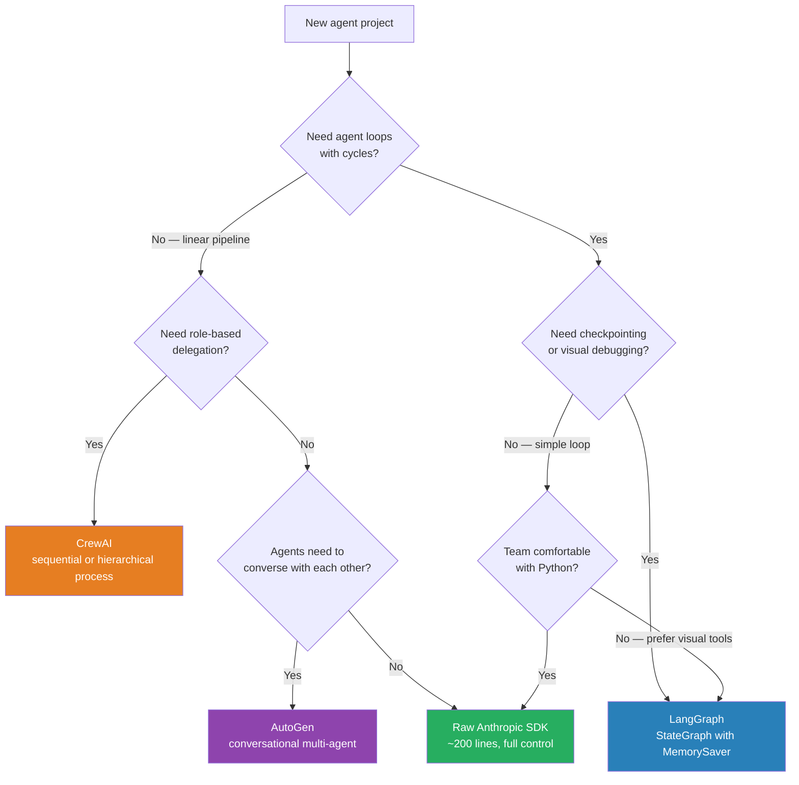

# Week 7: Agent Orchestration Frameworks

> **Theme: Stand on the shoulders of giants**
>
> You have spent the last four weeks building agents from scratch. You understand the ReAct loop, tool calling, memory, and multi-agent coordination at the implementation level. Now we examine the frameworks that abstract these patterns — when they help, when they hurt, and how to choose.

---

## 7.1 The Framework Landscape

### Why Frameworks Exist

By Week 6 you had a working multi-agent system built on the raw Anthropic SDK. It was probably 150–300 lines of Python: a loop, some tool dispatch, a state dictionary, maybe a queue for agent messages. That code is entirely yours — you understand every line of it.

Frameworks exist because teams building production agents kept writing the same 150–300 lines over and over. They extracted the patterns into reusable abstractions. The question is not "should I use a framework?" but rather "does this framework's abstraction model match the shape of my problem?"

The major frameworks occupy different niches.

### LangGraph

**LangGraph** (from LangChain Inc.) models agent logic as a **directed graph** where nodes are Python functions and edges are transitions between them. The core insight is that agents are state machines: they read state, do something, update state, and decide what to do next. LangGraph makes that state machine explicit and inspectable.

Key characteristics:
- State is a **TypedDict** that flows through the entire graph. Every node reads from it and writes back to it.
- **Edges** can be unconditional (`add_edge("a", "b")`) or conditional (`add_conditional_edges`), where a routing function examines state and returns the name of the next node.
- The graph can contain **cycles** — this is the key feature for agent loops. An action node can route back to a reasoning node, creating a loop that continues until a termination condition is met.
- **MemorySaver** checkpointing persists state after each node execution, so a crash mid-graph can be resumed from the last checkpoint.
- LangSmith provides a visual trace of every node execution, with inputs, outputs, and timing.

LangGraph is the right tool when you have complex branching logic that is difficult to reason about in a flat Python script. The visual graph makes it easier to communicate the agent's control flow to non-engineers and to debug which branch was taken on a given run.

### CrewAI

**CrewAI** operates at a higher level of abstraction. Rather than state machines and edges, it thinks in terms of **roles**: an `Agent` has a role, a goal, a backstory, and a list of tools. A `Crew` is a collection of agents assigned to tasks, executed in a `process` that is either `sequential` (one agent hands off to the next) or `hierarchical` (a manager agent delegates to workers).

The mental model is a consulting team. You define who is on the team and what each person's job is; CrewAI handles the coordination. This makes CrewAI excellent for simulating role-based workflows — research analyst, writer, editor — where the division of labor is clear and the agents do not need to engage in free-form back-and-forth.

The tradeoff is reduced control. When something goes wrong in a CrewAI pipeline, the failure can be several abstraction layers away from your code. The framework is doing a lot on your behalf.

### AutoGen

**AutoGen** (from Microsoft Research) takes a conversational approach. Agents are objects that can **send and receive messages**. You define an `AssistantAgent` and a `UserProxyAgent`, and they exchange natural-language messages to complete a task. The UserProxyAgent can execute code in a sandbox, which makes AutoGen particularly well-suited for **coding assistant** workflows where the agent writes code, runs it, sees the output, and iterates.

AutoGen is the most "chat-like" of the three frameworks. Its strength is tasks where the agent needs to reason across multiple turns of dialogue, produce code, verify the code works, and refine it — a loop that maps naturally onto a conversation.

### The "No Framework" Argument

Here is an argument worth taking seriously: a raw Anthropic SDK implementation of a ReAct agent is roughly 200 lines of Python. A LangGraph implementation of the same agent is roughly 2000 lines when you count the framework code being executed on your behalf. That is ten times more code running in your process, most of which you did not write and cannot easily debug.

The hidden costs of frameworks:
- **Abstraction leakage**: when the framework does something unexpected, you need to understand its internals to fix it. You end up learning two systems instead of one.
- **Version churn**: LangChain and LangGraph have historically had significant breaking changes between versions. A working agent can break after `pip install --upgrade`.
- **Debugging distance**: a stack trace that goes through six layers of framework code before reaching your function is harder to read than a stack trace through your own code.

The recommendation for this course: understand agents at the raw SDK level first (Weeks 3–6), then add frameworks when you have a concrete reason — checkpointing, visual debugging, or a team that benefits from the higher-level abstractions.

> **Key Insight:** Frameworks are not free. They trade flexibility and debuggability for convenience and standardization. The trade is worth it when your team's time is better spent on the business logic than on the plumbing — but only if you understand what the plumbing does.

> **Key Insight:** CrewAI and AutoGen are optimized for specific shapes of problems (role-based delegation and conversational coding, respectively). If your problem does not fit those shapes, you will spend more time fighting the framework than benefiting from it.

> **Key Insight:** LangGraph's key differentiator is explicit cycles with checkpointing. If your agent loop is simple and linear, the raw SDK is almost certainly the better choice.

### Chapter Checkpoint

1. What is the fundamental abstraction difference between LangGraph (state machine / graph) and CrewAI (role-based team)?
2. Why is AutoGen particularly well-suited for coding assistant workflows?
3. Name two concrete costs of using a framework rather than the raw SDK.

---

## 7.2 LangGraph Deep Dive

### The StateGraph Model

LangGraph's central object is the **StateGraph**. You define it by passing a **TypedDict** that describes the shape of the state that will flow through your graph. Every node in the graph receives the current state as its only argument and returns a dictionary of state updates.

```python
from typing import TypedDict, Annotated, List
from langgraph.graph import StateGraph, END
from langgraph.checkpoint.memory import MemorySaver
import anthropic
import json

# --- State schema ---
# Every field that any node might read or write must be declared here.
class AgentState(TypedDict):
    messages: List[dict]          # conversation history
    tool_calls_made: int          # how many tool calls so far
    final_answer: str             # populated when agent is done
    done: bool                    # termination signal

# --- Tool definition ---
def search_web(query: str) -> str:
    """Simulated web search tool."""
    # In production, call a real search API here
    return f"Search results for '{query}': [result 1, result 2, result 3]"

def calculator(expression: str) -> str:
    """Safe calculator tool."""
    try:
        # Only allow simple arithmetic
        allowed = set("0123456789+-*/()., ")
        if all(c in allowed for c in expression):
            return str(eval(expression))
        return "Error: invalid expression"
    except Exception as e:
        return f"Error: {e}"

TOOLS = [
    {
        "name": "search_web",
        "description": "Search the web for information about a topic.",
        "input_schema": {
            "type": "object",
            "properties": {
                "query": {"type": "string", "description": "The search query"}
            },
            "required": ["query"]
        }
    },
    {
        "name": "calculator",
        "description": "Evaluate a mathematical expression.",
        "input_schema": {
            "type": "object",
            "properties": {
                "expression": {"type": "string", "description": "Math expression to evaluate"}
            },
            "required": ["expression"]
        }
    }
]

TOOL_FUNCTIONS = {
    "search_web": search_web,
    "calculator": calculator,
}

client = anthropic.Anthropic()

# --- Nodes ---
# Each node is a plain Python function: (state) -> dict of updates

def reasoning_node(state: AgentState) -> dict:
    """
    Call the LLM with the current message history.
    Returns updated messages. Sets done=True if LLM gives a final answer.
    """
    print(f"[reasoning_node] messages={len(state['messages'])}, tool_calls={state['tool_calls_made']}")

    response = client.messages.create(
        model="claude-sonnet-4-5",
        max_tokens=1024,
        tools=TOOLS,
        messages=state["messages"]
    )

    # Build the assistant turn from the response
    assistant_message = {"role": "assistant", "content": response.content}

    if response.stop_reason == "end_turn":
        # LLM gave a final answer — extract text and signal completion
        final_text = next(
            (block.text for block in response.content if hasattr(block, "text")),
            ""
        )
        return {
            "messages": state["messages"] + [assistant_message],
            "final_answer": final_text,
            "done": True
        }
    else:
        # stop_reason == "tool_use" — continue to action node
        return {
            "messages": state["messages"] + [assistant_message],
            "done": False
        }

def action_node(state: AgentState) -> dict:
    """
    Execute all tool calls in the most recent assistant message.
    Returns updated messages with tool results.
    """
    last_message = state["messages"][-1]
    tool_results = []
    calls_made = 0

    for block in last_message["content"]:
        if block.type == "tool_use":
            tool_name = block.name
            tool_input = block.input
            print(f"[action_node] calling {tool_name}({tool_input})")

            if tool_name in TOOL_FUNCTIONS:
                result = TOOL_FUNCTIONS[tool_name](**tool_input)
            else:
                result = f"Error: unknown tool '{tool_name}'"

            tool_results.append({
                "type": "tool_result",
                "tool_use_id": block.id,
                "content": result
            })
            calls_made += 1

    # Tool results are sent back as a user message
    tool_result_message = {"role": "user", "content": tool_results}

    return {
        "messages": state["messages"] + [tool_result_message],
        "tool_calls_made": state["tool_calls_made"] + calls_made
    }

# --- Routing function ---
def should_continue(state: AgentState) -> str:
    """
    Examines state after reasoning_node and decides next step.
    Returns the name of the next node, or END to terminate.
    """
    if state["done"]:
        return "end"
    if state["tool_calls_made"] >= 10:
        # Safety: prevent infinite loops
        return "end"
    return "action"

# --- Build the graph ---
def build_agent_graph():
    graph = StateGraph(AgentState)

    # Register nodes
    graph.add_node("reasoning", reasoning_node)
    graph.add_node("action", action_node)

    # Entry point
    graph.set_entry_point("reasoning")

    # Conditional edge from reasoning: done → END, not done → action
    graph.add_conditional_edges(
        "reasoning",
        should_continue,
        {
            "end": END,
            "action": "action"
        }
    )

    # Unconditional edge: after action, always go back to reasoning
    graph.add_edge("action", "reasoning")

    # Compile with checkpointing
    memory = MemorySaver()
    return graph.compile(checkpointer=memory)

# --- Run the agent ---
def run_agent(question: str, thread_id: str = "thread-1"):
    app = build_agent_graph()

    initial_state = {
        "messages": [{"role": "user", "content": question}],
        "tool_calls_made": 0,
        "final_answer": "",
        "done": False
    }

    # config identifies the checkpoint thread for resumability
    config = {"configurable": {"thread_id": thread_id}}

    final_state = app.invoke(initial_state, config=config)
    return final_state["final_answer"]

if __name__ == "__main__":
    answer = run_agent("What is 15% of 847, and what are the top search results for 'LangGraph tutorial'?")
    print(f"\nFinal answer:\n{answer}")
```

### The Cycle Mechanism

The cycle in the graph above is formed by two edges:
1. `add_conditional_edges("reasoning", should_continue, {"action": "action", "end": END})` — from reasoning, go to action or stop.
2. `add_edge("action", "reasoning")` — from action, always return to reasoning.

These two edges together create the ReAct loop: reason, act, reason, act, until done. This is structurally identical to the `while not done` loop you wrote in Week 3, but now the control flow is explicit in the graph structure rather than implicit in a Python loop.



### Checkpointing and Resumability

**MemorySaver** is an in-memory checkpointer. After each node completes, LangGraph serializes the current state and stores it under the `thread_id` from the config. If the process crashes and you reinvoke with the same `thread_id`, the graph resumes from the last completed node rather than starting over.

For production use, replace `MemorySaver` with `SqliteSaver` or a Postgres-backed checkpointer. The API is identical — only the constructor changes:

```python
from langgraph.checkpoint.sqlite import SqliteSaver

# Persist to disk — survives process restarts
with SqliteSaver.from_conn_string("agent_state.db") as memory:
    app = graph.compile(checkpointer=memory)
```

This is one of the strongest arguments for LangGraph over a raw SDK implementation. Adding durable checkpointing to a raw SDK agent requires you to serialize and deserialize state manually, handle partial writes, and implement resume logic. LangGraph gives you this for free.

### Conditional Edges in Detail

The routing function passed to `add_conditional_edges` is a plain Python function that receives the current state and returns a string. That string is looked up in the mapping dictionary to find the next node name. This means your routing logic can be arbitrarily complex:

```python
def route_after_reasoning(state: AgentState) -> str:
    """More complex routing with multiple branches."""
    if state["done"]:
        return "end"
    if state["tool_calls_made"] >= 10:
        return "error_handler"
    # Check if the last assistant message requested a specific tool
    last_content = state["messages"][-1]["content"]
    for block in last_content:
        if hasattr(block, "type") and block.type == "tool_use":
            if block.name in ["write_file", "delete_file"]:
                return "human_approval"  # Route to a human-in-the-loop node
    return "action"
```

> **Key Insight:** The routing function is just Python. You can inspect state, count things, check tool names, or call external services. This is why LangGraph is more powerful than frameworks that only support linear pipelines.

> **Key Insight:** The TypedDict state schema is documentation as well as code. When a new engineer joins the team, reading the state schema tells them what information the agent tracks throughout its lifecycle.

> **Key Insight:** MemorySaver enables a pattern called "human-in-the-loop": interrupt the graph at a specific node, present state to a human for approval, then resume. This is built into LangGraph via `interrupt_before` and `interrupt_after` parameters on `compile()`.

### Chapter Checkpoint

1. What is the role of the TypedDict state schema in a LangGraph application?
2. How do you create a cycle in a LangGraph StateGraph? What two edges are required for the ReAct loop?
3. What is the difference between MemorySaver and SqliteSaver, and why does it matter in production?

---

## 7.3 Choosing the Right Tool

### The Decision Framework

Choosing an orchestration approach is an engineering decision, not a popularity contest. The right answer depends on four factors: team expertise, problem structure, operational requirements, and debugging needs.



### The Decision Matrix in Detail

**Choose the raw Anthropic SDK when:**
- Your team is comfortable with Python and prefers to own every line of code.
- The agent is a prototype or an internal tool where maintainability matters more than features.
- The agent loop is simple: reason, call one or two tools, return an answer.
- You need to onboard new engineers quickly — there is nothing to learn beyond the SDK and your own code.
- Debugging is critical and you want clean stack traces.

A raw SDK ReAct agent looks like this at the skeleton level:

```python
import anthropic

client = anthropic.Anthropic()

def run_react_agent(user_message: str, tools: list, tool_functions: dict) -> str:
    """
    Minimal ReAct agent without any framework.
    Approximately 40 lines of logic — straightforward to read and debug.
    """
    messages = [{"role": "user", "content": user_message}]

    for _ in range(10):  # max iterations — the "cycle" is just a for loop
        response = client.messages.create(
            model="claude-sonnet-4-5",
            max_tokens=1024,
            tools=tools,
            messages=messages
        )

        messages.append({"role": "assistant", "content": response.content})

        if response.stop_reason == "end_turn":
            # Done — return the final text
            return next(
                (block.text for block in response.content if hasattr(block, "text")),
                ""
            )

        # Execute tool calls
        tool_results = []
        for block in response.content:
            if block.type == "tool_use":
                fn = tool_functions.get(block.name)
                result = fn(**block.input) if fn else f"Unknown tool: {block.name}"
                tool_results.append({
                    "type": "tool_result",
                    "tool_use_id": block.id,
                    "content": str(result)
                })

        messages.append({"role": "user", "content": tool_results})

    return "Agent reached maximum iterations without completing."
```

This is 40 lines. It is readable in five minutes. A junior engineer can debug it without knowing anything about LangGraph.

**Choose LangGraph when:**
- Your agent has complex branching logic that is hard to follow in a flat script.
- You need durable checkpointing for long-running tasks that may be interrupted.
- You want visual traces via LangSmith to debug which branch was taken.
- You need human-in-the-loop interrupts at specific steps.
- Multiple developers are working on different parts of the agent graph.

**Choose CrewAI when:**
- Your problem naturally maps to a team of specialists: a researcher, a writer, a fact-checker.
- You want to compose existing tool-using agents into a pipeline with clear handoffs.
- Your team is more comfortable thinking in terms of roles and tasks than state machines.

**Choose AutoGen when:**
- The core workflow involves writing and executing code iteratively.
- You want agents that debate, critique each other's work, or build consensus.
- You are building a coding assistant, a code review bot, or a math problem solver.

### Escape Hatches: Mixing Approaches

One of LangGraph's underappreciated strengths is that its nodes are plain Python functions. This means you can use the raw SDK directly inside a LangGraph node, or call a CrewAI crew as a node in a LangGraph graph:

```python
from crewai import Agent, Task, Crew, Process

def research_crew_node(state: AgentState) -> dict:
    """
    A LangGraph node that delegates to a CrewAI crew.
    LangGraph handles the outer workflow; CrewAI handles the inner research task.
    """
    researcher = Agent(
        role="Senior Research Analyst",
        goal="Find accurate and current information on a topic",
        backstory="Expert at synthesizing information from multiple sources",
        verbose=False,
        allow_delegation=False
    )

    research_task = Task(
        description=f"Research the following topic thoroughly: {state['research_query']}",
        expected_output="A comprehensive summary with key findings",
        agent=researcher
    )

    crew = Crew(
        agents=[researcher],
        tasks=[research_task],
        process=Process.sequential,
        verbose=False
    )

    result = crew.kickoff()

    return {
        "research_result": result.raw,
        "messages": state["messages"] + [
            {"role": "user", "content": f"Research complete: {result.raw}"}
        ]
    }
```

This pattern — using one framework's node abstraction to wrap another framework's execution — gives you the visual debugging and checkpointing of LangGraph with the role-based abstractions of CrewAI for the parts of your workflow that benefit from them.

### Observability Across Frameworks

| Framework | Native Observability | Third-Party |
|-----------|---------------------|-------------|
| Raw SDK | Print statements, custom logging | Any Python logger, Langfuse |
| LangGraph | LangSmith (traces, visual graph) | Langfuse, Arize |
| CrewAI | Built-in verbose logging | Langfuse |
| AutoGen | Conversation history logs | Custom callbacks |

**LangSmith** integration with LangGraph requires only setting two environment variables:

```bash
export LANGCHAIN_TRACING_V2=true
export LANGCHAIN_API_KEY=your_api_key_here
```

After that, every LangGraph run automatically sends traces to LangSmith, where you can see a timeline of node executions, the state at each step, and the total token cost per run.

### Migration Path

The recommended migration path is:

1. **Build the raw SDK prototype.** Understand the problem, iterate fast, get the logic right.
2. **Identify the pain points.** Is the branching logic hard to follow? Are you losing state on crashes? Do you need visual debugging to communicate with stakeholders?
3. **Migrate to LangGraph if the pain points match its strengths.** Because LangGraph nodes are plain functions, the migration is mostly mechanical: extract each logical phase of your agent into a function, wire them together with `add_node` and `add_edge`, and replace the `while` loop with `add_edge("action", "reasoning")`.
4. **Keep the raw SDK as the inner engine.** Your LangGraph nodes will still call `client.messages.create()`. The framework handles orchestration; the SDK handles the LLM calls.

> **Key Insight:** No framework adds intelligence. They all ultimately call the same LLM APIs you used in Week 3. Frameworks add structure, observability, and operational features — they do not make your agent smarter.

> **Key Insight:** The migration from raw SDK to LangGraph is low-risk because LangGraph nodes are plain functions. You can migrate one node at a time, running the raw SDK version and the LangGraph version in parallel to verify identical behavior.

> **Key Insight:** Start simple. Resist the urge to reach for a framework at the beginning of a project. The right time to add a framework is when you feel a specific pain that the framework is designed to solve.

### Chapter Checkpoint

1. Under what conditions would you choose the raw Anthropic SDK over LangGraph for a new agent project?
2. What is the "escape hatch" pattern, and why does it matter for framework adoption?
3. What two environment variables enable LangSmith tracing for a LangGraph application?

---

## Lab Walkthrough: Rebuilding the Week 3 ReAct Agent in LangGraph

### Objective

Rebuild the ReAct agent you wrote in Week 3 using LangGraph. Compare the debugging experience, the structure of the code, and the operational features available in each approach.

### Prerequisites

```bash
pip install anthropic langgraph langchain-core
```

Set your Anthropic API key:

```bash
export ANTHROPIC_API_KEY=your_key_here
```

### Step 1: Recall Your Week 3 Agent

Your Week 3 agent had three components:
1. An LLM call with tools defined.
2. A tool dispatch loop.
3. A termination condition when `stop_reason == "end_turn"`.

The entire agent was a single function with a `while` loop. Locate that file — you will use it as a reference throughout this lab.

### Step 2: Define the State Schema

Create a new file `week7_lab.py`. Start by defining the state that will flow through the graph. Think carefully about what information each node needs to read and what each node produces.

```python
# week7_lab.py — LangGraph ReAct Agent Lab

from typing import TypedDict, List, Any
from langgraph.graph import StateGraph, END
from langgraph.checkpoint.memory import MemorySaver
import anthropic

client = anthropic.Anthropic()

class ReActState(TypedDict):
    """
    State schema for the ReAct agent graph.

    Design principle: include everything that any node might need to read,
    and everything that any node might need to write. Nodes communicate
    exclusively through this shared state — never through function arguments
    or return values outside of the state dict.
    """
    messages: List[dict]        # Full conversation history
    iteration: int              # Current iteration count (for debugging)
    max_iterations: int         # Safety limit
    tool_calls_this_turn: int   # Tools called in the most recent reasoning turn
    done: bool                  # True when the agent has a final answer
    final_answer: str           # Populated when done == True
    debug_log: List[str]        # Append-only log for debugging node transitions
```

### Step 3: Implement the Tool Set

Use the same tools as your Week 3 agent. For this lab, we provide two simple tools:

```python
# --- Tools ---

def get_weather(city: str) -> str:
    """Simulated weather lookup."""
    weather_data = {
        "london": "Overcast, 12°C, humidity 78%",
        "new york": "Partly cloudy, 22°C, humidity 55%",
        "tokyo": "Sunny, 28°C, humidity 65%",
    }
    return weather_data.get(city.lower(), f"No weather data available for {city}")

def unit_convert(value: float, from_unit: str, to_unit: str) -> str:
    """Simple unit converter: celsius/fahrenheit, km/miles."""
    conversions = {
        ("celsius", "fahrenheit"): lambda v: v * 9/5 + 32,
        ("fahrenheit", "celsius"): lambda v: (v - 32) * 5/9,
        ("km", "miles"): lambda v: v * 0.621371,
        ("miles", "km"): lambda v: v * 1.60934,
    }
    key = (from_unit.lower(), to_unit.lower())
    if key in conversions:
        result = conversions[key](value)
        return f"{value} {from_unit} = {result:.2f} {to_unit}"
    return f"Conversion from {from_unit} to {to_unit} not supported"

TOOLS = [
    {
        "name": "get_weather",
        "description": "Get current weather conditions for a city.",
        "input_schema": {
            "type": "object",
            "properties": {
                "city": {"type": "string", "description": "The city name"}
            },
            "required": ["city"]
        }
    },
    {
        "name": "unit_convert",
        "description": "Convert a value between units (temperature or distance).",
        "input_schema": {
            "type": "object",
            "properties": {
                "value": {"type": "number"},
                "from_unit": {"type": "string"},
                "to_unit": {"type": "string"}
            },
            "required": ["value", "from_unit", "to_unit"]
        }
    }
]

TOOL_FUNCTIONS = {
    "get_weather": get_weather,
    "unit_convert": unit_convert,
}
```

### Step 4: Implement the Nodes

```python
# --- Nodes ---

def reasoning_node(state: ReActState) -> dict:
    """
    Node 1: Call the LLM with the current message history.

    Reads: messages, iteration, debug_log
    Writes: messages (appended), iteration, done, final_answer, tool_calls_this_turn, debug_log
    """
    log_entry = f"[iter {state['iteration']}] reasoning_node: {len(state['messages'])} messages in context"
    print(log_entry)

    response = client.messages.create(
        model="claude-sonnet-4-5",
        max_tokens=1024,
        tools=TOOLS,
        messages=state["messages"]
    )

    assistant_message = {"role": "assistant", "content": response.content}

    # Count tool calls in this response
    tool_count = sum(
        1 for block in response.content
        if hasattr(block, "type") and block.type == "tool_use"
    )

    if response.stop_reason == "end_turn":
        final_text = next(
            (block.text for block in response.content if hasattr(block, "text")),
            "No answer produced."
        )
        return {
            "messages": state["messages"] + [assistant_message],
            "iteration": state["iteration"] + 1,
            "tool_calls_this_turn": tool_count,
            "done": True,
            "final_answer": final_text,
            "debug_log": state["debug_log"] + [log_entry, "reasoning_node → END (stop_reason=end_turn)"]
        }
    else:
        return {
            "messages": state["messages"] + [assistant_message],
            "iteration": state["iteration"] + 1,
            "tool_calls_this_turn": tool_count,
            "done": False,
            "debug_log": state["debug_log"] + [log_entry, f"reasoning_node → action_node ({tool_count} tool calls)"]
        }

def action_node(state: ReActState) -> dict:
    """
    Node 2: Execute all tool calls from the most recent assistant message.

    Reads: messages, debug_log
    Writes: messages (appended with tool results), debug_log
    """
    last_message = state["messages"][-1]
    tool_results = []
    log_entries = []

    for block in last_message["content"]:
        if hasattr(block, "type") and block.type == "tool_use":
            tool_name = block.name
            tool_input = block.input
            log_entry = f"  action_node: {tool_name}({tool_input})"
            print(log_entry)

            fn = TOOL_FUNCTIONS.get(tool_name)
            if fn:
                result = fn(**tool_input)
            else:
                result = f"Error: tool '{tool_name}' not found"

            print(f"  → result: {result}")
            log_entries.append(f"{log_entry} → {result}")

            tool_results.append({
                "type": "tool_result",
                "tool_use_id": block.id,
                "content": str(result)
            })

    tool_message = {"role": "user", "content": tool_results}

    return {
        "messages": state["messages"] + [tool_message],
        "debug_log": state["debug_log"] + log_entries + ["action_node → reasoning_node"]
    }

# --- Routing ---

def route_from_reasoning(state: ReActState) -> str:
    """
    Routing function: examines state after reasoning_node.
    Returns 'action', 'end', or 'error'.
    """
    if state["done"]:
        return "end"
    if state["iteration"] >= state["max_iterations"]:
        print(f"WARNING: reached max iterations ({state['max_iterations']})")
        return "end"
    return "action"
```

### Step 5: Build and Run the Graph

```python
# --- Graph assembly ---

def build_graph():
    g = StateGraph(ReActState)

    g.add_node("reasoning", reasoning_node)
    g.add_node("action", action_node)

    g.set_entry_point("reasoning")

    g.add_conditional_edges(
        "reasoning",
        route_from_reasoning,
        {
            "end": END,
            "action": "action"
        }
    )

    g.add_edge("action", "reasoning")

    memory = MemorySaver()
    return g.compile(checkpointer=memory)

def run(question: str, thread_id: str = "lab-thread") -> dict:
    app = build_graph()
    config = {"configurable": {"thread_id": thread_id}}

    initial_state: ReActState = {
        "messages": [{"role": "user", "content": question}],
        "iteration": 0,
        "max_iterations": 10,
        "tool_calls_this_turn": 0,
        "done": False,
        "final_answer": "",
        "debug_log": ["Graph started"]
    }

    final_state = app.invoke(initial_state, config=config)

    print("\n--- Debug Log ---")
    for entry in final_state["debug_log"]:
        print(entry)

    print(f"\n--- Final Answer ---\n{final_state['final_answer']}")
    print(f"\nCompleted in {final_state['iteration']} iteration(s)")

    return final_state

if __name__ == "__main__":
    run("What is the weather in London and Tokyo? Convert London's temperature to Fahrenheit.")
```

### Step 6: Run and Compare

Run your LangGraph agent:

```bash
python week7_lab.py
```

Now compare to your Week 3 raw SDK agent:

**Observation exercise — answer these questions in a comment block at the top of `week7_lab.py`:**

1. How many lines of code is the LangGraph version vs the raw SDK version?
2. Open the `debug_log` output. Can you trace exactly which nodes fired and in what order?
3. Introduce a deliberate bug: rename `tool_results` to `tool_res` in `action_node`. Run both versions. Which gives a clearer error message?
4. Add a third tool (e.g., a dictionary lookup). In which version is it easier to wire the new tool into the agent?
5. If the process crashed mid-run (simulate by raising an exception in `action_node` after the first tool call), what would happen when you rerun with the same `thread_id`?

### Step 7: Enable LangSmith Tracing (Optional)

If you have a LangSmith account:

```bash
export LANGCHAIN_TRACING_V2=true
export LANGCHAIN_API_KEY=your_langsmith_api_key
export LANGCHAIN_PROJECT=week7-lab
```

Rerun the agent and open your LangSmith dashboard. You will see a visual trace showing each node as a timeline event with its input state and output state.

---

## Further Reading

1. **"Building Production-Ready AI Agents" by the LangGraph team** — The official LangGraph documentation and conceptual guides at `langchain-ai.github.io/langgraph`. The "Conceptual Guides" section is particularly valuable for understanding the state machine model and the checkpointing architecture.

2. **"Patterns for Building LLM-based Systems & Products" by Eugene Yan** — A widely cited practical guide on when to build custom vs. use frameworks, with case studies from production deployments. Available at `eugeneyan.com`.

3. **"AutoGen: Enabling Next-Gen LLM Applications via Multi-Agent Conversation" by Wu et al. (Microsoft Research, 2023)** — The original AutoGen paper. Reading the academic framing of conversational multi-agent systems helps clarify when the AutoGen model is the right abstraction. Available on arXiv.

4. **"Agents" chapter in the Anthropic documentation** — `docs.anthropic.com/en/docs/build-with-claude/agents`. The canonical reference for the tool use patterns that underpin every framework in this chapter. Read this before reading any framework documentation.

5. **"Software 2.0" by Andrej Karpathy** — A conceptual piece (on Medium/karpathy.github.io) that frames the emergence of LLM-based systems in terms of the broader shift in how software is written. Provides useful context for why orchestration frameworks emerged and where they are going.

---

## Week Summary

- **Frameworks abstract patterns, not intelligence.** LangGraph, CrewAI, and AutoGen all ultimately call the same LLM APIs. They add structure, observability, and operational features — but an agent built with a framework is not inherently smarter than one built with the raw SDK.

- **Match the framework to the problem shape.** LangGraph fits complex stateful workflows with branching and cycles. CrewAI fits role-based delegation pipelines. AutoGen fits conversational coding workflows. The raw SDK fits simple agents and prototypes where debuggability matters most.

- **LangGraph's core contribution is explicit state machines with checkpointing.** The TypedDict state schema, conditional edges, and MemorySaver together give you resumable, debuggable agent workflows that would require significant custom code to replicate with the raw SDK.

- **Escape hatches prevent framework lock-in.** Because LangGraph nodes are plain Python functions, you can call any library — including other frameworks — from within a node. Start with LangGraph for orchestration and use the raw SDK (or CrewAI, or AutoGen) for the specific nodes that benefit from those abstractions.

- **The migration path goes: prototype with raw SDK → identify pain points → adopt framework to address specific pain.** Resist the urge to reach for a framework at the start of a project. The right time to add orchestration infrastructure is when you feel the pain it was designed to solve — not before.
