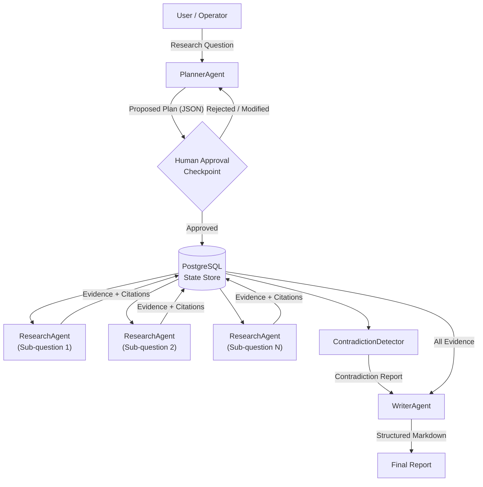
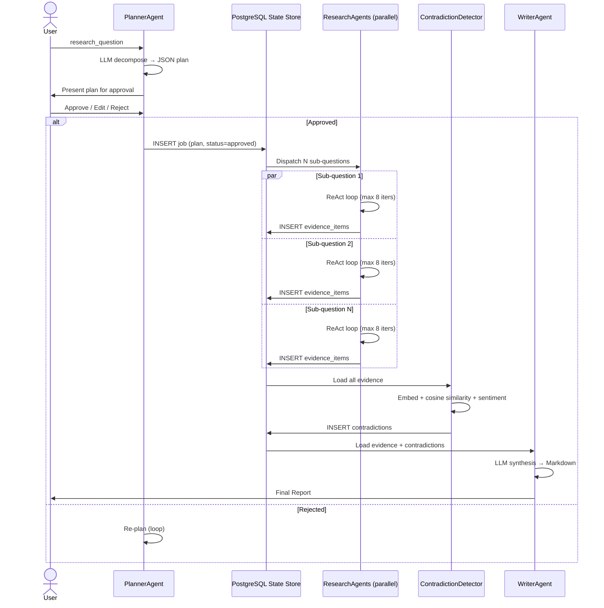

# Week 8: Capstone — Autonomous Research Agent

> **Theme:** Build something that can work while you sleep.

This capstone week brings together every concept from the course into a single, production-worthy system: an autonomous multi-agent research pipeline that accepts a research question, decomposes it into sub-questions, dispatches specialized agents to gather evidence in parallel, detects contradictions across sources, and synthesizes a structured Markdown report — all with a human-in-the-loop approval checkpoint before any real work begins.

---

## Chapter 1: Project Architecture

### Overview

The autonomous research agent is composed of four distinct agents, each with a single, well-defined responsibility. This separation of concerns is not cosmetic — it is architectural. Each agent can be tested, replaced, or scaled independently. The agents communicate through a shared **PostgreSQL state store**, which acts as a durable message bus and long-term memory for the entire pipeline.

### The Four Agents

**PlannerAgent** is the entry point. It receives the user's research question as a string, calls an LLM with a structured prompt to decompose that question into 3–7 specific sub-questions, and emits a JSON array. Crucially, it does not proceed automatically. It presents the plan to the human operator and waits for approval. This is the **Human-in-the-Loop (HITL) checkpoint**: the moment where a person can redirect, narrow, or cancel the research before any expensive API calls are made.

Consider a research question like "What are the economic effects of large language models on the labor market?" The PlannerAgent might decompose this into: (1) Which job categories are most exposed to LLM automation? (2) What empirical data exists on wage changes since 2022? (3) How do economists model AI-driven labor displacement? (4) What new job categories are emerging from LLM adoption? (5) How do effects differ across income quintiles? Each sub-question is independently answerable, and together they reconstruct a complete picture.

**ResearchAgent** runs once per sub-question. Each instance is a **ReAct agent** (Reason + Act) that runs for a maximum of 8 iterations. On each iteration it can invoke one of three tools: a Brave Search API call for recent web content, a Wikipedia lookup for encyclopedic background, or an arXiv search for peer-reviewed papers. Each piece of evidence collected is stored with its source URL, retrieval timestamp, and the sub-question it addresses. The agent terminates early if it determines sufficient evidence has been gathered, or after 8 iterations regardless.

**ContradictionDetector** is a post-processing agent that runs after all ResearchAgents have finished. It loads all collected claims from the state store, embeds them using a sentence transformer model, and computes pairwise cosine similarity. Pairs of claims that are semantically similar (high cosine similarity, indicating they address the same topic) but have opposite sentiment scores are flagged as potential contradictions. This catches cases like one source claiming "LLMs reduce employment" and another claiming "LLMs net increase employment" — both about the same topic but pointing in opposite directions.

**WriterAgent** is the final stage. It receives all evidence, the contradiction report, and the original sub-questions, and synthesizes a structured Markdown report following a fixed template: Executive Summary, per-sub-question Findings, Sources, Contradictions Found, and Confidence Assessment.

### System Architecture Diagram



### Message Flow and Shared State

All agents read from and write to a shared PostgreSQL database. The schema has three core tables: `research_jobs` (one row per top-level research question, with status and the approved plan), `evidence_items` (one row per collected claim, with sub-question ID, source URL, content, and embedding vector), and `contradictions` (pairs of evidence item IDs flagged by the detector). This design means no agent needs to know the address of another agent — they communicate through data, which makes the system resilient to agent failure and restarts.

> **Key Insight:** Shared database state is not just a convenience — it is what makes your agent system resumable. If a ResearchAgent crashes mid-run, no work is lost. The next run picks up from where the database shows it stopped. This is the difference between a demo and a production system.

> **Key Insight:** The HITL checkpoint before research begins is the highest-leverage point in the system. A bad plan answered thoroughly is worse than no research at all. Always let a human inspect the decomposition before committing to expensive downstream work.

> **Key Insight:** Separating ContradictionDetector from WriterAgent is a deliberate design choice. Contradiction detection is a computational task (embedding + similarity); report writing is a generative task (LLM synthesis). Mixing them would couple two very different failure modes.

### Chapter 1 Checkpoint

1. Why is the HITL approval checkpoint placed between PlannerAgent and ResearchAgent rather than at the end of the pipeline?
2. What are the three tables in the shared state store, and what does each one represent?
3. A ResearchAgent has run 7 iterations and found strong evidence. Should it run an 8th iteration? What condition governs early termination?

---

## Chapter 2: Implementation Guide

### Planner Prompt Engineering

The PlannerAgent's effectiveness depends almost entirely on its system prompt. The prompt must be precise enough to produce structured JSON output, yet flexible enough to handle wildly different research questions.

```python
# planner_agent.py
import json
import anthropic
from typing import Optional

PLANNER_SYSTEM_PROMPT = """You are a research planning assistant. Your job is to decompose
a broad research question into 3-7 specific, independently answerable sub-questions.

Rules:
- Each sub-question must be answerable with web search, Wikipedia, or arXiv
- Sub-questions must together fully address the original question
- Sub-questions must be non-overlapping (no redundant coverage)
- Output ONLY a valid JSON array of strings, no other text

Example input: "What are the environmental impacts of Bitcoin mining?"
Example output:
[
  "What is the annual energy consumption of the Bitcoin network in TWh?",
  "What is the carbon intensity of Bitcoin mining by geography?",
  "How does Bitcoin energy use compare to traditional banking infrastructure?",
  "What renewable energy sources are currently used by Bitcoin miners?",
  "What are proposed technical solutions to reduce Bitcoin's energy footprint?"
]"""


class PlannerAgent:
    def __init__(self, client: anthropic.Anthropic, db_conn):
        self.client = client
        self.db = db_conn

    def create_plan(self, research_question: str) -> list[str]:
        """Decompose a research question into sub-questions."""
        response = self.client.messages.create(
            model="claude-opus-4-5",
            max_tokens=1024,
            system=PLANNER_SYSTEM_PROMPT,
            messages=[
                {
                    "role": "user",
                    "content": f"Research question: {research_question}"
                }
            ]
        )
        # Parse the JSON array from the response
        raw = response.content[0].text.strip()
        sub_questions = json.loads(raw)

        # Validate structure
        assert isinstance(sub_questions, list), "Expected a JSON array"
        assert 3 <= len(sub_questions) <= 7, (
            f"Expected 3-7 sub-questions, got {len(sub_questions)}"
        )
        return sub_questions

    def request_approval(
        self,
        research_question: str,
        sub_questions: list[str]
    ) -> Optional[list[str]]:
        """Present plan to human and wait for approval or modification."""
        print("\n" + "="*60)
        print("RESEARCH PLAN — HUMAN APPROVAL REQUIRED")
        print("="*60)
        print(f"\nOriginal question: {research_question}\n")
        print("Proposed sub-questions:")
        for i, sq in enumerate(sub_questions, 1):
            print(f"  {i}. {sq}")
        print("\nOptions:")
        print("  [A] Approve and proceed")
        print("  [R] Reject and re-plan")
        print("  [E] Edit (enter new sub-questions manually)")
        print("  [Q] Quit\n")

        choice = input("Your choice: ").strip().upper()

        if choice == "A":
            return sub_questions
        elif choice == "R":
            return None  # Caller will re-invoke create_plan
        elif choice == "E":
            # Allow human to manually specify sub-questions
            edited = []
            print("Enter sub-questions one per line. Empty line to finish:")
            while True:
                line = input(f"  {len(edited)+1}. ").strip()
                if not line:
                    break
                edited.append(line)
            return edited if edited else None
        else:
            raise SystemExit("Research cancelled by operator.")

    def run(self, research_question: str, job_id: str) -> list[str]:
        """Full planner loop with retry on rejection."""
        while True:
            plan = self.create_plan(research_question)
            approved = self.request_approval(research_question, plan)
            if approved is not None:
                # Persist approved plan to database
                self.db.execute(
                    "UPDATE research_jobs SET plan=%s, status='approved' "
                    "WHERE id=%s",
                    (json.dumps(approved), job_id)
                )
                self.db.commit()
                return approved
            # If rejected, loop and re-plan automatically
            print("\nRe-planning...\n")
```

The critical implementation detail here is the retry loop in `run()`. If the human rejects the plan, the agent automatically calls `create_plan()` again. Because LLMs are non-deterministic, a second call to the same prompt will typically produce a meaningfully different decomposition.

### The Research Loop

Each ResearchAgent runs a ReAct loop — alternating between reasoning about what tool to call next and acting by calling that tool. The loop is capped at 8 iterations to bound API costs.

```python
# research_agent.py
import asyncio
import anthropic
from dataclasses import dataclass
from datetime import datetime
from typing import Any

@dataclass
class EvidenceItem:
    sub_question: str
    content: str
    source_url: str
    source_type: str  # "web", "wikipedia", "arxiv"
    retrieved_at: datetime

RESEARCH_SYSTEM_PROMPT = """You are a research agent. For the given sub-question,
use your tools to gather evidence from multiple sources.

Strategy:
1. Start with a web search to find recent information
2. Use Wikipedia for encyclopedic background and definitions
3. Use arXiv for peer-reviewed academic evidence
4. Collect at least 3 distinct pieces of evidence before concluding
5. Always include the source URL with each piece of evidence

When you have sufficient evidence, call the done tool with a summary."""

tools = [
    {
        "name": "web_search",
        "description": "Search the web via Brave Search API for recent information",
        "input_schema": {
            "type": "object",
            "properties": {
                "query": {"type": "string", "description": "Search query"}
            },
            "required": ["query"]
        }
    },
    {
        "name": "wikipedia_lookup",
        "description": "Look up a topic on Wikipedia",
        "input_schema": {
            "type": "object",
            "properties": {
                "topic": {"type": "string", "description": "Wikipedia article title or topic"}
            },
            "required": ["topic"]
        }
    },
    {
        "name": "arxiv_search",
        "description": "Search arXiv for peer-reviewed papers",
        "input_schema": {
            "type": "object",
            "properties": {
                "query": {"type": "string"},
                "max_results": {"type": "integer", "default": 3}
            },
            "required": ["query"]
        }
    },
    {
        "name": "done",
        "description": "Signal that sufficient evidence has been gathered",
        "input_schema": {
            "type": "object",
            "properties": {
                "summary": {"type": "string", "description": "Brief summary of findings"}
            },
            "required": ["summary"]
        }
    }
]


class ResearchAgent:
    def __init__(self, client: anthropic.Anthropic, tool_executor, db_conn):
        self.client = client
        self.tools = tool_executor  # handles actual API calls
        self.db = db_conn
        self.MAX_ITERATIONS = 8

    async def research(
        self,
        sub_question: str,
        job_id: str
    ) -> list[EvidenceItem]:
        """Run ReAct loop for a single sub-question."""
        messages = [{"role": "user", "content": sub_question}]
        evidence_collected: list[EvidenceItem] = []
        iterations = 0

        while iterations < self.MAX_ITERATIONS:
            iterations += 1

            response = self.client.messages.create(
                model="claude-opus-4-5",
                max_tokens=2048,
                system=RESEARCH_SYSTEM_PROMPT,
                tools=tools,
                messages=messages
            )

            # Append assistant response to message history
            messages.append({"role": "assistant", "content": response.content})

            # Check for early termination via done tool
            tool_uses = [b for b in response.content if b.type == "tool_use"]
            done_call = next((t for t in tool_uses if t.name == "done"), None)
            if done_call or response.stop_reason == "end_turn":
                break

            # Execute each tool call and collect evidence
            tool_results = []
            for tool_use in tool_uses:
                result = await self.tools.execute(
                    tool_use.name,
                    tool_use.input
                )
                # Store evidence item if it's a search result
                if tool_use.name in ("web_search", "wikipedia_lookup", "arxiv_search"):
                    item = EvidenceItem(
                        sub_question=sub_question,
                        content=result["content"],
                        source_url=result["url"],
                        source_type=tool_use.name.split("_")[0],
                        retrieved_at=datetime.utcnow()
                    )
                    evidence_collected.append(item)
                    # Persist to database immediately
                    self._persist_evidence(item, job_id)

                tool_results.append({
                    "type": "tool_result",
                    "tool_use_id": tool_use.id,
                    "content": str(result)
                })

            messages.append({"role": "user", "content": tool_results})

        return evidence_collected

    def _persist_evidence(self, item: EvidenceItem, job_id: str):
        """Write evidence to PostgreSQL immediately (not batch)."""
        self.db.execute(
            """INSERT INTO evidence_items
               (job_id, sub_question, content, source_url, source_type, retrieved_at)
               VALUES (%s, %s, %s, %s, %s, %s)""",
            (job_id, item.sub_question, item.content,
             item.source_url, item.source_type, item.retrieved_at)
        )
        self.db.commit()
```

> **Key Insight:** Persisting evidence to the database immediately inside the loop (not at the end) means you never lose gathered evidence if the agent crashes at iteration 6. Durability should be a loop-level concern, not a post-loop concern.

### Contradiction Detection

Contradiction detection uses a two-stage approach: semantic similarity to find claims about the same topic, then sentiment analysis to detect opposing conclusions.

```python
# contradiction_detector.py
import numpy as np
from sentence_transformers import SentenceTransformer
from transformers import pipeline
from itertools import combinations
from dataclasses import dataclass

@dataclass
class Contradiction:
    claim_a_id: int
    claim_b_id: int
    claim_a_text: str
    claim_b_text: str
    similarity_score: float
    sentiment_a: str
    sentiment_b: str

class ContradictionDetector:
    def __init__(self, db_conn):
        self.db = db_conn
        # Sentence transformer for semantic similarity
        self.embedder = SentenceTransformer("all-MiniLM-L6-v2")
        # Sentiment classifier for opposing polarity detection
        self.sentiment = pipeline(
            "sentiment-analysis",
            model="distilbert-base-uncased-finetuned-sst-2-english"
        )
        # Thresholds (tune based on your domain)
        self.SIMILARITY_THRESHOLD = 0.75  # Claims must be semantically close
        self.MIN_CLAIM_LENGTH = 50  # Ignore very short fragments

    def detect(self, job_id: str) -> list[Contradiction]:
        """Find contradictions in all evidence for a job."""
        # Load all evidence from database
        rows = self.db.execute(
            "SELECT id, content FROM evidence_items WHERE job_id = %s",
            (job_id,)
        ).fetchall()

        # Filter out very short claims
        claims = [(r[0], r[1]) for r in rows if len(r[1]) >= self.MIN_CLAIM_LENGTH]

        if len(claims) < 2:
            return []

        ids = [c[0] for c in claims]
        texts = [c[1] for c in claims]

        # Compute embeddings for all claims in batch
        embeddings = self.embedder.encode(texts, batch_size=32, show_progress_bar=False)

        # Compute pairwise cosine similarity
        # Normalize first for efficient dot-product similarity
        norms = np.linalg.norm(embeddings, axis=1, keepdims=True)
        normalized = embeddings / (norms + 1e-8)
        similarity_matrix = normalized @ normalized.T

        # Get sentiment for all claims
        sentiments = self.sentiment(texts, truncation=True, max_length=512)

        contradictions: list[Contradiction] = []

        # Check all pairs
        for i, j in combinations(range(len(claims)), 2):
            sim = float(similarity_matrix[i, j])
            if sim < self.SIMILARITY_THRESHOLD:
                continue  # Not about the same topic

            sentiment_i = sentiments[i]["label"]
            sentiment_j = sentiments[j]["label"]

            # Contradiction = high similarity + opposite sentiment
            if sentiment_i != sentiment_j:
                c = Contradiction(
                    claim_a_id=ids[i],
                    claim_b_id=ids[j],
                    claim_a_text=texts[i],
                    claim_b_text=texts[j],
                    similarity_score=sim,
                    sentiment_a=sentiment_i,
                    sentiment_b=sentiment_j
                )
                contradictions.append(c)
                # Persist contradiction
                self.db.execute(
                    """INSERT INTO contradictions
                       (job_id, claim_a_id, claim_b_id, similarity_score)
                       VALUES (%s, %s, %s, %s)""",
                    (job_id, ids[i], ids[j], sim)
                )

        self.db.commit()
        # Sort by similarity (most confident contradictions first)
        return sorted(contradictions, key=lambda c: c.similarity_score, reverse=True)
```

### Report Generation Template

The WriterAgent uses a structured prompt that mandates a specific Markdown template. This is not aesthetic preference — it ensures the output is machine-parseable for downstream systems.

```python
# writer_agent.py
import anthropic
from string import Template

REPORT_TEMPLATE = Template("""
You are writing a structured research report. Use EXACTLY this Markdown template:

# Research Report: $research_question

## Executive Summary
[2-3 paragraph synthesis of all findings. Be specific, cite numbers where available.]

## Findings

$findings_sections

## Sources
$sources_section

## Contradictions Found
$contradictions_section

## Confidence Assessment
[Rate overall confidence as HIGH/MEDIUM/LOW and explain why, referencing:
- Number of independent sources
- Recency of evidence
- Presence of peer-reviewed vs. web-only sources
- Severity of contradictions found]
""")


class WriterAgent:
    def __init__(self, client: anthropic.Anthropic, db_conn):
        self.client = client
        self.db = db_conn

    def generate_report(self, job_id: str, research_question: str) -> str:
        """Synthesize all evidence into a structured Markdown report."""
        # Load all evidence grouped by sub-question
        rows = self.db.execute(
            """SELECT sub_question, content, source_url, source_type
               FROM evidence_items WHERE job_id = %s
               ORDER BY sub_question, retrieved_at""",
            (job_id,)
        ).fetchall()

        # Load contradictions
        contradictions = self.db.execute(
            """SELECT c.similarity_score, e1.content, e2.content
               FROM contradictions c
               JOIN evidence_items e1 ON c.claim_a_id = e1.id
               JOIN evidence_items e2 ON c.claim_b_id = e2.id
               WHERE c.job_id = %s
               ORDER BY c.similarity_score DESC""",
            (job_id,)
        ).fetchall()

        # Build structured context for WriterAgent
        evidence_by_sq: dict[str, list] = {}
        all_sources: list[str] = []
        for sq, content, url, src_type in rows:
            evidence_by_sq.setdefault(sq, []).append((content, url, src_type))
            if url not in all_sources:
                all_sources.append(url)

        # Build template sections
        findings_md = ""
        for sq, items in evidence_by_sq.items():
            findings_md += f"### {sq}\n\n"
            for content, url, _ in items:
                findings_md += f"{content}\n\n*Source: {url}*\n\n"

        sources_md = "\n".join(f"- {url}" for url in all_sources)

        if contradictions:
            contradictions_md = ""
            for sim, claim_a, claim_b in contradictions:
                contradictions_md += (
                    f"**Conflict (similarity: {sim:.2f})**\n\n"
                    f"- Claim A: {claim_a[:200]}...\n"
                    f"- Claim B: {claim_b[:200]}...\n\n"
                )
        else:
            contradictions_md = "*No contradictions detected.*"

        prompt = REPORT_TEMPLATE.substitute(
            research_question=research_question,
            findings_sections=findings_md,
            sources_section=sources_md,
            contradictions_section=contradictions_md
        )

        response = self.client.messages.create(
            model="claude-opus-4-5",
            max_tokens=4096,
            messages=[{"role": "user", "content": prompt}]
        )

        return response.content[0].text
```

> **Key Insight:** The WriterAgent prompt includes the literal template structure it must follow. Without this, LLMs will invent their own section names and ordering, making the output unparseable by any downstream system that expects a consistent format.

> **Key Insight:** Grouping all evidence by sub-question before sending it to the WriterAgent is a form of context management. It prevents the LLM from having to infer structure from a flat list of 40+ evidence items, dramatically improving synthesis quality.

### Chapter 2 Checkpoint

1. The planner prompt says "Output ONLY a valid JSON array of strings, no other text." Why is this constraint critical for a production system, and what should you do when the model violates it?
2. In the ReAct loop, why is the message history (`messages` list) passed to every call, rather than starting fresh each iteration?
3. Explain why `SIMILARITY_THRESHOLD = 0.75` is a tunable parameter rather than a fixed constant. What domain factors would push this value higher or lower?

---

## Chapter 3: Stretch Goals and Evaluation

### Sequence Diagram

Before diving into stretch goals, here is the full sequence flow showing how the system operates end-to-end:



### Parallelism with asyncio.gather

The single highest-impact optimization is running all ResearchAgents concurrently. Without parallelism, five sub-questions each taking 30 seconds means a 2.5-minute wait. With `asyncio.gather`, all five run simultaneously, and the wall-clock time approaches the duration of the slowest single agent.

```python
# orchestrator.py
import asyncio
import anthropic
from typing import Optional

class ResearchOrchestrator:
    def __init__(self, db_conn):
        self.client = anthropic.Anthropic()
        self.db = db_conn

    async def run_research_pipeline(
        self,
        research_question: str,
        job_id: str,
        approved_plan: list[str]
    ) -> str:
        """Run all research agents in parallel, then synthesize."""

        # Create one ResearchAgent coroutine per sub-question
        research_tasks = [
            self._run_single_agent(sub_question, job_id)
            for sub_question in approved_plan
        ]

        # asyncio.gather runs all coroutines concurrently
        # return_exceptions=True means one failure doesn't cancel others
        results = await asyncio.gather(*research_tasks, return_exceptions=True)

        # Log any failures without aborting the pipeline
        for i, result in enumerate(results):
            if isinstance(result, Exception):
                print(f"[WARN] Sub-question {i+1} failed: {result}")
                # The rest of the evidence is still usable

        # Run contradiction detection (sequential — depends on all evidence)
        detector = ContradictionDetector(self.db)
        contradictions = detector.detect(job_id)
        print(f"[INFO] Found {len(contradictions)} potential contradictions")

        # Generate final report
        writer = WriterAgent(self.client, self.db)
        report = writer.generate_report(job_id, research_question)

        # Save report to database
        self.db.execute(
            "UPDATE research_jobs SET report=%s, status='complete' WHERE id=%s",
            (report, job_id)
        )
        self.db.commit()
        return report

    async def _run_single_agent(self, sub_question: str, job_id: str):
        """Wrapper to run ResearchAgent as an async coroutine."""
        # Tool executor handles actual API calls (Brave, Wikipedia, arXiv)
        tool_executor = ToolExecutor(brave_api_key=..., ...)
        agent = ResearchAgent(self.client, tool_executor, self.db)
        evidence = await agent.research(sub_question, job_id)
        print(f"[INFO] Gathered {len(evidence)} items for: {sub_question[:50]}...")
        return evidence
```

The `return_exceptions=True` flag in `asyncio.gather` is a production-critical detail. Without it, a single tool timeout or API rate-limit error will cancel all concurrent agents, discarding all partial results. With it, failures are captured as exception objects in the results list and the pipeline continues with whatever evidence was gathered.

### MCP Server Stretch Goal

Exposing the research agent as an **MCP (Model Context Protocol) server** allows other AI agents to invoke your research pipeline as a tool. This is the "agent as a service" pattern — your pipeline becomes a capability that any MCP-compatible host can use.

```python
# mcp_server.py
# Requires: pip install anthropic-mcp
from mcp.server import MCPServer
from mcp.types import Tool, TextContent
import asyncio
import uuid

server = MCPServer("autonomous-research-agent")

@server.tool()
async def start_research(research_question: str, auto_approve: bool = False) -> str:
    """
    Start an autonomous research job.
    Returns a job_id to track progress.
    Set auto_approve=True to skip human checkpoint (use with caution).
    """
    job_id = str(uuid.uuid4())
    # Insert job into database
    db.execute(
        "INSERT INTO research_jobs (id, question, status) VALUES (%s, %s, 'pending')",
        (job_id, research_question)
    )
    db.commit()
    # Launch pipeline in background
    asyncio.create_task(
        run_pipeline_background(job_id, research_question, auto_approve)
    )
    return f"Research started. Job ID: {job_id}"

@server.tool()
async def check_status(job_id: str) -> str:
    """Check the status of a running research job."""
    row = db.execute(
        "SELECT status, plan FROM research_jobs WHERE id = %s",
        (job_id,)
    ).fetchone()
    if not row:
        return f"Job {job_id} not found."
    status, plan = row
    return f"Status: {status}\nPlan: {plan}"

@server.tool()
async def get_report(job_id: str) -> str:
    """Retrieve the completed research report for a job."""
    row = db.execute(
        "SELECT status, report FROM research_jobs WHERE id = %s",
        (job_id,)
    ).fetchone()
    if not row:
        return "Job not found."
    status, report = row
    if status != "complete":
        return f"Report not ready. Current status: {status}"
    return report

if __name__ == "__main__":
    server.run(transport="stdio")
```

### Evaluation Framework

Evaluation for an autonomous research agent involves three distinct dimensions, each requiring different measurement approaches:

**Factual Accuracy** is measured by human spot-check. For each completed report, randomly select 5 claims from the Findings section, attempt to verify each claim independently using a search engine, and record pass/fail. A threshold of 80% verified claims is a reasonable minimum for a research assistant tool.

**Citation Coverage** is automatically computable: count the number of claims in the Findings section that include an inline source citation, divide by total claims. The WriterAgent prompt should be engineered to achieve >90% citation coverage. Any claim without a source citation is unverifiable and should be treated as lower-confidence.

**Contradiction Recall** requires a labeled test set: manually curated research topics where you have pre-identified known contradictions between sources. Run your ContradictionDetector against evidence gathered on these topics and compute recall (what fraction of true contradictions were detected). This is the hardest metric to improve because it requires tuning both the similarity threshold and the sentiment model.

```python
# evaluation.py
import json
from dataclasses import dataclass

@dataclass
class EvaluationResult:
    factual_accuracy: float        # 0.0 - 1.0, from human spot-check
    citation_coverage: float       # 0.0 - 1.0, automatically computed
    contradiction_recall: float    # 0.0 - 1.0, requires labeled test set
    avg_evidence_per_sq: float     # diagnostic metric

def compute_citation_coverage(report_markdown: str) -> float:
    """Count sentences with citations vs. total sentences in Findings."""
    import re
    # Extract Findings section
    findings_match = re.search(
        r"## Findings\n(.*?)(?=## Sources|## Contradictions|$)",
        report_markdown,
        re.DOTALL
    )
    if not findings_match:
        return 0.0

    findings_text = findings_match.group(1)
    # Count sentences (rough heuristic)
    sentences = [s.strip() for s in re.split(r'[.!?]+', findings_text) if len(s.strip()) > 20]
    if not sentences:
        return 0.0
    # Count citations (Markdown links or *Source:* patterns)
    cited = sum(1 for s in sentences if re.search(r'\[.*?\]\(.*?\)|\*Source:', s))
    return cited / len(sentences)

def evaluate_contradiction_recall(
    detector_output: list,
    ground_truth_contradictions: list
) -> float:
    """Compute recall against a labeled set of known contradictions."""
    if not ground_truth_contradictions:
        return 1.0  # No ground truth = undefined, return 1.0 by convention

    detected_pairs = set(
        (min(c.claim_a_id, c.claim_b_id), max(c.claim_a_id, c.claim_b_id))
        for c in detector_output
    )
    true_pairs = set(
        (min(a, b), max(a, b))
        for a, b in ground_truth_contradictions
    )
    hits = len(detected_pairs & true_pairs)
    return hits / len(true_pairs)
```

### Persistent Memory Stretch Goal

The persistent memory stretch goal stores vector embeddings of past research summaries, allowing the agent to skip re-researching known topics.

```python
# memory_store.py
from sentence_transformers import SentenceTransformer
import psycopg2
import numpy as np

class ResearchMemory:
    """Vector store for past research summaries using pgvector."""

    def __init__(self, db_conn, similarity_threshold: float = 0.90):
        self.db = db_conn
        self.embedder = SentenceTransformer("all-MiniLM-L6-v2")
        self.threshold = similarity_threshold

    def check_cache(self, research_question: str) -> str | None:
        """Return cached report if sufficiently similar question was researched before."""
        q_embedding = self.embedder.encode(research_question).tolist()
        # pgvector cosine similarity query
        row = self.db.execute(
            """SELECT report, 1 - (embedding <=> %s::vector) AS similarity
               FROM research_memory
               ORDER BY embedding <=> %s::vector
               LIMIT 1""",
            (q_embedding, q_embedding)
        ).fetchone()

        if row and row[1] >= self.threshold:
            print(f"[CACHE HIT] Similarity {row[1]:.3f} — returning cached report")
            return row[0]
        return None

    def store_result(self, research_question: str, report: str):
        """Store a completed research report for future cache hits."""
        embedding = self.embedder.encode(research_question).tolist()
        self.db.execute(
            """INSERT INTO research_memory (question, report, embedding)
               VALUES (%s, %s, %s::vector)""",
            (research_question, report, embedding)
        )
        self.db.commit()
```

> **Key Insight:** The cache threshold of 0.90 is intentionally very high. Research questions that are 75% similar may have critically different answers ("effects of AI on employment" vs. "effects of AI on executive employment"). Cache hits should only occur when questions are nearly identical.

> **Key Insight:** Parallelism is not free. Running 7 ResearchAgents concurrently means 7 simultaneous API connections. Budget for rate-limit handling (exponential backoff on 429 responses) and connection pool limits in your database.

> **Key Insight:** The MCP server pattern turns your pipeline into composable infrastructure. When another agent needs research capability, it calls `start_research` and polls `check_status` — it does not need to understand or replicate your architecture.

### Chapter 3 Checkpoint

1. Why is `return_exceptions=True` a production-critical argument to `asyncio.gather`? What happens to the pipeline without it when one agent encounters a network timeout?
2. The evaluation framework distinguishes factual accuracy (human-evaluated) from citation coverage (automatically computed). Why can't citation coverage serve as a proxy for factual accuracy?
3. A persistent memory cache with threshold 0.90 will miss cache opportunities that a 0.75 threshold would catch. What is the concrete risk of using the lower threshold for a research agent?

---

## Lab Walkthrough

### Build a Working Autonomous Research Agent

This lab walks you through assembling the full system described in this week's chapters into a working end-to-end pipeline. Estimated completion time: 4–6 hours.

#### Step 1: Environment Setup

```bash
# Create and activate virtual environment
python -m venv .venv
.venv\Scripts\activate   # Windows
# source .venv/bin/activate  # macOS/Linux

# Install dependencies
pip install anthropic sentence-transformers transformers psycopg2-binary
pip install brave-search wikipedia-api arxiv asyncio
```

#### Step 2: Database Initialization

```bash
# Start PostgreSQL (adjust for your OS)
# Enable pgvector extension if using persistent memory stretch goal
psql -U postgres -c "CREATE EXTENSION IF NOT EXISTS vector;"
```

```python
# db_init.py — run once to create schema
import psycopg2

conn = psycopg2.connect(
    host="localhost", dbname="research_agent", user="postgres", password="yourpassword"
)
cur = conn.cursor()

cur.execute("""
CREATE TABLE IF NOT EXISTS research_jobs (
    id          TEXT PRIMARY KEY,
    question    TEXT NOT NULL,
    plan        JSONB,
    status      TEXT DEFAULT 'pending',
    report      TEXT,
    created_at  TIMESTAMPTZ DEFAULT NOW()
);

CREATE TABLE IF NOT EXISTS evidence_items (
    id           SERIAL PRIMARY KEY,
    job_id       TEXT REFERENCES research_jobs(id),
    sub_question TEXT NOT NULL,
    content      TEXT NOT NULL,
    source_url   TEXT,
    source_type  TEXT,
    retrieved_at TIMESTAMPTZ DEFAULT NOW()
);

CREATE TABLE IF NOT EXISTS contradictions (
    id              SERIAL PRIMARY KEY,
    job_id          TEXT REFERENCES research_jobs(id),
    claim_a_id      INTEGER REFERENCES evidence_items(id),
    claim_b_id      INTEGER REFERENCES evidence_items(id),
    similarity_score FLOAT
);

-- For persistent memory stretch goal
CREATE TABLE IF NOT EXISTS research_memory (
    id         SERIAL PRIMARY KEY,
    question   TEXT NOT NULL,
    report     TEXT NOT NULL,
    embedding  vector(384),  -- all-MiniLM-L6-v2 produces 384-dim vectors
    created_at TIMESTAMPTZ DEFAULT NOW()
);
""")

conn.commit()
cur.close()
conn.close()
print("Schema created successfully.")
```

#### Step 3: Implement the Tool Executor

```python
# tool_executor.py
import httpx
import wikipedia
import arxiv

class ToolExecutor:
    def __init__(self, brave_api_key: str):
        self.brave_api_key = brave_api_key

    async def execute(self, tool_name: str, tool_input: dict) -> dict:
        if tool_name == "web_search":
            return await self._brave_search(tool_input["query"])
        elif tool_name == "wikipedia_lookup":
            return self._wikipedia_lookup(tool_input["topic"])
        elif tool_name == "arxiv_search":
            return self._arxiv_search(
                tool_input["query"],
                tool_input.get("max_results", 3)
            )
        else:
            return {"content": "Unknown tool", "url": ""}

    async def _brave_search(self, query: str) -> dict:
        async with httpx.AsyncClient() as client:
            response = await client.get(
                "https://api.search.brave.com/res/v1/web/search",
                headers={"X-Subscription-Token": self.brave_api_key},
                params={"q": query, "count": 5}
            )
            data = response.json()
            results = data.get("web", {}).get("results", [])
            if not results:
                return {"content": "No results found.", "url": ""}
            top = results[0]
            return {
                "content": top.get("description", ""),
                "url": top.get("url", ""),
                "title": top.get("title", "")
            }

    def _wikipedia_lookup(self, topic: str) -> dict:
        try:
            page = wikipedia.page(topic, auto_suggest=True)
            # Return first 500 chars of summary to avoid token bloat
            return {"content": page.summary[:500], "url": page.url}
        except wikipedia.exceptions.PageError:
            return {"content": f"No Wikipedia page found for '{topic}'.", "url": ""}
        except wikipedia.exceptions.DisambiguationError as e:
            # Use first option on disambiguation
            page = wikipedia.page(e.options[0])
            return {"content": page.summary[:500], "url": page.url}

    def _arxiv_search(self, query: str, max_results: int = 3) -> dict:
        search = arxiv.Search(query=query, max_results=max_results)
        results = list(search.results())
        if not results:
            return {"content": "No arXiv papers found.", "url": ""}
        top = results[0]
        content = f"Title: {top.title}\nAbstract: {top.summary[:300]}..."
        return {"content": content, "url": top.entry_id}
```

#### Step 4: Wire the Main Entry Point

```python
# main.py
import asyncio
import uuid
import psycopg2
import anthropic

async def main():
    # Connect to database
    db = psycopg2.connect(
        host="localhost", dbname="research_agent",
        user="postgres", password="yourpassword"
    )
    client = anthropic.Anthropic()

    # Get research question from user
    research_question = input("Enter your research question: ").strip()
    if not research_question:
        print("No question provided.")
        return

    # Create job record
    job_id = str(uuid.uuid4())
    db.execute(
        "INSERT INTO research_jobs (id, question, status) VALUES (%s, %s, 'pending')",
        (job_id, research_question)
    )
    db.commit()
    print(f"\nJob ID: {job_id}")

    # Step 1: Planning with HITL checkpoint
    planner = PlannerAgent(client, db)
    approved_plan = planner.run(research_question, job_id)
    print(f"\n[INFO] Approved plan with {len(approved_plan)} sub-questions")

    # Step 2: Parallel research
    orchestrator = ResearchOrchestrator(db)
    report = await orchestrator.run_research_pipeline(
        research_question, job_id, approved_plan
    )

    # Step 3: Save report to file
    output_path = f"report_{job_id[:8]}.md"
    with open(output_path, "w", encoding="utf-8") as f:
        f.write(report)

    print(f"\n[DONE] Report saved to: {output_path}")
    db.close()

if __name__ == "__main__":
    asyncio.run(main())
```

#### Step 5: Run and Verify

```bash
# Set your API keys
export ANTHROPIC_API_KEY="your-key-here"
export BRAVE_API_KEY="your-brave-key-here"

# Run the agent
python main.py
```

Test with a question like: "What are the current challenges in training large language models on multilingual data?"

Verify the output report contains all five sections: Executive Summary, Findings (with sub-sections), Sources, Contradictions Found, and Confidence Assessment.

#### Step 6: Parallelism Verification

Add timing instrumentation to confirm parallel execution:

```python
import time
start = time.time()
results = await asyncio.gather(*research_tasks, return_exceptions=True)
elapsed = time.time() - start
print(f"[TIMING] {len(research_tasks)} agents completed in {elapsed:.1f}s")
# Compare vs. sequential estimate: len(research_tasks) * ~30s per agent
```

---

## Further Reading

1. **"Agents" chapter, Anthropic documentation** — The official guide to building multi-agent systems with Claude, covering tool use, orchestration patterns, and the parallelization considerations referenced throughout this week. Available at docs.anthropic.com/agents.

2. **"ReAct: Synergizing Reasoning and Acting in Language Models"** — Yao et al., 2022. The original paper introducing the Reason+Act loop pattern used by ResearchAgent. Available on arXiv (arXiv:2210.03629).

3. **"Building LLM-Powered Multi-Agent Systems"** — Andrew Ng, AI Fund, 2024. Lecture series covering orchestrator-worker agent patterns, shared state architectures, and HITL integration. Available at deeplearning.ai.

4. **"Sentence-BERT: Sentence Embeddings using Siamese BERT-Networks"** — Reimers and Gurevych, 2019. The foundational paper for the sentence-transformers library used in the ContradictionDetector. arXiv:1908.10084.

5. **"The Model Context Protocol Specification"** — Anthropic, 2024. The formal MCP specification relevant to the server stretch goal, covering tool definitions, transport formats, and host integration. Available at modelcontextprotocol.io.

---

## Week Summary

- **Multi-agent decomposition** is the correct architectural response to complex tasks: break the task into single-responsibility agents that communicate through shared, durable state rather than direct inter-process calls.

- **Human-in-the-Loop checkpoints** should be placed at the highest-leverage decision point — typically the plan approval stage, before any expensive downstream work is committed — not sprinkled throughout the pipeline.

- **asyncio.gather with return_exceptions=True** is the standard pattern for running independent agent instances in parallel; partial failures must not abort the entire pipeline, and all intermediate results should be persisted immediately to the database.

- **Contradiction detection using embedding similarity plus sentiment analysis** is a practical, model-agnostic approach that does not require a dedicated fact-checking LLM call for every pair of claims; tuning the similarity threshold is a domain-specific calibration task.

- **Evaluation of autonomous agents requires multiple dimensions**: factual accuracy (human-evaluated), citation coverage (automatically computed), and contradiction recall (requires a labeled test set) — no single metric is sufficient, and each catches different failure modes.
