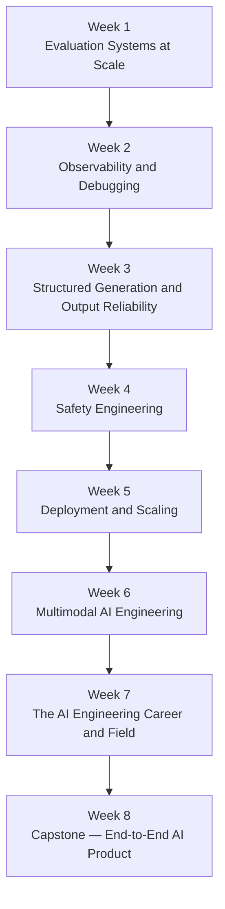

# Course 3: Production AI Engineering

## Description

Ship AI systems that work at scale. This course covers the full lifecycle of production AI: evaluation systems, observability, structured generation, safety engineering, deployment, multimodal AI, and career development. By the end, you will have the skills and portfolio pieces to work as a professional AI engineer.

## Prerequisites

- Courses 1 & 2 of the AI Engineering Curriculum, **or**
- Strong hands-on experience with AI agents and RAG systems

---

## Learning Progression

---

## Table of Contents

| Week | Topic |
|------|-------|
| [Week 1: Evaluation Systems at Scale](week1-eval-at-scale.md) | Systematic quality assurance for AI |
| [Week 2: Observability and Debugging](week2-observability.md) | See what your AI is actually doing |
| [Week 3: Structured Generation and Output Reliability](week3-structured-generation.md) | Make your AI output machine-parseable, every time |
| [Week 4: Safety Engineering](week4-safety-engineering.md) | AI that behaves correctly, even when users don't |
| [Week 5: Deployment and Scaling](week5-deployment.md) | From working code to production system |
| [Week 6: Multimodal AI Engineering](week6-multimodal.md) | AI that can see, read, and listen |
| [Week 7: The AI Engineering Career and Field](week7-career.md) | Where you fit in this field and where it's going |
| [Week 8: Capstone — End-to-End AI Product](week8-capstone.md) | Ship something you'd put in your portfolio |

---

## What You'll Build

- **Eval harness** — An automated evaluation pipeline that scores AI outputs against a ground-truth dataset and tracks quality regressions over time
- **Observability dashboard** — Tracing and logging instrumentation for an AI system, with a dashboard that surfaces latency, cost, and failure patterns
- **Structured output layer** — A schema-validated generation pipeline using JSON mode or function calling, with retry and repair logic for malformed outputs
- **Safety filter** — A prompt-injection and jailbreak detection layer with policy enforcement and audit logging
- **Deployed AI service** — A containerized AI application deployed to a cloud provider, with auto-scaling, health checks, and a CI/CD pipeline
- **Multimodal feature** — An AI feature that ingests at least two modalities (e.g., image + text or audio + text) and returns a structured result
- **Capstone project** — A complete, portfolio-ready AI product that integrates evaluation, observability, safety, and deployment

---

## Tools and Technologies

| Category | Tools |
|----------|-------|
| Evaluation | Promptfoo, LangSmith, RAGAS, custom eval frameworks |
| Observability | OpenTelemetry, LangSmith, Langfuse, Helicone, Arize |
| Structured generation | Instructor, Outlines, structured output with Mistral, Pydantic, plus OpenAI / Anthropic comparison examples |
| Safety | Guardrails AI, LlamaGuard, prompt injection detection, content moderation APIs |
| Deployment | Docker, Kubernetes, AWS / Azure / GCP, modal, Railway, GitHub Actions |
| Multimodal | GPT-4o, Claude 3.x, Gemini 1.5, Whisper, document parsing (Textract, Azure Document Intelligence) |
| Languages & frameworks | Python, FastAPI, Pydantic, asyncio |
| Testing | pytest, hypothesis, property-based testing for AI outputs |

---

## Assessment Overview

| Week | Assessment | Weight |
|------|-----------|--------|
| Week 1 | Eval harness implementation + regression report | 10% |
| Week 2 | Instrumented application + observability write-up | 10% |
| Week 3 | Structured generation pipeline with schema validation | 10% |
| Week 4 | Safety layer implementation + red-team test results | 10% |
| Week 5 | Deployed service with CI/CD pipeline demo | 15% |
| Week 6 | Multimodal feature demo | 10% |
| Week 7 | Career reflection + field analysis essay | 5% |
| Week 8 | Capstone: end-to-end AI product | 30% |

Passing grade: 70% overall. The capstone must be submitted to receive a course certificate.
