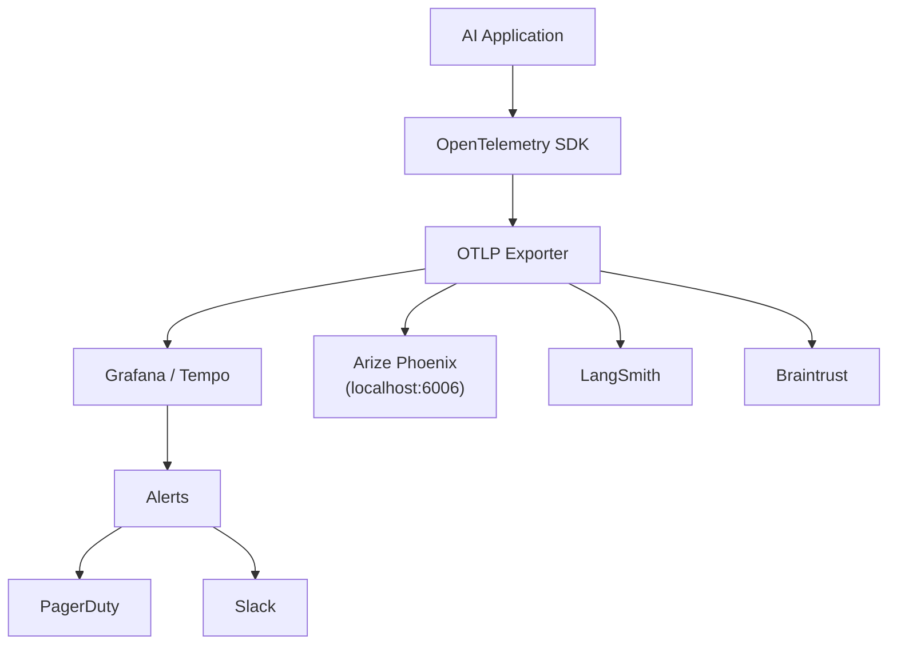
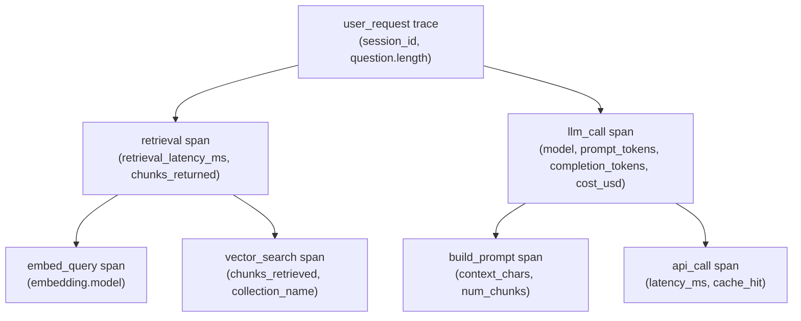

# Week 2: Observability and Debugging

**Theme: See what your AI is actually doing**

This week we move from building AI pipelines to understanding what they are doing in production. You will learn why traditional monitoring tools fall short for AI systems, how to instrument your pipelines with industry-standard tracing tools, how to build dashboards that surface real problems, and how to systematically debug the failure modes unique to language model applications.

---

## 2.1 AI Observability Fundamentals

### Why Traditional APM Fails for AI

Application Performance Monitoring (APM) tools were built for a world where your service either returned a 200 or a 500, latency was measured in milliseconds, and cost was a function of compute time. AI applications break all three of these assumptions in ways that require a fundamentally different observability model.

**Latency characteristics** in AI applications span a range that would be alarming in any traditional service. A single LLM API call routinely takes between 1 and 30 seconds depending on the model, the prompt length, and the output length. A RAG pipeline that performs vector retrieval, assembles context, calls the model, and post-processes the response can easily take 8-15 seconds end to end. Traditional APM tools that alert when p99 latency exceeds 500ms would be firing constantly and meaninglessly. You need different thresholds, different distributions, and different intuitions about what "slow" means.

**Error semantics** are entirely different. A web API either works or it throws an exception. An LLM call almost always succeeds at the HTTP level — you get a 200 back with a beautifully formatted JSON response containing text that is confidently, fluently, completely wrong. The model hallucinated a fact. It answered a different question than the one asked. It gave advice that is plausible but dangerous. None of this triggers a traditional error monitor. You need a concept of **semantic errors**: responses that are syntactically valid but semantically incorrect.

**Cost structure** inverts the traditional model. In a web service, you pay for the compute running your servers whether or not requests come in. In AI applications, cost is directly proportional to usage: every token processed has a price. A single expensive query from one user can cost 50 times what a typical query costs. Cost becomes a per-request observable metric, not a background infrastructure concern.

### The Observability Data Model for LLMs

AI observability borrows the vocabulary of distributed tracing and extends it for the specific structure of LLM applications.

A **trace** represents one complete user request from start to finish. When a user submits a question to your AI assistant, a trace captures everything that happens to answer that question: the retrieval, the prompt assembly, the model call, the response parsing, and anything else involved.

A **span** is one operation within a trace. Spans have a name, a start time, a duration, and a set of attributes. In an AI pipeline, your spans might be: `retrieve_context`, `embed_query`, `vector_search`, `build_prompt`, `llm_call`, and `parse_response`. Spans can be nested — the `retrieve_context` span is a parent that contains child spans for `embed_query` and `vector_search`.

An **event** is something notable that happens within a span. Events are instantaneous — they have a timestamp but no duration. Examples: a cache hit event attached to an `embed_query` span, a token limit warning event attached to a `build_prompt` span, a retry event attached to an `llm_call` span.

### What to Log Per LLM Call

Every LLM call in production should record the following attributes on its span:

- **input_messages**: The full message array sent to the model, truncated or hashed for PII compliance
- **output_text**: The model's response, again with PII handling
- **model**: The model identifier (e.g., `claude-sonnet-4-5`, `gpt-4o`)
- **temperature**: The sampling temperature used
- **prompt_tokens**: Number of input tokens billed
- **completion_tokens**: Number of output tokens billed
- **cost_usd**: Calculated cost based on model pricing
- **latency_ms**: Time from request to first byte, and time to last byte (for streaming)
- **cache_hit**: Whether a prompt cache or semantic cache was used

### User Feedback Signals

Beyond technical metrics, you need to capture signals about whether the AI actually helped. Explicit signals include thumbs up/down buttons attached to responses. Implicit signals are more valuable because users give them without thinking: a user who edits the AI's response before sending it is signaling that the response was wrong (message edit = implicit negative signal). A user who abandons a session without completing their task is a weaker signal but still meaningful. A user who immediately sends a follow-up question asking for clarification likely received an insufficient answer.

> **Key Insight:** The most actionable feedback signal is the message edit. When a user takes the AI's output and rewrites it before using it, that is a ground-truth label: the model was wrong. Capture these edits and attach them to the traces that produced the original outputs.

> **Key Insight:** Traditional error rates measure infrastructure failures. For AI, you need a "quality rate" — the percentage of responses that users found acceptable. A system with 0% HTTP error rate and 40% user dissatisfaction is a failing system.

> **Key Insight:** Token costs compound quickly. A RAG pipeline that injects 10,000 tokens of context per query at $15/million tokens for input costs $0.15 per query. At 10,000 queries per day that is $1,500/day just in context injection. Observability that surfaces cost-per-request early prevents budget surprises.

### Chapter 2.1 Checkpoint

1. Why does a 200 HTTP response not indicate success for an LLM API call, and what does this imply for how you should structure error monitoring?
2. Describe the relationship between a trace, a span, and an event. Give one concrete example of each from a RAG question-answering pipeline.
3. A user asks a question, receives an AI response, rewrites the entire response themselves, and submits their rewritten version. What implicit feedback signal does this generate, and how should it be captured?

---

## 2.2 Tracing AI Pipelines

### OpenTelemetry for AI Applications

**OpenTelemetry (OTel)** is the open standard for distributed tracing and has become the default instrumentation layer for AI applications. The key library for Anthropic applications is `opentelemetry-instrumentation-anthropic`, which automatically wraps every API call you make and creates spans without requiring you to modify your business logic.

Once instrumented, spans are exported via the **OTLP (OpenTelemetry Protocol)** to whatever backend you choose: Grafana, Jaeger, DataDog, or any OTLP-compatible receiver. This backend independence is the major advantage of OpenTelemetry — you instrument once and can switch observability backends without touching application code.

```python
"""
rag_pipeline_instrumented.py

A minimal RAG pipeline with full OpenTelemetry instrumentation.
Prerequisites:
  pip install anthropic chromadb opentelemetry-sdk opentelemetry-exporter-otlp-proto-grpc
  pip install opentelemetry-instrumentation-anthropic
"""

import os
import time
from opentelemetry import trace
from opentelemetry.sdk.trace import TracerProvider
from opentelemetry.sdk.trace.export import BatchSpanProcessor
from opentelemetry.exporter.otlp.proto.grpc.trace_exporter import OTLPSpanExporter
from opentelemetry.sdk.resources import Resource
from opentelemetry.instrumentation.anthropic import AnthropicInstrumentor
import anthropic
import chromadb

# ── 1. Configure the tracer provider ────────────────────────────────────────
# The Resource identifies your service in the trace backend.
resource = Resource.create({
    "service.name": "rag-assistant",
    "service.version": "1.0.0",
    "deployment.environment": os.getenv("ENV", "development"),
})

# OTLPSpanExporter sends spans to an OTLP endpoint.
# For local Arize Phoenix: endpoint="http://localhost:4317"
# For Grafana Tempo: endpoint="http://tempo:4317"
exporter = OTLPSpanExporter(
    endpoint=os.getenv("OTEL_EXPORTER_OTLP_ENDPOINT", "http://localhost:4317"),
    insecure=True,  # Remove in production, use TLS
)

provider = TracerProvider(resource=resource)
provider.add_span_processor(BatchSpanProcessor(exporter))
trace.set_tracer_provider(provider)

# ── 2. Auto-instrument the Anthropic SDK ────────────────────────────────────
# This patches anthropic.Anthropic so every messages.create() call
# automatically creates a span with model, token counts, cost, and latency.
AnthropicInstrumentor().instrument()

# ── 3. Get a tracer for manual spans ────────────────────────────────────────
tracer = trace.get_tracer("rag-assistant")

# ── 4. Initialize clients ────────────────────────────────────────────────────
anthropic_client = anthropic.Anthropic(api_key=os.environ["ANTHROPIC_API_KEY"])
chroma_client = chromadb.Client()
collection = chroma_client.get_or_create_collection("documents")


def retrieve_context(query: str, n_results: int = 3) -> list[str]:
    """
    Retrieve relevant chunks from ChromaDB.
    We create a manual span here because ChromaDB is not auto-instrumented.
    """
    # Create a parent span for the entire retrieval operation
    with tracer.start_as_current_span("retrieve_context") as retrieval_span:
        retrieval_span.set_attribute("query", query[:500])  # Truncate for safety
        retrieval_span.set_attribute("n_results_requested", n_results)

        start_time = time.time()

        # Child span: embedding the query
        with tracer.start_as_current_span("embed_query") as embed_span:
            # In a real system this would call an embedding model.
            # Here we use ChromaDB's built-in embedding for simplicity.
            embed_span.set_attribute("embedding.model", "chromadb-default")
            # Simulate embedding latency
            query_embedding = query  # ChromaDB will embed internally

        # Child span: the vector search itself
        with tracer.start_as_current_span("vector_search") as search_span:
            results = collection.query(
                query_texts=[query_embedding],
                n_results=n_results,
            )
            chunks = results["documents"][0] if results["documents"] else []

            # Record retrieval quality metadata as span attributes
            search_span.set_attribute("chunks_retrieved", len(chunks))
            search_span.set_attribute("collection_name", "documents")

            # Record a warning event if we got fewer chunks than requested
            if len(chunks) < n_results:
                search_span.add_event(
                    "retrieval_shortfall",
                    attributes={
                        "requested": n_results,
                        "returned": len(chunks),
                        "severity": "warning",
                    },
                )

        retrieval_latency_ms = (time.time() - start_time) * 1000
        retrieval_span.set_attribute("retrieval_latency_ms", retrieval_latency_ms)
        retrieval_span.set_attribute("chunks_returned", len(chunks))

        return chunks


def answer_question(question: str, session_id: str) -> str:
    """
    Full RAG pipeline: retrieve → build prompt → call LLM → return answer.
    The top-level span here becomes the root of the trace for this request.
    """
    # Root span for this entire user request
    with tracer.start_as_current_span("user_request") as request_span:
        request_span.set_attribute("session.id", session_id)
        # Never log raw question in production without PII scrubbing
        request_span.set_attribute("question.length", len(question))

        # Step 1: Retrieve context
        chunks = retrieve_context(question, n_results=3)

        # Step 2: Build prompt (manual span to measure prompt assembly)
        with tracer.start_as_current_span("build_prompt") as prompt_span:
            context_text = "\n\n".join(chunks) if chunks else ""
            total_context_chars = len(context_text)

            # Warn if context is suspiciously large
            if total_context_chars > 50_000:
                prompt_span.add_event(
                    "context_size_warning",
                    attributes={"context_chars": total_context_chars},
                )

            prompt_span.set_attribute("context_chars", total_context_chars)
            prompt_span.set_attribute("num_chunks", len(chunks))

            system_prompt = (
                "You are a helpful assistant. Answer based on the provided context. "
                "If the context does not contain the answer, say so."
            )
            user_message = f"Context:\n{context_text}\n\nQuestion: {question}"

        # Step 3: Call the LLM
        # AnthropicInstrumentor automatically creates a span for this call
        # with attributes: gen_ai.model, gen_ai.usage.prompt_tokens,
        # gen_ai.usage.completion_tokens, and duration.
        response = anthropic_client.messages.create(
            model="claude-sonnet-4-5",
            max_tokens=1024,
            system=system_prompt,
            messages=[{"role": "user", "content": user_message}],
        )

        answer = response.content[0].text
        request_span.set_attribute("answer.length", len(answer))

        return answer


# Example usage
if __name__ == "__main__":
    # Seed some documents
    collection.add(
        documents=["The Eiffel Tower is 330 meters tall.", "Paris is the capital of France."],
        ids=["doc1", "doc2"],
    )
    result = answer_question("How tall is the Eiffel Tower?", session_id="test-session-001")
    print(result)

    # Flush spans before exit
    provider.force_flush()
```

### LangSmith

**LangSmith** is Anthropic-agnostic tracing built around the LangChain ecosystem. If your pipeline uses LangChain chains, agents, or retrievers, LangSmith wraps them with zero code changes using an environment variable: set `LANGCHAIN_TRACING_V2=true` and `LANGCHAIN_API_KEY` and every chain invocation is automatically traced.

The LangSmith interface is built around the trace tree: a collapsible hierarchy showing every LLM call, every retrieval step, every tool call, with the full prompt and response at each node. Crucially, you can share a trace URL with a colleague or paste it into a bug report — the full context is preserved. This turns "the AI gave a weird answer" from an anecdote into a reproducible, inspectable artifact.

### Arize Phoenix

**Arize Phoenix** is the open-source option in this space. You run it locally with `python -m phoenix.server.main` and it starts a UI at `http://localhost:6006`. No account, no cloud, no API key.

Phoenix is particularly good for **RAG debugging** because it was built with retrieval pipelines in mind. For each trace it shows: which chunks were retrieved, what the similarity scores were, whether the retrieved chunks actually contained the answer, and whether the prompt was properly structured. It integrates with OpenTelemetry so your OTel spans flow in automatically.

### Braintrust

**Braintrust** occupies a unique position: it is simultaneously an evaluation platform (run evals against a dataset) and a production logging platform (capture every live query). The integration between these two modes is the key insight. When you discover a failure mode in production traces, you can click "add to dataset" and it immediately becomes a regression test in your eval suite. The eval score — numeric quality assessment — is stored alongside each trace, so you can query production logs by quality score, surface the worst-performing queries, and build a feedback loop.



> **Key Insight:** OpenTelemetry is your insurance policy. By instrumenting against the OTel standard instead of a vendor-specific SDK, you can switch from Jaeger to Grafana to DataDog by changing one environment variable. Never build observability on a vendor-proprietary SDK unless you have a very specific reason.

> **Key Insight:** LangSmith's shareable trace URL transforms debugging from "I can't reproduce it" into "click this link." Build the habit of attaching trace URLs to every bug report about AI behavior.

> **Key Insight:** Arize Phoenix runs entirely locally, which means it is appropriate even for sensitive data that cannot leave your environment. For regulated industries or early-stage development, start with Phoenix before moving to a cloud backend.

### Chapter 2.2 Checkpoint

1. What is the difference between auto-instrumentation (as provided by `opentelemetry-instrumentation-anthropic`) and manual span creation? Give an example of something auto-instrumentation cannot capture that you would need a manual span for.
2. What does "OTLP backend independence" mean in practice, and why does it matter for a team choosing observability tools?
3. Describe the dual-mode value proposition of Braintrust. How does the connection between production traces and eval datasets create a feedback loop?

---

## 2.3 Dashboards and Alerting

### Core Metrics for AI Systems

Before building dashboards you need to know what you are measuring. AI applications have a specific set of metrics that matter most, and they are different from the metrics you would track for a web API.

**Latency percentiles** are non-negotiable. You must track p50, p95, and p99. The p50 (median) tells you the typical user experience. The p95 tells you what most users experience. The p99 is the worst 1% — and for AI assistants, that 1% often involves the most important or complex queries. A p99 of 45 seconds means one in a hundred users is waiting nearly a minute. That is not acceptable even if the p50 is 3 seconds.

**Error rate** has two components for AI. The first is the traditional HTTP error rate: how often the model provider returns a non-200 response (rate limits, service outages, invalid requests). The second is the **LLM refusal rate**: how often the model declines to answer, returns an empty response, or outputs a refusal message. Both need to be tracked. A system with 0% HTTP errors but 15% refusal rate has a significant problem.

**Cost per request** is a first-class metric. Instrument every LLM call with token counts and use the model's pricing to compute `cost_usd` at request time. Then aggregate to `cost_per_request` (average), `cost_p99_per_request` (outlier detector), and `cost_per_hour` (budget alarm). Segment by model — if you run both a fast cheap model and a large expensive model, you want separate cost trends for each.

**Quality score** is the hardest but most important metric. The practical approach is **sampled LLM judge evaluation**: take a random sample of production queries (say 5%), run them through an evaluator prompt that scores the response 1-5 on accuracy and helpfulness, and aggregate those scores as a time-series metric. This gives you a quantitative quality trend that you can alert on.

**Cache hit rate** measures how effectively your semantic or prompt cache is working. A high cache hit rate reduces both latency and cost. A declining cache hit rate might indicate that your query distribution is shifting — users are asking more novel questions, or you recently changed your chunking strategy.

### Grafana Dashboard Structure

The following panels form the core of an AI observability dashboard:

1. **Latency Histogram** — distribution of end-to-end request latency over the last hour. Overlaid p50/p95/p99 lines. Alerts when p99 exceeds your SLA threshold.

2. **Error Rate Time Series** — HTTP errors and LLM refusals as percentage of total requests, plotted over time. Annotated with deployment markers.

3. **Cost by Model** — stacked bar chart showing cost breakdown by model over time. Useful for spotting when an expensive model is being used unexpectedly.

4. **Quality Score Trend** — line chart of sampled LLM judge quality scores over time. This is your proxy for "is the AI actually working well?"

5. **Top Expensive Queries** — table of the top 10 most expensive queries by token count in the last 24 hours. Often surfaces prompts that are too long or users who are abusing the system.

6. **Cache Hit Rate** — line chart showing the percentage of queries served from cache. Set a lower threshold alert.

```python
"""
grafana_dashboard_template.py

Generates the JSON definition for an AI observability Grafana dashboard.
Assumes metrics are stored in Prometheus (scraped from your application
or exported via the OpenTelemetry Prometheus exporter).

Prerequisite metric names (adjust to match your instrumentation):
  ai_request_duration_seconds (histogram)
  ai_request_errors_total (counter, label: error_type)
  ai_request_cost_usd (counter, label: model)
  ai_quality_score (gauge, sampled)
  ai_cache_hit_total (counter)
  ai_cache_miss_total (counter)
"""

import json

DASHBOARD = {
    "title": "AI Application Observability",
    "uid": "ai-observability-v1",
    "refresh": "30s",
    "time": {"from": "now-1h", "to": "now"},
    "panels": [
        # ── Panel 1: Latency percentiles ────────────────────────────────────
        {
            "id": 1,
            "title": "Request Latency (p50 / p95 / p99)",
            "type": "timeseries",
            "gridPos": {"x": 0, "y": 0, "w": 12, "h": 8},
            "targets": [
                {
                    "expr": "histogram_quantile(0.50, rate(ai_request_duration_seconds_bucket[5m]))",
                    "legendFormat": "p50",
                },
                {
                    "expr": "histogram_quantile(0.95, rate(ai_request_duration_seconds_bucket[5m]))",
                    "legendFormat": "p95",
                },
                {
                    "expr": "histogram_quantile(0.99, rate(ai_request_duration_seconds_bucket[5m]))",
                    "legendFormat": "p99",
                },
            ],
            "fieldConfig": {
                "defaults": {
                    "unit": "s",
                    "thresholds": {
                        "steps": [
                            {"color": "green", "value": 0},
                            {"color": "yellow", "value": 10},
                            {"color": "red", "value": 30},
                        ]
                    },
                }
            },
        },
        # ── Panel 2: Error rate ──────────────────────────────────────────────
        {
            "id": 2,
            "title": "Error Rate (%)",
            "type": "timeseries",
            "gridPos": {"x": 12, "y": 0, "w": 12, "h": 8},
            "targets": [
                {
                    "expr": (
                        "100 * rate(ai_request_errors_total[5m]) / "
                        "(rate(ai_request_errors_total[5m]) + "
                        " rate(ai_request_duration_seconds_count[5m]))"
                    ),
                    "legendFormat": "Error Rate",
                }
            ],
            "fieldConfig": {
                "defaults": {
                    "unit": "percent",
                    "thresholds": {
                        "steps": [
                            {"color": "green", "value": 0},
                            {"color": "yellow", "value": 2},
                            {"color": "red", "value": 5},
                        ]
                    },
                }
            },
        },
        # ── Panel 3: Cost per hour by model ──────────────────────────────────
        {
            "id": 3,
            "title": "Cost per Hour by Model (USD)",
            "type": "barchart",
            "gridPos": {"x": 0, "y": 8, "w": 12, "h": 8},
            "targets": [
                {
                    "expr": "increase(ai_request_cost_usd[1h])",
                    "legendFormat": "{{model}}",
                }
            ],
            "fieldConfig": {"defaults": {"unit": "currencyUSD"}},
        },
        # ── Panel 4: Quality score trend ─────────────────────────────────────
        {
            "id": 4,
            "title": "Quality Score (Sampled LLM Judge, 1-5)",
            "type": "timeseries",
            "gridPos": {"x": 12, "y": 8, "w": 12, "h": 8},
            "targets": [
                {
                    "expr": "avg_over_time(ai_quality_score[15m])",
                    "legendFormat": "Avg Quality Score",
                }
            ],
            "fieldConfig": {
                "defaults": {
                    "min": 1,
                    "max": 5,
                    "thresholds": {
                        "steps": [
                            {"color": "red", "value": 1},
                            {"color": "yellow", "value": 3},
                            {"color": "green", "value": 4},
                        ]
                    },
                }
            },
        },
        # ── Panel 5: Cache hit rate ──────────────────────────────────────────
        {
            "id": 5,
            "title": "Semantic Cache Hit Rate (%)",
            "type": "gauge",
            "gridPos": {"x": 0, "y": 16, "w": 6, "h": 6},
            "targets": [
                {
                    "expr": (
                        "100 * rate(ai_cache_hit_total[5m]) / "
                        "(rate(ai_cache_hit_total[5m]) + rate(ai_cache_miss_total[5m]))"
                    ),
                    "legendFormat": "Cache Hit Rate",
                }
            ],
            "fieldConfig": {"defaults": {"unit": "percent", "min": 0, "max": 100}},
        },
    ],
    # ── Alert rules ──────────────────────────────────────────────────────────
    "annotations": {
        "list": [
            {
                "name": "Deployments",
                "datasource": "Prometheus",
                "expr": "changes(ai_build_info[1m]) > 0",
                "iconColor": "blue",
                "titleFormat": "Deployment",
            }
        ]
    },
}

if __name__ == "__main__":
    print(json.dumps(DASHBOARD, indent=2))
```

### Alert Thresholds and On-Call Playbook

Three alerts form the minimum viable alerting setup for an AI system:

**Quality score alert** — if the average quality score over a 5-minute window drops below 3.5 (on a 1-5 scale), page on-call via PagerDuty. This is your most sensitive alert: something has changed that is making the AI less useful. Common causes: a new model version with different behavior, a changed prompt, a retrieval failure affecting most queries, or a prompt injection attack degrading responses.

**Cost alert** — if cost exceeds $50/hour, post to Slack. This is not typically an emergency requiring immediate response, but it must be visible. Common causes: a client stuck in a loop sending many requests, an unusually long context being passed, or a user testing extreme edge cases.

**Error rate alert** — if HTTP error rate or LLM refusal rate exceeds 5% over 5 minutes, page on-call via PagerDuty. This indicates a systemic problem: rate limiting from the model provider, a bad deployment, or an invalid prompt template.

The on-call playbook for any AI alert has three initial checks:

1. **Check recent deployments** — was anything deployed in the last hour? If yes, that is the likely cause. Rollback is the first option.
2. **Check logs for prompt injection** — search recent traces for unusual patterns in user inputs: attempts to override system prompts, very long inputs, or inputs containing model control tokens.
3. **Check for request concentration** — is one user or one session responsible for a disproportionate share of requests? A single misbehaving client can trigger cost and error alerts.

> **Key Insight:** The quality score alert is the hardest to tune but the most important. Start with a threshold of 3.0 (conservative) and adjust based on your baseline. If your baseline quality score is 4.2, an alert at 3.5 gives you early warning. If you set it at 2.0, you will only catch catastrophic failures.

> **Key Insight:** Never deploy a change to your prompt templates, model version, or retrieval pipeline without annotating the deployment in your dashboards. Without deployment markers, correlating a quality degradation with its cause is very difficult.

> **Key Insight:** Cost alerts to Slack (not PagerDuty) are the right escalation path because cost overruns are important but rarely require waking someone up at 3am. The asymmetry of alert severity between quality/error (PagerDuty) and cost (Slack) is a deliberate design choice.

### Chapter 2.3 Checkpoint

1. Explain why you must track both p50 and p99 latency, rather than just the average. What does a large gap between p50 and p99 tell you about your system?
2. What are the two components of "error rate" for an AI application, and why must both be tracked separately?
3. You receive a quality score alert at 2:00 AM. Walk through the first three steps of the on-call playbook in order, explaining what you are checking and why.

---

## 2.4 Debugging Failure Modes

### Anatomy of an AI Incident

When a user reports "the AI gave me a wrong answer," the debugging process is fundamentally different from debugging a traditional software bug. There is no stack trace. There is no line of code that threw an exception. The system behaved exactly as programmed — it just produced an incorrect result. Your traces are the only evidence.

The investigation path is always the same:

1. **Get the trace** — ask the user for their session ID, or find their session in the trace backend by timestamp and user identifier. Pull up the full trace for the request that went wrong.

2. **Inspect the retrieved chunks** — were the chunks relevant to the question? Are they from the right documents? Do they actually contain the information needed to answer the question? If not, the failure is in retrieval.

3. **Inspect the assembled prompt** — was the context correctly injected? Is the system prompt intact? Is the context within the token budget? If the retrieval was fine but the prompt is malformed, the failure is in prompt assembly.

4. **Inspect the model response** — given a correct prompt with correct context, did the model produce a wrong answer? If yes, this is either a model capability limitation, a hallucination, or a response parsing error.

This three-layer inspection (retrieval → prompt → response) localizes the failure quickly. Most AI incidents fail at the retrieval layer, not the model layer — developers focus on prompt engineering when the real problem is that the wrong chunks are being retrieved.



### Common Failure Modes

**Token budget exceeded** — the assembled prompt is larger than the model's context window, or larger than your `max_tokens` budget. When this happens, the model either refuses to process the request or (worse) silently truncates the input. Important context at the end of the prompt disappears. The user gets an answer that ignores information that was nominally "included."

Detection: your `build_prompt` span should record `context_chars` and compute the estimated token count. Add an event when token count approaches the budget. Add a hard check that raises an exception if the limit would be exceeded.

Fix: better chunking (smaller, more focused chunks), smarter chunk selection (retrieve fewer but more relevant chunks), or prompt compression (summarize retrieved context before injecting).

**Retrieval miss** — the vector search returns chunks that are not relevant to the question. The similarity scores are high (the model thinks the chunks are relevant) but the chunks don't contain the answer. This is the most common failure mode in RAG systems.

Detection: inspect the chunks returned in the `vector_search` span. Compare them to the question. If they are from a different topic, the embedding model is not matching queries to documents effectively.

Fix: experiment with different embedding models, try hybrid search (combining vector and keyword search), add a reranking step that scores retrieved chunks more carefully, or improve your document chunking strategy to keep related content together.

**Context pollution** — chunks from an irrelevant document are injected into the context, leading the model to draw on incorrect information. Often caused by documents that are topically adjacent to the query topic but actually about something different.

Detection: look at the metadata of retrieved chunks. Are they from the expected document source? Check if multiple different documents contributed chunks — cross-document mixing is often the cause of pollution.

Fix: add metadata filters to your vector search (only retrieve from documents with the correct category or source), use hybrid search to ensure keyword matching provides a floor for relevance.

**Model drift** — the same prompt produces different behavior after a model version change. Language model providers update models, and even "minor" version updates can change how the model interprets certain instructions or formats its output.

Detection: track the model identifier as a span attribute and compare quality score distributions across model versions. A sudden change in quality score coinciding with a model version change is the diagnostic signature.

Fix: pin model versions explicitly (use `claude-sonnet-4-5-20251101` rather than `claude-sonnet-4-5`). Add regression tests that run your standard query set against the new model version before deploying.

```python
"""
debug_failures.py

Demonstrates instrumented versions of all four common failure modes,
with detection logic that adds diagnostic events to spans.

Run this against a real trace backend to see how each failure
appears in the trace view.
"""

import anthropic
import chromadb
from opentelemetry import trace
from opentelemetry.sdk.trace import TracerProvider
from opentelemetry.sdk.trace.export.in_memory_span_exporter import InMemorySpanExporter

# Use in-memory exporter for demonstration
exporter = InMemorySpanExporter()
provider = TracerProvider()
from opentelemetry.sdk.trace.export import SimpleSpanProcessor
provider.add_span_processor(SimpleSpanProcessor(exporter))
trace.set_tracer_provider(provider)
tracer = trace.get_tracer("failure-demo")

client = anthropic.Anthropic(api_key="YOUR_API_KEY")  # Replace in real use


def check_token_budget(context_text: str, question: str, max_tokens: int = 4096) -> bool:
    """
    Detect token budget exceeded before sending to model.
    Returns True if safe, False if over budget.
    Uses rough approximation: 1 token ≈ 4 characters.
    """
    estimated_tokens = (len(context_text) + len(question)) // 4

    with tracer.start_as_current_span("token_budget_check") as span:
        span.set_attribute("estimated_input_tokens", estimated_tokens)
        span.set_attribute("max_tokens", max_tokens)
        span.set_attribute("utilization_pct", round(estimated_tokens / max_tokens * 100, 1))

        if estimated_tokens > max_tokens * 0.9:  # 90% threshold warning
            span.add_event(
                "token_budget_warning",
                attributes={
                    "estimated_tokens": estimated_tokens,
                    "budget": max_tokens,
                    "severity": "warning" if estimated_tokens < max_tokens else "critical",
                },
            )
            if estimated_tokens >= max_tokens:
                span.set_attribute("budget_exceeded", True)
                return False

        span.set_attribute("budget_exceeded", False)
        return True


def detect_retrieval_miss(chunks: list[dict], query: str, min_score: float = 0.7):
    """
    Add diagnostic events when retrieved chunks have low relevance scores.
    In a real system, chromadb returns distances; lower distance = more similar.
    """
    with tracer.start_as_current_span("retrieval_quality_check") as span:
        if not chunks:
            span.add_event(
                "empty_retrieval",
                attributes={
                    "query": query[:200],
                    "severity": "critical",
                    "suggested_fix": "Check if collection is populated; verify query preprocessing",
                },
            )
            span.set_attribute("retrieval_status", "empty")
            return

        # Check if all scores are below the minimum relevance threshold
        distances = [c.get("distance", 1.0) for c in chunks]
        avg_distance = sum(distances) / len(distances)

        span.set_attribute("avg_similarity_distance", round(avg_distance, 4))
        span.set_attribute("chunks_checked", len(chunks))

        if avg_distance > (1 - min_score):
            span.add_event(
                "retrieval_miss",
                attributes={
                    "avg_distance": avg_distance,
                    "threshold": 1 - min_score,
                    "severity": "warning",
                    "suggested_fix": "Try different embedding model or add reranker",
                },
            )
            span.set_attribute("retrieval_status", "low_relevance")
        else:
            span.set_attribute("retrieval_status", "ok")


def detect_context_pollution(chunks: list[dict], expected_source: str):
    """
    Detect when retrieved chunks come from unexpected document sources.
    """
    with tracer.start_as_current_span("context_pollution_check") as span:
        sources = {c.get("metadata", {}).get("source", "unknown") for c in chunks}
        unexpected_sources = sources - {expected_source}

        span.set_attribute("expected_source", expected_source)
        span.set_attribute("actual_sources", str(list(sources)))
        span.set_attribute("source_count", len(sources))

        if unexpected_sources:
            span.add_event(
                "context_pollution_detected",
                attributes={
                    "unexpected_sources": str(list(unexpected_sources)),
                    "severity": "warning",
                    "suggested_fix": (
                        "Add metadata filter to vector search: "
                        f"filter={{source: {expected_source}}}"
                    ),
                },
            )
            span.set_attribute("pollution_detected", True)
        else:
            span.set_attribute("pollution_detected", False)


def detect_model_drift(model_id: str, expected_model: str):
    """
    Warn if the model used differs from the expected pinned version.
    This detects accidental model version upgrades.
    """
    with tracer.start_as_current_span("model_version_check") as span:
        span.set_attribute("model_used", model_id)
        span.set_attribute("model_expected", expected_model)

        if model_id != expected_model:
            span.add_event(
                "model_drift_detected",
                attributes={
                    "model_used": model_id,
                    "model_expected": expected_model,
                    "severity": "warning",
                    "suggested_fix": f"Pin model to {expected_model} in configuration",
                },
            )
            span.set_attribute("drift_detected", True)
        else:
            span.set_attribute("drift_detected", False)


# Demonstrate failure mode detection
def run_failure_demo():
    """Trigger all four failure detectors and observe the spans."""
    with tracer.start_as_current_span("failure_demo") as root:

        # Failure 1: Token budget exceeded
        huge_context = "x" * 20_000  # ~5000 tokens
        safe = check_token_budget(huge_context, "What is X?", max_tokens=4096)
        print(f"Token budget safe: {safe}")  # False

        # Failure 2: Empty retrieval
        detect_retrieval_miss([], "What is the return policy?")

        # Failure 3: Context pollution
        polluted_chunks = [
            {"metadata": {"source": "product-docs"}, "distance": 0.1},
            {"metadata": {"source": "legal-terms"}, "distance": 0.15},  # unexpected
        ]
        detect_context_pollution(polluted_chunks, expected_source="product-docs")

        # Failure 4: Model drift
        detect_model_drift("claude-opus-4-5", expected_model="claude-sonnet-4-5-20251101")

    # Print span summary
    spans = exporter.get_finished_spans()
    print(f"\n{len(spans)} spans recorded:")
    for span in spans:
        events = [e.name for e in span.events]
        print(f"  {span.name}: events={events}")


if __name__ == "__main__":
    run_failure_demo()
```

> **Key Insight:** When debugging an AI incident, start with retrieval, not the model. The vast majority of "wrong answer" incidents in RAG systems are caused by wrong chunks being retrieved, not by the model failing to reason correctly. If you give the model the right context, it almost always gives the right answer.

> **Key Insight:** Model drift is subtle and dangerous. A provider saying "we updated the model for improved safety and reasoning" can mean your response format has changed, your few-shot examples no longer work as expected, or edge cases that used to be handled one way are now handled differently. Always pin explicit model versions in production.

> **Key Insight:** Token budget failures are silent by default. The model does not return an error — it just works with whatever context fit. If your last retrieved chunk is the most relevant one but gets truncated because it is at the end of the context window, the model will answer incorrectly with no error signal. You must detect this proactively at prompt assembly time.

### Chapter 2.4 Checkpoint

1. A user reports that the AI gave incorrect information about a product's return policy. Walk through the three-layer inspection process (retrieval → prompt → response) and describe what you would look for at each layer.
2. What is the difference between a retrieval miss and context pollution? Describe the fix for each.
3. Why is model drift particularly difficult to detect using traditional monitoring? What specific observability approach makes it detectable?

---

## Lab Walkthrough

### Building an Instrumented RAG Pipeline with Failure Injection

This lab walks you through instrumenting a complete RAG pipeline, exporting traces to Arize Phoenix, and deliberately injecting five failure modes to practice root cause analysis.

**Estimated time:** 3-4 hours

#### Prerequisites

```bash
pip install anthropic chromadb arize-phoenix opentelemetry-sdk
pip install opentelemetry-exporter-otlp-proto-grpc
pip install opentelemetry-instrumentation-anthropic
pip install opentelemetry-sdk-extension-aws  # optional, for AWS deployment

# For Grafana dashboard (optional, requires Docker)
docker pull grafana/grafana
docker pull prom/prometheus
```

#### Step 1: Start Arize Phoenix

Arize Phoenix runs locally as a web server. Start it in a terminal and leave it running.

```bash
python -m phoenix.server.main

# Phoenix UI will be available at http://localhost:6006
# OTLP endpoint: http://localhost:4317 (gRPC)
```

#### Step 2: Build the Base Pipeline

Create `rag_lab.py` with the fully instrumented pipeline from section 2.2. Seed your ChromaDB collection with at least 20 documents about a topic you know well (product documentation, a Wikipedia article, technical docs).

```bash
python rag_lab.py --seed-documents
# Verify documents were loaded:
python rag_lab.py --count-documents
```

#### Step 3: Run Baseline Queries

Run 10 normal queries and observe the traces in Phoenix at `http://localhost:6006`. For each trace, verify:
- The retrieval span shows the correct number of chunks
- The `build_prompt` span shows a reasonable `context_chars` value
- The `llm_call` span (auto-instrumented) shows token counts and cost
- The overall trace shows a reasonable latency

```bash
python rag_lab.py --query "What is the main topic of the documentation?"
python rag_lab.py --query "How do I get started?"
# ... run 8 more representative queries
```

#### Step 4: Inject Failure 1 — Empty Retrieval

Simulate empty retrieval by querying for a topic that has no documents in your collection.

```python
# In rag_lab.py, add a flag to skip seeding certain topics
python rag_lab.py --query "What is the quantum entanglement protocol?" --expect-failure
```

In Phoenix, find this trace and observe:
- The `vector_search` span shows `chunks_retrieved: 0`
- The `empty_retrieval` event is present
- The model's response either says "I don't know" (correct behavior) or hallucinates (failure behavior)

**Root cause:** No relevant documents in the collection for this query.
**Fix:** Improve document coverage or add a "no results found" handler that returns a graceful response instead of passing an empty context to the model.

#### Step 5: Inject Failure 2 — Prompt Too Long

Inject a failure by constructing an artificially large context.

```python
# Temporarily modify retrieve_context to return 20 chunks instead of 3
# and use a very long system prompt
python rag_lab.py --query "Summarize everything" --n-chunks 20 --long-system-prompt
```

In Phoenix:
- Observe the `token_budget_warning` event in the `build_prompt` span
- Note the `context_chars` attribute is very large
- Observe whether the model truncated its response or returned an error

**Root cause:** Too many chunks retrieved, or chunks are too large.
**Fix:** Reduce `n_results` in the vector search, use smaller chunk sizes (256-512 tokens instead of 1024), or implement a context budget manager that selects the highest-scoring chunks up to a token limit.

#### Step 6: Inject Failure 3 — Bad Chunk (Context Pollution)

Add a misleading document to your collection with similar keywords but wrong information.

```python
# Add a contradictory document to the collection
collection.add(
    documents=["WRONG: The Eiffel Tower is located in London and is 100 meters tall."],
    metadatas=[{"source": "bad-data", "injected": True}],
    ids=["bad-doc-1"],
)
python rag_lab.py --query "Where is the Eiffel Tower?"
```

In Phoenix:
- Observe that the `vector_search` span returns chunks from both good and bad sources
- The `context_pollution_detected` event fires
- The model may blend correct and incorrect information in its response

**Root cause:** Bad data in the vector store, or lack of source filtering.
**Fix:** Add metadata filters to exclude known-bad sources, implement a reranker that cross-checks facts, or add a data quality pipeline that validates documents before indexing.

#### Step 7: Inject Failure 4 — Rate Limit

Simulate a rate limit by sending requests very quickly in a loop.

```bash
# Send 20 requests as fast as possible to trigger rate limiting
python rag_lab.py --stress-test --queries 20 --concurrency 5
```

In Phoenix:
- Observe `api_call` spans with error status
- The error type should be `rate_limit_error`
- Observe how your retry logic (if any) appears as child spans

**Root cause:** API rate limit exceeded.
**Fix:** Implement exponential backoff with jitter (the Anthropic SDK does this automatically), add a rate limiter in front of your LLM calls, or implement a queue that smooths out burst traffic.

#### Step 8: Inject Failure 5 — Malformed Output

Force a scenario where the model's output doesn't match your expected format.

```python
# Ask for a JSON response and then parse it aggressively
python rag_lab.py --query "Return your answer as JSON with fields: answer, confidence, source" --parse-json
```

Deliberately break the parser:

```python
# Force a malformed response by asking the model to do something unusual
import json

response_text = "Sure! Here is the JSON you asked for: {answer: 'Paris', confidence: 0.9}"
# This will fail with json.JSONDecodeError because keys are unquoted
try:
    parsed = json.loads(response_text)
except json.JSONDecodeError as e:
    # This exception should be caught and logged as a span event
    span.add_event("output_parse_failure", attributes={"error": str(e), "raw_output": response_text[:500]})
```

**Root cause:** Model returned plausible-looking but technically invalid JSON.
**Fix:** Use structured output features (if available for your model), add a JSON repair library as a fallback, or use a more robust parsing strategy with few-shot examples.

#### Step 9: Build the Grafana Dashboard

If you have Docker available, start the monitoring stack:

```bash
# Start Prometheus + Grafana
docker run -d -p 9090:9090 --name prometheus prom/prometheus
docker run -d -p 3000:3000 --name grafana grafana/grafana

# Configure Prometheus to scrape your application's /metrics endpoint
# (requires adding prometheus_client to your application)
```

Import the dashboard JSON generated by `grafana_dashboard_template.py`:

1. Open Grafana at `http://localhost:3000` (admin/admin)
2. Go to Dashboards → Import
3. Paste the JSON from `grafana_dashboard_template.py`
4. Configure the Prometheus data source
5. Verify all five panels populate with data

#### Step 10: Validate Your Understanding

For each failure mode you injected, write a one-paragraph incident report that includes:
- What the user experienced
- What the trace showed
- The root cause identified
- The fix applied

This exercise trains the core skill: translating a user complaint into an inspectable trace and a concrete fix.

---

## Further Reading

1. **"Observability Engineering" by Charity Majors, Liz Fong-Jones, and George Miranda** (O'Reilly, 2022) — The definitive text on observability principles. Chapters 1-5 on the difference between monitoring and observability apply directly to AI systems. Read this to understand why traces are more powerful than metrics.

2. **"Building LLM Apps" by the LangChain team** (online documentation at python.langchain.com) — The LangChain documentation on tracing and evaluation covers LangSmith integration in depth, with real examples of trace debugging. Particularly useful are the sections on chain callbacks and custom evaluators.

3. **OpenTelemetry Semantic Conventions for Generative AI** (opentelemetry.io/docs/specs/semconv/gen-ai/) — The official specification for how to name attributes on LLM spans. Following these conventions ensures your traces are compatible with all OTel-compatible backends. Essential reference for anyone writing custom instrumentation.

4. **"Patterns for Building LLM-based Systems and Products" by Eugene Yan** (eugeneyan.com, 2023) — A practitioner's survey of production LLM patterns including evaluation, guardrails, and monitoring. The section on evals as a production feedback loop directly complements the Braintrust discussion in this week's material.

5. **Arize Phoenix Documentation** (docs.arize.com/phoenix) — The Phoenix documentation includes detailed walkthroughs of RAG debugging using their trace view, including worked examples of each retrieval failure mode covered in section 2.4. Their "Evaluating RAG" guide is particularly relevant.

---

## Week Summary

- **Traditional APM tools are blind to AI failure modes.** Latency measured in seconds (not milliseconds), errors that are "plausible but wrong" (not HTTP 500s), and per-token costs require a new observability model built on traces, spans, and events rather than counters and gauges.

- **OpenTelemetry is the foundation.** Instrument once using `opentelemetry-instrumentation-anthropic` and export to any backend. The trace hierarchy — user_request → retrieval + llm_call → embed_query + vector_search + prompt_build + api_call — gives you the full picture of every request.

- **Your five core metrics are: p99 latency, error rate (HTTP + refusals), cost per request, quality score, and cache hit rate.** Build dashboards around these five metrics and set alerts on quality score (PagerDuty at < 3.5) and error rate (PagerDuty at > 5%) and cost (Slack at > $50/hour).

- **Most AI "wrong answer" incidents are retrieval failures, not model failures.** When debugging, always inspect retrieved chunks first. If the wrong chunks are in the context, the model will almost always give the wrong answer regardless of how good the prompt is. Fix retrieval before tuning prompts.

- **Pin model versions and annotate deployments.** Model drift is real, subtle, and only detectable if you are tracking model identifier as a span attribute and correlating quality score changes with deployment events. Every production AI system should pin to a specific model version and run regression tests before updating.
