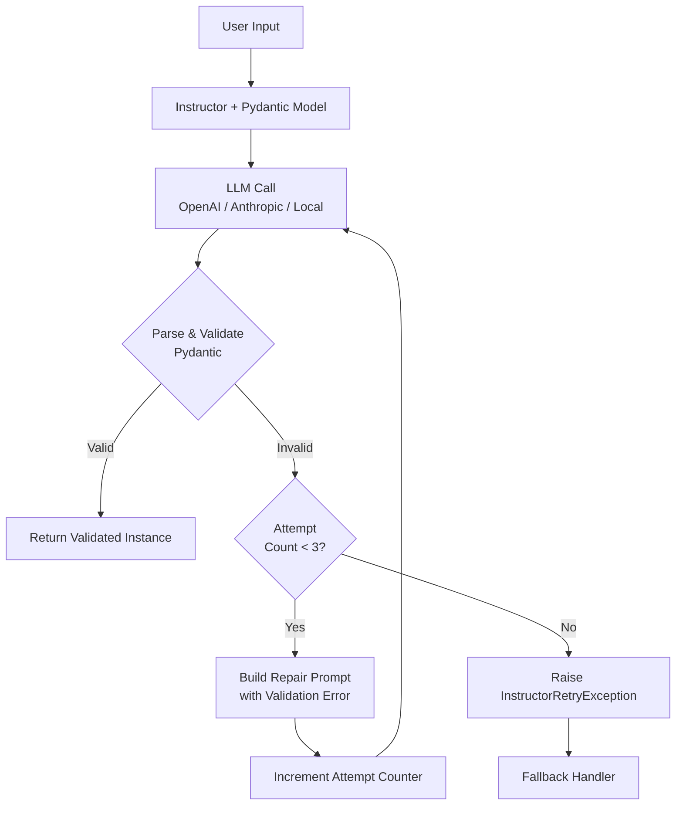
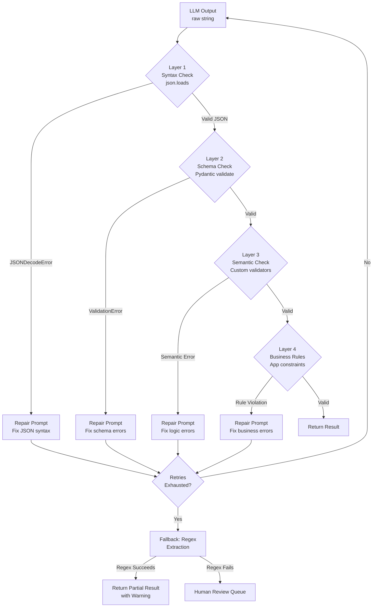

# Week 3: Structured Generation and Output Reliability

**Theme: Make your AI output machine-parseable, every time**

---

## Overview

In Week 2 we built prompts that reliably communicate intent. This week we tackle the complementary problem: getting output back in a form your application can actually use. By the end of this week you will be able to build pipelines where a Pydantic model is your contract, and broken JSON is a handled exception rather than a production incident.

---

## 3.1 The Output Reliability Problem

### Why `json.loads(llm_output)` Fails in Production

You have written a prompt that ends with "Respond with valid JSON." You tested it ten times in the playground. It worked every time. You deployed it. At 2 AM on a Tuesday, your on-call engineer gets paged because `json.loads` is throwing `JSONDecodeError` for roughly one in twelve requests.

Welcome to the output reliability problem.

Large language models are trained to be helpful communicators, not JSON serializers. When a model "decides" to respond, it draws on billions of parameters that learned from human-written text — text that is overwhelmingly *not* raw JSON. Even when your prompt explicitly requests JSON, the model's learned behaviors pull against you in predictable ways.

**The four failure modes** appear again and again in production:

**1. Markdown code fences.** The model wraps the JSON in triple backticks, often with a language tag:

```
```json
{"name": "Alice", "age": 30}
```
```

This is the most common failure. The model has seen thousands of examples where well-formatted technical content is wrapped in fences, and it helpfully applies that pattern.

**2. Explanation text before or after the JSON.** The model prefaces its answer:

```
Here is the JSON you requested:
{"name": "Alice", "age": 30}
Let me know if you need anything else!
```

`json.loads` will fail on the first character `H`.

**3. Single quotes instead of double quotes.** JSON strictly requires double-quoted keys and string values. Python dictionaries use single quotes. Models trained on Python code sometimes produce:

```
{'name': 'Alice', 'age': 30}
```

This is valid Python `eval` territory but invalid JSON, and `json.loads` rejects it immediately.

**4. Truncated JSON near the token limit.** When your prompt plus the expected JSON response approaches the model's context window limit, the model may cut the response short mid-structure:

```json
{"name": "Alice", "age": 30, "address": {"street": "123 Main
```

This is particularly insidious because it passes a length check but fails parsing.

### Failure Rate Data

Empirical measurements from production systems show that a naive "respond with JSON" prompt fails between **5% and 15%** of requests, depending on the model, schema complexity, and input variety. That 5-15% figure is not an edge case — it is a steady-state operating reality.

Consider what that means at scale. A system handling 10,000 requests per day with a 10% failure rate encounters 1,000 failures daily. Each failure must be handled somehow.

### The Cost of Failures

Each failure takes one of two paths:

**Retry path:** The system catches the parse error, sends the request again, and pays the latency cost twice. A 1-second inference call now costs 2 seconds. Worse, retries are typically triggered after the failure, meaning the user already waited the full first-call duration before discovering the problem.

**Error path:** The system surfaces an error to the user or drops the request. User trust erodes. Downstream systems that expected structured data receive nothing.

### Two Approaches to the Problem

The field has converged on two broad strategies:

**Approach 1: Prompt-based (ask nicely, parse, retry on failure).** Craft prompts that strongly encourage valid JSON, attempt to parse the output, and retry with corrective context if parsing fails. This works with any LLM, including closed APIs, but failure rate depends on model compliance and retry budgets.

**Approach 2: Constraint-based (mathematically guarantee the output).** Use a technique called **constrained decoding** that modifies the token sampling process itself. The model cannot physically generate a token that would make the output invalid according to the schema. This provides mathematical guarantees but requires access to the model's inference layer — it cannot be applied to cloud APIs like OpenAI or Anthropic.

The rest of this week covers both approaches, their trade-offs, and how to combine them effectively.

> **Key Insight:** The failure modes are predictable. Markdown fences, preamble text, and single quotes account for over 80% of JSON parse failures. A robust parser that strips these artifacts before calling `json.loads` can cut your raw failure rate significantly before you need to add retry logic.

> **Key Insight:** A 10% failure rate with a 2x retry penalty means your effective average latency is 1.1x even when retries succeed. At 5% with a 500ms base latency, you add 25ms of expected latency to every request — invisible in testing, visible in p99 metrics.

> **Key Insight:** "Parse, retry on failure" and "constrained decoding" are not mutually exclusive. In a hybrid architecture, you use constrained decoding for on-premises or self-hosted models and prompt-plus-retry for cloud API calls, with the same validation layer on top of both.

### Chapter Checkpoint

1. List the four primary failure modes that cause `json.loads(llm_output)` to fail in production. For each, give a one-sentence example of what the malformed output looks like.
2. A system processes 50,000 requests per day. Assuming a 12% base failure rate and a single retry on each failure (which succeeds 95% of the time), how many requests per day still fail after retries? How many total LLM calls are made?
3. Explain in your own words why constrained decoding cannot be used with the OpenAI or Anthropic hosted APIs.

---

## 3.2 Structured Generation Techniques

### From Best-Effort to Guaranteed

There is a spectrum of techniques for producing structured output, ranging from "politely ask" at one end to "make it mathematically impossible to fail" at the other. Each point on the spectrum involves different trade-offs between reliability, ease of integration, and infrastructure requirements.

### OpenAI `response_format={"type": "json_object"}`

OpenAI's JSON mode, enabled by passing `response_format={"type": "json_object"}` to the chat completions API, guarantees that the response is **syntactically valid JSON**. It does not guarantee that the JSON matches any particular schema.

```python
import openai
import json

client = openai.OpenAI()

response = client.chat.completions.create(
    model="gpt-4o",
    response_format={"type": "json_object"},
    messages=[
        {
            "role": "system",
            "content": "Extract the person's name and age from the text. "
                       "Return JSON with keys 'name' (string) and 'age' (integer)."
        },
        {
            "role": "user",
            "content": "Alice is 30 years old."
        }
    ]
)

# This will always succeed — JSON mode guarantees valid JSON
data = json.loads(response.choices[0].message.content)
print(data)  # {'name': 'Alice', 'age': 30}
```

JSON mode eliminates the markdown fences, preamble text, and single-quote failures. But if your schema requires an `age` field as an integer, the model might return `{"name": "Alice", "years": 30}` — valid JSON, wrong schema. You still need schema validation on top.

### Anthropic Tool Use for Extraction

Anthropic's approach uses the **tool use** (function calling) mechanism. You define a tool with a JSON Schema describing the shape you want, then ask the model to "call" the tool with the extracted data. When the model calls a tool, the API guarantees schema conformance — the response will match the tool's input schema.

```python
import anthropic
import json

client = anthropic.Anthropic()

# Define the schema as a tool
tools = [
    {
        "name": "extract_person",
        "description": "Extract structured person information from text.",
        "input_schema": {
            "type": "object",
            "properties": {
                "name": {
                    "type": "string",
                    "description": "The person's full name"
                },
                "age": {
                    "type": "integer",
                    "description": "The person's age in years"
                }
            },
            "required": ["name", "age"]
        }
    }
]

response = client.messages.create(
    model="claude-sonnet-4-5",
    max_tokens=1024,
    tools=tools,
    tool_choice={"type": "tool", "name": "extract_person"},  # Force tool use
    messages=[
        {
            "role": "user",
            "content": "Alice is 30 years old."
        }
    ]
)

# Extract the tool call result
tool_use_block = next(
    block for block in response.content
    if block.type == "tool_use"
)
data = tool_use_block.input  # Already a dict, schema-conformant
print(data)  # {'name': 'Alice', 'age': 30}
```

The key advantage is that `tool_choice={"type": "tool", "name": "extract_person"}` forces the model to call that specific tool, and the API validates the output against the schema before returning it to you.

### The Instructor Library

**Instructor** is an open-source library that wraps any LLM client and maps the response to a Pydantic model. It abstracts away the tool use / JSON mode complexity and adds automatic retry logic.

```python
import instructor
import openai
from pydantic import BaseModel, Field
from typing import Optional

# Define your data model with Pydantic
class PersonExtraction(BaseModel):
    name: str = Field(description="The person's full name")
    age: int = Field(description="The person's age as a positive integer")
    occupation: Optional[str] = Field(
        default=None,
        description="The person's job or occupation. Leave null if not mentioned."
    )

# Patch the OpenAI client with Instructor
client = instructor.from_openai(openai.OpenAI())

# Call looks almost identical to raw OpenAI, but returns a Pydantic instance
person = client.chat.completions.create(
    model="gpt-4o-mini",
    response_model=PersonExtraction,  # <-- the magic parameter
    max_retries=3,                    # auto-retry on validation failure
    messages=[
        {
            "role": "user",
            "content": "Alice Smith is a 30-year-old software engineer."
        }
    ]
)

# person is a validated PersonExtraction instance — not a dict, not a string
print(person.name)        # "Alice Smith"
print(person.age)         # 30
print(person.occupation)  # "software engineer"
print(type(person))       # <class '__main__.PersonExtraction'>
```

When the model's output fails Pydantic validation, Instructor automatically builds a corrective prompt containing the validation error and retries — up to `max_retries` times (default 3). If all retries fail, it raises an `InstructorRetryException`.

Instructor also supports Anthropic, Google, and other providers through provider-specific patching functions (`instructor.from_anthropic(...)`, etc.).

### Outlines: Constrained Decoding

**Outlines** operates at a fundamentally different level. Rather than parsing the output after the fact, it modifies the token sampling process itself using **finite state machines (FSMs)**. At each generation step, it masks out any token that would make the output invalid according to the schema. The model can only generate tokens that keep the output on a valid path to a complete, schema-conformant JSON document.

```python
import outlines
import outlines.models as models
from pydantic import BaseModel
from typing import Optional

# This requires a locally accessible model
model = models.transformers("microsoft/Phi-3-mini-4k-instruct")

class PersonExtraction(BaseModel):
    name: str
    age: int
    occupation: Optional[str] = None

# Create a structured generator bound to the schema
generator = outlines.generate.json(model, PersonExtraction)

# The generator CANNOT produce invalid JSON — it's enforced at the token level
result = generator(
    "Extract person info: Alice Smith is a 30-year-old software engineer."
)

print(result)        # PersonExtraction(name='Alice Smith', age=30, occupation='software engineer')
print(type(result))  # <class '__main__.PersonExtraction'>
```

The FSM is constructed from the Pydantic model's JSON Schema at generator creation time. During inference, at each step, only tokens that advance the FSM to a valid state are candidates for sampling. It is **mathematically impossible** for this generator to produce invalid JSON.

The critical trade-off: Outlines requires access to the model's token-level inference, which means you must run the model yourself (via Hugging Face Transformers, vLLM, etc.). You cannot apply Outlines to OpenAI's GPT-4 or Anthropic's Claude through their APIs.



> **Key Insight:** Instructor and Outlines solve the same problem at different levels of the stack. Instructor fixes the problem at the *application* layer — it retries until the output is valid. Outlines fixes it at the *generation* layer — invalid outputs are never generated in the first place. Outlines is more reliable but less portable.

> **Key Insight:** Tool use / function calling is not just a convenience wrapper. When you force a model to call a tool, you are exploiting fine-tuned behavior: the model was trained specifically to produce valid JSON when making tool calls. This is why schema conformance rates for tool use significantly exceed those for plain JSON prompts.

> **Key Insight:** `max_retries=3` in Instructor means up to 4 total LLM calls per request (1 initial + 3 retries). Set this based on your latency budget, not just your reliability target. For a 500ms base latency, `max_retries=2` adds up to 1.5s to your worst case.

### Chapter Checkpoint

1. OpenAI JSON mode guarantees valid JSON but not schema conformance. Give a concrete example of an output that would pass JSON mode but fail a schema check for a model with `required: ["name", "age"]` where `age` must be an integer.
2. Explain how Instructor's retry mechanism works. What information does it include in the retry prompt, and where does it get that information?
3. A startup is building a document extraction API that calls GPT-4o under the hood. A teammate suggests using Outlines for guaranteed schema conformance. Why is this not possible, and what would you suggest instead?

---

## 3.3 Schema Design for LLMs

### Your Schema is Your Prompt

A common misconception is that schema design and prompt design are separate concerns. In structured generation, they are the same concern. The fields you define, the types you choose, the descriptions you write — all of these are instructions to the model, not just type annotations for your application code.

This reframing has practical consequences. A schema that is correct from a Python type-checking perspective may be a poor set of instructions for a language model.

### Field Descriptions as Model Instructions

The `description` parameter on a Pydantic `Field` is not documentation for developers. It is a directive to the model. Consider the difference:

```python
from pydantic import BaseModel, Field
from typing import Optional, Literal
from datetime import date

# Bad schema — model will guess date format
class EventBad(BaseModel):
    title: str
    event_date: str  # What format? The model will invent one.

# Good schema — field description is a precise instruction
class EventGood(BaseModel):
    title: str = Field(
        description="The event title, verbatim from the source text"
    )
    event_date: str = Field(
        description="The event date in ISO 8601 format YYYY-MM-DD. "
                    "Example: 2025-03-15. If only a year is given, use YYYY-01-01."
    )
    location: Optional[str] = Field(
        default=None,
        description="The event location as a city, venue, or address. "
                    "Leave null if no location is mentioned in the text."
    )
```

The description for `event_date` in `EventGood` eliminates ambiguity about format, provides an example, and handles the partial-date edge case. The model receives this description in the schema JSON passed to the tool call or JSON mode system, and it treats it as instruction.

### Keep Schemas Flat When Possible

Nested schemas increase error rates. Each level of nesting adds another JSON structural constraint the model must track. A flat schema with clearly named fields almost always outperforms an equivalent nested schema.

```python
# Nested — higher error rate, harder to validate
class AddressNested(BaseModel):
    street: str
    city: str
    country: str

class PersonNested(BaseModel):
    name: str
    address: AddressNested  # Model must correctly nest this object

# Flat — lower error rate, easier to validate
class PersonFlat(BaseModel):
    name: str = Field(description="The person's full name")
    address_street: str = Field(description="Street address, e.g. '123 Main St'")
    address_city: str = Field(description="City name")
    address_country: str = Field(
        description="ISO 3166-1 alpha-2 country code, e.g. 'US', 'GB', 'DE'"
    )
```

If you need nested structure in your application code, do the nesting yourself after extraction, not during it.

### Use `Literal` Types for Enum Fields

When a field should only take one of a finite set of values, use Python's `Literal` type. This compiles down to a JSON Schema `enum`, which is passed to the model and strongly constrains its output.

```python
from typing import Literal

class SupportTicket(BaseModel):
    summary: str = Field(
        description="One-sentence summary of the customer's issue"
    )
    priority: Literal["high", "medium", "low"] = Field(
        description="Ticket priority. Use 'high' for production outages or data loss, "
                    "'medium' for significant feature degradation, "
                    "'low' for cosmetic issues or enhancement requests."
    )
    category: Literal["billing", "technical", "account", "feature_request"] = Field(
        description="The ticket category that best fits the customer's issue."
    )
```

Without `Literal`, a model might return `"High"`, `"HIGH"`, `"urgent"`, or `"critical"`. With `Literal["high", "medium", "low"]`, the JSON Schema restricts the enum to exactly those three values. Instructor will reject any response that uses a different value and retry with an error indicating the valid choices.

### Optional Fields and the Hallucination Trap

Models hallucinate rather than return null. If your schema has a `required` field for data that is not always present in the source text, the model will invent a plausible value rather than fail to produce the field. This is often worse than a validation error — a hallucinated value silently passes validation.

The solution has two parts:

```python
from typing import Optional

class DocumentMetadata(BaseModel):
    title: str = Field(
        description="The document title. This is always required."
    )
    doi: Optional[str] = Field(
        default=None,
        description="The Digital Object Identifier if present, e.g. '10.1145/1234567.1234568'. "
                    "Leave null if no DOI is mentioned in the document."
    )
    publication_year: Optional[int] = Field(
        default=None,
        description="The four-digit publication year. Leave null if not stated."
    )
```

First, make optional fields `Optional[T] = None`. Second, include explicit "leave null if not mentioned" language in the description. The model needs permission to return null — without it, the learned behavior of "always provide a complete, helpful answer" pulls toward hallucination.

### Schema Versioning

As your application evolves, your schemas will change. Downstream consumers need to handle both old and new response shapes during transition periods. Adding a `schema_version` field provides a reliable discriminator:

```python
class DocumentExtractionV2(BaseModel):
    schema_version: Literal["v2"] = Field(
        default="v2",
        description="Schema version identifier. Always 'v2'."
    )
    title: str = Field(description="Document title")
    authors: list[str] = Field(
        description="List of author names. Empty list if no authors found."
    )
    # ... other fields

# Downstream consumer
def handle_extraction(data: dict) -> None:
    version = data.get("schema_version", "v1")
    if version == "v2":
        process_v2(DocumentExtractionV2(**data))
    else:
        process_v1_legacy(data)
```

> **Key Insight:** The single highest-impact schema design decision is the field description. A poorly described field is a poorly specified instruction. Treat every description as a unit-test specification: it should be precise enough that a developer could implement the extraction logic from the description alone.

> **Key Insight:** `Literal` types are worth the verbosity. The reduction in hallucinated or misspelled enum values pays for itself within the first few thousand requests. If you find yourself writing downstream normalization code like `value.lower().strip()`, consider whether `Literal` would eliminate the need for it.

> **Key Insight:** Schema versioning is cheap to add and expensive to retrofit. Add `schema_version` to every schema from day one, even if you only have one version. The cost is one field. The benefit is a clean migration path when — not if — your schema needs to change.

### Chapter Checkpoint

1. You are building an extraction schema for news articles. The article may or may not have a named byline. Write the Pydantic field definition for `author_name` in a way that minimizes hallucination risk.
2. Why do nested schemas produce higher error rates than flat schemas? Describe the specific mechanism by which a nested structure increases model error.
3. You have a schema with `sentiment: str` and in production you observe values like `"positive"`, `"Positive"`, `"POSITIVE"`, `"good"`, `"favorable"`. Rewrite the field definition to prevent this.

---

## 3.4 Validation and Repair

### Validation is Not a Single Check

A common mistake is to treat validation as a binary pass/fail on the JSON Schema. Schema validation is necessary but not sufficient. A response can be syntactically valid JSON, conformant with your Pydantic model, and still be wrong in ways that matter to your application.

**Multi-layer validation** addresses this by applying progressively stricter checks:

**Layer 1 — Syntax:** Is it valid JSON? `json.loads` either succeeds or raises `JSONDecodeError`. This is the floor. Everything else is built on this.

**Layer 2 — Schema:** Does the parsed JSON conform to the Pydantic model? Field types, required fields, `Literal` constraints, and `Optional` handling all live here. Pydantic's `model_validate()` raises `ValidationError` on failure.

**Layer 3 — Semantic:** Are field values logically consistent with each other? An `end_date` before a `start_date` is semantically invalid even if both are valid ISO 8601 dates. A `confidence_score` of 150 is a valid float but semantically impossible if the range is 0-100. Custom validators at this layer use domain knowledge.

**Layer 4 — Business Rules:** Are the values valid in the context of your application's operating constraints? A price of -$5.00 passes all the above layers but violates a business rule. An event date in 1823 is a valid date but probably a hallucination. These checks integrate with your application logic.



### The Repair Prompt Pattern

When validation fails, the most effective retry strategy is not to resend the original prompt — it is to send a **repair prompt** that includes the invalid output and the specific error message.

```python
import json
import instructor
import openai
from pydantic import BaseModel, Field, field_validator
from typing import Optional, Literal
from datetime import date, datetime

class EventExtraction(BaseModel):
    title: str = Field(description="Event title verbatim from source")
    event_date: str = Field(
        description="Event date in ISO 8601 format YYYY-MM-DD"
    )
    priority: Literal["high", "medium", "low"] = Field(
        description="Event priority level"
    )
    price_usd: Optional[float] = Field(
        default=None,
        description="Ticket price in USD. Leave null if free or not mentioned."
    )

    @field_validator("event_date")
    @classmethod
    def validate_date_format(cls, v: str) -> str:
        """Layer 3 semantic validation: ensure the date parses correctly."""
        try:
            datetime.strptime(v, "%Y-%m-%d")
        except ValueError:
            raise ValueError(
                f"event_date must be YYYY-MM-DD format, got: {v!r}"
            )
        return v

    @field_validator("price_usd")
    @classmethod
    def validate_price_positive(cls, v: Optional[float]) -> Optional[float]:
        """Layer 4 business rule: prices must be non-negative."""
        if v is not None and v < 0:
            raise ValueError(f"price_usd must be non-negative, got: {v}")
        return v


def extract_event_with_repair(text: str, max_retries: int = 3) -> EventExtraction:
    """
    Extract event data with multi-layer validation and repair loop.
    Instructor handles retry orchestration; our validators define what's valid.
    """
    client = instructor.from_openai(openai.OpenAI())

    # Instructor automatically builds repair prompts using Pydantic error messages
    # and retries up to max_retries times
    result = client.chat.completions.create(
        model="gpt-4o-mini",
        response_model=EventExtraction,
        max_retries=max_retries,
        messages=[
            {
                "role": "system",
                "content": (
                    "You are an event information extraction assistant. "
                    "Extract structured event data from the provided text. "
                    "Be precise and follow the field descriptions exactly."
                )
            },
            {
                "role": "user",
                "content": text
            }
        ]
    )
    return result


# Test with a tricky input
text = """
Join us for the Annual AI Summit happening March 15th, 2026 in San Francisco.
Tickets are available for $299. This is a high-priority event for our team.
"""

event = extract_event_with_repair(text)
print(f"Title: {event.title}")
print(f"Date: {event.event_date}")     # "2026-03-15"
print(f"Priority: {event.priority}")  # "high"
print(f"Price: ${event.price_usd}")   # "$299.0"
```

When Instructor's repair prompt fires, it includes the Pydantic `ValidationError` detail, which tells the model exactly which field failed, what value was provided, and what constraint was violated. This targeted error context dramatically improves repair success rates compared to a generic "please fix the JSON" prompt.

### The Fallback Chain

No retry strategy succeeds 100% of the time. You need a fallback chain:

```python
import re
from typing import Optional

def extract_with_fallback(text: str) -> dict:
    """
    Attempt structured extraction, fall back gracefully on persistent failures.
    Returns a dict with a 'source' key indicating how it was produced.
    """
    # Tier 1: Full structured extraction with Instructor
    try:
        result = extract_event_with_repair(text, max_retries=3)
        return {**result.model_dump(), "source": "structured"}
    except Exception as e:
        print(f"Structured extraction failed after retries: {e}")

    # Tier 2: Regex extraction for critical fields
    partial = {"source": "regex_fallback"}

    date_match = re.search(
        r'\b(\d{4}-\d{2}-\d{2})\b', text
    )
    if date_match:
        partial["event_date"] = date_match.group(1)

    price_match = re.search(
        r'\$\s*(\d+(?:\.\d{2})?)', text
    )
    if price_match:
        partial["price_usd"] = float(price_match.group(1))

    if partial.get("event_date") or partial.get("price_usd"):
        partial["warning"] = "Partial extraction via regex; manual review recommended"
        return partial

    # Tier 3: Human review queue
    queue_for_human_review(text)
    return {"source": "human_review_queued", "original_text": text}


def queue_for_human_review(text: str) -> None:
    """In production: write to a review queue (SQS, database, etc.)"""
    print(f"Queued for human review: {text[:100]}...")
```

### Testing Schema Adherence at Scale

Before deploying a new schema, measure its conformance rate across a diverse test set. Run at least 1,000 synthetic inputs through the pipeline and measure per-field conformance.

```python
from dataclasses import dataclass, field
from collections import defaultdict
import random

@dataclass
class ConformanceReport:
    total: int = 0
    full_conformance: int = 0
    field_failures: dict = field(default_factory=lambda: defaultdict(int))

    @property
    def conformance_rate(self) -> float:
        return self.full_conformance / self.total if self.total > 0 else 0.0

    def print_report(self):
        print(f"Total samples: {self.total}")
        print(f"Full conformance: {self.full_conformance} ({self.conformance_rate:.1%})")
        print("Field failure rates:")
        for field_name, count in sorted(
            self.field_failures.items(), key=lambda x: -x[1]
        ):
            print(f"  {field_name}: {count} failures ({count/self.total:.1%})")


def measure_conformance(
    test_inputs: list[str],
    model_class: type[BaseModel]
) -> ConformanceReport:
    """
    Measure schema conformance across a test set.
    Returns per-field failure statistics.
    """
    report = ConformanceReport(total=len(test_inputs))
    client = instructor.from_openai(openai.OpenAI())

    for text in test_inputs:
        try:
            result = client.chat.completions.create(
                model="gpt-4o-mini",
                response_model=model_class,
                max_retries=0,  # No retries — we want to measure raw conformance
                messages=[{"role": "user", "content": text}]
            )
            report.full_conformance += 1
        except Exception as e:
            # Parse the validation error to identify which field failed
            error_str = str(e)
            for field_name in model_class.model_fields:
                if field_name in error_str:
                    report.field_failures[field_name] += 1

    return report
```

> **Key Insight:** Semantic validators (Layer 3) are where you encode domain expertise. A `price_usd` that is negative passes syntax and schema checks but represents a logical impossibility. Building these validators is how you make your extraction pipeline robust to the specific failure modes of your domain, not just the generic failure modes of LLMs.

> **Key Insight:** The repair prompt pattern exploits a property of language models: they are good at correcting mistakes when shown the specific error. A repair prompt that says "field 'event_date' should be YYYY-MM-DD but you returned '15 March 2026'" is dramatically more effective than a generic "please fix the JSON" instruction.

> **Key Insight:** Measure conformance with `max_retries=0` first. This gives you the raw single-shot accuracy, which tells you how well your schema and prompt are working before retries mask the failures. Then measure with retries enabled to understand the retry tax you are paying.

### Chapter Checkpoint

1. A model returns `{"title": "AI Summit", "event_date": "March 15, 2026", "priority": "high"}` for an `EventExtraction` schema. Which validation layer catches the `event_date` failure, and what specific error message should be included in the repair prompt?
2. Describe the three-tier fallback chain. In what production scenario would you expect each tier to be the most common path?
3. Why is it important to measure per-field conformance rates rather than just overall conformance rates? Give an example where overall conformance looks acceptable but a specific field has a critical failure rate.

---

## Lab Walkthrough: Document Information Extraction Pipeline

### Objective

Build a production-grade document information extraction pipeline that accepts any PDF, extracts structured metadata and content using Instructor + Pydantic, measures conformance rate across 20 varied documents, and implements a repair loop with a fallback chain.

### Prerequisites

```bash
pip install instructor openai pydantic pymupdf python-dotenv
```

You will need an OpenAI API key set as `OPENAI_API_KEY` in your environment.

### Step 1: Define the Extraction Schema

Create `schema.py`:

```python
from pydantic import BaseModel, Field, field_validator
from typing import Optional, Literal
from datetime import datetime

class DocumentEntity(BaseModel):
    """A named entity extracted from the document."""
    name: str = Field(description="The entity name as it appears in the text")
    entity_type: Literal["person", "organization", "location", "technology", "concept"] = Field(
        description="The type of entity"
    )

class DocumentExtraction(BaseModel):
    """Structured extraction from an academic or technical document."""

    schema_version: Literal["v1"] = Field(
        default="v1",
        description="Schema version. Always 'v1'."
    )
    title: str = Field(
        description="The document title. Use the main title only, not subtitles."
    )
    authors: list[str] = Field(
        description="List of author full names. Empty list if not identifiable."
    )
    publication_date: Optional[str] = Field(
        default=None,
        description="Publication date in YYYY-MM-DD format. Use YYYY-01-01 if only "
                    "year is known. Leave null if not mentioned."
    )
    document_type: Literal["research_paper", "technical_report", "thesis",
                           "book_chapter", "white_paper", "other"] = Field(
        description="The type of document."
    )
    abstract_summary: str = Field(
        description="A 2-3 sentence summary of the document's main contribution "
                    "or argument. Write in third person."
    )
    key_findings: list[str] = Field(
        description="List of 3-5 key findings or contributions as complete sentences. "
                    "Focus on specific, measurable claims where possible."
    )
    entities: list[DocumentEntity] = Field(
        default_factory=list,
        description="Named entities mentioned prominently in the document. "
                    "Include at most 10 entities."
    )
    confidence: Literal["high", "medium", "low"] = Field(
        description="Your confidence in the extraction quality. Use 'low' if the "
                    "document text was unclear or incomplete."
    )

    @field_validator("publication_date")
    @classmethod
    def validate_date(cls, v: Optional[str]) -> Optional[str]:
        if v is None:
            return v
        try:
            datetime.strptime(v, "%Y-%m-%d")
        except ValueError:
            raise ValueError(
                f"publication_date must be YYYY-MM-DD, got {v!r}. "
                "If only year is known, use YYYY-01-01."
            )
        return v

    @field_validator("key_findings")
    @classmethod
    def validate_findings_count(cls, v: list[str]) -> list[str]:
        if len(v) < 1:
            raise ValueError("key_findings must contain at least one finding")
        if len(v) > 5:
            raise ValueError(
                f"key_findings must contain at most 5 items, got {len(v)}"
            )
        return v
```

### Step 2: Build the Extraction Engine

Create `extractor.py`:

```python
import instructor
import openai
from pathlib import Path
import fitz  # PyMuPDF
from schema import DocumentExtraction
from typing import Optional
import re

def extract_text_from_pdf(pdf_path: str, max_chars: int = 8000) -> str:
    """Extract text from a PDF, truncating to max_chars to fit context window."""
    doc = fitz.open(pdf_path)
    text_parts = []
    total_chars = 0

    for page_num in range(min(len(doc), 20)):  # Limit to first 20 pages
        page = doc[page_num]
        page_text = page.get_text()
        if total_chars + len(page_text) > max_chars:
            # Include as much of this page as fits
            remaining = max_chars - total_chars
            text_parts.append(page_text[:remaining])
            break
        text_parts.append(page_text)
        total_chars += len(page_text)

    doc.close()
    return "\n\n".join(text_parts)


def extract_document_info(
    pdf_path: str,
    max_retries: int = 3
) -> tuple[Optional[DocumentExtraction], str]:
    """
    Extract structured information from a PDF.

    Returns:
        (extraction_result, source) where source is one of:
        'structured', 'partial_regex', 'failed'
    """
    # Extract text from PDF
    text = extract_text_from_pdf(pdf_path)

    if not text.strip():
        return None, "failed"

    # Try structured extraction with Instructor
    client = instructor.from_openai(openai.OpenAI())

    try:
        result = client.chat.completions.create(
            model="gpt-4o-mini",
            response_model=DocumentExtraction,
            max_retries=max_retries,
            messages=[
                {
                    "role": "system",
                    "content": (
                        "You are a document information extraction specialist. "
                        "Extract structured metadata and content from academic "
                        "and technical documents. Follow field descriptions precisely. "
                        "If information is not present in the text, use null for "
                        "optional fields rather than guessing."
                    )
                },
                {
                    "role": "user",
                    "content": f"Extract information from this document:\n\n{text}"
                }
            ]
        )
        return result, "structured"

    except Exception as e:
        print(f"Structured extraction failed for {pdf_path}: {e}")
        return None, "failed"
```

### Step 3: Build the Conformance Measurement Tool

Create `measure_conformance.py`:

```python
import json
import time
from pathlib import Path
from collections import defaultdict
from dataclasses import dataclass, field
from extractor import extract_document_info
from schema import DocumentExtraction

@dataclass
class FieldStats:
    attempts: int = 0
    successes: int = 0
    failures: list[str] = field(default_factory=list)

    @property
    def success_rate(self) -> float:
        return self.successes / self.attempts if self.attempts > 0 else 0.0


def measure_pipeline_conformance(pdf_directory: str) -> dict:
    """
    Process all PDFs in a directory and measure conformance statistics.
    """
    pdf_paths = list(Path(pdf_directory).glob("*.pdf"))
    print(f"Found {len(pdf_paths)} PDFs to process")

    results = []
    field_stats = defaultdict(FieldStats)
    source_counts = defaultdict(int)

    for i, pdf_path in enumerate(pdf_paths):
        print(f"Processing {i+1}/{len(pdf_paths)}: {pdf_path.name}")
        start_time = time.time()

        extraction, source = extract_document_info(str(pdf_path))
        elapsed = time.time() - start_time
        source_counts[source] += 1

        result_entry = {
            "file": pdf_path.name,
            "source": source,
            "latency_seconds": round(elapsed, 2),
            "success": extraction is not None
        }

        if extraction is not None:
            data = extraction.model_dump()
            result_entry["extraction"] = data

            # Track per-field presence (non-null, non-empty)
            for field_name, value in data.items():
                field_stats[field_name].attempts += 1
                if value is not None and value != [] and value != "":
                    field_stats[field_name].successes += 1
                else:
                    field_stats[field_name].failures.append(pdf_path.name)

        results.append(result_entry)

    # Compile summary
    total = len(pdf_paths)
    structured_count = source_counts["structured"]

    summary = {
        "total_documents": total,
        "structured_extraction_rate": structured_count / total,
        "field_success_rates": {
            fname: {
                "success_rate": stats.success_rate,
                "attempts": stats.attempts
            }
            for fname, stats in field_stats.items()
        },
        "source_distribution": dict(source_counts),
        "results": results
    }

    return summary


if __name__ == "__main__":
    import sys
    pdf_dir = sys.argv[1] if len(sys.argv) > 1 else "./test_pdfs"
    summary = measure_pipeline_conformance(pdf_dir)

    print("\n=== CONFORMANCE REPORT ===")
    print(f"Total documents: {summary['total_documents']}")
    print(f"Structured extraction rate: {summary['structured_extraction_rate']:.1%}")
    print("\nField success rates:")
    for fname, stats in sorted(
        summary['field_success_rates'].items(),
        key=lambda x: x[1]['success_rate']
    ):
        print(f"  {fname:30s} {stats['success_rate']:.1%}")

    # Save full results
    with open("conformance_report.json", "w") as f:
        json.dump(summary, f, indent=2, default=str)
    print("\nFull report saved to conformance_report.json")
```

### Step 4: Run the Pipeline

```bash
# Create a test_pdfs directory and add 20 varied PDF documents
mkdir test_pdfs
# Copy or download 20 PDFs into test_pdfs/

# Run the conformance measurement
python measure_conformance.py ./test_pdfs
```

### Step 5: Analyze and Iterate

After your first run, examine the conformance report. Look for fields with success rates below 90% — these are candidates for improved descriptions. Common improvements:

- If `publication_date` fails often, add more format examples to the description
- If `key_findings` returns too many or too few items, tighten the description constraints
- If `authors` is frequently empty despite authors being visible in the PDF, check whether text extraction is capturing the first page correctly

Run a second pass after improving the schema, compare the two conformance reports, and document the delta.

---

## Further Reading

1. **"Instructor: Structured LLM Outputs"** — Jason Liu, instructor-ai.github.io/instructor. The primary documentation for the Instructor library, including advanced patterns for streaming structured outputs and multi-modal extraction.

2. **"Outlines: Structured Text Generation"** — Willard & Louf (2023), arxiv.org/abs/2307.09702. The original paper describing the finite-state-machine approach to constrained decoding. Essential reading for understanding the theoretical foundations of token-level constraints.

3. **"Building LLM Applications for Production"** — Chip Huyen, huyenchip.com/2023/04/11/llm-engineering.html. A widely-cited practitioner's overview that includes substantial coverage of output reliability, retry patterns, and the challenges of deploying LLMs at scale.

4. **"Pydantic Documentation: Validators"** — docs.pydantic.dev/latest/concepts/validators. The definitive reference for custom validators in Pydantic v2, covering `field_validator`, `model_validator`, and `@computed_field`. Understanding these is essential for building robust Layer 3 and Layer 4 validation.

5. **"Reliable, Fully Automated Testing of LLM Outputs"** — Eugene Yan, eugeneyan.com. Covers evaluation frameworks for measuring schema conformance, hallucination rates, and extraction accuracy at scale — the infrastructure needed to act on the conformance measurements introduced in this week's lab.

---

## Week Summary

- **Output reliability is an engineering problem, not a prompt problem.** Naive JSON prompts fail 5-15% of production requests due to four predictable failure modes: markdown fences, preamble text, single quotes, and truncation. Prompt engineering alone cannot solve this; architectural choices about how you request structured output determine your baseline reliability.

- **The right tool depends on your infrastructure.** Outlines provides mathematical guarantees but requires local model access. Instructor provides automatic retry with validation context and works with any cloud API. OpenAI JSON mode and Anthropic tool use eliminate the most common syntax failures but do not enforce your schema. Combine these appropriately for your deployment context.

- **Schema design is prompt design.** Field descriptions are model instructions. `Literal` types constrain enum outputs. `Optional[T] = None` with explicit null-permission descriptions reduces hallucination in optional fields. A well-designed schema does more work than a well-crafted prompt.

- **Validation must be multi-layered.** Syntax, schema, semantic, and business-rule validation are distinct layers, each catching failures the previous layer misses. Build all four layers from the start; retrofitting semantic and business-rule validation into an existing pipeline is significantly harder than including it at design time.

- **Measure conformance per field, not just overall.** A 98% overall conformance rate can hide a 40% failure rate on a critical field. Per-field measurement reveals where to invest in schema description improvements, and establishes the baseline needed to verify that changes to your schema actually improve reliability.
