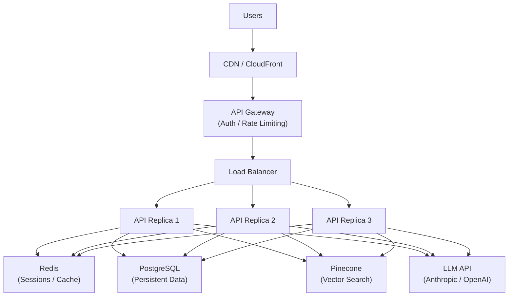
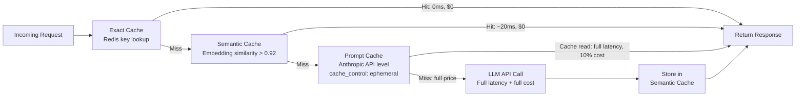

# Week 5: Deployment and Scaling

**Theme: From working code to production system**

By the end of this week, you will understand how to take an AI application that works on your laptop and transform it into a production system that can handle real users, real load, and real costs. Deployment is not an afterthought — the decisions you make here determine whether your AI app is reliable, affordable, and maintainable at scale.

---

## 5.1 Deployment Architecture for AI Apps

### Containerizing Your AI Application

The first step from local development to production is **containerization** — packaging your application and all its dependencies into a portable, reproducible unit. Docker is the industry standard, and a well-crafted Dockerfile is the foundation of every production AI deployment.

A common mistake beginners make is using a full Python image (`python:3.11`) when `python:3.11-slim` eliminates hundreds of megabytes of unnecessary tools. For AI applications, image size matters: smaller images pull faster in auto-scaling events, reducing cold-start latency when new replicas spin up.

```python
# Dockerfile for a FastAPI-based AI application
# Stage 1: Build stage (installs dependencies, compiles anything needed)
FROM python:3.11-slim AS builder

WORKDIR /build

# Copy only the requirements file first — Docker layer caching means
# this layer is reused unless requirements.txt changes
COPY requirements.txt .

# Install dependencies into a local directory for clean copying later
RUN pip install --no-cache-dir --prefix=/install -r requirements.txt

# Stage 2: Runtime stage (lean image with only what's needed to run)
FROM python:3.11-slim AS runtime

WORKDIR /app

# Copy installed packages from the builder stage
COPY --from=builder /install /usr/local

# Copy application source
COPY ./app ./app

# Never run as root in production — principle of least privilege
RUN useradd --create-home appuser
USER appuser

# Expose the port uvicorn will listen on
EXPOSE 8080

# CMD runs the app; use exec form (JSON array) so signals are handled correctly
CMD ["uvicorn", "app.main:app", "--host", "0.0.0.0", "--port", "8080", "--workers", "2"]
```

The **multi-stage build** pattern separates the build environment (which needs compilers, pip, build tools) from the runtime environment (which only needs your app and its installed packages). This can reduce final image size by 60-70%.

### The API Gateway Layer

Your application containers should never be exposed directly to the internet. An **API gateway** sits in front of your backend and handles cross-cutting concerns that would otherwise pollute every endpoint in your application:

- **JWT verification**: Every request carries a token; the gateway validates it before the request ever reaches your code.
- **Rate limiting**: Per-user or per-IP request limits prevent abuse and protect against runaway costs on LLM API calls.
- **Request logging**: Centralized access logs for debugging, auditing, and anomaly detection.
- **Routing**: Blue/green deployments, canary traffic splits, and path-based routing to different backend services.

Kong and AWS API Gateway are the two dominant options. Kong is self-hosted and highly configurable; AWS API Gateway is managed and integrates natively with Lambda and ECS. For most teams deploying on AWS, API Gateway adds minimal operational overhead. For teams on other clouds or on-premises, Kong is the standard choice.

### Stateless vs. Stateful AI Applications

This is one of the most common architectural mistakes in AI app deployments: building a stateful application when you need to scale horizontally.

An AI chatbot that stores conversation history in a Python dictionary (`self.sessions = {}`) is **stateful** — the conversation only exists in the memory of the specific process that started it. If you run three replicas behind a load balancer, a user's second message may land on a different replica with no knowledge of the first message.

The fix is to move session state to **Redis**. Redis is an in-memory data store that all replicas can read and write. Session data is stored by a session ID, which is returned to the client as a cookie or header and sent with every subsequent request.

```python
import redis
import json
from fastapi import FastAPI, Cookie
from anthropic import Anthropic

app = FastAPI()
client = Anthropic()

# Redis connection — in production this points to Redis Cluster
r = redis.Redis(host="redis", port=6379, decode_responses=True)

SESSION_TTL_SECONDS = 3600  # Sessions expire after 1 hour of inactivity

def get_history(session_id: str) -> list:
    """Retrieve conversation history from Redis."""
    raw = r.get(f"session:{session_id}")
    if raw is None:
        return []
    return json.loads(raw)

def save_history(session_id: str, history: list) -> None:
    """Persist conversation history to Redis with a rolling TTL."""
    r.setex(
        f"session:{session_id}",
        SESSION_TTL_SECONDS,
        json.dumps(history)
    )

@app.post("/chat")
async def chat(message: str, session_id: str = Cookie(default=None)):
    # Load history from Redis — works regardless of which replica handles this
    history = get_history(session_id)

    history.append({"role": "user", "content": message})

    response = client.messages.create(
        model="claude-3-5-sonnet-20241022",
        max_tokens=1024,
        messages=history
    )

    assistant_message = response.content[0].text
    history.append({"role": "assistant", "content": assistant_message})

    # Save updated history back to Redis
    save_history(session_id, history)

    return {"response": assistant_message}
```

### Environment Management

Professional teams maintain at least three environments, each with increasing fidelity to production:

| Environment | Database | Vector Store | LLM | Purpose |
|-------------|----------|-------------|-----|---------|
| **Development** | SQLite (local file) | ChromaDB (local) | Claude Haiku | Fast iteration, no cloud costs |
| **Staging** | PostgreSQL on RDS (small) | Pinecone (starter) | Claude Sonnet | Integration testing, mirrors prod topology |
| **Production** | PostgreSQL on RDS (HA) | Pinecone (production) | Claude Sonnet/Opus | Live users |

Configuration is injected via environment variables — never hardcoded. A `config.py` module reads from `os.environ` with sensible defaults for local development.



> **Key Insight:** The API gateway is your application's immune system. By centralizing authentication, rate limiting, and logging there, you keep your application code focused on business logic. Never re-implement these concerns in every service.

> **Key Insight:** Stateful applications are not wrong — they are just incompatible with horizontal scaling. The canonical fix is to externalize all state to a shared store (Redis, PostgreSQL) so any replica can serve any request.

> **Key Insight:** Environment parity between staging and production is not a luxury — it is the only way to catch integration bugs before they affect users. The most common production incidents come from "it worked in staging" situations where staging was actually different from production.

### Chapter Checkpoint

1. What is the purpose of a multi-stage Docker build, and what concrete benefit does it provide for AI applications?
2. Explain why an AI chatbot that stores conversation history in a Python dictionary cannot be horizontally scaled. What is the standard fix?
3. What are the three environments in a professional deployment pipeline, and how do they differ in their infrastructure configuration?

---

## 5.2 Caching and Cost Optimization

### The Economics of LLM APIs

LLM API costs are unlike traditional compute costs — they are proportional to the number of tokens processed on every single request. A RAG chatbot making 10,000 queries per day to Claude Sonnet at $3/1M input tokens, with an average context of 2,000 tokens, costs roughly $60/day or $1,800/month just in LLM API fees. Caching is not an optimization — it is a business requirement.

There are three distinct caching layers you can deploy, each operating at a different level of the stack.

### Semantic Caching

**Semantic caching** is the most impactful caching strategy for AI applications. Unlike exact-match caching (where "What is Python?" and "what is python?" are different keys), semantic caching recognizes that two questions with the same meaning should return the same answer.

The implementation uses vector embeddings as cache keys. When a query arrives, you embed it and check Redis for any cached embedding with a cosine similarity above a threshold (typically 0.92). If found, return the cached response without touching the LLM API.

```python
import redis
import numpy as np
import json
import hashlib
from anthropic import Anthropic
from sentence_transformers import SentenceTransformer

client = Anthropic()
r = redis.Redis(host="redis", port=6379, decode_responses=False)
embedder = SentenceTransformer("all-MiniLM-L6-v2")

SIMILARITY_THRESHOLD = 0.92
CACHE_TTL_SECONDS = 86400  # 24 hours

def cosine_similarity(a: np.ndarray, b: np.ndarray) -> float:
    """Compute cosine similarity between two embedding vectors."""
    return float(np.dot(a, b) / (np.linalg.norm(a) * np.linalg.norm(b)))

def semantic_cache_lookup(query: str) -> str | None:
    """
    Check if a semantically similar query has been answered before.
    Returns the cached response string, or None if no match found.
    """
    query_embedding = embedder.encode(query)

    # Scan all cached embeddings — in production, use a vector DB for this
    # (Redis Stack with RediSearch, or a dedicated Qdrant/Pinecone index)
    for key in r.scan_iter("cache:embedding:*"):
        cached_data = json.loads(r.get(key))
        cached_embedding = np.array(cached_data["embedding"])
        similarity = cosine_similarity(query_embedding, cached_embedding)

        if similarity >= SIMILARITY_THRESHOLD:
            # Cache hit — refresh TTL and return cached response
            cache_key = key.decode("utf-8").replace("cache:embedding:", "cache:response:")
            r.expire(key, CACHE_TTL_SECONDS)
            r.expire(cache_key.encode(), CACHE_TTL_SECONDS)
            return r.get(cache_key.encode()).decode("utf-8")

    return None  # No semantic match found

def semantic_cache_store(query: str, response: str) -> None:
    """Store a query/response pair in the semantic cache."""
    query_embedding = embedder.encode(query).tolist()
    cache_id = hashlib.sha256(query.encode()).hexdigest()[:16]

    embedding_data = json.dumps({"embedding": query_embedding, "query": query})

    r.setex(f"cache:embedding:{cache_id}", CACHE_TTL_SECONDS, embedding_data)
    r.setex(f"cache:response:{cache_id}", CACHE_TTL_SECONDS, response)

def query_with_cache(user_query: str, system_prompt: str) -> dict:
    """
    Process a user query with semantic caching.
    Returns response and whether it was a cache hit.
    """
    # Check semantic cache first
    cached_response = semantic_cache_lookup(user_query)
    if cached_response:
        return {"response": cached_response, "cache_hit": True, "cost": 0.0}

    # Cache miss — call the LLM API
    api_response = client.messages.create(
        model="claude-3-5-sonnet-20241022",
        max_tokens=1024,
        system=system_prompt,
        messages=[{"role": "user", "content": user_query}]
    )
    response_text = api_response.content[0].text

    # Store in semantic cache for future similar queries
    semantic_cache_store(user_query, response_text)

    return {"response": response_text, "cache_hit": False, "cost": "billed"}
```

In practice, semantic caching with a 0.92 threshold saves approximately 40% of LLM API costs for conversational applications where users ask similar questions repeatedly (e.g., FAQ bots, customer support tools).

### Anthropic Prompt Caching

**Prompt caching** operates at the API level rather than in your application. For requests where the system prompt is large and stable (a RAG context, a detailed persona, a long instruction set), Anthropic can cache the processed version of that content and charge only 10% of the normal input token price for subsequent requests.

```python
from anthropic import Anthropic

client = Anthropic()

# A large, stable system prompt — perhaps 2,000 tokens of RAG context
STABLE_SYSTEM_CONTENT = """
You are an expert assistant for Acme Corporation. You have access to the following
product documentation...
[... 1,500 tokens of stable reference material ...]
"""

def query_with_prompt_caching(user_message: str, dynamic_context: str) -> str:
    """
    Uses Anthropic's prompt caching to reduce costs on repeated calls.

    Pricing impact:
    - First request: full price for all tokens
    - Subsequent requests (within 5 min): 10% price for the cached section
    - Cache duration: 5 minutes (ephemeral), extendable with cache_control
    """
    response = client.messages.create(
        model="claude-3-5-sonnet-20241022",
        max_tokens=1024,
        system=[
            {
                "type": "text",
                "text": STABLE_SYSTEM_CONTENT,
                # Mark this section for caching — it must be >= 1024 tokens
                "cache_control": {"type": "ephemeral"}
            },
            {
                "type": "text",
                # Dynamic context (e.g., retrieved RAG documents) is NOT cached
                "text": f"Relevant context for this query:\n{dynamic_context}"
            }
        ],
        messages=[{"role": "user", "content": user_message}]
    )

    # Check cache usage in response metadata
    usage = response.usage
    print(f"Input tokens: {usage.input_tokens}")
    print(f"Cache creation tokens: {getattr(usage, 'cache_creation_input_tokens', 0)}")
    print(f"Cache read tokens: {getattr(usage, 'cache_read_input_tokens', 0)}")

    return response.content[0].text
```

### Model Routing for Cost Control

Not all queries require the same model. A question like "What is the capital of France?" requires no reasoning — it is a simple factual lookup. Routing it to Claude Haiku ($0.25/1M tokens) instead of Claude Sonnet ($3/1M tokens) saves 92% on that query. **Model routing** classifies incoming queries and dispatches them to the appropriate model tier.

```python
import re
from anthropic import Anthropic

client = Anthropic()

# Simple patterns that indicate a query doesn't need heavy reasoning
SIMPLE_QUERY_PATTERNS = [
    r"^what is (a|an|the) \w+",           # "What is a vector database"
    r"^(who|what|where|when) (is|are|was)", # Basic factual questions
    r"^define ",                            # Definition requests
    r"^list (the )?\d+ ",                   # Simple list requests
]

def classify_query_complexity(query: str) -> str:
    """
    Classify a query as 'simple' or 'complex'.
    Simple queries go to Haiku; complex ones go to Sonnet.
    """
    query_lower = query.lower().strip()

    for pattern in SIMPLE_QUERY_PATTERNS:
        if re.match(pattern, query_lower):
            return "simple"

    # Indicators of complexity — reasoning, comparison, generation
    complex_indicators = ["explain why", "compare", "design", "implement",
                          "analyze", "what would happen if", "write a"]
    for indicator in complex_indicators:
        if indicator in query_lower:
            return "complex"

    # Default to simple for short queries, complex for long ones
    return "simple" if len(query.split()) < 15 else "complex"

def route_query(query: str, messages: list) -> dict:
    """
    Route query to appropriate model based on complexity.
    Returns response with model used and estimated cost.
    """
    complexity = classify_query_complexity(query)

    if complexity == "simple":
        model = "claude-haiku-3-5"  # $0.25/1M input tokens
        estimated_cost_per_1k_tokens = 0.00025
    else:
        model = "claude-3-5-sonnet-20241022"  # $3/1M input tokens
        estimated_cost_per_1k_tokens = 0.003

    response = client.messages.create(
        model=model,
        max_tokens=1024,
        messages=messages
    )

    return {
        "response": response.content[0].text,
        "model_used": model,
        "complexity": complexity,
        "tokens_used": response.usage.input_tokens + response.usage.output_tokens
    }
```

### Cost Budgets and Guardrails

Per-user daily cost limits prevent a single user (or a runaway process) from generating unbounded API costs.

```python
import redis
from datetime import date

r = redis.Redis(host="redis", port=6379, decode_responses=True)

DAILY_BUDGET_USD = 1.00   # $1.00 per user per day
ALERT_THRESHOLD = 0.80    # Alert at 80% of budget

def check_and_update_budget(user_id: str, estimated_cost: float) -> dict:
    """
    Check if user has budget remaining and update their usage.
    Returns whether the request should proceed.
    """
    today = date.today().isoformat()
    budget_key = f"budget:{user_id}:{today}"

    # Get current spend (pipeline for atomicity)
    pipe = r.pipeline()
    pipe.get(budget_key)
    pipe.ttl(budget_key)
    current_spend_str, _ = pipe.execute()

    current_spend = float(current_spend_str or 0)
    projected_spend = current_spend + estimated_cost

    if projected_spend > DAILY_BUDGET_USD:
        return {"allowed": False, "reason": "daily_budget_exceeded",
                "current_spend": current_spend, "limit": DAILY_BUDGET_USD}

    # Update spend atomically
    new_spend = r.incrbyfloat(budget_key, estimated_cost)
    # Set TTL to expire at midnight (simplified: 86400 seconds)
    if new_spend == estimated_cost:  # First request today
        r.expire(budget_key, 86400)

    alert = new_spend >= (DAILY_BUDGET_USD * ALERT_THRESHOLD)

    return {"allowed": True, "current_spend": new_spend,
            "alert": alert, "remaining": DAILY_BUDGET_USD - new_spend}
```



> **Key Insight:** Semantic caching at the 0.92 similarity threshold is the single highest-impact cost optimization for conversational AI applications. It requires no changes to your LLM calls and is transparent to users.

> **Key Insight:** Anthropic prompt caching is most effective when your system prompt contains large blocks of stable content — RAG documents, detailed personas, or reference material. The 1024-token minimum for caching means short system prompts don't qualify.

> **Key Insight:** Model routing is not about using inferior models — it is about using the right tool for each job. A factual lookup genuinely does not benefit from Sonnet's reasoning capabilities. Routing those queries to Haiku gives users a faster response at a fraction of the cost.

### Chapter Checkpoint

1. What is the difference between exact caching and semantic caching, and why does semantic caching require a similarity threshold rather than exact matching?
2. What is the minimum token count for a section to qualify for Anthropic prompt caching, and what price discount do cached reads receive?
3. Describe a model routing strategy for a customer support chatbot that handles both simple FAQs and complex technical troubleshooting.

---

## 5.3 Scaling Patterns

### Horizontal Scaling Fundamentals

**Horizontal scaling** means adding more instances of your application rather than giving a single instance more resources (which is vertical scaling). For AI applications, horizontal scaling requires that your application be stateless — a property we ensured in section 5.1 by moving session state to Redis.

The standard deployment topology is three API replicas behind a load balancer. Three is not arbitrary: it provides redundancy (one replica can fail without downtime), allows rolling deployments (update one at a time while the others serve traffic), and distributes load effectively under normal conditions.

```python
# nginx.conf — load balancer configuration for AI API replicas
# This configuration handles WebSockets and SSE (for streaming) correctly

upstream ai_api {
    # Round-robin is the default; 'least_conn' is better for variable latency
    least_conn;

    server api-replica-1:8080;
    server api-replica-2:8080;
    server api-replica-3:8080;

    # Health checks — remove unhealthy replicas automatically
    keepalive 32;
}

server {
    listen 80;

    location /api/ {
        proxy_pass http://ai_api;
        proxy_set_header Host $host;
        proxy_set_header X-Real-IP $remote_addr;

        # Critical for SSE streaming — disable nginx buffering
        # Without this, nginx buffers the entire response before sending to client
        proxy_buffering off;
        proxy_set_header X-Accel-Buffering no;

        # Increase timeouts for long-running LLM requests
        proxy_read_timeout 120s;
        proxy_connect_timeout 10s;
    }
}
```

### Queue-Based Processing for Long-Running Agents

Standard HTTP requests time out after 30-120 seconds. Many AI agent tasks — multi-step reasoning, document processing, web research — take much longer. The solution is **queue-based processing**: the client submits a task and receives a task ID immediately, then polls for completion.

```python
import redis
import json
import uuid
from fastapi import FastAPI, BackgroundTasks
from enum import Enum

app = FastAPI()
r = redis.Redis(host="redis", port=6379, decode_responses=True)

class TaskStatus(str, Enum):
    PENDING = "pending"
    RUNNING = "running"
    COMPLETE = "complete"
    FAILED = "failed"

TASK_QUEUE = "agent:task_queue"

@app.post("/agent/submit")
async def submit_agent_task(task_description: str) -> dict:
    """
    Accept a long-running agent task.
    Returns immediately with a task_id for polling.
    """
    task_id = str(uuid.uuid4())

    task_data = {
        "task_id": task_id,
        "description": task_description,
        "status": TaskStatus.PENDING
    }

    # Store initial task state
    r.setex(f"task:{task_id}", 3600, json.dumps(task_data))

    # Push task ID to the Redis queue — worker pods listen on this queue
    r.lpush(TASK_QUEUE, task_id)

    return {"task_id": task_id, "status": TaskStatus.PENDING}

@app.get("/agent/status/{task_id}")
async def get_task_status(task_id: str) -> dict:
    """Poll for task completion. Client should call this every 2-5 seconds."""
    raw = r.get(f"task:{task_id}")
    if raw is None:
        return {"error": "Task not found or expired"}
    return json.loads(raw)


# --- Worker process (runs as a separate pod/container) ---

from anthropic import Anthropic
client = Anthropic()

def run_worker():
    """
    Worker that processes tasks from the Redis queue.
    Runs as a separate process/pod, separate from the API.
    """
    print("Worker started, waiting for tasks...")

    while True:
        # BRPOP blocks until a task is available (timeout=0 = wait forever)
        result = r.brpop(TASK_QUEUE, timeout=30)
        if result is None:
            continue  # Timeout, try again

        _, task_id = result
        task_raw = r.get(f"task:{task_id}")
        if task_raw is None:
            continue

        task = json.loads(task_raw)

        # Update status to running
        task["status"] = TaskStatus.RUNNING
        r.setex(f"task:{task_id}", 3600, json.dumps(task))

        try:
            # Execute the long-running AI agent task
            response = client.messages.create(
                model="claude-3-5-sonnet-20241022",
                max_tokens=4096,
                messages=[{
                    "role": "user",
                    "content": f"Complete this task: {task['description']}"
                }]
            )

            task["status"] = TaskStatus.COMPLETE
            task["result"] = response.content[0].text

        except Exception as e:
            task["status"] = TaskStatus.FAILED
            task["error"] = str(e)

        # Save final result
        r.setex(f"task:{task_id}", 3600, json.dumps(task))
        print(f"Task {task_id} completed with status: {task['status']}")
```

### Streaming at Scale

**Server-Sent Events (SSE)** allow AI responses to stream token-by-token to the browser, dramatically improving perceived performance. The user sees the answer appearing in real time rather than waiting for the full response.

The critical configuration detail for streaming at scale is disabling nginx's response buffering. By default, nginx buffers the entire response before forwarding it to the client — this completely defeats streaming. The `X-Accel-Buffering: no` header instructs nginx to pass bytes through immediately.

```python
from fastapi import FastAPI
from fastapi.responses import StreamingResponse
from anthropic import Anthropic
import json

app = FastAPI()
client = Anthropic()

async def generate_stream(user_message: str):
    """
    Async generator that yields SSE-formatted chunks from the LLM.
    """
    with client.messages.stream(
        model="claude-3-5-sonnet-20241022",
        max_tokens=1024,
        messages=[{"role": "user", "content": user_message}]
    ) as stream:
        for text_chunk in stream.text_stream:
            # SSE format: "data: <json>\n\n"
            yield f"data: {json.dumps({'token': text_chunk})}\n\n"

    # Signal completion to the client
    yield "data: [DONE]\n\n"

@app.get("/chat/stream")
async def stream_chat(message: str):
    """
    Streaming endpoint using Server-Sent Events.
    Browser uses EventSource API to consume this.
    """
    return StreamingResponse(
        generate_stream(message),
        media_type="text/event-stream",
        headers={
            "Cache-Control": "no-cache",
            "X-Accel-Buffering": "no",  # Disable nginx buffering
            "Access-Control-Allow-Origin": "*"
        }
    )
```

The corresponding browser-side code to consume SSE:

```python
# JavaScript (shown as comment — run in browser console or frontend code)
# const source = new EventSource('/chat/stream?message=Hello');
# source.onmessage = (event) => {
#   if (event.data === '[DONE]') { source.close(); return; }
#   const { token } = JSON.parse(event.data);
#   document.getElementById('response').textContent += token;
# };
```

> **Key Insight:** The queue-based task pattern inverts the request-response model. The API's job is no longer to produce an answer — it is to accept work and provide a handle for retrieving results later. This decoupling is what allows AI agent tasks to run for minutes without HTTP timeouts.

> **Key Insight:** Horizontal scaling with AI applications has a hidden cost: cold starts. When a new replica spins up, it must load model embeddings, initialize connections to Redis and PostgreSQL, and warm up the embedding model. Design your health check endpoint to return 200 only after initialization is complete.

> **Key Insight:** Streaming is not just a UX improvement — it is also a timeout mitigation strategy. An SSE connection can stay open for minutes, whereas a standard HTTP request might time out at 30 seconds. For long LLM responses, streaming is often the only reliable delivery mechanism.

### Chapter Checkpoint

1. Why is three the standard number of replicas for horizontal scaling, and what property must your application have to support horizontal scaling?
2. In the queue-based task pattern, what does the API endpoint return immediately, and how does the client eventually receive the result?
3. What nginx configuration is required for SSE streaming to work correctly, and what problem does it solve?

---

## 5.4 Model Version Management

### Why Version Pinning Matters

LLM providers continuously update their models. The phrase `model="claude-3-5-sonnet-latest"` is a moving target — the behavior you tested against today may not be the behavior your users experience next month. A prompt carefully tuned against one model checkpoint may produce different results, different formatting, or different refusal behavior against the next.

**Version pinning** means specifying the exact model checkpoint in production code:

```python
# WRONG — "latest" means your behavior can change without you knowing
model = "claude-3-5-sonnet-latest"

# CORRECT — pinned to a specific checkpoint
model = "claude-3-5-sonnet-20241022"
```

This applies equally to any model API you use. Pin OpenAI models with `gpt-4o-2024-08-06`, pin embedding models with `text-embedding-3-small` (these don't change, but the principle applies). The goal is **deterministic behavior** — the same code produces the same results, every deployment.

### Canary Deployments for Model Updates

When you want to upgrade to a new model version, you should not flip all traffic at once. A **canary deployment** routes a small percentage of traffic to the new version while the majority continues on the proven version.

```python
import random
import hashlib
from anthropic import Anthropic

client = Anthropic()

# Configuration — in production, load from a feature flag service (LaunchDarkly, etc.)
CANARY_CONFIG = {
    "enabled": True,
    "canary_percentage": 5,  # 5% of traffic goes to new model
    "current_model": "claude-3-5-sonnet-20241022",
    "canary_model": "claude-3-5-sonnet-20250101",  # hypothetical new version
}

def select_model_for_user(user_id: str) -> tuple[str, bool]:
    """
    Deterministically assign a user to canary or control group.
    Using a hash ensures the same user always gets the same model
    (prevents confusing inconsistent experiences).
    """
    if not CANARY_CONFIG["enabled"]:
        return CANARY_CONFIG["current_model"], False

    # Hash user_id to get a consistent 0-99 bucket assignment
    bucket = int(hashlib.md5(user_id.encode()).hexdigest(), 16) % 100

    if bucket < CANARY_CONFIG["canary_percentage"]:
        return CANARY_CONFIG["canary_model"], True
    else:
        return CANARY_CONFIG["current_model"], False

def query_with_canary(user_id: str, messages: list) -> dict:
    """
    Execute a query with canary model routing.
    Logs which model was used for quality monitoring.
    """
    model, is_canary = select_model_for_user(user_id)

    response = client.messages.create(
        model=model,
        max_tokens=1024,
        messages=messages
    )

    result = {
        "response": response.content[0].text,
        "model": model,
        "is_canary": is_canary
    }

    # Log to your monitoring system for quality score comparison
    log_model_usage(
        user_id=user_id,
        model=model,
        is_canary=is_canary,
        input_tokens=response.usage.input_tokens,
        output_tokens=response.usage.output_tokens
    )

    return result

def log_model_usage(user_id, model, is_canary, input_tokens, output_tokens):
    """Placeholder for your observability pipeline (DataDog, Honeycomb, etc.)"""
    print(f"[METRICS] user={user_id} model={model} canary={is_canary} "
          f"in={input_tokens} out={output_tokens}")
```

### Rollback Triggers and Quality Monitoring

A canary deployment is only useful if you are actively measuring quality and have a clear rollback plan. Define your rollback triggers before you deploy:

```python
import redis
import json
from dataclasses import dataclass
from datetime import datetime

r = redis.Redis(host="redis", port=6379, decode_responses=True)

@dataclass
class ModelQualityMetrics:
    model: str
    error_rate: float       # Fraction of requests that returned an error
    quality_score: float    # Average human/automated quality rating (0-1)
    latency_p99_ms: float   # 99th percentile latency

def check_rollback_triggers(
    control: ModelQualityMetrics,
    canary: ModelQualityMetrics
) -> dict:
    """
    Evaluate whether the canary model should trigger an automatic rollback.

    Rollback if:
    - Error rate spikes: canary error rate > 2x control error rate
    - Quality drops: canary quality score drops > 5% relative to control
    - Latency degrades: canary P99 latency > 150% of control P99
    """
    issues = []

    # Error rate check
    if canary.error_rate > control.error_rate * 2:
        issues.append(f"Error rate spike: canary={canary.error_rate:.1%} "
                      f"vs control={control.error_rate:.1%}")

    # Quality check (5% relative degradation threshold)
    quality_delta = (canary.quality_score - control.quality_score) / control.quality_score
    if quality_delta < -0.05:
        issues.append(f"Quality degradation: {quality_delta:.1%} relative drop")

    # Latency check
    if canary.latency_p99_ms > control.latency_p99_ms * 1.5:
        issues.append(f"Latency degradation: canary P99={canary.latency_p99_ms}ms "
                      f"vs control={control.latency_p99_ms}ms")

    should_rollback = len(issues) > 0

    if should_rollback:
        # Disable canary in configuration
        r.set("canary:enabled", "false")
        r.lpush("canary:rollback_events", json.dumps({
            "timestamp": datetime.utcnow().isoformat(),
            "canary_model": canary.model,
            "reasons": issues
        }))

    return {
        "rollback_triggered": should_rollback,
        "issues": issues,
        "canary_model": canary.model
    }
```

### Migration Testing Protocol

Before promoting any new model version to canary, run a regression test suite against both the old and new model. The goal is to identify **divergent outputs** — cases where the new model answers differently — and manually review them to decide if the difference is an improvement or a regression.

```python
from anthropic import Anthropic
import json

client = Anthropic()

# A representative set of prompts from your actual production workload
REGRESSION_SUITE = [
    {"prompt": "Summarize the key points of a contract renewal.", "category": "summarization"},
    {"prompt": "What is the refund policy for digital goods?", "category": "factual"},
    {"prompt": "Draft a polite follow-up email for an unanswered quote.", "category": "generation"},
    # ... ideally 50-200 prompts covering your main use cases
]

def run_migration_test(old_model: str, new_model: str, system_prompt: str) -> list:
    """
    Run the full regression suite against both models.
    Returns list of cases where outputs diverge significantly.
    """
    divergent_cases = []

    for test_case in REGRESSION_SUITE:
        old_response = client.messages.create(
            model=old_model,
            max_tokens=1024,
            system=system_prompt,
            messages=[{"role": "user", "content": test_case["prompt"]}]
        ).content[0].text

        new_response = client.messages.create(
            model=new_model,
            max_tokens=1024,
            system=system_prompt,
            messages=[{"role": "user", "content": test_case["prompt"]}]
        ).content[0].text

        # Simple divergence check — in practice, use an LLM judge or embedding similarity
        if old_response.lower().strip() != new_response.lower().strip():
            divergent_cases.append({
                "prompt": test_case["prompt"],
                "category": test_case["category"],
                "old_response": old_response,
                "new_response": new_response,
                "review_required": True
            })

    print(f"Regression complete: {len(divergent_cases)}/{len(REGRESSION_SUITE)} "
          f"cases diverged ({len(divergent_cases)/len(REGRESSION_SUITE):.1%})")

    return divergent_cases
```

> **Key Insight:** "Pin in production, float in development" is the rule. In your development environment, you may want to track the latest model to catch issues early. In production, every behavior change must be deliberate and tested.

> **Key Insight:** The canary percentage should start at 1-5% and ramp up only after you have statistically significant quality data. A 5% canary on 10,000 daily requests gives you 500 canary samples per day — enough to detect a 5% quality regression within 24 hours.

> **Key Insight:** Subscribe to model provider changelogs and treat every noted behavior change as a required regression test. If the changelog says "improved instruction following for lists," add a list-formatting test to your suite before the next canary deployment.

### Chapter Checkpoint

1. Why is using `model="claude-3-5-sonnet-latest"` in production dangerous, and what is the correct approach?
2. Explain why user-based canary assignment should be deterministic (same user always gets same model) rather than random per-request.
3. What three metrics should trigger an automatic rollback of a canary model deployment, and what is the threshold for each?

---

## Lab Walkthrough

### Lab 5: Deploy a RAG Chatbot to Fly.io with Redis Semantic Cache

**Objective:** Deploy a production-ready RAG chatbot to Fly.io using Docker, add a Redis semantic cache, measure cache hit rates, and load test to find your throughput ceiling.

**Prerequisites:** Docker Desktop installed, Fly.io account (free tier works), Python 3.11+

---

### Step 1: Project Structure

```bash
mkdir rag-chatbot-prod && cd rag-chatbot-prod
mkdir app
touch app/main.py app/cache.py app/rag.py
touch Dockerfile fly.toml requirements.txt
```

### Step 2: Application Code

Create `app/main.py`:

```python
# app/main.py — FastAPI RAG chatbot with semantic caching
from fastapi import FastAPI, HTTPException
from pydantic import BaseModel
import os
from .cache import SemanticCache
from anthropic import Anthropic

app = FastAPI(title="RAG Chatbot")
llm_client = Anthropic(api_key=os.environ["ANTHROPIC_API_KEY"])

# Initialize semantic cache — points to Redis
cache = SemanticCache(
    redis_url=os.environ.get("REDIS_URL", "redis://localhost:6379"),
    similarity_threshold=0.92,
    ttl_seconds=86400
)

class ChatRequest(BaseModel):
    message: str
    session_id: str = "default"

class ChatResponse(BaseModel):
    response: str
    cache_hit: bool
    model: str

@app.get("/health")
async def health():
    return {"status": "ok"}

@app.post("/chat", response_model=ChatResponse)
async def chat(request: ChatRequest):
    # Check semantic cache
    cached = await cache.lookup(request.message)
    if cached:
        return ChatResponse(response=cached, cache_hit=True, model="cache")

    # Call LLM
    try:
        api_response = llm_client.messages.create(
            model="claude-3-5-sonnet-20241022",
            max_tokens=512,
            system="You are a helpful assistant. Answer concisely.",
            messages=[{"role": "user", "content": request.message}]
        )
        response_text = api_response.content[0].text
    except Exception as e:
        raise HTTPException(status_code=502, detail=f"LLM API error: {str(e)}")

    # Store in cache
    await cache.store(request.message, response_text)

    return ChatResponse(
        response=response_text,
        cache_hit=False,
        model="claude-3-5-sonnet-20241022"
    )

@app.get("/cache/stats")
async def cache_stats():
    return await cache.get_stats()
```

Create `app/cache.py`:

```python
# app/cache.py — Semantic cache implementation
import redis.asyncio as aioredis
import numpy as np
import json
import hashlib
from sentence_transformers import SentenceTransformer

class SemanticCache:
    def __init__(self, redis_url: str, similarity_threshold: float, ttl_seconds: int):
        self.redis_url = redis_url
        self.threshold = similarity_threshold
        self.ttl = ttl_seconds
        self.embedder = SentenceTransformer("all-MiniLM-L6-v2")
        self._redis = None
        self._hits = 0
        self._misses = 0

    async def _get_redis(self):
        if self._redis is None:
            self._redis = await aioredis.from_url(self.redis_url, decode_responses=False)
        return self._redis

    async def lookup(self, query: str) -> str | None:
        r = await self._get_redis()
        query_emb = self.embedder.encode(query)

        async for key in r.scan_iter("semcache:emb:*"):
            raw = await r.get(key)
            data = json.loads(raw)
            stored_emb = np.array(data["embedding"])
            similarity = float(np.dot(query_emb, stored_emb) /
                               (np.linalg.norm(query_emb) * np.linalg.norm(stored_emb)))

            if similarity >= self.threshold:
                cache_id = key.decode().replace("semcache:emb:", "")
                response = await r.get(f"semcache:resp:{cache_id}")
                if response:
                    self._hits += 1
                    return response.decode("utf-8")

        self._misses += 1
        return None

    async def store(self, query: str, response: str) -> None:
        r = await self._get_redis()
        cache_id = hashlib.sha256(query.encode()).hexdigest()[:16]
        embedding = self.embedder.encode(query).tolist()

        await r.setex(
            f"semcache:emb:{cache_id}",
            self.ttl,
            json.dumps({"embedding": embedding})
        )
        await r.setex(
            f"semcache:resp:{cache_id}",
            self.ttl,
            response.encode("utf-8")
        )

    async def get_stats(self) -> dict:
        total = self._hits + self._misses
        hit_rate = self._hits / total if total > 0 else 0
        return {
            "hits": self._hits,
            "misses": self._misses,
            "total": total,
            "hit_rate": f"{hit_rate:.1%}"
        }
```

### Step 3: Dockerfile

```bash
# requirements.txt
fastapi==0.115.0
uvicorn[standard]==0.32.0
anthropic==0.40.0
redis==5.2.0
sentence-transformers==3.3.0
numpy==2.1.0
pydantic==2.10.0
```

```python
# Dockerfile
FROM python:3.11-slim AS builder

WORKDIR /build
COPY requirements.txt .
RUN pip install --no-cache-dir --prefix=/install -r requirements.txt

FROM python:3.11-slim AS runtime

WORKDIR /app
COPY --from=builder /install /usr/local
COPY app/ ./app/

RUN useradd --create-home appuser && chown -R appuser /app
USER appuser

EXPOSE 8080
CMD ["uvicorn", "app.main:app", "--host", "0.0.0.0", "--port", "8080"]
```

### Step 4: Fly.io Configuration

```bash
# fly.toml — Fly.io deployment configuration
# (Create this file manually with the content below)
```

```python
# fly.toml content:
# app = "rag-chatbot-yourname"   # Must be globally unique
# primary_region = "iad"
#
# [build]
#
# [http_service]
#   internal_port = 8080
#   force_https = true
#   auto_stop_machines = true
#   auto_start_machines = true
#   min_machines_running = 1
#
# [[vm]]
#   memory = "1gb"
#   cpu_kind = "shared"
#   cpus = 1
```

### Step 5: Deploy

```bash
# Install flyctl
# Windows: iwr https://fly.io/install.ps1 -useb | iex
# macOS/Linux: curl -L https://fly.io/install.sh | sh

# Authenticate
flyctl auth login

# Create the app
flyctl launch --name rag-chatbot-yourname --region iad --no-deploy

# Add Redis (Upstash Redis via Fly)
flyctl redis create --name rag-cache --region iad

# Get the Redis URL and set it as a secret
flyctl redis status rag-cache  # Copy the private URL

flyctl secrets set ANTHROPIC_API_KEY=your_key_here
flyctl secrets set REDIS_URL=redis://your-upstash-url

# Deploy
flyctl deploy

# Open the app
flyctl open
```

### Step 6: Measure Cache Hit Rate

```bash
# Send 100 queries — mix of new and repeated questions
# Then check /cache/stats

curl https://rag-chatbot-yourname.fly.dev/cache/stats
# Expected after 100 queries with ~30% repetition: hit_rate around 25-35%
```

### Step 7: Load Test with Locust

```python
# locustfile.py — Load test for the AI chatbot endpoint
from locust import HttpUser, task, between
import random

SAMPLE_QUERIES = [
    "What is machine learning?",
    "Explain neural networks",
    "What is a transformer model?",
    "How does attention mechanism work?",
    "What is fine-tuning?",
    "Explain vector embeddings",
    "What is RAG?",
    "How does semantic search work?",
    # Add more varied queries for realistic load testing
]

class ChatbotUser(HttpUser):
    # Each simulated user waits 1-3 seconds between requests
    wait_time = between(1, 3)

    @task(3)
    def send_repeated_query(self):
        """Sends queries from a fixed pool — tests cache hit rate under load."""
        query = random.choice(SAMPLE_QUERIES)
        with self.client.post(
            "/chat",
            json={"message": query, "session_id": "load-test"},
            catch_response=True
        ) as response:
            if response.status_code == 200:
                data = response.json()
                # Tag the response as cache hit or miss for Locust stats
                if data.get("cache_hit"):
                    response.success()
                else:
                    response.success()
            else:
                response.failure(f"HTTP {response.status_code}")

    @task(1)
    def send_unique_query(self):
        """Sends unique queries — always cache misses, tests LLM throughput."""
        import uuid
        unique_query = f"Tell me a random fact about the number {random.randint(1, 10000)}"
        self.client.post(
            "/chat",
            json={"message": unique_query, "session_id": str(uuid.uuid4())}
        )
```

```bash
# Install and run Locust
pip install locust

# Run load test against deployed app
locust -f locustfile.py --host https://rag-chatbot-yourname.fly.dev

# Open browser to http://localhost:8089
# Start with: 10 users, spawn rate 2/second
# Ramp up until you see response times exceeding 5 seconds — that's your ceiling

# Expected bottleneck: LLM API rate limits (429 errors) before CPU
# Cache hit rate should improve as load increases (more repeated queries)
```

### Step 8: Analyze Results

After your load test, look for:
1. **Throughput ceiling**: The point where adding more users doesn't increase RPS
2. **First bottleneck**: Usually LLM API rate limits (429) or Redis connection pool exhaustion
3. **Cache hit rate improvement**: Should increase as users ask similar questions under load
4. **P99 latency**: Target under 5 seconds for cache misses, under 100ms for cache hits

---

## Further Reading

1. **"Designing Data-Intensive Applications"** by Martin Kleppmann (O'Reilly, 2017) — The definitive reference for understanding databases, replication, and distributed systems. Chapters 5-9 are directly applicable to the Redis and PostgreSQL patterns in this week.

2. **"Building Microservices" (2nd ed.)** by Sam Newman (O'Reilly, 2021) — Covers service decomposition, API gateways, and deployment patterns in depth. Chapter 8 on deployment is essential reading before running production AI services.

3. **"The Site Reliability Workbook"** by Betsy Beyer et al. (O'Reilly, 2018) — Google's SRE practices applied practically. The chapters on SLOs and error budgets directly inform how to set rollback triggers and quality thresholds for canary deployments.

4. **Anthropic Documentation: Prompt Caching** (docs.anthropic.com) — The official reference for `cache_control` parameters, token minimums, cache duration, and pricing. Always check this before implementing prompt caching as details change with new model releases.

5. **"High Performance Browser Networking"** by Ilya Grigorik (O'Reilly, freely available online) — Chapter 16 on Server-Sent Events covers the browser and server implementation details of SSE, including connection management and reconnection behavior that matters at scale.

---

## Week Summary

- **Containerization with multi-stage Docker builds** reduces image size by 60-70% and is the foundation of reproducible AI deployments. Stateless applications that externalize session state to Redis can be horizontally scaled behind a load balancer.

- **Caching is a business requirement, not an optimization**. Three layers work together: exact-match Redis cache, semantic cache (0.92 cosine similarity threshold, ~40% cost savings), and Anthropic prompt caching (10% price on cache hits for stable system prompts exceeding 1024 tokens).

- **Model routing** — directing simple factual queries to Claude Haiku and complex reasoning to Claude Sonnet — can reduce LLM API costs by 80%+ on mixed workloads without any degradation in user experience for the simple cases.

- **Long-running AI agents require queue-based architecture**. The client submits a task ID immediately, a worker pod processes the task asynchronously, and the client polls `/status` for completion. This decouples request handling from task execution and eliminates HTTP timeout constraints.

- **Model version pinning and canary deployments** are non-negotiable for production AI systems. Pin exact model checkpoints in production code, route 5% of traffic to new versions for 24 hours before full promotion, and define explicit rollback triggers (error rate spike, >5% quality drop) that execute automatically.
