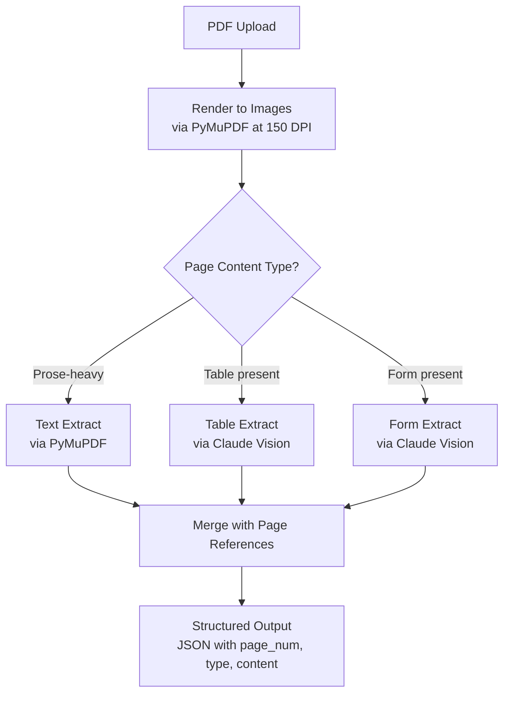
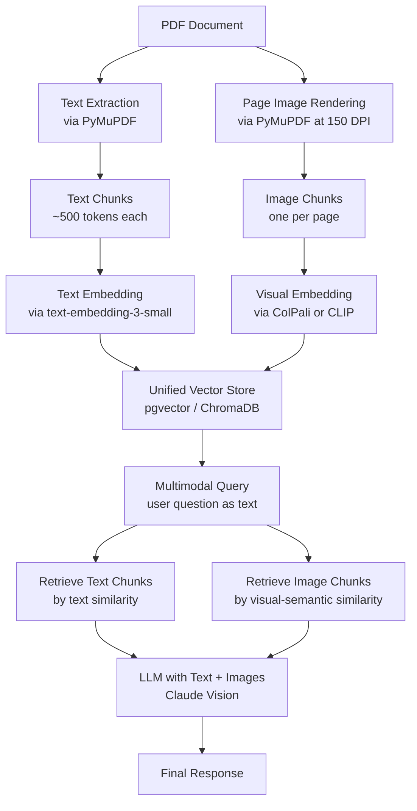

# Week 6: Multimodal AI Engineering

**Theme: AI that can see, read, and listen**

By the end of this week, you will understand how modern AI systems process images, documents, audio, and video alongside text. You will build a production-grade multimodal document Q&A system that retrieves both visual and textual context to answer questions about charts, tables, and diagrams — tasks that pure text RAG systems fundamentally cannot handle.

---

## 6.1 Vision Models in Production

### Architecture Overview

The ability for language models to "see" images is one of the most consequential capability expansions in AI engineering. Understanding the architectural families that enable this is essential for choosing the right tool for each production task.

**CLIP (Contrastive Language-Image Pretraining)**, introduced by OpenAI in 2021, is the foundational architecture for vision-language alignment. CLIP trains two encoders — one for images and one for text — using contrastive learning on 400 million image-caption pairs scraped from the web. During training, the model learns to project matching image-caption pairs close together in a shared embedding space and push mismatched pairs apart. The result is an embedding model, not a generator: CLIP tells you *how similar* an image and text are, not what the image contains. CLIP embeddings power zero-shot image classification, image retrieval, and serve as the visual backbone in many downstream VLMs.

**LLaVA (Large Language and Vision Assistant)** is an open-source **vision-language model (VLM)** that connects a CLIP visual encoder to a large language model (originally LLaMA, later Mistral and others) using a simple projection layer. The projection layer maps CLIP image embeddings into the token embedding space of the LLM, so the language model can "read" image features as if they were tokens. LLaVA is important because it is open-weights, runs locally, and demonstrates that high-quality VLMs do not require proprietary infrastructure. For on-premises deployments where data privacy prohibits sending images to external APIs, LLaVA (or its successor LLaVA-1.6) is the first model to evaluate.

**Claude Vision** (Anthropic) is the production choice for **document understanding** tasks. Claude's vision capabilities are exceptionally strong at reading dense text, parsing complex table layouts, interpreting technical diagrams, and extracting structured data from scanned forms. When a PDF page contains a mix of prose, tables, footnotes, and figures, Claude Vision consistently outperforms alternatives on extraction accuracy.

**GPT-4V / GPT-4o** (OpenAI) excels at **natural image description** — photographs, scenes, artwork, and visual reasoning tasks that require commonsense understanding of the physical world. For a customer support chatbot that processes user-submitted photos of broken products, GPT-4o is likely the better choice. For a financial document parser that must extract every row from a dense earnings table, Claude Vision is likely the better choice.

> **Key Insight:** Model selection for vision tasks is not one-size-fits-all. Benchmark your specific task — document extraction accuracy on Claude Vision vs GPT-4o can differ by 15-25 percentage points depending on document type.

### Image Input Methods

Every major VLM API accepts images in one of three ways:

1. **Base64 data URI**: Encode the image bytes as base64 and pass as a `data:image/jpeg;base64,...` string. This works for any image regardless of hosting.
2. **Public HTTPS URL**: Pass a direct URL to a publicly accessible image. The API server fetches it. Fast to implement but requires the image to be publicly hosted.
3. **File Upload API**: Pre-upload the image to receive a file ID, then reference the ID in subsequent API calls. Reduces repeated uploads of the same image.

> **Key Insight:** For production systems, the base64 method is most reliable because it does not depend on external URL availability or network routing from the API provider's servers. URLs can return 403s, change, or time out.

### Cost Implications of Image Tokens

Images are not free tokens. Claude's tokenization of images is resolution-dependent: a **1024x1024 image costs approximately 1,300 tokens**. At Claude Sonnet pricing, that is roughly $0.004 per image at input rates — negligible for a single query but significant at scale.

For a RAG system processing 1,000 document pages per day, each rendered as a 1024x1024 image, image token costs alone reach ~1.3 million tokens/day. Cost mitigation strategies include: downsizing images to 512x512 where text remains legible (reducing cost ~75%), caching visual descriptions as text after first processing, and only passing images to the LLM when the retrieved chunk is an image chunk rather than a text chunk.

### Prompting Strategies for Visual Tasks

Four primary prompt patterns cover most production vision tasks:

- **Description**: `"Describe this diagram in detail, including all labeled components and their relationships."`
- **Extraction**: `"Extract all data from this table as a JSON array of objects, using the header row as keys."`
- **Comparison**: `"How do these two charts differ? Focus on trend direction and the time period covered."`
- **OCR**: `"Transcribe all text visible in this image exactly as it appears, preserving line breaks."`

```python
import anthropic
import base64
from pathlib import Path


def call_claude_vision(image_path: str, prompt: str) -> str:
    """
    Send an image to Claude Vision with a text prompt.
    Returns the model's text response.
    """
    client = anthropic.Anthropic()

    # Read image bytes and encode as base64
    image_bytes = Path(image_path).read_bytes()
    b64_image = base64.standard_b64encode(image_bytes).decode("utf-8")

    # Infer media type from file extension
    ext = Path(image_path).suffix.lower()
    media_type_map = {
        ".jpg": "image/jpeg",
        ".jpeg": "image/jpeg",
        ".png": "image/png",
        ".gif": "image/gif",
        ".webp": "image/webp",
    }
    media_type = media_type_map.get(ext, "image/jpeg")

    # Build the multimodal message
    response = client.messages.create(
        model="claude-sonnet-4-5",
        max_tokens=1024,
        messages=[
            {
                "role": "user",
                "content": [
                    {
                        "type": "image",
                        "source": {
                            "type": "base64",
                            "media_type": media_type,
                            "data": b64_image,
                        },
                    },
                    {
                        "type": "text",
                        "text": prompt,
                    },
                ],
            }
        ],
    )

    return response.content[0].text


# --- Usage examples ---

# Description task
description = call_claude_vision(
    "architecture_diagram.png",
    "Describe this system architecture diagram in detail, "
    "including all components and the data flow between them.",
)

# Extraction task
table_json = call_claude_vision(
    "financial_table.png",
    "Extract all data from this table as a JSON array of objects. "
    "Use the column headers as keys. Return only valid JSON.",
)

# OCR task
ocr_text = call_claude_vision(
    "scanned_form.jpg",
    "Transcribe all text visible in this image exactly as it appears. "
    "Preserve line breaks and spacing.",
)

print("Description:", description[:200])
print("Table JSON:", table_json[:200])
print("OCR:", ocr_text[:200])
```

> **Key Insight:** When prompting for structured extraction (tables, forms), always tell the model the exact output format you want — "return only valid JSON", "use the header row as keys". Without this, models produce well-formatted prose descriptions of the data rather than machine-parseable output.

### Chapter 6.1 Checkpoint

1. What is the architectural difference between CLIP and LLaVA, and when would you choose one over the other?
2. A 512x512 image costs roughly how many tokens with Claude, and what cost optimization does this suggest for a high-volume document processing pipeline?
3. You need to extract a complex financial table from a scanned PDF page. Write out the prompt strategy you would use — which prompt pattern applies, and what output format would you request?

---

## 6.2 Document Intelligence

### The Challenge of PDF Processing

PDFs are the dominant format for business documents — contracts, reports, research papers, invoices, forms — yet they are notoriously hostile to automated processing. A PDF is not a structured document format; it is a page description language. Text in a PDF is stored as positioned glyphs on a canvas. Tables are not represented as rows and columns — they are collections of text elements whose spatial proximity implies tabular structure. Images may be embedded as raster bitmaps with no alt text. A scanned document may contain no extractable text at all, only image data.

**Document intelligence** is the engineering discipline of converting this raw PDF chaos into structured, queryable data. Three primary approaches exist, each with different trade-offs.

### Approach 1: Text Extraction with PyMuPDF

**PyMuPDF** (imported as `fitz`) is the fastest pure-text extraction library. It parses the PDF's internal glyph positions and reconstructs text strings. For PDFs generated by modern word processors or typesetting tools (Word, LaTeX, InDesign), this produces clean, accurate text in milliseconds per page.

The critical limitation: PyMuPDF loses layout. Columnar text gets merged linearly. Table cell contents lose their row/column relationships. Headers and footers may interleave with body text. For simple prose documents, this is acceptable. For documents with significant visual structure, text extraction alone produces misleading input for downstream LLMs.

### Approach 2: Visual Processing with Claude Vision

The visual approach renders each PDF page as a raster image, then passes the image to Claude Vision. This **preserves layout completely** — the model sees the page exactly as a human reader would, including table grid lines, chart axes, diagram annotations, and the spatial relationship between elements.

The cost is latency and token usage. A 100-page PDF rendered at 150 DPI produces 100 images, each costing ~800-1300 tokens to process. But for documents where layout carries semantic meaning — a balance sheet where column position indicates fiscal year, a form where label proximity to field indicates the field's name — visual processing is the only approach that reliably captures that meaning.

### Approach 3: Specialized Tools (Unstructured.io)

**Unstructured.io** is an open-source library purpose-built for document parsing. It uses a combination of heuristic layout detection, OCR (via Tesseract), and ML-based element classification to identify document elements: titles, narrative text, list items, tables, images, headers, footers. It outputs a structured JSON representation preserving element types and hierarchy. Unstructured is particularly valuable for mixed documents containing a combination of prose, tables, and embedded figures.

> **Key Insight:** In production, use a cascade: try PyMuPDF first (fast, cheap). If the document has tables or forms, fall back to Claude Vision. For large-scale batch processing of heterogeneous documents, Unstructured.io as a preprocessing layer before LLM calls reduces cost by extracting structure without requiring vision model inference on every page.

### Document Intelligence Pipeline



### Table Extraction with Claude Vision

The table extraction problem illustrates why visual processing matters. A PDF table like a quarterly earnings report stores each cell as an independent text element at absolute x,y coordinates. PyMuPDF extracts: `"Revenue"`, `"Q1"`, `"Q2"`, `"Q3"`, `"$1.2B"`, `"$1.4B"`, `"$1.5B"` — a flat list with no structural relationship. Reconstructing which values belong to which row and column requires heuristic spatial clustering that fails for merged cells, multi-line cells, or borderless tables.

Claude Vision receives the rendered page image and a prompt like: `"Extract the table on this page as a JSON array of objects. Use the header row as keys."` The model reads the visual grid, infers row/column structure from visual boundaries and alignment, and outputs a structured JSON representation that PyMuPDF cannot produce.

```python
import fitz  # PyMuPDF
import anthropic
import base64
import json
from pathlib import Path
from dataclasses import dataclass, field
from typing import Any


@dataclass
class PageChunk:
    """Represents one processed page from a PDF."""
    page_num: int
    text: str
    image_b64: str  # base64-encoded PNG of the rendered page
    tables: list[dict[str, Any]] = field(default_factory=list)
    forms: dict[str, str] = field(default_factory=dict)


def render_pdf_pages(pdf_path: str, dpi: int = 150) -> list[PageChunk]:
    """
    Render each PDF page to a PNG image and extract raw text.
    Returns a list of PageChunk objects, one per page.
    """
    doc = fitz.open(pdf_path)
    chunks = []

    for page_num, page in enumerate(doc):
        # Extract raw text (fast, loses layout)
        raw_text = page.get_text("text")

        # Render page to image at specified DPI
        # Matrix scales the page: 150 DPI / 72 DPI (PDF default) = 2.08x
        mat = fitz.Matrix(dpi / 72, dpi / 72)
        pix = page.get_pixmap(matrix=mat)

        # Encode as base64 PNG
        png_bytes = pix.tobytes("png")
        b64 = base64.standard_b64encode(png_bytes).decode("utf-8")

        chunks.append(PageChunk(
            page_num=page_num + 1,  # 1-indexed for human readability
            text=raw_text,
            image_b64=b64,
        ))

    doc.close()
    return chunks


def extract_table_from_page(client: anthropic.Anthropic, page: PageChunk) -> list[dict]:
    """
    Use Claude Vision to extract any table on the given page as structured JSON.
    Returns a list of row dicts (header row used as keys).
    """
    response = client.messages.create(
        model="claude-sonnet-4-5",
        max_tokens=2048,
        messages=[
            {
                "role": "user",
                "content": [
                    {
                        "type": "image",
                        "source": {
                            "type": "base64",
                            "media_type": "image/png",
                            "data": page.image_b64,
                        },
                    },
                    {
                        "type": "text",
                        "text": (
                            "If this page contains a table, extract it as a JSON array of objects "
                            "where each object represents one data row and uses the header row as keys. "
                            "If there are multiple tables, return a JSON array of arrays. "
                            "If there is no table, return an empty array []. "
                            "Return ONLY valid JSON, no explanation."
                        ),
                    },
                ],
            }
        ],
    )

    raw = response.content[0].text.strip()
    # Strip markdown code fences if present
    if raw.startswith("```"):
        raw = raw.split("```")[1]
        if raw.startswith("json"):
            raw = raw[4:]
    return json.loads(raw)


def extract_form_fields(client: anthropic.Anthropic, page: PageChunk) -> dict[str, str]:
    """
    Use Claude Vision to extract form field label/value pairs from the page.
    Returns a dict mapping field label to field value.
    """
    response = client.messages.create(
        model="claude-sonnet-4-5",
        max_tokens=1024,
        messages=[
            {
                "role": "user",
                "content": [
                    {
                        "type": "image",
                        "source": {
                            "type": "base64",
                            "media_type": "image/png",
                            "data": page.image_b64,
                        },
                    },
                    {
                        "type": "text",
                        "text": (
                            "If this page contains a form, extract all field labels and their filled values "
                            "as a JSON object where keys are field labels and values are the entered data. "
                            "If there is no form, return {}. "
                            "Return ONLY valid JSON."
                        ),
                    },
                ],
            }
        ],
    )

    raw = response.content[0].text.strip()
    if raw.startswith("```"):
        raw = raw.split("```")[1]
        if raw.startswith("json"):
            raw = raw[4:]
    return json.loads(raw)


# --- Main pipeline ---

def process_pdf(pdf_path: str) -> list[PageChunk]:
    """Full document intelligence pipeline for a single PDF."""
    client = anthropic.Anthropic()

    print(f"Rendering pages from {pdf_path}...")
    pages = render_pdf_pages(pdf_path, dpi=150)

    for page in pages:
        print(f"  Processing page {page.page_num}...")

        # Heuristic: if raw text is short, page is likely image-heavy or a form
        has_substantial_text = len(page.text.strip()) > 200

        # Always attempt table extraction via vision
        page.tables = extract_table_from_page(client, page)
        if page.tables:
            print(f"    Found {len(page.tables)} table rows on page {page.page_num}")

        # Attempt form extraction only for pages with sparse text (likely form pages)
        if not has_substantial_text:
            page.forms = extract_form_fields(client, page)
            if page.forms:
                print(f"    Found {len(page.forms)} form fields on page {page.page_num}")

    return pages
```

### Form Processing

Form extraction follows the same pattern as table extraction but targets label-value pairs rather than grid structure. The prompt instructs Claude to identify visual label elements (often left-aligned or above blank fields) and their corresponding filled values. The output is a flat key-value dictionary: `{"Applicant Name": "Jane Smith", "Date of Birth": "1985-03-14", "Policy Number": "XK-4421-B"}`. This pairs naturally with downstream processes like database insertion or data validation.

> **Key Insight:** Form field detection is a spatial reasoning task, not a text parsing task. The label "Date of Birth" may be 50 pixels above a filled field, or 200 pixels to its left, depending on the form layout. Vision models handle this spatial reasoning naturally; text extraction tools require expensive layout heuristics that break on non-standard forms.

### Chapter 6.2 Checkpoint

1. Why does PyMuPDF fail to correctly reconstruct table structure from a PDF, even when the table's text content is perfectly extracted?
2. Describe the cascade strategy for PDF processing: when do you use PyMuPDF alone, and when do you escalate to Claude Vision?
3. A scanned insurance claim form contains 20 labeled fields, many partially filled. Which extraction approach would you use, and what output format would your system expect from the model?

---

## 6.3 Multimodal RAG

### The Core Challenge

Standard RAG systems embed text chunks and retrieve by semantic similarity. When a user asks "What was the revenue trend shown in the Q3 report?", a text-only RAG system fails if that trend is conveyed by a line chart — the chart's meaning was never embedded in retrievable text. **Multimodal RAG** solves this by storing and retrieving both text and image chunks, then passing relevant images alongside text to the generation model.

The engineering challenge is non-trivial: image embeddings and text embeddings live in different vector spaces by default, retrieval must surface the right modality, and serving requires fetching image bytes at query time.

### Approach 1: Text Descriptions of Images

The simplest multimodal RAG approach: at ingestion time, pass every image through a vision model and store the generated text description as a text chunk. At retrieval time, the system behaves like standard text RAG — it embeds the query and retrieves text chunks, some of which happen to be descriptions of images.

This approach is simple to implement and requires no changes to the vector database or retrieval logic. Its weakness is information loss: a chart description like "a line chart showing upward revenue trend from Q1 to Q4" loses the specific data points, the scale of the axes, and the precise shape of the trend. Questions requiring precise numerical values from charts cannot be answered accurately from descriptions alone.

### Approach 2: ColPali — Direct Visual Embedding

**ColPali** (Contextual Late Interaction over PaliGemma) is a state-of-the-art approach that embeds page images *directly* into a retrieval-compatible embedding space using PaliGemma, Google's vision-language model. Unlike CLIP, which produces a single vector per image, ColPali uses **late interaction** (a ColBERT-style technique) to produce a *set* of patch-level embeddings per page image.

**Late interaction** works as follows: the query is tokenized into N query tokens, each embedded into a vector. The document page image is divided into patches, each embedded into a vector. At retrieval time, the **MaxSim** score between a query and a page is computed as the sum over each query token of the maximum cosine similarity between that query token and any patch embedding. This fine-grained matching captures partial relevance — a query about "revenue" activates the patch containing the revenue axis label, even if the rest of the page is about expenses.

> **Key Insight:** ColPali eliminates the text extraction step entirely for retrieval purposes. You index raw page images and retrieve pages by visual-semantic similarity to text queries. This is a fundamental architecture shift: the retrieval layer now understands images without first converting them to text.

### Multimodal RAG Pipeline



### Storing Image Chunks

Image chunks require both a **binary store** for the pixel data and a **vector store** for the embedding. Two common patterns:

- **PostgreSQL BYTEA**: Store image bytes directly in a `BYTEA` column alongside the vector in a `pgvector` table. Keeps everything in one database, simplifies transactions, but increases database size significantly for large corpora.
- **S3 URL reference**: Store the image in S3 (or Azure Blob Storage), store the S3 URL in the database, and fetch at serve time. Scales better for large image corpora but adds a network round-trip at query time.

For a production system processing millions of pages, the S3 pattern is standard. For a prototype or a system with < 100K pages, the BYTEA pattern is simpler and avoids external dependency.

```python
import chromadb
import anthropic
import base64
import hashlib
import fitz
from pathlib import Path


def build_multimodal_index(pdf_paths: list[str], collection_name: str = "multimodal_docs"):
    """
    Ingest a list of PDFs into a multimodal ChromaDB collection.
    Stores both text chunks and image chunks (base64-encoded page images).
    """
    # Initialize ChromaDB with local persistence
    chroma_client = chromadb.PersistentClient(path="./chroma_db")
    anthropic_client = anthropic.Anthropic()

    # Create or get collection
    # ChromaDB uses cosine similarity by default
    collection = chroma_client.get_or_create_collection(
        name=collection_name,
        metadata={"hnsw:space": "cosine"},
    )

    for pdf_path in pdf_paths:
        doc = fitz.open(pdf_path)
        pdf_name = Path(pdf_path).stem

        for page_num, page in enumerate(doc):
            page_id_base = f"{pdf_name}_p{page_num + 1}"

            # --- Text chunk ---
            raw_text = page.get_text("text").strip()
            if len(raw_text) > 50:  # Skip near-empty pages
                text_chunk_id = f"{page_id_base}_text"
                collection.add(
                    ids=[text_chunk_id],
                    documents=[raw_text],
                    metadatas=[{
                        "source_pdf": pdf_name,
                        "page_num": page_num + 1,
                        "chunk_type": "text",
                    }],
                )

            # --- Image chunk ---
            # Render page as image
            mat = fitz.Matrix(150 / 72, 150 / 72)
            pix = page.get_pixmap(matrix=mat)
            png_bytes = pix.tobytes("png")
            b64_image = base64.standard_b64encode(png_bytes).decode("utf-8")

            # Generate a text description of the page for embedding
            # (ChromaDB's default embedder works on text; for true ColPali-style
            # visual embedding you would swap in a custom embedding function)
            description_response = anthropic_client.messages.create(
                model="claude-sonnet-4-5",
                max_tokens=256,
                messages=[
                    {
                        "role": "user",
                        "content": [
                            {
                                "type": "image",
                                "source": {
                                    "type": "base64",
                                    "media_type": "image/png",
                                    "data": b64_image,
                                },
                            },
                            {
                                "type": "text",
                                "text": (
                                    "Describe the visual content of this page in 2-3 sentences, "
                                    "focusing on any charts, tables, diagrams, or figures present. "
                                    "Be specific about data shown."
                                ),
                            },
                        ],
                    }
                ],
            )
            visual_description = description_response.content[0].text

            image_chunk_id = f"{page_id_base}_image"
            collection.add(
                ids=[image_chunk_id],
                documents=[visual_description],  # embed the description
                metadatas=[{
                    "source_pdf": pdf_name,
                    "page_num": page_num + 1,
                    "chunk_type": "image",
                    "image_b64": b64_image,  # store image bytes in metadata
                }],
            )

        doc.close()
        print(f"Indexed {pdf_path}: {page_num + 1} pages")

    return collection


def multimodal_query(
    collection,
    query: str,
    n_text_results: int = 3,
    n_image_results: int = 2,
) -> str:
    """
    Query the multimodal index and generate a response using both text
    and image context retrieved from the collection.
    """
    client = anthropic.Anthropic()

    # Retrieve top text chunks
    text_results = collection.query(
        query_texts=[query],
        n_results=n_text_results,
        where={"chunk_type": "text"},
    )

    # Retrieve top image chunks
    image_results = collection.query(
        query_texts=[query],
        n_results=n_image_results,
        where={"chunk_type": "image"},
    )

    # Build multimodal message content
    content = []

    # Add retrieved text chunks as context
    text_context = "\n\n---\n\n".join(text_results["documents"][0])
    content.append({
        "type": "text",
        "text": f"## Retrieved Text Context\n\n{text_context}\n\n## Retrieved Visual Context",
    })

    # Add retrieved image chunks
    for i, metadata in enumerate(image_results["metadatas"][0]):
        b64 = metadata.get("image_b64", "")
        if b64:
            content.append({
                "type": "image",
                "source": {
                    "type": "base64",
                    "media_type": "image/png",
                    "data": b64,
                },
            })
            content.append({
                "type": "text",
                "text": (
                    f"[Image from {metadata['source_pdf']}, page {metadata['page_num']}]"
                ),
            })

    # Add the user question
    content.append({
        "type": "text",
        "text": f"\n\n## Question\n\n{query}",
    })

    response = client.messages.create(
        model="claude-sonnet-4-5",
        max_tokens=1024,
        messages=[{"role": "user", "content": content}],
        system=(
            "You are a document analyst. Answer the question using the provided text and visual context. "
            "Cite specific page numbers when referencing data from charts or tables."
        ),
    )

    return response.content[0].text
```

### Serving Multimodal Results

At query time, the serving flow is: retrieve text chunks and image chunk metadata → fetch image bytes from metadata (or S3) → assemble a multimodal LLM prompt interleaving text context and images → stream the response. The key engineering concern is **prompt assembly order**: place the most relevant image immediately before the question, not buried early in a long context window. Vision models attend more strongly to images that appear close to the query.

> **Key Insight:** For queries that require precise numerical values from charts (e.g., "what was the exact revenue in Q3?"), passing the actual page image alongside the description consistently produces more accurate answers than description-only retrieval. The visual grounding allows the model to "re-read" the chart at inference time.

### Chapter 6.3 Checkpoint

1. What is the difference between Approach 1 (text descriptions) and ColPali for multimodal RAG, and what class of questions does each approach struggle with?
2. Explain the MaxSim scoring function in late interaction retrieval. Why does it outperform single-vector (dot-product) retrieval for long documents?
3. You are building a multimodal RAG system for a corpus of 50,000 PDF pages. Should you store image bytes in PostgreSQL BYTEA or S3? Justify your choice considering scale, latency, and operational complexity.

---

## 6.4 Audio and Video (Survey)

### Speech-to-Text with Whisper

**Whisper** is OpenAI's open-source automatic speech recognition (ASR) model, trained on 680,000 hours of multilingual audio. It supports 99 languages and achieves near-human transcription accuracy on clean audio. For AI engineering pipelines, Whisper's key characteristics are:

- **Timestamped output**: Each transcribed segment includes start and end timestamps, enabling precise audio-text alignment for downstream tasks like meeting summarization with speaker attribution or video captioning.
- **Local execution**: Whisper runs on CPU or GPU with no API key required. The `base` model (74M parameters) runs in real-time on a modern CPU; the `large-v3` model (1.5B parameters) requires a GPU but achieves state-of-the-art accuracy.
- **Language detection**: Whisper auto-detects the spoken language by default, useful for multilingual customer support pipelines.

```python
import whisper
import json
from pathlib import Path


def transcribe_audio(audio_path: str, model_size: str = "base") -> dict:
    """
    Transcribe an audio file using Whisper.
    Returns a dict with full text and timestamped segments.

    model_size options: "tiny", "base", "small", "medium", "large-v3"
    Larger models are more accurate but slower and require more VRAM.
    """
    # Load model (cached after first download)
    model = whisper.load_model(model_size)

    # Transcribe — returns dict with 'text', 'segments', 'language'
    result = model.transcribe(
        audio_path,
        # word_timestamps=True adds word-level timestamps (slower)
        verbose=False,
    )

    # Extract key fields
    output = {
        "language": result["language"],
        "full_text": result["text"].strip(),
        "segments": [
            {
                "id": seg["id"],
                "start": round(seg["start"], 2),
                "end": round(seg["end"], 2),
                "text": seg["text"].strip(),
            }
            for seg in result["segments"]
        ],
    }

    return output


def transcribe_audio_file_and_summarize(audio_path: str) -> str:
    """
    Transcribe an audio file then summarize key points using Claude.
    Demonstrates the full audio-to-insight pipeline.
    """
    import anthropic

    # Step 1: Transcribe
    print(f"Transcribing {audio_path}...")
    transcript = transcribe_audio(audio_path, model_size="base")
    print(f"Detected language: {transcript['language']}")
    print(f"Duration: {transcript['segments'][-1]['end']:.1f}s")

    # Step 2: Pass to Claude for summarization
    client = anthropic.Anthropic()
    response = client.messages.create(
        model="claude-sonnet-4-5",
        max_tokens=512,
        messages=[
            {
                "role": "user",
                "content": (
                    f"Here is a transcript of an audio recording:\n\n"
                    f"{transcript['full_text']}\n\n"
                    f"Please provide:\n"
                    f"1. A 2-sentence summary\n"
                    f"2. Three key action items or decisions mentioned\n"
                    f"3. Any questions left unresolved"
                ),
            }
        ],
    )

    return response.content[0].text


# Example usage
if __name__ == "__main__":
    result = transcribe_audio("meeting_recording.mp3", model_size="small")
    print(f"Language: {result['language']}")
    print(f"Full text:\n{result['full_text'][:500]}...")

    # Print timestamped segments
    for seg in result["segments"][:5]:
        print(f"[{seg['start']:6.2f}s - {seg['end']:6.2f}s] {seg['text']}")
```

### Real-Time Audio Pipelines

Real-time transcription — for live meeting assistants, voice interfaces, or real-time captioning — requires a **streaming pipeline** with strict latency constraints. The architecture involves chunking the incoming audio stream into overlapping segments, transcribing each chunk, buffering transcriptions, and periodically passing buffered text to an LLM for response generation.

The **800ms total latency target** for natural-feeling voice assistants breaks down approximately as:
- 200ms: audio capture and chunking
- 300ms: Whisper transcription of the 3-second chunk (on a GPU)
- 300ms: LLM inference for the response

This leaves almost no slack. To stay within budget: use the Whisper `tiny` or `base` model (faster at some accuracy cost), run transcription on GPU, cache the LLM system prompt, and use streaming LLM responses so the first tokens reach the user in ~100ms rather than waiting for the full response.

> **Key Insight:** Whisper is better than GPT-4o audio for pure transcription (lower word error rate, cheaper per minute, runs locally). GPT-4o audio is better when the pipeline needs to understand paralinguistic signals — tone, emphasis, hesitation — to determine intent. Use Whisper when the goal is text; use GPT-4o audio when the goal is understanding the speaker.

### Video Understanding

Video adds the temporal dimension to the vision problem. A 1-minute video at 30fps is 1,800 frames — far too many to pass to a vision LLM individually. The practical approach:

1. **Frame extraction**: Use `ffmpeg` to extract frames at a low rate (typically 1fps for content analysis, higher for fast-moving content).
2. **Keyframe selection**: Use CLIP to embed all extracted frames, then compute pairwise cosine similarities. Remove frames that are highly similar to their predecessor (scene is static). Keep only significantly different frames (visual events). This typically reduces frame count by 60-80%.
3. **Frame grid assembly**: Arrange 4-16 keyframes in a grid image and pass the grid to a vision LLM. Grid prompts are more efficient than individual image API calls.
4. **Temporal questions**: For questions requiring precise timing ("at what timestamp does the speaker mention pricing?"), fall back to Whisper on the audio track with timestamp alignment.

```bash
# Extract frames at 1fps from a video file
ffmpeg -i input_video.mp4 -vf fps=1 frames/frame_%04d.jpg -hide_banner -loglevel error

# Extract audio track from video for Whisper
ffmpeg -i input_video.mp4 -vn -acodec pcm_s16le -ar 16000 -ac 1 audio.wav -hide_banner -loglevel error
```

```python
import anthropic
import base64
import subprocess
from pathlib import Path
import numpy as np


def extract_video_frames(video_path: str, fps: float = 1.0, output_dir: str = "./frames") -> list[str]:
    """Extract frames from video at specified FPS using ffmpeg."""
    Path(output_dir).mkdir(exist_ok=True)
    output_pattern = f"{output_dir}/frame_%04d.jpg"

    subprocess.run([
        "ffmpeg", "-i", video_path,
        "-vf", f"fps={fps}",
        output_pattern,
        "-hide_banner", "-loglevel", "error",
    ], check=True)

    return sorted(str(p) for p in Path(output_dir).glob("frame_*.jpg"))


def select_keyframes_by_clip_similarity(
    frame_paths: list[str],
    similarity_threshold: float = 0.95,
) -> list[str]:
    """
    Remove near-duplicate frames using CLIP similarity.
    Keeps only frames that differ significantly from their predecessor.
    Requires: pip install open-clip-torch
    """
    import open_clip
    import torch
    from PIL import Image

    model, _, preprocess = open_clip.create_model_and_transforms("ViT-B-32", pretrained="openai")
    model.eval()

    # Encode all frames
    embeddings = []
    for path in frame_paths:
        img = preprocess(Image.open(path)).unsqueeze(0)
        with torch.no_grad():
            emb = model.encode_image(img)
            emb = emb / emb.norm(dim=-1, keepdim=True)
        embeddings.append(emb.squeeze().numpy())

    # Select keyframes: keep frame if cosine similarity to previous keyframe < threshold
    keyframes = [frame_paths[0]]
    last_emb = embeddings[0]

    for i in range(1, len(frame_paths)):
        sim = float(np.dot(embeddings[i], last_emb))
        if sim < similarity_threshold:
            keyframes.append(frame_paths[i])
            last_emb = embeddings[i]

    print(f"Keyframe selection: {len(frame_paths)} frames → {len(keyframes)} keyframes")
    return keyframes


def analyze_video(video_path: str, question: str) -> str:
    """
    Full video understanding pipeline:
    1. Extract frames at 1fps
    2. Select keyframes via CLIP similarity
    3. Pass keyframes to Claude Vision for analysis
    """
    client = anthropic.Anthropic()

    # Extract and select keyframes
    all_frames = extract_video_frames(video_path, fps=1.0)
    keyframes = select_keyframes_by_clip_similarity(all_frames)

    # Build multimodal content with up to 12 keyframes
    content = [{"type": "text", "text": f"I am analyzing a video. Here are {len(keyframes[:12])} keyframes:\n"}]

    for i, frame_path in enumerate(keyframes[:12]):
        img_bytes = Path(frame_path).read_bytes()
        b64 = base64.standard_b64encode(img_bytes).decode("utf-8")
        content.append({
            "type": "image",
            "source": {"type": "base64", "media_type": "image/jpeg", "data": b64},
        })
        content.append({"type": "text", "text": f"[Frame {i+1}]"})

    content.append({"type": "text", "text": f"\nQuestion: {question}"})

    response = client.messages.create(
        model="claude-sonnet-4-5",
        max_tokens=1024,
        messages=[{"role": "user", "content": content}],
    )

    return response.content[0].text
```

> **Key Insight:** The keyframe selection step is critical for cost control. A 10-minute product demo video at 1fps yields 600 frames. After CLIP-based deduplication (removing frames where the presenter is talking without slide changes), this typically reduces to 30-60 keyframes — a 90% reduction in vision API cost with minimal information loss.

### Chapter 6.4 Checkpoint

1. What does Whisper's timestamped output enable that a simple string transcription does not? Give two concrete downstream use cases.
2. Your voice assistant pipeline has a measured latency of 1,200ms, which feels unnatural. What three specific optimizations would you apply first, and which part of the 800ms budget does each address?
3. Explain the two-step approach to video understanding (frame extraction + keyframe selection). Why is keyframe selection necessary rather than simply passing all frames to the vision model?

---

## Lab Walkthrough: Multimodal Document Q&A

### Objective

Build a system that ingests 5 real PDFs containing charts, tables, and diagrams. The system retrieves both text and image context for each query. You will compare this multimodal system against a text-only RAG baseline on 20 questions that require understanding visual content.

### Prerequisites

```bash
pip install anthropic chromadb pymupdf openai tiktoken numpy pillow
```

### Step 1: Collect Source PDFs

Obtain 5 PDFs with rich visual content. Suggested sources:
- A corporate annual report (contains financial tables and charts)
- A scientific paper with figures and data plots
- A government statistical report with demographic charts
- A technical manual with diagrams
- A product datasheet with comparison tables

Place them in `./pdfs/` directory.

### Step 2: Build the Text-Only Baseline

```python
# baseline_rag.py
import fitz
import chromadb
from pathlib import Path


def build_text_index(pdf_paths: list[str]) -> chromadb.Collection:
    client = chromadb.PersistentClient(path="./chroma_text_only")
    collection = client.get_or_create_collection("text_only")

    for pdf_path in pdf_paths:
        doc = fitz.open(pdf_path)
        pdf_name = Path(pdf_path).stem
        for page_num, page in enumerate(doc):
            text = page.get_text("text").strip()
            if len(text) > 50:
                collection.add(
                    ids=[f"{pdf_name}_p{page_num+1}"],
                    documents=[text],
                    metadatas=[{"source": pdf_name, "page": page_num + 1}],
                )
        doc.close()
    return collection


def text_only_query(collection: chromadb.Collection, question: str) -> str:
    import anthropic
    client = anthropic.Anthropic()

    results = collection.query(query_texts=[question], n_results=4)
    context = "\n\n---\n\n".join(results["documents"][0])

    response = client.messages.create(
        model="claude-sonnet-4-5",
        max_tokens=512,
        messages=[{
            "role": "user",
            "content": f"Context:\n{context}\n\nQuestion: {question}",
        }],
    )
    return response.content[0].text
```

### Step 3: Build the Multimodal System

Use the `build_multimodal_index` and `multimodal_query` functions from Section 6.3. These are already complete — integrate them here.

### Step 4: Design Your 20 Test Questions

Create a mix of question types, roughly:
- 5 questions answerable from text alone (should be equal between systems)
- 8 questions requiring chart/graph reading (multimodal advantage expected)
- 4 questions requiring table data extraction (multimodal advantage expected)
- 3 questions requiring diagram/figure understanding (multimodal advantage expected)

Example questions:
- "What was the total revenue in 2022?" (text-only may work if stated in prose)
- "In what year did the growth rate peak according to the chart?" (requires visual)
- "What are the three columns in the comparison table on page 12?" (requires visual)

### Step 5: Run Evaluation

```python
# evaluate.py
import json
from pathlib import Path

QUESTIONS = [
    # Add your 20 questions here
    "What percentage of respondents preferred Option A according to the pie chart?",
    "List all column headers from the technical specifications table.",
    # ... 18 more
]

# Run both systems on all questions
results = []
for q in QUESTIONS:
    text_answer = text_only_query(text_collection, q)
    mm_answer = multimodal_query(mm_collection, q)
    results.append({
        "question": q,
        "text_only": text_answer,
        "multimodal": mm_answer,
    })

# Save for human evaluation
Path("evaluation_results.json").write_text(json.dumps(results, indent=2))
print(f"Saved {len(results)} question-answer pairs for evaluation")
```

### Step 6: Human Evaluation

For each of the 20 questions, evaluate both answers on a 1-3 scale:
- 1: Incorrect or "I don't have enough information"
- 2: Partially correct
- 3: Fully correct

Compute average scores for each system, then break down by question type (text-only vs visual-requiring). You should observe that the multimodal system outperforms on visual questions while performing similarly on text questions.

### Expected Findings

- Text-only RAG: ~85% accuracy on text questions, ~25% accuracy on visual questions
- Multimodal RAG: ~85% accuracy on text questions, ~70-80% accuracy on visual questions
- The accuracy gap on visual questions (45-55 percentage points) demonstrates the value of multimodal retrieval

---

## Further Reading

1. **"CLIP: Learning Transferable Visual Models From Natural Language Supervision"** — Radford et al., OpenAI (2021). The foundational paper on contrastive image-text learning. Available at arxiv.org/abs/2103.00020.

2. **"Visual Instruction Tuning"** — Liu et al. (2023). The original LLaVA paper describing how to instruction-tune a VLM using GPT-4-generated visual instruction data. arxiv.org/abs/2304.08485.

3. **"ColPali: Efficient Document Retrieval with Vision Language Models"** — Faysse et al. (2024). Describes the ColPali architecture for direct visual page retrieval. arxiv.org/abs/2407.01449.

4. **"Robust Speech Recognition via Large-Scale Weak Supervision"** — Radford et al., OpenAI (2022). The Whisper paper. arxiv.org/abs/2212.04356.

5. **"Building LLM Applications for Production"** — Chip Huyen (2023). The "Multimodal" chapter covers practical engineering considerations for vision pipelines. Available at huyenchip.com/2023/04/11/llm-engineering.html.

---

## Week Summary

- **Vision model selection is task-specific**: Claude Vision leads on document extraction; GPT-4o leads on natural scene understanding; LLaVA is the open-source option for privacy-constrained deployments. Benchmark on your actual document types before committing to a provider.

- **PDF processing requires a cascade strategy**: PyMuPDF is fast and free but loses layout structure. Claude Vision on rendered page images preserves layout and handles tables/forms correctly. Use PyMuPDF for prose-heavy pages; escalate to Claude Vision when visual structure carries meaning.

- **Multimodal RAG solves a fundamental text-RAG limitation**: Questions that require reading a chart, interpreting a diagram, or extracting precise values from a table cannot be answered by systems that only retrieve text. Storing image chunks alongside text chunks and passing retrieved images to the generation model closes this gap.

- **Audio pipelines have hard latency budgets**: Natural conversation requires end-to-end latency under 800ms. This constrains model size (Whisper `base` or `small` over `large`), requires GPU inference, and demands streaming LLM responses. Whisper is better for transcription accuracy; GPT-4o audio is better for intent understanding from vocal tone.

- **Video understanding is a frame sampling problem**: Full-frame-rate video is impractical for vision LLM inference. The practical pipeline extracts 1fps frames, uses CLIP similarity to remove near-duplicate frames, and passes a compact keyframe grid to the vision model — reducing API cost by 80-90% with minimal information loss for content analysis tasks.
