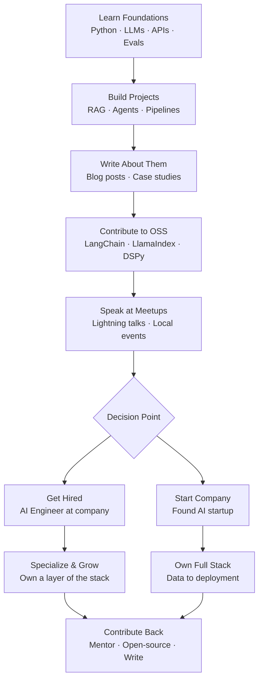

# Week 7: The AI Engineering Career and Field

**Course 3 — Production AI Engineering**
**Theme: Where you fit in this field and where it's going**

---

This week steps back from the technical trenches to give you a wider view. You have spent six weeks learning how to build, evaluate, observe, harden, and deploy AI systems. Now the question is: what does that make you, how does this field work, and where is it heading? Understanding the professional landscape is not soft filler — it directly affects what you build next, what you put on your resume, and what companies will pay you to do.

---

## 7.1 Role Definitions in AI Engineering

### Who Does What in the AI Field

The AI industry suffers from title inflation and definitional chaos. "AI Engineer," "ML Engineer," "Data Scientist," and "AI Researcher" are used interchangeably by recruiters and incorrectly by job postings. Understanding the real distinctions helps you position yourself accurately, interview for the right roles, and know which colleagues to call when something breaks.

**AI Engineers** — the role this curriculum prepares you for — build *applications* powered by pre-trained AI models. You rarely train models from scratch. Your job is to take a capable model (GPT-4o, Claude, Llama 3, a fine-tuned specialist) and make it do something useful reliably in production. That means prompts, retrieval pipelines, orchestration, evaluation, and deployment. The model is a component; the system is your product.

**ML Engineers** train and optimize models. They own training infrastructure (GPU clusters, distributed training jobs), write custom loss functions, debug gradient explosions, and compress models for deployment. Their code lives in training loops, not in API call chains. At a company building a recommendation system or a fraud detector, ML engineers are the core contributors. At a company *using* foundation models from OpenAI or Anthropic, ML engineers may be a smaller team or absent entirely.

**Data Scientists** do statistical analysis, experiment design, and model evaluation. They answer questions like "did this model change actually improve user outcomes?" using A/B testing frameworks and causal inference. They are often the people who first discover that an AI system is quietly degrading in production — not because they watch dashboards, but because they notice metric drift in product analytics.

**AI Researchers** advance the science. They publish papers at NeurIPS, ICML, and ICLR. Their deliverable is a proof-of-concept that demonstrates a new capability or a better technique. They are not responsible for shipping products. The gap between research and production is famously wide — a paper technique that works at 90% accuracy on a benchmark may require two years of engineering work before it performs at 99.5% in production.

> **Key Insight:** At most companies that *use* AI rather than *make* AI, the AI Engineer is the primary technical role. The ML Engineer appears later when scale or customization demands model-level work. You do not need to wait until you can train models to be useful or well-compensated.

### What AI Engineers Actually Do: The Time Breakdown

Survey data from practitioners, job postings, and public post-mortems consistently shows a similar allocation of time for a working AI engineer:

- **30% — Prompt engineering and evaluations.** Writing, refining, and systematically testing prompts. Building eval harnesses. Debugging regressions when a model update changes behavior. This is the unglamorous core of the job and the highest-leverage skill.
- **25% — RAG and retrieval pipelines.** Building document ingestion systems, managing vector stores, tuning chunking and embedding strategies, debugging retrieval quality. This is where most production AI systems live.
- **20% — Agent and orchestration logic.** Designing multi-step workflows, managing tool use, handling failures, routing between models. As agents become more common, this percentage is growing.
- **15% — Deployment and infrastructure.** Containerizing model-serving code, managing latency budgets, configuring autoscaling, handling API rate limits and fallbacks.
- **10% — Safety and evaluation.** Red-teaming, guardrail implementation, bias auditing, content policy enforcement.

These numbers shift depending on company stage. At a pre-product startup, deployment and infra might be 30% because you are setting up from scratch. At a mature enterprise, safety and evaluation might be 25% because compliance requirements are strict.

### Startup vs. Big Tech: The Full-Stack Trade-off

At **startups**, you own the entire vertical. On Monday you are writing a chunking strategy for a PDF ingestion pipeline. On Tuesday you are configuring a Kubernetes deployment. On Wednesday you are doing user interviews to understand why the chatbot keeps confusing customers. This is exhausting and educational in equal measure. Startups reward generalists who can ship.

At **big tech**, you specialize. A team at a large company might have one engineer who owns only the retrieval layer, one who owns evaluation infrastructure, and one who owns prompt management tooling. The depth of expertise is greater; the breadth is narrower. Specialization at big tech lets you become a genuine world expert in one layer of the stack.

Neither is objectively better. Early-career engineers often benefit from startup breadth because you learn faster what the hard problems actually are. Later-career engineers often find big tech depth more interesting because they can pursue genuinely novel solutions to constrained problems.

### Compensation Reality in 2025

**AI Engineer** salaries in the United States in 2025 sit at roughly **$150,000–$250,000** total compensation for entry to mid-level practitioners. This represents a meaningful premium — typically 20–40% — over equivalent-experience software engineers in non-AI roles. The premium is real and is driven by supply scarcity: there are far more open roles than qualified practitioners.

The premium is concentrated on practitioners who have **shipped products**, not just studied theory. A portfolio of two or three deployed systems with measurable outcomes is worth more in an interview than a deep resume of coursework. This is why this curriculum has labs: the point is to build things you can talk about with specificity.

> **Key Insight:** The single highest-leverage career move for an AI engineer is to have a public, working demo that you can show during interviews. Employers cannot verify that you understand RAG in the abstract — but they can watch you explain a system you built and listen to the decisions you made.

### The AI Engineering Role Landscape

```mermaid
graph TD
    subgraph "AI Researcher"
        R1[Novel architectures]
        R2[Paper publication]
        R3[Benchmark creation]
    end

    subgraph "ML Engineer"
        M1[Model training]
        M2[Training infra / GPUs]
        M3[Fine-tuning & RLHF]
    end

    subgraph "AI Engineer"
        A1[Prompt engineering]
        A2[RAG pipelines]
        A3[Agent orchestration]
        A4[Deployment & serving]
    end

    subgraph "Data Scientist"
        D1[Statistical analysis]
        D2[Experiment design]
        D3[Model evaluation]
    end

    subgraph "Shared Skills"
        S1[Python proficiency]
        S2[LLM API usage]
        S3[Eval / metrics design]
        S4[Version control & MLOps]
    end

    R1 --- S1
    M1 --- S1
    A1 --- S1
    D1 --- S1
    M3 --- S2
    A1 --- S2
    D3 --- S3
    A1 --- S3
    M2 --- S4
    A4 --- S4
```



### Chapter Checkpoint 7.1

1. A company is building a customer support chatbot using the OpenAI API and a vector database. Which role — AI Engineer, ML Engineer, or Data Scientist — is most central to this project, and why?
2. Describe two concrete ways the work of an AI Engineer differs between a 10-person startup and a 10,000-person tech company.
3. Why does shipping a working product matter more for AI Engineer compensation than equivalent credentials in other software engineering specialties?

---

## 7.2 The Evolving Tooling Landscape

### Framework Consolidation Is Happening

In 2022 and 2023, the AI tooling ecosystem was an explosion of new frameworks, each promising to simplify building LLM applications. By 2025, consolidation is visible. Many early entrants have faded or been abandoned. **LangChain** peaked in early-stage adoption but accumulated technical debt and complexity that frustrated production users. **LangGraph** — LangChain's graph-based agent framework — emerged as the more coherent successor for stateful multi-step workflows. **CrewAI** grew rapidly by offering an accessible abstraction for multi-agent role-based systems. **LlamaIndex** (now LlamaIndex.ai) maintained strong adoption for retrieval-specific use cases.

The lesson is not that any particular framework is correct — it is that the **abstraction layer** matters. Frameworks that gave developers too little control (early LangChain chains) frustrated engineers who needed to debug. Frameworks that required too much boilerplate drove teams toward wrappers. The winning tools in 2025 tend to offer thin abstractions with good observability hooks and easy escape hatches to raw API calls.

> **Key Insight:** Do not bet your career on a specific framework. Bet on understanding the underlying patterns — retrieval, context management, tool use, state management. Any framework is a layer on top of these patterns. When frameworks change, your conceptual model transfers.

### Context Engineering: The Emerging Core Skill

If there is one concept that distinguishes expert AI engineers from novices in 2025, it is **context engineering** — the discipline of deliberately designing *what goes into the context window and how it is structured*.

This goes far beyond prompt writing. The context window of a modern LLM at inference time contains:

1. **System prompt** — behavioral instructions, persona, constraints
2. **Few-shot examples** — demonstrations of desired input/output behavior
3. **Retrieved context** — chunks from a RAG pipeline, tool call results, memory summaries
4. **Conversation history** — prior turns, compressed or verbatim
5. **Current user input** — the actual query

Each of these competes for tokens. Each placement decision affects model behavior. Research shows that models attend differently to content at the beginning vs. the middle vs. the end of the context (the "lost in the middle" problem). Few-shot examples placed immediately before the query tend to be more effective than examples placed at the beginning of a long context. Tool results benefit from being labeled with their provenance.

Context engineering asks: for this task, what is the *optimal* composition of this context window? How do you handle a situation where retrieved chunks + conversation history + system prompt exceed the context limit? Which do you truncate first?

```python
"""
context_engineer.py

A context engineering utility that manages context window composition
for a RAG-enabled chat system. Demonstrates principled token budgeting.
"""

import tiktoken
from dataclasses import dataclass
from typing import Optional

# Use cl100k_base tokenizer (accurate for GPT-4 family models)
TOKENIZER = tiktoken.get_encoding("cl100k_base")

def count_tokens(text: str) -> int:
    """Count tokens in a string using the model's tokenizer."""
    return len(TOKENIZER.encode(text))


@dataclass
class ContextBudget:
    """
    Defines how a fixed token budget is allocated across context components.
    Priorities: system_prompt > few_shots > retrieved_context > history > query
    """
    total_limit: int = 128_000
    system_prompt_reserve: int = 2_000
    few_shots_reserve: int = 3_000
    query_reserve: int = 500
    # Remaining tokens split between retrieved context and history

    @property
    def flexible_budget(self) -> int:
        reserved = (
            self.system_prompt_reserve
            + self.few_shots_reserve
            + self.query_reserve
        )
        return self.total_limit - reserved


def build_context(
    system_prompt: str,
    few_shots: list[dict],          # [{"user": "...", "assistant": "..."}]
    retrieved_chunks: list[str],    # Ranked by relevance, best first
    conversation_history: list[dict],
    user_query: str,
    budget: Optional[ContextBudget] = None,
) -> list[dict]:
    """
    Assembles the full context for an LLM call with explicit token budgeting.

    Strategy:
    1. System prompt is always included (truncated only as last resort).
    2. Few-shot examples are included up to their reserve.
    3. Retrieved chunks fill the first half of the flexible budget.
    4. Conversation history fills the second half (most recent first).
    5. User query is always included.

    Returns a list of messages in OpenAI chat format.
    """
    if budget is None:
        budget = ContextBudget()

    messages = []
    tokens_used = 0

    # --- 1. System prompt (always included) ---
    system_tokens = count_tokens(system_prompt)
    if system_tokens > budget.system_prompt_reserve:
        # Warn and truncate to reserve; in production, log this event
        print(f"WARNING: System prompt ({system_tokens} tokens) exceeds reserve "
              f"({budget.system_prompt_reserve}). Truncating.")
    messages.append({"role": "system", "content": system_prompt})
    tokens_used += min(system_tokens, budget.system_prompt_reserve)

    # --- 2. Few-shot examples (injected as early user/assistant turns) ---
    few_shot_tokens = 0
    few_shot_messages = []
    for example in few_shots:
        user_msg = {"role": "user", "content": example["user"]}
        asst_msg = {"role": "assistant", "content": example["assistant"]}
        pair_tokens = count_tokens(example["user"]) + count_tokens(example["assistant"])
        if few_shot_tokens + pair_tokens > budget.few_shots_reserve:
            break  # Don't exceed the few-shot budget
        few_shot_messages.extend([user_msg, asst_msg])
        few_shot_tokens += pair_tokens

    messages.extend(few_shot_messages)
    tokens_used += few_shot_tokens

    # --- 3. Retrieved context (first half of flexible budget) ---
    retrieval_budget = budget.flexible_budget // 2
    retrieval_tokens = 0
    retrieval_texts = []
    for i, chunk in enumerate(retrieved_chunks):
        # Label chunks with source index so the model can cite them
        labeled_chunk = f"[Source {i+1}]\n{chunk}"
        chunk_tokens = count_tokens(labeled_chunk)
        if retrieval_tokens + chunk_tokens > retrieval_budget:
            break
        retrieval_texts.append(labeled_chunk)
        retrieval_tokens += chunk_tokens

    if retrieval_texts:
        # Pack all retrieved context into a single user message before the query
        # This placement (immediately before the query) maximizes attention
        retrieval_block = "\n\n---\n\n".join(retrieval_texts)
        messages.append({
            "role": "user",
            "content": f"Relevant context:\n\n{retrieval_block}"
        })
        messages.append({
            "role": "assistant",
            "content": "I have reviewed the provided context and am ready to answer."
        })
    tokens_used += retrieval_tokens

    # --- 4. Conversation history (second half of flexible budget, most recent first) ---
    history_budget = budget.flexible_budget - retrieval_tokens
    history_tokens = 0
    # Reverse to prioritize recent turns, then re-reverse before adding
    eligible_history = []
    for turn in reversed(conversation_history):
        turn_tokens = count_tokens(turn["content"])
        if history_tokens + turn_tokens > history_budget:
            break
        eligible_history.append(turn)
        history_tokens += turn_tokens

    messages.extend(reversed(eligible_history))
    tokens_used += history_tokens

    # --- 5. Current user query (always included) ---
    messages.append({"role": "user", "content": user_query})
    tokens_used += count_tokens(user_query)

    print(f"Context assembled: {tokens_used} tokens used of {budget.total_limit} limit")
    return messages


# --- Example usage ---
if __name__ == "__main__":
    system = (
        "You are a helpful assistant for a software documentation tool. "
        "Answer questions using only the provided context. "
        "If the context does not contain the answer, say so explicitly."
    )

    few_shots = [
        {
            "user": "What does the `connect()` method return?",
            "assistant": "Based on Source 1, `connect()` returns a `Connection` object "
                         "that represents an active database session."
        }
    ]

    chunks = [
        "The `connect()` method establishes a database connection and returns a Connection object.",
        "Connection objects support context manager protocol for automatic cleanup.",
        "Use `connection.close()` to explicitly release the connection back to the pool.",
    ]

    history = [
        {"role": "user", "content": "How do I install the library?"},
        {"role": "assistant", "content": "Run `pip install mylib` to install."},
    ]

    messages = build_context(
        system_prompt=system,
        few_shots=few_shots,
        retrieved_chunks=chunks,
        conversation_history=history,
        user_query="Does Connection support context managers?",
    )

    for msg in messages:
        role = msg["role"].upper()
        preview = msg["content"][:80].replace("\n", " ")
        print(f"[{role}] {preview}...")
```

### Model Capability Growth and Architecture Implications

Two years ago, reliable JSON extraction from unstructured text required fine-tuning a smaller model. Today, GPT-4o and Claude 3.5 Sonnet do it reliably in zero-shot. Two years ago, a 32k context window felt large. Today, 1M+ token context windows (Gemini 1.5 Pro, Claude 3) are commercially available.

This growth changes architectural decisions in ways that are not obvious:

**When to RAG vs. when to pass the full document.** A 50-page legal contract fits in a 200k token context window. If you have a fixed set of documents that users query against, "just put them all in the prompt" is now a legitimate architecture for small-to-medium document sets. RAG becomes essential when the corpus is too large to fit (millions of documents), when freshness matters (dynamic data that changes faster than you can re-embed), or when you need to cite specific sources with high precision.

**Open-source models are closing the gap.** Llama 3 70B in mid-2024 approached GPT-4 quality on many practical benchmarks. Self-hosted at 10x lower per-token cost, it has become the correct choice for high-volume tasks where the marginal quality difference does not justify API pricing. AI engineers who can evaluate and deploy open-source models have a significant cost-optimization skill that enterprises value highly.

**Agentic model optimization.** Claude 3.5 Sonnet, GPT-4o, and Gemini 1.5 Pro have all been explicitly optimized for tool use and multi-step reasoning. They handle task decomposition, tool selection, and error recovery better than their predecessors. This is important because it means the baseline for agent reliability has risen — but it also means that the problems that remain unsolved (see 7.3) are genuinely hard, not just a matter of better prompting.

> **Key Insight:** Every time model capability grows, some things that were engineering problems become non-problems. The AI engineer's job shifts toward harder problems. This is the right direction — it means the field is healthy and you are always working on what is genuinely difficult.

### Chapter Checkpoint 7.2

1. Explain why "context engineering" is more than prompt writing. Give two specific decisions a context engineer must make that a prompt engineer does not.
2. Under what conditions should an AI engineer choose RAG over simply passing the full document in the context window? Give two distinct scenarios.
3. Why might a company choose Llama 3 70B over GPT-4o for a production use case, and what additional engineering work does that choice require?

---

## 7.3 Open Problems Worth Knowing

### Why Understanding Open Problems Matters

Knowing what is unsolved is not academic trivia. It tells you where the field will move next, which skills will become more valuable, and what to be honest about when a stakeholder asks whether a technology is ready. It also tells you what to put research effort into — solutions to open problems become papers, startup ideas, and high-impact engineering contributions.

### Long-Context Reasoning

Large context windows are available; reasoning *over* them reliably is a different problem. When you give a model a 100,000-token document and ask it to reconcile two contradictory claims appearing 80,000 tokens apart, performance degrades significantly compared to asking the same question about a 2,000-token document.

This is known as **attention dilution** — the attention mechanism distributes over a very large sequence, and any given token receives weaker attention signal. The model can locate information if you ask it to quote a specific passage, but reasoning that requires integrating information from widely separated parts of the context is genuinely harder.

The practical implication: do not assume that "it all fits in the context" means the model will reason correctly over everything in the context. For tasks that require synthesis across a long document, **hybrid RAG + full-context architectures** are the current best practice: use retrieval to surface the most relevant passages, then provide the full document as background context, then ask the model to reason over the retrieved passages specifically.

> **Key Insight:** The gap between "can read" and "can reason over" is real and currently unsolved. When you build systems that depend on long-context reasoning, build evals that test cross-document synthesis specifically, not just retrieval accuracy.

### Agentic Reliability

Current state-of-the-art agents running on complex multi-step tasks in realistic environments complete them successfully at roughly **60–80%** depending on task complexity and domain. Production systems typically need **95%+** for user-facing deployment, and 99%+ for automated workflows with real-world consequences (code deployment, financial transactions, email sending).

The gap between 80% and 95% is not bridged by better prompting alone. The failure modes are:

- **Planning failures**: the agent commits to a subtask sequence that cannot succeed given the actual constraints of the environment
- **Compounding errors**: a small error in step 3 makes step 7 impossible, and the agent does not detect this
- **Tool misuse**: the agent calls a tool with slightly wrong parameters and does not notice the error signal in the output
- **State drift**: in long conversations, the agent's working model of what has been done diverges from what was actually done

Current solution directions include **better planning modules** (explicit task decomposition with verification gates), **uncertainty quantification** (agents that know when they are unsure and ask for help rather than guessing), and **graceful degradation** (partial completion with clear status reporting rather than silent failure).

```python
"""
agent_reliability.py

Demonstrates the "verify-before-proceed" pattern for improving agent reliability.
Each tool call is followed by a verification step before the agent continues.
This catches compounding errors early and enables graceful degradation.
"""

import json
from dataclasses import dataclass, field
from typing import Any, Callable
from enum import Enum


class StepStatus(Enum):
    PENDING = "pending"
    SUCCESS = "success"
    FAILED = "failed"
    SKIPPED = "skipped"


@dataclass
class PlanStep:
    """A single step in an agent's execution plan."""
    step_id: str
    description: str
    tool_name: str
    tool_args: dict
    verification_fn: Callable[[Any], tuple[bool, str]]
    depends_on: list[str] = field(default_factory=list)
    status: StepStatus = StepStatus.PENDING
    result: Any = None
    error_message: str = ""


class ReliableAgent:
    """
    An agent executor that implements verify-before-proceed semantics.

    Design principles:
    1. Each step has an explicit verification function that must pass before
       the step is marked successful.
    2. If a step fails, all dependent downstream steps are skipped.
    3. The agent produces a structured completion report, not just a final answer.
    4. Partial success is reported honestly, not silently discarded.
    """

    def __init__(self, tools: dict[str, Callable]):
        # tools is a dict mapping tool_name -> callable
        self.tools = tools
        self.execution_log: list[dict] = []

    def execute_plan(self, plan: list[PlanStep]) -> dict:
        """
        Execute a plan step-by-step with verification and dependency checking.
        Returns a structured report of what succeeded, failed, and was skipped.
        """
        step_map = {step.step_id: step for step in plan}
        results = {}

        for step in plan:
            # Check if all dependencies completed successfully
            failed_deps = [
                dep_id for dep_id in step.depends_on
                if step_map[dep_id].status != StepStatus.SUCCESS
            ]
            if failed_deps:
                step.status = StepStatus.SKIPPED
                step.error_message = (
                    f"Skipped because dependencies failed or were skipped: "
                    f"{failed_deps}"
                )
                self._log(step, "SKIPPED", step.error_message)
                continue

            # Execute the tool
            tool_fn = self.tools.get(step.tool_name)
            if tool_fn is None:
                step.status = StepStatus.FAILED
                step.error_message = f"Tool '{step.tool_name}' not found in registry"
                self._log(step, "FAILED", step.error_message)
                continue

            try:
                raw_result = tool_fn(**step.tool_args)
                step.result = raw_result

                # Run the verification function
                passed, verification_message = step.verification_fn(raw_result)
                if passed:
                    step.status = StepStatus.SUCCESS
                    results[step.step_id] = raw_result
                    self._log(step, "SUCCESS", verification_message)
                else:
                    # Tool ran but output didn't meet requirements
                    step.status = StepStatus.FAILED
                    step.error_message = (
                        f"Verification failed: {verification_message}"
                    )
                    self._log(step, "FAILED", step.error_message)

            except Exception as exc:
                step.status = StepStatus.FAILED
                step.error_message = f"Tool raised exception: {exc}"
                self._log(step, "FAILED", step.error_message)

        return self._build_report(plan, results)

    def _log(self, step: PlanStep, status: str, message: str):
        self.execution_log.append({
            "step_id": step.step_id,
            "status": status,
            "message": message,
        })
        print(f"  [{status:8s}] {step.step_id}: {message[:80]}")

    def _build_report(
        self, plan: list[PlanStep], results: dict
    ) -> dict:
        """Build a structured completion report for the caller."""
        total = len(plan)
        succeeded = sum(1 for s in plan if s.status == StepStatus.SUCCESS)
        failed = sum(1 for s in plan if s.status == StepStatus.FAILED)
        skipped = sum(1 for s in plan if s.status == StepStatus.SKIPPED)

        return {
            "completion_rate": succeeded / total if total > 0 else 0,
            "summary": {
                "total_steps": total,
                "succeeded": succeeded,
                "failed": failed,
                "skipped": skipped,
            },
            "results": results,
            "execution_log": self.execution_log,
            # Graceful degradation: caller can check what was and wasn't done
            "partial_success": succeeded > 0 and failed > 0,
        }


# --- Example usage ---
def mock_fetch_data(url: str) -> dict:
    """Simulates fetching data from an API."""
    if "bad-url" in url:
        raise ConnectionError("Could not connect to host")
    return {"records": [{"id": 1, "value": 42}, {"id": 2, "value": 99}]}


def mock_process_data(records: list) -> dict:
    """Simulates processing records."""
    return {"processed_count": len(records), "total": sum(r["value"] for r in records)}


def mock_save_results(data: dict, destination: str) -> bool:
    """Simulates saving results."""
    print(f"    (Saving {data} to {destination})")
    return True


if __name__ == "__main__":
    agent = ReliableAgent(tools={
        "fetch": mock_fetch_data,
        "process": lambda **kwargs: mock_process_data(**kwargs),
        "save": mock_save_results,
    })

    plan = [
        PlanStep(
            step_id="fetch_data",
            description="Fetch records from the API",
            tool_name="fetch",
            tool_args={"url": "https://api.example.com/records"},
            # Verification: result must be a dict with a non-empty 'records' key
            verification_fn=lambda r: (
                isinstance(r, dict) and len(r.get("records", [])) > 0,
                f"Got {len(r.get('records', []))} records" if isinstance(r, dict) else "Bad result type"
            ),
        ),
        PlanStep(
            step_id="process_data",
            description="Process fetched records",
            tool_name="process",
            # Note: in a real agent, tool_args would be populated from the
            # result of the previous step at runtime
            tool_args={"records": [{"id": 1, "value": 42}, {"id": 2, "value": 99}]},
            verification_fn=lambda r: (
                isinstance(r, dict) and r.get("processed_count", 0) > 0,
                f"Processed {r.get('processed_count', 0)} records"
            ),
            depends_on=["fetch_data"],
        ),
        PlanStep(
            step_id="save_results",
            description="Save processed results",
            tool_name="save",
            tool_args={"data": {"processed_count": 2, "total": 141}, "destination": "output.json"},
            verification_fn=lambda r: (r is True, "Save confirmed" if r else "Save returned False"),
            depends_on=["process_data"],
        ),
    ]

    print("Executing plan:")
    report = agent.execute_plan(plan)
    print(f"\nCompletion rate: {report['completion_rate']:.0%}")
    print(f"Summary: {json.dumps(report['summary'], indent=2)}")
```

### Evaluation: The Unsolved Benchmark Problem

There is no gold standard for "is this AI output good?" Every metric used in AI evaluation is a proxy, and every proxy has failure modes.

- **BLEU/ROUGE** measure n-gram overlap with reference outputs. A creative, correct response can score low if it uses different words than the reference.
- **LLM-as-judge** (using GPT-4 to score GPT-4 outputs) has self-preference bias — large models tend to rate their own style of output higher.
- **Human preference** labels are expensive, inconsistent across evaluators, and do not generalize well to domains where users are not experts.
- **Task-completion metrics** (did the agent book the flight?) are good for narrow tasks but do not measure reasoning quality or safety.

The current best practice is **task-specific metric suites** that combine multiple proxies: factual accuracy (verified against a ground-truth knowledge base), citation precision (are cited sources accurate?), instruction following (does the output meet all stated requirements?), and human spot-checks. No single number is trustworthy; a suite of numbers is more robust.

The frontier direction is **human preference models** — models trained on human preference data that can predict what a human evaluator would prefer. RLHF reward models are early versions of this. The hard research problem is making them reliably calibrated across domains and demographics.

> **Key Insight:** When a stakeholder asks you "how good is the AI?", the honest answer is "it depends on what you measure." Resist pressure to reduce evaluation to a single number. Your job is to design an evaluation suite that captures what the stakeholder actually cares about.

### Compute Efficiency

Inference costs are the main ongoing cost driver for AI-powered products. A system that makes 10 API calls per user interaction, each using 4k tokens of a flagship model, will have unit economics that prevent profitable scaling. The AI engineer's job increasingly includes **inference cost optimization**.

Current techniques:
- **Speculative decoding**: use a small fast model to generate candidate tokens, verify with the large model in parallel — increases throughput without changing output quality
- **Quantization**: represent model weights in INT8 or INT4 instead of FP16, reducing memory and increasing inference speed at a small quality cost
- **Smaller specialist models**: fine-tune a 7B parameter model on your specific task rather than using a 70B general model; can achieve equivalent task performance at 10x lower cost
- **Caching**: cache identical or near-identical prompt prefixes (prompt caching is now available in the Anthropic and OpenAI APIs, reducing cost for repeated system prompts)

### Chapter Checkpoint 7.3

1. Why does "attention dilution" matter for AI engineers building document Q&A systems? What architectural pattern mitigates it?
2. An agent that succeeds 78% of the time on your eval benchmark — is it ready for production? Explain your reasoning and what additional information you would need.
3. Name two specific evaluation metrics for a customer support AI, and describe one failure mode of each.

---

## 7.4 Building in Public and Career Development

### Why Visibility Matters More Than You Think

Technical skill is necessary but not sufficient for a successful AI engineering career. The field is new enough that credentials are not established — there is no AI Engineering equivalent of a CPA license or a bar exam. This means employers rely on proxies: open-source contributions, public writing, conference presence, and demonstrable shipped work. These proxies are not perfect, but they are the proxies that exist.

The good news is that building visibility in AI engineering is unusually tractable compared to other fields. The community is active and growing, quality technical writing gets amplified, and the bar for making a meaningful open-source contribution is lower than in mature software ecosystems. The early-mover advantage in building a public presence is significant.

### Open-Source Strategy

**Contributing to major AI frameworks** — LangChain, LlamaIndex, Instructor, Haystack, DSPy — serves multiple career goals simultaneously:

1. **GitHub visibility**: your name appears in changelogs of projects that thousands of developers depend on
2. **Codebase education**: production codebases are structured very differently from tutorial examples; reading and modifying them teaches patterns that cannot be learned otherwise
3. **Recruiter reach**: maintainers and users of these projects are often hiring; they search contributor lists
4. **Community membership**: regular contributors get invited to contributor Discords, early previews of features, and maintainer discussions

Where to start: look for issues labeled `good first issue` or `documentation`. A well-written documentation fix or a clear bug report with a minimal reproduction is a better first contribution than an ambitious feature PR that requires deep understanding of the codebase. Once you understand the structure, look for areas where you have genuine expertise — if you have built a production RAG system, you have real experience to contribute to retrieval-related issues.

### Technical Blogging

Data from Medium, Substack, and personal tech blogs consistently shows that "How I built X" posts — concrete, step-by-step accounts of building a specific system — generate dramatically more professional attention than abstract tutorials or opinion pieces. The reasons are structural:

- They are searchable by problem: someone building a PDF chatbot searches for exactly what you built
- They demonstrate real decision-making: employers learn how you think, not just what you know
- They compound over time: a blog post from two years ago continues to drive recruiter reach today

A high-quality AI engineering blog post has: a clear problem statement (why did you build this?), an architecture overview with a diagram, the key decisions you made and why, the failure modes you encountered and how you solved them, and a link to the working code. The working code is important — posts with runnable repos get shared more.

> **Key Insight:** A single blog post about a system you actually built, with code and an architecture diagram, is worth more in recruiter conversations than ten certifications. Certifications tell employers you studied. Blog posts tell employers you built.

### Conference Communities

Two distinct circuits exist in AI and you should be intentional about which you focus on:

**Research conferences** — NeurIPS, ICML, ICLR, ACL — are oriented toward researchers. Attendance requires either submitting a paper or paying for a ticket. These are the right venues if you want to understand where the frontier is moving, recruit academic talent, or transition into research. Practitioner presence is growing but these conferences are still primarily academic.

**Practitioner conferences** — AI Engineer Summit, LLMOps Summit, MLOps World — are oriented toward people building systems in production. Talks are about architectures, failure modes, and operational lessons rather than paper results. These are the right venues for networking with hiring managers, learning about production patterns, and giving your first conference talk. The bar to speak is much lower — a compelling 20-minute case study of a system you built is competitive.

**Local meetups** are underrated. In any city with a tech industry, there are regular AI meetups (AI Tinkerers is a global network with chapters in most major cities). These are free, easy to attend, and the networking density per hour is much higher than a large conference. Giving a 10-minute lightning talk at a local meetup is one of the highest-ROI career activities available.

### Building a GitHub Portfolio for AI Engineering

A GitHub portfolio that converts to job offers has specific properties that differ from a general software portfolio:

**3-5 repositories, not 30.** Employers look at your pinned repos. Five well-documented projects signal intentionality. Thirty shallow repos signal unfocused experimentation.

**READMEs that explain decisions.** "Why did you use Chroma instead of Pinecone?" "Why did you choose this chunking strategy?" Employers are not just hiring you to write code — they are hiring your judgment. The README is where you demonstrate judgment.

**Working demos with video walkthroughs.** AI systems are hard to understand from code alone. A 3-minute Loom video showing the system working, with narration explaining what is happening and why it is impressive, converts much better than a README alone. GitHub supports embedding video or you can link to a Loom/YouTube recording.

**Eval results showing system performance.** Include a `BENCHMARKS.md` or an eval section in the README that shows measured performance on a test set. "Achieves 87% factual accuracy on 200-question test set" tells employers you understand how to measure what you build.

**Architecture diagrams.** A clean architecture diagram — even a simple one — makes the repo look professional and helps the reader understand the system without reading all the code.

### Career Development Roadmap



> **Key Insight:** The career loop is self-reinforcing. Building projects gives you something to write about. Writing about projects gives you OSS contribution ideas. Contributing to OSS gives you conference talk material. Speaking at conferences brings inbound opportunities. Start anywhere in the loop — you do not have to wait until you feel ready.

### Chapter Checkpoint 7.4

1. Why is a GitHub repository with a thorough README explaining architectural decisions more valuable to an employer than a repository with identical code but only a minimal README?
2. You want to give your first conference talk. Describe the content of a talk you could give based on something you built in this curriculum, and identify whether AI Engineer Summit or NeurIPS is the right venue for it.
3. Name two specific properties that distinguish a high-ROI AI engineering blog post from a low-ROI one.

---

## Lab Walkthrough: Personal Learning Plan

### Overview

This lab has two components: (1) you attend or watch a recorded talk from an industry AI practitioner, and (2) you write a structured one-page personal learning plan that commits you to a concrete direction and three next goals.

### Step 1: Find a Practitioner Talk (30 minutes)

Choose one of the following sources and watch a talk from an AI engineering practitioner (not a researcher):

- **AI Engineer Summit** (YouTube: @AIEngineerSummit) — filter for talks about production systems, RAG, agents, or eval
- **LLMOps Summit** — talks specifically about operating AI systems in production
- **Latent Space Podcast** — deep practitioner interviews
- **The TWIML AI Podcast** — practitioner-oriented episodes

Take notes on: What problem were they solving? What architecture did they use? What failed first? What would they do differently?

### Step 2: Define Your Focus Area (20 minutes)

AI engineering is broad. The practitioners who advance fastest are those who pick a focus area and go deep. Choose one:

- **RAG and knowledge retrieval** — document Q&A, semantic search, knowledge bases
- **Agentic systems** — multi-step automation, tool use, planning
- **LLM evaluation and quality** — evals, benchmarks, red-teaming, metrics
- **LLM deployment and infrastructure** — serving, latency, cost optimization
- **Domain application** — AI for healthcare, legal, code, customer support, etc.

Write 2-3 sentences explaining why this area interests you and what experience you already have in it.

### Step 3: Set Three Learning Goals (20 minutes)

For each goal, use the format:

```
Goal: [What you will build or learn]
Why: [How it advances your focus area]
Success Criteria: [How you will know you achieved it]
Timeline: [When you will complete it]
```

Example:

```
Goal: Build a production-quality RAG system that evaluates retrieval precision
Why: I want to understand what makes retrieval fail in real systems, not just toy demos
Success Criteria: A GitHub repo with a working demo, an eval harness, and a README
    that documents my chunking decisions and benchmark results
Timeline: 4 weeks from today
```

### Step 4: Portfolio Audit (15 minutes)

Look at your current GitHub profile. For each public repo, ask:
- Does it have a README that explains WHY decisions were made?
- Does it have a working demo (link, video, or instructions to run it)?
- Does it show eval results or measured performance?

For your top 1-2 repos, create a list of improvements you will make this week.

### Step 5: Write and Publish Your Plan (25 minutes)

Write your completed learning plan as a Markdown file. The structure should be:

```markdown
# My AI Engineering Learning Plan
## Focus Area
[2-3 sentences]

## Why This Area
[2-3 sentences on background and motivation]

## Three Learning Goals
### Goal 1: ...
### Goal 2: ...
### Goal 3: ...

## Portfolio Improvements This Week
- Repo 1: [specific improvement]
- Repo 2: [specific improvement]

## Key Takeaway from Practitioner Talk
[3-5 sentences summarizing what you learned]
```

Post this to your personal blog, GitHub profile README, or a public Gist. The act of making it public creates accountability.

---

## Portfolio README Template

Below is a template for an AI engineering project README that includes the elements employers look for.

```markdown
# [Project Name]

> One sentence describing what this system does and why it's interesting.

## Demo

[Link to video walkthrough or live demo]


## Problem Statement

Why does this system need to exist? What problem does it solve and for whom?

## Architecture

Explain the high-level components:
- **Ingestion pipeline**: how data enters the system
- **Retrieval layer**: how relevant content is found
- **Generation layer**: how the LLM produces output
- **Evaluation layer**: how output quality is measured

## Key Technical Decisions

| Decision | Option Chosen | Why | What I'd Change |
|---|---|---|---|
| Vector store | Chroma (local) | Simple setup for demo | Pinecone for production scale |
| Chunking strategy | 512 tokens, 10% overlap | Balanced recall vs. precision | Semantic chunking for better boundaries |
| Embedding model | text-embedding-3-small | Cost-efficient for demo size | ada-002 if budget allowed |

## Evaluation Results

Tested on 50 questions from [describe test set]:

| Metric | Score | Notes |
|---|---|---|
| Retrieval precision@3 | 84% | Drops on multi-hop questions |
| Answer factual accuracy | 78% | Human-evaluated on 30 samples |
| Instruction following | 91% | Automated scoring |

## What Didn't Work

[Be honest here — employers respect candor about failure modes]

## Setup

```bash
pip install -r requirements.txt
export OPENAI_API_KEY=your_key
python ingest.py --source ./docs
python app.py
```

## License

MIT
```

---

## Further Reading

1. **"Building LLM Applications for Production"** — Chip Huyen (huyenchip.com, 2023). The most cited practical overview of production LLM system design, covering context management, evaluation, and infrastructure trade-offs.

2. **"Patterns for Building LLM-Based Systems & Products"** — Eugene Yan (eugeneyan.com, 2023). A structured taxonomy of LLM application patterns with evaluation strategies for each. Particularly strong on RAG variants.

3. **"The Illustrated Transformer"** — Jay Alammar (jalammar.github.io). Essential for understanding why long-context reasoning has limits — the visual explanation of attention mechanisms makes the "attention dilution" problem intuitive.

4. **"Evaluating Large Language Models: A Survey"** — Chang et al. (arXiv, 2023). Academic overview of every major evaluation approach with failure modes. Dense but comprehensive.

5. **"Software 2.0"** — Andrej Karpathy (medium.com, 2017). A foundational essay that explains why AI engineering exists as a distinct discipline from software engineering. Still essential reading for framing what you are doing and why.

---

## Week Summary

**Five Key Takeaways**

- **Role clarity matters.** AI Engineers build applications with AI models — they are distinct from ML Engineers (who train models), Data Scientists (who analyze results), and AI Researchers (who advance the science). Understanding where you fit helps you interview correctly and know who to call when something is outside your scope.

- **Context engineering is the emerging core skill.** The ability to deliberately compose the context window — system prompt, few-shots, retrieved chunks, history, query — and make principled trade-offs under token constraints is what separates capable AI engineers from those who just chain API calls.

- **The tooling landscape is consolidating; the underlying patterns are stable.** Frameworks come and go. The patterns — retrieval, context management, tool use, evaluation — persist. Invest in understanding the patterns, then learn whatever framework implements them well today.

- **Open problems are career opportunities.** Long-context reasoning, agentic reliability at production accuracy levels, and trustworthy evaluation are genuinely unsolved. Engineers who understand these problems clearly and can articulate solution directions are rare and valuable.

- **Visibility compounds.** Building in public — writing about what you build, contributing to open-source, speaking at meetups — creates a professional presence that multiplies the value of your technical skills. The career loop is self-reinforcing: start anywhere and keep going.
