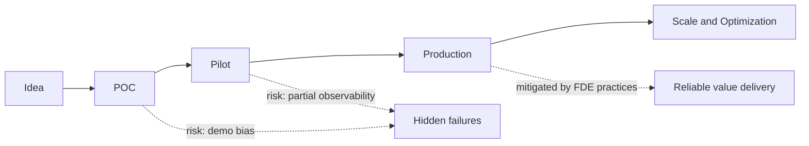
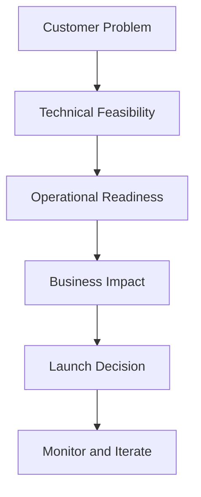

# Chapter 1 Slides: The FDE Mindset in AI Delivery

## Slide 1: Chapter Goal
- Understand what Forward Deployed Engineering means in AI delivery.
- Learn why production success requires more than model quality.
- Connect engineering decisions to business outcomes.

---

## Slide 2: Core Definition
**Forward Deployed Engineer (FDE):**
An engineer who works at the boundary of product, customer workflow, and production systems to ensure solutions deliver measurable outcomes in real environments.

**Key point:** FDEs own delivery risk, not only implementation.

---

## Slide 3: Acronyms
- **FDE**: Forward Deployed Engineer
- **POC**: Proof of Concept
- **KPI**: Key Performance Indicator
- **ROI**: Return on Investment
- **SLA**: Service Level Agreement
- **SLO**: Service Level Objective

---

## Slide 4: Concepts Explained
- **Prototype Success**: A demo works for curated inputs.
- **Production Success**: System consistently works under real traffic, data, and constraints.
- **Operational Ownership**: Team can monitor, debug, and recover from failures quickly.
- **Business Alignment**: Technical approach is justified by user impact and value.

---

## Slide 5: Delivery Maturity Model

---

## Slide 6: FDE Decision Framework

Use this flow for every major engineering choice.

---

## Slide 7: Practical Checklist
- What user decision improves because of this system?
- What can fail, and how quickly can we detect it?
- What rollback or fallback mode exists?
- Which KPI determines go/no-go?

---

## Slide 8: Chapter Summary
- FDE is a delivery role, not only a coding role.
- Production reliability is a design responsibility from day one.
- Business outcomes and technical design must stay connected.
