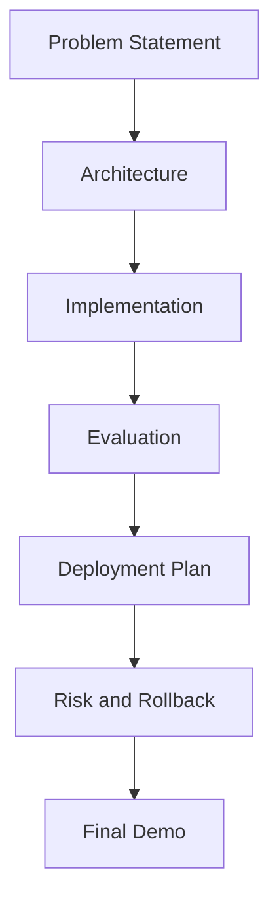
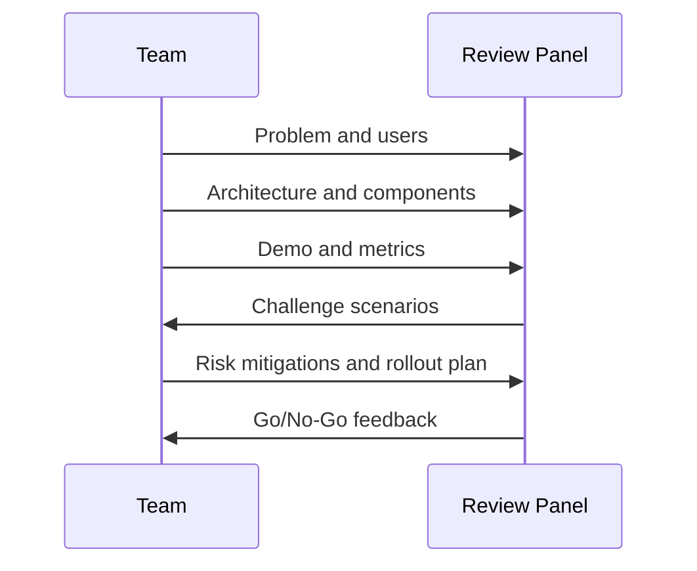

# Chapter 10 Slides: Capstone Build and Review

## Slide 1: Chapter Goal
- Deliver a production-minded agent end-to-end.
- Defend design choices with technical and business reasoning.
- Present launch readiness evidence.

---

## Slide 2: Core Definitions
- **Capstone**: Integrative project validating full learning outcomes.
- **Design Defense**: Structured justification of architecture choices.
- **Go/No-Go**: Decision checkpoint for launch readiness.
- **Risk Register**: Tracked list of risks, owners, and mitigations.

---

## Slide 3: Acronyms
- **MVP**: Minimum Viable Product
- **NFR**: Non-Functional Requirement
- **HLD**: High-Level Design
- **LLD**: Low-Level Design
- **KRI**: Key Risk Indicator

---

## Slide 4: Capstone Structure

---

## Slide 5: Review Rubric Concepts
- Architecture clarity and rationale.
- Failure-mode and safety handling.
- Eval completeness and observability.
- Deployment and operations readiness.
- Communication and stakeholder framing.

---

## Slide 6: Presentation Flow

---

## Slide 7: Concept Deep Dive
- **Readiness Evidence** should include measurable criteria.
- **Trade-off Transparency** builds trust with stakeholders.
- **Actionable Next Steps** matter more than perfect architecture.

---

## Slide 8: Chapter Summary
- Capstone validates production thinking, not only coding.
- Strong teams show evidence, risks, and operational plans.
- Delivery quality is judged by robustness and clarity.
