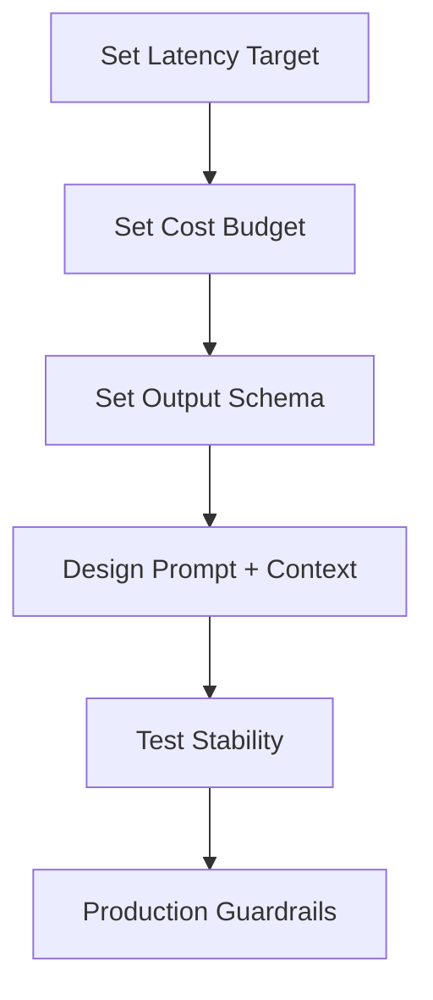
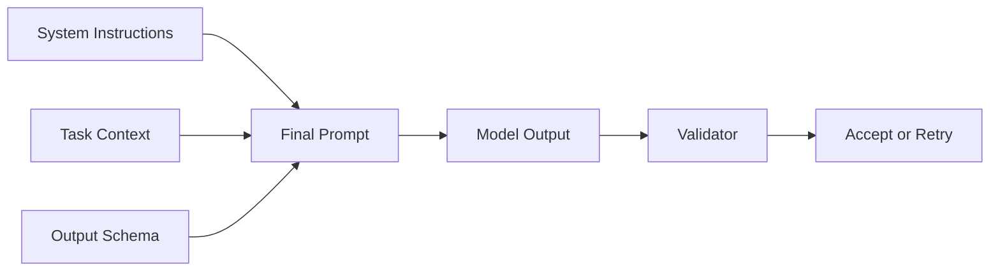

# Chapter 2 Slides: LLM Behavior and System Constraints

## Slide 1: Chapter Goal
- Understand model behavior under constraints.
- Design prompts and flows for reliability.
- Balance quality, latency, and cost.

---

## Slide 2: Core Definitions
- **Token**: Basic text unit consumed by model input/output.
- **Context Window**: Maximum token capacity for a request.
- **Determinism (practical)**: Degree to which outputs remain stable across runs.
- **Structured Output**: Response constrained to a schema for downstream automation.

---

## Slide 3: Acronyms
- **LLM**: Large Language Model
- **NLP**: Natural Language Processing
- **JSON**: JavaScript Object Notation
- **P95**: 95th percentile metric value
- **TPS**: Tokens per second

---

## Slide 4: Budget Trade-off Concept
Given total token limit $T$, prompt tokens $P$, completion tokens $C$:
$$P + C \le T$$
Increasing prompt context can reduce answer room and increase latency.

---

## Slide 5: Constraint-First Design

---

## Slide 6: Failure Patterns
- Long prompts dilute critical instructions.
- Missing output schema breaks parsers.
- No budget controls causes runaway cost.
- Variance in phrasing impacts downstream logic.

---

## Slide 7: Prompt Architecture Concept

---

## Slide 8: Chapter Summary
- Reliability starts with explicit constraints.
- Schema and validation reduce brittle behavior.
- Token economics is an engineering concern, not an afterthought.
