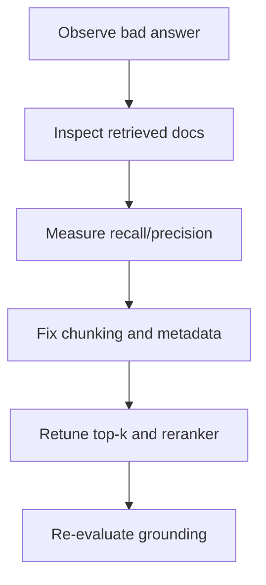

# Chapter 3 Slides: Retrieval and RAG Failure Modes

## Slide 1: Chapter Goal
- Diagnose RAG quality failures.
- Improve retrieval grounding and precision.
- Avoid blaming the model for retrieval problems.

---

## Slide 2: Core Definitions
- **RAG**: Retrieval-Augmented Generation; combines retrieval with model generation.
- **Embedding**: Vector representation of text meaning.
- **Recall**: Fraction of relevant items retrieved.
- **Precision**: Fraction of retrieved items that are relevant.

---

## Slide 3: Acronyms
- **RAG**: Retrieval-Augmented Generation
- **kNN**: k-Nearest Neighbors
- **ANN**: Approximate Nearest Neighbor
- **BM25**: A ranking function for lexical retrieval
- **Top-k**: Number of retrieved items returned

---

## Slide 4: RAG Pipeline

---

## Slide 5: Failure Taxonomy
- **Low Recall**: Relevant docs never returned.
- **Low Precision**: Returned docs are noisy.
- **Chunking Error**: Important context split or missing.
- **Index Drift**: Knowledge base stale vs current reality.

---

## Slide 6: Diagnostic Loop

---

## Slide 7: Concept Deep Dive
- **Chunk Size Trade-off**:
  - Larger chunks: more context, more noise.
  - Smaller chunks: cleaner context, risk of missing links.
- **Metadata Filters** improve precision by limiting search scope.
- **Reranking** improves document order before generation.

---

## Slide 8: Chapter Summary
- RAG reliability is mostly an information retrieval problem.
- Add explicit retrieval metrics in every evaluation cycle.
- Grounding quality should be measured before release.
