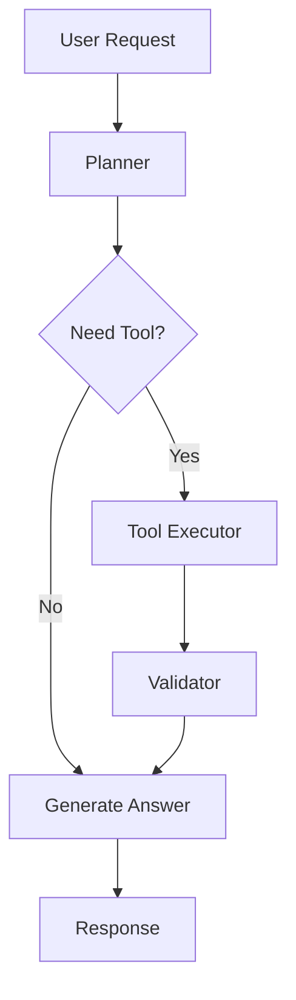
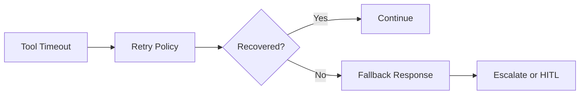

# Chapter 4 Slides: Tool Calling and Agent Control Loops

## Slide 1: Chapter Goal
- Build safe and deterministic tool-calling behavior.
- Understand planner-executor-validator agent loops.
- Handle tool failures without system collapse.

---

## Slide 2: Core Definitions
- **Tool Calling**: Invoking external functions/APIs from an agent.
- **Planner**: Component that decides next action.
- **Executor**: Component that runs selected tool/action.
- **Validator**: Component that checks output integrity and policy compliance.

---

## Slide 3: Acronyms
- **API**: Application Programming Interface
- **RPC**: Remote Procedure Call
- **TTL**: Time To Live
- **HITL**: Human In The Loop
- **RBAC**: Role-Based Access Control

---

## Slide 4: Control Loop

---

## Slide 5: Schema-Bound Tool Contract
- Define required fields and value ranges.
- Reject malformed arguments before execution.
- Enforce timeout and retry policy.
- Log request ID for traceability.

---

## Slide 6: Failure Handling Strategy

---

## Slide 7: Concept Deep Dive
- **Deterministic Boundary**: Keep tool outputs validated and typed.
- **Fallback Mode**: Provide safe partial answers when tools fail.
- **Escalation Policy**: Route high-risk operations to human review.

---

## Slide 8: Chapter Summary
- Tool calling increases capability and risk simultaneously.
- Contracts, validation, and fallbacks are mandatory.
- Control loops should be observable and auditable.
