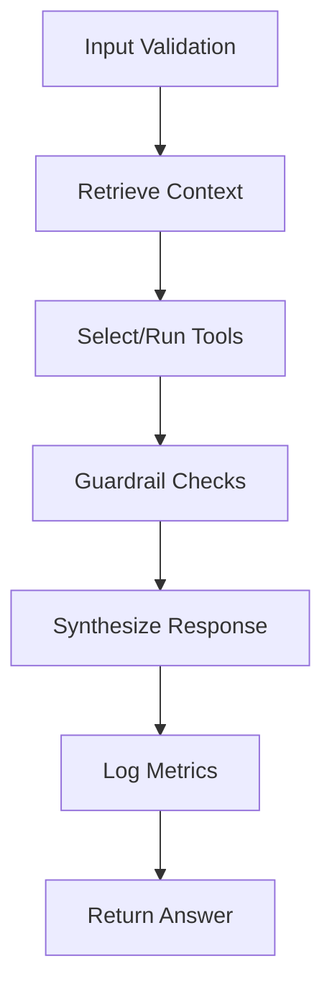
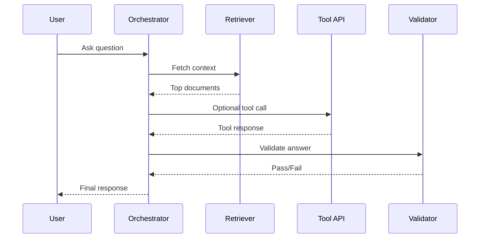

# Chapter 5 Slides: Building the End-to-End Agent

## Slide 1: Chapter Goal
- Integrate retrieval, tool usage, and synthesis.
- Implement resilience against partial failures.
- Produce source-backed actionable responses.

---

## Slide 2: Core Definitions
- **Orchestration**: Coordination of steps in the request lifecycle.
- **Context Assembly**: Merging retrieved facts and tool outputs.
- **Graceful Degradation**: Controlled quality reduction under failure.
- **Confidence Signal**: Score indicating answer trust level.

---

## Slide 3: Acronyms
- **SDK**: Software Development Kit
- **ETL**: Extract, Transform, Load
- **QA**: Quality Assurance
- **CI/CD**: Continuous Integration / Continuous Deployment

---

## Slide 4: End-to-End Lifecycle

---

## Slide 5: Data and Control Paths

---

## Slide 6: Concept Deep Dive
- **Partial Failure**: One subsystem fails while others remain healthy.
- **Resilience Pattern**: Continue with best available evidence.
- **Auditability**: Preserve traces for post-incident analysis.

---

## Slide 7: Minimum Production Metrics
- Request latency (median, P95).
- Retrieval hit quality.
- Tool success/timeout rate.
- Guardrail trigger rate.
- User-rated usefulness.

---

## Slide 8: Chapter Summary
- End-to-end quality depends on the weakest subsystem.
- Orchestration must include validation and observability.
- Production readiness requires measurable behavior.
