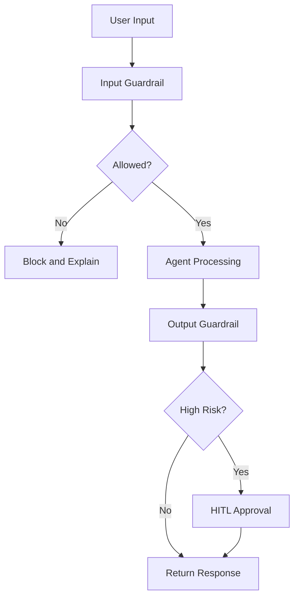
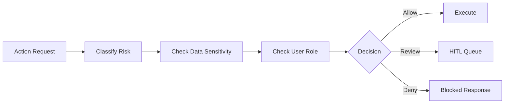

# Chapter 6 Slides: Guardrails, Safety, and Human Approval

## Slide 1: Chapter Goal
- Enforce safety boundaries for AI actions.
- Combine automated policies with human approval.
- Build auditable governance flow.

---

## Slide 2: Core Definitions
- **Guardrail**: Rule-based or model-based policy control on input/output.
- **Policy Violation**: Content/action that breaks legal, security, or business rules.
- **Escalation**: Routing decision to human review.
- **Redaction**: Removing sensitive information from content.

---

## Slide 3: Acronyms
- **HITL**: Human In The Loop
- **PII**: Personally Identifiable Information
- **DLP**: Data Loss Prevention
- **SOC**: Security Operations Center
- **GRC**: Governance, Risk, and Compliance

---

## Slide 4: Safety Pipeline

---

## Slide 5: Risk Tiering Concept
- **Low Risk**: Read-only summaries, auto-approve.
- **Medium Risk**: Notify and log strongly.
- **High Risk**: Require explicit human approval.

---

## Slide 6: Policy Decision Flow

---

## Slide 7: Concept Deep Dive
- **Defense in Depth**: Multiple checks reduce single-point policy failures.
- **Explainability in Blocking**: Users need clear reason and next step.
- **Audit Trail**: Every block, override, and approval must be recorded.

---

## Slide 8: Chapter Summary
- Guardrails are system architecture components.
- HITL is essential for high-impact actions.
- Safety controls should be measurable and testable.
