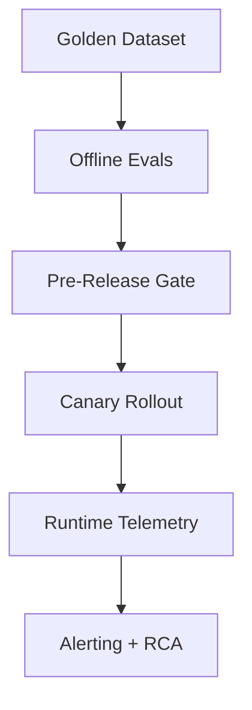
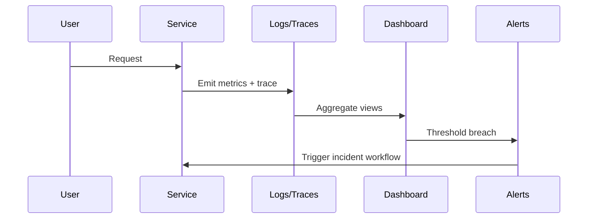

# Chapter 7 Slides: Evaluation and Observability

## Slide 1: Chapter Goal
- Create reliable evaluation programs.
- Monitor behavior in production continuously.
- Detect regressions early.

---

## Slide 2: Core Definitions
- **Evaluation (Eval)**: Systematic measurement of model/system behavior.
- **Golden Set**: Curated test set with expected outcomes.
- **Observability**: Ability to understand internal system behavior from outputs and telemetry.
- **Regression**: Performance decline after change or drift.

---

## Slide 3: Acronyms
- **SLO**: Service Level Objective
- **SLI**: Service Level Indicator
- **MTTR**: Mean Time To Recovery
- **A/B Test**: Controlled comparison of two variants
- **RCA**: Root Cause Analysis

---

## Slide 4: Evaluation Stack

---

## Slide 5: Metric Types
- **Quality**: grounded answer rate, correctness.
- **Reliability**: timeout rates, error rates.
- **Performance**: median and P95 latency.
- **Cost**: token usage per request.

---

## Slide 6: Observability Flow

---

## Slide 7: Concept Deep Dive
- **Leading Indicators** detect risk before failure spikes.
- **Error Taxonomy** speeds debugging by category.
- **Release Gates** prevent low-quality changes from reaching users.

---

## Slide 8: Chapter Summary
- Evals are continuous, not one-time.
- Observability enables faster diagnosis and safer iteration.
- Define quality thresholds before deployment.
