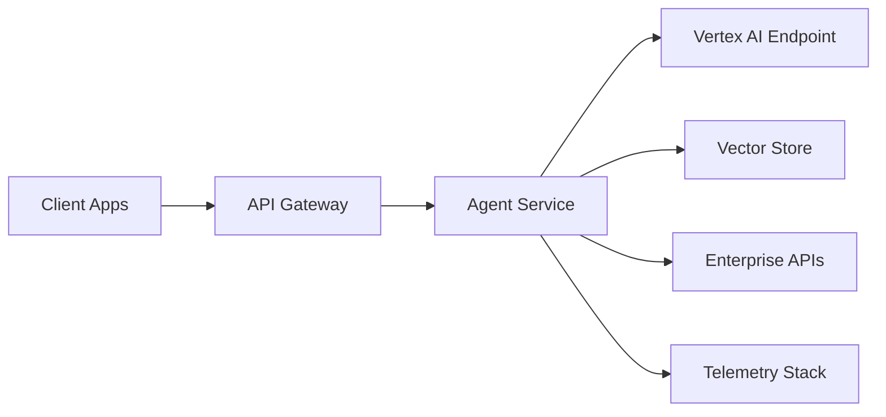
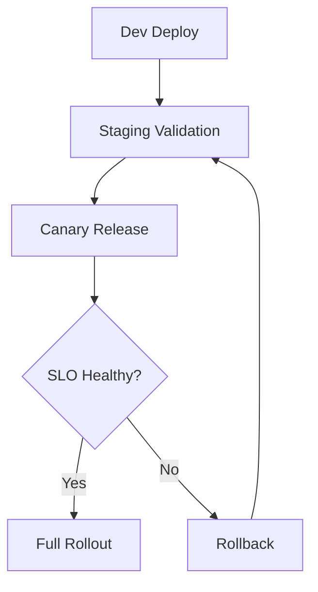

# Chapter 8 Slides: Deployment on GCP and Vertex AI

## Slide 1: Chapter Goal
- Choose deployment architecture for reliability and scale.
- Understand endpoint and API design patterns.
- Apply cost, latency, and security trade-offs.

---

## Slide 2: Core Definitions
- **Endpoint**: Network address serving model inference.
- **Inference**: Model execution for prediction/generation.
- **Autoscaling**: Dynamic resource adjustment based on load.
- **Canary Release**: Gradual rollout to a subset of traffic.

---

## Slide 3: Acronyms
- **GCP**: Google Cloud Platform
- **VPC**: Virtual Private Cloud
- **IAM**: Identity and Access Management
- **CDN**: Content Delivery Network
- **QPS**: Queries Per Second

---

## Slide 4: Reference Deployment Architecture

---

## Slide 5: Trade-off Matrix Concept
- Lower latency often increases infra cost.
- Higher reliability needs retries, redundancy, and caching.
- Stronger security controls can add operational complexity.

---

## Slide 6: Release Lifecycle

---

## Slide 7: Concept Deep Dive
- **Service Identity** controls least-privilege access.
- **Rate Limiting** protects against abuse and cost spikes.
- **Circuit Breakers** prevent cascading failures.

---

## Slide 8: Chapter Summary
- Deployment is a reliability design problem.
- Architecture should be scenario-driven, not tool-driven.
- Operability must be included from day one.
