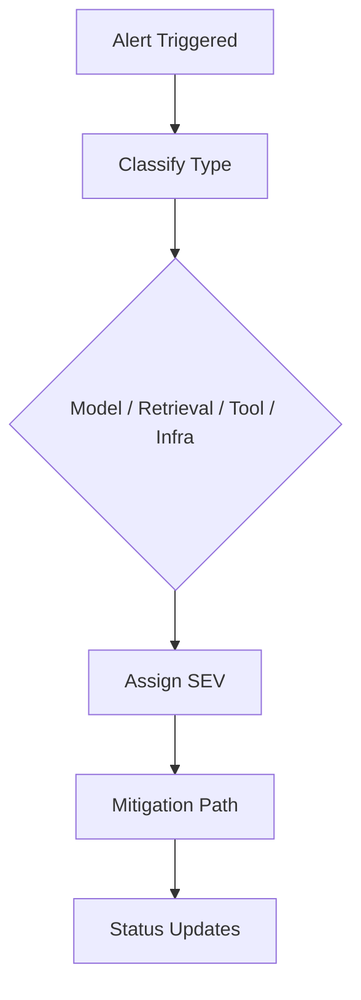
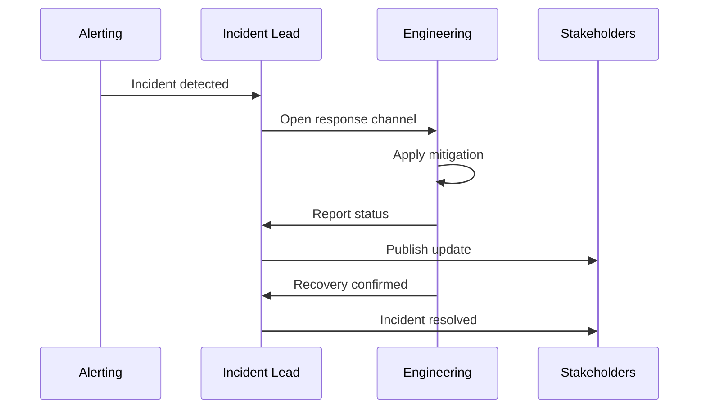

# Chapter 9 Slides: Production Incident Playbooks

## Slide 1: Chapter Goal
- Respond rapidly and safely to production incidents.
- Classify incident type and severity.
- Use structured communication and recovery flows.

---

## Slide 2: Core Definitions
- **Incident**: Unplanned event causing service degradation.
- **Blast Radius**: Scope of affected users/systems.
- **Fallback Mode**: Safe degraded operation when core path fails.
- **Postmortem**: Structured review of incident causes and actions.

---

## Slide 3: Acronyms
- **MTTD**: Mean Time To Detect
- **MTTR**: Mean Time To Recovery
- **SEV**: Severity level
- **RCA**: Root Cause Analysis
- **CAPA**: Corrective and Preventive Actions

---

## Slide 4: Incident Classification

---

## Slide 5: First 30 Minutes Protocol
1. Confirm impact and affected workflows.
2. Activate fallback mode.
3. Stabilize user-facing behavior.
4. Communicate clear status and ETA.

---

## Slide 6: Response Workflow

---

## Slide 7: Concept Deep Dive
- **Triage before deep diagnosis** to reduce user impact fast.
- **Runbooks** reduce cognitive load under pressure.
- **Communication quality** is part of incident quality.

---

## Slide 8: Chapter Summary
- Incident response requires predefined roles and steps.
- Fallback and rollback plans must be rehearsed.
- Postmortems convert incidents into system improvements.
